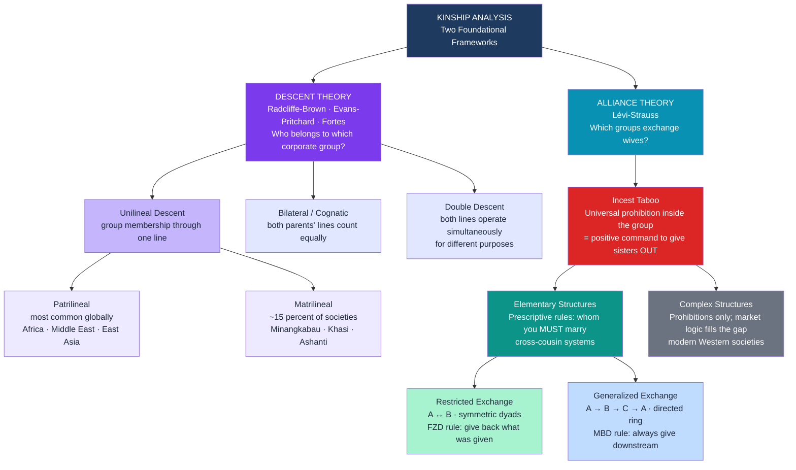

# Kinship, Marriage, and Family Systems

> [!abstract] TL;DR
> Kinship is the grammar of human social life — every known society organizes descent, marriage, and household membership through explicit rules that determine who counts as a relative, whom you may or must marry, and where you live. Two rival anthropological frameworks explain why these rules take the forms they do: descent theory asks "which corporate group do you belong to?" while alliance theory asks "which groups are allied through wife-exchange?" Together they explain an enormous diversity of systems — from the segmentary lineages of the Nuer to cross-cousin marriage among the Dravidians — through a small set of structural principles.

---

## Intuition

**Analogy:** Imagine every person in a society is a node in a directed network. Kinship rules are the algorithm that determines which edges exist, in which direction, and what obligations they carry. Two different algorithms — "always send your sister to the next group in the ring" vs. "always send her back to the group you got a wife from" — produce radically different network topologies over generations: one binds all groups into a single integrated cycle, the other creates isolated reciprocal pairs. The algorithm is the marriage rule; the network topology is the social structure.

Descent rules determine which existing edges you inherit from birth (your lineage). Marriage rules determine which new edges are forged each generation. The incest taboo is not merely a prohibition — Lévi-Strauss called it a positive rule in negative form: by forbidding marriage inside the group, it compels alliances outside it. The social fabric is woven, one marriage at a time, by rules that pre-date any individual decision.

---

## How It Works



---

## Key Concepts

### Secondary Level

**What kinship systems actually do**

Kinship systems simultaneously answer three questions:
1. **Who are your relatives?** (descent rules — determines corporate group membership, inheritance, identity)
2. **Whom may or must you marry?** (alliance rules — determines which groups are united or kept separate)
3. **Where does a couple live?** (residence rules — determines whose kin network the household is embedded in)

Change any one answer and everything else shifts: inheritance patterns, childcare obligations, political alliances between villages, and even who has authority over a child (in matrilineal systems, the mother's brother, not the biological father, typically holds jural authority over his sister's sons).

**Descent rules:**

| Rule | Membership transmitted through | Classic examples |
|------|-------------------------------|-----------------|
| Patrilineal | Father's line exclusively | Zulu, Bedouin, Han Chinese, most of the Middle East |
| Matrilineal | Mother's line exclusively | Minangkabau (W. Sumatra), Khasi (India), Ashanti (Ghana), Hopi (US) |
| Bilateral / Cognatic | Both parents equally | Euro-American industrial societies, most forager bands |
| Double descent | Patrilineal AND matrilineal simultaneously for different property types | Yako (Nigeria) — land via patriline, moveable goods via matriline |

**Marriage forms:**

| Form | Definition | Notes |
|------|-----------|-------|
| Monogamy | One spouse at a time | Universal legal norm today; historically uncommon as exclusive ideal |
| Sororal polygyny | One man, two or more sisters as wives | Reduces household jealousy; common in many African societies |
| Non-sororal polygyny | One man, unrelated wives | More status competition between wives |
| Fraternal polyandry | One woman, two or more brothers | Classic case: Tibet — keeps scarce farmland from being subdivided |
| Group marriage | Multiple men and women in a shared union | Extremely rare; ethnographic reports often reflect outside observers' misunderstandings |

**Bridewealth, dowry, and bride service:**

- **Bridewealth** (*lobola*): goods (cattle, cash) transferred from groom's kin to bride's kin. Dominant in sub-Saharan Africa. Compensates the bride's lineage for the loss of her reproductive and productive labour; validates the marriage and gives the husband's lineage jural rights over children. Not "buying a wife" — the transaction creates and formalizes inter-group alliances.
- **Dowry**: property transferred from bride's family to the new conjugal household (or groom's family). Dominant in Eurasia. Associated with hypergamy (women marrying up) and class stratification — dowry is essentially an inter vivos inheritance given at marriage.
- **Bride service**: groom works for bride's family for a defined period before the couple can live independently. Common among foragers (e.g. !Kung San). Allows poorer men to "pay" for a wife through labour.

---

### Undergraduate Level

**Descent theory in depth: lineages, clans, and segmentary opposition**

In unilineal descent systems, individuals are born into permanent corporate groups with names, property, and collective ritual identity:

- **Lineage**: a descent group whose members can trace their connection to a common ancestor through a known genealogy. Acts as a corporate group: jointly owns land, collectively responsible for members' debts and offenses, venerates shared ancestors.
- **Clan**: a larger descent group claiming common ancestry but without traceable genealogical links. Often named after a totemic animal or plant.

Evans-Pritchard's study of the **Nuer** (Sudan) produced the definitive account of **segmentary lineage systems**. The Nuer have no chiefs or formal government. Order is maintained through the principle of **complementary opposition**: the relevant group that acts together depends entirely on who the opponent is:

> *"I against my brother; I and my brother against our cousin; I, my brother, and our cousin against the next village; and all of us against the stranger."*

At each level of genealogical distance, a wider kin group assembles to face a wider external opposition. The same person who was your adversary in a local dispute becomes your ally the moment a more distant enemy appears. This is kinship as a political system, generating order without hierarchy through nested segmentary groups.

**Alliance theory: Lévi-Strauss and the exchange of women**

In *The Elementary Structures of Kinship* (1949), Claude Lévi-Strauss argued that kinship is fundamentally about **exchange**, not descent. The incest taboo does not just prohibit — it commands. By forbidding a man to retain his sister, it forces him to give her to another group and thereby creates a social bond where none existed before. Reciprocity — the logic of the gift — is the foundation of human sociality.

*Women as signs in circulation:* Lévi-Strauss made the structuralist claim that women circulate between groups as "signs" in a communication system. Groups "speak" to each other through the exchange of women, just as they exchange words and goods. This claim became one of the most contested in anthropological theory — feminist critics (Gayle Rubin, "The Traffic in Women," 1975) argued that the theory naturalizes male control over women's sexuality and treats women as passive objects rather than subjects.

**Elementary vs. complex structures:**

- **Elementary structures**: systems where positive marriage rules prescribe *whom you must marry* (or at least which category of person). Typically encoded as cross-cousin marriage.
- **Complex structures**: systems with only prohibitions (you must not marry within your lineage, your clan, your village) but no positive prescription. A "marriage market" with individual choice fills the structural gap. Most modern Western societies are complex structures.

**Cross-cousin marriage — MBD vs. FZD:**

The two main types of cross-cousin marriage produce fundamentally different alliance networks in patrilineal societies:

| Rule | Who ego marries | Lévi-Strauss's term | Network topology |
|------|----------------|---------------------|-----------------|
| **MBD** (matrilateral) | Mother's Brother's Daughter | Generalized exchange | Directed ring: A→B→C→A — all groups integrated in one cycle |
| **FZD** (patrilateral) | Father's Sister's Daughter | Restricted exchange | Symmetric dyads: A↔B — closed bilateral pairs |

In a patrilineal system under MBD rule: ego (clan A) marries into clan B because his mother came from B, so her brother's daughter is still in B. B's men take wives from C, C's from D, and so on until the circle closes. This creates an asymmetric, long-range alliance network with higher solidarity potential — but also higher risk, since you cannot immediately verify reciprocity. Under FZD rule: the gift returns in the next generation. A gave a woman to B; B's son now marries A's daughter. This is balanced and verifiable but produces no broader integration beyond the dyad.

Lévi-Strauss considered MBD ("matrilateral") exchange both more common and sociologically more powerful because it creates chains of mutual obligation across many groups rather than isolating pairs.

**Morgan's six kinship terminologies**

Lewis Henry Morgan (1871) discovered that languages classify kin very differently, and that these classifications encode social structure. He identified six types that remain the standard framework:

| Type | Distinguishing feature | Diagnostic test | Correlates with |
|------|----------------------|----------------|----------------|
| **Eskimo** (Euro-American) | Nuclear family isolated; collaterals merged | "Uncle" = father's brother = mother's brother | Bilateral descent, neolocal residence, nuclear family |
| **Hawaiian** (generational) | All same-generation kin merged by sex | "Mother" = all women of mother's generation | Cognatic descent; emphasizes generation, not lineage |
| **Iroquois** (bifurcate merging) | Parallel cousins = siblings; cross-cousins = marriageable | Father's brother's son = "brother"; mother's brother's son = "cousin" | Unilineal descent (either); enables cross-cousin marriage |
| **Crow** (matrilineal skewing) | Father's matrilineage merged across generations | Father and father's brother's son = same term | Matrilineal descent; father's sisters' children skewed "upward" |
| **Omaha** (patrilineal skewing) | Mother's patrilineage merged across generations | Mother's brother and mother's brother's son = same term | Patrilineal descent; mother's brothers' children skewed "upward" |
| **Sudanese** (descriptive) | Every relative has a unique term | Distinguishes father's brother from mother's brother explicitly | Strong clan boundaries; often complex hierarchical stratification |

The Crow and Omaha systems are particularly revealing: Crow lumps the father and his matrilineal nephew under one term because from the perspective of ego's matrilineage, all members of the father's matriline are in a single category regardless of generation. Omaha does the mirror image for the mother's patriline. Terminologies are not arbitrary labels — they encode which relatives can be equated socially and which must be distinguished.

---

### Graduate Level

**The incest taboo: four competing theories**

The incest taboo — the prohibition on sexual relations with close kin — is universal in the sense that every society has *some* version of it, yet the specific content varies enormously (first-cousin marriage is obligatory in some societies, incestuous in others). Four major theories explain its origin and function:

1. **Westermarck effect** (Edward Westermarck, 1891): people raised together in early childhood develop a lifelong sexual aversion to each other, regardless of biological relatedness. Kibbutz studies (Shepher, 1983) and studies of Chinese *sim-pua* marriages (Wolf, 1970) — where girls are raised in their future husband's household from infancy — both show strikingly low marital satisfaction and high adultery rates compared to normal-choice marriages. The taboo may codify and enforce a psychological aversion that has evolved via kin selection to prevent inbreeding depression.

2. **Alliance theory** (Lévi-Strauss): the taboo is a sociological rule, not a psychological one. Its content (who counts as "kin") is set by social categories, not biology. The taboo's function is to compel outmarriage and thereby force the creation of inter-group alliances. This explains why the taboo's boundaries shift cross-culturally: the prohibition extends as far as the relevant social unit that must exchange.

3. **Psychoanalytic theory** (Freud): the taboo represses a primal sexual desire (the Oedipus/Electra complex) that must be suppressed for civilization to function. The taboo is a cultural achievement won against instinct, not an expression of it. Few contemporary anthropologists find this account empirically defensible — Westermarck's data directly contradict Freud's assumption that desire naturally runs toward family members.

4. **Biosocial / inclusive fitness** (W.D. Hamilton, 1964): Hamilton's rule (*rB > C*) predicts cooperation among kin in proportion to genetic relatedness (*r*). Avoiding inbreeding is adaptive because inbreeding exposes deleterious recessive alleles. Natural selection should have favored psychological mechanisms (the Westermarck effect being the leading candidate) that generate aversion to sex with close biological kin. The universality of the taboo reflects a convergent biological-cultural solution to the inbreeding problem.

Current consensus: the Westermarck effect is the likely psychological mechanism; alliance theory best explains the *social elaboration* and variable content of the taboo (why some first cousins are forbidden and others prescribed); inclusive fitness provides the evolutionary backstory.

**Segmentary lineage and political order without the state**

Evans-Pritchard's Nuer work, and Meyer Fortes's parallel study of the Tallensi (Ghana), established a crucial point for political anthropology: highly ordered, complex social life is possible without any central authority if lineage-based segmentary opposition provides a self-regulating mechanism for conflict resolution. This challenged the assumption that "stateless" societies must be chaotic.

The mechanism: at each level of the lineage hierarchy, feuds or disputes trigger a fusion of smaller segments against a common opponent, and a corresponding fission when the threat dissolves. Feud and alliance are not pathologies of kinship but its normal functioning. This "ordered anarchy" depends on every actor knowing their genealogical position precisely — the genealogy is the constitution.

**Structural analysis of kinship: the atom of kinship**

Lévi-Strauss's most abstract contribution is the claim that the minimal unit of kinship is not the conjugal pair but the *relation between four positions*: brother (B), sister (Z), husband (H), and son (S). He called this the **avunculate** or "atom of kinship": the relationship between a man and his sister's son is always the inverse of the relationship between the man and his own son. Where the father-son relationship is intimate and warm, the uncle-nephew relationship is distant and authoritarian (and vice versa). This structural inverse holds cross-culturally and reflects the fundamental tension between the descent bond and the alliance bond that runs through all kinship systems.

**Kinship in the 21st century: challenging the natural basis**

Late 20th- and early 21st-century changes have decoupled kinship from its assumed biological and heteronormative foundations:

- **Donor conception and surrogacy**: a child can now have up to five "parents" by different criteria — genetic mother, gestational mother, legal mother, genetic father, social father. Which counts as "real"? Janet Carsten's concept of **relatedness** (2000) argues kinship is partly *made* through practices of living together, feeding, and caring — not only given by nature.
- **LGBTQ families**: same-sex couples parent children through adoption, donor insemination, surrogacy, or prior heterosexual relationships. The "chosen family" concept (common in LGBTQ communities) formalizes non-biological kin networks as functionally equivalent to descent-based ones.
- **Transnational adoption**: creates kinship across national, racial, and cultural lines, raising questions about identity and the cultural transmission functions of family.
- **Assisted reproductive technologies**: egg and sperm donation, embryo adoption, and artificial wombs progressively separate the five components of parenthood (genetic, gestational, legal, intentional, social). Law and culture are still catching up with biology.

These developments have renewed the classical anthropological debate: is kinship grounded in "facts of nature" (blood, genes) or in cultural construction? Marilyn Strathern and David Schneider's *Critique of the Study of Kinship* (1984) argued that Western anthropology had illegitimately universalized the Euro-American folk model of biological relatedness. Contemporary kinship studies take both nature and culture seriously without reducing one to the other.

---

## Python Demo

This simulation models cross-cousin marriage exchange across 6 patrilineal clans over 10 generations. It demonstrates how the MBD rule (generalized exchange) weaves all clans into a single directed ring, while the FZD rule (restricted exchange) isolates them in symmetric dyads — and quantifies the structural difference through reachability analysis.

```python
import numpy as np
import matplotlib.pyplot as plt

np.random.seed(42)

N = 6                   # six patrilineal clans
CLANS = list("ABCDEF")


def simulate_marriages(rule, n_generations=10, marriages_per_gen=5):
    """
    Build a cumulative wife-flow matrix over n_generations.
    flow[i, j] = total wives given FROM clan i TO clan j.

    MBD (matrilateral cross-cousin): ego marries mother's brother's daughter.
    In a patrilineal system ego's mother came from another clan; her brother's
    daughter is in THAT clan.  The rule fixes direction: clan i always gives
    brides to the SAME downstream clan -> directed ring A->B->C->D->E->F->A
    (Levi-Strauss: "generalized exchange").

    FZD (patrilateral cross-cousin): ego marries father's sister's daughter.
    The father's sister left clan i to marry elsewhere; her daughter is in that
    other clan.  Each generation the gift comes back ->
    symmetric dyads A<->B, C<->D, E<->F
    (Levi-Strauss: "restricted exchange").
    """
    flow = np.zeros((N, N), dtype=float)
    if rule == "MBD":
        for _ in range(n_generations):
            for i in range(N):
                flow[i, (i + 1) % N] += np.random.poisson(marriages_per_gen)
    elif rule == "FZD":
        pairs = [(0, 1), (2, 3), (4, 5)]
        for _ in range(n_generations):
            for a, b in pairs:
                flow[a, b] += np.random.poisson(marriages_per_gen)
                flow[b, a] += np.random.poisson(marriages_per_gen)
    return flow


def clans_reachable(flow, max_steps=N):
    """
    BFS: for each starting clan, how many other clans are reachable within
    k directed wife-exchange steps?  Returns mean across all clans at each k.
    """
    adj = flow > 0
    avg = []
    for steps in range(1, max_steps + 1):
        reach_counts = []
        for start in range(N):
            visited = {start}
            frontier = {start}
            for _ in range(steps):
                nxt = {nb for node in frontier
                       for nb in range(N)
                       if adj[node, nb] and nb not in visited}
                visited |= nxt
                frontier = nxt
            reach_counts.append(len(visited) - 1)   # exclude start itself
        avg.append(np.mean(reach_counts))
    return np.array(avg)


def draw_exchange_network(ax, flow, title, arrow_color):
    """Draw a circular directed-graph of wife-flow between clans."""
    angles = np.linspace(np.pi / 2, 5 * np.pi / 2, N, endpoint=False)
    pos = np.column_stack([np.cos(angles), np.sin(angles)])
    max_w = flow.max() if flow.max() > 0 else 1

    for i in range(N):
        for j in range(N):
            if flow[i, j] > 0:
                xi, yi = pos[i]
                xj, yj = pos[j]
                dx, dy = xj - xi, yj - yi
                dist = np.hypot(dx, dy)
                lw = 1.0 + 2.5 * flow[i, j] / max_w
                ax.annotate(
                    "",
                    xy=(xj - 0.15 * dx / dist, yj - 0.15 * dy / dist),
                    xytext=(xi + 0.15 * dx / dist, yi + 0.15 * dy / dist),
                    arrowprops=dict(
                        arrowstyle="-|>", color=arrow_color,
                        lw=lw, mutation_scale=15, alpha=0.8,
                    ),
                    zorder=2,
                )
    for i, (x, y) in enumerate(pos):
        ax.add_patch(plt.Circle((x, y), 0.15, color="#1e3a5f", zorder=3))
        ax.text(x, y, CLANS[i], ha="center", va="center",
                fontsize=11, fontweight="bold", color="white", zorder=4)

    ax.set_xlim(-1.65, 1.65)
    ax.set_ylim(-1.65, 1.65)
    ax.set_aspect("equal")
    ax.axis("off")
    ax.set_title(title, fontweight="bold", fontsize=10, pad=8)


# ── Run ──────────────────────────────────────────────────────────────
mbd_flow = simulate_marriages("MBD", n_generations=10)
fzd_flow = simulate_marriages("FZD", n_generations=10)

fig, axes = plt.subplots(1, 3, figsize=(16, 5))
fig.suptitle(
    "Cross-Cousin Marriage Rules and Long-Run Alliance Network Structure\n"
    "Arrows = direction of wife-giving  |  6 patrilineal clans, 10 generations",
    fontsize=12, fontweight="bold",
)

draw_exchange_network(
    axes[0], mbd_flow,
    "MBD — Matrilateral Cross-Cousin\n(Mother's Brother's Daughter)\n"
    "Levi-Strauss: Generalized Exchange\nDirected ring A->B->C->D->E->F->A",
    "#10b981",
)
draw_exchange_network(
    axes[1], fzd_flow,
    "FZD — Patrilateral Cross-Cousin\n(Father's Sister's Daughter)\n"
    "Levi-Strauss: Restricted Exchange\nSymmetric dyads A<->B, C<->D, E<->F",
    "#ef4444",
)

# Panel 3: reachability over marriage-chain steps
mbd_reach = clans_reachable(mbd_flow, max_steps=N)
fzd_reach = clans_reachable(fzd_flow, max_steps=N)
steps = np.arange(1, N + 1)

axes[2].plot(steps, mbd_reach, "o-", color="#10b981", lw=2.5, ms=8,
             label="MBD — generalized exchange")
axes[2].plot(steps, fzd_reach, "s--", color="#ef4444", lw=2.5, ms=8,
             label="FZD — restricted exchange")
axes[2].axhline(N - 1, color="#9ca3af", lw=1.2, linestyle=":",
                label=f"Maximum ({N - 1} other clans reachable)")
axes[2].set_xlabel("Marriage-chain steps (generations of links)")
axes[2].set_ylabel("Avg. other clans reachable per starting clan")
axes[2].set_title(
    "Societal Integration:\nHow Many Clans Can You Reach?",
    fontweight="bold", fontsize=10,
)
axes[2].set_xticks(steps)
axes[2].legend(fontsize=8)
axes[2].grid(alpha=0.3, linestyle="--")
axes[2].set_ylim(-0.2, N - 0.5)

plt.tight_layout()
plt.savefig("marriage_exchange_networks.png", dpi=120, bbox_inches="tight")
plt.show()

# ── Console summary ───────────────────────────────────────────────────
print("=== MBD Generalized Exchange (directed ring) ===")
for i in range(N):
    for j in range(N):
        if mbd_flow[i, j] > 0:
            print(f"  Clan {CLANS[i]} -> Clan {CLANS[j]}: {int(mbd_flow[i, j])} wives")

print("\n=== FZD Restricted Exchange (symmetric dyads) ===")
for i in range(N):
    for j in range(i + 1, N):
        if fzd_flow[i, j] > 0 or fzd_flow[j, i] > 0:
            print(f"  Clan {CLANS[i]} <-> Clan {CLANS[j]}: "
                  f"{int(fzd_flow[i, j])} (A->B) / {int(fzd_flow[j, i])} (B->A)")

print(f"\n=== Societal integration at step {N} ===")
print(f"  MBD: {mbd_reach[-1]:.1f}/{N - 1} clans reachable (fully integrated ring)")
print(f"  FZD: {fzd_reach[-1]:.1f}/{N - 1} clans reachable (isolated dyads)")
```

**What to observe:** Panel 3 is the key result. Under the MBD rule, reachability grows by one clan per step until all five other clans are reachable after five marriage-chain steps — every clan is woven into a single interdependent network. Under the FZD rule, reachability stays permanently at 1: each clan can only reach its symmetric partner, no matter how many generations pass. This is Lévi-Strauss's structural argument made computational: the same prescriptive marriage rule, applied consistently, produces either a society-wide web of mutual obligation or a collection of isolated, self-sufficient dyads.

---

## Real-World Applications

**1. The Nuer of South Sudan: segmentary lineage as governance**

Evans-Pritchard's *The Nuer* (1940) documented a society of roughly 200,000 people living without chiefs, courts, police, or formal government. The only political institution was the segmentary patrilineal lineage system. When a man from lineage A killed a man from lineage B, the entire maximal lineage of B mobilized against the entire maximal lineage of A — then settled via cattle compensation negotiated by "leopard-skin chiefs" (ritual specialists with no coercive power). The system produced neither anarchy nor tyranny, but ordered feud management through the graduated mobilization of kin solidarity.

**2. Dravidian kinship in South India: alliance theory in practice**

Among Tamil-speaking communities in South India, cross-cousin marriage (MBD or bilateral cross-cousin) is not merely permitted but strongly preferred and, in some communities, normatively obligatory. The terminology reflects this: a man uses the same word for his wife and his female cross-cousin, and a different word for his sister and parallel cousin. Marriage is understood as the renewal of a permanent alliance between two lineage lines — not a new bond between individuals, but the continuation of a multigenerational contract between groups. This is elementary structure in Lévi-Strauss's sense: the social function of marriage is to reproduce the alliance network, not to form a new conjugal unit from scratch.

**3. Matrilineal Minangkabau: the world's largest matrilineal society**

The Minangkabau of West Sumatra (~6 million people) are both predominantly Muslim and strictly matrilineal. Ancestral land (the *pusaka*) descends through the female line and is managed by the eldest woman's brother on behalf of the sisters and their children. Men are technically guests in their wives' households — their primary obligations (including inheritance authority) run to their sisters' children, not their own. At the same time, Islamic law governs individually acquired property, creating a dual system that has coexisted for centuries. The Minangkabau demonstrate that matrilineal descent and male political authority are fully compatible — a standing refutation of the equation of matriliny with matriarchy.

**4. Fraternal polyandry in Tibet: land scarcity drives marriage rule**

Among Tibetan and Himalayan communities practicing fraternal polyandry, two or more brothers share a single wife and together manage a single household and farm. The ecological explanation (Goldstein, 1971) is that arable land is so scarce that dividing a farm between brothers on each generation would make all farms unviable within a few generations. Polyandry keeps the estate intact. The institution is culturally normalized and reported as subjectively acceptable by participants — undermining any assumption that monogamy is the natural default for marriage.

---

## Common Pitfalls

- **Matrilineal = matriarchal** — the most persistent confusion in non-specialist discussions. Matrilineal descent traces corporate group membership through women; political authority in most matrilineal societies is still exercised by men, but through the *maternal* line (a man holds authority over his sisters' sons, not his own sons). Matriarchy — women exercising formal political authority — is almost entirely undocumented as a stable social system.

- **Treating bridewealth as "buying a wife"** — bridewealth is a transaction between corporate groups that creates and validates inter-lineage obligations. It establishes the husband's group's rights over future children, compensates the wife's group for her productive and reproductive contribution, and is returned (partially) in cases of divorce. Reading it through a commodity lens misses its social architecture.

- **Assuming the incest taboo is about biology** — the specific content of incest taboos is culturally variable in ways that cannot be explained by inbreeding genetics alone. First-cousin marriage is prescribed in some societies and tabooed in others; the Westermarck effect operates via childhood co-residence regardless of biological relatedness. The taboo's social function (alliance creation) and its psychological mechanism (Westermarck aversion) are distinct explanatory levels that should not be conflated.

- **Applying Western kinship terms cross-culturally** — English has one word for "uncle" (father's brother and mother's brother); in an Omaha system these are entirely different social positions with different rights and obligations. Translating kinship categories through English destroys the structural distinctions the original system encodes. Morgan's typology exists precisely to make cross-cultural comparison possible without this translation distortion.

- **Confusing prescriptive with preferential marriage rules** — prescriptive rules *define* a kinship category that ego must marry (e.g., "you must marry your MBD"). Preferential rules say you *may* and *preferably should* marry within a category but are not obligated. Many societies described in the ethnographic literature as "cross-cousin marriage societies" actually have preferential rather than prescriptive rules; conflating them exaggerates the rigidity of elementary structures.

- **Lévi-Strauss's "women as signs" claim** — while structurally powerful, the claim that women circulate as signs between groups reducing women to objects of exchange has been forcefully critiqued by feminist anthropologists. Gayle Rubin's "sex/gender system" framework, Janet Carsten's work on "relatedness," and Eleanor Leacock's ethnohistorical work all push back on the androcentric bias in classical alliance theory without abandoning its structural insights.

---

## Related Concepts

- [[_MOC_Culture_Society_and_Religion|↑ Culture, Society and Religion MOC]]
- [[Family_Marriage_and_Kinship]] — the Sociology vault treatment of the same domain: functionalism (Murdock, Parsons), feminist critique (Engels, Hochschild), second demographic transition, and the pure relationship (Giddens); read alongside this note for the disciplinary contrast between sociological and anthropological framings
- [[Classical_Anthropological_Theory]] — Morgan's original typology of kinship terminologies (*Ancient Society*, 1877) and the evolutionary framework Lévi-Strauss critiqued; also covers Mauss's *Essay on the Gift*, the foundational text for alliance theory's concept of reciprocal exchange
- [[Functionalism_and_Structural_Functionalism]] — Radcliffe-Brown's descent theory, Malinowski's Trobriand kinship studies, and Evans-Pritchard's segmentary lineage analysis all emerge from this theoretical framework; provides the structural-functionalist foundation that Lévi-Strauss's alliance theory was partly a reaction against
- [[Attachment_Theory]] — Bowlby and Ainsworth's theory of infant-caregiver bonding; the cross-cultural variation in family structure that kinship anthropology documents raises questions about whether secure attachment requires a specific family form or is achievable across diverse kinship configurations
- [[Nash_Equilibrium]] — marriage in elementary-structure societies can be modeled as a repeated coordination game; alliance theory's exchange cycles are stable Nash equilibria in a multi-clan marriage market, explaining why prescriptive rules persist without enforcement — deviation from the MBD rule breaks the cycle and destroys the clan's alliance network
- [[Prosocial_Behavior]] — Hamilton's inclusive fitness rule (*rB > C*) provides the evolutionary substrate for the kin-based altruism that lineage systems institutionalize; the Westermarck effect is one of the most empirically robust examples of evolved prosocial psychology calibrated to genetic relatedness

---

## Review Questions

### Secondary

1. What is the difference between a matrilineal and a patrilineal descent system? In a matrilineal society, who typically holds authority over a man's children — the man himself or his wife's brother? Why?
2. Lévi-Strauss said the incest taboo is "a positive rule in negative form." What did he mean? How does this differ from explaining the incest taboo as a protection against inbreeding?
3. A Tibetan farming family practices fraternal polyandry. An outside observer says this is "unnatural." What would an anthropologist say in response, using both ecological and cross-cultural arguments?

### Undergraduate

1. Compare Evans-Pritchard's account of Nuer segmentary lineage with Lévi-Strauss's alliance theory. Both are structural analyses of kinship, but they ask different questions and produce different answers. What is the core question each framework addresses, and what does each leave unexplained?
2. Morgan identified six types of kinship terminology (Eskimo, Hawaiian, Iroquois, Crow, Omaha, Sudanese). Explain how the Crow and Omaha systems encode matrilineal and patrilineal descent respectively. Why do terminological systems *matter* — what social work do they do that a neutral labeling system could not?
3. Lévi-Strauss argued that MBD (matrilateral cross-cousin) marriage creates greater societal integration than FZD (patrilateral cross-cousin) marriage. Reconstruct his structural argument. Under what conditions might FZD marriage produce more stable alliances despite lower structural reach?

### Graduate

1. Gayle Rubin ("The Traffic in Women," 1975) accepted the structural logic of Lévi-Strauss's exchange framework while critiquing its political implications. Reconstruct both positions: what does Rubin preserve from Lévi-Strauss, what does she reject, and how does her concept of the "sex/gender system" reframe the relationship between kinship, sexuality, and political economy?
2. The Westermarck effect and Lévi-Strauss's alliance theory both explain the universality of the incest taboo but through entirely different mechanisms — one psychological and biosocial, the other structural and sociological. To what extent are these explanations compatible? What evidence would force you to choose between them rather than treating them as complementary levels of analysis?
3. Janet Carsten's concept of "relatedness" (2000) and David Schneider's *Critique of the Study of Kinship* (1984) argue that Western anthropology has illegitimately universalized the Euro-American folk model of biological relatedness as the basis of kinship. Evaluate this critique: does it apply equally to descent theory, alliance theory, and kinship terminology studies? What, if anything, survives the critique as genuinely cross-cultural?

---

## Sources

- Lévi-Strauss, C. (1949/1969). *The Elementary Structures of Kinship*. Beacon Press. — Alliance theory, the exchange of women, elementary vs. complex structures, MBD vs. FZD marriage
- Evans-Pritchard, E.E. (1940). *The Nuer*. Oxford University Press. — Segmentary lineage systems, complementary opposition, ordered anarchy
- Fortes, M. (1953). "The structure of unilineal descent groups." *American Anthropologist*, 55(1), 17-41. — Descent theory's theoretical consolidation
- Morgan, L.H. (1871). *Systems of Consanguinity and Affinity of the Human Family*. Smithsonian Institution. — Original cross-cultural kinship terminology typology
- Radcliffe-Brown, A.R. (1952). *Structure and Function in Primitive Society*. Free Press. — Structural-functionalist foundation for descent theory; avunculate analysis
- Rubin, G. (1975). "The traffic in women: Notes on the 'political economy' of sex." In R. Reiter (Ed.), *Toward an Anthropology of Women*. Monthly Review Press. — Feminist critique of alliance theory; sex/gender system concept
- Wolf, A. (1970). "Childhood association and sexual attraction." *American Anthropologist*, 72(3), 503-515. — *Sim-pua* marriage evidence for the Westermarck effect
- Carsten, J. (2000). *Cultures of Relatedness: New Approaches to the Study of Kinship*. Cambridge University Press. — Post-Schneiderian kinship studies; relatedness as a cultural construction
- Schneider, D. (1984). *A Critique of the Study of Kinship*. University of Michigan Press. — Deconstruction of the biological-relatedness assumption in Western kinship theory
- Goldstein, M.C. (1971). "Stratification, polyandry, and family structure in central Tibet." *Southwestern Journal of Anthropology*, 27(1), 64-74. — Ecological explanation of fraternal polyandry
- Hamilton, W.D. (1964). "The genetical evolution of social behaviour." *Journal of Theoretical Biology*, 7(1), 1-52. — Inclusive fitness and the evolutionary basis for kin-based altruism

---

#Anthropology #CultureSociety #Kinship #Marriage #DescentTheory #AllianceTheory
