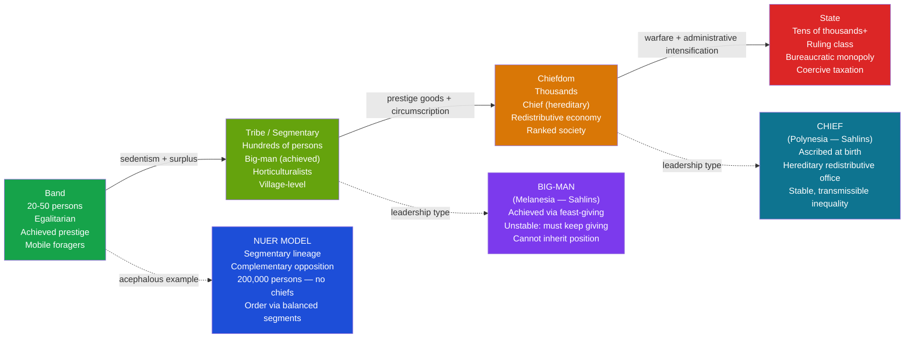

> [!abstract] TL;DR
> Political anthropology examines how human societies organize authority, consent, and coercion — from acephalous bands governed entirely by kinship and reputation to bureaucratic states with monopolies on legitimate force — revealing that "political" life precedes, and vastly exceeds, the formal institutions of the modern state.

---

## Intuition

**Analogy:** Imagine a student house of four people. No one is in charge. Dishes get done by whoever cares most. Bills get split by informal negotiation. Disputes are settled over dinner. Now the house grows to forty, then four hundred. Suddenly the informal arrangement breaks down: free-riders exploit the commons, disputes escalate beyond social pressure, someone needs to manage the shared fund or it disappears. Political anthropology asks — what exactly changes at each stage of that scaling? And is the endpoint (a formal authority with enforcement power) inevitable, universal, or just one of several solutions humans have invented?

The discipline's central discovery is surprising: most of human history was spent in stateless societies that nonetheless maintained order, adjudicated disputes, and coordinated collective action — not through chiefs or police, but through kinship obligations, reputational systems, balanced opposition between groups, and the credible threat of collective violence from equals. The state is a recent and regionally uneven invention; political life is as old as the species.

---

## How It Works



---

## Key Concepts

### Secondary Level

**Service's Social Evolution Typology (1962)**

Elman Service proposed four stages of sociopolitical organization, each representing increasing complexity of authority:

| Type | Scale | Leadership | Economy | Example |
|------|-------|-----------|---------|---------|
| **Band** | 20–50 | Egalitarian; achieved prestige only | Foraging; immediate-return | !Kung San, Hadza, Mbuti |
| **Tribe** | Hundreds | Big-man (earned, not inherited) | Horticulture / pastoralism | New Guinea Highlanders, Nuer |
| **Chiefdom** | Thousands | Chief (hereditary, redistributive) | Intensive agriculture; delayed-return | Hawaiian Islands, Mississippian cultures |
| **State** | Tens of thousands+ | Ruling class; bureaucracy | Surplus extraction; taxation | Mesopotamia, Egypt, Inca |

The typology is analytical, not evolutionary: it describes structural types, not inevitable historical stages. Many societies remained in bands or tribes for millennia without "progressing." The scheme has been heavily criticized for teleological bias (treating statehood as the endpoint) and for masking enormous variation within categories. Morton Fried's parallel framework focused on *inequality* rather than complexity: egalitarian → rank society → stratified society → state, stressing that the state's fundamental purpose is enforcing differential access to basic resources, not merely managing administrative complexity.

**Big-Man vs Chief (Marshall Sahlins, 1963)**

Sahlins' contrast between Melanesian and Polynesian leadership is the most influential distinction in political anthropology:

*Big-man (Melanesia):*
- Status is **achieved** through personal performance — hosting feasts, accumulating pigs, winning prestige in exchange partnerships
- Followers give loyalty in return for generosity; the moment generosity falters, followers defect
- Position is **not hereditary**: a big-man's son starts from zero
- The system is inherently **unstable**: the big-man must constantly extract from his own followers to fund feasts for outsiders, risking overextension and collapse; when he over-demands, coalitions form against him
- The structural ceiling is low — a charismatic operator, not a dynasty

*Chief (Polynesia):*
- Status is **ascribed** — the chief is born into office, not elected by performance
- Authority rests in hereditary rank and cosmological legitimation (chiefs descend from gods in Hawaiian and Maori traditions)
- Redistribution is **institutionalized**: tribute flows upward, prestige goods and foodstuffs flow downward at scheduled feasts; the chief is the node of a hierarchical economy
- Position is **stable and transmissible**: inequality reproduces across generations
- The structural ceiling is high — chiefly systems produced the ranked chiefdoms of Hawaii, Tonga, and the Northwest Coast

The contrast maps onto Weber's charismatic vs traditional authority: big-men operate on personal charisma; chiefs on institutionalized tradition.

**Acephalous Societies and Social Order Without the State**

A central empirical finding of political anthropology is that large, stable, and internally ordered societies can function with no centralized authority whatsoever. Such societies are called **acephalous** (Greek: "headless"). The mechanisms by which they maintain order include:

1. **Kinship obligation**: reciprocal duties among kin regulate most everyday conflict; injury to a kinsman is injury to the lineage, triggering collective response
2. **Feud**: the threat of organized retaliation by a victim's kin group deters violence; feud is not the breakdown of order but a *form* of order
3. **Balanced opposition / segmentary lineage**: nested groups of kin mobilize for conflict or alliance depending on the level of the dispute — at any given level of opposition, genealogical cousins become allies against a common enemy
4. **Reputation and social pressure**: in dense, multi-generational communities, social ostracism is a powerful deterrent; everyone will eventually need everyone else

---

### Undergraduate Level

**Evans-Pritchard and the Nuer: Segmentary Lineage (1940)**

E.E. Evans-Pritchard's *The Nuer* (1940) is the founding ethnographic case in political anthropology. The Nuer were a cattle-herding people of the southern Sudan numbering approximately 200,000 — larger than many contemporary European city-states — with no chiefs, no courts, no police, and no centralized authority of any kind.

How did 200,000 people maintain social order? Through **segmentary lineage**:

- Nuer society is divided into nested segments: household → minimal lineage → minor lineage → major lineage → maximal lineage → clan → moiety → tribe
- Each segment is defined by its opposition to equivalent segments at the same level
- **Complementary opposition**: if person A quarrels with person B in the same village, their respective lineage segments mobilize. But if the same person A is attacked by someone from an entirely different tribe, A and B immediately become allies against the external threat
- The principle: "I against my brother; my brother and I against our cousin; my cousin, my brother and I against the world"
- This structural logic regulates conflict without any authority figure making decisions: the appropriate level of opposition is automatically activated by the genealogical distance between the parties

Evans-Pritchard introduced the concept of **ordered anarchy** — not chaos, but a structured absence of centralized authority that nonetheless produces predictable, rule-governed behavior.

**Fortes and Evans-Pritchard: African Political Systems (1940)**

The edited volume *African Political Systems* (Fortes and Evans-Pritchard, 1940) established the first systematic typology of African polities and founded political anthropology as a subdiscipline. The editors distinguished:

- **Group A (state societies)**: centralized authority, administrative machinery, judicial institutions, a standing military — the Zulu, Bemba, Ankole, Ngwato, Banyankole
- **Group B (stateless societies)**: none of the above — the Logoli, Tallensi, Nuer

The book's theoretical claim: both types produced stable, ordered societies; the state is not the necessary precondition of political order. This was a direct refutation of the Hobbesian view that without sovereign authority, life is a war of all against all.

**Weber's Three Types of Legitimate Domination, Applied Anthropologically**

Max Weber distinguished three ideal-typical bases on which rulers claim, and followers grant, legitimacy:

1. **Traditional domination**: authority rests in the sanctity of immemorial custom — "this is how it has always been and always will be." Chiefs, kings, elders. The Polynesian chief derives authority from genealogical connection to ancestral and divine founders; to challenge the chief is to challenge the cosmic order.

2. **Charismatic domination**: authority rests in the extraordinary personal qualities of the leader — prophecy, military prowess, oratorical genius. The Melanesian big-man is a near-ideal-typical case: his authority exists only so long as his personal performance sustains it. When his feasts stop, his authority evaporates.

3. **Rational-legal domination**: authority rests in codified rules and positions rather than persons — anyone occupying Office X holds the authority that Office X confers, regardless of personal qualities. Modern states, bureaucracies.

Anthropologically, the transition from band to chiefdom represents a partial crystallization from charismatic to traditional domination; the transition to the state begins to introduce rational-legal elements (territorial jurisdiction, written law, administrative offices). But these types coexist in any real polity: modern states retain enormous amounts of traditional and charismatic legitimation.

**James Scott: Weapons of the Weak and Hidden Transcripts**

Scott's fieldwork in a Malaysian rice-farming village (*Weapons of the Weak*, 1985; *Domination and the Arts of Resistance*, 1990) produced two concepts that transformed how anthropologists think about power:

*Weapons of the weak*: Subordinate groups who cannot openly rebel against domination resist through everyday, low-risk, individually deniable actions:
- Foot-dragging, false compliance ("yes, I'll do it" — then not doing it)
- Feigned ignorance, playing dumb
- Petty theft and poaching from the powerful
- Character assassination through gossip
- Desertion, absenteeism
- Arson (the peasant's "artillery")

These weapons require no coordination, no organization, no manifesto — and they are rarely sufficient to overthrow a system. But cumulatively they represent a constant friction against domination, a form of class warfare conducted below the threshold of visibility.

*Hidden vs public transcript*: Scott distinguishes the **public transcript** — the performance of deference, compliance, and acceptance that subordinates enact in the presence of power — from the **hidden transcript** — what is said, thought, and enacted *offstage*, away from the gaze of the powerful. The hidden transcript is the discourse of insubordination: satire, curses, millennial dreams of reversal, private celebrations of defiance.

The relationship between these two transcripts is politically decisive. A stable domination system requires the powerful to believe in their own public transcripts (that subordinates genuinely accept the hierarchy) and subordinates to perform theirs convincingly. The moment the hidden transcript becomes visible — when someone "breaks character" in public — it can trigger what Scott calls an **infrapolitics explosion**: the pent-up hidden transcript erupts into open politics.

---

### Graduate Level

**Foucault in Anthropology: Power/Knowledge, Discipline, Governmentality, Biopolitics**

Michel Foucault's concepts entered anthropology primarily through the 1980s critical turn and now saturate the discipline:

*Power/knowledge (pouvoir/savoir)*: knowledge and power are co-constitutive, not opposed. What counts as truth in any society is always shaped by power relations — and knowledge claims produce their own forms of domination. Colonial anthropology is the paradigm case: the production of "objective" ethnographic knowledge about "primitive peoples" was simultaneously an exercise of colonial power. The anthropologist's authority to describe, classify, and explain non-Western societies was itself a power/knowledge formation that justified administrative intervention.

*Discipline and the Panopticon* (*Discipline and Punish*, 1975): Modern power works not through sovereign command ("thou shalt not") but through disciplinary technologies: constant surveillance, normalization, examination, the production of "docile bodies." The Panopticon is the architectural model — a prison in which inmates can never know whether they are being watched, so they internalize surveillance and regulate themselves. Applied anthropologically: colonial census-taking, cadastral surveys, missionary schools, public health campaigns, and development programs are all disciplinary formations that work by producing self-regulating, legible, governable subjects.

*Governmentality* (*Security, Territory, Population* lectures, 1977–78): The art of governing modern populations — managing births, health, mortality, economic productivity through statistical knowledge. The population itself becomes the object of political rationality. Anthropologists (Tania Li, Aihwa Ong, Aradhana Sharma, James Ferguson) have used governmentality to analyze development programs, NGOs, and welfare states in the Global South: international development "empowers" communities through technical interventions that simultaneously constitute them as manageable populations requiring expert guidance.

*Biopolitics and Necropolitics*: Foucault's biopolitics — sovereign power over life, administering bodies at the population level — was extended by Achille Mbembe into **necropolitics** (*Necropolitics*, 2003): in postcolonial African contexts, sovereignty is exercised not through discipline and biopolitical optimization but through the power to expose populations to death — through war, famine, disease, and abandonment. The colonial plantation, the slave ship, and the contemporary "death world" of the occupied territory are the paradigm cases.

**Political Economy: Eric Wolf and the World-System**

Eric Wolf's *Europe and the People Without History* (1982) argued that anthropology had systematically misrepresented non-Western societies by treating them as bounded, self-contained, historically autonomous units — exactly the opposite of what they were.

Wolf's key move: distinguish three **modes of production** present in any historical social formation:

| Mode | Labor extraction mechanism | Political organization | Examples |
|------|---------------------------|----------------------|---------|
| **Kin-ordered** | Social obligation; reciprocal duty | Band, tribe, segmentary lineage | Foragers, horticulturalists |
| **Tributary** | Political coercion; tax, tribute, corvée | Chiefdom, archaic state, feudalism | Egypt, Rome, feudal Europe, Inca |
| **Capitalist** | Wage labor; market commodity exchange | Capitalist state, nation-state | Industrial Europe, global corporations |

The encounter between capitalism and kin-ordered or tributary modes is not a "meeting of worlds" but violent restructuring: kin-ordered societies are dismantled, their labor extracted for global commodity chains, their political economies subordinated to metropolitan accumulation. The Atlantic slave trade, the rubber boom in the Congo, the colonial cotton economy of Egypt — all are episodes in the destruction of kin-ordered modes and their incorporation into the tributary-then-capitalist world system.

Wolf's contribution to political anthropology: "traditional" political forms (chiefdoms, lineage systems) are not survivals from a pre-capitalist past but responses, often of extraordinary creativity, to colonial incorporation. The big-man feast may be simultaneously a kinship institution and a form of resistance to labor recruitment by colonial plantations.

**Violence, Warfare, and the Hobbes-Rousseau Debate**

The state of nature debate has a direct empirical dimension in political anthropology:

*Hobbes* (*Leviathan*, 1651): without a sovereign to enforce peace, human life is a war of all against all — "solitary, poor, nasty, brutish, and short." The state is the solution to endemic violence.

*Rousseau* (*Discourse on the Origin of Inequality*, 1755): natural man is peaceful and self-sufficient; it is the emergence of property, comparison, and inequality — civilization — that introduces violence. The state creates the problem it claims to solve.

*Lawrence Keeley's empirical intervention* (*War Before Civilization*, 1996): Keeley analyzed skeletal trauma, weapon injuries, fortifications, and massacre sites in the Neolithic and pre-Neolithic archaeological record. His finding: prehistoric warfare was pervasive, often endemic, and produced per-capita casualty rates (5–15% of the population per generation) that exceed those of the most violent 20th-century nation-states. This strongly supported Hobbes against Rousseau's "noble savage."

*Counter-evidence and critique*: Douglas Fry and Patrik Söderberg (2013, *Science*) examined homicide records among mobile forager societies and found that most lethal violence is dyadic (interpersonal, not intergroup). Genuine organized group warfare is rare among nomadic foragers and correlates with sedentism, resource concentration, and population density — precisely the conditions that produce hierarchy. The Hobbesian war of all against all is thus largely an artefact of sedentary, food-producing societies rather than an original human condition.

Political anthropology's synthesis: the intensity of warfare varies cross-culturally with resource scarcity, population density, bounded territories, the presence of storable wealth, and the degree of political centralization. Warfare both drives and is driven by hierarchy — a feedback loop that, in circumscribed environments (Carneiro), culminates in the state.

---

## Python Demo

Simulating big-man versus chiefdom political economy: two societies of 50 agents modeled over 80 time steps. In the big-man society, the wealthiest agent at each step hosts a feast (redistributes 30% of wealth to followers), depleting their own resources. Leadership changes hands frequently as any agent who gives too much falls back into the pack. In the chiefdom, agent 0 holds hereditary office regardless of current wealth: all agents pay 20% tax, the chief retains 60% of collected tax and returns 40% equally. The simulation reveals the big-man system's structural instability against the chiefdom's stable, transmissible inequality.

```python
import numpy as np
import matplotlib.pyplot as plt

rng = np.random.default_rng(42)
T, N = 80, 50   # time steps, agents per society

def gini(w):
    """Compute Gini coefficient for a non-negative wealth array."""
    w = np.sort(np.clip(w, 0, None))
    n = len(w)
    if w.sum() == 0:
        return 0.0
    return (2 * np.dot(np.arange(1, n + 1), w) / (n * w.sum())) - (n + 1) / n

# ── Society A: Big-Man ────────────────────────────────────────────────────────
# The wealthiest agent each step acts as big-man: gives 30% of wealth as a feast
# to a random group of followers.  When wealth depletes another agent takes over.

bm_w = rng.uniform(50, 150, N)
bm_gini   = []
bm_leader = []   # who holds top-wealth position each step

for t in range(T):
    bm_w += rng.normal(5, 8, N)      # stochastic per-capita production
    bm_w  = np.clip(bm_w, 1, None)
    leader = int(np.argmax(bm_w))
    feast  = bm_w[leader] * 0.30
    others = [i for i in range(N) if i != leader]
    followers = rng.choice(others, size=rng.integers(10, 20), replace=False)
    bm_w[leader]    -= feast
    bm_w[followers] += feast / len(followers)
    bm_gini.append(gini(bm_w))
    bm_leader.append(leader)

# ── Society B: Chiefdom ───────────────────────────────────────────────────────
# Agent 0 is hereditary chief — position unaffected by current wealth.
# Each step: all agents produce; chief levies 20% tax from commoners,
# retains 60% of collected tax as personal surplus, returns 40% equally.

ch_w = rng.uniform(50, 150, N)
ch_w[0] = 200.0          # ascribed initial advantage
ch_gini = []

for t in range(T):
    ch_w += rng.normal(5, 8, N)
    ch_w  = np.clip(ch_w, 1, None)
    tax        = ch_w[1:] * 0.20
    ch_w[1:]  -= tax
    ch_w[0]   += tax.sum()
    redistrib   = tax.sum() * 0.40 / (N - 1)
    ch_w[1:]  += redistrib
    ch_gini.append(gini(ch_w))

# ── Plot ──────────────────────────────────────────────────────────────────────
fig, axes = plt.subplots(1, 3, figsize=(15, 5))
fig.suptitle("Big-Man vs Chiefdom: Political Economy Simulation", fontsize=13)

# Panel 1 — Gini over time
axes[0].plot(bm_gini, color="#e67e22", lw=2, label="Big-Man")
axes[0].plot(ch_gini, color="#2980b9", lw=2, label="Chiefdom")
axes[0].set_title("Inequality (Gini) Over Time")
axes[0].set_xlabel("Time Step")
axes[0].set_ylabel("Gini Coefficient")
axes[0].legend()
axes[0].grid(alpha=0.3)

# Panel 2 — Leadership churn: how often does the top-wealth agent change?
leader_changes = [0] + [
    1 if bm_leader[t] != bm_leader[t - 1] else 0
    for t in range(1, T)
]
axes[1].bar(range(T), leader_changes, color="#e67e22", alpha=0.7,
            label="Big-Man: leadership changed")
axes[1].axhline(0, color="#2980b9", lw=2.5,
                label="Chiefdom: chief fixed at 0 (hereditary)")
axes[1].set_title("Leadership Stability")
axes[1].set_xlabel("Time Step")
axes[1].set_ylabel("Leader Changed? (1 = yes)")
axes[1].legend()
axes[1].grid(alpha=0.3)

# Panel 3 — Final wealth distribution snapshot
axes[2].hist(bm_w, bins=15, alpha=0.7, color="#e67e22",
             label=f"Big-Man  (Gini = {bm_gini[-1]:.2f})")
axes[2].hist(ch_w, bins=15, alpha=0.7, color="#2980b9",
             label=f"Chiefdom (Gini = {ch_gini[-1]:.2f})")
axes[2].set_title("Final Wealth Distribution (t = 80)")
axes[2].set_xlabel("Wealth")
axes[2].set_ylabel("Number of Agents")
axes[2].legend()
axes[2].grid(alpha=0.3)

plt.tight_layout()
plt.savefig("political_economy_simulation.png", dpi=150)
plt.show()

churn_rate = sum(leader_changes) / T
print(f"Big-Man leadership churn:  {sum(leader_changes)}/{T} steps = {churn_rate:.0%}")
print(f"Final Gini — Big-Man: {bm_gini[-1]:.3f}  |  Chiefdom: {ch_gini[-1]:.3f}")
```

**Expected output:** The big-man Gini oscillates with high variance (leadership changes produce sudden redistributions) and churn is high (leader identity changes in ~60–80% of steps). The chiefdom Gini trends upward and stabilizes at a higher level, with the chief's wealth growing monotonically while commoner variance remains bounded. The final histogram shows the chiefdom with a pronounced outlier (the chief) while the big-man distribution is flatter and more symmetrical — a structural signature of the two political forms.

---

## Real-World Applications

> **Evans-Pritchard's Nuer and Contemporary Stateless Governance:** The Nuer segmentary lineage system continued to operate throughout Sudan's civil wars (1955–72; 1983–2005). When the Sudanese state collapsed in South Sudan, the Nuer fell back on clan and lineage structures to organize both warfare and post-conflict reconciliation. The *leopard-skin chief* — a ritual peace-broker with no coercive authority but enormous social leverage — mediated cattle compensation payments between feuding lineages with mechanisms directly continuous with Evans-Pritchard's 1940 description. Understanding stateless political organization is not merely historical: it is operationally relevant to conflict resolution, transitional justice, and post-conflict state-building in regions where formal state authority has collapsed or was never consolidated.

> **Scott's Hidden Transcripts and Labor Relations:** Scott's weapons of the weak have been applied far beyond the Malaysian village where they were developed. Organizational anthropologists have documented foot-dragging and false compliance in factories (Ong's *Spirits of Resistance and Capitalist Discipline*, 1987), in call centers (muted rage kept offstage from supervisors), in colonial labor regimes, and in contemporary platform gig work (algorithmic gaming as a weapon of the weak against the Uber algorithm). Wherever power is asymmetric and open resistance is punished, the gap between public and hidden transcript will appear.

> **Chiefdom-to-State Transitions in the Pacific:** The Hawaiian Islands provide the best-documented case of a chiefdom approaching state-level organization before Western contact. By the 18th century, each major island had a paramount chief (*ali'i nui*) with hereditary authority, redistribution of agricultural surplus through the *ahupua'a* (valley-based land unit), a separate priestly class, and proto-bureaucratic administrators (*konohiki*). Kamehameha I's conquest of the archipelago (1795–1810), facilitated by Western weapons, completed a transition to a genuine state — illustrating how external technology and warfare can accelerate the chiefdom-to-state transition that would otherwise require centuries.

---

## Common Pitfalls

- **Treating Service's typology as a developmental ladder** — The band-tribe-chiefdom-state sequence describes structural types, not an inevitable historical progression. Societies moved in multiple directions: some chiefdoms collapsed back into segmentary systems; some bands persisted for millennia without "progressing." Calling any living society a "tribe" as if it is on its way to statehood commits the teleological error Service himself warned against.

- **Conflating the absence of the state with the absence of politics** — Acephalous societies are not pre-political or apolitical; they are *differently* political. The Nuer's segmentary negotiations, the Melanesian big-man's competitive feasting, and the band's management of violence between equals are all political processes. Treating the state as the precondition of political life naturalizes one particular political form and renders invisible the majority of human political history.

- **Reading Scott as claiming resistance is always present or effective** — Scott explicitly distinguishes the *existence* of a hidden transcript (nearly universal) from the *effectiveness* of resistance (highly variable). Weapons of the weak are politically significant but structurally insufficient: they slow exploitation and maintain dignity but rarely overthrow systems. Misreading Scott as a theory of irrepressible popular agency removes the structural constraints he was at pains to document.

- **Applying Foucault's disciplinary model universally** — Foucault developed his analysis from early modern European institutions (the prison, the clinic, the school). Anthropologists who apply "governmentality" or "biopolitics" to all forms of political power risk obscuring important differences between disciplinary-bureaucratic states and other forms of domination (tributary, kin-ordered, patron-client) that operate through entirely different logics. Mbembe's necropolitics intervention is precisely a correction against over-universalizing the disciplinary model.

- **Ignoring the political economy of fieldwork** — Political anthropologists are not neutral observers. The conditions of access, the political position of key informants, funding sources, and the uses to which ethnographic knowledge is put (colonial administration, development programs, military counter-insurgency) are all part of the political field being studied. Treating the ethnographer as a transparent window onto stateless political life reproduces the power/knowledge problem Foucault identified.

---

## Related Concepts

- [[_MOC_Culture_Society_and_Religion|↑ Culture, Society and Religion MOC]]
- [[Classical_Anthropological_Theory]] — Mauss's theory of the gift is directly relevant to the big-man's feast as a political instrument; Malinowski's Kula ring demonstrates how competitive exchange creates prestige hierarchies; the note provides the theoretical framework within which Sahlins and Evans-Pritchard operated

- [[Functionalism_and_Structural_Functionalism]] — Evans-Pritchard and Fortes were the leading figures of British structural-functionalism; the segmentary lineage analysis is a structural-functional explanation of political order; reading this note alongside the theoretical framework clarifies what kind of explanation *African Political Systems* was offering

- [[State_Formation_and_Early_Civilizations]] — The archaeological perspective on the chiefdom-to-state transition: Carneiro's circumscription theory, Childe's Urban Revolution, and the material record of Mesopotamia and Egypt; the political anthropology note provides the cross-cultural typological foundation, the archaeology note provides the deep-time evidence

- [[Primatology_and_Primate_Societies]] — De Waal's chimpanzee politics provides the evolutionary baseline for human political organization; the contrast between chimpanzee alpha-male hierarchy (closer to big-man than chief — achieved, unstable, contested) and bonobo egalitarianism grounds the anthropological typology in comparative primatology

- [[Ethnographic_Methods_and_Fieldwork]] — The Nuer ethnography is one of the canonical cases in fieldwork history; Evans-Pritchard conducted fieldwork under British colonial administration and under conditions of active Nuer resistance to the state; the methodological and ethical problems of studying stateless societies "for" a colonial power are a central case study in fieldwork ethics

- [[Family_Marriage_and_Kinship]] — Kinship is the organizational substrate of both bands and segmentary lineage systems; Evans-Pritchard's Nuer analysis depends on understanding patrilineal descent and lineage segmentation; the transition to chiefdom and state involved partly dismantling kinship-based redistribution and replacing it with territorial administration

- [[Political_Sociology_and_Social_Power]] — The sociological framework for the same concepts: Weber's three types of domination, Bourdieu's symbolic power, Foucault's governmentality, Mann's IEMP model; political anthropology provides cross-cultural and non-Western grounding for concepts that political sociology developed in a primarily European institutional context

- [[State_Formation_and_Political_Development]] — The political science perspective: Weber's monopoly on legitimate violence, Tilly's war-makes-states thesis, Acemoglu's extractive vs inclusive institutions; political anthropology extends the temporal frame back to pre-state societies and adds cross-cultural ethnographic depth

- [[Repeated_Games_and_Folk_Theorems]] — The stability of cooperation in acephalous societies (segmentary lineage peace, feud deterrence, big-man reciprocity networks) can be formally modeled as a repeated game: the folk theorem explains why defection is suppressed by the shadow of the future in dense, multi-generational social networks where everyone will interact again; the big-man system's instability maps onto the conditions under which cooperation collapses in finite-horizon games

---

## Review Questions

### Secondary

1. What is an acephalous society? Give one example and explain what maintains social order within it in the absence of a chief or police force.
2. What is the difference between a big-man and a chief? Why is the big-man system described as structurally unstable?
3. In Service's typology, what distinguishes a chiefdom from a tribe? What kind of economy is associated with each?

### Undergraduate

1. Evans-Pritchard argued that the Nuer had "ordered anarchy." What does this mean, and what structural mechanism produces political order in the absence of centralized authority? What are the limits of the segmentary lineage model as an explanation?
2. Scott distinguishes "public transcripts" from "hidden transcripts." Using a concrete example, explain why this distinction matters for understanding how power actually operates in societies with extreme inequality. What prevents the hidden transcript from becoming an open revolt?
3. How does Weber's typology of legitimate domination (traditional, charismatic, rational-legal) map onto the band-tribe-chiefdom-state sequence? Where does the mapping hold, and where does it break down?

### Graduate

1. Foucault's concept of "governmentality" has been applied widely in anthropological studies of development, NGOs, and postcolonial states. What does governmentality add to a political analysis that classic state-centric approaches miss? What are the risks of over-applying the concept beyond the European institutional context in which Foucault developed it?
2. Eric Wolf argues that treating non-Western societies as bounded, autonomous units distorts political anthropological analysis. Evaluate this critique: what does the political economy approach gain, and what does it potentially lose, compared to the structural-functionalist analysis of Evans-Pritchard and Fortes?
3. The Hobbes-Rousseau debate has an empirical dimension in political anthropology. What does Keeley's evidence suggest? What methodological and interpretive problems complicate the translation from archaeological skeletal trauma data to claims about the "naturalness" of warfare in human evolution?

---

## Sources

- [Evans-Pritchard, E.E. (1940). *The Nuer: A Description of the Modes of Livelihood and Political Institutions of a Nilotic People*. Oxford University Press.](https://archive.org/details/nuer00evan)
- [Fortes, M. and Evans-Pritchard, E.E., eds. (1940). *African Political Systems*. Oxford University Press for International African Institute.](https://archive.org/details/africanpolitical0000unse)
- [Service, E.R. (1962). *Primitive Social Organization: An Evolutionary Perspective*. Random House.](https://www.worldcat.org/title/primitive-social-organization-an-evolutionary-perspective/oclc/349025)
- [Sahlins, M. (1963). "Poor Man, Rich Man, Big-Man, Chief: Political Types in Melanesia and Polynesia." *Comparative Studies in Society and History*, 5(3), 285–303.](https://doi.org/10.1017/S0010417500001729)
- [Scott, J.C. (1985). *Weapons of the Weak: Everyday Forms of Peasant Resistance*. Yale University Press.](https://yalebooks.yale.edu/book/9780300036272/weapons-of-the-weak/)
- [Scott, J.C. (1990). *Domination and the Arts of Resistance: Hidden Transcripts*. Yale University Press.](https://yalebooks.yale.edu/book/9780300056693/domination-and-the-arts-of-resistance/)
- [Wolf, E.R. (1982). *Europe and the People Without History*. University of California Press.](https://www.ucpress.edu/book/9780520048980/europe-and-the-people-without-history)
- [Keeley, L.H. (1996). *War Before Civilization: The Myth of the Peaceful Savage*. Oxford University Press.](https://global.oup.com/academic/product/war-before-civilization-9780195119121)
- [Mbembe, A. (2003). "Necropolitics." *Public Culture*, 15(1), 11–40.](https://doi.org/10.1215/08992363-15-1-11)
- [Fried, M.H. (1967). *The Evolution of Political Society: An Essay in Political Anthropology*. Random House.](https://www.worldcat.org/title/evolution-of-political-society-an-essay-in-political-anthropology/oclc/250195)
- [Fry, D.P. and Söderberg, P. (2013). "Lethal Aggression in Mobile Forager Bands and Implications for the Origins of War." *Science*, 341(6143), 270–273.](https://doi.org/10.1126/science.1235675)

---

#Anthropology #CultureSociety #PoliticalAnthropology #Power #Chiefdoms #AcephalousSocieties
