# Religion, Magic, and Ritual

> [!abstract] TL;DR
> Religion, magic, and ritual are three overlapping domains that every human society maintains, and anthropology's central task has been to explain what they *do* rather than whether they are true: Durkheim showed that religion generates social solidarity through sacred/profane distinctions and collective effervescence; Malinowski showed that magic manages anxiety where technique is uncertain; van Gennep and Turner showed that rites of passage restructure personal and social identity through a universal three-phase sequence; and Evans-Pritchard showed that witchcraft belief is not superstition but a coherent explanatory framework for misfortune that simultaneously maps and enforces social tensions.

---

## Intuition

**Analogy:** Imagine two fishermen from the same village setting out at dawn. One rows to the calm lagoon half a mile offshore — he knows from experience exactly where the reefs are, how to read the current, how deep to drop his net. He hums to himself and works efficiently, with no ceremony at all. The other paddles to the open ocean beyond the reef line, where sudden squalls, unpredictable currents, and invisible shoals make every voyage genuinely dangerous. Before he leaves, he recites a precise set of spells, touches his carved prow-ornament, and cannot eat certain foods. When he returns safely, the spells worked — and if he had not performed them, his family would be afraid for him.

This is Bronislaw Malinowski's most famous observation from the Trobriand Islands: magic does not appear randomly across human activity. It appears precisely where technique is uncertain and stakes are high — and it disappears where technique is reliable and outcome is predictable. Magic is not a cognitive error or a developmental stage on the way to science. It is an anxiety-management system that occupies the gap between what human skill can control and what it cannot.

But magic is only one thread of the story. Ritual does something else: it transforms people. A girl enters a ceremony as a child and emerges, hours later, as a woman. A man stands at an altar as a bachelor and leaves as a husband. A community gathers in grief around a body and disperses, days later, reorganized around the absence. The transformation is not a metaphor — it is a social fact, recognized and enforced by everyone present. Something real changes in who these people are and what they owe each other. And the mechanism of that change — the collective gathering, the shared heightened emotion, the symbolic actions that cannot be undone — is what anthropology means by ritual.

---

## How It Works

```mermaid
graph TD
    CORE["Religion, Magic and Ritual\nAnthropological Frameworks"]

    MAGIC["MAGIC\nFrazer · Malinowski · Tambiah"]
    RELIGION["RELIGION\nDurkheim · Eliade · Stark"]
    RITUAL["RITUAL\nvan Gennep · Turner · Gluckman"]
    SPECIAL["SPECIALIZED FORMS\nTotemism · Shamanism · Witchcraft"]

    CORE --> MAGIC
    CORE --> RELIGION
    CORE --> RITUAL
    CORE --> SPECIAL

    MAGIC --> M1["Frazer: sympathetic and contagious\nlike produces like; contact transfers property\nmagic to religion to science sequence"]
    MAGIC --> M2["Malinowski: anxiety fills gaps\nopen-sea ritual vs. lagoon silence\nfishes where outcome is uncertain"]
    MAGIC --> M3["Tambiah: performative efficacy\nnot failed science but symbolic action\nconstative vs. performative speech acts"]

    RELIGION --> R1["Durkheim: sacred vs. profane\ncollective effervescence renews solidarity\ntotemism projects society onto nature"]
    RELIGION --> R2["Eliade: hierophany\naxis mundi as sacred center\nreligious experience sui generis irre­ducible"]
    RELIGION --> R3["Stark and Bainbridge: religious economy\npluralism raises participation\nreligion as compensator for unattainable goods"]

    RITUAL --> RIT1["van Gennep 1909\nseparation - liminality - reaggregation\nuniversal three-phase structure"]
    RITUAL --> RIT2["Turner 1969\ncommunitas and anti-structure\nliminal = betwixt and between"]
    RITUAL --> RIT3["Gluckman: rituals of rebellion\nstructured inversion maintains order\nNcwala and Zulu ceremonies"]

    SPECIAL --> SP1["Totemism: Levi-Strauss\nanimals good to think not just good to eat\nnature classifies society"]
    SPECIAL --> SP2["Shamanism: Eliade and Winkelman\nalterd states of consciousness\nspirit flight and soul retrieval"]
    SPECIAL --> SP3["Witchcraft: Evans-Pritchard\nAzande mangu as social fact\nwitchcraft explains the why not the what"]
```



---

## Key Concepts

### Secondary Level

**Three domains and why they are distinct:**

| Domain | Core Claim | Relationship to the World | Key Theorist |
|---|---|---|---|
| **Magic** | Practitioners can directly manipulate outcomes through symbolic action | Coercive — compels natural forces | Frazer, Malinowski, Tambiah |
| **Religion** | Supernatural persons or powers require propitiation, not compulsion | Supplicative — negotiates with powers | Durkheim, Weber, Eliade |
| **Ritual** | Formalized, prescribed symbolic action transforms social identity and renews order | Performative — enacts rather than describes | van Gennep, Turner, Gluckman |

The boundaries between these categories are blurry in practice — what one person calls prayer another calls a spell — but the analytical distinctions matter for understanding what different symbolic practices accomplish.

**Sacred vs. profane (Durkheim):** Emile Durkheim's *Elementary Forms of the Religious Life* (1912) argued that the most basic feature of all religious life is the classification of the world into two radically opposed domains. The **sacred** is set apart, hedged with prohibitions, approached with awe — not necessarily supernatural, but categorically *other* from ordinary life. The **profane** is the domain of everyday experience, practical utility, and routine. A cathedral is sacred; the car park beside it is profane. The same physical object can move between categories: bread is profane; consecrated bread is sacred. What defines the sacred is not its physical properties but the social act of setting it apart.

**Rites of passage — three stages:** Arnold van Gennep identified in 1909 that transitions between social states (childhood to adulthood, unmarried to married, living to dead, outsider to member) follow a universal three-part structure:

1. **Separation** (*séparation*): the individual is ritually removed from their previous status and social position. Symbolic stripping — of clothing, hair, name, rank, possessions — marks the boundary.
2. **Liminality** (*marge*): the individual occupies a threshold state that is neither what they were nor what they will become. Victor Turner (1969) called this state "betwixt and between." Liminal persons are simultaneously dangerous (they violate the normal categories) and powerful (they have access to states ordinary life prohibits).
3. **Reaggregation** (*agrégation*): the individual re-enters society with a new status, new rights, new obligations. The transformation is irreversible and publicly recognized.

**Totemism at a glance:** Totemism is the practice of identifying a human group (a clan, a lineage, a moiety) with a natural species — an animal, plant, or natural phenomenon — that serves as its emblem, symbol, and sometimes ancestor. The totemic animal is typically subject to restrictions: it may not be killed or eaten by members of its associated group, or it may be killed and eaten only in specific ritual contexts. For Durkheim, the totem is society's unconscious self-representation: the eagle or the bear is the group made visible in nature. For Lévi-Strauss, this gets the logic backwards — the eagle and the bear are chosen not because they are emotionally resonant but because they are *conceptually useful*: natural species offer a pre-made classification system that human groups can use to order their own social relations.

---

### Undergraduate Level

#### Frazer, Malinowski, and Tambiah: Three Theories of Magic

**Frazer's evolutionary sequence:** James George Frazer proposed in *The Golden Bough* (1890) that all magical thinking operates on two principles. **Sympathetic (homeopathic) magic** holds that *like produces like*: stick pins in a wax effigy and the person it represents suffers. **Contagious magic** holds that *contact transfers properties permanently*: a strand of someone's hair can be used to affect them because it retains an invisible connection to its source. Frazer unified both as manifestations of the same assumption — that similarity and contact create real causal links — and called this assumption a pseudo-science: magic correctly perceives that the world is governed by laws, but misidentifies what those laws are. When magic repeatedly fails, the practitioner concludes that natural forces are not directly coercible — they are governed by superhuman persons. Hence, magic gives way to religion; when religious propitiation also fails to deliver reliable results, science emerges to identify genuine causal regularities. Magic → Religion → Science: cognitive progress through the discovery of failure.

This sequence was rejected almost universally. Magic does not precede religion historically (both coexist in every society); magic does not disappear as societies become more complex (it intensifies in specific domains regardless of technological development); and the psychological premise — that magical thinking is a developmental phase — was refuted by cognitive research showing that sympathetic and contagious thinking are permanent features of human cognition, not residues of an earlier stage. What Frazer correctly identified was not an evolutionary sequence but a pair of cognitive universals. Pascal Boyer and Paul Rozin demonstrated that educated adults show robust magical contamination effects — the reluctance to wear a murderer's laundered sweater, the disgust at eating perfectly sanitary food stirred with a sterilized comb — even when they explicitly deny any magical beliefs. Frazer found the phenomenon; he misread its significance.

**Malinowski's anxiety-management theory:** Bronislaw Malinowski's fieldwork in the Trobriand Islands (1914–1918), reported in *Magic, Science and Religion* (1925), produced the most empirically grounded theory of magic in anthropological history. His famous observation was that the Trobriand Islanders performed elaborate magical rituals before deep-sea fishing expeditions in the dangerous open ocean but no magical rituals before fishing in the calm, predictable lagoon. Magic filled precisely the gap where human skill could not guarantee outcomes — where anxiety was high and technique was insufficient. It was not a cognitive error but a psychological technology: magic allowed the practitioner to act purposefully, maintain morale, and mobilize group effort when outcomes were genuinely beyond human control.

Malinowski extended this to agriculture, warfare, love, and trade. Magic appeared wherever technique was uncertain and stakes were high; it disappeared where reliable procedures existed. This observation had a crucial methodological implication: to understand why a society uses magic in a given domain, ask what practical uncertainty that domain generates, not what cognitive error is responsible for magical belief.

The limitation of Malinowski's theory is that it treats magic as purely functional — anxiety-management — and cannot explain why magic takes the specific symbolic form it does, why it invokes particular metaphors, deities, and categories. Malinowski explains the *existence* of magic but not its *content*.

**Tambiah's performative theory:** Stanley Tambiah's *Magic, Science, Religion, and the Scope of Rationality* (1990) offered the most sophisticated resolution. Drawing on J.L. Austin's distinction between **constative** speech acts (statements that describe a state of affairs and can be evaluated as true or false) and **performative** speech acts (utterances that *do* what they say — "I now pronounce you married" does not describe a marriage but creates one), Tambiah argued that magic is performative, not constative. A magical spell is not a failed causal hypothesis that misidentifies how the world works. It is a symbolic action that achieves its effects through a different register entirely — through the social recognition that something has been done, through the reordering of meaning, through the participation of practitioner and audience in a shared symbolic transformation. Asking whether a magical spell is "true" is like asking whether a wedding ceremony is "true": the question is not descriptively but socially meaningful. Magic is not proto-science; it is a mode of symbolic action with its own criteria of success, operating alongside science rather than being replaced by it.

---

#### Durkheim's Sociology of Religion

Emile Durkheim's *Elementary Forms of the Religious Life* (1912) remains the most influential sociological account of religion ever produced. Its central argument is that religion is fundamentally social, not metaphysical: religion is the way societies represent themselves to themselves and renew the bonds that make collective life possible.

**Sacred and profane:** The classification of the world into sacred and profane realms is not merely a theological distinction. It is a social institution that requires active maintenance. What is sacred is collectively maintained as such through prescribed behavior — approaching it with awe, hedging it with prohibitions, segregating it from ordinary contact. The Eucharistic host is sacred not because of its chemical properties but because a community of believers collectively treats it as the body of Christ, separates it from ordinary bread, and responds to it with a specific set of emotions and practices. The sacred is society's self-objectification: the things a group treats as sacred are the things it holds collectively indispensable to its identity.

Crucially, Durkheim insisted that the sacred is not inherently supernatural. In his analysis, totemic objects — a painted wooden board, a carved figure, an animal emblem — were sacred without being supernatural in the usual theological sense. What made them sacred was the social relationship to them. A national flag is sacred to its nation; a mathematical proof is sacred to mathematicians; a stadium can be sacred on match day and profane on Tuesday. Durkheim's sacred/profane distinction is a sociological category, not a theological one.

**Totemism as the elementary form:** Durkheim chose Australian Aboriginal totemism as his case study for a specific reason: he believed it was the simplest surviving form of religious life, and that the elementary form would reveal the structure underlying all more complex religious systems. His argument was that the totemic animal or plant emblem served as the visible symbol of the *mana* — the sacred power — that the clan felt during ritual gatherings. But what was the ultimate referent of that power? Not the animal itself (which Durkheim recognized was too ordinary an object to generate the intensity of religious feeling). The real referent was **society itself**: the anonymous, impersonal force greater than any individual that compels, sustains, and transcends its members. The totem is society's unconscious representation of itself. When the Arrernte clan worships its witchetty grub totem, it is — without knowing it — worshipping the social force that constitutes it as a collective subject.

**Collective effervescence:** The mechanism by which religion renews social solidarity is what Durkheim called **collective effervescence** (*effervescence collective*). During communal ritual gatherings — corroboree dances, initiation ceremonies, harvest festivals — the heightened collective emotion produced by rhythmic movement, music, chanting, and shared physical proximity generates a qualitative change in individual experience. Participants feel lifted out of their ordinary selves, connected to something larger, charged with an energy that does not feel self-generated. They attribute this force to the ritual object — the totem, the god, the sacred symbol — that happens to be before them. But its source is the social interaction itself: the feedback loop of emotional contagion among densely grouped, synchronized participants. After the ritual, the participants re-enter ordinary life, but they carry with them an experience of collective identity that has been renewed and intensified. The community is reinvented each time it gathers.

This is Durkheim's answer to the question of what religion *does*: it creates and periodically renews social solidarity. It makes the individual feel part of something greater — and that feeling is not an illusion. There is something greater: society itself, which existed before the individual was born and will continue after they die, which provides the language, categories, values, and sense of self that the individual takes to be their own private possession.

**The legacy:** Durkheim's framework directly generated the sociology of religion as a subdiscipline. Robert Bellah's concept of **civil religion** — the quasi-sacred practices, symbols, and narratives (Independence Day, national anthems, war memorials, presidential inaugurations) through which a secular nation periodically renews its collective identity — is a direct application of Durkheim's mechanism to modern nation-states. The sociology of religious nationalism, of sports fandom, of rock concerts, and of political rallies as secular effervescence all trace their analytical lineage to Durkheim.

---

#### Rites of Passage: van Gennep and Turner

Arnold van Gennep's *Les Rites de Passage* (1909) was largely ignored for fifty years before Victor Turner's reinterpretation made it one of the most cited works in social anthropology.

**Van Gennep's three phases:**

Van Gennep identified the three-phase structure — separation, liminality, reaggregation — in transitions across every category boundary that societies recognize: birth, initiation, marriage, death, seasonal transitions, the installation of kings, the first harvest. What matters is not the specific content of any given rite but the *structure* it shares with all other transitions: something is removed (old status), a threshold is inhabited (liminal state), and something is conferred (new status). The word "liminality" comes from the Latin *limen*, threshold — the space between two rooms, the line that separates inside from outside.

Van Gennep also noted that the three phases are differentially emphasized depending on the type of transition. Funeral rites emphasize the first phase (separation of the dead from the living); initiation rites emphasize the second phase (the prolonged ordeal of the liminal state, during which the initiand is remade); marriage rites emphasize the third phase (the incorporation of two people into a new social unit). The differential weighting of phases reflects the particular social problem each rite type addresses.

**Turner's elaboration of liminality:**

Victor Turner's *The Ritual Process: Structure and Anti-Structure* (1969) transformed van Gennep's three-phase model into a major theoretical framework for social anthropology. Turner focused particularly on liminality as a social phenomenon that exceeds its ritual context.

The liminal state is defined by its ambiguity: the initiand is neither child nor adult, neither alive nor dead (in the case of funerary rites), neither insider nor outsider. They occupy a position that the social structure has no category for. Turner described this as the state of being "betwixt and between" — a phrase that captures the combination of freedom and danger that liminality generates. Liminal persons are dangerous to others (social category violations threaten the entire classificatory system) and vulnerable themselves (stripped of the protections that ordinary social status provides). This is why liminal persons are typically sequestered, disguised, or rendered symbolically invisible.

**Communitas:** Turner's most original contribution was the concept of **communitas** — the form of social relationship that emerges specifically in the liminal phase. In ordinary social life, people relate to each other through structured roles, ranks, and obligations: I am your employer, you are my subordinate; I am your senior relative, you are my junior. These hierarchies organize social life and enable coordination, but they also generate separation, competition, and resentment. In the liminal phase, these structures are temporarily dissolved. The initiands in a bush school share a radical equality before they receive their new statuses. The communitas of the liminal phase is anti-structural: it instantiates the direct, immediate, personal relationship between human beings stripped of their social personae.

Turner argued that communitas does not disappear after the ritual. It persists as a residue — a memory of a different form of sociality — that periodically bubbles up in the interstices of ordinary social life: in religious movements, in utopian communities, in the camaraderie of soldiers in combat, in the social equality of pilgrimage. The relationship between structure (the hierarchy of ordinary social life) and anti-structure (the communitas of liminality) is for Turner the fundamental dialectic of human social existence. Neither can persist alone: structure without anti-structure becomes rigid and suffocating; anti-structure without structure generates chaos.

**Gluckman and rituals of rebellion:**

Max Gluckman extended the analysis of ritual to a different problem: how do societies manage political conflict? His analysis of the **Ncwala** ceremony among the Swazi (the first-fruits ceremony in which commoners ritually abuse and symbolically attack the king) and similar "rituals of rebellion" argued that structured, periodic inversion of the social order — allowing the powerless to temporarily enact power — actually functions to preserve that order. The rebellion is permitted precisely because it is ritualized: it occurs in prescribed form, at prescribed times, within a framework that everyone understands as extraordinary and temporary. The cathartic release of anti-structural sentiment reinforces, rather than undermines, the structural order that resumes afterward. Gluckman's analysis implies that societies with more such safety-valve institutions may be more stable than those that prohibit all expressions of discontent.

---

#### Shamanism: Eliade and Winkelman

**Eliade's archaic techniques of ecstasy:**

Mircea Eliade's *Shamanism: Archaic Techniques of Ecstasy* (1951) made the controversial argument that shamanism constitutes a universal religious complex — not a specific cultural tradition but a recurrent functional complex found independently across Siberia, Central Asia, the Americas, Southeast Asia, and Oceania. The shaman is defined not by a specific belief system but by a specific technique: the deliberate, controlled, reversible entry into an altered state of consciousness during which the shaman's soul leaves the body to travel to other cosmic realms (the upper world of celestial spirits, the lower world of the dead), encounter spirit helpers and adversaries, and return with information, healing power, or the recovered soul of a sick patient.

Eliade proposed that the shaman's cosmology was structured around the **axis mundi** — the world axis or world tree that connects the three cosmic planes (upper world, middle world of ordinary existence, lower world) and through which the shaman's soul travels. This cosmological structure — the tripartite vertical universe linked by a central axis — appears with remarkable consistency across shamanic cultures that had no historical contact with each other, suggesting either a very old common origin or a recurring cognitive/ecological logic.

**Criticisms of Eliade:** Eliade has been criticized on two main grounds. First, his concept of shamanism is so broad that it encompasses enormous cultural variation under a single label, obscuring differences that matter ethnographically. Second, his phenomenological approach treated religious experience as *sui generis* and irreducible to social or psychological causes — a methodological position most anthropologists now reject as incompatible with scientific analysis.

**Winkelman's neuroanthropological approach:**

Michael Winkelman's *Shamanism: A Biopsychosocial Paradigm of Consciousness and Healing* (2010) provides a neuroanthropological account that escapes Eliade's phenomenological limits. Winkelman argues that shamanic altered states of consciousness (ASC) are produced by the same neurological mechanism across cultures: the induction of slow-wave synchronous activity in the frontal lobes through rhythmic auditory driving (drumming at 4-7 Hz theta-wave frequency), sensory deprivation, fasting, sleep deprivation, hyperventilation, or psychoactive plants. This state — which Winkelman calls an **integrative mode of consciousness** — involves a shift from the normal dominant left-hemisphere verbal-analytical processing to a more holistic, imagistic, right-hemisphere-integrated processing mode, accompanied by the activation of serotonergic and opioid systems that generate the feelings of cosmic unity, ego dissolution, and visionary imagery associated with shamanic experience.

The cross-cultural consistency of shamanism is, on this account, the result of cross-cultural consistency in human neurophysiology: all human nervous systems respond to the same induction methods with qualitatively similar ASC, and cultures that discovered these methods independently converged on functionally similar social roles (the shaman as healer, ritual specialist, and community cosmological technician) because the neurological resources are universal.

---

#### Totemism: Lévi-Strauss's Structural Reanalysis

Claude Lévi-Strauss's *Totemism* (1962) demolished every previous functionalist and sociological account of totemism and replaced it with a structuralist alternative that was simultaneously more economical and more intellectually ambitious.

**The "totemic illusion":** Lévi-Strauss began by noting that "totemism" had been treated as a single phenomenon requiring a single explanation when it was actually a set of structurally unrelated practices that Western anthropologists had grouped together because of their own cultural preoccupations. He dissolved the category as usually defined.

**The structural argument:** What remained after dissolving the category was a genuine structural regularity. Totemic systems consistently use natural species to mark distinctions between human groups — clan Eagle and clan Bear are different not because eagles and bears are emotionally or spiritually important but because they differ from each other, and this natural difference provides a ready-made vocabulary for encoding the social difference between the two clans. The logic is not "the eagle is sacred to us because it is our ancestor" but "the eagle is useful to us as a symbol because eagle : bear :: clan A : clan B."

This is Lévi-Strauss's famous aphorism: natural species are chosen as totems not because they are "good to eat" (*bonnes à manger*) but because they are "good to think" (*bonnes à penser*). Nature provides a pre-existing system of contrasts and similarities that human thought can appropriate to structure social categories. The natural world is a symbolic resource, not a food resource, for the totemic imagination. Totemism is not a religion, not a magical system, and not a kinship institution: it is a classificatory system that uses natural categories to think social distinctions.

---

#### Witchcraft and Sorcery: Evans-Pritchard on the Azande

E.E. Evans-Pritchard's *Witchcraft, Oracles and Magic Among the Azande* (1937) is the most influential single study of magic and witchcraft in the history of social anthropology and one of the most important works in the anthropology of rationality.

**The Azande and mangu:** The Azande of what is now South Sudan believe in **mangu** — a physical substance located in the body, typically near the liver, which gives its possessor the unconscious power to harm others. The possessor of mangu may not know they have it; they need not intend to harm anyone; the harm may occur through the unconscious projection of malevolent feeling toward someone they dislike. Mangu is hereditary: the children of a witch are witches, and the simplest way to determine whether a dead person's mangu has become cool and harmless (i.e., the witch's career has ended) is to autopsy the body and inspect the relevant organ. Sorcery is distinct from witchcraft for the Azande: sorcery involves the deliberate use of medicines and spells to harm, and it is morally condemned and legally actionable. Witchcraft (mangu) is a physiological condition that may be inherited without any deliberate choice.

**The sociological insight:** Evans-Pritchard's key observation was not that Azande witchcraft beliefs were irrational but that they were *supplementary* to empirical reasoning, not a replacement for it. If a man was gored by an elephant, the Azande did not invoke witchcraft to explain why elephants gore people — they knew, empirically, that elephants gore people when approached from the wrong direction, when startled, etc. They invoked witchcraft to answer a different question: not *what happened* (the elephant gored him) but *why it happened to this particular man at this particular time*. The man's brother had quarreled with a neighbor last week; the neighbor was known to have witchcraft in his lineage; this explains not the mechanism of the goring but the *targeting* of this specific person. Witchcraft explains the "why me, why now" that no empirical account of causal mechanism can answer — because causal mechanism alone cannot explain coincidence, bad luck, or social targeting.

**Witchcraft accusations as social maps:** The sociological function of witchcraft accusations was identified by Evans-Pritchard and extended by later anthropologists including Mary Douglas and Max Marwick. Witchcraft accusations do not occur randomly across social space: they follow existing lines of social tension, competition, and resentment. You accuse your neighbor, not your best friend; you accuse someone you have recently quarreled with, not a stranger. Mapping witchcraft accusations within a community therefore maps its fault lines — the relationships of suppressed hostility, competition for resources, or status rivalry that ordinary social norms prohibit from open expression. Witchcraft accusation is the social recognition of a social tension that has no other legitimate outlet.

---

### Graduate Level

#### Tambiah and the Rationality Debate

Evans-Pritchard's monograph launched the anthropological rationality debate: given that Azande witchcraft beliefs are internally coherent and fulfil genuine explanatory functions, in what sense, if any, are they "irrational"? The debate involved Lévy-Bruhl's earlier (discredited) claim that "primitive" peoples reasoned through "pre-logical participation" rather than logical inference; Robin Horton's neo-Tyloran argument that African traditional thought and Western science are structurally analogous as explanatory systems (both invoke theoretical entities to explain observable events), differing only in that traditional thought lacks the meta-epistemological capacity for radical self-questioning that science institutionalized; and Peter Winch's Wittgensteinian counter-argument that the criteria of rationality are internal to forms of life, and there is therefore no meta-cultural standard from which to judge any system's rationality.

Tambiah's resolution in *Magic, Science, Religion, and the Scope of Rationality* (1990) drew on Austin's speech act theory to argue that the debate was framed wrongly. It presupposed that magic and science are both playing the same game — proposing and testing causal hypotheses — and asked which plays it better. But magic is not playing that game. The performative dimension of ritual action is not a failed constative: it operates in a different register, achieves different effects (social, symbolic, psychological), and is evaluated by different criteria. A rain dance that fails to bring rain has not been falsified by the drought — the community's response is typically not "rain dances don't work" but "that particular shaman performed them incorrectly" or "the power of an adversary's witchcraft exceeded the dance's power." This seems like ad hoc immunization against refutation, and from a Popperian perspective it is. But from a Tambiahan perspective, the relevant criteria are whether the ritual produced communitas, renewed collective identity, managed anxiety, and maintained the social solidarity that makes cooperative rain-dependent agriculture possible. On those criteria, the rain dance that fails to bring rain may be a complete success.

#### Winkelman and Cognitive Anthropology of Religion

The neuroanthropological program Winkelman developed for shamanism was part of a broader cognitive turn in the anthropology of religion, associated with Pascal Boyer, Dan Sperber, and Harvey Whitehouse.

**Boyer's cognitive by-product theory:** Pascal Boyer's *Religion Explained* (2001) argued that religious beliefs are not a coherent system requiring a specific explanation but a mosaic of cognitive by-products — intuitive attributions that follow from general-purpose cognitive systems running in contexts they were not designed for. The agent-detection system (HADD — hyperactive agency detection device), which evolved to detect predators and conspecifics in ambiguous perceptual conditions, fires at rustling bushes, shadows, and coincidences, generating intuitions of hidden intentional agents even in purely physical events. The theory of mind system, which evolved to model the mental states of other humans, generates intuitive models of unseen persons (ancestors, gods, spirits) whose mental states can be attributed and whose intentions explain events. Religious concepts have selective cultural success because they are "minimally counterintuitive" — they violate exactly enough of the normal expectations for a category to be memorable and attention-catching (a god who knows everything vs. an ordinary person who knows what they saw, but otherwise behaves like an intentional agent) without being so counterintuitive as to be unprocessable.

**Whitehouse's modes of religiosity:** Harvey Whitehouse's *Inside the Cult* (1995) and the subsequent "modes of religiosity" theory proposed that religious traditions cluster into two broad modes: the **imagistic mode** (rare, high-arousal rituals — initiations involving painful ordeals, intense altered states — that produce vivid episodic memories shared by small groups and generate strong social bonds through the specific mechanism of "flashbulb memory" creation) and the **doctrinal mode** (frequent, low-arousal rituals — weekly church services, daily prayers — that transmit standardized religious doctrine through semantic memory and generate large anonymous communities through shared ideological commitment). The two modes have different cognitive bases, different social structures, and different patterns of religious change and schism.

#### Syncretism, Lived Religion, and the Religious Economy Model

The anthropological study of world religions has increasingly focused on the gap between official doctrine and lived practice. **Syncretism** — the blending of elements from different religious traditions — is not a deviation from "pure" religion but the normal condition of religious practice throughout history. Brazilian Candomblé blends West African Yoruba religion with Roman Catholic saints; Japanese religion combines Shinto, Buddhist, and Confucian elements that practitioners do not perceive as contradictory; folk Catholicism in Mexico integrates pre-Columbian ritual practices into the Christian calendar. The anthropological challenge is to explain not why syncretism occurs (contact between traditions is ubiquitous) but what constraints govern which elements are combined and how.

Rodney Stark and William Sims Bainbridge's **religious economy model** (*The Future of Religion*, 1985) proposed applying rational choice theory to religious behavior. Religious organizations compete for adherents in a market; religious consumers choose the tradition that offers the most attractive combination of **compensators** (beliefs that explain why supernatural rewards not available in this life will be available in the next) for the costs imposed (ritual obligations, social restrictions, financial contributions). The model predicts that in pluralistic religious markets — where many competing traditions are present and none has a monopoly — overall religious participation will be *higher* than in monopolistic markets (where a single established church has no competitive incentive to attract adherents), because competition forces each tradition to offer more attractive compensators. This counterintuitive prediction appeared to explain why the hyper-pluralistic United States remained far more religious than European nations with established churches — a finding at odds with standard secularization theory. The model has been extensively debated: critics argue that it applies market metaphors inappropriately to non-economic behavior and cannot explain the specific content of religious beliefs, only their aggregate market performance.

---

## Python Demo

```python
import numpy as np
import matplotlib
matplotlib.use("Agg")
import matplotlib.pyplot as plt

# -----------------------------------------------------------------------
# Collective Effervescence Simulation (Durkheim)
#
# N agents in a ritual gathering, each with emotional arousal in [0, 1].
#
# RITUAL CONDITION:
#   Periodic collective stimulus (drum beat every PERIOD steps) nudges
#   all agents upward simultaneously — the shared synchronizer.
#   Between beats, emotional contagion: each agent is influenced by a
#   randomly chosen neighbor, moving 15% toward that neighbor's arousal.
#
# RANDOM CONDITION (control):
#   Same emotional contagion, but stimulus is private and idiosyncratic
#   (Gaussian noise per agent) — no shared synchronizer.
#
# METRICS:
#   - Mean arousal over time (group emotional level)
#   - Std dev across agents (spread = desynchronization)
#   - Cohesion index = mean / (std + epsilon): high value = high average
#     arousal AND low inter-agent spread, i.e., synchronized intensity
#
# INTERPRETATION:
#   Ritual produces higher cohesion by doing two things simultaneously:
#   (1) driving mean arousal up through shared stimuli
#   (2) narrowing the spread through synchronized response
#   Random stimuli do neither — they raise some agents and lower others,
#   maintaining or increasing spread.
# -----------------------------------------------------------------------

rng = np.random.default_rng(42)

N_AGENTS = 50
T_STEPS = 250
CONTAGION_RATE = 0.15      # fraction of gap with neighbor closed per step
RITUAL_PERIOD = 12         # collective stimulus fires every N steps
RITUAL_STRENGTH = 0.10     # upward nudge magnitude at each beat


def run_gathering(n, t, ritual, seed_offset=0):
    """
    Simulate emotional dynamics in a gathering.

    Parameters
    ----------
    n         : number of agents
    t         : number of time steps
    ritual    : if True, use periodic shared stimulus; else random private noise
    seed_offset: allows paired comparison with same initial conditions

    Returns
    -------
    arousal_history : (n, t) array
    """
    local_rng = np.random.default_rng(42 + seed_offset)

    arousal = local_rng.uniform(0.05, 0.40, n)   # everyone starts low, variable
    history = np.zeros((n, t))
    history[:, 0] = arousal.copy()

    for step in range(1, t):
        new_arousal = arousal.copy()

        # Emotional contagion: each agent influenced by one random neighbor
        neighbors = local_rng.integers(0, n, size=n)
        same_as_self = (neighbors == np.arange(n))
        neighbors[same_as_self] = (neighbors[same_as_self] + 1) % n
        contagion = CONTAGION_RATE * (arousal[neighbors] - arousal)
        new_arousal += contagion

        if ritual and (step % RITUAL_PERIOD == 0):
            # Collective stimulus: drum beat fires for all agents together.
            # Each agent responds with slight individual variation (0.85–1.15x)
            # but the direction and timing are shared.
            response = RITUAL_STRENGTH * local_rng.uniform(0.85, 1.15, n)
            new_arousal += response
        else:
            # Private idiosyncratic stimuli: independent noise
            # Mean-zero so they neither systematically raise nor lower arousal
            new_arousal += local_rng.normal(0.0, 0.018, n)

        arousal = np.clip(new_arousal, 0.0, 1.0)
        history[:, step] = arousal

    return history


ritual_history = run_gathering(N_AGENTS, T_STEPS, ritual=True,  seed_offset=0)
random_history = run_gathering(N_AGENTS, T_STEPS, ritual=False, seed_offset=0)

# Aggregate statistics over time
mean_ritual = ritual_history.mean(axis=0)
mean_random = random_history.mean(axis=0)
std_ritual  = ritual_history.std(axis=0)
std_random  = random_history.std(axis=0)
eps = 1e-6
cohesion_ritual = mean_ritual / (std_ritual + eps)
cohesion_random = mean_random / (std_random + eps)

steps = np.arange(T_STEPS)

# ── Console summary ──────────────────────────────────────────────────────────

print("=" * 68)
print("Collective Effervescence Simulation (Durkheim)")
print("=" * 68)
print(f"  N agents={N_AGENTS}   T steps={T_STEPS}")
print(f"  Contagion rate={CONTAGION_RATE}   Ritual period={RITUAL_PERIOD} steps")
print()
print(f"{'Condition':<18}  {'Final mean arousal':>20}  "
      f"{'Final std dev':>14}  {'Final cohesion':>15}")
print("-" * 72)
for label, mean_h, std_h, coh_h in [
    ("Ritual",  mean_ritual, std_ritual,  cohesion_ritual),
    ("Random",  mean_random, std_random,  cohesion_random),
]:
    print(f"{label:<18}  {mean_h[-1]:>20.3f}  "
          f"{std_h[-1]:>14.3f}  {coh_h[-1]:>15.3f}")

print()
print("Interpretation:")
print("  Ritual: shared stimulus synchronizes agents (lower std dev) and")
print("  drives mean arousal upward — producing high cohesion index.")
print("  Random: private stimuli keep agents desynchronized (higher std)")
print("  despite similar individual arousal levels — lower cohesion.")
print("  This is Durkheim's collective effervescence: the crowd becomes")
print("  a community only when stimuli are shared and synchronized.")

# ── Plot ─────────────────────────────────────────────────────────────────────

fig, axes = plt.subplots(2, 2, figsize=(14, 9))
fig.suptitle(
    "Collective Effervescence Dynamics (Durkheim)\n"
    f"Ritual vs. Random Interaction — {N_AGENTS} Agents, {T_STEPS} Time Steps",
    fontsize=11, fontweight="bold"
)

N_SHOW = 15   # show first N_SHOW trajectories in detail panels
red_cmap  = plt.cm.Reds(np.linspace(0.40, 0.88, N_SHOW))
blue_cmap = plt.cm.Blues(np.linspace(0.40, 0.88, N_SHOW))

# Panel 1: Individual trajectories — ritual
ax1 = axes[0, 0]
for i in range(N_SHOW):
    ax1.plot(steps, ritual_history[i], lw=0.9, color=red_cmap[i], alpha=0.70)
# Mark drum beats
for beat in range(RITUAL_PERIOD, T_STEPS, RITUAL_PERIOD):
    ax1.axvline(beat, color="#7f1d1d", lw=0.6, alpha=0.25, linestyle=":")
ax1.set_title(f"Ritual: Individual Trajectories (first {N_SHOW} agents)\n"
              f"Vertical lines = collective drum beats every {RITUAL_PERIOD} steps",
              fontsize=9)
ax1.set_ylabel("Emotional arousal", fontsize=9)
ax1.set_ylim(0, 1)
ax1.set_xlim(0, T_STEPS - 1)
ax1.grid(True, alpha=0.18)

# Panel 2: Individual trajectories — random
ax2 = axes[0, 1]
for i in range(N_SHOW):
    ax2.plot(steps, random_history[i], lw=0.9, color=blue_cmap[i], alpha=0.70)
ax2.set_title(f"Random: Individual Trajectories (first {N_SHOW} agents)\n"
              "Private idiosyncratic stimuli — no shared synchronizer",
              fontsize=9)
ax2.set_ylim(0, 1)
ax2.set_xlim(0, T_STEPS - 1)
ax2.grid(True, alpha=0.18)

# Panel 3: Mean arousal ± std dev
ax3 = axes[1, 0]
ax3.plot(steps, mean_ritual, lw=2.5, color="#dc2626", label="Ritual")
ax3.plot(steps, mean_random, lw=2.5, color="#2563eb", linestyle="--", label="Random")
ax3.fill_between(steps,
                  np.clip(mean_ritual - std_ritual, 0, 1),
                  np.clip(mean_ritual + std_ritual, 0, 1),
                  color="#dc2626", alpha=0.12)
ax3.fill_between(steps,
                  np.clip(mean_random - std_random, 0, 1),
                  np.clip(mean_random + std_random, 0, 1),
                  color="#2563eb", alpha=0.12)
ax3.set_title("Mean Arousal ± 1 Std Dev Over Time\n"
              "Narrow band = synchronized; wide band = dispersed",
              fontsize=9)
ax3.set_xlabel("Time step", fontsize=9)
ax3.set_ylabel("Mean arousal", fontsize=9)
ax3.legend(fontsize=9)
ax3.set_ylim(0, 1)
ax3.set_xlim(0, T_STEPS - 1)
ax3.grid(True, alpha=0.18)

# Panel 4: Cohesion index over time
ax4 = axes[1, 1]
ax4.plot(steps, cohesion_ritual, lw=2.5, color="#dc2626", label="Ritual")
ax4.plot(steps, cohesion_random, lw=2.5, color="#2563eb", linestyle="--", label="Random")
ax4.set_title("Group Cohesion Index Over Time\n"
              "mean arousal / std dev  — high = synchronized intensity",
              fontsize=9)
ax4.set_xlabel("Time step", fontsize=9)
ax4.set_ylabel("Cohesion index", fontsize=9)
ax4.legend(fontsize=9)
ax4.set_xlim(0, T_STEPS - 1)
ax4.grid(True, alpha=0.18)

plt.tight_layout()
plt.savefig("collective_effervescence_model.png", dpi=110, bbox_inches="tight")
plt.show()
```

**What the model demonstrates:**

- **Ritual condition**: The periodic collective stimulus — the drum beat that fires for all agents simultaneously — acts as a synchronizer. After each beat, individual arousal converges upward; between beats, contagion maintains some of that convergence. Over time, the mean arousal rises and the standard deviation decreases. The cohesion index climbs steadily: the group achieves both *high* emotional arousal and *synchronized* arousal — Durkheim's collective effervescence.

- **Random condition**: Private idiosyncratic stimuli are mean-zero: they raise some agents and lower others independently. Contagion partially synchronizes agents (the std dev falls from its initial random level), but without a shared synchronizer the synchronization is weak and the mean arousal does not rise systematically. The cohesion index remains substantially lower.

- **The key insight**: Ritual does not simply raise average arousal (a large concert also does that). It synchronizes arousal across individuals — producing a shared emotional state that is experienced as collective and transcendent, attributed to the ritual object, and felt as something qualitatively different from private intense emotion. This synchronization is the mechanism Durkheim intuited and which neuroscience now tracks through inter-subject correlation of physiological and neural responses during shared ritual.

---

## Real-World Applications

> **Malinowski and medical anthropology:** The anxiety-management theory of magic has direct applications in medicine. Placebo effects, pre-surgical rituals (the surgeon scrubbing in a prescribed sequence, the precise arrangement of the surgical field), and the elaborate pre-game rituals of professional athletes all follow Malinowski's pattern: magic concentrates attention, builds confidence, reduces anxiety, and mobilizes performance precisely where outcomes are uncertain and stakes are high. The operating theater and the locker room are, functionally, Trobriand fishing boats in open ocean.

> **Van Gennep/Turner and organizational change management:** Corporate change management has appropriated the rites of passage framework to understand why organizational transitions (restructuring, acquisition, leadership succession) so often fail. Employees who are required to leave one role and enter another without a properly managed liminal phase — without the symbolic acknowledgment of loss, the space of uncertainty, and the explicit conferral of new status — experience the transition as pure disruption. Organizations that build in structured liminality (offboarding rituals, formal induction programs, "onboarding" that explicitly marks the transition) outperform those that treat transitions as purely logistical operations. Turner's framework is now standard in change management consulting.

> **Evans-Pritchard and legal anthropology of witchcraft:** Contemporary witchcraft prosecutions — which kill thousands of people annually, particularly children and elderly women, across sub-Saharan Africa, Papua New Guinea, and parts of South Asia — are not well understood through a "superstition" framework. Evans-Pritchard's analysis predicts where they will be concentrated: in communities experiencing rapid socioeconomic change that destroys previous explanatory frameworks for misfortune, in situations of intense competition for scarce resources, and where formal legal and welfare institutions are absent or distrusted. Anti-witchcraft legal campaigns that treat accusation as a criminal act without addressing the underlying social tensions and explanatory vacuum tend to fail or drive the practice underground. The anthropological insight that witchcraft accusation *maps* social stress rather than *expressing* irrational belief is essential to effective policy.

> **Eliade/Winkelman and psychedelic medicine:** The contemporary clinical and research interest in psychedelic-assisted therapy (psilocybin for treatment-resistant depression, MDMA for PTSD, ketamine for suicidal ideation) can be partially understood through the neuroanthropological framework Winkelman developed for shamanism. Therapeutic protocols that embed psychedelic experiences in structured ritual contexts — careful preparation (separation), the drug session itself (liminality), and extended integration therapy (reaggregation) — produce substantially better outcomes than pharmacological administration without ritual framing. The ritual structure does real psychological work that the molecule alone does not do. Shamanic healing was, on this reading, an empirical tradition that discovered through cultural evolution the same combination of neurological induction and social-ritual framing that clinical researchers are now rediscovering under controlled conditions.

> **Durkheim and civil religion in democratic societies:** Robert Bellah's application of Durkheim's sacred/profane framework to American civil religion — the quasi-sacred character of the Constitution, Independence Day, presidential inaugurations, and military war memorials — explains why attacks on national symbols (flag-burning, kneeling during the national anthem) produce intensely disproportionate reactions that seem "irrational" by any utilitarian calculation. The flag is not just a piece of cloth; it is, in Durkheim's terms, a totemic emblem through which the nation periodically worships itself. Attacks on the emblem feel like attacks on the community itself — because, in Durkheimian terms, they are.

---

## Common Pitfalls

- **Treating Frazer's magic-religion-science sequence as discredited but harmless** — The sequence is not merely empirically wrong; it actively distorts how we perceive non-Western symbolic practice. When contemporary commentators describe indigenous ritual practices as "superstition" or "pre-scientific thinking," they are operating within Frazer's framework even if they have never read him. The practical consequence is that traditional ecological knowledge, medicinal plant practices, and resource-management protocols embedded in ritual and cosmological frameworks are dismissed before their empirical content is assessed. The anthropological corrective is not relativism but epistemic humility: ask what the practice *does* before classifying it as cognitive error.

- **Confusing Durkheim's sacred with the supernatural** — Durkheim explicitly denied that the sacred necessarily involves supernatural beings or powers. The sacred is a *social* category defined by collective attitude — by the communal act of setting something apart and treating it with awe, prohibition, and heightened attention. Students who assume that the sacred/profane distinction maps onto supernatural/natural will miss Durkheim's most radical claim: that secular societies have sacred objects too (constitutions, national heroes, scientific Nobel laureates), and that the mechanisms of religious and nationalist fervor are structurally identical.

- **Reading liminality as purely negative** — Turner's analysis makes clear that the liminal state is simultaneously dangerous and creative. The liminal period of initiation is often the time of the most concentrated transmission of cultural knowledge, the deepest social bonding (communitas), and the most intense personal transformation. Contemporary institutions that eliminate liminality — schools that convert graduation into an administrative checkbox, hospitals that discharge patients before any processing of the illness experience, corporations that abbreviate onboarding — systematically destroy the social and psychological benefits that liminal space provides.

- **Assuming witchcraft accusations are always against the socially weak** — Evans-Pritchard's data shows that Azande witchcraft accusations run in all directions within a community, not only from the powerful against the powerless. What they follow is not a power gradient but a *tension* gradient: accusations target precisely those relationships characterized by suppressed hostility and unresolvable competition. Accusations against children and elderly women (as in contemporary sub-Saharan Africa) represent a specific historically conditioned pattern associated with particular forms of kinship stress and resource competition, not a universal feature of witchcraft systems.

- **Over-universalizing shamanism through Eliade** — Eliade's framework is seductive because its cross-cultural comparisons are striking, but the ethnographic variation underneath the universal pattern is enormous. Siberian shamans, Amazonian ayahuasca practitioners, Korean *mudang*, and South African *sangoma* healers share some structural features but differ fundamentally in their cosmologies, social positions, training, and ritual forms. Treating them as instances of a single universal complex risks obscuring the specific cultural logic of each tradition in favor of a romantic universalism that tells us more about Eliade's phenomenological commitments than about the practices themselves.

- **Applying the religious economy model outside its empirical base** — Stark and Bainbridge's model was developed primarily to explain American religious history and explains the American-European contrast reasonably well. Its predictive record in other contexts is weaker: it cannot straightforwardly explain the persistence of state-monopoly religion in Saudi Arabia and Iran, the dynamics of religious conversion in sub-Saharan Africa, or the relationship between religious participation and social trust in Scandinavian countries. The market metaphor captures something real but misses the ways in which religious practice is embedded in non-economic social obligations — kinship, ethnicity, community solidarity — that are not well modeled as consumer choice.

---

## Related Concepts

- [[_MOC_Culture_Society_and_Religion|↑ Culture, Society and Religion MOC]]
- [[Classical_Anthropological_Theory]] — Frazer's magic-religion-science sequence and Tylor's animism are the evolutionary anthropology foundations that Malinowski and Durkheim both responded to; the psychic unity premise underwrites the cross-cultural comparisons on which shamanism research depends
- [[Functionalism_and_Structural_Functionalism]] — Malinowski's anxiety-management theory of magic is the paradigm case of needs-based functionalism applied to symbolic practice; Radcliffe-Brown's structural-functionalism applied to mortuary ritual and joking relationships extends this framework to ritual as social-structural maintenance
- [[Religion_Sacred_and_Secular]] — Durkheim's sacred/profane distinction is the shared foundation; the sociological treatment covers Weber's Protestant ethic, civil religion, and the secularization debate that the anthropological literature on lived religion and syncretism directly complicates
- [[Classical_Sociological_Theory]] — Durkheim's collective representations and anomie theory provide the sociological framework within which collective effervescence operates; the anthropological data on ritual provides Durkheim's empirical base for claims that are simultaneously sociological and anthropological
- [[Family_Marriage_and_Kinship]] — rites of passage (initiation, marriage, funerary ritual) are the primary mechanisms through which kinship obligations and statuses are publicly constituted and transferred; totemic systems encode descent group distinctions in natural-species categories; witchcraft accusations concentrate along kinship fault lines
- [[Group_Dynamics]] — collective effervescence is the anthropological account of what social psychology operationalizes as group cohesion, social identity, and emotional contagion; Turner's communitas describes the qualitative transformation in group dynamics that liminal contexts produce
- [[States_of_Consciousness]] — shamanic altered states of consciousness are the cross-cultural context for understanding the neurophysiology of non-ordinary awareness; Winkelman's integrative mode of consciousness connects anthropological shamanism to the psychology and neuroscience of meditation, trance, and psychedelic states
- [[Limbic_System_and_Diencephalon]] — the limbic system structures that generate fear, bonding, emotional memory, and arousal are the neural substrate for the collective effervescence mechanism; ritual's temporal and musical features (repetitive rhythm, synchronized movement) modulate limbic arousal through the neurological mechanisms Winkelman identified in shamanic induction

---

## Review Questions

### Secondary

1. Malinowski observed that Trobriand fishermen performed elaborate magic before deep-sea expeditions but no magic before lagoon fishing. What does this pattern tell us about the *function* of magic, and why does it challenge Frazer's claim that magic is a stage in cognitive evolution toward science?
2. Describe van Gennep's three phases of a rite of passage using a specific example (initiation, graduation, wedding, or funeral). For each phase, identify one symbolic action that marks the transition and explain what social work that action performs.
3. Durkheim argued that when an Aboriginal clan worships its totemic animal, it is unknowingly worshipping society itself. What did he mean? Why would a society need to "worship itself," and what would happen if it stopped?

### Undergraduate

1. Evans-Pritchard showed that Azande witchcraft belief is internally coherent and serves genuine explanatory functions. Does this mean it is "rational"? Reconstruct the rationality debate — Evans-Pritchard's position, Robin Horton's structural parallel, and Tambiah's performative alternative — and explain why Tambiah's resolution dissolves the debate rather than resolving it in favor of either side.
2. Turner distinguished between *social structure* (the hierarchy of roles, ranks, and obligations that organizes everyday life) and *communitas* (the direct, unmediated equality that emerges in liminal space). Using Turner's framework, analyze a contemporary phenomenon — a music festival, a military training cohort, a disaster relief volunteer effort — and show what structural tensions it temporarily dissolves, what form communitas takes in it, and what happens to that communitas when participants re-enter ordinary social structure.
3. Lévi-Strauss argued that totemic species are chosen because they are "good to think" rather than "good to eat." Reconstruct the structural logic of this claim: what does it mean to say that natural categories are used to think social distinctions? How does this differ from Durkheim's claim that the totem represents society? Which account better explains the specific animals chosen by specific groups, and what kind of evidence would decide between them?

### Graduate

1. Winkelman's neuroanthropological approach to shamanism claims to explain cross-cultural shamanic universals through universal neurological responses to specific induction stimuli. Boyer's cognitive approach to religion claims to explain religious cross-cultural regularities through universal cognitive architecture (HADD, theory of mind). Both accounts are explicitly naturalistic and implicitly anti-Eliadean (they reject the claim that religious experience is *sui generis* and irreducible). Evaluate the methodological and ontological implications of this naturalistic turn: does explaining *why* religious and shamanic experience has the phenomenological character it does (through neuroscience and cognitive science) *reduce* that experience in a philosophically problematic sense, or does it enrich our understanding of it? What is at stake in the dispute between phenomenological and naturalistic approaches to religious experience?
2. The contemporary crisis of witchcraft-related violence (child witchcraft accusations in the Democratic Republic of Congo, Papua New Guinea, and Nigeria; elderly women killed as witches in Tanzania and Zambia) represents one of the most lethal applications of a belief system that Evans-Pritchard analyzed as coherent and functionally adaptive. Does the Evans-Pritchard framework *explain* this violence in a way that enables effective intervention, or does it risk culturally relativizing a human rights crisis? Reconstruct the tension between the anthropological imperative to understand belief systems on their own terms and the human rights imperative to protect victims of belief-motivated violence, and propose a framework for fieldwork and policy engagement that takes both seriously.
3. Durkheim's account of collective effervescence was proposed on the basis of secondary sources about Australian Aboriginal ceremonial life he never observed. Winkelman's neuroanthropological account of shamanism is based on cross-cultural comparison of reported phenomenology. The Python simulation above models effervescence through local emotional contagion, but actual neuroanthropological research (Konvalinka et al. 2011 on Anastenaria firewalkers; Páez et al. on collective rituals and physiological synchrony) uses heart-rate and cortisol synchrony data. Assess the methodological progression from Durkheim to Winkelman to contemporary biosocial fieldwork: what has been gained, what has been lost, and what does the computational model add that ethnographic description and physiological measurement each fail to capture?

---

## Sources

- [Durkheim, E. (1912/1995). *The Elementary Forms of the Religious Life*. Free Press (trans. K.E. Fields)](https://www.goodreads.com/book/show/184968.The_Elementary_Forms_of_the_Religious_Life)
- [Malinowski, B. (1925). "Magic, Science and Religion." In *Science, Religion and Reality*, ed. J. Needham. Macmillan](https://archive.org/details/magicsciencereli00mali)
- [Frazer, J.G. (1890/1915). *The Golden Bough*, 12 vols. Macmillan](https://archive.org/details/goldenboughstudy01fraz)
- [van Gennep, A. (1909/1960). *The Rites of Passage*. University of Chicago Press (trans. M.B. Vizedom & G.L. Caffee)](https://www.goodreads.com/book/show/413052.The_Rites_of_Passage)
- [Turner, V. (1969). *The Ritual Process: Structure and Anti-Structure*. Aldine](https://www.goodreads.com/book/show/1072898.The_Ritual_Process)
- [Evans-Pritchard, E.E. (1937). *Witchcraft, Oracles and Magic Among the Azande*. Oxford University Press](https://www.goodreads.com/book/show/504374.Witchcraft_Oracles_and_Magic_Among_the_Azande)
- [Lévi-Strauss, C. (1962/1963). *Totemism*. Beacon Press (trans. R. Needham)](https://www.goodreads.com/book/show/166572.Totemism)
- [Eliade, M. (1951/1964). *Shamanism: Archaic Techniques of Ecstasy*. Princeton University Press (trans. W.R. Trask)](https://www.goodreads.com/book/show/128416.Shamanism)
- [Tambiah, S.J. (1990). *Magic, Science, Religion, and the Scope of Rationality*. Cambridge University Press](https://www.goodreads.com/book/show/1133200.Magic_Science_Religion_and_the_Scope_of_Rationality)
- [Winkelman, M. (2010). *Shamanism: A Biopsychosocial Paradigm of Consciousness and Healing*, 2nd ed. ABC-CLIO](https://www.goodreads.com/book/show/8218716-shamanism)
- [Boyer, P. (2001). *Religion Explained: The Evolutionary Origins of Religious Thought*. Basic Books](https://www.goodreads.com/book/show/63526.Religion_Explained)
- [Whitehouse, H. (1995). *Inside the Cult: Religious Innovation and Transmission in Papua New Guinea*. Oxford University Press](https://www.goodreads.com/book/show/3060050-inside-the-cult)
- [Gluckman, M. (1954). *Rituals of Rebellion in South-East Africa*. Manchester University Press](https://www.worldcat.org/title/rituals-of-rebellion-in-south-east-africa)
- [Stark, R. & Bainbridge, W.S. (1985). *The Future of Religion*. University of California Press](https://www.goodreads.com/book/show/1148459.The_Future_of_Religion)
- [Bellah, R. (1967). "Civil Religion in America." *Daedalus* 96(1), 1–21](https://www.jstor.org/stable/20027022)
- [Konvalinka, I. et al. (2011). "Synchronized arousal between performers and related spectators in a fire-walking ritual." *PNAS* 108(20), 8514–8519](https://doi.org/10.1073/pnas.1016955108)
- [Horton, R. (1967). "African Traditional Thought and Western Science." *Africa* 37(1–2), 50–71, 155–187](https://doi.org/10.2307/1157377)

---

#Anthropology #CultureSociety #Religion #Magic #Ritual #Shamanism #Durkheim #CollectiveEffervescence #LiminalityRitesOfPassage #Witchcraft #Totemism
