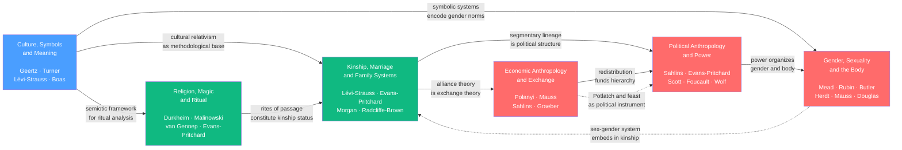

# Culture, Society, and Religion

> [!abstract] Section Overview
> This section examines the symbolic, social, and material structures through which humans make meaning and organize collective life. Beginning with culture as a system of shared symbols, the notes move through the institutions that embed those symbols in practice: kinship and marriage as the grammar of social obligation; religion, magic, and ritual as technologies for renewing solidarity and managing uncertainty; gender and the body as culturally trained surfaces of power; political authority from acephalous bands to bureaucratic states; and economic exchange as a moral as much as a material phenomenon. Together, the six notes argue that no human domain — not economy, not politics, not sexuality — can be understood apart from the cultural meanings in which it is enmeshed.

---

## Notes in This Section

- [[Culture_Symbols_and_Meaning]] — Culture as webs of significance; thick description; Geertz, Turner, Lévi-Strauss; cultural relativism; hybridization and globalization
- [[Religion_Magic_and_Ritual]] — What religion, magic, and ritual *do* socially; Durkheim's sacred/profane and collective effervescence; Malinowski's anxiety-management; van Gennep and Turner on rites of passage; Evans-Pritchard on Azande witchcraft
- [[Kinship_Marriage_and_Family_Systems]] — Kinship as the grammar of social life; descent theory vs. alliance theory; cross-cousin marriage; Morgan's terminologies; the incest taboo; 21st-century kinship beyond biology
- [[Economic_Anthropology_and_Exchange]] — Human economies beyond the market model; Polanyi's reciprocity, redistribution, and market exchange; Mauss's gift as total social fact; Sahlins's original affluent society; Graeber's debt
- [[Political_Anthropology_and_Power]] — Authority from bands to states; acephalous order and segmentary lineage; big-man vs. chief; Scott's hidden transcripts and weapons of the weak; Foucault's governmentality and biopolitics
- [[Gender_Sexuality_and_the_Body]] — Gender and sexuality as cultural constructs; Mead's cross-cultural comparisons; feminist anthropology; third and alternative genders; Butler's performativity; body as social map

---

## Concept Map



*(Blue = foundational entry point, Green = intermediate structural analysis, Red = advanced integrative themes; arrows show primary analytical dependencies)*

---

## Learning Path

Recommended order for a first pass through this section:

1. [[Culture_Symbols_and_Meaning]] — Start here. Establishes the interpretive, semiotic framework — Geertz's thick description, cultural relativism, Lévi-Strauss's structuralism — that every other note in the section presupposes. Without this grounding, the structural analyses of kinship, ritual, and exchange will lack their theoretical scaffolding.

2. [[Religion_Magic_and_Ritual]] — The most direct application of the symbolic framework to specific institutions. Durkheim's sacred/profane, Malinowski's anxiety-management theory, and Turner's liminality all build on the semiotic tools introduced in note 1, while Evans-Pritchard's witchcraft analysis introduces the rationality questions that run through the section.

3. [[Kinship_Marriage_and_Family_Systems]] — The grammar underlying everything else. Descent theory and alliance theory provide the structural logic that connects to both the ritual analysis of note 2 and the exchange analysis of note 4. Understanding kinship is prerequisite to understanding why redistribution, bridewealth, and political segmentation work as they do.

4. [[Economic_Anthropology_and_Exchange]] — Builds directly on kinship's alliance theory (Kula ring, bridewealth, Potlatch) and introduces Polanyi's three modes of integration — reciprocity, redistribution, market — that provide the economic scaffolding for political anthropology.

5. [[Political_Anthropology_and_Power]] — Integrates kinship structure, exchange logic, and cultural symbolism to explain how authority is constituted across the band-tribe-chiefdom-state spectrum. Scott's hidden transcripts and Foucault's governmentality extend the analysis to all forms of power, including the modern state.

6. [[Gender_Sexuality_and_the_Body]] — Read last because it cuts across every preceding theme: it depends on cultural relativism, kinship theory, body technique, exchange theory, and power analysis simultaneously. Butler's performativity and the medical anthropology of the body are best understood after the structural and political frameworks are in place.

---

## Key Themes

- **Meaning is made, not given.** Culture operates through symbols whose significance is socially assigned, not naturally intrinsic — a claim running from Geertz's webs of significance through Mauss's gift-as-total-social-fact to Butler's gender performativity. The feeling of naturalness is itself a cultural product.

- **Institutions are interpenetrating, not autonomous.** Kinship is simultaneously an economic system, a political constitution, and a religious framework. The Potlatch is at once economy, politics, aesthetics, and law. The sacred and the profane organize bodily practice as much as cosmological belief. Disciplinary boundaries imposed on these domains consistently distort what fieldwork reveals.

- **Power is constitutive, not merely repressive.** From Foucault's governmentality to Scott's hidden transcripts to the Potlatch's competitive generosity, power in anthropological perspective does not merely forbid — it produces subjects, norms, bodies, and desires. Gender, ritual authority, and political hierarchy are all effects of power that present themselves as natural facts.

- **Cross-cultural comparison reveals universals through variation.** The incest taboo is universal but its content varies enormously; rites of passage follow van Gennep's three-phase structure in every documented society; gift exchange is ubiquitous but its logic differs radically from commodity exchange. The comparative method identifies structural regularities that no single case could reveal alone.

---

## Cross-Section Links

- [[Classical_Anthropological_Theory]] — The theoretical ancestors of every note in this section: Boas's cultural relativism grounds the symbolic approach; Mauss's gift essay originates economic anthropology; Morgan's kinship terminologies are the empirical basis for descent theory; Frazer's magic-religion-science sequence is the position Malinowski and Tambiah spend their careers overturning.

- [[Functionalism_and_Structural_Functionalism]] — Malinowski's Trobriand fieldwork, Radcliffe-Brown's descent theory, and Evans-Pritchard's Nuer and Azande studies all emerge from this framework; essential background for understanding what the structural-functionalist explanation of ritual, kinship, and political order was and why it was both productive and limited.

- [[Structuralism_and_Symbolic_Anthropology]] — The theoretical bridge between classical anthropology and this section's contemporary concerns; Lévi-Strauss's structural analysis of myth, kinship, and exchange directly generates the alliance theory and exchange logic that appear across multiple notes here.

- [[Ethnographic_Methods_and_Fieldwork]] — Every major claim in this section rests on participant-observation fieldwork; the Freeman controversy over Mead, the colonial conditions of Evans-Pritchard's Nuer ethnography, and Herdt's Sambia research all raise methodological and ethical questions inseparable from the substantive findings.

- [[Primatology_and_Primate_Societies]] — De Waal's chimpanzee politics provides the evolutionary baseline for political anthropology's band-tribe-chiefdom-state typology; the contrast between chimpanzee achieved-status hierarchies and the institutionalized hereditary chiefdom illuminates what the cultural elaboration of political authority adds to its primate precursors.

- [[State_Formation_and_Early_Civilizations]] — The archaeological complement to political anthropology's cross-cultural typology; Carneiro's circumscription theory, temple redistributive economies in Mesopotamia, and Kamehameha's Hawaiian state-formation all ground the conceptual sequence from chiefdom to state in the deep-time material record.

- [[Neolithic_Revolution_and_Agriculture]] — The material transition that makes redistribution, stored surplus, and hereditary chiefdoms possible; Sahlins's original-affluent-society thesis is explicitly a critique of post-Neolithic assumptions about scarcity and subsistence projected backward onto foragers.
```
