# Cognitive Anthropology

> [!abstract] TL;DR
> Cognitive anthropology asks how culture organises mental life — and how mental architecture in turn constrains what cultures can become. From Berlin and Kay's discovery of universal folk taxonomic hierarchies and Rosch's prototype theory, to Quinn and Holland's cultural models of marriage and illness, Hutchins's demonstration that cognition is distributed across whole sociotechnical systems, and Lakoff and Johnson's argument that conceptual metaphors are grounded in bodily experience, the field has progressively dismantled the idea that cognition is a private, culture-neutral process happening inside individual skulls. Neuroanthropology now maps how cultural practices literally reshape cortical architecture, while cognitive archaeology traces the mental capacities — theory of mind, recursion, episodic future thought — that distinguish Homo sapiens' symbolic explosion from the cognitive profile of earlier hominins.

---

## Intuition

**Analogy:** Imagine the same natural landscape — a stretch of wetland with birds, fish, insects, plants, and water — described by three different experts: a Linnaean biologist who classifies by evolutionary descent, an Amazonian ethnobotanist who classifies by edibility and medicinal use, and a child who classifies by "things that fly," "things that swim," and "things that sting." Each classification is internally consistent and useful for its purposes. Each reveals what the classifier cares about, what actions they need to take, and what conceptual scheme organises their world.

Cognitive anthropology begins with this observation — that every human community develops a set of folk classification systems, or *folk models*, that are not arbitrary but follow discoverable cross-cultural patterns, are shaped by shared features of human cognition, and are also deeply stamped by the particular concerns of each culture. The field's central question is where the universal ends and the cultural begins: which features of folk classification reflect the architecture of all human minds, and which reflect the concerns of particular communities?

---

## How It Works

```mermaid
graph TD
    COGAN["Cognitive Anthropology\nHow culture structures mind\nand mind structures culture"]

    ETH["Ethnoscience\nfolk classification systems\nBerlin / Kay / Conklin"]
    CM["Cultural Models Theory\nQuinn and Holland 1987\nshared cognitive schemas"]
    SCH["Schema and Prototype Theory\nRosch 1973-78\nbasic-level categories"]
    DIST["Distributed Cognition\nHutchins 1995\ncognition across people and artifacts"]
    EMBO["Embodied Cognition\nLakoff and Johnson 1980\nconceptual metaphors in the body"]
    NEURO["Neuroanthropology\nculture and neural plasticity\nWEIRD bias critique"]
    COGEVO["Cognitive Evolution\ntheory of mind and recursion\narchaeological proxies"]

    FOLK["Folk taxonomy\ngeneric species as primary level\ncolor term universals"]
    COMP["Componential analysis\nkinship terminologies\ncross-cultural semantics"]

    FOLKM["Folk models of illness\nmarriage and economics\ndeployed in discourse"]
    PROTO["Prototypicality\nbest example of a category\ncross-cultural variation"]
    BASIC["Basic-level categories\nmost informative for least effort\ndog vs. animal vs. terrier"]

    SHIP["Ship navigation\ncognitive labor distributed\nacross crew, instruments, and charts"]

    ORI["Orientational metaphors\nMORE IS UP and HAPPY IS UP\nbodily grounding of abstract concepts"]
    CVAR["Cross-cultural variation\ncontainerization, motion, time\nvs. universal embodied grounding"]

    WEIRD["WEIRD bias\nWestern Educated Industrialized\nRich Democratic research samples"]
    PLAST["Cultural learning\nand neural plasticity\nmeditation, literacy, music"]

    TOML["Theory of mind\nrecursion and planning depth\nsymbolic explosion in H. sapiens"]
    ARCH["Archaeological proxies\nburials, ochre, engravings\nfor symbolic cognition"]

    COGAN --> ETH
    COGAN --> CM
    COGAN --> SCH
    COGAN --> DIST
    COGAN --> EMBO
    COGAN --> NEURO
    COGAN --> COGEVO

    ETH --> FOLK
    ETH --> COMP
    CM --> FOLKM
    SCH --> PROTO
    SCH --> BASIC
    DIST --> SHIP
    EMBO --> ORI
    EMBO --> CVAR
    NEURO --> WEIRD
    NEURO --> PLAST
    COGEVO --> TOML
    COGEVO --> ARCH

    FOLK -.->|"universals vs. variation"| CVAR
    PROTO -.->|"embodied grounding of best examples"| ORI
    PLAST -.->|"cultural learning reshapes cognition"| TOML

    style COGAN fill:#2c3e7a,color:#fff
    style ETH fill:#7a2c2c,color:#fff
    style CM fill:#2c7a4e,color:#fff
    style SCH fill:#7a5c2c,color:#fff
    style DIST fill:#4a2c7a,color:#fff
    style EMBO fill:#2c6a7a,color:#fff
    style NEURO fill:#7a4a2c,color:#fff
    style COGEVO fill:#5c7a2c,color:#fff
```



The tradition descends from two intellectual sources that pulled in opposite directions. The first is the **universalist** impulse in American structural linguistics: Boas, Sapir, and Whorf noticed that different languages classify reality differently — the famous Hopi time example, the Inuit snow lexicon — and debated whether this means different communities *think* differently. The second is the **cognitive science** impulse: the information-processing revolution of the 1960s–70s asked whether mental representations have predictable structure. Cognitive anthropology emerged from the collision, asking: if cognition has universal architecture, how does culture get inside it?

---

## Key Concepts

### Secondary Level

**Ethnoscience and folk classification**

Ethnoscience — the study of how communities classify the natural world — emerged in the 1950s–60s from the work of Harold Conklin on Hanunoo (Philippine) ethnobotany and Charles Frake on Subanun (Philippine) disease terminology. The core methodological innovation was **componential analysis**: treating a semantic domain (kinship terms, disease categories, plant names) as a set of lexical items whose meanings can be decomposed into a finite set of binary features. English kinship terms, for instance, can be decomposed along three axes: generation (same as speaker / parent's / grandparent's), lineality (lineal / collateral), and sex of relative. Every term selects a unique combination:

| Term | Generation | Lineality | Sex of relative |
|---|---|---|---|
| Father | +1 | Lineal | Male |
| Uncle | +1 | Collateral | Male |
| Aunt | +1 | Collateral | Female |
| Brother | 0 | Collateral | Male |
| Cousin | 0 | Collateral | — |

Componential analysis reveals that different cultures carve the same semantic territory differently, but the dimensions of contrast are drawn from a finite, cross-culturally shared set of features — a finding that supports limited universalism.

**Folk taxonomy: the Berlin/Kay contribution**

Brent Berlin and Paul Kay's research across dozens of languages on folk biological taxonomy and color terminology produced two major findings:

1. **Folk taxonomic hierarchies are universal in structure.** Across cultures, folk biological classification follows a consistent five-level hierarchy: unique beginner (life form → plant/animal) → life form (tree, bird, fish) → **generic species** (oak, robin, trout) → specific (white oak, American robin) → varietal. The **generic species** level is linguistically and cognitively primary: it is the level with the most named taxa, the most informative categorisation for the least cognitive effort, and the first level children learn. Linnaean taxonomy maps imperfectly onto this folk structure — folk generics often correspond to biological genera, but not always.

2. **Color term universals reveal constrained variation.** Berlin and Kay (1969) found that although languages vary enormously in how many basic color terms they have (from 2 to 11), they follow a strict implicational hierarchy: if a language has N color terms, the specific terms present are predictable. A language with two terms always has black and white (or dark and light). If it has three, it adds red. If four, it adds either yellow or green. If five, both yellow and green. If six, blue. If seven, brown. This implies that color categories are not arbitrary cultural constructs but are anchored in universal features of human visual perception (especially the unique hues at the perceptual poles of the color space).

**Cultural models theory: Quinn, Holland, and shared cognitive schemas**

Naomi Quinn, Dorothy Holland, and colleagues (1987) introduced the concept of **cultural models** — shared cognitive schemas that are taken for granted within a community, structure experience and inference, and are deployed in discourse without being explicitly stated. A cultural model is not a rule or a belief that can be directly reported; it is a background cognitive structure that organises the relevance of information and makes certain inferences feel obvious.

Quinn's study of American folk models of marriage is the canonical example. Through intensive analysis of a large corpus of interview transcripts, Quinn identified a coherent set of underlying premises that American interviewees drew on when talking about marriage:

- Marriages are entered into voluntarily by two people who *choose* each other
- The goal of marriage is a *fulfilling* relationship, not merely a functional domestic arrangement
- The marriage commitment is *permanent* — it is supposed to last
- Spouses are *compatible* — they share values, interests, and temperament
- A *good* marriage requires mutual effort and is not guaranteed

These premises are not stated; they are presupposed. They structure what counts as a problem (incompatibility), what counts as a failure (divorce), and what counts as a success (lasting fulfillment). Crucially, they differ from folk models of marriage in cultures where marriages are arranged, where compatibility is not a precondition but a hoped-for result, or where the goal is lineage continuity rather than personal fulfillment. Quinn's point is that these premises are not held as explicit beliefs but are *cognitively foundational* — they organise the entire discourse.

**Schema theory and prototypes: Rosch's contribution**

Eleanor Rosch's prototype theory (1973–78) showed that natural categories are not organised around necessary and sufficient conditions (the "classical" view of concepts) but around **prototypes** — the clearest, most typical instances of the category. The category "bird" is not defined by "has feathers + has wings + lays eggs"; it is organised around a prototype (in English-speaking North America: probably a robin or sparrow) against which other instances are judged for typicality. Eagles are good birds; penguins are poor birds; ostriches are borderline. The category has graded internal structure, not a sharp boundary.

Rosch identified the **basic level** as the psychologically most privileged categorical level — the level at which:
- Categories are the most informative (maximum within-category similarity, maximum between-category difference)
- People respond fastest in category verification tasks
- Learned names come earliest in development
- Mental images are most readily formed

"Dog" is basic level; "animal" is too abstract; "terrier" is too specific. Basic-level categories are where most human cognitive action happens. Their existence across cultures, anchored at roughly the same taxonomic position in folk hierarchies, is one of the strongest pieces of evidence for universal cognitive architecture.

Schemas in the cognitive anthropological sense are the larger knowledge structures into which prototypes are embedded. Roger Schank and Robert Abelson's (1977) **scripts** — stereotyped sequences of events for routine situations like "going to a restaurant" — are a special case of schemas: they contain default values for unspecified slots (the waiter brings a menu; you look at it; you order; you eat; you pay) and allow participants to communicate efficiently by relying on shared background.

---

### Undergraduate Level

**Distributed cognition: Edwin Hutchins**

Edwin Hutchins's *Cognition in the Wild* (1995) is the foundational work in distributed cognition, an approach that treats cognitive processes as properties not of individual minds but of **systems** composed of people, artifacts, and representational media working together.

Hutchins studied the navigation of a US Navy ship as an extended cognitive system. Navigating a large vessel requires continuous computation of the ship's position, heading, and rate of change — tasks that no single navigator performs alone. The computation is distributed across:

- Multiple crew members with differentiated roles (bearing taker, plotter, recorder)
- Physical artifacts (alidades, chart tables, parallel rulers, pelorus)
- Representational media (nautical charts, plotting sheets, speed/distance/time tables)
- Procedures and practices that coordinate the activities of the different components

The insight is that the *system* navigates, not the navigator. The cognitive properties of the system — its memory, its computational capacity, its error-correction mechanisms — are not located in any individual's skull but are distributed across the sociotechnical assembly. When the ship navigates, the computation is performed partly by human brains, partly by physical artifacts that carry and transform representations (the chart's coordinate system stores the previous fixes; the ruler performs the linear projection), and partly by the procedural coordination among crew members.

This has profound implications. What looks like a cognitive skill (navigation) is actually a social-material practice. Breakdowns in the system (a key person absent, a piece of equipment failing) are not individual failures but system failures. Designing better cognitive systems means designing better sociotechnical environments, not just better-trained individuals. Hutchins explicitly connects his framework to cognitive archaeology: early human tool-making, language, and art are not evidence of individual cognitive prowess but of emerging distributed cognitive systems.

The distributed cognition framework has been applied to:

| Domain | What is distributed | Cognitive property distributed |
|---|---|---|
| Surgery | Surgeon, nurses, instruments, checklists | Memory, coordination, error-detection |
| Air traffic control | Controllers, computers, flight strips, radar | Attention, memory, communication |
| Scientific laboratories | Scientists, instruments, data systems | Hypothesis testing, data storage, inference |
| Software teams | Developers, version control, issue trackers | Task memory, coordination, review |

**Embodied cognition: Lakoff and Johnson**

George Lakoff and Mark Johnson's *Metaphors We Live By* (1980) proposed that abstract thought is fundamentally structured by **conceptual metaphors** — systematic mappings from a bodily source domain to an abstract target domain. These mappings are not decorative rhetorical flourishes but the cognitive structures through which abstract concepts are understood and reasoned about.

The most documented conceptual metaphors are **orientational metaphors** — they organize abstract concepts in terms of spatial orientations derived from bodily experience:

| Conceptual metaphor | Linguistic evidence | Embodied basis |
|---|---|---|
| MORE IS UP | prices are rising, output is up, stocks climbed | More liquid fills a container upward; stacks of objects grow upward |
| HAPPY IS UP | she's on cloud nine, my spirits lifted, he's feeling low | Erect posture in positive states; slumped posture in negative states |
| GOOD IS LIGHT / BAD IS DARK | a bright future, shady dealings, dark thoughts | Daylight = safety and visibility; darkness = danger |
| ARGUMENT IS WAR | he attacked my position, I defended my view, she demolished his argument | Physical confrontation as a schema for adversarial discourse |
| TIME IS A RESOURCE | spend time wisely, save time, don't waste my time | Finite bodily energy mapped onto abstract time |

The claim is that these mappings are not arbitrary — they are *motivated* by the structure of bodily experience. The body provides the raw material for abstract thought through **image schemas**: recurring patterns of bodily interaction with the world (CONTAINER, PATH, SOURCE-PATH-GOAL, LINK, FORCE, BALANCE) that are abstracted and projected onto non-bodily domains.

Cross-cultural variation in conceptual metaphors is substantial and reveals cultural priorities:

- In many East Asian languages, time is conceptualised along a vertical axis (earlier is UP in Mandarin, as well as in English); in Aymara (Andean), the future is behind the speaker and the past is in front — the reverse of the English spatial metaphor — because you can *see* the past (it is known and visible) but not the future
- The container schema for individual identity (a person is a container, with an inside and an outside) is strong in Western cultures but weaker in cultures where personhood is more relationally constituted
- "Argument is war" is a strong English conceptual metaphor, but not universal; Lakoff suggests that "argument is a collaborative journey" is available and occasionally used

The key debate is between **universalist embodied grounding** (all humans share the same body, so the primary image schemas are universal) and **cultural variation in elaboration** (how the primary schemas are extended into specific conceptual domains varies substantially across cultures). Most researchers accept both: embodied grounding provides the starting material; cultural history determines how it is developed.

**Schema theory and scripts in ethnographic practice**

Cognitive anthropologists use schemas and scripts as analytical tools for ethnographic data. When an informant explains a cultural practice — a wedding, a healing ritual, a trade transaction — they routinely leave out information that "goes without saying" for a member of the culture. This missing information is precisely what resides in the shared cultural schema. Ethnographers can reconstruct the schema by systematically attending to what is elided, assumed, or treated as obvious.

Holland and Quinn argue that cultural models operate at two levels: the model itself (the schema content: what a good marriage requires, what causes illness, what makes a business fair) and the **deployment** of the model in discourse (how it is drawn on to explain, evaluate, justify, or predict). The same cultural model of marriage that underlies a sympathetic account of a divorce ("we were just incompatible") also underlies a prescriptive account of what a good marriage requires. Both deploy the same underlying schema, but for different rhetorical purposes.

---

### Graduate Level

**Neuroanthropology: culture, learning, and neural plasticity**

Neuroanthropology — the research programme linking cultural practices to neural processes — moves cognitive anthropology's insights into the biology of the brain. The central claim, consistent with the distributed cognition and biocultural traditions, is that cultural practices are not merely correlated with patterns of neural activity but actively shape the architecture of the brain through the mechanisms of neuroplasticity.

The most compelling evidence comes from studies of expert cultural practitioners:

- **Musicians**: professional orchestral musicians show enlarged motor cortex representation of the fingers, enlarged corpus callosum (connecting the hemispheres), and higher grey matter density in prefrontal regions involved in planning. The degree of change correlates with the age at which musical training began and the hours of practice — a dose-response relationship consistent with experience-dependent plasticity.
- **Meditators**: Buddhist monks with tens of thousands of hours of meditation practice show increased gamma-wave synchrony during open-monitoring meditation (a state associated with heightened meta-cognitive awareness), enlarged insula (interoceptive processing), and reduced amygdala reactivity to emotional stimuli. The Tibetan practice of *tummo* (heat meditation) produces measurable thermogenic effects (core temperature rises by several degrees) through learned volitional control of normally autonomic processes.
- **Literates vs. non-literates**: adults who learn to read for the first time in middle or late life show altered left hemisphere language areas (increased activation of the left angular gyrus and the horizontal portion of the plunum temporale) and changes in face recognition (reduced right hemisphere lateralisation for faces — literacy "steals" cortical territory from the right hemisphere's face recognition network). This is the most direct evidence that a culturally transmitted skill — alphabetic literacy — rewires the brain.

The neuroanthropological programme also mounts a methodological critique of mainstream cognitive neuroscience: the **WEIRD bias**. Joseph Henrich, Steven Heine, and Ara Norenzayan (2010) published a highly influential analysis showing that the vast majority of psychology and cognitive neuroscience research is conducted on populations from Western, Educated, Industrialized, Rich, and Democratic societies — which represent roughly 12% of the global population but supply over 96% of the psychological research sample. Critically, WEIRD populations are not simply underrepresented; they are *outliers* on many dimensions:

| Cognitive domain | WEIRD sample result | Global variation |
|---|---|---|
| Visual perception | Strong susceptibility to Müller-Lyer illusion | Forager populations show near-zero susceptibility |
| Fairness norms | Strong preference for equal splits in ultimatum game | Wide cross-cultural variation, linked to market integration |
| Independent vs. relational self | Strong independent self-concept | More relational self-concepts in East Asia and forager societies |
| Moral reasoning | Predominantly harm-based | Cross-cultural variation in authority, purity, loyalty dimensions |
| Color categorisation | Russian perceptual distinction between light blue (goluboy) and dark blue (siniy) is faster than English distinction | Multiple cross-cultural differences in color discrimination speed |

The WEIRD critique does not claim that all cognition is culturally relative. It claims that the universality of specific cognitive findings cannot be assumed from samples drawn from a single cultural cluster, and that genuine universals must be demonstrated through cross-cultural replication rather than assumed from Western-educated subjects.

**Moral intuitions and the moral foundations debate**

Jonathan Haidt's moral foundations theory, drawing on cross-cultural psychological anthropology, proposes that moral intuitions are not a single dimension (harm/care) but a modular set of evolved psychological dispositions that different cultures emphasise to different degrees:

1. **Care/Harm**: concern for suffering and protection of vulnerable individuals
2. **Fairness/Reciprocity**: concern for proportionality, justice, and cheating detection
3. **Loyalty/Betrayal**: concern for group solidarity and in-group cohesion
4. **Authority/Subversion**: concern for legitimate hierarchy and respect
5. **Sanctity/Purity**: concern for bodily and spiritual purity, disgust responses
6. **Liberty/Oppression**: concern for freedom from domination (added later)

WEIRD populations (especially politically progressive Westerners) score high on Care and Fairness but relatively low on Loyalty, Authority, and Sanctity. Non-WEIRD populations and politically conservative Western populations score more evenly across all foundations. Haidt argues that this is not a difference in moral sophistication but a difference in which modules are culturally activated and elaborated — all six foundations are available to all humans as part of the evolved moral psychology, but cultures weight them differently.

**Cognitive evolution: theory of mind, recursion, and archaeological proxies**

The most ambitious claim in cognitive anthropology is that the distinctive cognitive capacities of Homo sapiens — the capacities that enable cultural transmission, symbolic thought, and the construction of the cumulative cultural systems that neuroanthropology studies — evolved relatively recently and left traces in the archaeological record.

Key capacities proposed as uniquely or strongly developed in H. sapiens:

- **Theory of mind (ToM)**: the ability to attribute mental states (beliefs, desires, intentions) to others and to reason about what others know, believe, or intend. Full recursive ToM — "I believe that you think that she wants that he knows..." — requires representing mental states about mental states, which demands high working memory load and recursive syntactic capacity. Great apes have some degree of goal-attribution (they understand that others are trying to do something) but the evidence for full false-belief understanding in non-human primates remains contested.

- **Recursion and displacement**: Chomsky argued that human language is distinguished by its recursive syntax (embedding clauses within clauses without limit), which enables **displacement** — talking about things not present in space or time: the past, the future, hypothetical states, absent objects. The "language of thought" that this enables is prerequisite for planning, for counterfactual reasoning, and for the transmission of complex procedural knowledge.

- **Episodic future thought**: the capacity to project oneself into hypothetical future scenarios and mentally rehearse possible actions. This is closely related to episodic memory (mentally time-travelling to past events) — both involve the hippocampal-prefrontal network and both are impaired by hippocampal damage. Episodic future thought enables the extended planning horizons required for long-distance trade, seasonal food storage, and long-term social alliance management.

**Archaeological proxies for cognitive complexity**

The question of when these capacities emerged is debated. The major archaeological proxies for symbolic and complex cognition include:

| Proxy | Earliest date | Significance |
|---|---|---|
| Ochre use and abstract engravings (Blombos Cave, South Africa) | ~100,000–75,000 BP | Intentional symbolic marking; red ochre as pigment for body decoration or symbolic marking |
| Perforated marine shell ornaments | ~130,000 BP (North Africa) | Ornaments imply shared symbolic code — others must understand what the ornament signifies |
| Long-distance raw material exchange | ~100,000 BP | Implies social networks extending beyond face-to-face communities; deferred exchange requiring trust and planning |
| Figurative art (Venus figurines, cave paintings) | ~40,000–35,000 BP (Europe) | Full symbolic representation; counterfactual beings (human-animal hybrids) imply recursive imagination |
| Musical instruments (Swabian Jura flutes) | ~43,000–40,000 BP | Procedural cultural transmission and shared aesthetic norms |
| Formal burials with grave goods | ~100,000 BP (Israel); widespread ~30,000 BP | Attribution of continued personhood to the dead; cross-community ritual |

The debate about the timing of the "cognitive revolution" — whether the symbolic explosion is a product of a rapid neural change ca. 50,000 BP (the "Great Leap Forward" model of Jared Diamond and Richard Klein) or of gradual accumulation of behavioural modernity visible in Africa from 200,000 BP onward (the "gradualist" model of Mcbrearty and Brooks) — is directly relevant to cognitive anthropology because it bears on whether the cognitive capacities underlying culture are old and universal or relatively recent and specifically African.

**Niche construction and gene-culture coevolution**

The evolutionary anthropologist's contribution to cognitive anthropology is the concept of **niche construction**: organisms do not merely adapt to pre-existing environments but actively modify their environments, which then creates new selection pressures. Humans are the most extreme niche constructors — language, cooking, agriculture, and social institutions create radically novel environments that feed back onto biological evolution.

The implications for cognitive anthropology are twofold. First, many distinctively human cognitive capacities (high social learning fidelity, extended working memory, sensitivity to prestige-based social influence) may have been shaped by the cultural environments that ancestors created — generating a gene-culture coevolution dynamic in which cultural innovations drive genetic change. The lactase persistence allele (enabling adult milk digestion, which is rare in non-human mammals) spread rapidly in dairying populations over the last 7,000 years, driven by selection in a cultural environment that humans themselves created. Similar coevolutionary dynamics may have shaped brain size, vocal anatomy, and social cognition. Second, this means that the "universal architecture" that cognitive anthropology posits as the baseline is not a fixed genetic endowment but the product of a long history of cultural selection — making the boundary between universal and cultural less fixed than early cognitivist approaches assumed.

---

## Python Demo

```python
import numpy as np
import matplotlib.pyplot as plt

np.random.seed(42)

# ── Cultural Schema Transmission Model ───────────────────────────────────────
#
# Agents hold 2-dimensional "illness schema" vectors representing their folk
# illness model (e.g., for "susto" — soul fright — in Mesoamerican cultures):
#   axis 0: perceived cause  (0 = supernatural/spiritual, 1 = physiological)
#   axis 1: perceived treatment (0 = ritual healer, 1 = biomedical intervention)
#
# Update rule at each time step (social learning with innovation noise):
#   schema_i(t+1) = (1 - alpha) * schema_i(t)
#                  + alpha * mean(neighbors' schemas)
#                  + Gaussian noise
#
# Three network conditions:
#   Dense   -- one community, all agents connected -> shared cultural prototype
#   Isolated -- two communities with different initial schemas, no cross-links
#               -> internally convergent but inter-group divergence preserved
#   Bridge  -- same initial split + 4 "cultural broker" cross-community links
#               -> partial homogenisation depends on broker influence

N_HALF = 40       # agents per community
T = 80            # time steps (cultural generations)
ALPHA = 0.20      # social learning rate
SIGMA = 0.03      # per-step individual innovation noise

# ── Helper functions ──────────────────────────────────────────────────────────

def fully_connected(n):
    return np.ones((n, n)) - np.eye(n)

def run_sim(adj, init, alpha=ALPHA, sigma=SIGMA, seed=0):
    rng = np.random.default_rng(seed)
    schemas = init.copy().astype(float)
    N_agents = schemas.shape[0]
    history = np.empty((T, N_agents, 2))
    row_sums = adj.sum(axis=1, keepdims=True)
    row_sums[row_sums == 0] = 1     # guard against isolated nodes
    for t in range(T):
        history[t] = schemas
        neighbor_mean = (adj @ schemas) / row_sums   # (N, 2)
        schemas = (1 - alpha) * schemas + alpha * neighbor_mean
        schemas += rng.normal(0, sigma, schemas.shape)
        schemas = np.clip(schemas, 0, 1)
    return history

def diversity_over_time(history):
    """Mean pairwise Euclidean distance at each time step."""
    n_steps, n_agents = history.shape[0], history.shape[1]
    div = np.empty(n_steps)
    for t in range(n_steps):
        s = history[t]
        diff = s[:, None, :] - s[None, :, :]          # (N, N, 2)
        dists = np.sqrt((diff ** 2).sum(axis=2))       # (N, N)
        div[t] = dists[np.triu_indices(n_agents, k=1)].mean()
    return div

# ── Initial schemas ───────────────────────────────────────────────────────────

rng0 = np.random.default_rng(7)
N = N_HALF * 2

# Dense: all 80 agents start scattered uniformly across schema space
init_dense = rng0.uniform(0, 1, (N, 2))

# Isolated: two communities with different initial beliefs
init_A = rng0.normal([0.20, 0.80], 0.12, (N_HALF, 2)).clip(0, 1)  # spiritual/ritual
init_B = rng0.normal([0.80, 0.20], 0.12, (N_HALF, 2)).clip(0, 1)  # physio/biomedical
init_split = np.vstack([init_A, init_B])

# ── Adjacency matrices ────────────────────────────────────────────────────────

adj_dense = fully_connected(N)

adj_iso = np.block([
    [fully_connected(N_HALF), np.zeros((N_HALF, N_HALF))],
    [np.zeros((N_HALF, N_HALF)), fully_connected(N_HALF)]
])

adj_bridge = adj_iso.copy()
for i in range(4):          # 4 cultural broker pairs
    adj_bridge[i, N_HALF + i] = 1
    adj_bridge[N_HALF + i, i] = 1

# ── Run simulations ───────────────────────────────────────────────────────────

hist_dense  = run_sim(adj_dense,  init_dense,        seed=1)
hist_iso    = run_sim(adj_iso,    init_split,         seed=2)
hist_bridge = run_sim(adj_bridge, init_split.copy(),  seed=3)

div_dense   = diversity_over_time(hist_dense)
div_iso     = diversity_over_time(hist_iso)
div_bridge  = diversity_over_time(hist_bridge)

# ── Plot ──────────────────────────────────────────────────────────────────────

fig, axes = plt.subplots(2, 3, figsize=(15, 9))
fig.suptitle(
    "Cultural Schema Transmission Model (Quinn / Holland cultural models framework)\n"
    "Folk illness beliefs (cause × treatment) spread through social networks;\n"
    "network structure drives convergence toward a shared prototype or community divergence",
    fontsize=10, fontweight="bold"
)

X_LBL = "Perceived cause:  supernatural (0) → physiological (1)"
Y_LBL = "Perceived treatment:  ritual healer (0) → biomedical (1)"
C_DENSE = "#2980b9"
C_A     = "#e74c3c"
C_B     = "#27ae60"
C_BRG   = "#8e44ad"

KARGS = dict(alpha=0.7, s=40, edgecolors="white", linewidth=0.5)

# Top row: Dense network at t=0 and t=79, plus diversity curves
for col, t in enumerate([0, T - 1]):
    ax = axes[0, col]
    ax.scatter(hist_dense[t, :, 0], hist_dense[t, :, 1], color=C_DENSE, **KARGS)
    if t == T - 1:
        c = hist_dense[t].mean(axis=0)
        ax.scatter(*c, color="gold", s=180, marker="*", zorder=5,
                   label=f"Schema prototype  ({c[0]:.2f}, {c[1]:.2f})")
        ax.legend(fontsize=8)
    ax.set(xlim=(-0.05, 1.05), ylim=(-0.05, 1.05), xlabel=X_LBL, ylabel=Y_LBL,
           title="Dense network — t = 0  (initial scatter)" if t == 0
                 else "Dense network — t = 80  (shared cultural model / prototype)")
    ax.grid(alpha=0.2)

ax = axes[0, 2]
ts = np.arange(T)
ax.plot(ts, div_dense,  color=C_DENSE, lw=2,         label="Dense  (1 community)")
ax.plot(ts, div_iso,    color=C_A,     lw=2, ls="--", label="Isolated  (2 communities)")
ax.plot(ts, div_bridge, color=C_BRG,   lw=2, ls=":",  label="Bridge  (4 cultural brokers)")
ax.set(xlabel="Time step  (social learning generations)",
       ylabel="Mean pairwise schema distance",
       title="Within-population schema diversity over time\n"
             "(dense networks drive rapid convergence toward Quinn/Holland shared prototype)")
ax.legend(fontsize=8)
ax.grid(alpha=0.2)

# Bottom row: Isolated at t=0, isolated at t=79, bridge at t=79
conditions = [
    (hist_iso,    0,   "Isolated communities — t = 0\n(A: supernatural-ritual; B: physiological-biomedical)"),
    (hist_iso,    T-1, "Isolated communities — t = 80\n(internally convergent; inter-group divergence preserved)"),
    (hist_bridge, T-1, "Bridge condition — t = 80\n(4 cultural brokers partially homogenise schemas)"),
]
for col, (hist, t, title) in enumerate(conditions):
    ax = axes[1, col]
    ax.scatter(hist[t, :N_HALF, 0], hist[t, :N_HALF, 1], color=C_A, **KARGS,
               label="Community A  (supernatural)")
    ax.scatter(hist[t, N_HALF:, 0], hist[t, N_HALF:, 1], color=C_B, **KARGS,
               label="Community B  (biomedical)")
    ax.set(xlim=(-0.05, 1.05), ylim=(-0.05, 1.05),
           xlabel=X_LBL, ylabel=Y_LBL, title=title)
    ax.legend(fontsize=7, loc="upper right")
    ax.grid(alpha=0.2)

plt.tight_layout()
plt.savefig("cognitive_anthropology_schema_transmission.png", dpi=150, bbox_inches="tight")
plt.show()

# ── Summary statistics ────────────────────────────────────────────────────────
print("\n=== Schema Convergence Summary ===")
for label, div in [("Dense network (1 community)", div_dense),
                   ("Isolated communities (2)", div_iso),
                   ("Bridge (4 cultural brokers)", div_bridge)]:
    reduction = (div[0] - div[-1]) / div[0] * 100
    print(f"{label:<32}  initial={div[0]:.3f}  final={div[-1]:.3f}  "
          f"diversity reduction={reduction:.1f}%")
```

**What the simulation shows:**

- **Panel 1 (dense, t=0)**: Individual illness beliefs are scattered across the entire schema space — high diversity, no shared model. This models a scenario where social learning has not yet operated.
- **Panel 2 (dense, t=80)**: Beliefs converge toward a shared prototype, but individual variation persists around it (due to noise). This models Quinn and Holland's cultural model: not a rigid rule but a shared probabilistic attractor with individual variation.
- **Panel 3 (diversity curves)**: The dense community converges fastest; the isolated communities maintain lower overall diversity (they converge internally but toward *different* attractors); the bridge condition lies between — the four cultural brokers pull the communities toward each other but cannot achieve full integration in 80 generations.
- **Bottom panels (isolated)**: Each community becomes internally coherent (tight cluster) while remaining distinct from the other — the mechanism behind why different cultural communities develop incompatible illness models for the same symptoms. The bridge condition shows partial convergence: the communities overlap more at t=80 than without brokers, but retain distinct schema centres.

---

## Real-World Applications

> **Example 1 — Berlin/Kay color terms and product design.** The finding that color categories are not arbitrary has direct commercial implications. Naming a product color requires navigating the intersection of focal color terms (which are cross-culturally grounded), language-specific additional terms (Russian *goluboy* vs. *siniy*; Japanese *ao* covering both green and blue historically), and culturally specific color symbolism (red as lucky in China; white as mourning in Japan). A global brand that assumes its English color vocabulary will translate cleanly into Chinese or Japanese will produce category mismatches. Cognitive anthropology's framework predicts exactly where the mismatches will occur: at the boundaries of basic-level color categories, not at the focal centers.

> **Example 2 — Cultural models of illness and global health.** WHO and NGO interventions for diseases like tuberculosis and HIV have repeatedly found that biomedical explanations of pathogen transmission conflict with folk illness models based on imbalance, spirit intrusion, or pollution. Anthropologists working with Quinn and Holland's framework have shown that the folk models are not simply ignorance but coherent cognitive structures that organise all relevant information (who gets sick, why, what treatments are appropriate, what a cure looks like). Effective health communication must engage the folk model as a cognitive structure — explaining the germ theory in terms of the existing schema's logic (the germ as an invasive spirit that violates the body's boundaries) rather than simply contradicting it.

> **Example 3 — Hutchins and aviation safety.** The distributed cognition framework directly informed the redesign of cockpit procedures following a series of aviation accidents in the 1970s–80s. Accident investigations showed that many crashes resulted not from individual pilot error but from **system failures** — breakdowns in the distribution of cognitive tasks across pilot, co-pilot, instruments, and procedures. Crew resource management (CRM) training, mandated since the 1980s, is a direct application of distributed cognition: it treats the cockpit crew as a cognitive system and trains the coordination protocols (the "social software") that allow the system to function even when individual components fail.

> **Example 4 — Conceptual metaphor in political framing.** George Lakoff applied conceptual metaphor theory directly to American political communication. The metaphor CRIME IS A PREDATOR (crime hunts victims; we need to get tough on criminals; communities are prey) activates a different set of policy inferences than CRIME IS A DISEASE (crime spreads through communities; we need to treat the conditions that breed it; infected areas need resources). Both are metaphorical frames for the same empirical phenomenon, but they motivate opposite policy responses. Lakoff argued (in *Don't Think of an Elephant*, 2004) that much of the apparent irrationality of political argument is actually the predictable consequence of which conceptual metaphor has been activated as the primary frame — a directly cognitive-anthropological explanation of political cognition.

> **Example 5 — The WEIRD bias and replications in psychology.** Following Henrich et al. (2010), a wave of cross-cultural replication studies found major failures. The Müller-Lyer illusion, perhaps the most famous demonstration in the history of perceptual psychology, is strong in Western urban samples but near-absent in San (Bushmen) and other forager populations — populations whose visual environment does not contain the right-angle corners and receding lines of Western constructed space. If the illusion is not universal, the cognitive mechanism that produces it is not simply "how the human visual system works" but a product of a culturally shaped perceptual history.

---

## Common Pitfalls

- **Confusing the folk taxonomy with the Linnaean taxonomy** — Berlin's five-level folk hierarchy (unique beginner → life form → generic species → specific → varietal) does not map neatly onto Linnaean ranks (kingdom → phylum → class → order → family → genus → species). Folk generics often correspond to Linnaean genera, but the correspondence is imperfect and varies by domain. Assuming that folk taxonomy is an imperfect approximation to scientific taxonomy misses Berlin's actual claim: folk taxonomy is a *different* but equally coherent classification system, organised by different criteria (salience, usability, visual gestalt) rather than by evolutionary descent.

- **Treating cultural models as explicit beliefs** — Quinn and Holland's cultural models are *tacit* cognitive schemas — they are not accessible to direct report. Asking an informant "What do you believe about marriage?" will not reveal the underlying cultural model; it will produce the rationalised, reported version. Cultural models are reconstructed analytically from patterns in discourse, from what informants treat as self-evident, from what inferences they make without articulating the premise. Operationalising cultural models as survey items conflates the model with its surface outputs.

- **Collapsing distributed cognition into "teamwork"** — Hutchins's distributed cognition framework is not simply a theory about collaborative work. The crucial point is that the *cognitive system* — the entity that does the remembering, reasoning, and planning — includes artifacts, representational media, and physical environments as components, not just human individuals. A writing system is not just a tool used by a cognising human; it is a component of the cognitive system that performs representational and memory functions that the individual brain does not and cannot perform alone. Flattening "distributed cognition" into "good teamwork" loses the core theoretical insight about the extended boundary of cognitive systems.

- **Conflating the weak and strong Sapir-Whorf hypotheses** — The strong version of linguistic relativity — that language determines thought, that speakers of different languages have incommensurable conceptual worlds — is empirically false and was never seriously defended by Whorf himself. The weak version — that language *influences* thought, making certain categorisations more accessible and certain inferences more habitual — is empirically supported, especially in the domains of color, spatial orientation, and number. Cognitive anthropologists who invoke linguistic relativity must specify which version and which domain they are defending.

- **Treating the WEIRD bias as complete relativism** — The WEIRD critique does not claim that all psychological findings are culture-specific or that human cognition is infinitely variable. It claims that *specific findings* must be cross-culturally validated before being generalised as universal human capacities. Many findings do replicate cross-culturally (basic perceptual mechanisms, core social cognitive capacities like theory of mind at the basic level, emotional recognition of basic facial expressions). The point is methodological discipline, not theoretical relativism.

- **Assuming that embodied metaphors require conscious access** — Lakoff and Johnson's conceptual metaphors are not deliberate rhetorical choices; they are the default cognitive structure through which abstract reasoning proceeds. The metaphor MORE IS UP is not noticed by English speakers as a metaphor — it is invisible precisely because it is foundational. This means that cross-cultural comparisons of conceptual metaphors cannot rely on informant reports; they require systematic corpus analysis and priming experiments to reveal the underlying mappings.

---

## Related Concepts

- [[_MOC_Language_and_Cognition|↑ Language and Cognition MOC]] — Section map for all 7 notes in this section
- [[Structuralism_and_Symbolic_Anthropology]] — Lévi-Strauss's binary opposition theory is cognitive anthropology's structuralist ancestor: like cognitive anthropology, it posits that culture is organised by universal cognitive architecture (binary oppositions as deep cognitive grammar). The difference is that cognitive anthropology (post-Rosch) treats categories as graded and prototype-based rather than binary; and cultural models theory allows for far more cultural specificity in schema content than Lévi-Strauss's universalism permits. Geertz's interpretive anthropology and cognitive anthropology share the conviction that meaning is the central object of analysis, but cognitive anthropology treats schemas as psychological realities that can be studied empirically, not merely as texts to be read.
- [[Culture_Symbols_and_Meaning]] — The symbolic anthropology tradition (Geertz, Turner, Douglas) and cognitive anthropology converge on the centrality of meaning, but diverge on method and level of analysis: symbolic anthropology is interpretive and hermeneutic; cognitive anthropology seeks to map the psychological structures (schemas, prototypes, folk models) that give symbols their cognitive purchase. Cultural models and symbols are related but distinct: a symbol is the public representation; a cultural model is the internal cognitive schema that interprets the symbol.
- [[Biocultural_Anthropology]] — The biocultural tradition is cognitive anthropology's closest biological ally: both treat biology and culture as mutually constitutive. Neuroanthropology is the overlap zone, studying how cultural practices reshape neural architecture. Gene-culture coevolution frameworks (Richerson and Boyd, Henrich) bridge neuroanthropology and evolutionary biology by treating cultural learning capacities as evolved adaptations that in turn drive further biological evolution.
- [[Language_and_Thought]] — The Sapir-Whorf hypothesis (linguistic relativity) is the psycholinguistic parallel to cognitive anthropology's folk classification research; Chomsky's universal grammar provides the nativist cognitive architecture that cognitive anthropology partially accepts (universal folk taxonomic structure, basic-level categories) and partially complicates (cross-cultural variation in conceptual metaphors, WEIRD bias). See this note for the cognitive science background to the language-and-cognition debate that cognitive anthropology addresses from an ethnographic angle.
- [[Cognitive_Biases]] — Rosch's prototype effects, availability biases, and representativeness heuristics are all related to the schema-based cognition that cultural models theory describes. The difference is that cognitive psychology (Kahneman, Tversky) treats these as universal features of individual information processing, while cognitive anthropology asks how schemas are *socially distributed* and *culturally variable* — the same cognitive architecture produces different outputs when loaded with different cultural content.
- [[Memory_Systems]] — Cultural models are stored as long-term semantic memory structures; their deployment in discourse draws on the same recall and reconstruction mechanisms that episodic and semantic memory research describes. Bartlett's (1932) reconstructive memory experiments — where English subjects systematically distorted a Native American story toward their own cultural schemas — are a direct link between memory research and cultural models theory.
- [[Learning_and_Memory_Systems]] — Hippocampal-neocortical systems consolidation, schema-accelerated learning (Tse et al., 2007), and experience-dependent neuroplasticity are the neural mechanisms that underlie the cultural learning processes neuroanthropology describes. When a cultural model becomes well-established, the cognitive system assimilates new information faster — the schema is a prior that reduces the hippocampal load required for new learning, consistent with the Tse et al. finding that assimilating new facts into an existing schema bypasses the standard slow systems consolidation timeline.
- [[Attention_and_Executive_Function]] — Distributed cognition and cultural models research both address how cognitive load is managed. Cultural models reduce executive demand by automating inference from shared schemas; distributed cognitive systems offload working memory onto artifacts and procedures. The prefrontal executive system is the individual locus of the control processes that cognitive systems at the social and material level are designed to complement.
- [[Primatology_and_Primate_Societies]] — Comparative primatology establishes the baseline for cognitive evolution. Cognitive anthropology's claims about uniquely human capacities (full recursive theory of mind, cumulative cultural evolution, displacement in language) must be calibrated against what is known about great ape social cognition, social learning, and symbolic capacity. The differences — and they are substantial, especially in cumulative culture and fully recursive ToM — frame the archaeological and neuroanthropological questions about when and how distinctively human cognition emerged.
- [[Archaeological_Methods_and_Theory]] — Archaeological evidence for behavioural modernity (ochre, engraving, long-distance exchange, formal burial, figurative art) provides the empirical data against which competing theories of cognitive evolution are tested. Cognitive anthropology's claims about the evolved basis of folk classification, theory of mind, and recursive cultural transmission require an account of when and how these capacities appeared in the fossil and archaeological record.

---

## Review Questions

### Secondary

1. Berlin and Kay found that all languages with basic color terms follow the same hierarchical sequence (black and white appear first, then red, then yellow or green, and so on). What does this finding tell us about the relationship between language, biology, and culture? Why does it matter for the Sapir-Whorf hypothesis?

2. Eleanor Rosch argues that the category "bird" is not defined by a list of necessary and sufficient features but by a *prototype* — a best example. Use the concept of the basic level to explain why most English speakers would say "dog" is a better category label than either "animal" or "German Shepherd" when asked to identify an object in a photograph. What does this suggest about how human cognition is organised?

3. Edwin Hutchins argues that the *ship* navigates, not the navigator. What does he mean by this? Choose one everyday example outside of naval navigation (a medical team, a school classroom, a restaurant kitchen) and explain how the cognitive work of that system is distributed across people and artifacts.

### Undergraduate

1. Naomi Quinn's cultural models research identified a set of tacit premises underlying American folk models of marriage (compatibility, commitment, fulfillment) that are *not* stated but are *presupposed* in discourse. Design an ethnographic method — specifying data collection technique, analytical procedure, and what you would look for in the data — for reconstructing the cultural model of "good health" in a community of your choice. What would distinguish this approach from simply asking informants what they believe about health?

2. Lakoff and Johnson argue that the conceptual metaphor ARGUMENT IS WAR is not merely a stylistic feature of English but shapes how English speakers *reason* about argumentation — what counts as winning, losing, attacking, defending, retreating. A cognitive anthropologist studying a culture where ARGUMENT IS A COLLABORATIVE JOURNEY would predict different discourse patterns and different conflict-resolution strategies. Design a cross-cultural study that could test whether the conceptual metaphor predicts differences in negotiation behaviour, specifying your coding scheme and controls.

3. Henrich, Heine, and Norenzayan's WEIRD paper showed that forager populations show near-zero susceptibility to the Müller-Lyer illusion, compared to strong susceptibility in Western urban samples. What is the most plausible cognitive anthropological explanation for this difference? What does it imply for the practice of using laboratory-recruited university students as the primary research population in cognitive science?

### Graduate

1. The distributed cognition framework (Hutchins) and the embodied cognition framework (Lakoff and Johnson) are both reactions against the "cognitivist" view of mind as a disembodied information processor inside an individual skull, but they locate the extension of mind in different places — Hutchins extends it outward into sociotechnical systems; Lakoff extends it downward into bodily experience. Are these two frameworks compatible, or do they imply different and potentially inconsistent theories of where cognitive structure comes from? What would a unified cognitive anthropology that integrates both look like?

2. Cognitive anthropology has long debated the relationship between universalism (all humans share the same cognitive architecture, expressed differently across cultures) and relativism (cognition is so thoroughly shaped by cultural schemas that cross-cultural comparison is difficult or misleading). How has the WEIRD bias critique changed the terms of this debate? Does the WEIRD critique support relativism (by showing that supposedly universal findings are culture-specific), or does it support a form of constrained universalism (by showing that variation falls within a bounded parameter space set by universal cognitive architecture)?

3. The neuroanthropological claim that cultural practices reshape cortical architecture through neuroplasticity implies a feedback loop: cultural schemas shape attention and learning, which shapes neural architecture, which shapes subsequent schema learning, which shapes neural architecture further. Design a longitudinal neuroimaging study — specifying your population, intervention, neuroimaging protocol, and primary outcome measures — to test the hypothesis that intensive traditional narrative performance (learning and performing a long oral tradition) produces measurable changes in the neural basis of episodic memory and prospective planning in the same populations. What are the principal confounds you would need to control, and what would constitute the strongest possible evidence for cultural neuroplasticity as distinct from simple task-practice effects?

---

## Sources

- [Berlin, B. & Kay, P. (1969). *Basic Color Terms: Their Universality and Evolution*. University of California Press](https://www.goodreads.com/book/show/186818.Basic_Color_Terms)
- [Berlin, B. (1992). *Ethnobiological Classification: Principles of Categorization of Plants and Animals in Traditional Societies*. Princeton University Press](https://www.goodreads.com/book/show/186819.Ethnobiological_Classification)
- [Holland, D. & Quinn, N. eds. (1987). *Cultural Models in Language and Thought*. Cambridge University Press](https://doi.org/10.1017/CBO9780511607660)
- [Quinn, N. (1987). "Convergent evidence for a cultural model of American marriage." In Holland & Quinn (eds.), *Cultural Models in Language and Thought*](https://doi.org/10.1017/CBO9780511607660.006)
- [Rosch, E. (1973). "Natural categories." *Cognitive Psychology* 4(3), 328–350](https://doi.org/10.1016/0010-0285(73)90017-0)
- [Rosch, E. & Mervis, C.B. (1975). "Family resemblances: Studies in the internal structure of categories." *Cognitive Psychology* 7(4), 573–605](https://doi.org/10.1016/0010-0285(75)90024-9)
- [Hutchins, E. (1995). *Cognition in the Wild*. MIT Press](https://pages.ucsd.edu/~ehutchins/citw.html)
- [Lakoff, G. & Johnson, M. (1980). *Metaphors We Live By*. University of Chicago Press](https://www.goodreads.com/book/show/34459.Metaphors_We_Live_By)
- [Lakoff, G. & Johnson, M. (1999). *Philosophy in the Flesh: The Embodied Mind and Its Challenge to Western Thought*. Basic Books](https://www.goodreads.com/book/show/34458.Philosophy_in_the_Flesh)
- [Henrich, J., Heine, S.J. & Norenzayan, A. (2010). "The weirdest people in the world?" *Behavioral and Brain Sciences* 33(2–3), 61–83](https://doi.org/10.1017/S0140525X0999152X)
- [Henrich, J. (2015). *The Secret of Our Success: How Culture is Driving Human Evolution, Domesticating Our Species, and Making Us Smarter*. Princeton University Press](https://www.goodreads.com/book/show/25761655-the-secret-of-our-success)
- [Haidt, J. (2012). *The Righteous Mind: Why Good People are Divided by Politics and Religion*. Pantheon](https://www.goodreads.com/book/show/11324722-the-righteous-mind)
- [Schank, R. & Abelson, R. (1977). *Scripts, Plans, Goals, and Understanding*. Lawrence Erlbaum](https://www.goodreads.com/book/show/1491466.Scripts_Plans_Goals_and_Understanding)
- [McBrearty, S. & Brooks, A.S. (2000). "The revolution that wasn't: A new interpretation of the origin of modern human behavior." *Journal of Human Evolution* 39(5), 453–563](https://doi.org/10.1006/jhev.2000.0435)
- [Distributed cognition — Wikipedia](https://en.wikipedia.org/wiki/Distributed_cognition)
- [Edwin Hutchins — Wikipedia](https://en.wikipedia.org/wiki/Edwin_Hutchins)

---

#Anthropology #LanguageCognition #CognitiveAnthropology #FolkModels #CulturalModels #Ethnoscience #DistributedCognition #EmbodiedCognition
