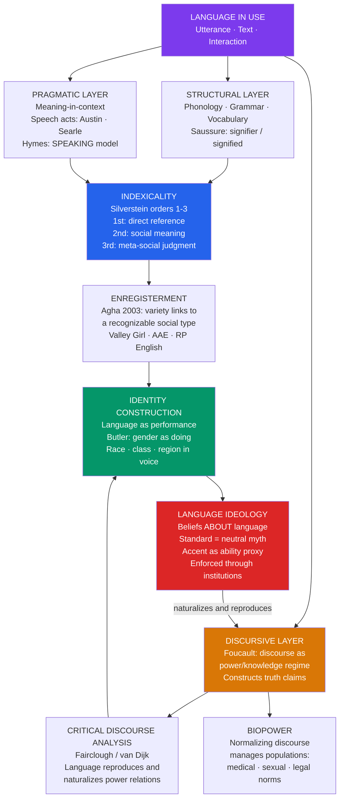

# Discourse, Power, and Identity

> [!abstract] TL;DR
> Language does not merely describe the social world — it constructs and polices it: every utterance indexes the speaker's position in a web of race, class, gender, and power, while Foucauldian discourse analysis and Critical Discourse Analysis reveal that the categories we take for granted as natural (the normal, the intelligent, the criminal, the citizen) are effects of historically specific power/knowledge regimes reproduced through language.

---

## Intuition

**Analogy:** Imagine two job applicants for a corporate position who submit identical resumes. One calls in advance to ask about the role; the other does not. Over the phone, the hiring manager hears one caller say "I was hoping to enquire about the position" and the other say "I'm calling to axe you about the job." Both sentences communicate the same request. But before a single qualification has been discussed, the manager has already formed judgments about professionalism, education, and cultural fit — judgments that track regional accent and dialect rather than competence. Neither speaker chose their phonology. Both will be evaluated by it.

This is the central claim of linguistic anthropology applied to power: the phonemes, syntactic choices, address forms, and discourse styles speakers use are never merely information-delivery vehicles. They are social acts that position speakers within hierarchies of prestige and stigma, belonging and exclusion, authority and subordination. The study of discourse, power, and identity asks: which ways of speaking get to count as intelligent, professional, or legitimate? Who decides? And what material consequences — hiring, arrest, diagnosis, citizenship — follow from those judgments?

---

## How It Works



The diagram reads as a cycle, not a pipeline: language use creates indexical associations, which become enregistered social types, which produce identity categories, which generate ideologies about language, which reproduce the discursive regime that makes certain associations seem natural in the first place.

---

## Key Concepts

### Secondary Level

#### The SPEAKING Model: Hymes's Ethnography of Communication

Dell Hymes (1972) argued that Noam Chomsky's linguistics was asking the wrong question. Chomsky wanted to explain how a competent speaker knows the grammar of their language — the idealized system underlying grammatical versus ungrammatical sentences. But Hymes pointed out that grammatical competence is only one small dimension of what it takes to function as a social speaker. A child might produce flawlessly grammatical sentences at the wrong time, to the wrong person, in the wrong genre, and be judged incompetent — or rude, or strange — regardless of grammaticality.

Hymes called what speakers actually need **communicative competence**: the sociolinguistic knowledge of when to speak, when to stay silent, what to say, to whom, in what manner, and in what genre. Communicative competence includes knowing that you don't address a judge as "dude," that prayers are not delivered in the same key as sports commentary, and that telling a dirty joke at a funeral violates a speech norm even if every word is grammatically impeccable.

To study communicative events systematically, Hymes proposed the **SPEAKING** mnemonic — an analytical grid for describing any speech situation:

| Letter | Component | What it covers |
|--------|-----------|---------------|
| **S** | Setting / Scene | Physical location and time; the subjective cultural definition of the scene (a "trial" vs a "kangaroo court") |
| **P** | Participants | Speaker, addressee, audience, overhearer; their social identities and relationships |
| **E** | Ends | The conventional goals of the event type and the personal goals of individual participants |
| **A** | Act sequence | The form and order of speech acts in the event: opening, topic management, closing |
| **K** | Key | The tone or manner — solemn, playful, sarcastic, ironic; marked by paralinguistic cues |
| **I** | Instrumentalities | Channel (spoken, written, signed, digital); code (language, dialect, register) |
| **N** | Norms | Both interaction norms (who can speak when) and interpretation norms (how to understand an utterance) |
| **G** | Genre | The recognized speech event type: sermon, lecture, diagnosis, greeting, argument |

A classroom works differently from a courtroom which works differently from a therapy session — not because the grammar of English changes, but because all eight parameters shift. Hymes's framework made it possible to describe these differences rigorously and to study what happens when speakers from different **speech communities** bring incompatible SPEAKING grids into the same interaction.

#### Speech Communities and the Politics of Belonging

A **speech community** is a group of speakers who share not just a language, but norms about how to use it — shared interpretive conventions, shared evaluations of different speech styles, and shared ways of marking membership versus outsider status. Speech communities are not simply language groups; they are communities of practice organized partly through language.

Speech communities police their own boundaries. Knowing the "right" way to talk — the right greeting sequence at a Pentecostal church, the right jargon in a hospital emergency room, the right way to give a toast at an Irish wake — is constitutive of belonging. Getting it wrong signals outsider status regardless of other credentials. This makes language acquisition not merely a cognitive process but a social one: you do not just learn to speak; you learn to belong somewhere.

---

### Undergraduate Level

#### Foucault's Discourse: Power/Knowledge Regimes

Michel Foucault's concept of **discourse** goes far beyond linguists' use of the term to mean "language above the sentence level." For Foucault, a discourse is a historically specific system of statements, concepts, and practices that produces knowledge about a domain — and in producing that knowledge, it simultaneously produces the objects it appears to merely describe.

Before the eighteenth century, there was no such thing as "the homosexual" as a social type. Same-sex acts existed; people who committed them were described in moral and legal terms. But the category "homosexual" — as a person with a particular psychology, etiology, and social identity — was a product of nineteenth-century medical and psychiatric discourse. Once the category existed, it could be studied, treated, incarcerated, or normalized. The discourse did not discover a pre-existing natural type; it called a social type into existence.

This is what Foucault means by **power/knowledge**: power and knowledge are not separate, with one preceding the other. Power circulates through knowledge claims, and knowledge claims are always already embedded in power relations. Medical discourse is not a neutral description of pathology and health; it is a regime that defines what counts as normal, who counts as an expert, and who is subject to intervention. Legal discourse does not neutrally apply pre-existing laws; it constructs the categories of criminal and law-abiding, subject and citizen.

**Genealogy** — Foucault's historical method — traces how discursive categories emerged through contingent historical struggles rather than through progressive discovery of truth. The point is not to substitute a "truer" discourse but to denaturalize the current one: to show that what presents itself as necessary and natural is in fact a historically produced and contestable arrangement.

#### Critical Discourse Analysis

Where Foucault's approach was primarily historical and philosophical, **Critical Discourse Analysis** (CDA) is an empirical tradition that analyzes actual texts and interactions to show how power relations are reproduced, challenged, or transformed through language use.

**Norman Fairclough** (1992, 2003) proposes a three-dimensional framework for analysis:

1. **Text analysis**: formal linguistic features — vocabulary choices, syntactic structures, modality, transitivity. Who is the grammatical subject? Is the agent erased through passive voice ("mistakes were made")? What presuppositions are built into the text?
2. **Discursive practice**: how texts are produced, distributed, and consumed. What intertextual chains connect this text to other texts? Whose voices are quoted and whose are absent?
3. **Social practice**: how discursive practice is embedded in institutional and social structures. What social effects does the text produce? What power relations does it reproduce?

**Teun van Dijk** (1991, 1998) has focused particularly on the analysis of racism in discourse — showing through systematic analysis of newspaper articles, parliamentary speeches, and textbooks how racial out-groups are consistently represented as threats, problems, or objects of concern, while the racial in-group (typically white European/American) is naturalized as the unmarked norm. Van Dijk's concept of **ideological square** captures a recurrent discursive strategy: positive self-presentation (emphasize in-group virtues, minimize in-group faults) paired with negative other-presentation (emphasize out-group faults, minimize out-group virtues).

#### Indexicality and Silverstein's Orders

**Indexicality** is the semiotic relation in which a sign points to — indexes — something in its context of use. Smoke indexes fire; a pointing finger indexes a direction; the word "here" indexes the location of the speaker. In linguistic anthropology, indexicality is the mechanism through which language simultaneously carries propositional content and social meaning.

Michael Silverstein (2003) developed the concept of **orders of indexicality** to describe the sociolinguistic process by which linguistic features acquire and accumulate social meanings:

- **First-order indexicality**: a bare statistical correlation between a linguistic variable and a social category, operating below the level of conscious awareness. In early twentieth-century New York City, post-vocalic /r/ deletion (saying "cah" instead of "car") correlated with working-class identity, but speakers did not consciously register this association or comment on it.

- **Second-order indexicality**: the correlation becomes consciously recognized by speakers, who begin to use the variable as a stylistic resource. New Yorkers start to notice that certain vowel patterns "sound working class" or "sound educated." The variable now carries explicit social meaning that speakers can deploy and respond to.

- **Third-order indexicality**: the variable is subjected to meta-level ideological reanalysis. At this level, the social meaning gets institutionalized — in education, media, law — and used to make judgments about speakers' intelligence, moral character, or social fitness that go far beyond the original social correlation. At this point, an accent or dialect feature is not just "characteristic of group X" but "evidence that the speaker is [ignorant / educated / dangerous / trustworthy]."

**Enregisterment** is the process through which a variety of language — a set of phonological, lexical, or syntactic features — becomes linked to a recognizable social type or persona in the cultural imagination (Agha 2003). Valley Girl speech (characterized by rising intonation on declaratives, "like" as a discourse particle, certain vowel qualities) became enregistered through media representations as the voice of a particular social type — affluent, white, California-suburban, young, feminine, intellectually shallow. Once enregistered, the features can be performed, mocked, or cited by speakers who have no connection to the original demographic, and hearing them activates the associated social persona.

#### Language and Gender: Three Approaches

The study of how gender relates to language has moved through three successive paradigms, each correcting the previous one:

**1. Dominance approach** (Lakoff 1975, Fishman 1978): Women's language reflects subordinate status. Women use more hedges ("sort of," "I think"), tag questions ("It's cold, isn't it?"), polite forms, and rising intonation on declaratives than men. These features reflect women's social insecurity and their adaptation to a society that punishes assertive female speech. The problem with this approach is that it treats women's speech as deficient — a departure from an implicit male norm — and it flattens enormous variation across women.

**2. Difference approach** (Tannen 1990): Men and women grow up in different speech communities and develop different but equally valid communicative styles. Women use **rapport talk** — language oriented toward building and maintaining relationships, sharing experience, demonstrating empathy. Men use **report talk** — language oriented toward conveying information, establishing status, and accomplishing tasks. Miscommunication across genders is like cross-cultural miscommunication: neither party is at fault; they are simply operating with different discourse norms. Criticism: risks essentializing gender difference; treats culture as deterministic; ignores power asymmetries.

**3. Co-construction and performance approach** (Butler 1990, Cameron 1997, Ochs 1992): Gender is not a property individuals have and then express through language; it is something individuals do, repeatedly and contingently, in interaction. Language does not reflect gender — it constitutes it. This Butlerian insight, applied to linguistics, means that "masculine" and "feminine" ways of speaking are not natural consequences of biological sex; they are performative accomplishments sustained by repetition and policed by social sanctions. Speakers who violate gendered speech norms are not merely odd; they are transgressing the social order that those norms help to produce and maintain.

---

### Graduate Level

#### Raciolinguistics and the Raciolinguistic Gaze

Raciolinguistics, developed particularly by Nelson Flores and Jonathan Rosa (2015), examines the intersection of race and language ideology — how racial categories shape the perception and evaluation of speech, independent of what speakers actually say or how they say it.

The key intervention is the concept of the **raciolinguistic gaze**: the claim that it is not only linguistic behavior that is evaluated but the perceived racial identity of the speaker. Flores and Rosa show that students of color in US schools are consistently perceived as not speaking "proper English" regardless of how closely their actual speech approximates standard academic English. Meanwhile, white students producing similar or equivalent utterances are perceived as linguistically competent. The problem, they argue, is not what minoritized speakers are doing; it is how white listening subjects are racially positioned to perceive their speech.

This has immediate institutional consequences. African American English (AAE) is a fully systematic linguistic variety with its own phonological rules, morphosyntax, and discourse conventions — not "broken English." Yet AAE features are routinely evaluated as evidence of cognitive deficit or educational failure in school settings. The Ann Arbor case (1979) — in which a federal court ruled that the Ann Arbor school district had violated the civil rights of Black students by failing to account for their home dialect in reading instruction — established the legal precedent that language ideology can constitute educational discrimination.

**Language and citizenship** represents another axis of the raciolinguistic gaze. English language testing requirements for immigration and citizenship are typically framed as practical communication competence requirements. Raciolinguistic analysis reveals that such tests are also racial sorting mechanisms: they determine which kinds of English and which accents count as "proficient," in ways that systematically favor speakers whose accents and registers are already indexed as white and educated.

#### Language Ideology

**Language ideology** refers to the body of beliefs and representations that speakers — and institutions — hold about language itself: beliefs about which languages and varieties are beautiful, correct, or prestigious; which speakers are intelligent, educated, or trustworthy; what language is for; and how it relates to thought, culture, and identity.

Language ideologies are never just descriptions of language; they are political interventions in the organization of social life. Key ideologies in contemporary Western societies include:

- **The standard language ideology** (Milroy & Milroy 1985): the belief that there exists a single correct, neutral, non-regional variety of a language against which all other varieties are measured and found deficient. This ideology naturalizes what is in fact the dialect of a particular class fraction (urban, educated, socioeconomically dominant) as if it were simply "the language." It legitimizes the linguistic subordination of regional, ethnic, and working-class varieties.

- **One language / one nation ideology**: the belief that political and linguistic borders should coincide — that citizens of a state should share a national language. This ideology was central to European nationalism in the nineteenth century and continues to drive language politics in multilingual states. It renders linguistic minorities as incomplete citizens and frames multilingualism as a social problem rather than a resource.

- **The monolingual norm in linguistics itself** (Makoni & Pennycook 2007): the field's historical tendency to treat languages as bounded, autonomous, named systems ignores translanguaging, code-switching, and the constructed nature of language boundaries themselves. The very concept of "a language" is partly an ideological artifact.

#### Digital Discourse: Context Collapse, Hashtag Activism, and Meme Logic

The discourse environment of social media differs from face-to-face interaction in ways that create genuinely novel sociolinguistic phenomena.

**Context collapse** (Marwick & boyd 2011) describes the flattening of multiple distinct audiences into a single undifferentiated context. When a person tweets, they address simultaneously their close friends, their employer, their political opponents, their students, their family, and anonymous strangers — audiences with wildly different interpretive frameworks, social norms, and power relationships. The pragmatic challenge of context collapse is that no utterance can be optimized for all audiences simultaneously. Speakers respond with **context collapse strategies**: extreme vagueness, heavy irony, or audience segmentation (using Instagram for family, Twitter for professional, Discord for in-group). The politics of who gets to "screenshot and share" makes context collapse particularly dangerous for members of stigmatized groups, who may lose employment or face harassment when in-group discourse is extracted and circulated to out-groups.

**Hashtag activism** (Clark-Parsons 2019) functions as a discursive formation in the Foucauldian sense: a hashtag like #BlackLivesMatter or #MeToo creates a discursive space that aggregates testimony, establishes a counterpublic, and challenges the dominant discourse's framing of events. The hashtag performs multiple simultaneous functions: it indexes membership in a social movement, it invites collective narration of shared experiences, and it frames a set of incidents as instances of a systemic problem rather than individual cases. The political stakes of naming — the counterframe offered by #AllLivesMatter — are precisely a frame war in Lakoff's sense: competing discourse structures for what counts as the relevant category of analysis.

**Memes as discourse**: Internet memes are multimodal discourse objects that recombine text and image to produce layered, often ironic meaning that depends on knowledge of the meme's citation history. They function according to **intertextuality**: meaning is generated precisely by the gap between the meme template's established connotations and the new caption applied to it. Memes circulate political frames with high virality precisely because they compress complex ideological content into a single image that is enjoyable to share — the politics are delivered with the pleasure of recognition.

#### Political Discourse: Framing, Euphemism, and Propaganda

George Lakoff's work on **cognitive framing** (2004) shows that political language is organized around conceptual frames — mental structures that organize how we categorize experience. The term "tax relief" presupposes that taxes are a burden from which citizens need to be relieved, which in turn presupposes that whoever provides the relief is a benefactor and that whoever imposes the burden is a harm-doer. The frame is not a lie; it is a structured way of seeing that, once activated, makes certain policy conclusions feel natural and others feel counterintuitive. The insight — drawn partly from cognitive linguistics — is that you cannot counter a frame by simply offering the facts; the facts will be processed through the activated frame and absorbed into it. This is Lakoff's main point: "Don't think of an elephant" activates the elephant frame even while negating it.

**Euphemism and dysphemism** are complementary strategies for managing the social impact of taboo or ideologically charged referents. Euphemism substitutes a positive or neutral term for a negatively valenced one: "enhanced interrogation" for torture; "collateral damage" for civilian deaths; "ethnic cleansing" for genocide; "passed away" for died. The substitution does not change the referent — the practice is the same — but it changes the cognitive and affective frame within which the practice is evaluated. Dysphemism works in the opposite direction: using a negatively marked term for something the speaker wants to demonize. The politics of euphemism and dysphemism in public discourse constitute a constant low-level frame war over the description of contested practices.

---

## Python Demo

Simulate language change driven by social network structure — after Lesley and James Milroy's Belfast study (1980), which showed that innovations in phonological variables spread through weak ties between dense social clusters, not through strong ties within them.

```python
import numpy as np
import matplotlib.pyplot as plt

np.random.seed(42)

# ── Parameters (modeled on Belfast working-class speech communities) ──────────
N_CLUSTERS   = 3
CLUSTER_SIZE = 20          # speakers per cluster
N            = N_CLUSTERS * CLUSTER_SIZE
P_STRONG     = 0.55        # within-cluster tie probability (dense network)
P_WEAK       = 0.06        # cross-cluster tie probability (sparse bridges)
W_STRONG     = 0.70        # influence weight: strong tie
W_WEAK       = 0.15        # influence weight: weak tie (Granovetter bridges)
LEARN_RATE   = 0.25        # update speed toward network-weighted mean
STEPS        = 60          # conversational epochs

# ── Build adjacency and tie-strength matrices ──────────────────────────────
adj    = np.zeros((N, N), dtype=bool)
weight = np.zeros((N, N))

for i in range(N):
    for j in range(i + 1, N):
        ci, cj = i // CLUSTER_SIZE, j // CLUSTER_SIZE
        if ci == cj:
            if np.random.rand() < P_STRONG:
                adj[i, j] = adj[j, i] = True
                weight[i, j] = weight[j, i] = W_STRONG
        else:
            if np.random.rand() < P_WEAK:
                adj[i, j] = adj[j, i] = True
                weight[i, j] = weight[j, i] = W_WEAK

# ── Initial usage of innovative variant (-in' instead of -ing) ────────────
usage = np.zeros(N)
# Three innovators in cluster 0 (women who lead language change: Labov 2001)
INNOVATORS = [2, 7, 14]
for idx in INNOVATORS:
    usage[idx] = np.random.uniform(0.65, 0.85)

# ── Simulate: each speaker drifts toward weighted neighbour mean ──────────
history = np.zeros((STEPS + 1, N))
history[0] = usage.copy()

for t in range(STEPS):
    new_usage = usage.copy()
    for s in range(N):
        nbrs = np.where(adj[s])[0]
        if nbrs.size == 0:
            continue
        w = weight[s, nbrs]
        if w.sum() == 0:
            continue
        w_norm = w / w.sum()
        nbr_mean = float(np.dot(w_norm, usage[nbrs]))
        new_usage[s] += LEARN_RATE * (nbr_mean - usage[s])
        new_usage[s] = max(0.0, min(1.0, new_usage[s]))
    usage = new_usage
    history[t + 1] = usage.copy()

# ── Cluster-level adoption curves ─────────────────────────────────────────
cluster_mean = np.zeros((STEPS + 1, N_CLUSTERS))
for c in range(N_CLUSTERS):
    s, e = c * CLUSTER_SIZE, (c + 1) * CLUSTER_SIZE
    cluster_mean[:, c] = history[:, s:e].mean(axis=1)

# Count weak-tie bridges (cross-cluster edges)
bridges = [(i, j) for i in range(N) for j in range(i + 1, N)
           if adj[i, j] and (i // CLUSTER_SIZE) != (j // CLUSTER_SIZE)]

# ── Node positions: three rings of speakers ──────────────────────────────
pos = np.zeros((N, 2))
centers = np.array([[0.0, 1.1], [-1.0, -0.5], [1.0, -0.5]])
theta   = np.linspace(0, 2 * np.pi, CLUSTER_SIZE, endpoint=False)
for c in range(N_CLUSTERS):
    for i, idx in enumerate(range(c * CLUSTER_SIZE, (c + 1) * CLUSTER_SIZE)):
        pos[idx] = centers[c] + 0.35 * np.array([np.cos(theta[i]), np.sin(theta[i])])

# ── Plot ──────────────────────────────────────────────────────────────────
COLORS = ['#2563eb', '#dc2626', '#059669']
LABELS = ['Cluster A (innovators)', 'Cluster B', 'Cluster C']
THRESHOLD = 0.08    # community adoption threshold

fig, axes = plt.subplots(1, 2, figsize=(14, 6))

# Left: adoption curves over time
ax = axes[0]
steps_arr = np.arange(STEPS + 1)
for c in range(N_CLUSTERS):
    ax.plot(steps_arr, cluster_mean[:, c], color=COLORS[c], lw=2.5, label=LABELS[c])
    if c > 0:
        t_adopt = next((t for t in range(STEPS + 1)
                        if cluster_mean[t, c] > THRESHOLD), None)
        if t_adopt is not None:
            ax.axvline(t_adopt, color=COLORS[c], ls=':', lw=1.3, alpha=0.8)
            ax.annotate(f'{LABELS[c]} crosses\nthreshold (t={t_adopt})',
                        xy=(t_adopt, THRESHOLD),
                        xytext=(t_adopt + 3, THRESHOLD + 0.06),
                        arrowprops=dict(arrowstyle='->', color=COLORS[c]),
                        fontsize=8, color=COLORS[c])

ax.axhline(THRESHOLD, color='gray', ls='--', lw=1.0, alpha=0.6,
           label=f'Adoption threshold ({THRESHOLD})')
ax.set_xlabel('Conversational epoch', fontsize=10)
ax.set_ylabel("Mean usage rate of -in' variant", fontsize=10)
ax.set_title("Language Change Diffusion via Social Networks\n"
             "(after Milroy 1980, Belfast)", fontsize=10)
ax.legend(fontsize=9)
ax.set_ylim(-0.02, 0.50)
ax.grid(alpha=0.3)

# Right: network coloured by final usage rate
ax2 = axes[1]
final = history[-1]

for i in range(N):
    for j in range(i + 1, N):
        if adj[i, j]:
            if (i // CLUSTER_SIZE) == (j // CLUSTER_SIZE):
                ax2.plot([pos[i, 0], pos[j, 0]], [pos[i, 1], pos[j, 1]],
                         'k-', alpha=0.08, lw=0.4)
            else:
                # Weak-tie bridges drawn in orange — these carry the innovation
                ax2.plot([pos[i, 0], pos[j, 0]], [pos[i, 1], pos[j, 1]],
                         color='darkorange', alpha=0.65, lw=1.7)

sc = ax2.scatter(pos[:, 0], pos[:, 1], c=final,
                 cmap='YlOrRd', vmin=0, vmax=0.45,
                 s=65, zorder=3, edgecolors='k', linewidths=0.3)
ax2.scatter(pos[INNOVATORS, 0], pos[INNOVATORS, 1],
            s=200, marker='*', c='blue', zorder=5, label='Initial innovators')

plt.colorbar(sc, ax=ax2, label="Final usage rate (-in')", shrink=0.85)
ax2.legend(fontsize=8)
ax2.set_title("Final Variant Distribution\n"
              "(orange = weak-tie bridges; heat = usage rate)", fontsize=10)
ax2.axis('off')

plt.suptitle("Language Change through Social Network Structure\n"
             "Dense clusters resist change; weak ties are conduits for innovation",
             fontsize=11, fontweight='bold')
plt.tight_layout()
plt.savefig('language_change_network.png', dpi=150, bbox_inches='tight')
plt.show()

print(f"Weak-tie bridges in network: {len(bridges)}")
for c in range(N_CLUSTERS):
    t_adopt = next((t for t in range(STEPS + 1)
                    if cluster_mean[t, c] > THRESHOLD), None)
    print(f"  {LABELS[c]}: final mean = {cluster_mean[-1, c]:.3f}, "
          f"threshold at t = {t_adopt}")
```

**What the output shows:**

- **Cluster A** adopts the -in' variant immediately because the innovators are inside it; strong within-cluster ties propagate the innovation quickly through the dense intra-cluster network.
- **Clusters B and C** lag significantly: their uptake begins only when a weak-tie bridge connects them to a speaker already using the variant. Without such a bridge, a cluster never encounters the innovation regardless of its internal network density.
- The **orange edges** (weak ties) are structurally sparse — there are typically only 2–5 of them in the whole network — yet they entirely determine which clusters eventually adopt and when.
- This mirrors Milroy's empirical finding in Belfast: speakers embedded in the most multiplex, dense networks (same neighbors, workmates, and kin) maintained conservative local vowel patterns most strongly. Speakers with cross-community weak ties were the conduits through which phonological innovations passed between working-class neighborhoods.

**The sociolinguistic lesson**: language change is a social diffusion process. Innovations do not spread because they are linguistically superior; they spread because of who is connected to whom. Dense networks conserve; weak ties innovate. This is Granovetter's strength of weak ties theorem expressed phonologically.

---

## Real-World Applications

> **African American English and the Ann Arbor Decision (1979):** The Martin Luther King Junior Elementary School v. Ann Arbor School District Board case established a precedent still cited in language education policy. Black students at a Michigan school were being referred disproportionately to remediation and special education. Linguists testified that the students spoke a rule-governed variety of English — AAE — with its own phonological and morphosyntactic system, including consonant cluster simplification (making "test" sound like "tes'"), habitual "be" (marking ongoing states), and zero copula deletion. The court ruled that the school district's failure to account for home dialect in literacy instruction constituted a denial of equal educational opportunity. The case illustrates the concrete legal and material consequences of language ideology: ideological dismissal of AAE as "bad English" was directly causing educational harm.

> **#MeToo as Discursive Mobilization (2017):** The hashtag movement initiated by Tarana Burke and amplified by Alyssa Milano in October 2017 represents a textbook case of discursive counter-power. Before #MeToo, sexual harassment and assault in professional settings were typically narrated through discourse frames that individualized the problem (a "bad actor"), focused on the credibility of accusers, and treated institutional protection of perpetrators as normal. #MeToo reframed the phenomenon through a different discourse: it aggregated individual testimony into a pattern; it inverted the presumption of credibility (making the institutions' protection of harassers the object of scrutiny rather than the accusers' histories); and it created an enregistered political identity — the #MeToo disclosure — that signaled solidarity across experiences of different severities. The discursive effect preceded and enabled the legal and professional consequences.

> **"Enhanced Interrogation" and the Politics of Euphemism:** The George W. Bush administration's adoption of the phrase "enhanced interrogation techniques" for practices that international law defined as torture represents one of the most studied examples of political euphemism in recent US history. The phrase worked by activating a different cognitive frame: "interrogation" points to a law-enforcement activity with defined legal parameters; "enhanced" suggests improved, augmented, more effective. The word "torture" activates a frame of prohibited, morally condemned, criminal violence. By substituting one frame for another, the administration sought to shift the evaluative terrain within which the debate occurred — a direct application of Lakoff's framing theory at institutional scale.

> **Received Pronunciation and Linguistic Capital in Britain:** Pierre Bourdieu (1991) analyzed language as a form of capital: just as economic capital (money) and social capital (connections) can be exchanged for material advantages, **linguistic capital** — mastery of the legitimate language — can be converted into educational credentials, professional positions, and social prestige. In Britain, Received Pronunciation (the prestige accent associated with elite private education) functions as a marker of class position independent of the speaker's actual competence. Studies consistently show that identical professional qualifications are evaluated more favorably when presented by RP speakers than by regional or working-class accented speakers. The "legitimate language" is not simply the most communicatively effective one; it is the one whose capital value has been established through a history of institutional recognition — schools, courts, broadcasting, government — that validates one variety as the standard.

---

## Common Pitfalls

- **Linguistic determinism** — Assuming that because language shapes thought, it determines it. Sapir-Whorf in its strong form (a language you speak makes it impossible to think certain thoughts) is empirically untenable. The actual claim is more modest and more interesting: language makes certain categorizations habituated, certain frames readily available, certain contrasts salient — while leaving ample room for speakers to resist, innovate, and translate across frameworks. Do not collapse "language influences cognition" into "language determines consciousness."

- **Reducing discourse to text** — CDA is sometimes practiced as if "discourse" meant "written documents" and analysis meant "close reading of lexical choices." Foucault's notion of discourse is about institutional practices, material arrangements, and embodied norms, not just texts. A hospital's spatial layout, the uniform, the chart, and the diagnostic categories are all part of medical discourse, not just the doctor's verbal utterances.

- **The performance misread** — Butler's performativity is often misread as "people can simply choose any gender performance they like." The actual argument is almost the opposite: gender norms are enforced through social sanction on non-compliance, which is precisely what gives the norm its compulsory character. Performativity is not voluntarism; it is a description of how structures reproduce themselves through enforced repetition.

- **Treating standard language as neutral baseline** — Analyzing "non-standard" or "ethnic" varieties as departures from a neutral baseline — as if "standard English" were simply the absence of a dialect. Every variety is a variety. Standard English has phonological, morphological, and discourse features that are just as historically and socially contingent as any other dialect; they are simply the features of a variety that has been institutionally elevated. Failing to see this reproduces the language ideology under analysis.

- **Context collapse in research ethics** — When researchers analyze social media discourse, they often treat public posts as freely available data. But from the perspective of the original speaker, a tweet sent to 47 followers is not the same as a statement published to a global academic audience, even if it is technically accessible to both. Ethical digital discourse analysis requires attending to the subjective publicness of the utterance and the potential harms of extracting in-group discourse into high-visibility contexts.

- **Ignoring intersectionality in language analysis** — Gender differences in language use, racial differences in speech evaluation, and class differences in linguistic capital are not independent dimensions. A Black woman's speech is evaluated neither as "how Black men sound" nor as "how white women sound" but through the intersection of both identity categories simultaneously. Additive models of identity (race plus gender) miss the irreducible specificity of intersectional positions (Crenshaw 1989).

- **Foucault without material constraints** — Discourse analysis can drift into the error of treating discursive change as the primary or sufficient form of political change: if we can change the discourse, we change reality. This misreads Foucault. Discursive formations are sustained by institutional, economic, and political arrangements. Changing the words for poverty does not change the distribution of resources; it changes the terms on which that distribution is contested, which matters — but it is not the same thing.

---

## Related Concepts

- [[_MOC_Language_and_Cognition|↑ Language and Cognition MOC]] — Section map for all 7 notes in this section
- [[Structuralism_and_Symbolic_Anthropology]] — Saussure's sign theory (signifier/signified, paradigm/syntagm) provides the structural foundation upon which indexicality theory builds; Lévi-Strauss's binary oppositions show how language-like structures organize cultural thought beyond language itself
- [[Culture_Symbols_and_Meaning]] — Geertz's thick description and symbolic anthropology are the broader cultural framework within which language ideology operates; culture as a web of meanings is the context in which discourse naturalizes power
- [[Four_Fields_of_Anthropology]] — Linguistic anthropology is one of the four fields; the intersection of language with biological, archaeological, and cultural anthropology is what makes the Boasian tradition's treatment of race and language ideologically powerful
- [[Ethnographic_Methods_and_Fieldwork]] — Hymes's SPEAKING model and the ethnography of communication emerged from the fieldwork tradition; participant observation in speech communities is the primary method for documenting discourse-in-action rather than discourse as abstract text
- [[Identity_Stigma_and_Impression_Management]] — Goffman's dramaturgical self (front stage / back stage, face-work, passing) provides the interactional microanalysis that complements CDA's structural analysis; stigmatized identities are frequently managed through code-switching and language suppression
- [[Political_Sociology_and_Social_Power]] — Foucault's power/knowledge, Bourdieu's symbolic capital and linguistic market, and Gramsci's hegemony are the sociological power theories that discourse analysis operationalizes in specific textual analyses
- [[Social_Networks_and_Social_Ties]] — Granovetter's weak-tie theorem is the network-theoretic foundation of Milroy's sociolinguistic findings; language change diffusion and social network structure are inseparable (the Python demo models this directly)
- [[Race_Ethnicity_and_Racism]] — Raciolinguistics extends racial analysis to language; the raciolinguistic gaze, AAE ideology, and language-as-citizenship-test are specific mechanisms through which racial stratification is reproduced through language institutions
- [[Culture_Norms_Values_and_Ideology]] — Language ideology is a subtype of ideology in the sociological sense; Gramsci's analysis of hegemony as the naturalization of dominant-class norms applies directly to how standard-language ideology secures its authority
- [[Nationalism_Ethnicity_and_Collective_Identity]] — Language standardization was a central technology of European nation-building; "one language, one nation" ideology continues to drive language policy in multilingual states; the politics of language choice in postcolonial contexts is inseparable from ethnic and national identity formation
- [[Media_Propaganda_and_Political_Communication]] — Lakoff's framing theory, van Dijk's CDA of news discourse, and the study of political euphemism all connect directly to how media institutions reproduce or contest hegemonic discourse
- [[Language_and_Thought]] — The Sapir-Whorf hypothesis (linguistic relativity) is the cognitive psychology entry point into the question of how language shapes thought; discourse analysis and cognitive linguistics converge on the claim that habitual language use affects habitual cognition
- [[Language_Development]] — Hymes's concept of communicative competence extends language acquisition research beyond grammar into the social pragmatics of appropriate use; children are not just learning a code but learning how to be a member of a speech community

---

## Review Questions

### Secondary

1. What is the difference between grammatical competence and communicative competence? Give a concrete example of someone who has one but not the other.
2. Choose any two letters of the SPEAKING model and explain what they contribute to the analysis of a specific speech situation — for example, a courtroom testimony or a doctor-patient consultation.
3. What does it mean to say that a language "indexes" social identity? Use a specific example (accent, vocabulary choice, or address form) to illustrate.

### Undergraduate

1. Foucault says that medical discourse does not discover pre-existing diseases but constructs the objects it appears to describe. A critic responds: "That is absurd — tuberculosis existed before any doctor named it." Reconstruct the strongest version of Foucault's argument that can survive this objection, and explain what claim it is and is not making about the material world.
2. Silverstein distinguishes three orders of indexicality. Using African American English as your example, trace the same phonological or grammatical feature through all three orders: describe what happens at each level and what is at stake socially and politically at the third order.
3. Tannen's difference approach and Butler's performance approach both describe gendered language use, but they have radically different political implications. What exactly is the empirical and normative disagreement between them? Which framework better accounts for the fact that gender norms are enforced — that is, that people who violate them face social sanctions?

### Graduate

1. Flores and Rosa argue that the problem in raciolinguistics is not what minoritized speakers are doing but how white listening subjects are positioned to perceive their speech. A more traditional sociolinguist responds that this shifts the burden of analysis in an unprincipled way — surely speakers' actual phonological behavior matters? Reconstruct both arguments at their strongest, then explain what empirical evidence would resolve the disagreement and what evidence cannot.
2. Critical Discourse Analysis has been criticized for circular reasoning: analysts select texts that are ideologically loaded, apply a framework that sensitizes them to ideological content, and then report finding ideological content. Design a CDA research methodology that addresses this circularity concern without abandoning the framework's critical commitments. What would count as a finding that disconfirmed your ideological hypothesis?
3. The Milroy network model predicts that dense, multiplex social networks conserve linguistic features and that weak ties carry innovation. But network structure is itself a product of political economy: which communities are forced into geographic isolation, which social ties are severed by economic migration, and which linguistic markets are advantaged by globalization. Develop a critique of pure network sociolinguistics from a political-economic perspective, drawing on at least two of the following: Bourdieu's linguistic capital, Foucault's biopower, raciolinguistics, or the political sociology of language standardization.

---

## Sources

- Hymes, D. (1972). On communicative competence. In J.B. Pride & J. Holmes (Eds.), *Sociolinguistics: Selected Readings* (pp. 269–293). Penguin.
- Foucault, M. (1972). *The Archaeology of Knowledge*. Pantheon Books.
- Foucault, M. (1978). *The History of Sexuality, Vol. 1: An Introduction*. Pantheon Books.
- Silverstein, M. (2003). Indexical order and the dialectics of sociolinguistic life. *Language & Communication*, 23(3–4), 193–229.
- Agha, A. (2003). The social life of cultural value. *Language & Communication*, 23(3–4), 231–273.
- Fairclough, N. (1992). *Discourse and Social Change*. Polity Press.
- van Dijk, T.A. (1991). *Racism and the Press*. Routledge.
- Milroy, L. (1980). *Language and Social Networks*. Basil Blackwell.
- Milroy, J. & Milroy, L. (1985). *Authority in Language: Investigating Language Prescription and Standardisation*. Routledge.
- Tannen, D. (1990). *You Just Don't Understand: Women and Men in Conversation*. William Morrow.
- Butler, J. (1990). *Gender Trouble: Feminism and the Subversion of Identity*. Routledge.
- Flores, N. & Rosa, J. (2015). Undoing appropriateness: Raciolinguistic ideologies and language diversity in education. *Harvard Educational Review*, 85(2), 149–171.
- Lakoff, G. (2004). *Don't Think of an Elephant: Know Your Values and Frame the Debate*. Chelsea Green Publishing.
- Bourdieu, P. (1991). *Language and Symbolic Power*. Harvard University Press.
- Marwick, A. & boyd, d. (2011). I tweet honestly, I tweet passionately: Twitter users, context collapse, and the imagined audience. *New Media & Society*, 13(1), 114–133.
- Lakoff, R. (1975). *Language and Woman's Place*. Harper & Row.
- Gramsci, A. (1971). *Selections from the Prison Notebooks*. International Publishers.
- Labov, W. (2001). *Principles of Linguistic Change, Vol. 2: Social Factors*. Blackwell.
- Crenshaw, K. (1989). Demarginalizing the intersection of race and sex. *University of Chicago Legal Forum*, 1989(1), 139–167.

---

#Anthropology #LanguageCognition #Discourse #Power #Identity
