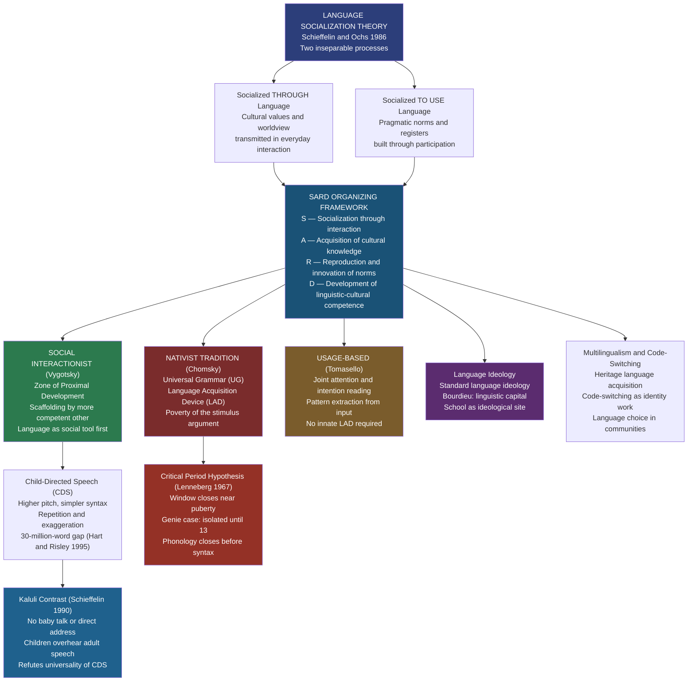

# Language Socialization and Acquisition

> [!abstract] TL;DR
> Language socialization theory (Schieffelin and Ochs 1986) argues that children are simultaneously socialized THROUGH language — absorbing cultural values, social roles, and worldview via everyday talk — and socialized TO USE language — acquiring grammatical and pragmatic competence. These two processes are inseparable: learning to speak IS learning to be a person in a particular culture. Nativists (Chomsky) locate the engine of acquisition in innate Universal Grammar; social interactionists (Vygotsky, Tomasello) locate it in scaffolded joint activity. The Critical Period Hypothesis establishes a biological window, closing near puberty, after which native-like attainment becomes rare. Crucially, the style of caregiver speech assumed by most Western acquisition theories is not universal — the Kaluli of Papua New Guinea raise fluent speakers without ever speaking baby talk to their infants.

---

## Intuition

**Analogy:** Imagine learning to play jazz not from a textbook but by sitting in at a club. No one stops the music to explain the chord changes. You absorb the rhythm by clapping along; you learn call-and-response by answering a riff without knowing its name; you pick up that certain phrases are for flirting with the audience and others signal the band that a solo is ending. After years of sitting in, you can play — and you have also absorbed an entire social world: what counts as showing off versus showing respect, how a good musician carries themselves, what is funny and what is bad taste. You were not taught jazz; you were socialized into jazz.

That is exactly what language socialization theory proposes. A child learning Kaluli in Papua New Guinea is not simply memorizing words and grammar rules. Every exchange with a caregiver is simultaneously a grammar lesson and a lesson in what it means to be Kaluli — who you address, how you express assertion versus appeal, which emotions are named and displayed, what you owe to kin versus strangers. Strip away the cultural apprenticeship and you do not get a faster language learner; you get Genie — the child isolated until the age of thirteen who developed vocabulary but never grammar, because the social machinery that drives acquisition had been absent for too long.

---

## How It Works



The central theoretical claim is that the two arrows at the top of this diagram — acquiring language and being socialized into a culture — were wrongly separated by earlier developmental psychology. Piaget's child constructed cognitive structures in relative isolation from social input; Chomsky's language learner fired up an innate Language Acquisition Device on exposure to any input. Neither framework asked: *what counts as appropriate input* in different cultural settings, and *what social meanings are being transmitted* through the very interactions that produce grammar?

Schieffelin and Ochs showed that these questions are not peripheral but constitutive. The form of a caregiver's utterance — whether they use a diminutive, whether they repeat the child's own words back in an "expansion," whether they direct speech at the infant at all — is not neutral scaffolding. It encodes a theory of childhood, of appropriate affect, of the child's social position, and of what kind of speaker the child is being shaped to become.

---

## Key Concepts

### Secondary Level

**Language socialization: the foundational insight**

Bambi Schieffelin and Elinor Ochs introduced language socialization theory in their 1986 edited volume *Language Socialization Across Cultures*. Their core claim: the two phenomena that earlier researchers had studied separately — cultural socialization (Parsons, Mead) and language acquisition (Chomsky, Piaget) — are not merely related but are constituted through each other.

Every act of language learning is embedded in a social interaction that simultaneously transmits cultural meaning:
- When a caregiver says "What do you say?" after a child receives a gift, the child learns the word "thank you" AND learns that gratitude is obligatory, that social debts must be verbally acknowledged, and that certain social relationships require formulaic marking.
- When a mother repeats her infant's babble, she transmits the pragmatic norm that turns are to be taken in conversation and that the child is a legitimate conversational partner — cultural norms that are NOT universal.

The **SARD framework** organizes the four dimensions along which this joint process operates:

| SARD Component | What is being learned | Example |
|---|---|---|
| **S** — Socialization through interaction | How to be a social participant | Learning when to speak, when silence is respectful |
| **A** — Acquisition of cultural knowledge | Worldview, categories, values | Learning what counts as "polite," "rude," or "funny" |
| **R** — Reproduction and innovation of norms | Maintaining and creatively extending social rules | Repeating greetings in the learned form; improvising new uses |
| **D** — Development of linguistic-cultural competence | Grammar + pragmatics as inseparable | Learning "please" syntactically and as a social instrument simultaneously |

**Kaluli versus Western middle-class: two models of childhood**

Schieffelin's fieldwork among the Kaluli of Papua New Guinea produced the most cited cross-cultural challenge to acquisition universalism. In the Western, white, middle-class model that dominated developmental psychology:
- Caregivers use **child-directed speech (CDS)**: simplified vocabulary, exaggerated intonation, higher pitch, slower rate, frequent repetition.
- Caregivers treat infants as interlocutors from birth: they interpret pre-linguistic vocalizations as meaningful and respond to them as turns.
- One-on-one dyadic conversation is the primary vehicle for language input.
- The child is the *center* of the interactional scene.

Among the Kaluli:
- Infants are held facing outward, toward other people, not toward the caregiver — they are socially positioned as spectators of interaction, not partners in it.
- Caregivers do not use baby talk. They do not speak to infants as if the infant understands.
- Instead, caregivers speak FOR the infant in triadic interactions: the caregiver voices what the infant "would say" to a third party, teaching the child the appropriate linguistic form through demonstration, not direct address. This technique is called *elema* ("say like this").
- The child is explicitly NOT treated as a conversational partner until they are already verbal.

The result: Kaluli children become fluent speakers of a complex tone language. The Western CDS package — widely assumed to be the universal scaffold for acquisition — is not necessary. This does not mean CDS is ineffective, but it fatally undermines theories that treat its particular features as required inputs for the Language Acquisition Device.

**The Critical Period Hypothesis (Lenneberg 1967)**

Eric Lenneberg proposed in *Biological Foundations of Language* that there is a genetically determined window, roughly from birth to puberty (most commonly cited as ending between 12 and 16 years), during which the brain retains the plasticity needed for native-like language acquisition. After this window closes:
- Foreign accent becomes extremely difficult to eliminate.
- Full grammatical competence in an L2 (second language) becomes rare.
- Recovery from aphasia (language loss from brain damage) becomes much less complete.

Evidence for a critical period:

| Evidence type | Key finding |
|---|---|
| **Genie** (discovered 1970 at age 13; isolated since 20 months) | Acquired vocabulary but never syntax; could not master morphological rules |
| **Victor of Aveyron** (feral child, ~18th c.) | Limited speech despite sustained effort by Itard; likely past any critical window |
| **Johnson and Newport (1989)** | Chinese/Korean immigrants to the US: those who arrived before age 7 achieved near-native English grammar; those who arrived after puberty plateaued significantly below native level; monotonic decline across arrival ages |
| **Cochlear implant timing** | Deaf children implanted before age 3.5 achieve significantly better speech outcomes than those implanted after age 7 |
| **Late ASL learners** | Native ASL (birth) shows superior grammatical processing to ASL acquired at age 10, even with decades of fluency |

The modern consensus distinguishes "critical" (absolute biological cutoff) from **"sensitive"** period: the window is a zone of maximal ease and efficiency, not an impermeable wall. Adults can and do reach functional fluency in second languages; they rarely achieve native-like phonological accuracy without exceptional aptitude.

---

### Undergraduate Level

**Nativist theory: Universal Grammar and the Language Acquisition Device**

Noam Chomsky's nativist programme rests on the **poverty of the stimulus argument** (also called the logical problem of language acquisition): the linguistic input children receive is too impoverished, fragmentary, and underspecified to account for the rich, rule-governed competence they achieve. Children:
- Acquire grammatical rules they have never heard directly modeled (e.g., complex question-formation from embedded clauses).
- Make categorical errors (overgeneralization: "goed," "mouses") that reveal rule abstraction, not imitation.
- Achieve competence at roughly the same age across radically different cultures and input conditions.
- Rarely need explicit correction of grammatical errors (parents correct false facts, not bad grammar).

Chomsky's explanation: children are born with an innate **Language Acquisition Device (LAD)** that contains **Universal Grammar (UG)** — an abstract set of structural principles and parametric choices (e.g., whether a language requires an overt subject) that constrain what languages can look like. The child does not learn grammar from scratch; they set the parameters of UG to the values instantiated by the local language based on minimal exposure.

Anthropological critiques of the nativist programme:
- UG predicts universal acquisition timelines and sequences. Cross-cultural research finds significant variation in the *order* of morpheme acquisition depending on input frequency in the language, not just on universal biological scheduling.
- The programme says little about *what is acquired* — the cultural meanings, social registers, pragmatic norms, and ideological presuppositions embedded in language. Grammar is a skeleton; language socialization builds the whole organism.
- The claimed universality of the acquisition timeline has been challenged by studies of small-scale societies with very different interactional ecologies (Kaluli, Samoa, Inuit).

**Social interactionism: Vygotsky's Zone of Proximal Development**

Lev Vygotsky's framework directly contradicts Chomsky on the relationship between thought and language. For Chomsky, language is a distinct biological module independent of general cognition. For Vygotsky, language begins as an external social tool ("egocentric speech" in his terms) and becomes internalized as "inner speech" — thought itself becomes linguistically structured.

The key developmental concept: the **Zone of Proximal Development (ZPD)** is the gap between what a child can do independently and what they can do with the guidance of a more competent other. Scaffolded interaction within the ZPD drives development forward. Applied to language acquisition:
- Caregivers expand, recast, and extend children's utterances — transforming "Daddy go" into "Yes, Daddy is going to work" — providing a model of full grammatical form without direct correction.
- Routines and formats (Bruner's "formats" — games like peekaboo, naming rituals) provide predictable interactional scaffolds within which lexical and syntactic forms are reliably paired with shared referential contexts.
- The caregiver scaffolds not just grammar but pragmatic participation: "Wave bye-bye," "Say thank you," "Tell Grandma what you did today."

The Vygotskian framework naturally accommodates cross-cultural variation: if acquisition is driven by scaffolded participation in local interactional formats, then different cultures with different formats will produce different acquisition trajectories — which is exactly what Schieffelin and Ochs found.

**Tomasello's usage-based theory: joint attention and intention reading**

Michael Tomasello's programme offers the most empirically grounded alternative to Chomsky. His claim: language acquisition requires no innate grammar-specific module. What children need is the general capacity for **shared intentionality** — the ability to follow others' gaze, to infer what another agent intends, and to take up a third-party perspective on a shared scene.

Two foundational capacities (both absent in non-human primates at the human level):
1. **Joint attention**: the child and caregiver attend together to the same object or event, creating a shared referential field. Without joint attention, word learning is impossible at scale.
2. **Intention reading**: the child infers what the speaker intends to communicate, not just what they say. A child who hears "Can you pass the salt?" understands it as a request, not a question about motor ability.

On this foundation, children use statistical pattern extraction — tracking the distributional properties of linguistic input — to build up **constructions** (form-meaning pairings at all levels from morpheme to clause). Tomasello's cross-species comparative evidence is striking: chimpanzees can be trained on individual word-like symbols but show dramatic deficits in joint attention and do not develop productive construction grammar even with intensive exposure.

The anthropological resonance: Tomasello's theory locates language acquisition squarely in the social interactional context, and it makes the quality and structure of that context — not the mere presence of grammatically correct input — decisive. This is consonant with language socialization theory's emphasis on participation structure and scaffolded interaction.

**Cultural variation in child-directed speech: the broader comparative picture**

The Kaluli case is the most cited, but cross-cultural variation in caregiver-child interaction is far more extensive:

| Society | CDS Pattern | Key feature |
|---|---|---|
| Western middle-class (US, UK, Australia) | Extensive CDS, dyadic, child-centered | Infant treated as intentional communicator from birth |
| Kaluli (Papua New Guinea) | No CDS; triadic *elema* instruction | Infant not addressed until verbal; speech modeled via third party |
| Samoan (Ochs 1988) | Minimal CDS; older siblings primary interactors | Low-SES children have less adult talk; older siblings scaffold |
| Inuit (Arctic Canada) | Minimal CDS; extended silence normative | Children expected to observe before participating |
| Basotho (southern Africa) | CDS exists but is speech-act focused | Greetings and social formulas prioritized early |
| Mayan (Yucatan, Mexico) | Low verbal input; high observational learning | "Intent participation" model: learning by watching skilled others |

The "30-million-word gap" (Hart and Risley 1995): by age 3, high-SES American children have been exposed to approximately 30 million more words of adult speech than low-SES children. This input gap predicts vocabulary at age 3, reading achievement at age 9-10, and high school graduation rates. The gap is not about intelligence; it is about the interactional ecology of the home — a language socialization finding, not a purely developmental-psychological one.

**Multilingualism and code-switching as identity work**

Bilingual children do not learn two languages by learning each separately; they grow up in a multilingual interactional ecology where both languages are resources for meaning-making. Key findings:
- **Simultaneous bilingualism** (both languages from birth) does not produce confusion. By age 3-4, children reliably separate their languages according to interlocutor and context.
- Early code-switching (mixing languages within a single utterance) is not confusion or deficiency — it is a pragmatic strategy, often pragmatically sophisticated (used to shift footing, add nuance, or appeal to solidarity).
- **Heritage language attrition**: when a minority-language-speaking family moves to a majority-language environment, children who received early input in the heritage language but then shifted primarily to the dominant language show a characteristic pattern — strong phonological and lexical residue of the heritage language but incomplete morphosyntax, particularly in complex structures acquired late.
- **Code-switching as identity**: in multilingual communities (Puerto Rican communities in New York, studied by Zentella; Chicano communities studied by Peñalosa), code-switching between Spanish and English is not a failure to maintain boundaries but a positive enactment of a bilingual identity that refuses the either/or framing of the dominant language ideology. To switch into Spanish with a friend in a formal English-dominant context is to claim solidarity, mark in-group membership, and resist the assimilationist pressure that treats the dominant language as the only legitimate vehicle of public life.

---

### Graduate Level

**Language ideology: the political economy of acquisition**

Language socialization does not happen in a vacuum. It is embedded in **language ideologies** — systems of beliefs, assumptions, and presuppositions about language that are naturalized as common sense and that distribute linguistic capital unequally.

**Standard language ideology** (Milroy and Milroy 1985): the belief that there exists one correct form of a language — a standard — and that deviations from it reflect laziness, ignorance, or cultural deficiency. This ideology is institutionally enforced through schools, which are the most powerful sites of language re-socialization. When a child arrives at school speaking African American Vernacular English (AAVE) or a regional working-class dialect, they encounter an institution that explicitly devalues their home variety and demands acquisition of a prestige variety. The linguistic demands of schooling are experienced not as the neutral transmission of skills but as a social sorting mechanism.

**Bourdieu's linguistic capital**: Pierre Bourdieu (in *Language and Symbolic Power*, 1991) argued that language is not merely a means of communication but a form of capital — an asset that generates social profit in the right markets. Standard language varieties, academic registers, and the embodied ease of speaking authoritatively (what Bourdieu calls *habitus*) are distributed along class, race, and gender lines. Children socialized into homes where academic discourse is the everyday register arrive at school with more "linguistic capital" than children whose home registers are restricted codes (Bernstein's formulation, though also criticized). Language socialization research investigates how this unequal distribution is reproduced — how schools, families, and peer groups reinforce the ideological link between "good language" and social value.

**Language ideology and endangered languages**: when speakers of a minority or Indigenous language adopt the dominant language as the medium of child socialization — not because they prefer it but because it offers greater access to economic and institutional life — they are participating in a language ideological system that devalues their own. Language shift, language death, and language reclamation movements are therefore sites where language socialization theory and political economy intersect directly. The decision to raise children bilingually or in the heritage language is an act of ideological resistance, a refusal to accept the dominant language's monopoly on legitimate speech.

**Agency, reproduction, and the limits of socialization**

A potential weakness of early language socialization theory is its apparent functionalism: children are socialized into norms; norms are reproduced; culture is perpetuated. Where is the agency of the child? Where does change come from?

Several responses have been developed:
- **Socialization as active construction** (following Vygotsky): children are not passive recipients but active participants who creatively appropriate and repurpose the linguistic tools they acquire. Overgeneralization errors are one marker of this: the child who says "goed" is not failing — they are succeeding at extracting and applying a productive rule that they then must learn to restrict. This is creative rule use, not imitation.
- **Peer socialization** (Harris 1995, Corsaro 1985): much language socialization happens not between child and adult but between child and child. Peer cultures generate new norms, new registers, new slang — children are simultaneously recipients of adult socialization and producers of their own cultural forms. Corsaro's "interpretive reproduction" concept captures this: children interpret and transform the adult culture they receive, producing child cultures that feed back into (and sometimes innovate) the broader cultural stream.
- **Innovation through practice**: Schieffelin and Ochs themselves note that language socialization involves not only *reproduction* of norms but *innovation* — the SARD framework's R component. Every generation slightly recontextualizes the norms it receives; language change is the long-run aggregate of these micro-innovations in socialization practice.

**Neurolinguistic underpinnings of the critical period**

The biological basis of the sensitive period is now substantially understood. Key mechanisms:
- **Neural plasticity and GABA/glutamate balance**: early in development, the ratio of inhibitory to excitatory neurotransmission is different from mature brain states, permitting greater synaptic reorganization. The critical period closes as this ratio shifts.
- **Cortical commitment** (Kuhl et al. 2003): early exposure to a native language commits neural circuits in the auditory cortex to the phoneme categories of that language. Kuhl's "neural commitment" model proposes that once these circuits are committed, they actively interfere with the learning of non-native phoneme contrasts — the very efficiency that makes native language processing fast and automatic creates a penalty for learning new contrasts later.
- **Hemisphere lateralization**: language function becomes progressively more left-lateralized through childhood. Early brain injury can produce significant language recovery because the right hemisphere can take over; late injury does not permit this. The critical period tracks this progressive lateralization.
- **Fetal and neonatal precursors**: by birth, fetuses have already begun perceptual narrowing. Neonates prefer their mother's voice and show recognition of stories read repeatedly in the last months of pregnancy — demonstrating that language socialization begins before birth, in utero, through the prosodic envelope of the ambient language.

**Contemporary directions: digital socialization and heritage language reclamation**

- **Online language socialization** (Lam 2000, Black 2009): adolescents and young adults are socialized into new linguistic identities through participation in online communities — fan fiction sites, gaming communities, social media platforms. These communities generate their own norms, registers, and ideologies. A heritage language speaker who rarely uses their ancestral language in daily life may develop strong fluency in a specific online register (e.g., Korean through K-pop fandom forums) — a form of partial heritage language reclamation via peer-mediated online socialization.
- **Language nest programs** (te kohanga reo in Aotearoa New Zealand; Māori language revitalization): these programs create immersive early-childhood environments in the endangered heritage language, exploiting the critical period to produce new fluent speakers in languages with few remaining elders. They are explicit applications of language socialization theory — the key insight being that language acquisition cannot be separated from cultural socialization, so revitalizing the language requires revitalizing the contexts of use in which it is the natural medium.
- **Critical language socialization research** (Duff and May 2017): the current generation of scholars integrates language socialization theory with critical race theory, postcolonial theory, and queer linguistics to examine how language socialization processes produce not only cultural members but racialized, gendered, and classed subjects. How is a child socialized into performing linguistic "whiteness"? How do transgender youth renegotiate the gendered linguistic norms they were socialized into? These questions push the field beyond its original descriptive comparativism into a critical sociology of language.

---

## Python Demo

```python
import numpy as np
import matplotlib.pyplot as plt

np.random.seed(42)

# ─────────────────────────────────────────────────────────────────────────────
# CRITICAL PERIOD MODEL: Language Acquisition Trajectories
#
# Based on: Lenneberg (1967), Johnson & Newport (1989), Pallier et al. (2003)
#
# Models three learner profiles using sigmoid learning functions where both
# the learning RATE and the asymptotic CEILING depend on age of onset.
#
#   - Early Childhood  (onset = 2)   → near-native attainment
#   - Adult Onset      (onset = 22)  → plateaus well below native threshold
#   - Heritage Learner (onset = 2, interrupted ages 8-18, resumed age 18)
#                                    → partial recovery via latent knowledge
#
# Uses: numpy and matplotlib only
# ─────────────────────────────────────────────────────────────────────────────


def cp_ceiling(onset_age):
    """
    Ultimate attainment as a function of age of onset.
    Logistic decay centred on puberty inflection (~13.5 yrs).
    Calibrated to Johnson & Newport (1989): Chinese/Korean → English learners.
    Returns value in [0.63, 0.97].
    """
    ceiling_early = 0.97   # near-native (simultaneous acquisition)
    ceiling_late  = 0.63   # adult ceiling (functional but accented)
    k             = 0.50   # decay steepness
    inflection    = 13.5   # puberty inflection point
    return ceiling_late + (ceiling_early - ceiling_late) / (
        1.0 + np.exp(k * (onset_age - inflection))
    )


def learning_rate(onset_age):
    """
    Rate parameter for sigmoid trajectory.
    Adults use more explicit learning: steeper early gain, lower ceiling.
    """
    if onset_age < 7:
        return 0.50   # slow implicit acquisition, sustained over years
    elif onset_age < 13:
        return 0.80
    else:
        return 1.30   # adult explicit learning: fast initial slope, low ceiling


def sigmoid_trajectory(ages, onset, ceiling, rate, exposure_midpoint):
    """Linguistic competence as a function of chronological age."""
    exposure = np.maximum(ages - onset, 0.0)
    return np.where(
        ages >= onset,
        ceiling / (1.0 + np.exp(-rate * (exposure - exposure_midpoint))),
        0.0
    )


# ── Chronological age axis ────────────────────────────────────────────────────
ages = np.linspace(0.0, 42.0, 800)

# ── Learner 1: Early Childhood (onset = 2) ───────────────────────────────────
onset_1   = 2
ceiling_1 = cp_ceiling(onset_1)       # 0.97
rate_1    = learning_rate(onset_1)    # 0.50
comp_1    = sigmoid_trajectory(ages, onset_1, ceiling_1, rate_1, exposure_midpoint=5.5)

# ── Learner 2: Adult Onset (onset = 22) ──────────────────────────────────────
onset_2   = 22
ceiling_2 = cp_ceiling(onset_2)       # ~0.63
rate_2    = learning_rate(onset_2)    # 1.30
comp_2    = sigmoid_trajectory(ages, onset_2, ceiling_2, rate_2, exposure_midpoint=2.5)

# ── Learner 3: Heritage Learner ───────────────────────────────────────────────
#   Phase 1 (onset 2 → age 8)  : early childhood acquisition
#   Phase 2 (age 8 → 18)       : attrition — language not used, slow decay
#   Phase 3 (age 18 → 42)      : formal reactivation; ceiling between early
#                                  and adult due to latent grammar (Pallier 2003)

ATTRITION_RATE  = 0.065                # ~6.5 % annual loss during non-use
HERITAGE_CEILING = 0.80               # reactivation ceiling (latent grammar boost)

# Level at age 8 (end of Phase 1)
level_at_age8 = ceiling_1 / (1.0 + np.exp(-rate_1 * ((8 - onset_1) - 5.5)))
# Level at age 18 (after 10 years of attrition)
level_at_age18 = level_at_age8 * np.exp(-ATTRITION_RATE * 10)

comp_3 = np.zeros_like(ages)
for i, age in enumerate(ages):
    if age < onset_1:
        comp_3[i] = 0.0
    elif age < 8.0:
        # Phase 1: early childhood acquisition
        t = age - onset_1
        comp_3[i] = ceiling_1 / (1.0 + np.exp(-rate_1 * (t - 5.5)))
    elif age < 18.0:
        # Phase 2: attrition
        comp_3[i] = level_at_age8 * np.exp(-ATTRITION_RATE * (age - 8.0))
    else:
        # Phase 3: reactivation
        t_resume  = age - 18.0
        recovered = HERITAGE_CEILING / (1.0 + np.exp(-1.10 * (t_resume - 2.0)))
        comp_3[i] = max(level_at_age18, recovered)

# Add light observational noise
rng = np.random.default_rng(42)
for comp in (comp_1, comp_2, comp_3):
    comp += rng.normal(0, 0.004, len(ages))
    np.clip(comp, 0.0, 1.0, out=comp)

# ── Figure ────────────────────────────────────────────────────────────────────
fig, axes = plt.subplots(1, 2, figsize=(14, 5.5))
fig.suptitle(
    "Critical Period Effects in Language Acquisition\n"
    "Sigmoid Trajectory Model with Age-Dependent Ceilings",
    fontsize=12, fontweight="bold"
)

COLORS = {"early": "#27ae60", "adult": "#e74c3c", "heritage": "#8e44ad"}

# ── Panel A: Critical Period Ceiling Curve ────────────────────────────────────
ax = axes[0]
onset_range   = np.linspace(0, 40, 400)
ceiling_curve = cp_ceiling(onset_range)

ax.plot(onset_range, ceiling_curve, color="#2c3e7a", linewidth=2.5, zorder=3,
        label="Ultimate attainment ceiling")
ax.axvspan(0,  7, alpha=0.12, color=COLORS["early"],
           label="Early critical window (phonology)")
ax.axvspan(7, 15, alpha=0.10, color="#f39c12",
           label="Extended sensitive period (syntax/morphology)")
ax.axvline(13.5, color="#e74c3c", linestyle="--", linewidth=1.4, alpha=0.75,
           label="Puberty inflection (~13.5 yrs)")
ax.axhline(1.00, color="gray", linestyle=":", linewidth=1.0, alpha=0.4)
ax.text(0.3, 1.003, "Native speaker baseline", fontsize=7.5, color="gray")

ax.scatter([onset_1], [ceiling_1], s=80, color=COLORS["early"],  zorder=5)
ax.scatter([onset_2], [ceiling_2], s=80, color=COLORS["adult"],  zorder=5)

ax.annotate(f"Early child\nonset {onset_1}  ceiling {ceiling_1:.2f}",
            xy=(onset_1, ceiling_1), xytext=(5.0, 0.87), fontsize=8,
            color=COLORS["early"],
            arrowprops=dict(arrowstyle="->", color=COLORS["early"]))
ax.annotate(f"Adult onset {onset_2}\nceiling {ceiling_2:.2f}",
            xy=(onset_2, ceiling_2), xytext=(26.5, 0.72), fontsize=8,
            color=COLORS["adult"],
            arrowprops=dict(arrowstyle="->", color=COLORS["adult"]))
ax.annotate(f"Heritage learner\nonset {onset_1}; reactivates\nto ceiling {HERITAGE_CEILING:.2f}",
            xy=(onset_1, ceiling_1), xytext=(8.0, 0.77), fontsize=7.5,
            color=COLORS["heritage"],
            arrowprops=dict(arrowstyle="->", color=COLORS["heritage"]))

ax.set_xlabel("Age of Onset (years)", fontsize=10)
ax.set_ylabel("Ultimate Attainment\n(fraction of native-speaker baseline)", fontsize=9)
ax.set_title("Critical Period Ceiling Function\n(calibrated to Johnson & Newport 1989)",
             fontsize=9.5)
ax.set_xlim(0, 40)
ax.set_ylim(0.55, 1.04)
ax.legend(fontsize=7.5, loc="lower left")
ax.grid(alpha=0.2)

# ── Panel B: Learning Trajectories ───────────────────────────────────────────
ax = axes[1]

profiles = [
    (comp_1, COLORS["early"],    "Early Childhood (onset 2)\nnear-native ceiling ~0.97",    "-"),
    (comp_3, COLORS["heritage"], "Heritage Learner (onset 2, interrupted 8-18,\nresumed 18)  ceiling ~0.80",
     (0, (5, 2))),
    (comp_2, COLORS["adult"],    "Adult Onset (onset 22)\nfunctional ceiling ~0.63",          "--"),
]
for comp, col, lbl, ls in profiles:
    ax.fill_between(ages, 0, comp, alpha=0.07, color=col)
    ax.plot(ages, comp, color=col, linewidth=2.4, linestyle=ls, label=lbl)

# Transition markers for heritage learner
for xv, note in [(8, "interrupted\nage 8"), (18, "resumed\nage 18")]:
    ax.axvline(xv, color=COLORS["heritage"], linestyle=":", linewidth=1.1, alpha=0.65)
    ax.text(xv + 0.3, 0.08, f"Heritage:\n{note}", fontsize=7, color=COLORS["heritage"])

# Ceiling reference lines
for yval, col in [(ceiling_1, COLORS["early"]),
                   (HERITAGE_CEILING, COLORS["heritage"]),
                   (ceiling_2, COLORS["adult"])]:
    ax.axhline(yval, color=col, linestyle=":", linewidth=0.9, alpha=0.45)

ax.set_xlabel("Chronological Age (years)", fontsize=10)
ax.set_ylabel("Linguistic Competence\n(fraction of native-speaker baseline)", fontsize=9)
ax.set_title("Acquisition Trajectories by Onset Profile\n"
             "(Critical period sets ceiling; motivation and input set rate)",
             fontsize=9.5)
ax.legend(fontsize=7.5, loc="lower right")
ax.set_xlim(0, 42)
ax.set_ylim(0, 1.05)
ax.grid(alpha=0.2)

plt.tight_layout()
plt.savefig("critical_period_language_acquisition.png", dpi=150, bbox_inches="tight")
plt.show()

# ── Summary table ──────────────────────────────────────────────────────────────
print("\n=== Ultimate Attainment by Age of Onset (Critical Period Model) ===")
print(f"{'Onset Age':>10} | {'Ceiling':>8} | Interpretation")
print("-" * 60)
descriptions = {
    0:  "simultaneous acquisition (native baseline)",
    3:  "early simultaneous (near-native)",
    5:  "early childhood L2 input",
    7:  "end of phonological critical window",
    10: "preadolescent onset",
    13: "puberty inflection point",
    16: "late adolescent onset",
    20: "young adult (gap year abroad)",
    25: "adult L2 classroom learner",
    30: "adult late-exposure learner",
}
for onset_age in [0, 3, 5, 7, 10, 13, 16, 20, 25, 30]:
    print(f"{onset_age:>10} | {cp_ceiling(onset_age):>8.3f} | {descriptions[onset_age]}")
```

**What the simulation shows:**

- **Panel A (ceiling curve)**: Ultimate attainment is near-ceiling (~0.97) for onset ages 0-7, then drops steeply through puberty (inflection at 13.5 years), and levels off at ~0.63 for adult learners. This replicates the monotonic decline Johnson and Newport found across Chinese/Korean immigrants' English attainment.
- **Panel B (trajectories)**: The early childhood learner (green) rises slowly but surely to near-native level. The adult onset learner (red) shoots up rapidly (explicit learning) but plateaus far below native threshold. The heritage learner (purple) rises fast, then attrites during the interruption, then partially recovers — never reaching early childhood ceiling but exceeding the adult ceiling because latent grammar is reactivated. This "heritage advantage" corresponds to Pallier et al.'s (2003) fMRI evidence that early-acquired L1 structures leave lasting neural traces even after decades of non-use.

---

## Real-World Applications

> **Example 1 — Cochlear implant timing and the critical period.** The single most consequential clinical application of critical period research is the timing of cochlear implantation for congenitally deaf children. Multiple studies show that children implanted before 18 months achieve substantially better speech perception outcomes than those implanted at 3-4 years, who in turn outperform those implanted after age 7. The critical period for auditory cortex organization closes progressively: neural circuits not stimulated by auditory input during the sensitive period reorganize to process other sensory modalities and become committed to non-auditory function. The language socialization implication is strong: deaf children exposed to a fully accessible language (ASL) from birth — whether or not they later receive a cochlear implant — show better linguistic and cognitive outcomes than those exposed only to the ambient spoken language they cannot yet hear. The "oral-only" approach that delays sign language exposure in order to prioritize spoken language training is, from a language socialization standpoint, a decision to leave the critical period window partially closed.

> **Example 2 — The 30-million-word gap and early childhood policy.** Hart and Risley (1995) found that by age 3, professional-family children had heard approximately 30 million more words than welfare-family children. This gap was driven not by vocabulary size of parents but by the *density of parent-child conversational interaction*: extended back-and-forth exchanges, responding to the child's interests, expanding the child's utterances. The gap predicted vocabulary at age 3, reading achievement at grade 3, and academic attainment at age 9-10. Language socialization theory clarifies what Hart and Risley measured: not simply word count, but the interactional ecology of scaffolded participation. Early childhood programs (Head Start, Sure Start in the UK) explicitly attempt to train parents in more interaction-dense conversational styles — transferring the interactional tools that produce not just bigger vocabularies but fuller participation in academic discourse.

> **Example 3 — Bilingual education and code-switching in schools.** Standard language ideology in most national school systems treats code-switching — mixing English and Spanish, for example — as a deficiency to be corrected. Language socialization research has systematically shown this to be wrong. Code-switching is not random; it is governed by precise syntactic constraints (the Matrix Language Frame model, Myers-Scotton 1993). It is a pragmatic resource that accomplishes things in a bilingual community that neither language alone can achieve: signaling solidarity, marking identity, achieving precision about culturally specific concepts. "Translanguaging" pedagogy — which explicitly legitimizes the full linguistic repertoire of bilingual students rather than treating each language as a separate compartment — produces better reading outcomes in both languages and reduces the identity cost of schooling for minority-language students.

> **Example 4 — Heritage language programs and the Maori language nest.** The Maori language (te reo Maori) in Aotearoa New Zealand had fewer than a thousand fluent adult speakers under the age of forty by the mid-1970s and was on course for extinction within a generation. The te kohanga reo (language nest) movement, begun in 1982, created immersive early-childhood environments where children from birth to school age spent all day in Maori-speaking contexts with Maori-speaking elders. By exploiting the critical period for phonological and morphological acquisition, the program produced a generation of young speakers with native-like fluency. The program is now theorized as an explicit language socialization intervention — not just language exposure but full cultural socialization through Maori language, including tikanga (customs), whakapapa (genealogy), and relationships with land.

> **Example 5 — Online peer socialization and heritage language reclamation.** Research on second-generation diaspora youth in the United States (Lam 2000; Black 2009) has documented cases where adolescents who were socialized into English as their primary language began re-acquiring heritage language competence through online fan communities, social media, and gaming communities in those languages. A Chinese American teenager who rarely hears Mandarin at home may spend hours daily in Mandarin-medium fan fiction forums, acquiring not only lexicon but specific online registers. This represents a new form of language socialization — peer-mediated, asynchronous, text-based, and driven by desire for community membership rather than familial obligation. The heritage learner's "latent knowledge" advantage (visible in the Python model above) is activated in these contexts.

---

## Common Pitfalls

- **Treating child-directed speech as a universal biological requirement** — The persistence of CDS research in the developmental psychology mainstream risks encoding one culturally specific interactional style as universal. The Kaluli case is not an anomaly; it is a refutation. Any theory of language acquisition that requires CDS as input will fail to explain how Kaluli children become fluent speakers. Schieffelin and Ochs's original point was methodological as much as empirical: the "discovery" that CDS facilitates acquisition was made exclusively in Western, white, middle-class samples. The universalist claim was generalized from a single cultural ecology.

- **Confusing the sensitive period with a hard cutoff** — The critical period is often presented as a door that slams shut at puberty. Lenneberg himself was more nuanced, and the empirical evidence supports a sensitive period with a gradient, not a cliff. Adults *can* acquire languages; they can reach functional fluency; they almost never achieve native-like phonology without exceptional circumstances. The practical implication is that early L2 exposure matters greatly for accent and morphology, but adult motivation, input quality, and interactional opportunity matter greatly for everything else.

- **Interpreting the Genie case as clean evidence** — Genie's case is frequently cited as the definitive evidence for the critical period for grammar. But the case is multiply confounded: Genie suffered severe physical abuse and malnutrition; she had minimal social interaction of any kind, not only linguistic interaction; her post-discovery language instruction was itself inconsistent and eventually abandoned as she was moved between foster homes. The case is powerful evidence for the devastating effects of deprivation but cannot be cleanly attributed to a missed critical period for language specifically.

- **Treating code-switching as a deficiency** — This is perhaps the most consequential error in applied settings. Educators who interpret bilingual students' code-switching as evidence of insufficient mastery in either language will suppress a pragmatic resource and communicate that the students' linguistic repertoire is inadequate. The research consensus is that code-switching is positively correlated with competence in both languages, not negatively. Proficient bilinguals switch more, not less, than struggling learners.

- **Ignoring agency in language socialization accounts** — Early language socialization theory could read as purely deterministic: caregivers transmit norms; children absorb them; culture is reproduced. This underestimates what Corsaro called "interpretive reproduction": children actively transform the norms they receive, produce peer cultures that diverge from adult cultures, and generate linguistic innovations that feed back into the language. The agent/structure problem in social theory applies fully here; a purely top-down socialization model is inadequate.

- **Conflating language acquisition with literacy acquisition** — The critical period and language socialization findings primarily concern spoken language. Literacy is a distinct skill that is not acquired without explicit instruction, does not have a comparable critical period for phonological accuracy, and introduces its own socialization demands — the acquisition of a new register (written standard language), new interactional formats (genre, audience design, revision), and new ideological investments (the prestige of literacy). Conflating the two produces confused policy prescriptions.

---

## Related Concepts

- [[_MOC_Language_and_Cognition|↑ Language and Cognition MOC]] — Section map for all 7 notes in this section
- [[Classical_Anthropological_Theory]] — The Boasian tradition established linguistic anthropology as a core field; Sapir's linguistic relativity is the immediate intellectual predecessor of language socialization theory's emphasis on how language shapes cultural experience
- [[Four_Fields_of_Anthropology]] — Linguistic anthropology is one of the four fields; language socialization theory is the primary meeting point between linguistic and cultural anthropology
- [[Ethnographic_Methods_and_Fieldwork]] — Language socialization research is methodologically grounded in long-term ethnographic fieldwork; Schieffelin's Kaluli research and Ochs's Samoan research are foundational examples of immersive participant observation producing discoveries unavailable to laboratory acquisition studies
- [[Structuralism_and_Symbolic_Anthropology]] — Lévi-Strauss modeled anthropological theory on Saussurean structural linguistics; language socialization theory is the dynamic, processual counterpart — it asks not what structures language encodes but how those structures are transmitted and reproduced through interaction
- [[Language_and_Thought]] — The Sapir-Whorf hypothesis is the psycholinguistic parallel to language socialization theory's claim that language shapes cultural experience; Chomsky's Universal Grammar is the primary nativist rival framework; Tomasello's usage-based theory bridges the two vaults
- [[Language_Development]] — Developmental psychology's lens on the same phenomena: provides the behavioral and neural evidence base (critical period timing, acquisition milestones, CDS effects) that language socialization theory contextualizes culturally
- [[Lifespan_Development]] — Language continues to evolve across the lifespan; adolescent peer socialization reshapes register and identity; adult second-language learning is shaped by critical period legacies; heritage language attrition and reclamation occur in midlife and later
- [[Socialization_and_the_Self]] — Mead and Cooley's symbolic interactionist account of socialization through language parallels Schieffelin and Ochs; Goffman's impression management extends into the management of linguistic performance; Giddens's reflexive modernity addresses how late modern speakers negotiate identity through language choice
- [[Education_and_Social_Reproduction]] — Schools are the most powerful institutional sites of language re-socialization; Bourdieu's linguistic capital is the mechanism through which educational systems convert home language advantages into academic credentials; language ideology analysis exposes how standard language instruction functions as cultural reproduction
- [[Culture_Norms_Values_and_Ideology]] — Language ideology (beliefs about correct language, prestige varieties, purism) is one of the most consequential forms of cultural ideology; language socialization is the primary mechanism through which these ideologies are transmitted and naturalized
- [[Piagets_Cognitive_Development]] — Piaget's stage theory of cognitive development provides the backdrop against which Vygotsky's social interactionist alternative is defined; the debate between Piaget (child constructs knowledge individually) and Vygotsky (child constructs knowledge socially) maps directly onto the nativist-interactionist debate in language acquisition

---

## Review Questions

### Secondary

1. Schieffelin and Ochs argue that being socialized INTO a culture and learning TO USE a language are the same process, not two separate things. Use the example of learning to say "please" and "thank you" to explain what they mean by this. What cultural knowledge is transmitted alongside the words themselves?

2. The Kaluli of Papua New Guinea raise fluent speakers of a complex language without ever using "baby talk" or treating infants as conversational partners. What does this finding do to the claim that child-directed speech is a necessary input for language acquisition?

3. Eric Lenneberg proposed that there is a critical period for language acquisition that closes around puberty. Describe two pieces of evidence for this hypothesis and explain what each one specifically constrains — does it affect pronunciation, grammar, or both?

### Undergraduate

1. Chomsky and Vygotsky agree that children acquire language with striking speed and uniformity. They disagree fundamentally on *why*. Compare their explanations. What evidence would Tomasello cite to argue that both nativist and constructivist accounts need to be revised in light of cross-species comparative data on joint attention?

2. Hart and Risley (1995) documented a "30-million-word gap" in cumulative language exposure between high- and low-SES children by age 3. Language socialization theory and developmental psychology offer somewhat different interpretations of what this gap measures and why it matters. Compare the two interpretations and evaluate what policy response each implies.

3. Code-switching among bilingual speakers is sometimes treated as evidence of incomplete mastery and sometimes as evidence of advanced pragmatic competence. What does the research evidence actually show? Use the concepts of language ideology and linguistic capital (Bourdieu) to explain why the deficit interpretation persists in institutional settings despite the evidence.

### Graduate

1. The SARD framework proposes that language socialization involves not only *reproduction* of cultural norms but also *innovation* — children are agents who transform what they receive, not passive absorbers of adult culture. How does Corsaro's concept of "interpretive reproduction" operationalize this claim? What are the limits of the agency argument — at what point does the emphasis on children's creative transformation risk underestimating the power of structural constraints (class, race, language ideology) that systematically shape which innovations are possible?

2. Bourdieu argues that linguistic capital is unequally distributed along class lines and that schools reproduce this inequality by valuing only the dominant-class linguistic habitus. Language socialization theory provides the mechanism: children from different class positions are socialized into different registers, interactional styles, and orientations toward language itself. Evaluate this argument. What would it predict about language outcomes for children in "translanguaging" pedagogical environments — and what evidence is available to test those predictions?

3. The critical period hypothesis is primarily a biological claim (a genetically determined window of neural plasticity). Language socialization theory is primarily a cultural claim (acquisition is driven by participation in culturally structured interaction). Are these claims in tension, or can they be integrated? Develop an account that explains both why the critical period exists as a biological fact AND why its consequences are so dramatically different across cultural contexts — including cases of heritage language interruption, bilingual acquisition, and online peer socialization.

---

## Sources

- [Schieffelin, B.B. & Ochs, E. (1986). *Language Socialization Across Cultures*. Cambridge University Press](https://www.cambridge.org/core/books/language-socialization-across-cultures/DE62A89A47F99D8B13F0B6F6E80AC2B0)
- [Schieffelin, B.B. (1990). *The Give and Take of Everyday Life: Language Socialization of Kaluli Children*. Cambridge University Press](https://www.goodreads.com/book/show/186849.The_Give_and_Take_of_Everyday_Life)
- [Ochs, E. (1988). *Culture and Language Development: Language Acquisition and Language Socialization in a Samoan Village*. Cambridge University Press](https://www.cambridge.org/core/books/culture-and-language-development/ED10D7AB5B4E89E0A3AC3EB9D8DC9CE4)
- [Lenneberg, E.H. (1967). *Biological Foundations of Language*. Wiley](https://www.goodreads.com/book/show/186812.Biological_Foundations_of_Language)
- [Johnson, J.S. & Newport, E.L. (1989). "Critical period effects in second language learning." *Cognitive Psychology* 21(1), 60–99](https://doi.org/10.1016/0010-0285(89)90003-0)
- [Tomasello, M. (2003). *Constructing a Language: A Usage-Based Theory of Language Acquisition*. Harvard University Press](https://www.hup.harvard.edu/catalog.php?isbn=9780674017641)
- [Tomasello, M. (1999). *The Cultural Origins of Human Cognition*. Harvard University Press](https://www.hup.harvard.edu/catalog.php?isbn=9780674005822)
- [Vygotsky, L.S. (1978). *Mind in Society: The Development of Higher Psychological Processes*. Harvard University Press](https://www.hup.harvard.edu/catalog.php?isbn=9780674576292)
- [Chomsky, N. (1965). *Aspects of the Theory of Syntax*. MIT Press](https://mitpress.mit.edu/books/aspects-theory-syntax)
- [Bourdieu, P. (1991). *Language and Symbolic Power*. Polity Press](https://www.goodreads.com/book/show/186841.Language_and_Symbolic_Power)
- [Hart, B. & Risley, T.R. (1995). *Meaningful Differences in the Everyday Experience of Young American Children*. Brookes Publishing](https://www.goodreads.com/book/show/186843.Meaningful_Differences)
- [Pallier, C. et al. (2003). "Brain imaging of language plasticity in adopted adults." *Cerebral Cortex* 13(2), 155–161](https://doi.org/10.1093/cercor/13.2.155)
- [Kuhl, P.K. et al. (2003). "Foreign-language experience in infancy." *PNAS* 100(15), 9096–9101](https://doi.org/10.1073/pnas.1532872100)
- [Myers-Scotton, C. (1993). *Social Motivations for Codeswitching*. Clarendon Press](https://www.goodreads.com/book/show/186845.Social_Motivations_for_Codeswitching)
- [Corsaro, W.A. (1985). *Friendship and Peer Culture in the Early Years*. Ablex Publishing](https://www.goodreads.com/book/show/186847.Friendship_and_Peer_Culture)
- [Duff, P. & May, S. (Eds.) (2017). *Language Socialization* (Encyclopedia of Language and Education, 3rd ed.). Springer](https://doi.org/10.1007/978-3-319-02255-0)
- [Language Socialization — Linguistic Society of America](https://www.linguisticsociety.org/resource/language-socialization)
- [Critical Period Hypothesis — SIL International](https://www.sil.org/about/discover/linguistics)

---

#Anthropology #LanguageCognition #LanguageSocialization #LanguageAcquisition #Childhood #LinguisticAnthropology
