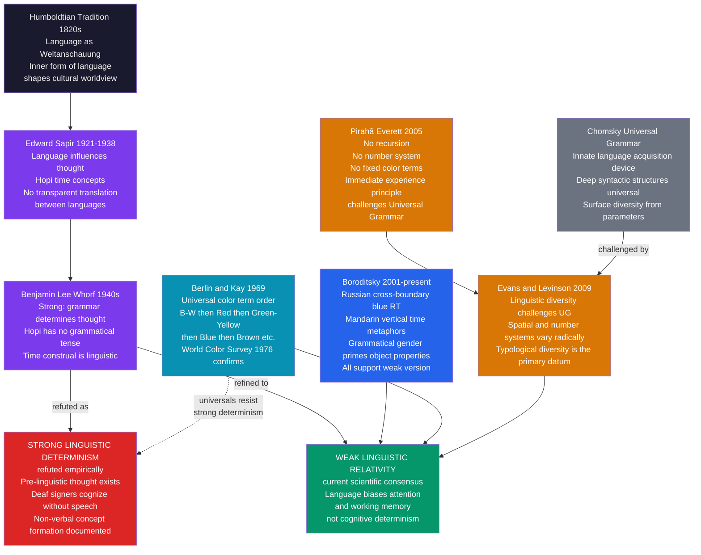

# Language and Culture

> [!abstract] TL;DR
> Linguistic anthropology asks not just *what* language does but *what language is* — a structured system that simultaneously constitutes cultural categories, indexes social identities, and mediates power relations. The Sapir-Whorf hypothesis in its weak form (language biases but does not determine thought) is now the scientific consensus, supported by Boroditsky's color and spatial cognition experiments, Berlin and Kay's universal color term hierarchy, and Everett's Pirahã documentation. The deepest finding is that Whorfian and anti-Whorfian effects are not contradictions but operate at different cognitive timescales.

---

## Intuition

**Analogy:** Two chefs have identical ingredients but different culinary traditions. The French chef commands twenty distinct words for sauces (béchamel, velouté, espagnole, hollandaise, sauce tomat...); a cook from a tradition that treats "sauce" as a single undifferentiated category has one term for all of them. Both chefs can taste the difference between a béchamel and a hollandaise — their palates are equally sensitive. But the French chef notices the distinction automatically, files it instantly into a named category, can communicate it to an apprentice in one word, and retrieves the technique from memory as a labeled unit. The other cook perceives the difference only if she pays deliberate attention, has no efficient way to hold the contrast in working memory, and must describe it laboriously.

Language, in this analogy, does not add new flavors to reality. But it pre-categorizes which differences you habitually track, which contrasts require cognitive effort to maintain, and which distinctions can be transmitted efficiently across speakers and generations. The question Sapir, Whorf, and Boroditsky have been asking for a century is: does the French chef's culinary vocabulary cause her to *perceive* the taste differently in the first place, or merely to *label* a perception that occurs identically in both chefs? The answer — carefully qualified — turns out to be: it depends on the cognitive task, the timescale, and whether verbal memory is engaged.

---

## How It Works



---

## Key Concepts

### Secondary Level

**What is linguistic anthropology?**

Linguistic anthropology is the fourth field of the Boasian four-field synthesis (alongside cultural, biological, and archaeological anthropology). It studies language not as a formal system in the way linguistics does, but as a form of *social action* and *cultural practice*. Three central questions organize the field:

1. **Does language shape thought?** This is the Sapir-Whorf debate: does the language you speak influence how you perceive and categorize the world?
2. **How is language a form of social action?** When you speak, you do not merely convey information — you enact identities, claim statuses, and reproduce or challenge power relations.
3. **How does language vary across cultures?** The world contains approximately 7,000 languages, each carving up reality differently. What does this diversity tell us about the human mind?

**The Sapir-Whorf hypothesis in brief:**

Edward Sapir (1884–1939) and his student Benjamin Lee Whorf (1897–1941) proposed that the language you speak influences the way you think. Whorf's version was strong: different languages construct fundamentally different realities for their speakers. His key example was the Hopi language of the American Southwest. Standard Average European languages (English, French, German) treat time as a spatial dimension you travel through — time has length, you move along it, it flows. Whorf claimed Hopi had no tenses and no spatial metaphors for time; Hopi speakers thus lived in a fundamentally different temporal world.

Whorf's strong version — that language *determines* thought, making it impossible to think what your language lacks the words for — has been refuted. Pre-linguistic infants, deaf individuals who never acquired a sign language, and animals all demonstrate sophisticated cognition that cannot be explained by language. But the *weak* version — that the language you habitually use *influences* what is most readily thinkable, most easily held in working memory, and most efficiently communicated — has received substantial experimental support.

**Color terms: the clearest evidence:**

Brent Berlin and Paul Kay (1969) studied the color vocabularies of 98 languages and made a striking discovery: color term acquisition across the world's languages follows a predictable hierarchical order. A language with only two basic color terms always distinguishes dark/cool from light/warm (roughly black from white). If it has three terms, the third is always red. Green and yellow enter together as the fourth and fifth. Blue comes next, then brown, then the remaining colors (pink, purple, orange, gray) in no fixed order.

This universal order suggests that color categories are not arbitrary cultural inventions — human color perception has neurological anchors (the focal hues) that constrain where languages draw their boundaries. This is the anti-Whorfian finding: there are universal perceptual structures that culture does not freely override.

But the Whorfian finding is also present. Russian speakers, who have *mandatory* distinct basic terms for light blue (*goluboy*) and dark blue (*siniy*) where English has only one (*blue*), discriminate between the two shades significantly faster on reaction-time tasks — but only when the task engages verbal memory. Block the verbal system with a concurrent verbal interference task and the advantage disappears. Language speeds up discrimination at the *boundary* between categories; it does not create new perceptual capacities.

**Language endangerment:**

Of the approximately 7,000 languages spoken today, linguists estimate that roughly half will disappear by 2100 — not because their speakers die, but because children in those communities stop learning the language in favor of economically dominant ones (Mandarin, Spanish, English, Hindi). When a language dies, it takes with it a unique system of ecological knowledge (plants, animals, weather patterns named and categorized in ways not duplicated in any other language), a unique literary and oral tradition, and a unique window onto human cognitive diversity.

The field of language documentation — recording grammars, texts, and lexicons of endangered languages before the last fluent speakers die — is one of linguistic anthropology's most urgent applied missions.

| Language Status | Estimated Languages | Characteristic |
|---|---|---|
| Safe (1 million+ speakers) | ~600 | Actively transmitted across generations |
| Vulnerable | ~1,500 | Mostly spoken by adults; children are partial speakers |
| Endangered | ~2,500 | Few children learning; community language shift underway |
| Critically endangered | ~1,500 | Last generation of speakers; no child acquisition |
| Dormant/sleeping | ~400 | No native speakers; community revitalization possible |
| Extinct | Unknown | No living speakers; may survive in records |

---

### Undergraduate Level

#### The Humboldtian Tradition: Language as Weltanschauung

The idea that language is not merely a tool for expressing pre-formed thoughts but a medium that constitutes how reality appears to its speakers goes back to Wilhelm von Humboldt (1767–1835). Humboldt's key concepts are:

- **Weltanschauung** (world-view): each language encodes a specific way of looking at the world, an implicit ontology embedded in its grammatical categories, lexical distinctions, and metaphorical structures. Learning a second language is not simply acquiring a new code for the same thoughts — it is acquiring access to a different world-view.
- **Inner form** (*innere Sprachform*): the organizing principle internal to each language that determines how it characterizes experience — not the surface grammar, but the deep way in which a language distributes and combines conceptual material. English and German have different inner forms: English tends toward analytic constructions and nominal compounds; German embeds spatial, temporal, and modality information into verbal prefixes and complex nominal agglutinations.
- **Energeia vs. ergon**: language is not a static product (*ergon*) but a dynamic activity (*energeia*) — an ongoing creative process through which speakers constitute their world in the act of speaking. This distinction prefigures the difference between *langue* (Saussure's abstract system) and *parole* (actual speech).

Humboldt's tradition was carried forward by Neo-Humboldtians in the 20th century, most importantly by Leo Weisgerber's *Inhaltsbezogene Grammatik* and by the American anthropological linguists of the Boas school, especially Sapir.

#### Sapir: Relativity Without Determinism

Edward Sapir's *Language: An Introduction to the Study of Speech* (1921) remains one of the most elegant introductions to structural linguistics. His relativist position, stated with characteristic nuance, was that language is not simply a tool for expressing pre-formed thoughts:

> "The 'real world' is to a large extent unconsciously built up on the language habits of the group. No two languages are ever sufficiently similar to be considered as representing the same social reality. The worlds in which different societies live are distinct worlds, not merely the same world with different labels attached."

Sapir was not claiming that thought is impossible without language, but that language provides habitual pathways of attention and categorization that shape what its speakers notice, remember, and communicate. His fieldwork on Native American languages — particularly on Hopi, Nootka, and Navaho — revealed grammatical categories with no European equivalents: Hopi verbs encode the *manner* and *duration* of events in ways that do not map onto European tense systems; Navaho verbs encode the physical properties (rigidity, liquidity, long vs. round objects) of the items being moved or handled as part of the verb's obligatory morphology.

These were not merely vocabulary differences. They were structural differences in how the grammar required its speakers to attend to the world. Whether this grammatical requirement induced corresponding differences in perception was the question Sapir left open and Whorf attempted to answer.

#### Whorf: The Strong Claim and Its Problems

Benjamin Lee Whorf was a fire prevention engineer at Hartford Fire Insurance Company who studied linguistics under Sapir as an amateur and produced some of the most provocative and controversial work in linguistic anthropology. His claim was that grammatical structure does not merely reflect a culture's way of thinking about the world — it *constitutes* it.

**The Hopi case:** Whorf claimed that Hopi had no tenses — no grammatical category dividing events into past, present, and future. More radically, he claimed Hopi had no concepts corresponding to the European spatial metaphors for time (time as a line, a flow, a substance you can run out of). Instead, Hopi grammar organized events by their *validity* (directly observed, remembered, or anticipated) and their *manifestation* (completed or not yet manifested). Therefore, Whorf argued, Hopi speakers inhabited a fundamentally different temporal world from English speakers.

**Problems with the Hopi case:** Whorf's claims were based on incomplete analysis of Hopi grammar and have been substantially revised. Ekkehart Malotki's exhaustive grammar of Hopi (1983) documented that Hopi does have temporal distinctions — it distinguishes past from future, uses calendrical reckoning, and has spatial metaphors for time. The Hopi case, as Whorf framed it, was an overstatement. More broadly, critics showed that Whorf was circular: he inferred Hopi cognitive categories from Hopi grammar, then used those inferred categories as evidence that Hopi grammar shapes Hopi cognition. The argument required independent behavioral evidence.

**The neo-Whorfian synthesis:** Beginning in the 1990s, researchers took Whorf's intuitions into the laboratory and tested them with behavioral measures. The result was neither a vindication of strong determinism nor a refutation of relativity — it was a precise empirical specification of when and how language affects cognition:

1. **Online vs. offline effects**: language influences cognition most strongly when the task requires maintaining a distinction in verbal working memory (online: during the task). The influence attenuates or disappears when the verbal system is disrupted by concurrent verbal shadowing.
2. **Category boundary effects**: language speeds up discrimination at category boundaries and slows it within categories — the classic categorical perception effect. But the underlying perceptual continuum remains accessible.
3. **Habitual thought**: the effects are largest on tasks that probe *habitual* rather than deliberate thinking — the default mode of attention and memory before deliberate reasoning kicks in.

#### Boroditsky: Controlled Experiments on Linguistic Relativity

Lera Boroditsky and colleagues at Stanford have produced the most methodologically rigorous neo-Whorfian experiments. Three domains have yielded consistent results:

**Color perception:** Russian mandatorily distinguishes light blue (*goluboy*) from dark blue (*siniy*) as separate basic color terms; English treats both as *blue*. Winawer et al. (2007) showed that Russian speakers are significantly faster than English speakers at discriminating color pairs that straddle the *goluboy/siniy* boundary — but only when the task engages verbal working memory. When a concurrent verbal task (repeating a nonsense word) was added, the Russian advantage at the boundary disappeared entirely. When a concurrent spatial interference task was added instead, the Russian advantage remained. This showed that the language effect is specifically verbal, not perceptual in a raw sensory sense.

**Spatial cognition and time:** English uses a horizontal spatial metaphor for time (earlier events are *behind*, later events are *ahead*; time *moves forward*). Mandarin additionally uses a vertical metaphor (earlier events are *up*, later events are *down*; older generations are *above*, younger are *below*). Boroditsky showed that priming Mandarin speakers with vertical spatial layouts (a vertical sequence of objects) activated temporal associations that it did not activate in English speakers. This did not demonstrate that English speakers *cannot* use vertical time metaphors — they can — but that the Mandarin speakers used them *habitually*, without prompting.

**Grammatical gender:** Languages with grammatical gender (Spanish, French, German) assign each noun a gender class (masculine, feminine, sometimes neuter). This assignment is often arbitrary by semantic criteria. Boroditsky, Schmidt, and Phillips (2003) found that Spanish and German speakers, when asked to describe objects using adjectives, chose adjectives that matched the grammatical gender of the noun in their language — describing a key (Spanish: *llave*, feminine; German: *Schlüssel*, masculine) as "lovely, golden" (Spanish speakers) vs. "hard, jagged" (German speakers). The grammatical category of the word shaped the semantic associations the speakers drew.

#### Pirahã and the Challenge to Universal Grammar

Daniel Everett's analysis of Pirahã (a language of the Maici River in the Brazilian Amazon, spoken by approximately 400 people) published in *Current Anthropology* in 2005 produced the most controversial challenge to mainstream generative linguistics since Chomsky's program began.

**What Everett claimed:**
- **No recursion**: Pirahã sentences cannot be embedded within other sentences. "The man who lives across the river arrived" requires embedding (a relative clause inside a main clause). Pirahã reportedly has no equivalent — it requires separate sentences for each proposition. Chomsky had claimed recursion was the one universal, defining feature of human language — the capacity to embed structures within structures. If Pirahã has no recursion, this falsifies the universal.
- **No number system**: Pirahã has no terms for specific quantities beyond approximate magnitudes (few vs. many). Training programs to teach Pirahã adults to count numerals reportedly failed after months of effort.
- **No fixed color terms**: Pirahã describes colors by comparison (*blood-like*, *unripe-leaf-like*) rather than basic terms. The Berlin-Kay hierarchy stops before it starts.
- **No creation myths, no deep genealogical memory, no fiction**: the "immediacy of experience principle" Everett proposes constrains all Pirahã communication to events within the direct experience of speaker or interlocutor.

**Everett's explanation:** These properties are not random but derive from a single cultural value: the *immediacy of experience principle* (IEP). Pirahã culture values direct, first-person evidence above all else; assertions about events not witnessed or directly transmitted are epistemically illegitimate. This cultural constraint has shaped the language's grammar. This is the strongest possible version of cultural influence on language structure — not just on vocabulary or color terms, but on the core grammatical architecture.

**The counter-arguments:** The Chomskyan response, led by Andrew Nevins, Cilene Rodrigues, and others (2009), challenged Everett's analysis of Pirahã data and argued that Pirahã sentences do show evidence of embedding in Everett's own transcripts — that he has misanalyzed the data. The debate remains unresolved partly because Pirahã is so small a community that independent verification is extraordinarily difficult. What the controversy has clarified is the methodological stakes: if even one language lacks recursion, the universalist claim collapses; but establishing that a language *lacks* a feature requires exhaustive evidence that absence is not merely a gap in the data.

#### Berlin and Kay: Color Terms in Detail

Berlin and Kay's *Basic Color Terms: Their Universality and Evolution* (1969) combined fieldwork on 20 languages with archival survey of 78 more to produce a universal hierarchy of color term acquisition:

| Stage | Terms Present | Example languages |
|---|---|---|
| I | black, white (or dark, light) | Dani (Papua New Guinea) |
| II | + red | Many sub-Saharan languages |
| III | + green OR yellow | Some Bantu languages |
| IV | + green AND yellow | Extensive stage |
| V | + blue | Many languages |
| VI | + brown | European + others |
| VII | + pink, purple, orange, gray (any order) | English, Russian, Japanese |

**The World Color Survey (1976–):** Responding to methodological criticisms — the original 20-language sample was biased toward literate, urban informants — Berlin, Kay, and William Merrifield organized a massive survey of 110 unwritten languages, using a standardized 330-chip Munsell color array. The WCS broadly confirmed the hierarchy while revealing more variation in the middle stages than originally claimed. The revision was that Stage III and IV languages show more variability in *which* of green or yellow enters first than the strict hierarchy predicted.

**The anti-Whorfian interpretation:** The Berlin-Kay hierarchy suggests that color categories are not culturally arbitrary. The focal points of basic color categories — the most typical exemplars that speakers converge on — are remarkably consistent across languages, even when the *boundaries* of categories differ. This implies that human color perception has neurological anchors at specific hue-saturation-brightness combinations, and that these anchors constrain where languages are likely to draw their category boundaries.

**The residual Whorfian effect:** Nevertheless, where a language draws its boundaries *does* affect performance. Languages that have a single term covering English *blue* and *green* (like Turkish *mavi* for blue and *yeşil* for green, both separate, but some languages use a single *grue* term) show slower discrimination of blue-green boundary pairs than languages with separate terms. The universal perceptual categories exist; the linguistic categories modulate the speed and automaticity with which the boundary is accessed.

#### Indexicality and Language in Social Practice

Beyond the Sapir-Whorf debate, a second major research tradition in linguistic anthropology studies language as *social action*. The key theoretical resource is C.S. Peirce's semiotics, specifically the concept of the **index**.

A **symbol** (Peirce) is a sign whose relationship to its object is arbitrary and conventional — the word *dog* has no inherent resemblance to or causal connection with dogs; it means dog by convention. An **icon** resembles its object — a portrait of a dog resembles a dog. An **index** points to or is caused by its object — a weathervane points into the wind; smoke indicates fire; a high temperature on a thermometer is caused by ambient heat. Indices don't represent their objects; they *track* them.

**Linguistic indexicality** refers to the ways in which language use — not just its referential content, but its form, style, accent, vocabulary, and interactional structure — points to and constitutes social positions, identities, and relationships. Key concepts:

- **Register**: a variety of language associated with specific social contexts (legal register, medical register, children's bedtime-story register). Shifting registers signals shifts in the social frame of the interaction — from professional to intimate, from expert to peer.
- **Code-switching**: the practice of alternating between two languages or dialects within a conversation or even a sentence, characteristic of bilingual and bidialectal communities. Code-switching is not confusion or deficiency; it is sophisticated social navigation, indexing group membership, topic shifts, emotional registers, and interactional alignments simultaneously.
- **Enregistrement** (Agha 2003): the historical process through which a particular linguistic variety (an accent, a set of vocabulary items, a prosodic pattern) becomes socially recognized as indexing a particular social type or identity. Received Pronunciation in British English is enregistered as upper-class; African American Vernacular English features are enregistered in complex and contested ways.
- **Language ideology**: the beliefs, often implicit and naturalized, that speakers hold about language — what makes speech correct or elegant, which languages are appropriate for which domains, which varieties index intelligence or ignorance. Language ideologies are never neutral; they are vectors of power, naturalizing hierarchies of class, race, ethnicity, and national identity.

**Presupposition and entailment:** Every speech act carries both what it explicitly asserts and what it presupposes — what must be true for the assertion to make sense. "Have you stopped beating your wife?" presupposes you have been beating your wife. "We need to deal with the immigration *problem*" presupposes immigration is a problem. These presuppositions slip past the defenses of explicit argumentation and reshape what counts as common ground. The study of presupposition shows how ideological work is done linguistically without ever making explicit claims.

---

### Graduate Level

#### The Timescale Problem: Why Whorfian and Anti-Whorfian Effects Coexist

The most important theoretical advance in neo-Whorfian research is the recognition that the debate was framed at the wrong level of analysis. The question is not "does language determine thought?" or "is there universal perceptual structure?" but: **at which cognitive timescales and in which memory systems does linguistic structure leave its trace?**

The evidence now supports a layered model:

1. **Perceptual level (sub-300ms)**: Universal. Color discrimination, spatial orientation, and basic categorical perception operate on a substrate that is pre-linguistic and species-universal. Whorf was wrong at this level — perceptual categories are not freely constructed by language.

2. **Working memory level (300ms–3s)**: Linguistic. When a task requires holding a distinction in verbal working memory — maintaining the contrast between two colors, navigating while verbally self-monitoring, retrieving the right vocabulary — linguistic categories impose their structure. Russian blue discrimination, Mandarin vertical time priming, and grammatical gender effects on object descriptions all operate at this level. Block the verbal system, and the effects disappear.

3. **Habitual thought level (automatic, default)**: Linguistic. The most robust Whorfian effects emerge in tasks where subjects are not deliberating — when they are responding quickly under pressure, when attention is divided, or when the task probes default rather than effortful reasoning. Language has shaped what the cognitive system treats as the *natural* parsing of a domain. This is what Sapir meant by "habitual thought."

4. **Conceptual level (explicit reasoning)**: Universal constraints reassert themselves. With sufficient effort, speakers of any language can make any distinction that the domain makes available to perception. Translation between languages is possible, even if imperfect. The Hopi speaker who cannot quickly name what English calls "past" can nonetheless remember and refer to past events.

This timescale decomposition explains why Boroditsky's verbal interference paradigm is the key methodological tool: it selectively targets the working memory level, revealing exactly the layer at which language leaves its trace.

#### Language Universals vs. Linguistic Diversity: The UG Debate

Noam Chomsky's program of **Universal Grammar** (UG) proposed that all human languages share a common deep structural architecture — an innate language faculty that provides the child with the structural scaffolding onto which any language's surface forms can be mapped. The language acquisition device (LAD) explains the poverty of the stimulus: children acquire grammar far faster and more accurately than the input they receive would allow, because most of grammar is already specified innately. Grammatical diversity across languages results from variation in *parameters* — binary switches (head-initial or head-final; null subject or obligatory subject) that are set by early exposure to the target language.

**The Evans-Levinson challenge:** Nick Evans and Stephen Levinson's 2009 paper "The Myth of Language Universals" in *Behavioral and Brain Sciences* mounted the most systematic empirical challenge to UG claims from typological evidence. Their argument proceeded in three moves:

1. **Candidate universals fail on inspection**: For each proposed syntactic or semantic universal, cross-linguistic investigation reveals exceptions or counter-examples. Subject-verb-object ordering, binary tense systems, nominal-predicate distinction, quantifiers — all have been proposed as universals; all have exceptions in the typological record.

2. **The diversity is more radical than parameterization allows**: The variation in spatial reference systems (egocentric vs. allocentric vs. absolute), number systems (from none to elaborate), evidentiality systems (grammatical encoding of information source), classifier systems, and phonological inventories is not the variation expected from binary parameter settings on a shared deep structure.

3. **The deep structure inference is circular**: UG is posited as an explanatory hypothesis and then "confirmed" by finding structural similarities across languages — but those similarities are partly artifacts of the selection of features to compare and the analytical vocabulary used. When linguists start from the emic categories of individual languages rather than projecting etic categories from familiar languages, the structural diversity becomes far more striking.

The Evans-Levinson argument does not claim that there are *no* universals — they acknowledge functional and typological tendencies. But these tendencies, they argue, arise from:
- Universal features of human cognition (the perceptual and motor systems that language is interface to)
- Universal features of the communicative task (the need to refer, predicate, and connect propositions)
- Cultural transmission pressures (languages that are easier to learn spread; those that are harder become more efficient with dense learning communities)

None of these require a language-specific innate module. The debate between Chomskyan nativism and functionalist/culturalist accounts of language structure remains active and unresolved.

#### Language Ideology, Power, and Endangerment

Language endangerment is not merely a demographic phenomenon (fewer speakers) but a political one. Languages do not die randomly; they die in the aftermath of colonization, forced assimilation, economic marginalization, and deliberate suppression. The historical record of language shift in Indigenous communities across the Americas, Australia, and Siberia follows a consistent pattern:

1. **Colonial contact** brings economic and political dominance by the colonial language group.
2. **Institutional imposition**: the colonial language is used in schools, courts, administration, and churches; the indigenous language is prohibited or actively punished (residential school systems in Canada and the United States specifically forced children to speak English, beating those who used their heritage languages).
3. **Language ideology shift**: speakers come to associate their heritage language with poverty, backwardness, and limited opportunity; the colonial language is associated with modernity, intelligence, and mobility.
4. **Intergenerational transmission breaks**: parents, not wanting their children to face the stigma and economic disadvantage they experienced, stop transmitting the heritage language at home.
5. **Speaker community collapses**: within two to three generations after intergenerational transmission breaks, the community moves from fluent adult speakers to semi-speakers to recollectors to extinction.

**Language revitalization:** The Hawaiian language (*ʻŌlelo Hawaiʻi*) was reduced to approximately 2,000 speakers by the 1980s after nearly a century of suppression in schools. Beginning in 1983, the *Pūnana Leo* (language nest) program established Hawaiian-medium preschools modeled on the Maori *kōhanga reo* program in New Zealand. Today, Hawaiian is taught at all levels through the university, and the number of fluent speakers has grown substantially — a partial but significant revitalization. The Maori language in New Zealand shows a similar trajectory of endangerment, revitalization effort, and partial recovery.

**The Endangered Language Fund and ELDP:** International organizations including the Endangered Language Fund, the Foundation for Endangered Languages, and the SOAS Endangered Languages Documentation Programme fund field documentation projects. The goal is to produce grammars, dictionaries, and extensive recorded corpora of endangered languages — not merely to preserve the language as a scholarly artifact, but to provide communities with the resources to teach and revitalize it on their own terms.

**Documentation ethics:** Modern language documentation has abandoned the older model of the linguist-as-extractor who produces a grammar for a metropolitan university library. Community-based documentation involves speakers as co-researchers and co-authors; materials are produced in formats accessible to the community (not just academic publications); intellectual property rights in the recorded materials are negotiated with the community. This shift reflects the broader decolonization of anthropological fieldwork ethics established by the movement toward collaborative and engaged ethnography.

---

## Python Demo

```python
import numpy as np
import matplotlib
matplotlib.use("Agg")
import matplotlib.pyplot as plt

# ---------------------------------------------------------------
# SIMULATION: Linguistic Relativity in Color Discrimination
#
# Question: does having MORE basic color terms speed up discrimination
#           at color category boundaries?
#
# Two populations differing only in their language's color vocabulary:
#   Population A: 4 basic color terms  (language carves 4 hue zones)
#   Population B: 11 basic color terms (Berlin-Kay Stage VII language)
#
# Reaction time (ms) for discriminating a pair of adjacent colors
# (delta = 5 hue degrees apart):
#   RT = BASE_RT
#        - WHORF_SPEEDUP  if the pair straddles a linguistic boundary
#        - FOCAL_SPEEDUP  if the pair is near a universally salient focal hue
#        + Gaussian noise
#
# Two effects:
#   WHORFIAN (language-specific):   faster RT at category boundaries
#   ANTI-WHORFIAN (universal):      faster RT near focal hues for BOTH populations
#
# The model demonstrates that both effects coexist at different levels
# — language modulates boundary discrimination (verbal WM timescale)
# — focal hue advantage is language-independent (perceptual timescale)
# ---------------------------------------------------------------

rng = np.random.default_rng(2024)

N_HUES = 360
DELTA_HUE = 5         # hue degrees between the two chips in the discrimination pair
BASE_RT = 620         # ms: baseline reaction time
WHORF_SPEEDUP = 85    # ms faster at cross-boundary pairs
FOCAL_SPEEDUP = 45    # ms faster near universal focal hues
NOISE_SD = 14         # ms Gaussian noise

hues = np.arange(N_HUES)

# ── Color category boundaries ─────────────────────────────────────────────────

# Population A: 4 terms, equally spaced across the hue wheel
bounds_A = np.array([0, 90, 180, 270])

# Population B: 11 terms (Berlin-Kay Stage VII)
# Approximate focal hue positions on the 0-360 hue wheel:
# red=0, orange=30, yellow=60, yellow-green=90, green=135,
# blue-green=175, blue=210, purple=260, magenta=300, pink=330, red-pink=350
bounds_B = np.array([0, 30, 60, 90, 135, 175, 210, 260, 300, 330, 350])


def is_cross_boundary(hue_array, delta, boundaries):
    """
    Returns a boolean array: True if [hue, hue+delta] straddles any boundary.
    Uses modular arithmetic: boundary b is straddled if (b - h) % N_HUES < delta.
    """
    cross = np.zeros(len(hue_array), dtype=bool)
    for b in boundaries:
        ang_dist = (int(b) - hue_array) % N_HUES
        cross |= (ang_dist > 0) & (ang_dist < delta)
    return cross


# Universal focal hues — perceptual anchors from Munsell cross-cultural studies
# red=5, orange=30, yellow=65, green=135, blue=207, purple=269, pink=310
focal_hues_universal = np.array([5, 30, 65, 135, 207, 269, 310])


def focal_proximity_boost(hue_array, focal_pts, sigma=20):
    """
    Universal perceptual speedup near focal hues (anti-Whorfian baseline).
    Returns values in [0, 1]; 1 = at a focal hue center.
    """
    boost = np.zeros(len(hue_array), dtype=float)
    for f in focal_pts:
        dist = np.minimum(np.abs(hue_array.astype(float) - f),
                          N_HUES - np.abs(hue_array.astype(float) - f))
        boost += np.exp(-dist**2 / (2.0 * sigma**2))
    return boost / boost.max()


cross_A = is_cross_boundary(hues, DELTA_HUE, bounds_A)
cross_B = is_cross_boundary(hues, DELTA_HUE, bounds_B)
universal_boost = focal_proximity_boost(hues, focal_hues_universal)

# ── Reaction time model ────────────────────────────────────────────────────────

rt_A = (BASE_RT
        - WHORF_SPEEDUP * cross_A.astype(float)
        - FOCAL_SPEEDUP * universal_boost
        + rng.normal(0, NOISE_SD, N_HUES))

rt_B = (BASE_RT
        - WHORF_SPEEDUP * cross_B.astype(float)
        - FOCAL_SPEEDUP * universal_boost
        + rng.normal(0, NOISE_SD, N_HUES))

rt_A = np.clip(rt_A, 400, 700)
rt_B = np.clip(rt_B, 400, 700)

# ── Statistics ────────────────────────────────────────────────────────────────

print("=" * 65)
print("Linguistic Relativity in Color Discrimination — RT Model")
print("=" * 65)
print(f"  Population A: {len(bounds_A)} color terms  |  "
      f"Population B: {len(bounds_B)} color terms")
print()

header = f"{'Condition':<42}  {'Pop A (4)':>10}  {'Pop B (11)':>10}"
print(header)
print("-" * len(header))

pairs = [
    ("Cross-boundary pairs — mean RT (ms)", cross_A, cross_B),
    ("Within-category pairs — mean RT (ms)", ~cross_A, ~cross_B),
]
for label, mask_a, mask_b in pairs:
    val_a = rt_A[mask_a].mean() if mask_a.any() else float("nan")
    val_b = rt_B[mask_b].mean() if mask_b.any() else float("nan")
    print(f"{label:<42}  {val_a:>10.1f}  {val_b:>10.1f}")

print()
adv_A = rt_A[~cross_A].mean() - rt_A[cross_A].mean()
adv_B = rt_B[~cross_B].mean() - rt_B[cross_B].mean()
print("WHORFIAN effect — boundary advantage (within RT minus boundary RT):")
print(f"  Pop A: {adv_A:.1f} ms   Pop B: {adv_B:.1f} ms")
print()
print("ANTI-WHORFIAN effect — within-category RTs converge across populations:")
print(f"  Pop A within: {rt_A[~cross_A].mean():.1f} ms   "
      f"Pop B within: {rt_B[~cross_B].mean():.1f} ms")
print()
print("Key finding:")
print("  BOTH populations show faster RT at boundaries (Whorfian effect).")
print("  BOTH populations show the same focal hue speedup (anti-Whorfian).")
print("  Pop B has MORE boundary locations: more opportunities for speedup.")
print("  Within-category RT converges: universal perceptual baseline holds.")

# ── Plot ──────────────────────────────────────────────────────────────────────

fig, axes = plt.subplots(1, 3, figsize=(16, 5))
fig.suptitle(
    "Linguistic Relativity in Color Discrimination\n"
    "Whorfian (boundary speedup) and Anti-Whorfian (universal focal hues) "
    "Effects Coexist at Different Cognitive Timescales",
    fontsize=10, fontweight="bold"
)

hue_colors = [plt.cm.hsv(h / 360.0) for h in hues]

# Panel 1: Population A RT curve
ax1 = axes[0]
for b in bounds_A:
    ax1.axvline(b, color="#3b82f6", lw=1.8, linestyle="--", alpha=0.85)
ax1.scatter(hues, rt_A, c=hue_colors, s=6, alpha=0.75, zorder=3)
ax1.set_title("Population A — 4 Color Terms\n(4 category boundaries in blue)", fontsize=9)
ax1.set_xlabel("Hue (degrees)", fontsize=8)
ax1.set_ylabel("Reaction Time (ms)", fontsize=8)
ax1.set_xlim(0, 359)
ax1.set_ylim(390, 700)
ax1.grid(alpha=0.2)

# Panel 2: Population B RT curve
ax2 = axes[1]
for b in bounds_B:
    ax2.axvline(b, color="#ef4444", lw=1.8, linestyle="--", alpha=0.85)
ax2.scatter(hues, rt_B, c=hue_colors, s=6, alpha=0.75, zorder=3)
ax2.set_title("Population B — 11 Color Terms\n(11 category boundaries in red)", fontsize=9)
ax2.set_xlabel("Hue (degrees)", fontsize=8)
ax2.set_ylabel("Reaction Time (ms)", fontsize=8)
ax2.set_xlim(0, 359)
ax2.set_ylim(390, 700)
ax2.grid(alpha=0.2)

# Panel 3: Boundary vs within-category mean RT comparison
ax3 = axes[2]
labels_bar = [
    "Pop A\nBoundary", "Pop A\nWithin",
    "Pop B\nBoundary", "Pop B\nWithin",
]
means_bar = [
    rt_A[cross_A].mean(), rt_A[~cross_A].mean(),
    rt_B[cross_B].mean(), rt_B[~cross_B].mean(),
]
sems_bar = [
    rt_A[cross_A].std() / np.sqrt(cross_A.sum()),
    rt_A[~cross_A].std() / np.sqrt((~cross_A).sum()),
    rt_B[cross_B].std() / np.sqrt(cross_B.sum()),
    rt_B[~cross_B].std() / np.sqrt((~cross_B).sum()),
]
bar_colors = ["#3b82f6", "#93c5fd", "#ef4444", "#fca5a5"]
ax3.bar(labels_bar, means_bar, yerr=sems_bar, capsize=5,
        color=bar_colors, edgecolor="black", linewidth=0.7)
ax3.set_title(
    "Mean RT: Boundary vs Within Category\n"
    "Whorfian: faster at boundaries\n"
    "Anti-Whorfian: within-category RT converges",
    fontsize=8.5
)
ax3.set_ylabel("Mean Reaction Time (ms)", fontsize=8)
ax3.set_ylim(440, 645)
ax3.grid(axis="y", alpha=0.2)
ax3.tick_params(axis="x", labelsize=8)

plt.tight_layout()
plt.savefig("language_culture_color_relativity.png", dpi=110, bbox_inches="tight")
plt.show()
```

**What the simulation demonstrates:**

- **Whorfian effect**: both populations show faster reaction times at color category boundaries than within categories. Population B, with 11 color terms, has more boundary locations distributed across the hue wheel, meaning more total positions where the Whorfian speedup applies. This models Boroditsky and Winawer's finding that Russian speakers outperform English speakers specifically at the *goluboy/siniy* boundary.
- **Anti-Whorfian effect**: the universal focal hue speedup (`FOCAL_SPEEDUP`) applies identically to both populations — language does not modify the perceptual salience of Munsell focal colors. This models Berlin and Kay's finding that focal color regions are consistent cross-linguistically even when category boundaries differ.
- **Coexistence at different timescales**: the two effects are not in contradiction. The universal perceptual effect operates at the pre-linguistic perceptual level; the Whorfian boundary effect operates at the verbal working-memory level. Both are real; both are simultaneously present in any discrimination task.

---

## Real-World Applications

> **Russian blue perception and cross-cultural UX design:** Winawer et al.'s (2007) finding that Russian speakers discriminate goluboy/siniy faster than English speakers has direct implications for cross-cultural interface design. A color-coding system that treats both shades as "blue" may be immediately interpretable for English speakers but require categorization effort from Russian speakers (who have learned to ignore the mandatory distinction in a non-linguistic context). Design systems for global products must account for the fact that color category boundaries — and the automaticity with which color distinctions are perceived — vary systematically across language communities.

> **Pirahã and numerical cognition research:** Everett's documentation that Pirahã adults trained for months with numerals could not reliably count past three or four has directly influenced the debate about whether exact number concepts are innate (Chomsky) or culturally acquired (Everett, Levinson, Dehaene). The competing *Approximate Number System* (ANS) — the pre-linguistic sense of quantity shared with many animals — versus the culturally constructed *exact number system* maps directly onto the anti-Whorfian vs. Whorfian distinction in the color domain. This research has influenced the design of mathematics education programs for communities with minimal numeral systems and the neuroscience of numerical cognition.

> **Language revitalization and the Hawaiian model:** The *Pūnana Leo* language nest program for Hawaiian, begun in 1983 after the language was reduced to approximately 2,000 speakers, has become the global model for indigenous language revitalization. Its key insight — that intergenerational transmission can only be restored by creating immersive child-rearing environments in the heritage language, not by supplementary school classes — is now standard in revitalization planning for Maori, Welsh, Basque, and dozens of other endangered languages. The program demonstrates that language shift is reversible given sustained institutional support, community commitment, and appropriate pedagogical design.

> **Legal language ideologies and court interpreting:** Courts in multilingual societies face the language ideology problem directly: official legal proceedings conducted in the dominant language systematically disadvantage defendants and witnesses whose primary language differs. The U.S. *Court Interpreters Act* (1978) mandated federally certified interpreters for federal proceedings, but quality and availability remain uneven. Beyond mere translation, linguistic anthropologists working as expert witnesses have documented how specific features of police interrogation language (presuppositions embedded in questions, register shifts that signal coercion, code-switching pressure) can produce false confessions and miscarriages of justice — a direct application of indexicality research.

> **Grammatical gender and AI language models:** Boroditsky's grammatical gender findings have become directly relevant to large language models trained on natural language text. Models trained on Spanish data reflect the semantic associations of grammatical gender (sun = masculine, associated with warmth and authority; moon = feminine, associated with mystery and beauty, in Spanish cultural tradition). This gender information propagates into downstream NLP applications — machine translation, sentiment analysis, named entity recognition — producing systematic biases. The linguistic anthropology of grammatical gender has become an applied NLP problem.

---

## Common Pitfalls

- **Confusing weak and strong Whorfianism** — Whorf's strong claim (language determines thought; what your language lacks the words for, you cannot think) has been refuted. The weak claim (language influences what is most readily thinkable, most automatically categorized, most efficiently held in working memory) is well-supported. Students and popular science writing routinely attribute the refutation of the strong version to the refutation of linguistic relativity altogether. These are different claims at different levels.

- **Treating Berlin and Kay as anti-Whorfian** — The universal color term hierarchy is frequently cited as evidence against linguistic relativity. It is, in fact, evidence against strong determinism at the perceptual level. But the boundary effects documented in neo-Whorfian color research are entirely compatible with Berlin-Kay universals: the focal hues are universal; the *boundaries* are linguistically variable and influence discrimination speed. Both findings are simultaneously true.

- **Accepting Whorf's Hopi analysis at face value** — Whorf's original claim that Hopi has no tense and no temporal metaphors has been substantially revised by Malotki's exhaustive grammar. Students encounter the "Hopi has no time" claim in every introductory treatment of the Sapir-Whorf hypothesis; almost none acknowledge that it has been empirically contested. The weak version of relativity does not depend on the Hopi case and should be taught without it.

- **Treating language endangerment as natural selection** — Languages do not die because they are "unfit" — linguistically simpler, cognitively inferior, or inadequate for modern life. They die because their speech communities are politically marginalized and economically coerced into adopting dominant languages. Any description of language death as a natural or inevitable process obscures the political violence and structural inequality that drives it.

- **Misreading code-switching as linguistic confusion** — Popular and educational discourse routinely treats code-switching (alternating between two languages or dialects) as evidence that the speaker "does not really know" either language. The opposite is true: code-switching requires high competence in both varieties and is governed by precise social rules about which switches are appropriate in which contexts. It is a sophisticated communicative resource, not a deficit.

- **Assuming translation equivalence** — The frequent claim that "there is no word for X in language Y" overstates the cognitive significance of lexical gaps. Absence of a word does not mean absence of the concept — speakers of any language can describe any distinction that exists in the domain, though they may require more words to do it. The relevant question is not whether the concept is expressible but whether it is *habitually and automatically tracked* by the grammar and vocabulary.

- **Treating the Pirahã controversy as settled in either direction** — Both the claim that Pirahã definitively falsifies Universal Grammar and the counter-claim that Everett simply misanalyzed the data are overstated. The evidence base is one small community, the transcripts are contested, and independent verification is extraordinarily difficult. The Pirahã case is a productive challenge that has sharpened the empirical demands of both sides; it is not a settled refutation.

---

## Related Concepts

- [[_MOC_Language_and_Cognition|↑ Language and Cognition MOC]] — Section map for all 7 notes in this section
- [[Classical_Anthropological_Theory]] — Sapir and Whorf were students of Franz Boas; the Sapir-Whorf hypothesis is an application of Boasian cultural relativism specifically to the question of language and perception; Boas's insistence that each language has its own structure not reducible to another language's categories is the direct intellectual predecessor
- [[Four_Fields_of_Anthropology]] — Linguistic anthropology is one of the four fields; its relationship to cultural anthropology (language as cultural practice), biological anthropology (language evolution, neural substrates), and archaeology (reconstructing proto-languages) is examined in the four-field synthesis
- [[Structuralism_and_Symbolic_Anthropology]] — Lévi-Strauss's entire structuralist programme is modeled on Saussurean linguistics; the Sapir-Whorf hypothesis is the psycholinguistic parallel to the structuralist claim that binary semantic oppositions shape perception; Geertz's "culture as text" draws on the linguistic model of meaning as system
- [[Ethnographic_Methods_and_Fieldwork]] — Language documentation and the ethnography of communication (Dell Hymes) require and refine ethnographic method; the politics of linguistic fieldwork (informed consent, intellectual property in recorded materials, community authorship) mirrors the broader ethics of ethnographic fieldwork
- [[Language_and_Thought]] — The psychological treatment of the Sapir-Whorf hypothesis, language acquisition (Chomsky vs. Tomasello), and the neural substrates of linguistic and non-linguistic cognition; the timescale decomposition of Whorfian effects maps directly onto cognitive psychology's distinction between verbal and spatial working memory systems
- [[Culture_Norms_Values_and_Ideology]] — Language ideology — the beliefs speakers hold about language — is a form of Bourdieu's symbolic capital and Gramsci's hegemony; the naturalization of dominant language varieties as "correct" or "intelligent" is a central mechanism of cultural reproduction; code-switching and register-shifting map onto the sociology of cultural capital
- [[Language_Model_Basics]] — Modern neural language models (transformers, GPT architectures) implicitly instantiate some form of linguistic relativity — training on text in different languages produces models whose internal representations differ systematically; the grammatical gender experiments have direct implications for bias in NLP systems trained on gendered languages

---

## Review Questions

### Secondary

1. The Berlin-Kay color term hierarchy says that if a language has only three basic color terms, the third term is always *red*. What does this finding suggest about the relationship between language and color perception — does it support or challenge the Sapir-Whorf hypothesis, and why?
2. A language community has 800 fluent adult speakers but no children are learning the language anymore. According to the patterns of language endangerment, what will likely happen to this language over the next 50 years, and what would need to change to reverse that trajectory?
3. "Code-switching means you do not speak either language properly." Explain why a linguistic anthropologist would disagree with this claim, using at least one concept from the study of language as social action.

### Undergraduate

1. Boroditsky's verbal interference paradigm showed that blocking the verbal system eliminates the Russian blue discrimination advantage. What does this tell us about the *level* at which language affects color perception? Use the timescale decomposition model to locate this finding precisely and explain why it is compatible with Berlin and Kay's evidence for universal focal hues.
2. Everett's Pirahã analysis claims that the "immediacy of experience principle" — a cultural value — has shaped the grammatical architecture of the language, including the absence of recursion. Reconstruct the argument precisely: what evidence would you need to distinguish this cultural explanation from the alternative that Pirahã simply has not *needed* recursive structures (a functional-typological explanation)? What would constitute a decisive test?
3. Humboldt, Sapir, and Boroditsky each claim that language affects thought, but they locate the effect differently (world-view vs. habitual thought vs. verbal working memory). Trace the progression: in what sense does each later formulation refine and respond to the problems of the earlier one? Which formulation is most empirically tractable and why?

### Graduate

1. The neo-Whorfian research programme (Boroditsky, Winawer, Levinson) has produced replicable experimental effects of language on cognition in specific tasks. Critics (e.g., Pinker, Jackendoff) argue that these are superficial performance effects at the verbal interface, not effects on deep conceptual structure — that the map is being confused with the territory. Evaluate this objection. Does it correctly characterize the theoretical claims of the neo-Whorfian programme, or does it commit a level-confusion error of its own? What would it take for a Whorfian effect to count as evidence of *deep* conceptual influence?
2. Language endangerment is frequently framed as a problem of lost biodiversity — linguistic diversity is analogous to biological diversity, and each language death diminishes the global epistemic commons. Evans (2010) has argued this framing in *Dying Words*. Evaluate this biodiversity analogy: in what ways does it succeed as an argument for language documentation and revitalization? In what ways does it risk naturalizing language shift and obscuring the political economy that drives it? What alternative normative framework would better capture the anthropological stakes?
3. Universal Grammar and linguistic relativity appear to be opposing positions, but the timescale decomposition model suggests they are compatible if located at different levels. Formulate a research programme that takes both seriously: which specific claims of Chomskyan UG (not the general nativist intuition but the specific empirical content) are compatible with the neo-Whorfian evidence? Which claims are genuinely in tension? Use Evans and Levinson's typological evidence and Boroditsky's experimental evidence together to construct a position that is neither "language determines thought" nor "all languages are superficial variations on a universal deep structure."

---

## Sources

- [Sapir, E. (1921). *Language: An Introduction to the Study of Speech*. Harcourt Brace](https://archive.org/details/languageanintrod00sapi)
- [Whorf, B.L. (1956). *Language, Thought, and Reality: Selected Writings*, ed. J.B. Carroll. MIT Press](https://mitpress.mit.edu/9780262730068/)
- [Berlin, B. & Kay, P. (1969). *Basic Color Terms: Their Universality and Evolution*. UC Press](https://www.wonderfulcolors.org/blog/basic-color-terms-their-universality-and-evolution-by-berlin-and-kay/)
- [Boroditsky, L. (2001). "Does Language Shape Thought? Mandarin and English Speakers' Conceptions of Time." *Cognitive Psychology* 43(1), 1–22](https://www.sciencedirect.com/science/article/abs/pii/S0010028501907528)
- [Winawer, J. et al. (2007). "Russian blues reveal effects of language on color discrimination." *PNAS* 104(19), 7780–7785](https://doi.org/10.1073/pnas.0701644104)
- [Everett, D.L. (2005). "Cultural Constraints on Grammar and Cognition in Pirahã." *Current Anthropology* 46(4), 621–646](https://www.journals.uchicago.edu/doi/10.1086/431525)
- [Evans, N. & Levinson, S.C. (2009). "The Myth of Language Universals." *Behavioral and Brain Sciences* 32(5), 429–448](https://doi.org/10.1017/S0140525X0999094X)
- [Chomsky, N. (1965). *Aspects of the Theory of Syntax*. MIT Press](https://mitpress.mit.edu/9780262530071/)
- [Humboldt, W. von (1836/1999). *On Language: On the Diversity of Human Language Construction*, ed. M. Losonsky. Cambridge UP](https://www.cambridge.org/core/books/on-language/5C1F4427BA87B80A20D1E72BCBC6B0CD)
- [Malotki, E. (1983). *Hopi Time: A Linguistic Analysis of the Temporal Concepts in the Hopi Language*. Mouton de Gruyter](https://www.degruyter.com/document/doi/10.1515/9783110826500/html)
- [Agha, A. (2003). "The Social Life of Cultural Value." *Language and Communication* 23(3–4), 231–273](https://doi.org/10.1016/S0271-5309(03)00012-0)
- [Evans, N. (2010). *Dying Words: Endangered Languages and What They Have to Tell Us*. Wiley-Blackwell](https://www.wiley.com/en-us/Dying+Words%3A+Endangered+Languages+and+What+They+Have+to+Tell+Us-p-9781405155748)
- [UNESCO Atlas of the World's Languages in Danger](https://www.unesco.org/en/articles/atlas-worlds-languages-danger)
- [Vaia — Boroditsky: Linguistic Theory and Cognitive Psychology Impact](https://www.vaia.com/en-us/explanations/psychology/social-context-of-behaviour/boroditsky/)
- [Science News — The Pirahã Challenge](https://www.sciencenews.org/article/pirah%C3%A3-challenge)

---

#Anthropology #LanguageCognition #LinguisticAnthropology #LinguisticRelativity #SapirWhorf
