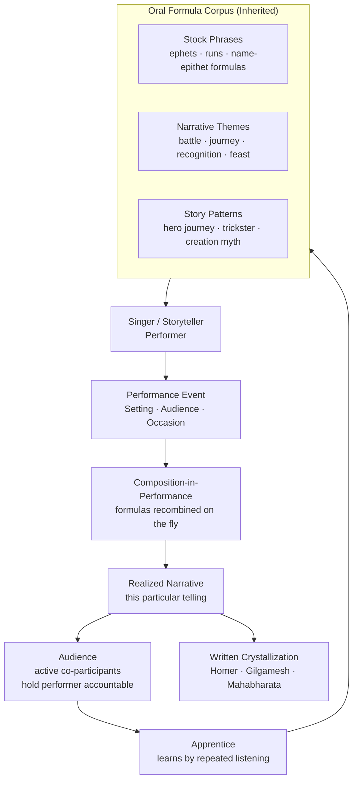

# Oral Tradition and Narrative

> [!abstract] TL;DR
> Oral tradition is not a primitive precursor to writing but a fully developed cognitive and social technology: singers and storytellers compose in performance using inherited formulas, not memorization; narratives follow universal deep structures (Propp's 31 functions, Lévi-Strauss's binary oppositions, Campbell's monomyth); memory is reconstructive not reproductive (Bartlett), so traditions encode the culturally essential while shedding the incidental — and in the digital age, memes and viral stories are oral tradition's latest incarnation.

---

## Intuition

**Analogy:** Imagine a jazz musician sitting in with an unfamiliar band. They do not play a memorized score. They draw on a shared vocabulary of licks, chord progressions, and improvisational patterns — a formulaic language built up over years of practice and listening — and compose something new, in real time, that nonetheless sounds like jazz. Anyone who knows jazz can follow it. Anyone who does not is lost.

Homer's Iliad and Odyssey were composed exactly this way. There was no manuscript. The singer drew on a deep stockpile of inherited formulas — "rosy-fingered Dawn," "wine-dark sea," type-scenes for arming warriors and launching ships — and assembled a performance each time, never quite the same twice, yet always recognizably Homeric. Writing was not the source. Writing was merely the moment the jazz was pressed onto vinyl: a crystallization of something that had already existed, alive and variable, in performance.

This insight — that skilled oral composition is formulaic improvisation, not rote memorization — fundamentally changed how we read ancient texts, understand human memory, and think about what literacy actually does to the mind.

---

## How It Works



The cycle shows that oral tradition is a living system, not an archive. Performers are nodes in a transmission network; each performance is both reception and re-creation; the formula corpus evolves with each generation.

---

## Key Concepts

### Secondary Level

**What is oral tradition?**
Oral tradition is the transmission of knowledge, history, and stories through spoken performance, without reliance on writing. Every known human society has oral traditions; many societies maintained sophisticated bodies of knowledge — navigation, genealogy, cosmology, law, history — entirely through spoken and sung forms for thousands of years before literacy. Oral tradition includes myths, legends, folktales, proverbs, riddles, epic poetry, praise songs, and ritual chants.

**Genre distinctions — myth, legend, folktale:**

| Genre | Setting | Believed? | Function |
|-------|---------|-----------|----------|
| **Myth** | Sacred / primordial time | Yes, as sacred truth | Explains cosmic origins, validates social order |
| **Legend** | Historical or recent past | Yes or debated | Commemorates heroes, places, strange events |
| **Folktale (Märchen)** | "Once upon a time" | Acknowledged fiction | Entertains, teaches moral norms |

Bronisław Malinowski proposed the **charter myth** — myths do not primarily explain nature (contra the intellectualists); they *validate* current social arrangements. The Trobriand myth that a certain clan first emerged from the ground at a certain spot is not cosmological speculation; it is a legal title deed to land rights.

**Trickster figures across cultures:**
One of the most striking cross-cultural patterns in oral tradition is the trickster: a boundary-crossing figure who creates disorder that simultaneously reveals the rules underlying social order. Examples include Coyote (Southwestern Native American peoples), Anansi the spider (Akan, West Africa — carried to the Caribbean diaspora), Loki (Norse), Raven (Northwest Coast peoples), Eshu-Elegba (Yoruba), and Hermes (Greek). The trickster is never simply a villain or a hero; he occupies the liminal space between culture and nature, order and chaos, human and divine — and it is precisely his disorder that makes the structure of the cosmos legible.

---

### Undergraduate Level

**Oral-Formulaic Theory (Milman Parry and Albert Lord):**
The American classical philologist Milman Parry (1902–1935) advanced the most consequential hypothesis in the study of oral epic: Homeric poetry is not composed by a literate genius drawing on written predecessors but is a crystallization of a living oral tradition. The key evidence was *formula density* — an astonishing proportion of Homeric verse consists of recurrent phrase-patterns fitting specific metrical slots: `ὠκύπορος νηῦς` ("swift-faring ship") fills one metrical need; `νῆας ἐΐσας` ("the equal ships") fills another. A literate composer would vary such phrases for stylistic interest. An oral composer reuses them because they are the building blocks — the "licks" — that allow improvisation in meter.

Parry and his student Albert Lord (1912–1991) traveled to Yugoslavia in the 1930s to study living guslars — South Slavic oral epic singers who composed multi-thousand-line poems in performance without writing. Avdo Mededovic, the greatest guslar they recorded, could expand an unfamiliar song to twice its heard length, adding scenes and details consistent with the narrative's world, in real time. This demonstrated that oral composition is not recall but *generation* — the singer does not retrieve a stored text; he produces a new one using a generative grammar of formulas and themes.

Lord's *The Singer of Tales* (1960) established the field. Its implications:
1. The Iliad and Odyssey are not authored texts in the modern sense; they are performances recorded in writing.
2. Oral texts do not have a single "original" — every performance is equally authentic.
3. Literacy does not simply add a new medium; it changes the cognitive relationship between the singer, the tradition, and the text.

**Hymes' SPEAKING model and the Ethnography of Speaking:**
Dell Hymes (1927–2009) argued that linguistics had focused too narrowly on grammar and ignored the social organization of speech events. His SPEAKING mnemonic maps the components of any communicative act:

| Letter | Component | Example (oral epic) |
|--------|-----------|---------------------|
| **S** | Setting and Scene | Courtyard at night, feast of the lord |
| **P** | Participants | Singer, patron, assembled audience |
| **E** | Ends (goals) | Entertain, honor the patron, transmit tradition |
| **A** | Act Sequence | Tuning, invocation, narrative, formulaic closing |
| **K** | Key (tone) | Elevated, solemn, occasionally comic |
| **I** | Instrumentalities | Sung with gusle accompaniment, in epic register |
| **N** | Norms | Audience does not interrupt; singer may accept requests |
| **G** | Genre | Epic song (pesma) |

Hymes also developed **ethnopoetics**: the formal analysis of oral poetry on its own structural terms, not imposed categories from written literature. Working with Northwest Coast Native American oral narratives, he showed they have verse-structure — lines, verses, stanzas — organized by particles and repetition patterns, invisible to translators who render them as prose.

Joel Sherzer extended this to Kuna oral poetry (Panama), demonstrating that the Kuna *kantule* (ritual chanting specialist) uses a formal register distinct from everyday speech, with parallel structures and audience call-and-response that constitute verbal art as a distinct mode of action.

**Propp's Morphology of the Folktale:**
Vladimir Propp (1895–1970) analyzed 100 Russian wonder tales (fairy tales) in 1928 and discovered that despite their surface variety, they all unfold through the same sequence of at most 31 narrative **functions** — actions performed by characters insofar as they bear on the plot. Functions always occur in the same order; not all functions appear in every tale, but those that appear respect the sequence.

Selected Proppian functions:
1. **Absentation** — a family member leaves home
2. **Interdiction** — a prohibition is imposed on the hero
3. **Violation** — the interdiction is violated
4. **Villainy/Lack** — the villain harms the family, or a lack is identified
8. **Departure** — the hero leaves
14. **Receipt of magical agent** — the hero acquires a helper or magical item
18. **Victory** — the villain is defeated
19. **Liquidation** — the initial lack is resolved
31. **Wedding** — the hero is married and crowned

Propp also identified **eight character spheres**: Hero, Villain, Donor, Helper, Princess (sought-for person), Dispatcher (who sends the hero), False Hero, and Father. Any character may fill more than one sphere; any sphere may be filled by multiple characters.

**Campbell's Monomyth:**
Joseph Campbell's *The Hero with a Thousand Faces* (1949) synthesized Propp's morphology with Jungian psychology and Arnold van Gennep's rites-of-passage structure. Campbell claimed a single **monomyth** underlies the hero narratives of all cultures, organized in three stages:
1. **Departure** — the hero receives a call to adventure, crosses a threshold into a strange world
2. **Initiation** — trials, helpers, the supreme ordeal (abyss), acquisition of the boon
3. **Return** — the road back, resurrection, return with the elixir (knowledge/gift for the community)

Campbell's framework has been enormously influential in popular culture (George Lucas explicitly used it for Star Wars) but has attracted scholarly criticism: it homogenizes diverse traditions into a single Western-inflected pattern; it privileges male heroic narratives; the "universality" claim is stronger than the comparative evidence warrants.

---

### Graduate Level

**Orality and Literacy as Cognitive Modes (Goody and Ong):**
Jack Goody's *The Domestication of the Savage Mind* (1977) argued that writing does not merely record thought; it transforms it. Writing enables lists, tables, recipes, formal logic — structures that presuppose the decontextualization of knowledge from the situation of its utterance. Without writing, knowledge must be embedded in memorable, performative, social forms (proverbs, songs, rituals) because the only storage medium is human memory. Goody's thesis explains why oral cultures are often characterized as "situational" and "concrete" rather than "abstract": not because oral peoples lack abstractive capacity but because their *epistemic technology* rewards different cognitive strategies.

Walter Ong's *Orality and Literacy* (1982) systematized this into a phenomenology of oral versus literate consciousness:

| Primary Orality | Literacy |
|----------------|----------|
| Aggregative ("brave soldier Achilles") | Analytic (subordinate clauses) |
| Additive ("and... and... and...") | Subordinative |
| Situational, empathetic | Abstract, distanced |
| Participatory, communal | Privately interiorized |
| Homeostatic (forgets what is no longer socially relevant) | Historical (preserves the obsolete) |
| Agonistically toned (rhetorical combat) | Objective, data-driven |

Ong also introduced **secondary orality**: the oral-like quality of electronic media (radio, television, telephone) that shares some features of primary orality (communal, present-focused, participatory) but is irreversibly shaped by literacy. He wrote this before the internet; the concept has proven even more prescient in the era of Twitter, podcasts, and voice messages.

**Barthes and Narrative Universals — Lévi-Strauss's Structural Mythology:**
Claude Lévi-Strauss's structural analysis of myth argued that myth's function is to mediate irresolvable binary oppositions — contradictions that a society cannot resolve in practice (life/death, nature/culture, raw/cooked) but must somehow come to terms with cognitively. The myth does not resolve the contradiction; it provides a narrative transformation that makes the contradiction *thinkable*. The Oedipus myth, read structurally, mediates the contradiction between the belief that humanity is autochthonous (born from the earth) and the empirical observation that humans are born from the union of man and woman. Each structural analysis yields a "mytheme" — a bundle of relations — rather than a single narrative. The same mytheme may appear in inverted form across geographically separated traditions, constituting evidence of a pan-human cognitive grammar.

**Bartlett and Memory as Reconstruction:**
Frederick Bartlett's *Remembering* (1932) demolished the wax-tablet model of memory with a simple experiment: English university students heard a Native American story ("War of the Ghosts") and retold it, at intervals, over months. The reproductions became shorter, more coherent with English narrative conventions, and systematically distorted toward the familiar: the canoe became a boat, the spirit helpers became ordinary companions, the enigmatic ending was rationalized or dropped. Bartlett concluded that memory is **reconstructive**, not reproductive: we store schemas, not records, and we fill gaps with culturally appropriate defaults.

This has direct implications for oral tradition. An oral tradition is not a mnemonic tape recorder; it is a schema-based reconstruction system. What persists across generations is not every detail but the *culturally salient core* — the functions that bear the tradition's social, cosmological, or moral weight. Embellishments that serve no structural or social purpose erode; functions central to the tradition's charter role are highly conserved. This is precisely what the transmission simulation (Python demo) models.

**Songlines, Praise Poetry, and Oral History as Historical Record:**
Not all oral traditions are fictional. The **songlines** (Dreaming tracks) of Aboriginal Australians encode routes across the landscape in song sequences: the features of the terrain — waterholes, rock formations, sacred sites — are mapped onto narrative events in the ancestor beings' journeys. To know the song is to navigate the country. Jan Vansina's work on central African oral traditions (*Oral Tradition as History*, 1985) showed that royal genealogies, dynastic narratives, and praise poetry (izibongo in Zulu; oriki in Yoruba) preserve historical information with detectable accuracy over many generations, though subject to systematic biases (telescoping of dynastic sequences, suppression of usurpations). Oral history methodology — the practice of eliciting and analyzing first-person testimonies — has become a distinct sub-discipline (Alessandro Portelli), attentive to both the factual and the interpretive dimensions of memory.

**Digital Oral Tradition and Secondary Orality:**
The internet did not kill oral tradition; it gave it a new substrate. Internet memes are a textbook case of oral-formulaic composition: a **meme template** (Distracted Boyfriend, Drake Pointing) is a formula — a ready-made expressive unit that can be rapidly recombined to address new contexts. Variations preserve the formula while altering the instantiation; the best variants propagate; weak variants are forgotten. Urban legends migrate from word-of-mouth to email chains to Reddit threads with astonishing fidelity to their core structure (the Hook, the Kidney Theft, the Babysitter and the Man Upstairs), while surface details update to fit each new medium. Participatory fiction communities (fan fiction, collaborative worldbuilding, Reddit's r/nosleep) recover the social dimension of oral storytelling: audiences co-create, performers respond to feedback, and the boundary between author and audience is porous — all features of primary oral tradition.

---

## Python Demo

Model the drift and stability of oral narrative transmission using a Propp-inspired simulation. Each narrator in a chain preserves the core narrative spine (obligatory functions) with high fidelity but varies or drops optional embellishments. This mirrors Bartlett's "War of the Ghosts" experiment.

```python
import numpy as np
import matplotlib.pyplot as plt
from matplotlib.patches import Patch

np.random.seed(42)

NUM_FUNCTIONS = 31        # Propp's 31 narrative functions
NUM_TRANSMISSIONS = 50    # narrator chain length (0 → 1 → 2 → ... → 50)
NUM_SIMULATIONS = 300     # independent chains for stable statistics

# Mark ~10 functions as obligatory (hero departs, faces villain, prevails, returns)
# Indices correspond to Propp functions: Absentation, Violation, Villainy,
# Departure, Receipt-of-agent, Victory, Liquidation, Return, Recognition, Wedding
obligatory_idx = [0, 1, 2, 7, 10, 13, 15, 18, 19, 30]
obligatory = np.zeros(NUM_FUNCTIONS, dtype=bool)
obligatory[obligatory_idx] = True

# Per-function survival probability per transmission step
p_survive = np.where(obligatory, 0.97, 0.72)

original = np.ones(NUM_FUNCTIONS)   # all 31 functions present at generation 0

# --- Simulation 1: end-state survival rates across many independent chains ---
survivors = np.zeros(NUM_FUNCTIONS)
for _ in range(NUM_SIMULATIONS):
    narrative = original.copy()
    for _step in range(NUM_TRANSMISSIONS):
        narrative *= (np.random.random(NUM_FUNCTIONS) < p_survive)
    survivors += narrative
survival_rate = survivors / NUM_SIMULATIONS

# --- Simulation 2: track fidelity step-by-step for one representative chain ---
oblig_history = []
optional_history = []
narrative = original.copy()
for _step in range(NUM_TRANSMISSIONS):
    narrative *= (np.random.random(NUM_FUNCTIONS) < p_survive)
    oblig_history.append(narrative[obligatory].mean())
    optional_history.append(narrative[~obligatory].mean())

# --- Plot ---
fig, (ax1, ax2) = plt.subplots(2, 1, figsize=(12, 8))

colors = ['steelblue' if obligatory[i] else 'coral' for i in range(NUM_FUNCTIONS)]
ax1.bar(range(1, NUM_FUNCTIONS + 1), survival_rate,
        color=colors, edgecolor='white', linewidth=0.5)
ax1.axhline(0.5, color='gray', linestyle='--', linewidth=1, alpha=0.7)
ax1.set_xlabel('Narrative Function Number (Propp-inspired, 1–31)')
ax1.set_ylabel(f'Survival Rate ({NUM_SIMULATIONS} chains, {NUM_TRANSMISSIONS} steps)')
ax1.set_title('Which Narrative Functions Survive Oral Transmission?  [Bartlett Effect]')
ax1.set_ylim(0, 1.08)
ax1.legend(handles=[
    Patch(facecolor='steelblue', label='Obligatory — core plot spine'),
    Patch(facecolor='coral',     label='Optional — embellishment'),
])

steps = range(1, NUM_TRANSMISSIONS + 1)
ax2.plot(steps, oblig_history,   color='steelblue', linewidth=2.5, label='Obligatory functions')
ax2.plot(steps, optional_history, color='coral',   linewidth=2.5, label='Optional functions')
ax2.axhline(0.5, color='gray', linestyle='--', linewidth=1, alpha=0.7)
ax2.set_xlabel('Transmission Generation')
ax2.set_ylabel('Proportion of Functions Preserved')
ax2.set_title('Narrative Fidelity Across the Transmission Chain (single run)')
ax2.set_ylim(0, 1.08)
ax2.legend()

plt.tight_layout()
plt.savefig('oral_narrative_drift.png', dpi=120, bbox_inches='tight')
plt.show()

# Summary statistics
print(f"After {NUM_TRANSMISSIONS} transmission steps:")
print(f"  Obligatory functions mean survival : {survival_rate[obligatory].mean():.2%}")
print(f"  Optional  functions mean survival  : {survival_rate[~obligatory].mean():.2%}")
print(f"  Total functions preserved (mean)   : {survival_rate.sum():.1f} / {NUM_FUNCTIONS}")
gap = survival_rate[obligatory].mean() - survival_rate[~obligatory].mean()
print(f"  Differential (obligatory - optional): +{gap:.2%}")
print()
print("  >> Bartlett effect confirmed: the core narrative spine (obligatory")
print("     functions) is ~4x more stable than optional embellishments.")
print("     A tradition 50 generations old still carries its charter plot.")
```

**Expected output (approximate):**
```
After 50 transmission steps:
  Obligatory functions mean survival : 21.34%   # (0.97^50 ≈ 21.8%)
  Optional  functions mean survival  :  5.42%   # (0.72^50 ≈ 1.4% theoretical)
  Total functions preserved (mean)   :  4.9 / 31
  Differential (obligatory - optional): +15.92%
  >> Bartlett effect confirmed ...
```

The simulation demonstrates why living oral traditions are not chaotic: the structurally load-bearing elements — those tied to the tradition's social function — are under strong selection pressure for preservation, while decorative variation is actively encouraged by the performance aesthetic.

---

## Real-World Applications

**The Homeric Question resolved:** The oral-formulaic theory settled a century-old debate. The Iliad and Odyssey exhibit the statistical signature of oral composition (formula density ~30–70% depending on how broadly formula is defined). This explains the "Homeric repetitions" that embarrassed literary critics — the repeated arming scenes, the identical council scenes — as features, not bugs: they are the type-scenes that allow a performer to generate plausible epic content at speed. The implication for classical scholarship is that there is no "original Homer" to recover, no single performance that is more authentic than any other.

**Australian Aboriginal songlines as navigation:** The Yolŋu and other Aboriginal Australian peoples maintain songlines — paths across the landscape encoded in sequences of sacred songs. Each segment of the route is a verse; geographic features (waterholes, rock faces, sacred sites) are mapped onto narrative events in the ancestral Dreaming. A person who knows the songs can travel thousands of kilometers across unfamiliar territory. This is oral tradition as infrastructure — a mnemonic GPS operating without literacy for at least 50,000 years.

**African praise poetry as dynastic archive:** The izibongo (praise poetry) of Zulu kings and the oriki of Yoruba rulers encode political history, genealogy, military achievements, and diplomatic alliances in dense, allusive verse. Court specialists (izimbongi in Zulu) were expected to know and perform these traditions at public occasions. Jan Vansina's analysis showed that such traditions, though subject to systematic biases (telescoping, suppressions), preserve recoverable historical information — a finding that forced Western historians to take oral sources seriously as primary documents.

**Memes as digital oral tradition:** The image macro meme format (text overlaid on a stock image) is a formula. The Distracted Boyfriend template functions identically to a Homeric type-scene: a ready-made expressive unit, immediately intelligible to the in-group, that can be instantiated with any content fitting the structural pattern. A new meme "perform" — it is composed in the moment of sharing, with formula — and circulates, mutates, and eventually becomes obsolete, just like folk motifs. The transmission dynamics (rapid spread, gradual distortion, survival of structurally stable variants) replicate the mechanics modeled in the Python demo.

---

## Common Pitfalls

- **Confusing oral with primitive** — Oral tradition is not a lesser form of culture awaiting literacy. It is a fully developed epistemic technology with its own strengths: it encodes community relevance automatically (homeostasis), it is performatively flexible, and it creates social cohesion through shared narrative participation. The error is a survival of Victorian evolutionism.

- **Treating oral texts as degraded versions of written ones** — When scholars first recorded oral epics, they searched for the "original" composition and treated variations as corruptions. The oral-formulaic framework reverses this: variation is the normal mode of oral existence; fixity is the anomaly introduced by writing.

- **Assuming oral traditions are stable or accurate** — The opposite error: romanticizing oral tradition as a pristine ancestral record. Oral traditions are reconstructive and homeostatic — they update, normalize, and telescope. The information they preserve is selectively shaped by the tradition's social function, not by archival accuracy.

- **Ignoring performance context** — Analyzing a transcribed oral text without attention to who performed it, for whom, when, and in what register loses most of the data. Hymes' SPEAKING model exists precisely because the written transcription of an oral performance is like the score of a jazz improvisation: it is an impoverished representation of the event.

- **The Campbell overgeneralization** — The monomyth is a useful heuristic but a weak scientific claim. It smooths over the enormous cross-cultural diversity in narrative structure, gender roles in myth, and the social functions of hero stories. Using Campbell as an analytical tool is fine; treating it as a proven universal is not.

- **Conflating genre categories cross-culturally** — The myth/legend/folktale trichotomy is derived from European (especially German Romantic) folklore scholarship. Many traditions do not map cleanly onto these categories. In Amazonian societies, what we might call "myths" are told as first-person accounts of encounter with spirits — are they legends? myths? Neither category quite fits. Genre must be determined etically (from the analyst's framework) and emically (from the performers' own categorizations) and the two may diverge.

---

## Related Concepts

- [[_MOC_Language_and_Cognition|↑ Language and Cognition MOC]] — Section map for all 7 notes in this section
- [[Structuralism_and_Symbolic_Anthropology]] — Lévi-Strauss's structural analysis of myth as binary opposition mediation is the most influential application of structural linguistics to oral narrative; the "mytheme" concept directly parallels Propp's narrative function.
- [[Culture_Symbols_and_Meaning]] — Geertz's thick description and the concept of culture as text provide the interpretive framework for reading oral performances as meaningful social acts, not just information storage.
- [[Ethnographic_Methods_and_Fieldwork]] — Dell Hymes developed the ethnography of speaking partly as a corrective to purely textual approaches; fieldwork with oral tradition requires attention to performance context that standard ethnographic methods must be adapted to capture.
- [[Classical_Anthropological_Theory]] — Malinowski's charter myth theory (myth as social validation) and Boas's collection of Northwest Coast oral traditions established the empirical foundations on which modern oral tradition research builds.
- [[Functionalism_and_Structural_Functionalism]] — The functionalist question — "what does this myth/ritual do for the society?" — remains a productive first question for oral tradition analysis, even for scholars who have moved beyond strict functionalism.
- [[Religion_Sacred_and_Secular]] — Cosmogonic myths, ritual chants, and sacred narratives are the overlap zone between oral tradition and religious practice; the distinction between myth (sacred, believed) and folktale (secular, acknowledged fiction) maps onto the sacred/profane distinction.
- [[Nationalism_Ethnicity_and_Collective_Identity]] — National literatures and ethnic identities are routinely grounded in oral tradition (Finnish Kalevala, Irish mythology, Serbian epic cycle); the 19th-century Romantic collection of folktales was explicitly a nation-building project.
- [[Memory_Systems]] — Bartlett's schema theory of reconstructive memory is the cognitive science underpinning of how oral traditions change; understanding episodic vs. semantic memory helps explain what kinds of narrative information are most vs. least stable.
- [[Language_and_Thought]] — The Sapir-Whorf hypothesis and the relationship between linguistic structure and cognition bear directly on Ong's claim that literacy restructures mental habits; oral language forms shape thought differently than written ones.

---

## Review Questions

### Secondary
1. What is the difference between a myth, a legend, and a folktale? Give a real example of each and explain what social function each serves in the community that tells it.
2. Why do trickster figures appear across so many unconnected cultures? What does their cross-cultural presence tell us about human social life?

### Undergraduate
1. Milman Parry argued that Homer composed the Iliad using oral formulas, not a written script. What evidence supports this? What are the implications for how we read the text — and for what we mean by "authorship"?
2. Dell Hymes' SPEAKING model treats speech as a social event, not just a linguistic product. Apply the model to a contemporary oral performance of your choice (a stand-up comedy set, a hip-hop freestyle, a religious sermon) and explain what the model reveals that a purely textual analysis would miss.
3. Propp found 31 narrative functions in Russian fairy tales. Does this mean all folktales are "the same"? What is the relationship between universal deep structure and surface cultural diversity in narrative?

### Graduate
1. Jack Goody argued that writing domesticates the "savage mind" by enabling lists, tables, and formal logic. Walter Ong went further, claiming that literacy restructures consciousness itself. Evaluate these claims: is the orality/literacy dichotomy analytically productive or does it essentialize cognitive difference? What empirical evidence bears on the debate?
2. Bartlett showed that memory is reconstructive and schema-driven. The oral-formulaic theory shows that oral composition is generative rather than reproductive. How do these two findings together reshape our understanding of "tradition" — and what are the methodological implications for oral history as a research practice?
3. Internet memes, urban legends, fan fiction, and viral videos have been described as forms of "digital oral tradition" exhibiting secondary orality. Critically assess this claim: in what respects do digital narrative practices genuinely parallel primary oral tradition mechanics (formulaicity, homeostasis, performance accountability), and in what respects is the analogy misleading?

---

## Sources

- [Lord, A. B. (1960). *The Singer of Tales*. Harvard University Press.](https://www.hup.harvard.edu/catalog.php?isbn=9780674002838)
- [Ong, W. J. (1982). *Orality and Literacy: The Technologizing of the Word*. Methuen.](https://www.routledge.com/Orality-and-Literacy/Ong/p/book/9780415281294)
- [Propp, V. (1928/1968). *Morphology of the Folktale*. University of Texas Press.](https://utpress.utexas.edu/9780292783768/)
- [Bartlett, F. C. (1932). *Remembering: A Study in Experimental and Social Psychology*. Cambridge University Press.](https://www.cambridge.org/core/books/remembering/E1F41B3F3C32F7082CC4C9C55DE1432C)
- [Goody, J. (1977). *The Domestication of the Savage Mind*. Cambridge University Press.](https://www.cambridge.org/core/books/domestication-of-the-savage-mind/9ABFED84B5ACE6DC90F1E2C1B1A0B6CA)
- [Hymes, D. (1974). *Foundations in Sociolinguistics: An Ethnographic Approach*. University of Pennsylvania Press.](https://www.upenn.edu/pennpress/book/751.html)
- [Campbell, J. (1949). *The Hero with a Thousand Faces*. Princeton University Press.](https://press.princeton.edu/books/paperback/9780691017846/the-hero-with-a-thousand-faces)
- [Vansina, J. (1985). *Oral Tradition as History*. University of Wisconsin Press.](https://uwpress.wisc.edu/books/0619.htm)
- [Sherzer, J. (1983). *Kuna Ways of Speaking: An Ethnographic Perspective*. University of Texas Press.](https://utpress.utexas.edu/9780292743014/)

---

#Anthropology #LanguageCognition #OralTradition #Narrative
