# Semiotics and Symbolic Communication

> [!abstract] TL;DR
> Semiotics is the study of how signs — anything that stands for something else — generate meaning in human life; Saussure showed that linguistic signs are arbitrary systems of difference, Peirce classified all signs as icons (resemblance), indices (causal connection), or symbols (convention), and Barthes revealed how second-order sign systems naturalize ideology as myth — together these frameworks decode everything from wedding rings and traffic lights to emoji and advertising as cultural constructions maintained by social agreement and subject to drift.

---

## Intuition

**Analogy:** Consider three things you might encounter in a forest that each, in their own way, tell you there is a dog nearby. First: a paw print in the mud — the dog was physically present and left that mark; the connection is causal and existential. Second: a hand-drawn sketch pinned to a tree that unmistakably looks like a dog — the connection is resemblance; the image works because it captures visual features of the animal. Third: a handwritten note reading "BEWARE OF DOG" — there is absolutely nothing dog-like about those letters; only someone who already knows the English language convention can extract any meaning from them. The paw print, the drawing, and the word are all signs *for* the same dog, but they work through completely different mechanisms.

Charles Sanders Peirce named those three mechanisms: the paw print is an **index** (it points to the dog through a physical, existential connection), the drawing is an **icon** (it resembles the dog), and the word is a **symbol** (it is linked to the dog only by social convention). This triadic insight is the engine of semiotics.

Ferdinand de Saussure added another level. The word "dog" only means dog because English speakers have collectively agreed it does — a different community calls the same animal *chien*, *Hund*, or *perro*. The sign has no intrinsic meaning; it only acquires meaning through its position in a *system of differences* (dog ≠ log ≠ hog; dog ≠ cat ≠ wolf). Once you grasp that most of human cultural life runs on symbolic signs rather than iconic or indexical ones, you see that the meanings of everything from traffic lights to wedding rings to national flags to the cut of a suit to the thumbs-up emoji are not natural facts — they are social agreements, maintained by communities, drifting over time, and wielding enormous power over what can and cannot be said, worn, eaten, or performed. That is the anthropological project of semiotics.

---

## How It Works

```mermaid
graph TD
    SEMIOTICS["Semiotics\nScience of Signs\nSaussure + Peirce"]

    SEMIOTICS --> SAUSSURE["Saussurean Semiology\nBinary Sign Model\nSignifier + Signified"]
    SEMIOTICS --> PEIRCE["Peircean Semiotics\nTriadic Sign Model\nSign–Object–Interpretant"]
    SEMIOTICS --> NV["Non-Verbal Communication\nGesture · Kinesics · Proxemics\nFacial Expression"]
    SEMIOTICS --> DIGITAL["Digital Semiotics\nEmoji · Memes · Hashtags\nPlatform Interfaces"]
    SEMIOTICS --> MUSIC["Musical Semiotics\nBlacking: humanly organized sound\nNon-referential sign system\nRitual and social function"]

    SAUSSURE --> SAUS_CORE["Core Principles\nArbitrariness of sign\nValue through difference\nLangue vs. Parole\nSynchrony vs. Diachrony"]
    SAUSSURE --> CULT_APP["Cultural Applications\nLévi-Strauss: mythemes as binary oppositions\nBarthes: myth and ideology\nEco: fashion + detective fiction + encyclopaedia"]

    PEIRCE --> TRIADIC["Three Sign Types\nIcon — resemblance to object\nIndex — causal/existential connection\nSymbol — arbitrary convention"]
    PEIRCE --> INTERP["Interpretant Chain\nSemiosis: sign triggers sign\nPragmatic limit: habit-change\nEco: unlimited semiosis"]

    CULT_APP --> BARTHES["Barthes: Mythologies 1957\nFirst order: denotation\nSecond order: myth = ideology\nHistory naturalized as nature"]

    NV --> KINESICS["Kinesics (Birdwhistell 1952)\nBody movement as cultural code\nNo universal grammar\nlearned, culturally variable"]
    NV --> PROXEMICS["Proxemics (Hall 1966)\nIntimate / Personal / Social / Public\nPersonal space is culturally set\nArab vs. Northern European norms"]
    NV --> GESTURE["Gesture (McNeill + Kendon)\nCo-expressive with speech\nGesture units synced to phonological peaks\nFour types: iconic, metaphoric, deictic, beat"]
    NV --> EKMAN["Facial Expression (Ekman)\nBasic emotions claim: 6 universal\nConstructionist critique: Russell 1994\nAFARE coding system debated"]

    DIGITAL --> EMOJI["Emoji Semiotics\nIconic: face resemblance\nIndexical: emotional state pointer\nSymbolic: context-dependent meaning\nCross-platform visual variation"]
    DIGITAL --> MEME["Meme Structure\nTemplate = shared signifier\nInstantiation = specific signified\nMeme = cultural sign unit\nViral semiosis"]

    style SEMIOTICS fill:#1d4ed8,color:#fff
    style SAUSSURE fill:#7c3aed,color:#fff
    style PEIRCE fill:#0891b2,color:#fff
    style NV fill:#059669,color:#fff
    style DIGITAL fill:#d97706,color:#fff
    style MUSIC fill:#9333ea,color:#fff
    style SAUS_CORE fill:#5b21b6,color:#fff
    style CULT_APP fill:#6d28d9,color:#fff
    style BARTHES fill:#4c1d95,color:#fff
    style TRIADIC fill:#0e7490,color:#fff
    style INTERP fill:#0e7490,color:#fff
    style KINESICS fill:#065f46,color:#fff
    style PROXEMICS fill:#065f46,color:#fff
    style GESTURE fill:#065f46,color:#fff
    style EKMAN fill:#065f46,color:#fff
    style EMOJI fill:#92400e,color:#fff
    style MEME fill:#92400e,color:#fff
```



The diagram maps the five major domains of semiotic inquiry in anthropology: Saussurean semiology and its cultural applications (Barthes, Lévi-Strauss, Eco); Peircean triadic semiotics and the logic of the interpretant chain; non-verbal communication streams (kinesics, proxemics, gesture, facial expression); digital media semiotics; and musical semiotics as a non-referential sign system.

---

## Key Concepts

### Secondary Level

**The Sign: Saussure's Binary Model**

Ferdinand de Saussure's *Course in General Linguistics* (compiled from lecture notes, published posthumously 1916) established the foundational framework for all subsequent semiology and structural anthropology. His central model:

| Component | Definition | Example |
|---|---|---|
| **Signifier** | The sound-image or graphic form | The acoustic sound /dɒɡ/ or the letters D-O-G |
| **Signified** | The mental concept it evokes | The concept of a domesticated canine |
| **Sign** | The inseparable union of signifier + signified | The word "dog" as a functional unit of meaning |

Three foundational principles emerge from this model:

1. **Arbitrariness of the sign.** There is no natural or motivated connection between the signifier and the signified. The concept of a tree is linked to the sound-image "tree" in English, "arbre" in French, "Baum" in German — the same concept, three entirely different signifiers. This is why languages differ: there is no reason any particular community's signifiers should resemble anyone else's.

2. **Value through difference.** A sign has no meaning in isolation — meaning is relational. "Dog" means what it means partly because it is *not* cat, not wolf, not puppy. Saussure's analogy: a chess piece has no intrinsic value; a wooden horse is not "a knight" — it becomes one only through its position in the rule system. Remove it from the game and it is just wood. Cultural meaning works the same way: a red octagon means "stop" not because of anything about redness or eight-sidedness, but because of its position within a traffic-sign system.

3. **Langue vs. parole.** *Langue* is the underlying system — the shared grammar and lexicon that makes communication possible. *Parole* is the actual use — specific utterances, sentences, instances of communication. Anthropology's semiotic turn focused on *langue*: what is the underlying sign system that makes a cockfight, a potlatch, a wedding, or a corporate dress code *intelligible*? Individual performances (parole) are the data; the sign system (langue) is the object of analysis.

**Synchrony and diachrony** complete the framework. A synchronic analysis studies a sign system at a single point in time (current English). A diachronic analysis tracks change over time (how "silly" shifted from "blessed" → "simple" → "foolish" over 800 years of English). Saussure argued that structural analysis must be primarily synchronic — the system must be understood as a coherent whole before its historical changes can be explained. This is what Lévi-Strauss applied to myth and kinship: the synchronic structure of a myth system, not its historical origins.

---

**Peirce's Triadic Sign and the Three Types**

Charles Sanders Peirce (1839–1914) developed a richer and more complex model than Saussure's. Where Saussure focused on language and proposed a binary sign, Peirce proposed a **triadic** model involving three terms whose relationships define the sign:

| Term | Role | Example (smoke) |
|---|---|---|
| **Sign (Representamen)** | The vehicle that stands for something | The visible smoke |
| **Object** | What the sign stands for | The fire burning somewhere |
| **Interpretant** | The meaning generated in the mind of the receiver | The thought "there is fire" + the resulting action of calling for help |

The interpretant is Peirce's key innovation. Meaning is not static — it is an event that occurs in a mind and generates a further sign (you think "fire" → you think "call for help" → you think "where is the exit?"). This process — a sign generating an interpretant that becomes a further sign — Peirce called **semiosis**. Meaning is not a thing; it is a process.

Peirce's three sign types, which cross-cut the triadic structure:

| Type | Basis of Connection | Example | Cultural instances |
|---|---|---|---|
| **Icon** | Resemblance to the object | Portrait, map, scale model, onomatopoeia | Cave art, diagrams, mimicry, karaoke scores |
| **Index** | Causal or existential connection | Smoke → fire; footprint → person; fever → illness | A pointing gesture, a funeral bell, a knock on a door, medical symptoms |
| **Symbol** | Arbitrary social convention | All words in natural language; flags; traffic lights | National anthems, wedding rings, corporate logos, hashtags |

**Critical note:** most real-world signs are hybrids, functioning through multiple mechanisms simultaneously. A national anthem is symbolic (arbitrary convention), indexical (its performance indexes a ceremonial occasion — it is being played *now*), and may incorporate iconic elements (a melody that imitates military drums). The categories are analytical tools, not mutually exclusive physical properties.

---

**The Interpretant and Semiosis**

Peirce's interpretant is not simply "the meaning." It is what the sign *does* — the mental or behavioral response it produces. Peirce distinguished three levels:

- **Immediate interpretant**: the sign's potential to produce a response — what it could mean to any interpreter
- **Dynamic interpretant**: the actual effect produced in a particular interpreter on a particular occasion
- **Final interpretant**: the habit or disposition to behave in a certain way that repeated semiosis eventually installs

The final interpretant is Peirce's pragmatic limit on the otherwise potentially infinite chain of semiosis. A sign does not generate meaning forever — it eventually produces a stable disposition to act. The word "fire" (in the context of a fire alarm) ultimately produces the habit of moving toward exits. The stabilization of habits is how communities maintain shared meaning across generations — and how semiotic analysis connects to anthropology's concern with culture as learned, transmitted behavior.

---

### Undergraduate Level

**Roland Barthes: Myth as Second-Order Signification**

Roland Barthes's *Mythologies* (1957) is the most influential application of Saussurean semiology to cultural analysis. Barthes extended Saussure's two-level model (signifier + signified = sign) into a second, parasitic level:

- **First order (language / denotation)**: The sign functions as Saussure describes — a signifier associated with a signified produces a sign. A photograph of a Black French soldier saluting the *tricolore* flag: the signifier is the photographic image; the signified is the scene depicted; the sign is "a soldier saluting a flag."

- **Second order (myth / connotation)**: The first-order sign is *hijacked* and becomes the signifier for a new, second-order signified. That photograph of a soldier saluting does not merely depict a soldier — it *means*: "French imperialism is benign, multicultural, and just — France's colonial subjects embrace it voluntarily." The ideological claim is the second-order signified. Barthes calls this second-order system **myth**.

**Myth** for Barthes is not false belief. It is any sign system that **naturalizes history** — that presents what is historically contingent as natural, inevitable, and universal. The photograph does not argue that French imperialism is benign; it simply presents that as what France looks like. The ideological work is accomplished before the audience has a chance to evaluate the claim. Myth converts history into nature.

Examples Barthes analyzes in *Mythologies*:
- **Catch wrestling**: The wrestlers' exaggerated gestures are a sign system — every hold, grimace, and theatrical gesture signifies a moral position (villain, victim, heroic avenger). The audience reads the performance as a morality play. The match itself is not a sport contest; it is a text about justice and suffering.
- **Steak and chips as "French-ness"**: A particular food becomes a second-order sign for national identity, virility, and rootedness in the land — naturalizing historically contingent bourgeois consumption patterns as what it simply *means* to be French.
- **The brain of Einstein**: Einstein's mathematical brain circulates in popular culture as an icon of pure intellect — the mythology constructs a magic, dematerialized Intelligence separate from the historical social conditions of scientific work.

The analytical procedure: identify the second-order sign system; ask what historical arrangement it presents as natural; identify who benefits from that naturalization. Barthes's method has been applied to advertising (every brand is a myth machine), political discourse, sports culture, and fashion.

---

**Non-Verbal Communication: The Body as Sign System**

Human communication is overwhelmingly non-verbal. Estimates vary, but body language, facial expression, spatial behavior, and paralinguistic features carry a large proportion of the meaning exchanged in any face-to-face interaction. Anthropology has developed four major analytical frameworks:

**Kinesics (Ray Birdwhistell, 1952)**

Kinesics is the systematic study of body movement as communication. Birdwhistell, working from a Saussurean assumption, proposed that body movement constitutes a coding system analogous to language — with minimal units (kinemes, analogous to phonemes), building to larger units (kinemorphs, analogous to morphemes). His claim: there are no pan-cultural, universal body movements; all kinesic communication is culturally learned and culturally variable.

Key findings:
- A "yes" nod in most Western contexts is a lateral head-shake in Bulgaria — opposite signals, same convention slot
- What constitutes appropriate eye contact, head tilting during listening, and postural mirroring varies systematically across cultures
- Kinesic misreadings are a major source of cross-cultural communication failure

**Proxemics (Edward Hall, 1966)**

In *The Hidden Dimension*, Hall proposed that every culture organizes interpersonal space into zones with distinct communicative meanings:

| Zone | Distance Range | Typical Use |
|---|---|---|
| **Intimate** | 0–45 cm | Lovers, family; comfort/discomfort signals invasion |
| **Personal** | 45–120 cm | Friends, close acquaintances |
| **Social** | 120–360 cm | Formal interactions, business meetings |
| **Public** | 360 cm+ | Lectures, speeches, strangers |

These zones are cultural, not biological. Hall contrasted "contact cultures" (Mediterranean, Middle Eastern, Latin American — smaller zones, more touching, more direct gaze) with "non-contact cultures" (Northern European, East Asian — larger zones, less touching, more indirect gaze). Neither is more "natural" — both are semiotic conventions. Cross-cultural proxemic misreadings (the North American backing away as the Arab interlocutor moves closer, each interpreting the other's adjustment as rudeness or coldness) are a constant feature of international business and diplomacy.

**Gesture (Adam Kendon, David McNeill)**

McNeill's landmark work *Hand and Mind* (1992) established that gesture and speech are not two separate channels — they are a single, integrated communicative system. Key findings:
- Gesture and speech are co-expressive: they convey complementary aspects of the same communicative intention simultaneously
- Gesture preparation begins before the speech it accompanies; gesture strokes are synchronized with the phonologically prominent syllable of the co-occurring word
- McNeill's taxonomy of gesture types:
  - **Iconic**: hand shape and movement resemble the content of speech ("a huge fish" — hands spread wide)
  - **Metaphoric**: gesture depicts an abstract concept through a spatial metaphor ("a difficult problem" — hand makes a heavy-lifting gesture)
  - **Deictic**: pointing gestures that anchor reference to locations in real or imagined space
  - **Beats**: rhythmic, non-representational hand flicks synchronized with prosodic structure; mark discourse boundaries

Kendon's continuum runs from spontaneous co-speech gesture → emblems (culturally conventional gestures with stable meanings: the thumbs-up, the OK sign) → sign languages (full linguistic systems in the gestural modality). The "thumbs-up" emblem is a symbol in Peirce's sense — its meaning is arbitrary convention. But its meaning varies cross-culturally: in parts of West Africa and the Middle East, it is an obscene insult equivalent to the raised middle finger in American culture.

**Facial Expression and the Ekman Debate**

Paul Ekman's research (1960s–1990s) proposed that six basic emotions — happiness, sadness, fear, disgust, anger, surprise — are expressed through universal, pan-cultural facial configurations that are recognized across cultures. This was influential in psychology, law enforcement (the FACS coding system), and AI (emotion recognition software).

The **constructionist critique** (James Russell, Lisa Feldman Barrett) has substantially challenged this:
- Cross-cultural recognition studies show significantly lower inter-rater agreement than Ekman reported
- Many of Ekman's studies used forced-choice paradigms (participants chose between labelled photos) — a format that inflates agreement
- Naturalistic observation of facial behavior shows far more variability than the posed photographs Ekman used
- Barrett's theory of constructed emotion argues that facial movements are not expressions of pre-wired emotion categories — they are constructed from cultural learning about what faces are supposed to look like when experiencing named emotions

The current state: some degree of cross-cultural similarity in facial behavior for high-intensity emotional states is likely; the strong claim of six universal, biologically fixed facial expressions is not supported by the evidence. Anthropologists emphasize that even if certain facial movements are pan-human, their *interpretation* — what they *mean* in context — is always culturally mediated. Laughing can signal joy, embarrassment, contempt, or social bonding depending on context; the surface behavior is insufficient.

---

**Visual Anthropology and Material Semiotics**

Clothing, food, and the built environment are sign systems. Roland Barthes's *Fashion System* (1967) analyzed the clothing-description language in fashion magazines (not clothing itself, but the written representations of clothing) as a sign system with its own grammar — demonstrating that "fashion" is not a natural cycle of changing preferences but a semiotic machine that produces meaning about gender, class, modernity, and national identity.

Key material sign systems:

| Domain | Sign vehicle | Sign system | Key theorist |
|---|---|---|---|
| **Clothing** | Garment elements: color, cut, fabric, brand marks | Fashion system — codes of formality, gender, class, subculture | Barthes, Hebdige (subculture) |
| **Food** | Preparation, serving order, ingredients, sharing practices | Cuisine as sign system — purity, hospitality, national identity | Lévi-Strauss (culinary triangle), Douglas |
| **Architecture** | Spatial layout, facades, materials, scale | Building as social text — power, domesticity, sacred/profane | Bourdieu (Berber house), Hillier (space syntax) |
| **Colour** | Chromatic assignment across domains | Colour semiotics — mourning (black in West, white in Japan), danger, purity | Gage, Turner |

Pierre Bourdieu's analysis of the Kabyle Berber house in *Outline of a Theory of Practice* (1972) is a landmark study: the house's spatial organization — the orientation of the main beam, the placement of the weaving loom, the fire, the storage areas — is a material encoding of the society's fundamental binary oppositions (male/female, dark/light, wet/dry, culture/nature). The house is not merely shelter; it is a mnemonic device through which the body learns the social order through daily practice.

---

**Musical Semiotics and the Anthropology of Sound**

Music presents a challenge to semiotic analysis: unlike language, most music does not refer to specific external objects or states of affairs. Semioticians call this **non-referential** or **intransitive** meaning.

John Blacking's *How Musical Is Man?* (1973) defined music as "humanly organized sound" — a definition that includes both the acoustic events and the social relationships within which they are produced and received. Key arguments:
- Music is not a universal biological capacity that cultures merely express differently; it is a form of human sociality, organized by cultural conventions
- What counts as "music" (versus noise, versus speech, versus ritual vocalization) is culturally determined — the category itself is not universal
- Cross-cultural music universals (if they exist) are likely to be found in social function (music marking transitions, building solidarity, encoding social structure) rather than in acoustic structure

The debate between **universalism** (Nettl, Brown) and **cultural specificity** (Feld, Seeger) in musical anthropology maps onto the broader Ekman debate in facial expression studies: some features of musical behavior (a beat, some degree of tonal organization, music associated with ritual) may be pan-human; the *meaning* of any specific musical feature is always culturally encoded.

Steven Feld's work with the Kaluli people of Papua New Guinea (*Sound and Sentiment*, 1982) is exemplary: Kaluli use the sound of the *muni* bird (whose cry resembles weeping) as the foundational sign for a theory of music, poetry, and emotional expression. The bird is an index — its cry is causally associated with the spirit of a dead child. Music that sounds like that bird's cry therefore *is* lamentation in Kaluli culture. The semiotic chain runs from bird sound → spirit association → emotional meaning → musical aesthetic — a culturally specific indexical chain that a Saussurean arbitrary-sign analysis would miss entirely.

Ritual music operates as a powerful sign system because it combines all three Peircean modes simultaneously: the rhythmic pattern is iconic (it resembles the rhythm of communal labor or the heartbeat); the sound itself may be indexical (the presence of particular instruments indexes a sacred occasion); and the melody is symbolic (learned conventions of what sacred music sounds like). The combination overloads the semiotic system in ways that generate the distinctive affective force of ritual.

---

### Graduate Level

**Eco's Encyclopedia Model and the Limits of Semiosis**

Umberto Eco's *A Theory of Semiotics* (1976) and *Semiotics and the Philosophy of Language* (1984) developed the most sophisticated post-Peircean account of meaning in cultural semiotics. Eco's central critique of the **dictionary model** of meaning (every sign has a fixed set of necessary and sufficient features that define it) and his advocacy for the **encyclopedia model**:

- **Dictionary model**: the meaning of "dog" is a set of necessary features (mammal, domesticated, canine species, etc.) — a closed, stable definition
- **Encyclopedia model**: the meaning of "dog" is an open, culturally embedded network of associations — everything a community knows (and disputes) about dogs: loyalty, aggression, companionship, certain breeds' associations with class and ethnicity, the contrast with wolves, its role in particular mythologies, its use as a metaphor ("dog-eat-dog world"), its varying moral status across cultures (pets in the West, food animals in parts of Korea and West Africa)

The encyclopedia model matches how meaning actually works in culture. There is no closed definition of "dog" — there is a growing, contested, culturally specific network of associations. Eco's semiotic anthropology follows: a sign does not have a meaning; it occupies a position in a cultural encyclopaedia that is always being updated, contested, and revised.

The risk is **unlimited semiosis** — if every interpretant generates a new sign, where does meaning stop? Eco's answer (following Peirce's final interpretant): semiosis is limited by **pragmatic habit** and by the resistance of the world. Meanings stabilize into conventions because they prove *useful* — they allow coordinated action. Meaning is not fixed by a dictionary; it is maintained by practices.

**Sign Drift and Semantic Change**

All sign systems change over time. The study of how meaning changes — how signs acquire, lose, and shift their signifieds — is one of the richest interfaces between semiotics and anthropological/historical linguistics:

| Process | Definition | Example |
|---|---|---|
| **Widening (generalization)** | Signified expands to cover more | "Dog" in Middle English meant only a specific breed; now any canine |
| **Narrowing (specialization)** | Signified contracts | "Meat" in Old English meant any food; now specifically animal flesh |
| **Amelioration** | Signified shifts toward positive connotation | "Knight" meant boy/servant; now elevated status |
| **Pejoration** | Signified shifts toward negative connotation | "Villain" meant farm-worker; now moral reprobate |
| **Bleaching** | Signified loses specificity | "Awful" meant "inspiring awe"; now general negation |

For **arbitrary signs** (symbols), drift is constrained only by social consensus. The word "silly" (Old English *sælig* = blessed → simple → foolish) drifted entirely because nothing in its form tethers it to any particular meaning. For **iconic signs**, drift is constrained by the visual or acoustic resemblance to the object — a portrait of a face cannot drift far from what faces look like and still function as a portrait. This differential stability between sign types is the basis of the Python demo below.

The anthropological significance: meaning drift is not random — it is socially structured. Barthes's mythological analysis shows how power relations systematically bias drift: signifieds associated with dominant groups tend to be naturalized and stabilized, while those associated with subordinated groups are derogated (pejoration tracks social hierarchy). The word "sophisticated" (once derogatory: "sophistry") was rehabilitated by the groups whose practices it named.

---

**Digital Semiotics: Emoji, Memes, and Platform Interfaces**

The digital environment has produced rich new semiotic material that challenges and extends classical frameworks:

**Emoji** operate through all three Peircean sign types simultaneously, making them ideal objects for semiotic analysis:
- *Iconic dimension*: 😊 resembles a smiling face — the connection to "happiness" is partly grounded in facial expression resemblance
- *Indexical dimension*: the presence of an emoji at the end of a message indexes an emotional stance toward the message content (it points to the sender's affect)
- *Symbolic dimension*: 🍆 has, through social convention, acquired a meaning entirely disconnected from its iconic content (it was originally just an eggplant)

Cross-platform variation illustrates Saussurean value-through-difference: the same Unicode code point renders differently on Apple, Google, and Samsung devices — and these visual differences produce meaning differences. Research has shown that emoji sent across platforms are sometimes misread because the rendering differences shift the sign's iconic dimension sufficiently to change its apparent emotional valence.

**Memes** as cultural sign units: the internet meme is a fascinating semiotic object because it splits what Saussure would call the "signifier" into two levels — the *template* (a recognizable image format, e.g., the "Drake Approves/Disapproves" template) and the *instantiation* (a specific text inserted into the template). The template is a shared cultural resource — a kind of langue — while each specific meme is a parole. The meme's meaning depends entirely on the audience recognizing the template's conventional associations and reading the specific instantiation against that background. This is a form of intertextual semiotics: the sign only works if you know the code.

**Hashtags** function as indexical signs: #BlackLivesMatter does not merely label a topic — it *points to* a network of related conversations, events, and communities. The hashtag creates an indexical link between any post that uses it and the broader discursive network. This is distinct from the symbolic function of the words themselves. The indexical function allows hashtags to operate as organizing tools for social movements: using the hashtag instantiates participation in a collective communicative event.

**Platform interfaces** as sign environments: the affordances and conventions of a digital platform — what counts as a "reaction," how conversations are threaded, what gestures mean (a swipe left vs. a swipe right on Tinder) — constitute sign systems that users must learn. These systems are not universal; they are the product of design decisions made by specific companies in specific cultural contexts. The "thumbs-up" icon as a reaction on Facebook is a symbol — its meaning within that platform is entirely conventional.

---

## Python Demo

```python
# Sign Drift and Semantic Change: Arbitrary vs. Iconic Signs
#
# Models a community of N_AGENTS speakers over T generations.
# Each speaker holds a "meaning" for each sign as a float in [0, 1]
# (a position in a bounded meaning space).
#
# Two categories of signs:
#   ARBITRARY (symbols, words): unconstrained — the signifier has no
#     natural tether to any meaning. Drift is slowed only by social consensus.
#   ICONIC (pictures, onomatopoeia): constrained — the sign must continue to
#     resemble its object. A strong tether pulls meaning back toward the
#     "ground" (the object's perceptual properties).
#
# Each generation:
#   1. Individual drift: each agent varies their interpretation (random walk)
#   2. Social consensus: agents update toward the community mean
#   3. Iconic tether: iconic signs are pulled toward their ground meaning
#
# Panel 1: Arbitrary vs. iconic sign spread over generations
# Panel 2: Effect of social consensus strength on arbitrary sign stability
#
# Uses: numpy and matplotlib only

import numpy as np
import matplotlib
matplotlib.use("Agg")
import matplotlib.pyplot as plt

rng = np.random.default_rng(42)

N_AGENTS    = 50   # speakers in the community
N_ARBITRARY = 15   # arbitrary signs: words, symbols, flags
N_ICONIC    = 15   # iconic signs: portraits, maps, onomatopoeia
N_SIGNS     = N_ARBITRARY + N_ICONIC
T           = 120  # generations of language use

DRIFT_SIGMA    = 0.05   # individual interpretation drift per generation
CONSENSUS_RATE = 0.30   # rate of updating toward community mean each generation
ICONIC_TETHER  = 0.35   # strength of pull back toward the sign's iconic ground

# All signs start fully agreed at meaning = 0.5 (equal starting point for both types)
meanings = np.full((N_AGENTS, N_SIGNS), 0.5)

# The iconic ground: the perceptual "anchor" of each iconic sign
# (what the icon looks like — fixed by the object, not by convention)
iconic_ground = np.full(N_ICONIC, 0.5)

arb_std_history  = []   # mean std dev across agents for arbitrary signs
icon_std_history = []   # mean std dev across agents for iconic signs
arb_mean_history = []   # mean across agents for arbitrary signs (tracks semantic shift)
icon_mean_history = []  # mean across agents for iconic signs

for _ in range(T):
    # Step 1: Individual drift — each agent independently varies interpretation
    drift = rng.normal(0, DRIFT_SIGMA, size=(N_AGENTS, N_SIGNS))
    meanings = np.clip(meanings + drift, 0.0, 1.0)

    # Step 2: Social consensus — agents update toward the community mean
    community_mean = meanings.mean(axis=0)          # shape: (N_SIGNS,)
    meanings = meanings + CONSENSUS_RATE * (community_mean - meanings)

    # Step 3: Iconic tether — iconic signs are pulled back toward their ground
    # Columns 0..N_ARBITRARY-1 = arbitrary; columns N_ARBITRARY..N_SIGNS-1 = iconic
    iconic_slice = meanings[:, N_ARBITRARY:]
    iconic_slice = iconic_slice + ICONIC_TETHER * (iconic_ground - iconic_slice)
    meanings[:, N_ARBITRARY:] = iconic_slice

    meanings = np.clip(meanings, 0.0, 1.0)

    arb_std_history.append(meanings[:, :N_ARBITRARY].std(axis=0).mean())
    icon_std_history.append(meanings[:, N_ARBITRARY:].std(axis=0).mean())
    arb_mean_history.append(meanings[:, :N_ARBITRARY].mean())
    icon_mean_history.append(meanings[:, N_ARBITRARY:].mean())

arb_std  = np.array(arb_std_history)
icon_std = np.array(icon_std_history)

# ── Panel 2: Effect of consensus rate on arbitrary-sign stability ──────────
consensus_rates = [0.05, 0.15, 0.30, 0.50]
panel2_data = {}
for rate in consensus_rates:
    m = np.full((N_AGENTS, N_ARBITRARY), 0.5)
    stds = []
    for _ in range(T):
        m = np.clip(m + rng.normal(0, DRIFT_SIGMA, m.shape), 0, 1)
        cm = m.mean(axis=0)
        m = m + rate * (cm - m)
        stds.append(m.std(axis=0).mean())
    panel2_data[rate] = np.array(stds)

# ── Diagnostic output ──────────────────────────────────────────────────────
gen_arr = np.arange(1, T + 1)

print("=== Sign Drift and Semantic Change Simulation ===")
print(f"N_AGENTS={N_AGENTS}  N_ARBITRARY={N_ARBITRARY}  N_ICONIC={N_ICONIC}  "
      f"T={T}  DRIFT={DRIFT_SIGMA}  CONSENSUS={CONSENSUS_RATE}  TETHER={ICONIC_TETHER}")
print()
print(f"{'Sign type':<18} {'Final Std Dev':>14} {'Equilibrium Std':>16}")
print("-" * 52)
print(f"{'Arbitrary':<18} {arb_std[-1]:>14.5f}  (only social consensus stabilizes)")
print(f"{'Iconic':<18} {icon_std[-1]:>14.5f}  (object-tether + consensus)")
print()
print(f"Arbitrary signs are {arb_std[-1]/icon_std[-1]:.1f}x more semantically variable "
      f"than iconic signs at equilibrium.")
print()
print("Semiotic interpretation:")
print()
print("  ARBITRARY SIGNS (symbols, words):")
print("  The signifier has no natural connection to any meaning. The only")
print("  force maintaining shared interpretation is social consensus — the")
print("  community converging on agreed usage. Without strong consensus,")
print("  arbitrary signs drift freely. This is why 'silly' (Old English:")
print("  'blessed') can drift to 'foolish' over 800 years, and why words")
print("  can be reclaimed or weaponized: the sign itself resists nothing.")
print()
print("  ICONIC SIGNS (portraits, maps, onomatopoeia, diagrams):")
print("  The iconic ground acts as a corrective. A portrait that no longer")
print("  resembles any face stops functioning as a portrait. The object")
print("  itself constrains meaning drift — arbitrary re-interpretation is")
print("  resisted by the perceptual tether to the object. Onomatopoeia is")
print("  the clearest case: 'buzz' can drift slightly but cannot become")
print("  the conventional word for silence without ceasing to function.")
print()
print("  SOCIAL CONSENSUS (Panel 2):")
print("  High consensus rates (0.50) converge arbitrary signs quickly and")
print("  maintain very low variance — strong prescriptive norms (academies,")
print("  standardized orthography, institutional language policing) operate")
print("  by raising the effective consensus rate. Low consensus (0.05 —")
print("  isolated communities, rapid social change) allows rapid drift and")
print("  eventual speciation into dialects and new languages.")

# ── Plot ───────────────────────────────────────────────────────────────────
fig, axes = plt.subplots(1, 2, figsize=(13, 5))
fig.suptitle(
    "Sign Drift and Semantic Change across Generations\n"
    "(Peirce: arbitrary symbols drift freely; iconic signs stay tethered to their objects)",
    fontsize=10
)

ax1 = axes[0]
ax1.plot(gen_arr, arb_std,  lw=2.5, color="#c0392b",
         label=f"Arbitrary signs (symbols, words)\nequil. std = {arb_std[-1]:.4f}")
ax1.plot(gen_arr, icon_std, lw=2.5, color="#2980b9",
         label=f"Iconic signs (pictures, onomatopoeia)\nequil. std = {icon_std[-1]:.4f}")
ax1.set_xlabel("Generation", fontsize=10)
ax1.set_ylabel("Mean Std Dev of Meaning across Agents", fontsize=9)
ax1.set_title("Iconic vs. Arbitrary: Equilibrium Semantic Variance", fontsize=10)
ax1.legend(fontsize=8, loc="lower right")
ax1.set_xlim(1, T)
ax1.set_ylim(bottom=0)

colors_p2 = ["#e74c3c", "#e67e22", "#27ae60", "#2980b9"]
ax2 = axes[1]
for rate, col in zip(consensus_rates, colors_p2):
    ax2.plot(gen_arr, panel2_data[rate], lw=2, color=col,
             label=f"Consensus rate = {rate}")
ax2.set_xlabel("Generation", fontsize=10)
ax2.set_ylabel("Mean Std Dev of Meaning (Arbitrary Signs)", fontsize=9)
ax2.set_title("Social Consensus Stabilizes Arbitrary Signs\n"
              "(Higher rate = stronger norm enforcement)", fontsize=10)
ax2.legend(fontsize=8)
ax2.set_xlim(1, T)
ax2.set_ylim(bottom=0)

plt.tight_layout()
plt.savefig("sign_drift_simulation.png", dpi=140, bbox_inches="tight")
print("\nFigure saved: sign_drift_simulation.png")
```

**What the model demonstrates:**

- **Panel 1 — Arbitrary vs. iconic stability.** At equilibrium, arbitrary signs carry roughly 3–4x more meaning variance across agents than iconic signs (exact ratio depends on parameters). The iconic tether acts like a constant restoring force — the object itself constrains how far interpretation can drift. The practical implication: pictographic writing systems (Chinese characters, Egyptian hieroglyphics) tend to be more semantically stable across historical time than purely phonetic ones; mathematical notation (highly iconic in diagram form) is more cross-culturally stable than natural-language mathematical terminology.

- **Panel 2 — Social consensus as meaning maintenance.** With a high consensus rate (0.50 — strong prescriptive norms, standardized education, institutional language policing), arbitrary signs converge rapidly to very low variance. With a low consensus rate (0.05 — linguistic isolation, rapid social disruption, deliberate non-standard usage), signs drift freely and communities begin to diverge. This maps onto the anthropological history of dialect formation: communities that lose social contact (migration, conquest, political separation) show differential drift because the consensus mechanism operates within communities, not between them.

---

## Real-World Applications

> **Example 1 — Proxemics in International Business.** Hall's proxemic zones have directly measurable consequences in international business negotiations. American business norms encode a "personal" zone of roughly 60–90 cm — standing closer registers as intrusive or aggressive. Arab business norms encode significantly closer interaction distances as appropriate for professional engagement. In a negotiation between American and Saudi executives, both parties will perform involuntary proxemic adjustment: the American backs away, the Saudi moves closer, both interpret the other's movement as a signal about relationship quality (coldness vs. inappropriate intimacy). The negotiation's content may be competently managed while its paralinguistic semiotics undermine trust. Hall's framework predicts this and provides the vocabulary for training interventions.

> **Example 2 — Emoji Cross-Platform Misreading.** GroupLens Research and subsequent studies have documented concrete misreadings caused by emoji rendering differences. The "grinning face with smiling eyes" (U+1F601) renders as unambiguously happy on Apple but appears slightly menacing/sarcastic on Samsung's design. When Android users send this emoji to iPhone users, its second-order meaning (sarcasm, not warmth) is sometimes lost. This is a textbook semiotic breakdown: the signifier (Unicode code point) is shared; but the rendered image (the actual acoustic/visual form) differs between platforms, and the rendered form is what carries the iconic dimension of the sign. Different iconic readings produce different connotations. Platforms are semiotic environments with their own sign conventions.

> **Example 3 — Advertising as Barthesian Myth Machine.** Nike's "Just Do It" campaign is structurally a Barthesian myth. Denotation: a person running in shoes. Connotation/myth: that aspiration, identity, and self-overcoming are naturally tied to this specific branded commodity — that authentic human achievement *looks like* purchasing and wearing this product. The ideological work is accomplished by naturalizing a historically contingent form of consumer identity (the late-20th-century self as "achiever" whose achievement is mediated by commodities) as simply what human striving is. Barthes's procedure: when something in culture presents itself as obviously natural and universal, it is almost certainly myth — ask whose history it is naturalizing and who benefits.

> **Example 4 — Hashtag as Indexical Sign in Social Movements.** The indexical function of hashtags is structurally critical to digital activism. #MeToo does not primarily *describe* a topic — it *links* any post using it to a network of related accounts, events, and archives. This indexical function allows geographically dispersed individuals to coordinate around a shared communicative event without prior relationship. The hashtag creates a temporary community through indexical chains — a semiotics of solidarity. Historians of social movements note that this indexical aggregation function was previously served by physical institutions (pamphlets, print networks, churches, unions). The hashtag is a digital institutional substitute for coordinating collective meaning-making.

> **Example 5 — Medical Semiotics and Diagnostic Practice.** Clinical diagnosis is explicitly semiotic: symptoms are signs, and the physician's task is to move from sign to object (the underlying pathology) through interpretant chains (differential diagnosis). Peirce recognized this: medical semiotics was one of his examples. The diagnostic sign can be iconic (an X-ray shadow resembles a tumor), indexical (fever is causally connected to infection), or symbolic (a specific pattern of biomarkers conventionally indicates a specific disease). Medical error often involves sign-type confusion: treating a symbolic correlation (biomarker X conventionally associated with disease Y) as if it were indexical (biomarker X causally produced by disease Y) and missing the cases where the correlation breaks down.

---

## Common Pitfalls

- **Treating Peirce's three sign types as mutually exclusive categories** — They are analytical dimensions, not discrete classes. A national anthem is symbolic (arbitrary convention), indexical (its performance at this moment indexes a ceremonial occasion), and may be iconic (its melody imitates martial drums or bird calls). Always ask through *which* mechanism a sign is operating in a specific context — the answer is usually "all three, in different proportions."

- **Conflating Saussure's langue with a fixed, deterministic code** — Saussure's langue is a model of the shared competence that makes communication possible; it is not a rigid rule system. Actual semiotic practice (parole) is creative and inventive — it constantly pushes against, stretches, and subverts the code. Treating cultural semiotics as code-cracking (find the dictionary, decode the message) misses the productivity and contestation that make sign systems alive.

- **Assuming non-verbal communication is universal** — The most common error in cross-cultural communication training. While some non-verbal behaviors (certain facial expressions at high intensity, some basic deictic gestures) may have pan-human elements, their cultural encoding, interpretation, and appropriate deployment are massively variable. The "OK" gesture (circle made from thumb and forefinger) is a cheerful affirmation in North America, an obscene insult in Brazil, and a symbol co-opted by white nationalist groups online. A universal-gesture assumption is not just analytically wrong; it causes real diplomatic and interpersonal harm.

- **Reading Barthes's "myth" as synonymous with "lie"** — Myth in Barthes's sense is not false belief; it is the *naturalization* of a contingent social arrangement. Myths can encode things that are empirically true — the claim is not about truth-value but about the *work the sign does*: presenting the historically specific as naturally universal. A Barthesian analysis asks "whose history is being naturalized here?" not "is this statement false?"

- **Confusing proxemic zones with fixed biological thresholds** — Hall's zones are heuristics derived from middle-class North American and Northern European samples. They have been challenged as oversimplified and culturally biased. Real proxemic behavior is highly context-dependent (a crowded subway car vs. an empty office), role-dependent (doctor-patient vs. friends), and individually variable. Use Hall's framework as a sensitizing concept, not a measurement scale.

- **Treating digital semiotics as fundamentally different from "real" semiotics** — Emoji, memes, and hashtags operate through the same Saussurean and Peircean principles as all other sign systems; they simply instantiate those principles in a new medium with specific affordances. The novelty of digital semiotics is in the speed of sign change (memes cycle in days), the geographic scale of sign circulation (a meme can become globally legible in hours), and the visibility of sign variation across platforms — not in any fundamentally new semiotic logic.

- **Assuming the interpretant is always conscious** — Peirce's interpretant includes behavioral habits and dispositions, not just conscious thoughts. Much semiotic response is automatic: we respond to a red traffic light before we consciously process "red = stop." Cultural semiotics shapes behavior at a pre-reflective level — this is part of what Barthes meant by myth's ideological power: it works before you have a chance to evaluate it.

---

## Related Concepts

- [[_MOC_Language_and_Cognition|↑ Language and Cognition MOC]] — Section map for all 7 notes in this section
- [[Structuralism_and_Symbolic_Anthropology]] — The intellectual foundation: Lévi-Strauss's application of Saussurean structural linguistics to myth and kinship, Turner's dominant symbols, Geertz's thick description, and Douglas's pollution rules are all semiotic analyses; this note provides the theoretical genealogy of which Semiotics is the explicit semiological framework
- [[Culture_Symbols_and_Meaning]] — The broader anthropological context: where Culture Symbols and Meaning examines how cultures *use* symbol systems (cockfight, potlatch, Barthes's mythology), this note provides the underlying semiotic theory of *how sign systems work* — the distinction is between semiotic practice (applied) and semiotic theory (foundational)
- [[Culture_Norms_Values_and_Ideology]] — Sociological parallel: Althusser's Ideological State Apparatuses and Gramsci's hegemony operate through sign systems — ideology is transmitted through the second-order sign systems Barthes calls myth; Bourdieu's habitus is the embodied internalization of a sign system's dispositions
- [[Language_and_Thought]] — Cognitive-psychological intersection: the Sapir-Whorf hypothesis (linguistic relativity) is the cognitive-science version of the claim that the sign system you inhabit shapes what you can think; Saussure's arbitrary sign and value-through-difference connect directly to debates about conceptual universals vs. linguistic relativity
- [[Symbolic_Interactionism_and_Microsociology]] — Mead's concept of "significant symbols" (gestures that carry the same meaning for sender and receiver) is an independent derivation of Saussure's insight about the social nature of the sign; Goffman's dramaturgical analysis of impression management is an applied semiotics of face-to-face interaction
- [[Media_Culture_and_Cultural_Industries]] — Barthes's mythology of mass media images, Eco's semiotics of popular culture, and digital semiotics are all continuous with the sociology of media; the culture industry (Adorno/Horkheimer) produces sign commodities whose value is their second-order ideological content
- [[Language_Model_Basics]] — Large language models operationalize a distributional approximation of Saussure's value-through-difference: word embeddings capture meaning relationally, through position in a high-dimensional space defined by co-occurrence patterns; the "arbitrary sign" problem maps directly onto the question of whether LLMs "understand" or merely manipulate statistical regularities in sign distributions
- [[Word_Embeddings]] — Word2Vec and related models are a computational implementation of the distributional hypothesis (meaning as relational, defined by context) which is Saussure's value-through-difference rendered as a mathematical operation; the vector space geometry of embeddings captures paradigmatic relations (synonyms, antonyms) and syntagmatic structure
- [[Language_Development]] — Child language acquisition is the developmental process of entering a sign system: learning that the arbitrary signifier "dog" is conventionally paired with the concept of a dog, and that this pairing is a social agreement that must be learned, not a natural fact — exactly the problem Saussure's arbitrary sign principle describes from a structural perspective
- [[Emotion_Theories]] — The Ekman basic-emotions claim (six universal facial expression configurations) vs. the constructionist critique (Barrett, Russell) is the central empirical debate in non-verbal semiotics; constructionism argues that facial movements are themselves cultural signs rather than natural indexes of biological emotion states

---

## Review Questions

### Secondary

1. What is the difference between a Peircean icon, index, and symbol? Using a single everyday object (e.g., a stop sign, a photograph, a wedding ring), explain which of the three sign types applies and why — then ask whether any of the other sign types might *also* apply in some contexts.

2. Saussure says the relationship between a signifier and a signified is "arbitrary." What does this mean, and why does it matter for anthropology? If the relationship is arbitrary, how do sign systems stay stable at all — what forces prevent everyone from just making up their own private meanings?

### Undergraduate

3. Roland Barthes argues that myth "naturalizes history." Choose one contemporary example from advertising, political imagery, or social media, and apply Barthes's two-level model (denotation → myth/connotation) to it. Identify: (a) what the first-order sign says, (b) what ideology the second-order sign naturalizes, and (c) whose historical interest is served by that naturalization.

4. Hall's proxemics and Birdwhistell's kinesics both claim that non-verbal communication is culturally variable, not universal. Ekman's basic-emotions thesis claims the opposite — that at least facial expressions of emotion are pan-cultural universals. Evaluate the evidence for each position. What methodological choices (posed vs. naturalistic stimuli; forced-choice vs. free-labeling paradigms; WEIRD vs. global samples) are driving the disagreement?

5. Compare the semiotic functions of (a) a pointing gesture, (b) the word "here," and (c) a map annotation marking a location. All three accomplish *deixis* — pointing to a location. How do they differ in their semiotic mechanism (icon / index / symbol), and what are the consequences of that difference for their reliability across cultural contexts?

### Graduate

6. Umberto Eco argues that meaning is best modeled as an encyclopedia rather than a dictionary — an open, contested network of culturally embedded associations rather than a closed set of defining features. Apply this distinction to the debate about whether large language models "understand" language. Does the distributional structure of a word embedding vector resemble Eco's encyclopedia, Saussure's relational value, or neither? What would it take for a computational sign system to exhibit the *pragmatic* limit on semiosis (Peirce's habit-change)?

7. Steven Feld's Kaluli ethnography shows that Kaluli musical aesthetics are built on a specific indexical chain (bird cry → spirit of dead child → lamentation → music that resembles that cry = beautiful). This is culturally specific semiosis. Blacking argues that *humanly organized sound* has cross-cultural functional universals (solidarity, ritual marking, trance induction). Develop a synthesis: at what level of abstraction do musical universals hold (if at all), and how do those universals constrain or enable the culturally specific indexical chains through which musical meaning is constructed in any given society?

8. The meme is described as a cultural sign unit with a shared *template* (langue-level convention) and a specific *instantiation* (parole-level use). But meme templates themselves change: they are created, they achieve wide recognition, they become "normie" and lose their subculture cache, they are archived and become ironic, they die. This lifecycle resembles the diachronic dimension of language (sign drift) compressed into years or months. Using Saussure's synchrony/diachrony distinction and Peirce's interpretant chain, analyze what makes a meme's meaning unstable and what would be needed to stabilize it. What does meme culture reveal about the general semiotic processes that linguistic communities normally manage over centuries?

---

## Sources

- [Saussure, F. de (1916/1959). *Course in General Linguistics* (ed. C. Bally & A. Sechehaye; trans. W. Baskin). McGraw-Hill.](https://www.goodreads.com/book/show/48724.Course_in_General_Linguistics)
- [Peirce, C.S. (1931–1958). *Collected Papers of Charles Sanders Peirce* (8 vols., ed. C. Hartshorne, P. Weiss, A. Burks). Harvard University Press.](https://www.goodreads.com/book/show/3295246-collected-papers-of-charles-sanders-peirce)
- [Barthes, R. (1957/1972). *Mythologies* (trans. A. Lavers). Cape.](https://www.goodreads.com/book/show/51714.Mythologies)
- [Barthes, R. (1967/1983). *The Fashion System* (trans. M. Ward & R. Howard). Hill & Wang.](https://www.goodreads.com/book/show/390285.The_Fashion_System)
- [Eco, U. (1976). *A Theory of Semiotics*. Indiana University Press.](https://www.goodreads.com/book/show/463252.A_Theory_of_Semiotics)
- [Eco, U. (1984). *Semiotics and the Philosophy of Language*. Indiana University Press.](https://www.goodreads.com/book/show/463256.Semiotics_and_the_Philosophy_of_Language)
- [Birdwhistell, R.L. (1952). *Introduction to Kinesics*. University of Louisville Press.](https://www.worldcat.org/title/introduction-to-kinesics-an-annotation-system-for-analysis-of-body-motion-and-gesture/oclc/1155340)
- [Hall, E.T. (1966). *The Hidden Dimension*. Doubleday.](https://www.goodreads.com/book/show/390288.The_Hidden_Dimension)
- [McNeill, D. (1992). *Hand and Mind: What Gestures Reveal about Thought*. University of Chicago Press.](https://www.goodreads.com/book/show/1219855.Hand_and_Mind)
- [Kendon, A. (2004). *Gesture: Visible Action as Utterance*. Cambridge University Press.](https://www.goodreads.com/book/show/1416571.Gesture)
- [Ekman, P. & Friesen, W.V. (1969). "The Repertoire of Nonverbal Behavior: Categories, Origins, Usage, and Coding." *Semiotica* 1(1), 49–98.](https://doi.org/10.1515/semi.1969.1.1.49)
- [Russell, J.A. (1994). "Is There Universal Recognition of Emotion from Facial Expression? A Review of the Cross-Cultural Studies." *Psychological Bulletin* 115(1), 102–141.](https://doi.org/10.1037/0033-2909.115.1.102)
- [Blacking, J. (1973). *How Musical Is Man?* University of Washington Press.](https://www.goodreads.com/book/show/463263.How_Musical_Is_Man_)
- [Feld, S. (1982). *Sound and Sentiment: Birds, Weeping, Poetics, and Song in Kaluli Expression*. University of Pennsylvania Press.](https://www.goodreads.com/book/show/463264.Sound_and_Sentiment)
- [Bourdieu, P. (1972/1977). *Outline of a Theory of Practice* (trans. R. Nice). Cambridge University Press.](https://www.goodreads.com/book/show/390302.Outline_of_a_Theory_of_Practice)
- [Nöth, W. (1990). *Handbook of Semiotics*. Indiana University Press.](https://www.goodreads.com/book/show/3295242-handbook-of-semiotics)
- [Miller, H., Thebault-Spieker, J., Chang, S., Johnson, I., Terveen, L., & Hecht, B. (2016). "Blissfully Happy" or "Ready to Fight": Varying Interpretations of Emoji. *Proceedings of ICWSM*.](https://ojs.aaai.org/index.php/ICWSM/article/view/14757)
- [Internet Archive: Saussure Course in General Linguistics (digitized)](https://archive.org/details/courseingenerallingusaussure)

---

#Anthropology #LanguageCognition #Semiotics #SymbolicCommunication #Signs #Peirce #Saussure #Barthes #NonVerbalCommunication
