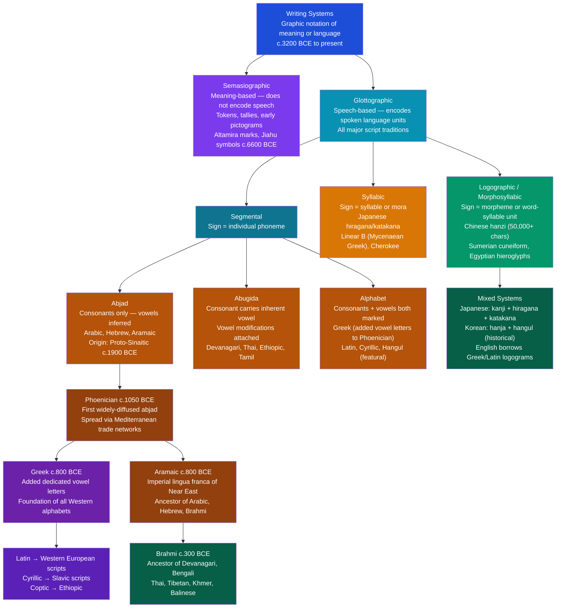

# Writing Systems and Literacy

> [!abstract] TL;DR
> Writing systems are technologies for externalizing language into durable visible form — and the type of system a society uses, how it spread or was invented, and who is permitted access to it shapes not just communication but power, cognition, and cultural identity; the anthropology of literacy asks not only "can this person read?" but "what social practices, institutions, and inequalities does that reading serve?"

---

## Intuition

**Analogy:** Imagine trying to transmit a message from one island to another using only drums. The drummers can communicate across time — drumming recorded in memory — but the message is volatile, context-dependent, and fully transparent only to those who share the code. Now imagine someone carves the drum pattern into a stone slab. Suddenly the message outlasts the drummer, survives translation across people who never met, and can be read by strangers centuries later without any shared living context. But notice what else happened: the person with the chisel now controls which messages become permanent. The carver is not just a recorder — they are a gatekeeper.

That is the double register of writing. It is simultaneously a cognitive technology — enabling lists, tables, contracts, and formal logic that are impossible to maintain in pure oral transmission — and a social technology of power: whoever controls script, schools, and literacy determines who participates in the administrative, legal, and intellectual life of a civilization. Every writing system in history carries both dimensions at once, and the anthropology of literacy insists that you cannot understand one without the other.

---

## How It Works



The diagram maps the complete typological tree of writing systems from semasiographic precursors through the major glottographic branches, and traces the one historical diffusion chain that produced more of the world's living scripts than any other: Phoenician abjad → Greek alphabet (Western branch) and Aramaic abjad → Brahmi abugida (South/Southeast Asian branch). Together, these two branches account for writing systems used by over four billion people today.

---

## Key Concepts

### Secondary Level

**The Six Types of Writing System**

Linguist Peter Daniels (1990) established the canonical typological framework, since refined by scholars including Geoffrey Sampson. Six main types are distinguished by what unit of spoken language each graphic sign encodes:

| Type | Sign encodes | Vowels | Examples | Approx. signs needed |
|------|-------------|--------|----------|----------------------|
| **Logographic** | Morpheme / word | Implicit or partial | Chinese hanzi, Sumerian cuneiform (early), Egyptian hieroglyphs | 1,000–50,000 |
| **Syllabic** | Syllable | Inherent in syllable | Japanese hiragana/katakana, Cherokee syllabary, Linear B | 50–300 |
| **Abjad** | Consonant only | Not written (inferred) | Arabic, Hebrew, Aramaic, Phoenician | 22–30 |
| **Abugida** | Consonant + inherent vowel; vowels marked as diacritics | Diacritically | Devanagari, Bengali, Tamil, Thai, Ethiopic | 40–100 base units |
| **Alphabet** | Individual phoneme (consonant and vowel equally) | Fully marked | Greek, Latin, Cyrillic, Hangul | 20–40 |
| **Featural alphabet** | Phonetic features of articulation | Fully marked | Korean Hangul (shape encodes place and manner of articulation) | 24 base jamo |

No system is "pure" — Chinese uses phonetic components (radicals + sound-hint components) in about 80% of characters; English borrows logographic abbreviations (%, $, @, &); Japanese is a productive hybrid of logographic kanji and two syllabic kana systems.

**Origins of Writing: The Earliest Scripts**

Writing appears to have been independently invented in at least three — and possibly five — separate locations. The debate between **monogenesis** (all writing descended from a single invention, most likely Sumerian) and **polygenesis** (multiple independent inventions) is resolved empirically by the archaeological evidence for independent origins:

| Script | Location | Date | Character | Purpose |
|--------|----------|------|-----------|---------|
| **Cuneiform** | Mesopotamia (Uruk, modern Iraq) | c.3200 BCE | Logosyllabic → syllabic | Accounting, rations, trade records |
| **Egyptian hieroglyphs** | Nile Valley | c.3100 BCE | Logographic + alphabetic elements | Royal administration, religious texts |
| **Indus script** | Harappan cities (Pakistan/NW India) | c.2600 BCE | Unknown — undeciphered | Seals, trade goods |
| **Oracle bone script** | Shang China (Anyang) | c.1200 BCE | Logographic | Divination records |
| **Mesoamerican scripts** | Oaxaca / Mayan lowlands | c.900–400 BCE | Logosyllabic | Calendrical, dynastic |

Egyptologists debate whether hieroglyphs were truly independent of cuneiform or whether the *idea* of writing (without its specific signs) diffused from Mesopotamia to Egypt — a phenomenon Egyptologist John Baines calls "conceptual diffusion" or "stimulus diffusion." The Mesoamerican case is almost certainly independent: the Pacific Ocean was an effective barrier, and Mesoamerican scripts encode languages with no typological relationship to Old World languages.

**Proto-Writing and Its Limits**

Before full writing appeared, societies developed **proto-writing** — graphic systems that record information but do not encode the full structure of spoken language:

- **Counting tokens** (Mesopotamia, c.8000–3500 BCE): clay tokens of different shapes representing quantities of specific commodities; gradually enclosed in sealed clay envelopes, then impressed on the envelope surface — the envelopes became the first clay tablets
- **Pictographic tallies**: marks that record quantities without phonetic value
- **Mnemonic devices**: wampum belts (Haudenosaunee), quipus (Inca) — information storage systems that are not writing in the strict linguistic sense but encode complex information

Proto-writing can record *what* but not *who said what* or *how*. The crucial transition to full writing was the addition of phonetic signs that allowed the system to encode proper names — for which no pictogram exists — and grammatical relationships.

---

### Undergraduate Level

**Jack Goody and Walter Ong: The Great Divide Thesis**

The most influential claim in the cognitive anthropology of literacy is the "great divide" hypothesis, associated with Jack Goody (*The Domestication of the Savage Mind*, 1977) and Walter Ong (*Orality and Literacy*, 1982), building on earlier work by Eric Havelock and Marshall McLuhan.

The core argument: writing is not merely a recording technology — it *reorganizes thought*. Goody identified specific cognitive operations that writing enables and oral tradition cannot sustain:

1. **Lists**: a list strips items of context and narrative embedding, placing them in a purely spatial relationship that invites sorting, ranking, and comparison. Oral cultures can enumerate but cannot *list* in Goody's sense.
2. **Tables**: two-dimensional grids that create cross-referenced categories — the standard bureaucratic tool. Tables require a medium that stays still while the eye traverses it.
3. **Recipes and formulae**: precise sequential instructions that require literate precision to be reliably transmitted without drift.
4. **Formal logical syllogisms**: the syllogism requires that premises be visibly present simultaneously so that their logical relationship can be inspected — oral argument proceeds temporally and relies on rhetorical force rather than logical form.

Ong added a phenomenological dimension: the primary oral mind is *situational, participatory, agonistic, and empathetic* — thought is embedded in concrete human struggle, not abstract analysis. Literacy produces a *secondary literacy mentality*: analytic, distancing, self-referential, capable of treating language itself as an object to be examined (metalinguistic awareness).

**Ong's Primary vs. Secondary Orality**

Ong distinguished:

- **Primary orality**: cultures with no knowledge of writing at all. Their thought processes and communication strategies are entirely shaped by the constraints and affordances of sound.
- **Secondary orality**: the orality of cultures saturated with writing technology — radio, television, telephone — in which "oral" communication is mediated through written scripts and electronic amplification. Secondary orality sounds like primary orality (spoken word, audience participation) but is shaped throughout by literacy. A televised speech by a president is secondary orality: written first, delivered orally, recorded for replay.

This distinction anticipates the analysis of digital communication: emoji and voice notes look like a return to primary orality (immediate, contextual, participatory) but operate within a fully literate technological infrastructure — they are tertiary or post-literate forms, not primary oral ones.

**Brian Street's Critique: The Ideological Model of Literacy**

Brian Street (*Literacy in Theory and Practice*, 1984) mounted the most influential critique of Goody and Ong, distinguishing two models:

**Autonomous model** (Goody, Ong): literacy is a neutral technology with universal cognitive consequences. Once a person learns to read and write, they acquire certain cognitive capacities regardless of context. School literacy programs based on this model treat reading as a skill to be transmitted, like riding a bicycle.

**Ideological model** (Street): there is no autonomous literacy. Every literacy practice is embedded in:
- Specific social institutions (schools, churches, law courts, markets)
- Power relations that determine *whose* literacy counts as legitimate
- Cultural values that make certain texts sacred and others trivial
- Historical processes of colonial imposition or indigenous resistance

Street's evidence: ethnographic fieldwork in Iranian villages showed that men who were formally "illiterate" by school standards operated sophisticated Islamic Quranic literacy (memorization, recitation, exegesis) and market literacy (complex credit records). The "illiterate villager" framing obscured multiple functional literacies because it measured only school-based, Western literacy.

**New Literacy Studies: Literacy Events and Literacy Practices**

Street's ideological model became the foundation of **New Literacy Studies** (NLS), a research program associated with David Barton, Mary Hamilton, James Paul Gee, and Kathleen Street. NLS introduced two key analytical units:

- **Literacy event**: any observable occasion in which literacy plays a role. A literacy event has participants, artifacts (texts), and observable actions. Examples: reading a bedtime story, filling out a tax form, texting a friend, reading a menu, checking a GPS app.
- **Literacy practice**: the broader social and cultural context that gives a literacy event its meaning. Practices include the values, attitudes, social relationships, and power structures that surround literacy events. The "same" act of reading (marking a ballot) has entirely different literacy practices in a liberal democracy, a one-party state, and a society where women have been denied suffrage.

Gee's influential reformulation (*Social Linguistics and Literacies*, 1990): there is no single "literacy" — there are **Discourses** (capitalized), meaning integrated ways of acting, believing, valuing, and using language and literacy that constitute social identities. School literacy is one Discourse; gang literacy is another; medical literacy is a third. Fluency in one Discourse does not transfer automatically to another, which explains the persistent failure of basic skills literacy programs that ignore the social dimension.

**Script Contact, Adaptation, and Political Identity**

Scripts do not spread neutrally. When writing systems travel, they are adapted, weaponized, and contested:

**The Phoenician diffusion** is the most consequential script-contact event in history. Phoenician merchants carried their 22-consonant abjad across the Mediterranean from approximately 1050 BCE. Each receiving culture adapted it:
- Greeks added dedicated vowel letters (alpha, epsilon, iota, omicron, upsilon, from Phoenician consonant letters whose sounds Greek lacked), creating the first true alphabet around 800 BCE
- Aramaic scribes adapted Phoenician for the imperial language of the Assyrian and Persian empires; Aramaic became the ancestor of Arabic, Hebrew, and — through the Brahmi script — virtually all South and Southeast Asian scripts including Devanagari, Bengali, Thai, Tibetan, and Khmer

**Script as political identity**: the choice of script often encodes political allegiance independently of the language being written:
- Serbian and Croatian are mutually intelligible spoken languages, yet Serbian is written in Cyrillic (Eastern Orthodox, Russia-facing) and Croatian in Latin (Catholic, Western-facing)
- Vietnamese was written for centuries in Chinese characters (*chữ Nôm*), then shifted to a Latin-based romanization (*Quốc ngữ*) under French colonial imposition — a colonial tool that became a vehicle of nationalist identity after independence
- Balkan languages (Bosnian, Serbian, Croatian) underwent Cyrillic-to-Latin shifts after 1991 as part of the political realignment away from Yugoslavia
- The Ottoman Turkish shift from Arabic script to Latin alphabet (1928, under Atatürk) was explicitly framed as Westernization; it also severed living readers from Ottoman-era texts overnight

---

### Graduate Level

**Multiliteracies and the New London Group**

In 1996, a group of literacy scholars meeting in New London, New Hampshire (including Gee, Gunther Kress, Brian Street, and others) published "A Pedagogy of Multiliteracies" (*Harvard Educational Review*), arguing that the concept of "literacy" had become inadequate for three reasons:

1. **Multimodal communication**: meaning is increasingly made through combinations of image, sound, gesture, spatial design, and text simultaneously. A webpage, a video essay, a subway system, a video game — all are multimodal texts. A literacy pedagogy focused only on the verbal is teaching a minority of the modes through which meaning circulates.
2. **Multiple Englishes and multiple vernaculars**: globalization means no single standard language or script can serve as the universal vehicle of literacy. Code-switching, translanguaging, and dialect literacy are not deficits — they are resources.
3. **Civic and workplace transformation**: the post-Fordist economy requires not just reading-and-writing skills but the ability to navigate distributed, collaborative, and rapidly changing knowledge environments.

The "multiliteracies" framework proposed **Available Designs** (the existing semiotic resources a learner brings), **Designing** (the active transformation of those resources in new meaning-making), and **The Redesigned** (the transformed semiotic resource that emerges and becomes a new Available Design for others).

**Paulo Freire: Literacy as Conscientization**

Paulo Freire's *Pedagogy of the Oppressed* (1968) developed the most radical theory of literacy in the 20th century, drawing on his literacy work with Brazilian agricultural workers. Freire's core claims:

- **Banking model of education**: conventional literacy instruction treats the learner as an empty vessel to be filled with correct knowledge. The learner is passive; the text is authoritative; the goal is reproduction of existing meanings. This model reproduces social hierarchy because it teaches the dominated to read *on the terms of* the dominant class.
- **Conscientization** (*conscientização*): true literacy is not the ability to decode pre-existing texts but the ability to *name the world* — to analyze and transform one's own social reality through language. Freire's literacy circles began not with the alphabet but with "generative words" drawn from participants' own lives: words like *tijolo* (brick) or *trabalho* (work), chosen because they carried intense social meaning for favela workers and would motivate genuine engagement.
- **The literacy-power nexus**: literacy and illiteracy are not natural categories but political ones. Keeping agricultural workers illiterate in Brazil was a deliberate social policy — illiterate citizens could not vote; their labor contracts could not be contested; their legal rights could not be claimed. Literacy, in this context, is an act of political insurgency.

Freire's framework anticipated Street's ideological model and the New Literacy Studies agenda by almost two decades, though it emerged from praxis rather than academic linguistics.

**Undeciphered Scripts and the Limits of Archaeological Reconstruction**

Several major ancient writing systems remain undeciphered, representing permanent gaps in the historical record:

| Script | Culture | Dates | Status | Key Problem |
|--------|---------|-------|--------|-------------|
| **Indus / Harappan script** | Harappan civilization | c.2600–1900 BCE | Undeciphered | Short texts (avg. 5 signs); no bilingual key; disputed whether it encodes full language |
| **Proto-Elamite** | Elam (SW Iran) | c.3100–2900 BCE | Undeciphered | ~10,000 tablets; complex, non-repetitive sign sequences |
| **Linear A** | Minoan Crete | c.1800–1450 BCE | Undeciphered | Only ~1,500 inscriptions; related language unknown |
| **Rongorongo** | Easter Island | c.1200 CE? | Undeciphered | Small corpus; context destroyed by colonial contact |

The Indus script is particularly significant. The Harappan civilization covered over 1 million km² — larger than Old Kingdom Egypt and contemporary Mesopotamia combined — yet left no king lists, no religious texts, and no bilingual inscriptions. The script appears on small stamp seals, suggesting administrative use, but the average inscription is only 4–6 signs. Whether it encodes a fully grammatical language or a restricted administrative proto-writing remains contested. The absence of decipherment is not merely an academic puzzle: it means we cannot reconstruct Harappan political organization, religious practices, or social structure from their own texts.

**Script Revitalization as Cultural Sovereignty**

The politics of script revival connect the historical and contemporary dimensions of writing anthropology:

**Cherokee syllabary (Sequoyah, 1821)**: Sequoyah (George Guess/Gist), a monolingual Cherokee speaker who could not read any language, developed a complete syllabary for Cherokee over approximately twelve years, completing it around 1821. His syllabary of 85 characters (originally 86) was adopted by the Cherokee Nation within years; by 1828 the *Cherokee Phoenix* newspaper was published bilingually in Cherokee and English. Sequoyah's achievement is remarkable as a case of **stimulus diffusion without content diffusion**: he knew writing existed (from contact with English) but invented entirely new signs. The Cherokee syllabary is now experiencing active revitalization as part of Cherokee Nation sovereignty programs, with immersion schools and digital Unicode encoding.

**N'Ko script (Solomana Kanté, 1949)**: N'Ko was created by Guinean scholar Solomana Kanté in 1949 specifically in response to a colonial newspaper article claiming Africans had no indigenous writing traditions. Kanté created a right-to-left script for the Manding languages (Mandinka, Bambara, Dyula, etc.) of West Africa. N'Ko literacy became a vehicle of Manding cultural identity, supporting religious scholarship, historical writing, and political organization entirely outside colonial and post-colonial francophone educational institutions. N'Ko demonstrates that script creation can be an act of deliberate anti-colonial cultural production.

**Hawaiian orthography revival**: the Hawaiian language was nearly extinguished by 20th-century suppression in schools. Since the 1978 Hawaii State Constitution mandated Hawaiian as a co-official language, Hawaiian-medium immersion schools (*Pūnana Leo*) and the standardization of Hawaiian orthography — particularly the use of the *okina* (glottal stop) and *kahakō* (macron for long vowels) — have been central to cultural recovery. Orthographic decisions (whether to mark the *okina* and *kahakō*) are politically charged: they determine how the language appears in legal documents, signage, and digital environments.

**Digital Literacies and the Return to the Image**

Digital communication has transformed literacy practices in ways that challenge the Goody/Ong developmental narrative:

- **Emoji**: an ideographic system of approximately 3,600+ Unicode characters (as of 2026) that functions semiotically like a partial logographic script. Emoji use is genre-specific, platform-specific, and generationally stratified — a research object for sociolinguistics and digital anthropology.
- **Memes**: image-text composites that circulate meaning through recognizable visual templates whose "grammar" is culturally shared but not formally codified. Meme literacy is a vernacular literacy in the NLS sense: highly valued within specific communities, largely invisible to formal educational assessment.
- **Hashtags and hyperlinks**: metadiscursive literacy practices that organize, amplify, and connect texts across platforms. Hashtag fluency — knowing which tags reach which audiences — is a significant component of digital political literacy (#BlackLivesMatter, #MeToo).
- **The digital divide**: access to digital literacy is structured by race, class, language, and geography. The global digital literacy gap reproduces and amplifies pre-existing literacy inequalities. Moreover, "digital literacy" is not unitary — access to hardware, software, internet, *and* the cultural capital to navigate digital environments form a cascading set of requirements, each of which is differentially distributed.

Gunther Kress (*Literacy in the New Media Age*, 2003) argues that digital communication represents a fundamental shift from the *dominance of writing* to the *dominance of image*. If Goody was right that writing reorganized thought toward analysis, formalization, and decontextualization, then the re-emergence of image-centered communication in digital environments represents not regression but a new semiotic ecology — one in which the logics of multiple modes must be simultaneously managed.

---

## Python Demo

```python
# Writing System Spread: Independent Invention vs. Diffusion
#
# Models the emergence and spread of writing across a landscape of
# civilizations arranged on a 2D grid.
#
# Each cell = one civilization. At each time step ("century"):
#   - A non-literate cell with NO literate neighbors may independently
#     invent writing with base probability P_INDEP.
#   - A non-literate cell WITH literate neighbors has a much higher
#     probability of adopting writing through diffusion (P_DIFF per neighbor).
#
# Diffusion pattern: wavefront spreading outward from early inventors.
# Independent pattern: isolated cells that develop writing far from any
#                      existing literate zone — appear as lone red points.
#
# This operationalizes the monogenesis vs. polygenesis debate:
#   monogenesis → one early independent origin; all else diffusion
#   polygenesis → several geographically separated independent origins
#
# Uses: numpy, matplotlib only

import numpy as np
import matplotlib
matplotlib.use("Agg")
import matplotlib.pyplot as plt
from matplotlib.colors import ListedColormap
from matplotlib.patches import Patch

rng = np.random.default_rng(42)

# ─── Parameters ──────────────────────────────────────────────────────────────
GRID    = 22          # 22x22 = 484 "civilizations"
T_MAX   = 250         # simulation steps (~200 years per step)
P_INDEP = 0.003       # probability of independent invention per step (rare)
P_DIFF  = 0.10        # probability of adopting from each literate neighbor

# ─── State matrices ───────────────────────────────────────────────────────────
literacy      = np.zeros((GRID, GRID), dtype=np.int8)
origin        = np.zeros((GRID, GRID), dtype=np.int8)  # 1=independent, 2=diffusion
adoption_time = np.full((GRID, GRID), -1, dtype=int)


def literate_neighbors(arr, r, c):
    """Count 8-connected literate neighbors."""
    count = 0
    for dr in [-1, 0, 1]:
        for dc in [-1, 0, 1]:
            if dr == 0 and dc == 0:
                continue
            nr, nc = r + dr, c + dc
            if 0 <= nr < GRID and 0 <= nc < GRID:
                count += int(arr[nr, nc])
    return count


# ─── Simulation ──────────────────────────────────────────────────────────────
snapshots    = {}
literacy_pct = []

for t in range(1, T_MAX + 1):
    new_lit = literacy.copy()
    for r in range(GRID):
        for c in range(GRID):
            if literacy[r, c]:
                continue
            lit_n = literate_neighbors(literacy, r, c)
            if lit_n > 0:
                # Diffusion: each neighbor contributes independently
                p = 1.0 - (1.0 - P_DIFF) ** lit_n
                if rng.random() < p:
                    new_lit[r, c] = 1
                    origin[r, c] = 2
                    adoption_time[r, c] = t
            else:
                # Independent invention: no literate neighbors
                if rng.random() < P_INDEP:
                    new_lit[r, c] = 1
                    origin[r, c] = 1
                    adoption_time[r, c] = t
    literacy = new_lit
    literacy_pct.append(float(literacy.mean() * 100))
    if t in (20, 70, 140, T_MAX):
        snapshots[t] = (literacy.copy(), origin.copy())

# ─── Summary statistics ───────────────────────────────────────────────────────
n_indep = int((origin == 1).sum())
n_diff  = int((origin == 2).sum())
n_none  = int((origin == 0).sum())

print("=== Writing Spread Simulation ===")
print(f"Grid: {GRID}x{GRID} = {GRID*GRID} civilizations | Steps: {T_MAX}")
print(f"P(independent invention/step): {P_INDEP:.4f}")
print(f"P(diffusion from one literate neighbor/step): {P_DIFF:.3f}")
print()
print(f"  Independent inventors (isolated origin): {n_indep:>4}  ({n_indep/GRID**2:.1%})")
print(f"  Diffusion adopters   (from neighbors):   {n_diff:>4}  ({n_diff/GRID**2:.1%})")
print(f"  Still non-literate  (end of sim):         {n_none:>4}  ({n_none/GRID**2:.1%})")
print(f"  Final literacy rate: {100 - n_none*100/GRID**2:.1f}%")

if n_indep > 0 and n_diff > 0:
    t_i = adoption_time[origin == 1]
    t_d = adoption_time[origin == 2]
    print(f"\n  Mean step of independent invention: {t_i.mean():.1f}")
    print(f"  Mean step of diffusion adoption:    {t_d.mean():.1f}")
    print("  (Independent inventors appear earlier — diffusion reaches")
    print("   remote cells only after waves travel outward from origins.)")

print()
print("Anthropological interpretation:")
print("  Red cells = independent inventions: sparse, isolated on the map.")
print("  Blue cells = diffusion: continuous spatial clusters (ring waves).")
print("  Empirically, writing was independently invented ~3-5 times:")
print("  Mesopotamia (c.3200 BCE), Egypt (c.3100 BCE), Indus (c.2600 BCE),")
print("  China (c.1200 BCE), Mesoamerica (c.900 BCE).")
print("  All other writing systems derived from these through diffusion.")

# ─── Visualization ─────────────────────────────────────────────────────────────
fig, axes = plt.subplots(2, 4, figsize=(16, 8))
fig.suptitle(
    "Writing System Spread: Independent Invention vs. Diffusion\n"
    f"(Grid = {GRID}x{GRID} civilizations, {T_MAX} time steps)",
    fontsize=12
)

lit_cmap    = ListedColormap(["#f5f5f5", "#1d4ed8"])
origin_cmap = ListedColormap(["#f5f5f5", "#dc2626", "#2563eb"])
snap_items  = list(snapshots.items())

for i, (step, (snap_lit, snap_orig)) in enumerate(snap_items):
    ax_top = axes[0][i]
    ax_top.imshow(snap_lit, cmap=lit_cmap, vmin=0, vmax=1, interpolation="nearest")
    ax_top.set_title(f"Step {step} — Literacy", fontsize=9)
    ax_top.set_xticks([]); ax_top.set_yticks([])
    ax_top.set_aspect("equal")

    ax_bot = axes[1][i]
    ax_bot.imshow(snap_orig, cmap=origin_cmap, vmin=0, vmax=2, interpolation="nearest")
    ax_bot.set_title(f"Step {step} — Origin", fontsize=9)
    ax_bot.set_xticks([]); ax_bot.set_yticks([])
    ax_bot.set_aspect("equal")

# Legend on the last origin panel
legend_elements = [
    Patch(facecolor="#dc2626", label="Independent invention"),
    Patch(facecolor="#2563eb", label="Diffusion from neighbor"),
    Patch(facecolor="#f5f5f5", edgecolor="#9ca3af", label="Non-literate"),
]
axes[1][3].legend(handles=legend_elements, loc="lower right", fontsize=7,
                  framealpha=0.9)

# Overlay literacy % curve on top-right panel (replace with time series)
ax_ts = axes[0][3]
ax_ts.cla()
ax_ts.plot(range(1, T_MAX + 1), literacy_pct, color="#1d4ed8", lw=2)
ax_ts.set_title("Literacy rate over time (%)", fontsize=9)
ax_ts.set_xlabel("Step", fontsize=8)
ax_ts.set_ylabel("% literate civilizations", fontsize=8)
ax_ts.set_xlim(1, T_MAX)
ax_ts.set_ylim(0, 105)
ax_ts.grid(True, alpha=0.25)

plt.tight_layout()
plt.savefig("writing_spread_simulation.png", dpi=140, bbox_inches="tight")
print("\nFigure saved: writing_spread_simulation.png")
```

**What the simulation demonstrates:**

- **Spatial clustering of diffusion**: at any time step, the blue (diffusion) cells form continuous clusters radiating outward from the earliest red (independent) inventors. This ring-wave pattern is precisely what archaeologists observe in the spread of alphabetic writing from Phoenicia outward across the Mediterranean — earlier dates at the Levantine coast, progressively later dates in Greece, Italy, Spain, and North Africa.

- **Rarity of independent invention**: with P_INDEP = 0.003, only a small minority of the 484 civilizations ever independently invent writing. The rest acquire it through contact. This ratio is consistent with the historical record: of ~7,000 language communities in the world today, only a handful have ever independently produced a writing system.

- **Isolated late inventors**: occasionally a cell in an isolated corner of the grid invents writing independently late in the simulation — precisely because it has no literate neighbors to diffuse from. This maps to cases like the Cherokee syllabary (North America, 1821) and N'Ko (West Africa, 1949), both developed in geographic and cultural separation from existing literate traditions.

- **Literacy rate curve**: the time series plot shows the characteristic S-curve of diffusion — slow takeoff while only isolated inventors exist, rapid acceleration once diffusion waves begin to overlap, then deceleration as the remaining non-literate civilizations are isolated corners with no literate neighbors.

---

## Real-World Applications

> **Example 1 — Cuneiform as administrative technology:** The earliest cuneiform tablets from Uruk (c.3200 BCE) are not literature, law, or religion — they are spreadsheets. They record rations of grain and beer distributed to laborers, livestock counts, and trade commodity tallies. The world's first writer was an accountant. This supports Goody's thesis that writing's initial cognitive work was enabling the list and the table: the Uruk administrative system could not have managed a city of 50,000 people on the redistributive economy of temple estates without a durable, inspectable record-keeping technology. Writing did not record civilization; it made this particular kind of civilization operationally possible.

> **Example 2 — Script choice in the Yugoslav succession:** When Yugoslavia dissolved in 1991, one of the first acts of Croatian and Bosnian institutional identity formation was the official adoption of Latin script in place of the Cyrillic script used in Yugoslavia's official Serbian. The Serbian, Croatian, and Bosnian languages are mutually intelligible; the script choice encodes nothing linguistic. It encodes everything political: Latin = Catholic = Western = EU-aspirant; Cyrillic = Orthodox = Slavic = post-Soviet orientation. Street's ideological model predicts exactly this: literacy is never a neutral technology. The choice of script is a choice about whose cultural heritage is being claimed and which power bloc is being aligned with.

> **Example 3 — Street's fieldwork and multiple literacies:** In the early 1980s, Street conducted fieldwork in Iranian villages where men formally classified as "illiterate" by Iranian national literacy measures operated sophisticated Islamic literacy (Quranic recitation, exegesis, Arabic script reading for religious texts) and complex commercial literacy (ledger-keeping, credit tracking, commodity pricing). The "illiterate villager" label was accurate only within the autonomous model — measuring only one form of literacy, defined by a specific educational institution. The ideological model reveals that these men were highly literate *in the literacies that governed their lives*, and that their apparent illiteracy was a colonial-administrative artifact, not a cognitive deficit.

> **Example 4 — Cherokee language revival and digital infrastructure:** The Cherokee Nation's language revitalization program illustrates how digital infrastructure has become inseparable from script survival. Unicode encoding of the Cherokee syllabary (added to Unicode in 1999, extended in 2014 for Syllabics Supplement) made Cherokee writable on all devices. Without Unicode representation, a script effectively does not exist in digital communication environments — it cannot appear in SMS, social media, or web search. The Unicode Consortium's decisions about which scripts to encode and how to prioritize them are, in effect, decisions about which writing systems will survive in the digital era — a new dimension of the politics of literacy that Freire and Street could not have anticipated.

> **Example 5 — Emoji as logographic evolution:** Between 2015 and 2026, the Unicode Consortium added over 3,000 emoji to the Unicode standard. Emoji function semiotically as partial logograms: the emoji is a sign whose meaning is conventional, context-sensitive, and subject to cultural drift (the same emoji carries different meanings across age groups, cultures, and platforms). Emoji use also exhibits the classic features of script contact: Japanese emoji conventions (*kaomoji* text-art; specific contextual uses of certain icons) diffused globally via smartphone platform adoption, then were adapted locally. The fact that major NLP tokenizers (including BPE tokenizers used in large language models) must handle emoji as a distinct character class demonstrates that digital text processing now requires accounting for a genuinely hybrid logographic-alphabetic writing environment.

---

## Common Pitfalls

- **Treating the great divide as a binary** — Goody and Ong are frequently misread as claiming that oral people cannot think logically or that literacy deterministically produces rationality. Both scholars were more careful: they argued that certain cognitive *operations* are facilitated by literacy, not that literate people are smarter. The critique stands — oral cultures have produced sophisticated logical, mathematical, and philosophical traditions (Vedic mathematics, West African divination systems, Indigenous ecological knowledge) — but the vulgarized version of the great divide thesis is a caricature of their actual claim.

- **Conflating writing with language** — Writing is a graphic representation of language or meaning; it is not language itself. Sign languages are full languages with no traditional script; languages with no writing system are not "less developed." The equation of language with writing is a literate bias so deep that English uses "written and spoken language" as if they were parallel, when writing is a technology for rendering language visible and durable, not a second modality of language itself.

- **Assuming alphabetic writing is most efficient** — The popular claim that the alphabet is the "pinnacle" of writing system evolution is empirically false. Chinese readers process hanzi at speeds comparable to or faster than alphabetic readers process alphabets, because logographic reading relies on whole-character recognition (parallel visual processing) rather than sequential phonological assembly. Different writing systems optimize for different trade-offs: abjads are highly efficient for consonant-rich Semitic languages where vowels are predictable from context; abugidas are well-adapted for languages with consistent consonant-vowel syllable structure; alphabets are well-suited for languages with complex consonant clusters (English, Russian).

- **Treating monogenesis/polygenesis as settled** — The evidence for independent invention of writing in Mesoamerica (c.900 BCE) and China (c.1200 BCE) is strong enough that polygenesis is the consensus position for the Old World + New World comparison. But the relationship between cuneiform and Egyptian hieroglyphs remains debated: conceptual diffusion (the idea of writing, without specific signs) cannot be ruled out, and the two systems appear within a century of each other in civilizations with documented trade contact. Monogenesis and polygenesis are not mutually exclusive — some inventions may have been independent while others involved stimulus diffusion.

- **Romanticizing script revitalization** — Script revival movements (Cherokee, N'Ko, Hawaiian, Manchu) are significant acts of cultural sovereignty and deserve support and documentation. But revitalization faces structural challenges that romanticism obscures: a script only survives if there are both texts to read in it and writing to produce in it; digital infrastructure (Unicode encoding, keyboard input methods, OCR) is now required for any script to function in contemporary literate environments; and revitalization programs must navigate the tension between standardization (necessary for institutional use) and the diversity of existing dialectal and community practices.

- **Ignoring the labor of literacy** — Literacy acquisition requires sustained pedagogical investment. In societies with cuneiform or classical Chinese, scribal training took years of intensive study — a form of labor that sorted the population into literate specialists and non-literate producers. The idea that widespread functional literacy is the natural human default is historically very recent (post-18th century in Europe; post-20th century globally) and dependent on specific political decisions about public education funding. Treating literacy as a neutral cognitive baseline that some people simply "have" or "don't have" erases the political economy of educational investment.

---

## Related Concepts

- [[_MOC_Language_and_Cognition|↑ Language and Cognition MOC]] — Section map for all 7 notes in this section
- [[State_Formation_and_Early_Civilizations]] — Writing emerged as an administrative technology of the early state (cuneiform in Uruk, hieroglyphs in Pharaonic Egypt); the archaeology of the earliest scripts is simultaneously the archaeology of state formation, with accounting tablets preceding literature by centuries
- [[Culture_Symbols_and_Meaning]] — Saussure's structural linguistics (signifier/signified, arbitrary sign, langue/parole) is the theoretical foundation of writing system analysis; Geertz's thick description treats culture as a text to be read — an explicitly literate metaphor that assumes writing's organizational logic
- [[Material_Culture_and_Technology]] — Writing implements and materials (clay tablets, papyrus, vellum, paper, printing press, digital screens) are not neutral conduits but shape what kinds of texts can be produced and preserved; the history of writing is partly a history of inscription technologies
- [[Structuralism_and_Symbolic_Anthropology]] — Lévi-Strauss applied Saussurian structural linguistics — itself a theory of written language's underlying system — to myth and kinship; the structuralist method of identifying paradigmatic oppositions across texts presupposes a literate researcher's ability to lay texts side by side and compare them spatially
- [[Sociology_of_Knowledge_and_Science]] — Street's ideological model of literacy and Freire's pedagogy of the oppressed both belong to the sociology of knowledge: claims about who produces legitimate knowledge, in which code, through which institutions, are simultaneously claims about literacy access and literacy hierarchy
- [[Tokenization]] — NLP tokenizers must model the boundary between characters, syllables, and morphemes differently for logographic (Chinese), syllabic (Japanese kana), and alphabetic (English) writing systems; the tokenization problem is directly shaped by the typology of writing systems described in this note
- [[String_Matching_Overview]] — Pattern-matching algorithms over strings operate on sequences of Unicode code points; the complexity of script-aware string matching (handling Arabic right-to-left directionality, Devanagari conjunct consonants, Chinese character normalization forms) reflects the typological diversity of writing systems

---

## Review Questions

### Secondary

1. A textbook claims "writing is just a way of recording speech." Using the typology of writing systems — logographic, syllabic, abjad, abugida, alphabet — explain why this definition is incomplete. Give one example of a writing system that captures something other than speech sounds.
2. Writing was invented in Mesopotamia around 3200 BCE. The very first tablets are not poetry or laws — they are accounting records. What does this tell us about the relationship between writing and political organization? Why might a society need durable records before it needs durable stories?
3. The Cherokee syllabary was created by Sequoyah, a monolingual Cherokee speaker, in the 1820s. The N'Ko script was created by Solomana Kanté in Guinea in 1949. What do these two cases have in common? What do they suggest about the relationship between writing systems and cultural identity?

### Undergraduate

1. Goody argues that the list and the table are cognitive operations that writing enables and oral tradition cannot sustain. Street argues that this is an "autonomous model" that ignores the social context of literacy. Using specific ethnographic evidence (including Street's Iranian fieldwork or Gee's Discourse analysis), construct the strongest version of Street's critique. Does it refute Goody's claim, or does it refine it?
2. The choice of script for Bosnian/Croatian/Serbian and for Vietnamese under and after French colonialism illustrates Street's claim that literacy is never ideologically neutral. Identify two additional cases where script choice encodes a political identity claim rather than a purely linguistic one. What general principle does the pattern suggest about the relationship between scripts and power?
3. Using Barton and Hamilton's concepts of "literacy event" and "literacy practice," analyze the following two acts of reading: (a) a factory worker checking a safety warning sign, and (b) the same worker reading the Quran at Friday prayer. Both involve the same person, the same skill of decoding text. What does the literacy practice framework reveal that a purely cognitive account of reading would miss?

### Graduate

1. Goody (*The Domestication of the Savage Mind*, 1977), Street (*Literacy in Theory and Practice*, 1984), and Freire (*Pedagogy of the Oppressed*, 1968) each offer a different account of the relationship between literacy and power. Construct a synthesis: where do the three frameworks converge, where do they conflict, and what does each illuminate that the others cannot? Use a specific contemporary case — choose from digital literacy, Indigenous script revitalization, or refugee literacy education — to test the synthesis.
2. The Indus script has not been deciphered despite over a century of study and a corpus of ~4,000 inscriptions. Proto-Elamite and Linear A are similarly intractable. What methodological and epistemic constraints make decipherment of these scripts unlikely without a bilingual key (like the Rosetta Stone)? What does this say more broadly about the limits of archaeological reconstruction of past literacy practices, and what kinds of anthropological knowledge are permanently foreclosed?
3. Gunther Kress argues that digital communication represents a shift from the dominance of writing to the dominance of image, and that this demands a fundamentally new theory of meaning-making. Evaluate this claim against three counterarguments: (a) emoji and memes are parasitic on alphabetic literacy and do not constitute a genuinely new semiotic system; (b) the dominance of image is concentrated in specific platforms and demographics and cannot be generalized; (c) "image" and "writing" have never been cleanly separated (Chinese script, Egyptian hieroglyphs, medieval illuminated manuscripts). Which elements of Kress's argument survive these objections, and what would a revised "multiliteracies" framework need to accommodate?

---

## Sources

- [Daniels, P.T. (1990). "Fundamentals of Grammatology." *Journal of the American Oriental Society* 110(4), 727–731.](https://doi.org/10.2307/602899)
- [Goody, J. (1977). *The Domestication of the Savage Mind*. Cambridge University Press.](https://www.goodreads.com/book/show/1313498.The_Domestication_of_the_Savage_Mind)
- [Goody, J. & Watt, I. (1963). "The Consequences of Literacy." *Comparative Studies in Society and History* 5(3), 304–345.](https://doi.org/10.1017/S0010417500001730)
- [Ong, W.J. (1982). *Orality and Literacy: The Technologizing of the Word*. Methuen.](https://www.goodreads.com/book/show/532172.Orality_and_Literacy)
- [Street, B. (1984). *Literacy in Theory and Practice*. Cambridge University Press.](https://www.goodreads.com/book/show/2128050.Literacy_in_Theory_and_Practice)
- [Street, B. (1995). "Autonomous and Ideological Models of Literacy: Approaches from New Literacy Studies." (*Media Anthropology Network*, archived)](https://www.philbu.net/media-anthropology/street_newliteracy.pdf)
- [Freire, P. (1968). *Pedagogy of the Oppressed*. Herder and Herder. (English trans. Ramos, 1970.)](https://www.goodreads.com/book/show/72657.Pedagogy_of_the_Oppressed)
- [Barton, D. & Hamilton, M. (1998). *Local Literacies: Reading and Writing in One Community*. Routledge.](https://www.goodreads.com/book/show/1629451.Local_Literacies)
- [Gee, J.P. (1990). *Social Linguistics and Literacies: Ideology in Discourses*. Falmer Press.](https://www.goodreads.com/book/show/1232440.Social_Linguistics_and_Literacies)
- [New London Group (1996). "A Pedagogy of Multiliteracies: Designing Social Futures." *Harvard Educational Review* 66(1), 60–92.](https://doi.org/10.17763/haer.66.1.17370n67v22j160u)
- [Kress, G. (2003). *Literacy in the New Media Age*. Routledge.](https://www.goodreads.com/book/show/1166497.Literacy_in_the_New_Media_Age)
- [National Geographic Education: Sequoyah and the Creation of the Cherokee Syllabary](https://education.nationalgeographic.org/resource/sequoyah-and-creation-cherokee-syllabary/)
- [Wikipedia: N'Ko script — Solomana Kanté and Mande writing](https://en.wikipedia.org/wiki/N%27Ko_script)
- [Wikipedia: Phoenician alphabet — origin and descendant scripts](https://en.wikipedia.org/wiki/Phoenician_alphabet)
- [Omniglot: Types of Writing Systems — full typological survey](https://www.omniglot.com/writing/types.htm)
- [Daniels, P.T. & Bright, W. (Eds.) (1996). *The World's Writing Systems*. Oxford University Press.](https://www.goodreads.com/book/show/484109.The_World_s_Writing_Systems)
- [Wikipedia: Indus script — state of decipherment](https://en.wikipedia.org/wiki/Indus_script)

---

#Anthropology #LanguageCognition #WritingSystems #Literacy #Script #Orthography
