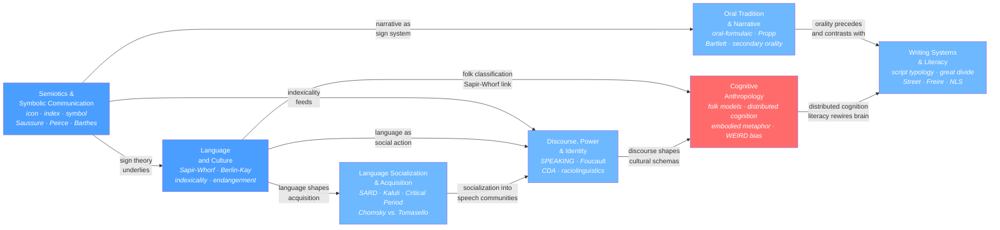

# Language and Cognition

> [!abstract] Section Overview
> This section examines how humans use, acquire, and think through language — and how language in turn shapes thought, social life, and power. The notes move from the semiotic foundations that make meaning possible, through the anthropological questions of linguistic relativity and socialization, into the political dimensions of discourse, the cognitive architecture of cultural models, and the two great technologies of knowledge storage: oral tradition and writing. Together they form a single argument: language is not a neutral carrier of pre-formed ideas but an active medium that constitutes culture, distributes power, and structures cognition across societies and generations.

---

## Notes in This Section

- [[Language_and_Culture]] — Linguistic anthropology's central debate: does language shape thought? Covers Sapir-Whorf hypothesis (weak linguistic relativity), Berlin and Kay's color term universals, Boroditsky's experiments, Pirahã and the Universal Grammar challenge, indexicality, and language endangerment.
- [[Language_Socialization_and_Acquisition]] — How children are simultaneously socialized through language and socialized to use it; Schieffelin and Ochs's SARD framework, the Kaluli counter-case to child-directed speech universalism, the Critical Period Hypothesis, nativist vs. interactionist vs. usage-based acquisition theories, and language ideology.
- [[Discourse_Power_and_Identity]] — Language as social action: Hymes's SPEAKING model and communicative competence, Foucault's power/knowledge regimes, Critical Discourse Analysis, Silverstein's orders of indexicality, enregisterment, raciolinguistics, and digital discourse.
- [[Cognitive_Anthropology]] — How culture organizes mental life: ethnoscience and folk classification, Quinn and Holland's cultural models, Rosch's prototype theory, Hutchins's distributed cognition, Lakoff and Johnson's embodied conceptual metaphors, neuroanthropology and the WEIRD bias critique, and cognitive evolution.
- [[Semiotics_and_Symbolic_Communication]] — The science of signs: Saussure's arbitrary signifier/signified and value-through-difference, Peirce's icon/index/symbol triad and the interpretant chain, Barthes's myth as second-order ideology, kinesics, proxemics, gesture, facial expression, and digital semiotics.
- [[Oral_Tradition_and_Narrative]] — Composition-in-performance and the oral-formulaic theory (Parry and Lord), Propp's narrative functions, Hymes's ethnopoetics, Goody and Ong on orality and literacy as cognitive modes, Bartlett's reconstructive memory, and digital oral tradition.
- [[Writing_Systems_and_Literacy]] — Typology of writing systems (logographic through alphabet), independent origins of writing, Goody and Ong's great divide thesis, Street's ideological model vs. the autonomous model, New Literacy Studies, Freire's conscientization, script politics, and digital literacies.

---

## Concept Map



*(Blue = foundational entry points, Red = most advanced synthesis, arrows show conceptual dependencies)*

---

## Learning Path

Recommended order for a first pass through this section:

1. [[Semiotics_and_Symbolic_Communication]] — Start here: Saussure and Peirce provide the vocabulary of signs (icon, index, symbol, signifier, signified, langue/parole) that every other note in this section assumes. Barthes's myth analysis shows how sign systems carry ideology.
2. [[Language_and_Culture]] — Build on semiotics to tackle linguistic anthropology's central question: does the language you speak shape how you think? Introduces Sapir-Whorf, Berlin and Kay's color universals, Boroditsky's experiments, and Pirahã — the empirical core of the field.
3. [[Language_Socialization_and_Acquisition]] — Explains how children enter the sign system they were born into: Schieffelin and Ochs show that acquiring language and being socialized into a culture are the same process, not two separate events.
4. [[Discourse_Power_and_Identity]] — Language is social action: Hymes's SPEAKING model, Foucault's discourse regimes, and Silverstein's indexicality orders show how every utterance positions the speaker within hierarchies of race, class, gender, and power.
5. [[Oral_Tradition_and_Narrative]] — Before writing, all knowledge was stored in performance. Parry and Lord, Propp, and Goody show how oral composition works, how memory shapes tradition, and what literacy actually changed about cognition.
6. [[Writing_Systems_and_Literacy]] — Writing's typology, its independent origins, and — crucially — what writing does to social power: Street's ideological model and Freire's conscientization reveal that "literacy" is never a neutral technology.
7. [[Cognitive_Anthropology]] — The advanced synthesis: folk taxonomies, cultural models, distributed cognition, embodied metaphor, and neuroanthropology show how culture and cognition are mutually constitutive systems, drawing together threads from all preceding notes.

---

## Key Themes

- **The arbitrary sign and its consequences** — Saussure's insight that the relationship between a word and its meaning is conventional, not natural, explains why language differs so radically across cultures and why meaning drifts over time; it is also the key to understanding how ideology works through language by naturalizing what is historically contingent.
- **Language as both resource and constraint** — Language simultaneously enables thought (making certain distinctions automatic and efficient) and constrains it (making other distinctions harder to hold in working memory); the Sapir-Whorf debate, oral-formulaic composition, and cultural models theory all turn on this double role.
- **Socialization, power, and the politics of legitimate speech** — Who is permitted to speak, in which variety, in which context, and with what authority is never determined by linguistic capacity alone; Bourdieu's linguistic capital, Foucault's discourse regimes, raciolinguistics, and Street's ideological model of literacy converge on this insight from different angles.
- **Cognition is distributed, embodied, and culturally shaped** — From Hutchins's ship navigation to Bartlett's reconstructive memory to the WEIRD bias critique, the section builds the case that cognition is not a private computational process inside individual skulls but a socio-material practice whose architecture is shaped by cultural tools, institutions, and histories.

---

## Cross-Section Links

- [[Classical_Anthropological_Theory]] — Boas, Sapir, and Whorf form the intellectual genealogy of linguistic anthropology; the Boasian four-field synthesis is the institutional framework within which all seven notes operate.
- [[Structuralism_and_Symbolic_Anthropology]] — Lévi-Strauss applied Saussurean structural linguistics to myth and kinship; his binary opposition analysis directly parallels Propp's narrative morphology and cognitive anthropology's folk taxonomy research.
- [[Culture_Symbols_and_Meaning]] — Geertz's thick description treats culture as a text to be read — an explicitly semiotic metaphor; this section provides the underlying theory for what makes cultural texts intelligible as sign systems.
- [[Ethnographic_Methods_and_Fieldwork]] — Dell Hymes's ethnography of communication and language socialization research both emerge from extended fieldwork; the politics of language documentation and fieldwork ethics run through Language and Culture and Language Socialization.
- [[Biocultural_Anthropology]] — Neuroanthropology (in Cognitive Anthropology) and the Critical Period Hypothesis (in Language Socialization) are the direct interfaces between cultural and biological anthropology in this section.
- [[State_Formation_and_Early_Civilizations]] — Writing emerged as an administrative technology of the early state; the earliest cuneiform tablets are accounting records, not literature — directly linking Writing Systems and Literacy to the archaeology of state formation.
- [[Religion_Sacred_and_Secular]] — Charter myths, ritual chants, and the sacred/profane distinction in oral genres (myth vs. folktale) connect Oral Tradition and Narrative to the anthropology of religion and cosmology.
```
