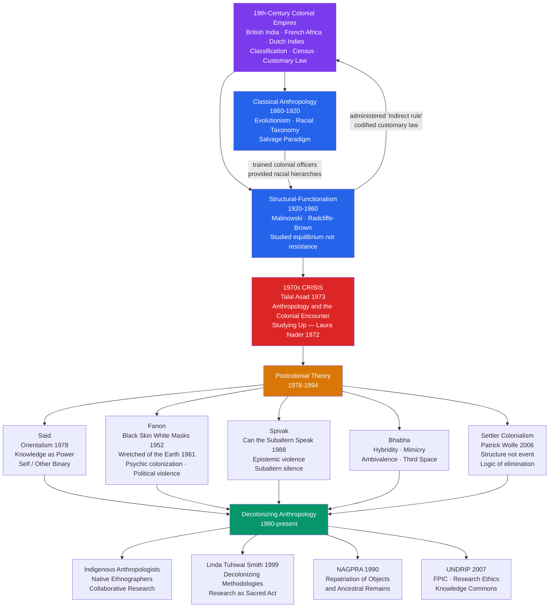

# Colonialism and Postcolonial Anthropology

> [!abstract] TL;DR
> Anthropology was born inside colonial empires and spent its first century producing knowledge that legitimized their administration of non-Western peoples; postcolonial theory — Said, Fanon, Spivak, Bhabha — exposed how that knowledge worked as a form of power, and the ongoing project of decolonizing anthropology asks practitioners to dismantle the discipline's inherited hierarchies of knowing, funding, and subject-making.

---

## Intuition

**Analogy:** Imagine a cartography company hired by a real-estate conglomerate to survey and map a territory it intends to develop. The cartographers are not soldiers — they carry notebooks, not rifles — but the maps they draw determine which land can be titled, which communities count as "settled" versus "nomadic," and which resources are classified as unowned. The cartographers believe they are producing neutral, scientific records. But the choice of what counts as a landmark, what counts as "empty land," and whose place names appear on the final map is never neutral — those choices were made by the conglomerate's interests before the first surveyor left the office.

Anthropology was that cartography company. From roughly 1860 to 1960, it produced the knowledge that colonial administrations used to classify populations, predict resistance, administer customary law, and adjudicate land claims. The Boasian shift to cultural relativism and intensive fieldwork improved the maps enormously, but it did not change who commissioned them or what they were used for. Postcolonial theory asks: what happens when the people on the map gain access to the map-making equipment and ask who authorized the survey in the first place?

---

## How It Works



---

## Key Concepts

### Secondary Level

**What is colonialism, and why does it matter for anthropology?**

Colonialism is the practice by which one society — usually through military conquest and administrative control — subordinates and governs another, extracting labor, land, and resources while imposing its own institutions, laws, and cultural norms. The European colonial empires of the 18th and 19th centuries were unprecedented in their global reach: at its height, the British Empire governed roughly a quarter of the world's land surface.

Anthropology matters in this history for an uncomfortable reason: the discipline was not merely *adjacent* to colonialism — it was partly *constitutive* of it. Colonial administrators needed to know the populations they governed: their kinship systems (to understand inheritance disputes), their ritual calendars (to time taxation appropriately), their political hierarchies (to identify "chiefs" who could sign treaties), and their "psychology" (to predict resistance). Anthropologists provided this knowledge. In India, Africa, and the Pacific, government anthropologists and anthropologist-turned-administrators used fieldwork methods to produce reports that directly informed governance.

This does not mean every anthropologist was a cynical propagandist. Many genuinely believed they were advocating for the peoples they studied, protecting them from the worst excesses of missionaries and commercial interests. The problem is structural: the knowledge they produced was filtered through the categories and priorities of a system whose fundamental premise — that some peoples were not yet ready for self-governance — they did not systematically challenge.

**Core vocabulary:**

| Term | Definition |
|------|-----------|
| **Colonial encounter** | The sustained, asymmetric contact between colonizing and colonized societies that reorganizes politics, economy, culture, and knowledge |
| **Salvage paradigm** | The 19th- and early 20th-century assumption that non-Western cultures were disappearing and must be documented before they vanished — treating them as objects of study rather than as living communities with futures |
| **Racial taxonomy** | The colonial project of classifying humanity into ranked biological "races," used to legitimate differential political and legal status |
| **Native informant** | The colonial-era term for the local person whose knowledge the anthropologist extracted and translated for a metropolitan audience — a relation of epistemic inequality obscured by the language of collaboration |
| **Indirect rule** | The British colonial strategy of governing territories through nominally preserved local authorities — which required detailed anthropological knowledge of those authorities' legitimacy structures |
| **Orientalism** | Said's term for the Western academic discourse that constructed "the East" as exotic, static, and inferior — and in doing so helped justify its domination |
| **Postcolonial** | Designates the period after formal decolonization (roughly post-1945 through post-1975) — but postcolonial theorists insist the prefix "post" does not mean colonialism has ended, only that its forms have transformed |
| **Decolonizing** | The active project of identifying and dismantling colonial structures — in politics, economics, and knowledge production itself |
| **Hidden transcripts** | James C. Scott's concept: the critique of power that subordinate groups maintain in private spaces, while performing compliance in the public "official transcript" |
| **NAGPRA** | The Native American Graves Protection and Repatriation Act (1990): US legislation requiring federally funded institutions to return ancestral human remains and cultural objects to indigenous peoples |
| **UNDRIP** | The UN Declaration on the Rights of Indigenous Peoples (2007): establishes the right to Free, Prior, and Informed Consent (FPIC) for research or development affecting indigenous communities |

**The salvage paradigm in practice:** The dominant 19th-century assumption was that non-Western cultures were being destroyed by contact with industrial civilization and would soon disappear. This generated the "salvage ethnography" imperative: document these disappearing cultures now, before it is too late. The political logic of this framing was devastating. By treating non-Western cultures as doomed, it naturalized the destruction — as if colonialism were a natural phenomenon like a flood, rather than a policy choice. It also constituted indigenous peoples as inherently *past*: members of a world that was being replaced by modernity, not as contemporary actors with claims on the future. Margaret Mead's *Coming of Age in Samoa* (1928) operated within this paradigm; so did most of Boas's documentation work on Northwest Coast cultures.

---

### Undergraduate Level

#### Edward Said and Orientalism

Edward Said's *Orientalism* (1978) is the foundational text of postcolonial theory. Said, a Palestinian-American literary critic trained at Columbia, drew on Michel Foucault's concept of discourse — a system of knowledge-power that produces its objects rather than merely describing them — to analyze how Western scholarship constructed "the Orient."

**The central argument:** Orientalism is not merely a set of false stereotypes about the Islamic or Asian world. It is a *systematic* and *institutionalized* discourse — produced by scholars, artists, novelists, journalists, and colonial officials over two centuries — that constructed "the East" as a knowable, mappable, and governable object. The Orient that European scholars studied was not the actual, diverse, internally contested world of Arabic-, Persian-, Turkish-, and Urdu-speaking peoples. It was a European *projection* — a contrasting term defined by what Europe claimed not to be: rational, dynamic, self-governing, modern.

**The self/other binary:** Orientalism depends on a binary opposition in which every positive quality attributed to "the West" (rationality, progress, individualism, rule of law) implies its absence in "the East" (irrationality, stagnation, despotism, communal submission). This binary is not merely descriptive; it is *generative*: by defining the Orient as the West's inferior other, it produces the West's own self-understanding. Europe knows itself by what it projects onto its colonial object.

**Knowledge as power:** Said showed that Orientalist knowledge was not produced by disinterested scholars studying a neutral object. It was produced by scholars who had careers dependent on the existence of Orientalism as a discipline, who worked in institutions funded by colonial governments, who produced knowledge that was read by colonial administrators, and who rarely if ever questioned the right of European powers to govern the territories whose cultures they were "objectively" analyzing. The scholar who wrote the definitive grammar of Arabic facilitated the administration of Arab populations. The scholar who classified Indian castes provided the template for colonial census operations that froze and reified those categories. Knowledge and power were structurally entangled.

**Occidentalism as counter-concept:** Scholars have noted that the colonial encounter produced a mirror image: "Occidentalism" — non-Western constructions of "the West" as a unified, cold, materialist, and violent civilization. This counter-discourse has its own distortions and strategic functions. Ian Buruma and Avishai Margalit's *Occidentalism* (2004) traced how this image — the West as soulless machine — has been deployed by anti-democratic movements from 19th-century Japan to contemporary Islamism.

**Critiques of Said:** Said's argument has been criticized on several grounds:
- He applied his analysis primarily to British and French Orientalism, neglecting German, Russian, and American variants.
- He treated Orientalism as a monolithic discourse, underplaying internal disagreements among Orientalists, pro-Arab scholars, and anti-imperialist voices.
- He gave insufficient attention to the agency of colonized peoples in shaping colonial knowledge — native informants were not merely passive sources.
- He conflated knowledge production with political intent: many Orientalists genuinely opposed colonial policy.

These critiques are valid but do not undermine Said's core structural insight. The question is not whether individual Orientalists were good or bad people; it is whether the discursive formation they participated in had systematic political effects — and the evidence that it did is overwhelming.

---

#### Frantz Fanon: Psychic Colonization and Decolonization

Frantz Fanon (1925–1961) is the theorist of colonialism's *psychic* dimensions — and the theorist of its violent undoing. A psychiatrist from Martinique trained in France, he served as chief of the psychiatry department at a hospital in Algeria during the independence war.

**Black Skin, White Masks (1952):** Fanon's first book analyzed what he called the "Manichean" structure of colonial consciousness. The colonized person, in the French Caribbean context Fanon knew from childhood, is subjected to a double bind:

1. The colonized person is taught that civilization, intelligence, beauty, and humanity are expressed through French language, culture, and whiteness. To achieve full personhood — to be recognized as a human subject — they must adopt the colonizer's culture.
2. But no matter how completely they adopt the colonizer's culture, the colonial system's racial logic prevents full recognition. The colonial subject who speaks perfect French, holds a medical degree, and adopts all the habits of Parisian bourgeois life still encounters the child on the Metro who says "Look, a Black man!" — and the entire edifice of pretended assimilation collapses into the abjection of the racialized body.

Fanon called this the "lactification complex" — the impossible desire to become white — and analyzed its psychic consequences: self-hatred, ambivalence, the internalization of the colonizer's contempt. The colonized subject is caught between two worlds, fully at home in neither.

**The Wretched of the Earth (1961):** Written as Fanon was dying of leukemia, during the Algerian war, this text is both an analysis of colonialism's economic and political structure and a controversial defense of anticolonial violence. The argument proceeds through several interlocking claims:

1. **The Manichean geography of colonialism:** The colonial world is divided into two rigidly separated zones — the settler quarter (clean, lit, wealthy) and the native quarter (dark, dirty, degraded). This spatial division is not incidental but structural: it expresses and reproduces the colonial order.

2. **The native as less-than-human:** Colonial ideology does not merely claim that the native is inferior — it claims the native is not fully human. Fanon documents the language of colonial officials: the native is described with animal metaphors, their culture is described as primordial, savage, and incompatible with civilization. This dehumanization serves the practical purpose of making colonial violence thinkable.

3. **Violence as catharsis:** In the preface he invited Jean-Paul Sartre to write, and in his own analysis, Fanon argued that anticolonial violence is not merely tactically necessary but *psychically necessary*: it is the means by which the colonized person destroys the image of themselves as the colonizer's inferior, reconstituting themselves as an historical agent. "Violence is a cleansing force. It frees the native from his inferiority complex and from his despair and inaction; it makes him fearless and restores his self-respect." This argument has been widely criticized as romanticizing violence; defenders argue Fanon was describing the psychological dynamic he observed in Algerian revolutionaries, not prescribing violence as a universal solution.

4. **The pitfalls of national consciousness:** Fanon was prophetically clear that formal decolonization — the transfer of political power from European to native elites — would not automatically produce genuine liberation if the new national bourgeoisie simply stepped into the colonial economic structure. He described in detail how nationalist parties, once in power, would reproduce the colonial economy under native management, suppress internal class conflict beneath ethnic and regional appeals, and eventually produce the same authoritarianism they had overthrown. This analysis proved accurate for most postcolonial states.

---

#### Spivak and Bhabha: Subaltern Studies and Hybridity

**Gayatri Chakravorty Spivak — "Can the Subaltern Speak?" (1988):** Spivak, a Derridean literary theorist and translator of Derrida's *Of Grammatology*, posed one of the most debated questions in postcolonial theory: can the people colonialism most completely marginalized — the "subaltern," those without access to the institutions of knowledge production — speak in ways that can be heard within those same institutions?

*Epistemic violence:* Spivak's concept of epistemic violence refers not to physical harm but to the destruction of the intellectual frameworks — the cosmologies, medical systems, legal traditions, pedagogical practices — through which non-Western peoples had historically made sense of the world. Colonial education replaced these frameworks not through neutral substitution but through active denigration: the systematic instruction that one's inherited knowledge was superstition, one's history was pre-history, and one's language was inadequate for serious thought.

*The double bind of the subaltern:* Spivak focused her analysis on the widow immolation ritual (*sati*) in colonial India. The British colonial state outlawed *sati* on behalf of "the Indian woman" — positioning itself as her protector against indigenous patriarchy. Indian nationalist reformers also took positions on *sati*, positioning the practice as a degradation that independent India must transcend. In both cases, what was conspicuously absent was the voice of the subaltern woman herself. She could not speak in her own name within the colonial discourse: if she *opposed* the practice, British benevolent paternalism claimed her; if she *endorsed* it (or was represented as endorsing it), both colonial and nationalist discourse dismissed this as false consciousness. The subaltern cannot speak — not because she has no voice, but because no institutional position exists within the dominant discourse from which her speech could be heard as authoritative, rather than as evidence of her need to be spoken *for*.

**Homi Bhabha — Hybridity, Mimicry, and the Third Space:** Bhabha, working in the intersection of psychoanalysis and postcolonial theory, developed three concepts that transformed how anthropologists think about colonial cultural contact.

*Mimicry:* Colonial discourse demands that the colonized adopt European culture — but with a crucial ambivalence. A perfectly assimilated native would not demonstrate the colonial hierarchy; he would undermine it. The colonial demand is therefore always for something slightly off: the colonized person should be "almost the same, but not quite" — an imperfect imitation that confirms both the desirability of European culture and the incapacity of the native to fully achieve it. But Bhabha shows that mimicry is also threatening to colonial authority: the mimic who approximates the colonizer almost perfectly becomes *uncanny* — a disturbance in the colonial order that cannot be fully managed. The Indian civil servant who speaks better English than his British superior exposes the contingency of the latter's authority.

*Hybridity:* Colonial contact does not produce either pure cultural domination or pure cultural resistance — it produces hybrids: cultural forms that combine elements from both colonizer and colonized in unstable, creative, and politically complex ways. Latin American Catholicism that incorporates Aztec and Yoruba spiritual practices, African jazz that transforms European harmonic structures, postcolonial novels that use the English language to narrate experiences that English literary conventions cannot contain — all are instances of hybridity. Bhabha stresses that hybridity is not simply cultural mixture; it is a site of *struggle*, in which the meaning of the hybrid form is never settled.

*The Third Space:* The site of hybridity — what Bhabha calls the "Third Space of enunciation" — is not a stable cultural territory but an in-between space of translation and negotiation. It is where all cultural meaning is in fact produced: there is no pure, original culture that precedes colonial contact, only the ongoing negotiation of cultural forms in the encounter between differently positioned agents.

---

### Graduate Level

#### Settler Colonialism: Structure, Not Event

Patrick Wolfe's essay "Settler Colonialism and the Elimination of the Native" (2006) introduced a distinction that has become central to both anthropological and political theory: the difference between **extractive colonialism** and **settler colonialism**.

*Extractive colonialism* wants the colonized population's labor. The colonized people are economically necessary: they work the plantations, the mines, the plantations. Their culture and political autonomy are suppressed, but they remain — as labor. British India, French Algeria, and Belgian Congo were primarily extractive colonies.

*Settler colonialism* wants the land, not the labor. Settlers arrive in a territory and need to occupy it permanently. The indigenous population is therefore not needed — in fact, their continued existence as a community with recognized land rights is a structural obstacle. Settler colonialism's "logic of elimination" takes multiple forms: physical genocide, forced removal, cultural assimilation (the destruction of indigenous culture as a precondition for the native's absorption into the settler polity), and legal dispossession (the doctrine of *terra nullius* — the declaration that unenclosed land has no legal owner). The United States, Canada, Australia, New Zealand, and Israel-Palestine are settler colonial formations.

Wolfe's key insight — "settler colonialism is a structure, not an event" — means that settler colonialism does not end with the original conquest or removal. The structure continues as long as settlers occupy indigenous land without a valid treaty or renegotiated sovereign arrangement. This has significant implications for contemporary anthropological research: it means that the political context of fieldwork in North America, Australia, or Palestine is not simply "post-colonial" but *ongoing colonial*, regardless of formal independence status.

**The ongoing structure in practice:** Contemporary manifestations of settler colonialism's logic of elimination include:
- Policies of assimilation disguised as welfare: the removal of indigenous children from families to boarding schools (the US Indian boarding school system; Canada's residential schools, the last of which closed in 1996)
- Legal constructions of indigeneity that require cultural authenticity: native peoples must demonstrate "real" traditional culture to gain legal recognition of rights — but the destruction of that culture was the *product* of colonial policy
- Resource extraction on indigenous land: fracking, pipeline construction, and mining operations that proceed under the doctrine that national sovereignty supersedes indigenous territorial rights

---

#### Talal Asad and the 1970s Crisis of Conscience

Talal Asad's edited volume *Anthropology and the Colonial Encounter* (1973) is the primary document of the discipline's reckoning with its own history. Asad's introduction argued that the "political and intellectual relationship between anthropology and colonialism" was not incidental — it was structural. The discipline had developed its methods, its institutional infrastructure (university chairs, funding bodies, journals), and its theoretical categories in the context of, and largely in service of, European colonial power. This did not mean that all anthropological work was propaganda, but it did mean that even critical or sympathetic ethnography operated within an epistemological framework that took colonial hierarchy for granted.

**Laura Nader's "Studying Up" (1972):** Written in the same period, Nader's essay proposed a correction to anthropology's systematic focus on powerless populations — peasants, tribal peoples, colonized communities. She argued that if anthropology was to contribute to understanding the production and maintenance of power, it needed to turn its methods toward the powerful: government agencies, corporations, military institutions, law firms. "Studying up" meant ethnographizing the institutions that controlled the populations anthropology had traditionally studied.

**The problem of the native informant revisited:** Who has the right to speak *about* a culture? Who has the right to speak *for* it? In the colonial tradition, the anthropologist (European, male, credentialed) was the authorized speaker, and the native informant was a source whose knowledge was extracted, processed, and translated for metropolitan audiences. The native informant was never the author. The challenge to this arrangement came from multiple directions: indigenous anthropologists who demanded the right to study and theorize their own communities on their own terms; feminist anthropologists who challenged the male gaze embedded in classic ethnography; and, more recently, collaborative ethnographers who restructure fieldwork so that community members co-author the resulting texts.

---

#### Decolonizing Methodologies: Linda Tuhiwai Smith

Linda Tuhiwai Smith's *Decolonizing Methodologies: Research and Indigenous Peoples* (1999) is the most widely cited text in the decolonizing anthropology/research ethics literature. A Maori scholar, Smith begins from the observation that the word "research" itself carries negative connotations in many indigenous communities: it is associated with the extractive, disrespectful, and instrumentalizing practices of colonial knowledge production. "It's the most obscene word," she quotes a Maori elder as saying.

Smith's project is to reclaim research as a practice that can serve indigenous communities rather than exploit them. She distinguishes between:

- **Research *on* indigenous peoples**: the colonial model, in which indigenous people are objects of study and the benefits (publications, careers, policy influence) accrue to outsiders
- **Research *for* indigenous peoples**: improved model, in which research serves indigenous needs, but the methodology and framing remain external
- **Research *by and with* indigenous peoples**: the decolonized model, in which indigenous epistemologies, methodologies, and community priorities determine what questions are asked, how they are investigated, and what counts as valid knowledge

Smith identifies 25 indigenous research projects — healing, decolonizing, voicing, reframing, and so on — as alternatives to the colonial research agenda. This framework has become the foundation for research ethics guidelines issued by bodies ranging from the American Anthropological Association to New Zealand's Health Research Council.

**NAGPRA and the politics of repatriation:** The Native American Graves Protection and Repatriation Act (1990) requires US federally funded museums and universities to inventory their collections of Native American human remains and sacred objects, consult with lineal descendants and culturally affiliated tribes, and repatriate upon request. NAGPRA represents a significant structural shift: for the first time, indigenous communities' cultural knowledge of their own objects — their understanding of what a given mask or burial bundle *is* and why it cannot simply be a "specimen" — was given legal standing against the claims of institutional ownership. The law has been imperfectly implemented, and many institutions have been slow to comply, but the principle it establishes — that indigenous communities have a property right in the products of their own cultural history — marks a genuine rupture with the salvage paradigm.

---

#### Postcolonial States and Colonial Legacies

The formal end of colonialism (from India's independence in 1947 through the collapse of Portuguese African empire in 1975) left a specific set of structural problems that anthropologists, political scientists, and development economists have spent the subsequent decades analyzing.

**The border problem:** European colonial powers carved Africa and the Middle East into administrative units that bore little relation to existing linguistic, ethnic, kinship, or political communities. The borders of Nigeria, for example, were drawn to include the Hausa-Fulani, Yoruba, and Igbo communities — which had no prior political unity and whose post-independence tensions eventually produced a civil war (Biafra, 1967-1970). The same dynamic played out across sub-Saharan Africa and in the Middle East (the Sykes-Picot agreement of 1916, which partitioned the former Ottoman territories). When these administrative units became postcolonial states, they inherited borders that represented European convenience, not indigenous political geography.

**The language problem:** Colonial education produced national languages — French in Francophone Africa, English in Anglophone Africa, Portuguese in Lusophone Africa — that were simultaneously the languages of elite cosmopolitan connection and the markers of colonial subordination. To reject the colonial language was to surrender access to government, higher education, and international commerce; to adopt it was to reproduce colonial cultural hierarchies internally. Most postcolonial states chose pragmatic continuation of colonial languages as official languages of state, while investing rhetorically in indigenous language preservation — with mixed results.

**Codified customary law:** Colonial administrators, needing to govern large territories efficiently, worked with anthropologists to codify local customary law — land tenure, inheritance, marriage, dispute resolution — into fixed legal codes. The problem was that "custom" in practice is dynamic, contested, and contextual: communities argue about it, adapt it, and use it strategically. When colonial administrators codified it, they froze one moment of an ongoing argument, privileged the interpretations of whoever had authority at that moment (often men, often chiefly lineages), and made this frozen version legally binding. Postcolonial communities found themselves governed by a custom that had been invented — partially by colonial administrators and their anthropologist advisors — in the process of being recorded.

**Bio-piracy and indigenous knowledge systems:** The intersection of ethnobotany, pharmaceutical development, and intellectual property law has produced a specific postcolonial conflict: the extraction of indigenous knowledge about plant-based medicines, agricultural varieties, and ecological practices for commercial profit, without consent or compensation to the communities whose multigenerational knowledge produced it. The *neem* controversy (a US patent on traditional Indian uses of the neem tree, later overturned), the *turmeric* patent controversy, and controversies over the commercial development of indigenous crop varieties (quinoa, açaí) all exemplify this dynamic. UNDRIP's Free, Prior, and Informed Consent requirement attempts to create a legal framework for preventing bio-piracy, but enforcement remains weak.

---

## Python Demo

```python
"""
Cultural Practice Trajectories Under Colonial Contact
Simulates 50 cultural practices across 120 timesteps under three
colonial pressure regimes: low / medium / high.

Each practice can be:
  0 = Publicly maintained   (open cultural reproduction)
  1 = Hidden transcript     (private maintenance, public compliance — Scott 1990)
  2 = Hybridised            (syncretised with colonial culture)
  3 = Lost                  (assimilated or eliminated)

State 3 is absorbing (irreversible within the simulation).
"""

import numpy as np
import matplotlib.pyplot as plt

# ── fixed random seed for reproducibility ───────────────────────────────────
BASE_SEED = 42
N = 50          # number of distinct cultural practices
T = 120         # timesteps (think: decades or administrative generations)

# Each practice has three intrinsic properties drawn once at startup
_rng_init = np.random.default_rng(BASE_SEED)
suppression_target = _rng_init.uniform(0.1, 1.0, N)  # how hard colonisers try to eliminate it
voluntary_appeal   = _rng_init.uniform(0.0, 0.6, N)  # attractiveness of colonial alternative
hideable           = _rng_init.uniform(0.2, 1.0, N)  # can it survive as hidden transcript?

SCENARIOS = {
    "Low pressure\n(advisory contact)":         0.20,
    "Medium pressure\n(colonial admin.)":        0.55,
    "High pressure\n(forced assimilation)":      0.90,
}

COLOURS = {
    "public":  "#2ecc71",   # green  — publicly maintained
    "hidden":  "#3498db",   # blue   — hidden transcript
    "hybrid":  "#f39c12",   # amber  — hybridised / syncretised
    "lost":    "#e74c3c",   # red    — lost
}
LABELS = {
    "public":  "Publicly maintained",
    "hidden":  "Hidden transcript (Scott)",
    "hybrid":  "Hybridised / syncretised",
    "lost":    "Lost (assimilated or eliminated)",
}


def run_simulation(pressure: float, seed_offset: int = 0) -> dict:
    """
    Run one colonial pressure scenario.

    Returns dict with keys 'public', 'hidden', 'hybrid', 'lost',
    each a length-T array of practice counts.
    """
    rng = np.random.default_rng(BASE_SEED + seed_offset + 1)
    states = np.zeros(N, dtype=np.int8)   # all practices start as publicly maintained

    history = {k: np.empty(T, dtype=np.int32) for k in ("public", "hidden", "hybrid", "lost")}

    for t in range(T):
        r    = rng.random(N)    # primary uniform draw per practice
        r2   = rng.random(N)    # secondary draw (for tie-breaking transitions)
        new  = states.copy()

        # ── PUBLIC (0): may be suppressed or voluntarily hybridised ──────────
        pub = states == 0
        p_force    = pressure * suppression_target          # forced suppression probability
        p_voluntary = pressure * voluntary_appeal * 0.40   # voluntary hybridisation probability

        forced     = pub & (r < p_force)
        voluntary  = pub & ~forced & (r < p_force + p_voluntary)

        # Forced: if hideable enough -> hidden transcript, else lost
        new[forced & (r2 <  hideable)] = 1   # hidden transcript
        new[forced & (r2 >= hideable)] = 3   # lost

        # Voluntary shift -> hybridised
        new[voluntary] = 2

        # ── HIDDEN (1): risk of discovery or resurfacing ─────────────────────
        hid = states == 1
        p_discover  = pressure * suppression_target * 0.22   # risk of discovery
        p_resurface = (1.0 - pressure) * 0.045               # re-emerge as hybrid (relaxed control)

        discovered = hid & (r < p_discover)
        resurfaced = hid & ~discovered & (r < p_discover + p_resurface)

        new[discovered] = 3   # discovered and eliminated
        new[resurfaced] = 2   # resurfaces as hybrid form

        # ── HYBRID (2): slow erosion ─────────────────────────────────────────
        hyb = states == 2
        p_erode = pressure * 0.012   # hybridised forms still gradually lost under high pressure
        eroded  = hyb & (r < p_erode)
        new[eroded] = 3

        # ── LOST (3): absorbing state ────────────────────────────────────────
        new[states == 3] = 3

        states = new
        history["public"][t]  = int(np.sum(states == 0))
        history["hidden"][t]  = int(np.sum(states == 1))
        history["hybrid"][t]  = int(np.sum(states == 2))
        history["lost"][t]    = int(np.sum(states == 3))

    return history


# ── run all three scenarios ──────────────────────────────────────────────────
results = {
    label: run_simulation(pressure, seed_offset=idx)
    for idx, (label, pressure) in enumerate(SCENARIOS.items())
}

# ── plot ─────────────────────────────────────────────────────────────────────
fig, axes = plt.subplots(1, 3, figsize=(15, 5), sharey=True)
fig.suptitle(
    "Cultural Practice Trajectories Under Colonial Contact\n"
    "(n=50 practices · Hidden Transcript model after Scott 1990 · "
    "Hybridisation after Bhabha 1994)",
    fontsize=11, y=1.01
)

time = np.arange(T)

for ax, (scenario, hist) in zip(axes, results.items()):
    order = ("public", "hidden", "hybrid", "lost")
    ax.stackplot(
        time,
        [hist[k] for k in order],
        labels=[LABELS[k] for k in order],
        colors=[COLOURS[k] for k in order],
        alpha=0.88,
    )
    ax.set_title(scenario, fontsize=9.5)
    ax.set_xlabel("Time (steps)", fontsize=9)
    ax.set_xlim(0, T - 1)
    ax.set_ylim(0, N)
    ax.set_yticks(range(0, N + 1, 10))
    ax.grid(axis="y", linestyle="--", alpha=0.3)

axes[0].set_ylabel(f"Number of cultural practices (total = {N})", fontsize=9)

# shared legend below all panels
handles, lbls = axes[0].get_legend_handles_labels()
fig.legend(
    handles, lbls,
    loc="lower center", ncol=4, fontsize=9,
    frameon=True, bbox_to_anchor=(0.5, -0.10)
)

plt.tight_layout()
plt.savefig("colonial_culture_dynamics.png", dpi=150, bbox_inches="tight")
plt.show()

# ── print terminal summary ────────────────────────────────────────────────────
print(f"\n{'Scenario':<40}  {'Public':>7}  {'Hidden':>7}  {'Hybrid':>7}  {'Lost':>7}")
print("-" * 72)
for label, hist in results.items():
    label_flat = label.replace("\n", " ")
    print(
        f"{label_flat:<40}  "
        f"{hist['public'][-1]:>7}  "
        f"{hist['hidden'][-1]:>7}  "
        f"{hist['hybrid'][-1]:>7}  "
        f"{hist['lost'][-1]:>7}"
    )
```

**What the simulation shows:**
- **Low pressure**: most practices remain public; a few hybridise voluntarily; almost none are lost. The hidden transcript is barely needed.
- **Medium pressure**: a growing band of blue (hidden transcripts) appears as suppression forces practices underground; hybridisation accumulates; losses begin.
- **High pressure**: the hidden transcript layer briefly swells, then collapses as discovery risk outpaces hideability; the red (Lost) band dominates by mid-simulation. A residual hybrid zone survives — reflecting the difficulty of eliminating all cultural traces even under maximum pressure.

This maps onto historical dynamics: even the most intensive assimilation programs (Canadian residential schools, the Australian Stolen Generations) failed to eliminate indigenous cultural practices entirely, because some practices — oral narrative, kinship categories, spiritual knowledge — are transmitted in ways that resist institutional suppression.

---

## Real-World Applications

> **Benin Bronzes repatriation:** The Benin Bronzes — approximately 3,000 brass and ivory objects taken by British soldiers during the punitive expedition of 1897 — have been distributed across Western museum collections for over a century. Between 2021 and 2023, major institutions including the Smithsonian, the Cambridge Museum of Archaeology and Anthropology, and the German federal government began repatriation negotiations and transfers to Nigeria and the newly established Edo Museum of West African Art. The debate around the Bronzes encapsulates every dimension of postcolonial anthropology: the colonial origins of museum collections, the question of universal cultural heritage versus communal ownership, the politics of knowledge about "African art" as a category, and the difficulty of negotiating repatriation when the "source community" is now a modern nation-state rather than the Kingdom of Benin that produced the objects.

> **The Canadian Truth and Reconciliation Commission (2008–2015):** Mandated to document and acknowledge the harm caused by the Indian residential school system, the TRC produced 94 Calls to Action that explicitly draw on settler colonialism theory. Call to Action 65 calls for funding for a national research program on residential school impacts. Calls 62–65 address education and require all Canadians to learn about indigenous histories and rights. The TRC process itself was modeled on the collaborative, community-centered methodology that decolonizing anthropology advocates.

> **FPIC in practice — Amazon basin:** The Inter-American Court of Human Rights' *Saramaka v. Suriname* ruling (2007) established that governments must obtain Free, Prior, and Informed Consent from indigenous communities before authorizing resource extraction projects on their territories. In the Amazon, this has produced a contested landscape: the principle is recognized in international law, but individual states (Brazil under successive administrations, Peru, Colombia) have frequently proceeded with oil, gas, and mining concessions without genuine FPIC processes. The Brazilian indigenous rights organization FUNAI and the work of ethnobotanists and anthropologists documenting indigenous land use have been central to legal challenges brought by Kayapo, Munduruku, and Yanomami peoples.

> **Ethnobotany and bio-piracy — the Hoodia case:** The San people of Southern Africa have known for centuries that the *Hoodia gordonii* cactus suppresses appetite — useful for long hunting expeditions. In 1995 the South African Council for Scientific and Industrial Research (CSIR) patented an active compound in Hoodia. The pharmaceutical company Unilever licensed the patent. The San, alerted to this, filed a benefit-sharing claim through the South African San Council. After years of negotiation, in 2003 the CSIR and the San signed a benefit-sharing agreement — the first such agreement between an African government research institution and an indigenous community. It established a precedent but also revealed how much of the infrastructure of intellectual property law was designed for corporate actors, not indigenous knowledge holders.

---

## Common Pitfalls

- **Mistaking formal decolonization for structural decolonization** — the transfer of sovereignty to a postcolonial elite does not eliminate colonial economic structures, colonial borders, or colonial epistemological hierarchies. The error of treating 1947/1960/1975 as the end of the colonial story is endemic to both liberal and Marxist accounts.

- **Treating "the subaltern" as a homogeneous victim** — postcolonial subjects are internally differentiated by gender, class, caste, region, and generation. Spivak's subaltern woman is not the same as a male anticolonial nationalist; the rural landless laborer is not the same as the postcolonial urban professional. Conflating them reproduces the very abstracting move that colonial discourse made.

- **Using postcolonial theory as a purely literary exercise** — Said, Bhabha, and Spivak all trained in literary criticism and wrote primarily about textual representation. When anthropologists apply their frameworks without grounding them in ethnographic specificity — actual practices, actual institutions, actual political economies — the analysis floats free of material reality.

- **The "native authenticity" trap** — assuming that to decolonize knowledge is to recover a pure, pre-colonial indigenous epistemology. No such thing exists: all cultures have been historical, internally contested, and in contact with others. The demand for authenticity reproduces the colonial logic of the salvage paradigm and can be weaponized to deny indigenous communities the right to adapt and change.

- **Collaborative ethnography without genuine power transfer** — declaring a project "collaborative" while maintaining the anthropologist's control over research design, data, publication rights, and audience is a performance of decolonization rather than its substance. True collaboration requires renegotiating who sets the research agenda, who owns the data, and who has veto power over publication.

- **Ignoring settler colonialism's ongoing structure** — framing indigenous land rights as historical grievances to be managed through occasional apologies or cultural recognition programs, rather than as ongoing structural issues requiring substantive political and economic redistribution.

- **Uncritically importing Western research ethics frameworks** — IRB (Institutional Review Board) protocols were designed primarily to protect individual human subjects from physical harm in medical research. They are poorly designed to address collective harms to communities from cultural research, the extraction of knowledge systems for commercial benefit, or the long-term political consequences of academic representation.

---

## Related Concepts

- [[Classical_Anthropological_Theory]] — anthropology's founding schools (evolutionism, historical particularism) were produced in the colonial context; Boas's critique of racial science and his documentation work both illustrate the discipline's entanglement with empire.

- [[Ethnographic_Methods_and_Fieldwork]] — the ethics debates in postcolonial anthropology directly transformed fieldwork practice: FPIC, collaborative authorship, reflexivity, and decolonizing methodology all operate at the level of the ethnographic encounter.

- [[Structuralism_and_Symbolic_Anthropology]] — Lévi-Strauss's structuralism reproduced the self/other binary in its analytic vocabulary; Geertz's thick description, while methodologically progressive, was criticized by postcolonial anthropologists for its textualism and its elision of colonial context.

- [[Functionalism_and_Structural_Functionalism]] — Malinowski and Radcliffe-Brown's structural-functionalism was the dominant framework during the height of British colonialism; its focus on social equilibrium rather than change or resistance made it ideologically compliant with colonial administration.

- [[Race_Ethnicity_and_Racism]] — racial taxonomy was one of anthropology's primary colonial products; physical anthropology's craniometry and typology provided the scientific vocabulary of racial hierarchy; Boas's refutation of scientific racism was one of the discipline's most important contributions.

- [[Globalization_and_Social_Change]] — postcolonial states operate within a global economic system that reproduces many colonial dependencies; the debate between world-systems theory and postcolonial theory concerns whether economic structure or cultural discourse is primary in maintaining these inequalities.

- [[International_Relations_Theories]] — postcolonialism is now a recognized school within IR theory, arguing that the Westphalian state system was itself a colonial product and that IR theory's Eurocentrism systematically distorts analysis of the global south.

- [[Global_Inequality_and_Development]] — colonial legacies (resource extraction, dependent industrialization, structural adjustment programs) are central to explaining why postcolonial states systematically underperform; this is the economic dimension of the postcolonial condition.

- [[Nationalism_Ethnicity_and_Collective_Identity]] — anticolonial nationalism and postcolonial state formation are primary arenas for understanding how colonial identity categories (ethnic, racial, regional) were internalized and transformed into postcolonial political claims.

- [[Conflict_Theory_and_Critical_Theory]] — postcolonial theory shares with Frankfurt School critical theory the commitment to exposing how apparently neutral knowledge production serves the interests of domination; Fanon's debt to Sartrean existentialism and Hegel's master-slave dialectic places him in this tradition.

- [[Human_Rights_and_International_Law]] — UNDRIP, FPIC, and the conventions of the ILO on indigenous peoples represent the partial institutionalization of postcolonial theory's critique in international legal frameworks; their enforcement gaps reveal the limits of that institutionalization.

- [[Culture_Symbols_and_Meaning]] — cultural production under colonial and postcolonial conditions — hybridity, syncretism, cultural nationalism, postcolonial literature — is the concrete arena in which the abstract dynamics of Bhabha's theory play out.

- [[_MOC_Applied_and_Global_Anthropology|↑ Applied and Global Anthropology MOC]]

---

## Review Questions

### Secondary

1. Why did colonial administrations find anthropological knowledge useful, and what does this tell us about the relationship between knowledge and power?
2. What does the "salvage paradigm" assume about non-Western cultures, and what political effects did this assumption have?
3. In your own words, explain why Said argues that Orientalism is not just a set of false stereotypes but a form of power.

### Undergraduate

1. Fanon argues in *The Wretched of the Earth* that formal independence (the transfer of political sovereignty) does not guarantee genuine decolonization. What structural conditions does he say must change, and how has his prediction fared when assessed against postcolonial African states?
2. Compare Spivak's concept of "epistemic violence" with Said's concept of Orientalism. Both analyze how Western knowledge production harms colonized peoples — but in what ways does Spivak's analysis go further or differ in emphasis?
3. Patrick Wolfe distinguishes settler colonialism from extractive colonialism using the concept of "the logic of elimination." Apply this distinction to two contemporary cases and explain what it implies for how each society should reckon with its colonial past.

### Graduate

1. The "decolonizing anthropology" movement calls for radical transformation of research methodology, authorship, and institutional practice. Critics argue that much of what passes for decolonizing methodology is performative rather than substantive, and that it risks reproducing a romantic essentialism about indigenous cultures. Assess this critique: what would genuinely structural decolonization of anthropological knowledge production require, and what institutional obstacles stand in its way?
2. Homi Bhabha's concepts of hybridity and mimicry have been criticized for being politically evasive — celebrating cultural mixing while providing no account of how to challenge colonial power structures. Conversely, they have been defended as capturing something Fanon's voluntarist account of revolutionary violence misses. Compare Bhabha's and Fanon's theories of colonial subjectivity and colonial resistance: which provides a more adequate account of how colonized peoples navigate colonial power, and what does each theory miss?
3. The category of "indigenous peoples" is both a product of colonial classification and a site of contemporary political mobilization. Using UNDRIP, NAGPRA, and the Benin Bronzes controversy as cases, analyze the tensions between: (a) treating indigenous peoples as rights-bearing communities with inalienable claims to cultural heritage and territorial sovereignty; and (b) postcolonial theory's critique of fixed cultural identity as itself a colonial construction.

---

## Sources

- [Said, Edward W. *Orientalism*. Pantheon Books, 1978.](https://en.wikipedia.org/wiki/Orientalism_(Said))
- [Fanon, Frantz. *The Wretched of the Earth*. Presence Africaine, 1961.](https://en.wikipedia.org/wiki/The_Wretched_of_the_Earth)
- [Spivak, Gayatri Chakravorty. "Can the Subaltern Speak?" in *Marxism and the Interpretation of Culture*, 1988.](https://en.wikipedia.org/wiki/Can_the_Subaltern_Speak%3F)
- [Bhabha, Homi K. *The Location of Culture*. Routledge, 1994.](https://en.wikipedia.org/wiki/The_Location_of_Culture)
- [Wolfe, Patrick. "Settler colonialism and the elimination of the native." *Journal of Genocide Research* 8(4), 2006.](https://doi.org/10.1080/14623520601056240)
- [Asad, Talal (ed.). *Anthropology and the Colonial Encounter*. Ithaca Press, 1973.](https://www.worldcat.org/title/anthropology-and-the-colonial-encounter)
- [Smith, Linda Tuhiwai. *Decolonizing Methodologies: Research and Indigenous Peoples*. Zed Books, 1999.](https://en.wikipedia.org/wiki/Decolonizing_Methodologies)
- [Scott, James C. *Domination and the Arts of Resistance: Hidden Transcripts*. Yale University Press, 1990.](https://en.wikipedia.org/wiki/Domination_and_the_Arts_of_Resistance)
- [Nader, Laura. "Up the Anthropologist — Perspectives Gained from Studying Up." in *Reinventing Anthropology*, 1972.](https://www.worldcat.org/title/reinventing-anthropology)

---

#Anthropology #AppliedGlobalAnthropology #Colonialism #Postcolonial
