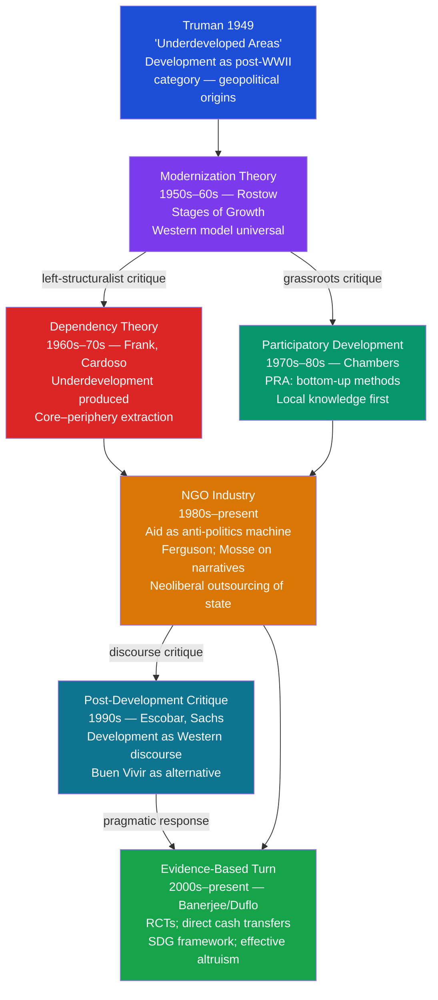

> [!abstract] TL;DR
> Development anthropology examines international aid and development as both a practice to be improved and a discourse to be interrogated — revealing how post-WWII "development" invented poverty as a global problem, how aid organizations construct their own success while depoliticizing structural inequality, and why participation, post-development critique, and direct cash transfers each represent distinct responses to the failure of top-down technical fixes.

---

## Intuition

**Analogy:** A parent who does their child's homework for them every evening keeps the child fed and comfortable but ensures the child never learns to work independently. When the parent eventually withdraws (retirement, illness, death), the child is more helpless than when the parent started helping. A different parent sits beside the child, guides the thinking, points to the tools, then hands over responsibility progressively — stepping back as competence grows. The child's short-term performance may look worse, but ten years later the difference is decisive.

International development aid replicates this choice at the scale of nations and institutions. Budgetary aid that simply flows into government accounts covers immediate needs while eroding the tax-collection bureaucracy and the fiscal bargain between state and citizen that historically built capable states. Capacity-building aid that conditions resources on institutional reform and phases out as local revenue grows produces a different long-run trajectory. The parent's dilemma — and its collective-action version — is what development anthropologists have spent sixty years trying to diagnose and escape.

---

## How It Works



---

## Key Concepts

### Secondary Level

**Development as a Post-War Invention**

Before 1949, the word "development" had no systematic technical meaning in international affairs. President Harry Truman's inaugural address on 20 January 1949 changed that:

> "We must embark on a bold new program for making the benefits of our scientific advances and industrial progress available for the improvement and growth of underdeveloped areas."

Three things happened in a single sentence. First, a new category — "underdeveloped areas" — was introduced, implicitly defining two-thirds of humanity by what they *lacked*. Second, the solution was pre-specified: scientific and industrial progress modeled on the United States. Third, the process was framed as humanitarian rather than geopolitical, concealing the Cold War context in which communist revolutionary alternatives were the immediate threat.

Arturo Escobar's *Encountering Development* (1995) argued that this was not merely rhetoric. Development became a *discourse* in the Foucauldian sense — a system of knowledge-production that defined the problems, specified the solutions, created the institutions (World Bank, IMF, USAID, bilateral aid agencies), trained the experts, and reproduced itself by continuously finding new "underdevelopment" to address. The discourse was self-reinforcing: it defined poverty as the absence of what Western countries had, then supplied the experts and resources to provide exactly that, regardless of whether it helped.

**Rostow's Stages of Growth (1960) and Modernization Theory**

Walt Rostow's *The Stages of Economic Growth* (1960) — explicitly subtitled "A Non-Communist Manifesto" — provided the intellectual architecture of 1950s–60s development policy:

| Stage | Description | Policy implication |
|-------|-------------|-------------------|
| 1. Traditional society | Pre-Newtonian technology; hierarchical social structure | Identify and release from tradition |
| 2. Preconditions for takeoff | Rise of a modernizing elite; savings start to rise | Identify reformist elites; institution-building |
| 3. Takeoff | Decisive growth; investment rises above 10% of GNP | Capital transfer; infrastructure investment |
| 4. Drive to maturity | Technology diffuses across the economy | Technical assistance; industrialization |
| 5. Age of high mass consumption | Mature industrialism | Trade liberalization |

The model implied that every society traverses the same path at different speeds. Underdevelopment was simply being earlier on the same road that Europe and North America had traveled. The anthropological objection was immediate: this is social evolution repackaged — the same teleological hierarchy that 19th-century anthropologists had used to rank "primitive" and "civilized" societies, now dressed in economic language. It erased actual historical difference, colonial history, and the structural mechanisms by which some societies' development had been premised on others' exploitation.

**Anthropology of Development vs Development Anthropology**

The discipline is internally divided by a tension between two orientations, formalized by Norman Long and others:

| Orientation | Question | Role | Mode |
|-------------|----------|------|------|
| **Anthropology of development** | What is development? How does it work as a system of power? | Critical analyst | Academic, deconstructive |
| **Development anthropology** | How can anthropological knowledge improve development outcomes? | Applied practitioner | Consultancy, project design |

The anthropology of development (Escobar, Ferguson, Mosse) interrogates the development apparatus itself — its assumptions, its effects, its political functions. It is primarily a critical and theoretical enterprise. Development anthropology works *within* the apparatus — conducting rapid ethnographic assessments, designing culturally sensitive interventions, monitoring project effects, advising NGOs and multilateral agencies. The two orientations are frequently in tension: critical analysis can make applied work seem naive, while applied imperatives can make critique seem self-indulgent.

**Participatory Rural Appraisal (PRA)**

Robert Chambers' work in the 1980s and 1990s produced the most influential methodological reform in applied development practice. Chambers observed that development projects routinely failed because:
1. Outsider experts arrived with solutions already designed
2. Local knowledge about soils, water, seasonal variation, and social dynamics was ignored
3. Poor people were treated as objects of development rather than subjects with agency

His **Participatory Rural Appraisal (PRA)** toolkit — derived from earlier rapid rural appraisal methods and indigenous knowledge traditions — re-centered the process:

- *Community mapping*: local people draw their own maps of land, resources, infrastructure — the map itself becomes an analytical tool and advocacy document
- *Seasonal calendars*: communities diagram seasonal patterns of food availability, income, labor demand, disease — revealing vulnerability cycles invisible to annual surveys
- *Wealth ranking*: community members rank households by local criteria of wellbeing (not external income measures), producing a locally validated picture of differentiation
- *Transect walks*: researchers walk through the community landscape with local guides, observing and discussing what they see across ecological zones

The political philosophy behind PRA was radical: the poor are the experts on their own poverty; the outsider's role is to facilitate their own analysis and planning. Chambers' slogan — "put the last first" — reversed the standard flow of knowledge from expert to beneficiary.

---

### Undergraduate Level

**Arturo Escobar and Post-Development**

Escobar's *Encountering Development* (1995) is the foundational text of post-development anthropology. Drawing on Foucault's archaeology of knowledge, Escobar argued that development is not a failed attempt to solve a pre-existing problem (poverty) but rather the production of poverty as a problem requiring expert management. The process works in three moves:

1. **Problematization**: defining the Global South as "poor," "underdeveloped," "lacking" — a definition that simultaneously renders its populations as objects of intervention and establishes Western industrial capitalism as the universal norm
2. **Professionalization**: creating a field of experts (economists, public health specialists, agricultural scientists, social workers) with authority to diagnose and treat underdevelopment — displacing local knowledge and local political processes
3. **Institutionalization**: building the apparatus (World Bank, IMF, USAID, bilateral agencies, international NGOs) that perpetuates itself by continuously generating new instances of the problem it claims to solve

The post-development position is not that material poverty is acceptable but that *development discourse* — with its implicit cultural hierarchy, its expert authority, its displacement of political with technical solutions — makes genuine transformation less likely by obscuring the political and structural roots of inequality.

**Buen Vivir (Sumak Kawsay)**

The Quechua concept *sumak kawsay* — translated as "good living" or "living well" — emerged from Andean indigenous movements in Ecuador and Bolivia as an alternative to development's growth imperative. Incorporated into the Ecuadorian Constitution of 2008 and the Bolivian Constitution of 2009, *buen vivir* proposes:

- Well-being defined by relational harmony (with community, ancestors, future generations, and non-human nature) rather than material accumulation
- Rights of *Pacha Mama* (Mother Earth) as a constitutional subject — not just an environmental resource to be managed
- Sufficiency rather than growth as the metric of the good society

Post-development theorists embraced *buen vivir* as evidence that non-Western societies offer genuine alternatives rather than merely pre-modern stages to be overcome. The critique of *buen vivir* as a policy framework is that it can romanticize pre-colonial conditions, obscure internal stratification within indigenous communities, and — in the Ecuadorian case — coexist with extractivist mining and oil policies that undermine the ecological harmony it claims to value.

**James Ferguson and the Anti-Politics Machine**

Ferguson's *The Anti-Politics Machine* (1990) is one of the most cited books in development anthropology. It is a detailed ethnographic study of a World Bank rural development project in Lesotho (the "Thaba-Tseka Project," 1975–1984) that spent millions of dollars and produced essentially nothing by its own measures.

Ferguson's analytical move is not to explain the project's *failure* but to ask what it *did* accomplish despite failing. His two-part argument:

*The misrepresentation*: Development agencies described Lesotho as a traditional, subsistence-farming, isolated, self-contained peasant economy — none of which was accurate. Lesotho's economy had been deeply integrated into South African capitalism since the late 19th century; the majority of male household income came from migrant labor in South African mines. The fiction of the isolated subsistence economy was *necessary* for development intervention — it created a tractable technical problem (modernize the agriculture) and obscured the actual political-economic structure (South African apartheid capitalism, migrant labor dependency) that produced poverty.

*The anti-politics machine*: Any intervention designed within this fictional framework would be unable to address the real problem. More importantly, framing poverty as a technical agricultural problem *depoliticized* it — it deflected attention from apartheid, land dispossession, and labor exploitation, converting political questions into administrative ones. The development apparatus thus functioned, regardless of intent, as a political instrument: it extended the reach of the Lesotho state's bureaucracy (the unintended effect) while making the political roots of poverty invisible (the ideological effect).

**David Mosse and the Sociology of Development Projects**

Mosse's *Cultivating Development* (2005) is a reflexive ethnography of a British-funded rural development project in India (KRIBP, 1992–2001) in which Mosse himself worked as an anthropologist-consultant. His argument advances Ferguson's:

Development projects do not succeed or fail based on whether they produce intended outcomes. They succeed or fail based on whether they maintain a *coherent interpretation* — a "policy narrative" that all stakeholders (donors, government, project staff, NGOs, intended beneficiaries) can invest in. The primary work of development organizations is not implementing interventions but constructing and maintaining success stories.

This produces what Mosse calls "project ethnography": documents, baseline surveys, workshops, field visits, evaluation reports — all are performative activities that produce evidence for the success narrative, not transparent windows onto reality. When an evaluation "discovers" that a project has succeeded, what it has discovered is that the project has successfully reproduced the narrative that justifies it. Mosse's book caused controversy because it named the specific project and organization (Indo-British Rainfed Farming Project / ODA/DFID), breaching the professional norm that anthropologists embedded in aid work do not publish critical ethnographies of their employers.

**The NGO Industry and NGOization**

The number of international NGOs grew from roughly 1,000 in 1960 to over 40,000 by the 2000s. This proliferation — "NGOization" — was driven by:

1. **Neoliberal restructuring**: structural adjustment programs required developing-country governments to cut public services; international NGOs moved in to fill the gap, creating a permanently outsourced welfare system with no democratic accountability
2. **New public management**: bilateral donors preferred contracting with NGOs over direct government-to-government transfers, believing NGOs were more efficient and less corrupt — an assumption weakly supported by evidence
3. **Professionalization**: NGO work became a career path in the Global North, with its own reward structures, publication outlets, and professional culture oriented more toward donor reporting than community outcomes

Development anthropologists observe that NGOization fragments service provision, competes with rather than strengthens local state capacity, creates a parallel economy of project-cycle employment that distorts local labor markets, and — by constituting communities as "beneficiary populations" — may reproduce the paternalism and knowledge-hierarchy it formally opposes.

---

### Graduate Level

**James Scott: High Modernism, Metis, and Seeing Like a State**

Scott's *Seeing Like a State* (1998) provides the deepest theoretical account of why top-down development fails, drawing on an extraordinary range of historical cases: Soviet collectivization, Tanzanian *ujamaa* villages, Brasilia, modern scientific forestry, high-yield monoculture agriculture.

The argument has two components:

*High modernism*: An ideology of technical confidence — the belief that scientific expertise and rational planning can redesign social and natural systems from scratch to maximize legibility, efficiency, and productivity. High modernism is not limited to states: it operates in colonial agricultural extension services, World Bank project design, and the urban planning that demolished mixed-use neighborhoods to build tower blocks.

*The destruction of metis*: Scott distinguishes *techne* (formal, codifiable, context-independent technical knowledge) from *metis* (practical, local, embodied knowledge developed through experience in particular conditions). A soil scientist's knowledge is techne; a farmer's knowledge of how this specific field, with this specific slope, clay content, and seasonal water-table, responds to different crops in different years is metis. High-modernist projects destroy metis — clearing the complex, locally-adapted landscape so that standardized, scientifically managed systems can be installed. The result is that the local capacity to improvise and respond to specific conditions is lost, while the standardized system breaks down in exactly the conditions that local practice had learned to navigate.

The development implication: failures of African rural development projects, Soviet collectivization, and Green Revolution extension work share a structural pattern. The homogenizing, top-down, expert-designed intervention systematically destroys the diversity of local practice it supersedes — and cannot replace what it destroys.

**Microfinance: Revolution, Critique, and the Evidence**

The microfinance movement began with Muhammad Yunus's founding of Grameen Bank in Bangladesh in 1983, for which Yunus received the Nobel Peace Prize in 2006. The premise: poor people, especially women, cannot access formal credit because they lack collateral; small loans at commercial rates, delivered through peer-group liability mechanisms, can enable microenterprise and lift households out of poverty.

By 2010, microfinance institutions (MFIs) had an estimated 200 million borrowers worldwide. The anthropological and economic critiques that followed were substantial:

*Debt trap*: Over-indebtedness became a documented crisis in Andhra Pradesh (India, 2010), Bosnia, Morocco, and Nicaragua. MFIs competing for clients pushed households into multiple loans, creating debt traps. Over 200 suicides in Andhra Pradesh were linked to MFI pressure tactics, prompting a state government moratorium.

*Targeting women without addressing patriarchy*: Many MFIs specifically targeted women borrowers as more reliable. Lamia Karim's *Microfinance and Its Discontents* (2011) documented how this worked in Bangladesh: women were selected as borrowers precisely because their social networks and bodies were subject to familial and community control that could be used for loan enforcement. Credit flowed to women on paper; control of the capital frequently remained with male household members. The appearance of women's empowerment concealed the commodification of gender inequality.

*The RCT evidence*: A series of randomized controlled trials coordinated through J-PAL (the Abdul Latif Jameel Poverty Action Lab) in India, Bosnia, Morocco, Ethiopia, Mongolia, and Mexico produced a consistent finding: microfinance increased access to credit and enabled some asset accumulation, but produced *no* significant average effects on income, consumption, education, or women's empowerment. Banerjee et al.'s (2015) meta-analysis of six RCTs concluded that microfinance is "not a miracle" — not harmful at the margins, but not transformative either.

*Direct cash transfers*: The evidence that has most disrupted both microfinance enthusiasm and NGO-delivered programs is the growing body of RCT evidence on direct, unconditional cash transfers. GiveDirectly (an NGO operating in Kenya, Uganda, Rwanda, and Malawi) delivers large, unconditional cash transfers to extremely poor households, enabled by mobile money platforms (M-Pesa). A 12-year study by Egger et al. (2022) found substantial, persistent effects on consumption, assets, food security, and psychological well-being — with positive spillovers to non-recipient households. Cash transfer programs outperform most in-kind and technical assistance alternatives on cost-effectiveness metrics, and have the additional anthropological virtue of respecting recipients' knowledge of their own needs rather than substituting expert judgment.

**Humanitarianism, Refugee Camps, and the Politics of Emergency**

Humanitarian aid — emergency response to conflict, famine, and disaster — is a distinct sector from development aid, with its own organizations (UNHCR, WFP, ICRC, MSF), principles (humanity, neutrality, impartiality, independence), and anthropological critiques.

*Médecins Sans Frontières (MSF) and the politics of neutrality*: MSF's founding in 1971, by doctors who broke from the ICRC after witnessing the Biafra famine, was premised on a rejection of silence as the price of access. *Témoignage* (witnessing) — publicly naming the political actors responsible for humanitarian crises — was built into the MSF mandate. The tension between access (requiring negotiated neutrality with all parties) and témoignage (requiring public condemnation of atrocity) is unresolvable and structurally productive: it generates the organization's ongoing internal debate about when to speak and when to treat.

*Refugee camps as states of exception*: Giorgio Agamben's *Homo Sacer* (1998) introduced the concept of the "state of exception" — a space of sovereign power in which normal legal protections are suspended, and bare biological life is all that remains. Anthropologists (Liisa Malkki, Michel Agier) applied this framework to UNHCR refugee camps: the camp is a humanitarian space that simultaneously protects and suspends — refugees receive food, medical care, and physical security while being denied the rights of citizens (movement, work, political participation, legal personality). The "temporary" camp becomes permanent; Kakuma (Kenya) has been continuously inhabited since 1992. The humanitarian architecture that saves lives also freezes its beneficiaries in a permanent state of exception — subjects of care rather than of rights.

*Do no harm and aid in conflict zones*: Mary Anderson's *Do No Harm* (1999) framework formalized the observation that humanitarian aid in conflict zones routinely worsens the conflicts it aims to relieve — by distorting local economies, providing logistical infrastructure that armed groups exploit, concentrating population and resources in ways that attract predatory violence, or simply legitimizing warring parties by negotiating with them. "Do no harm" analysis became mandatory in conflict-affected programming — but the structural problems Anderson identified remain unresolved in every major humanitarian crisis from Darfur to Syria to South Sudan.

**Sustainable Development and the SDG Critique**

The UN Sustainable Development Goals (SDGs), adopted in 2015, represent the current institutional synthesis of development ambition: 17 goals, 169 targets, covering poverty, hunger, health, education, gender equality, water, energy, economic growth, industrialization, inequality, cities, consumption, climate, oceans, ecosystems, peace, and global partnership.

The post-development and political ecology critique of the SDGs:

*The oxymoron problem*: "Sustainable development" combines two concepts that may be structurally incompatible. Development (as conceived in the SDGs) requires continued economic growth — measured by GDP — in the Global South. Growth requires increasing material and energy throughput. The planetary boundaries framework (Rockstrom et al., 2009) identifies nine Earth-system processes (climate, biodiversity, nitrogen cycle, etc.) with quantitative boundaries beyond which the conditions for human civilization are threatened. Several boundaries are already exceeded. "Sustainable" growth may be physically impossible.

*Green economy vs degrowth*: The "green economy" response (UNEP, World Bank) argues that technological decoupling — growing GDP while reducing material and energy intensity — can resolve the tension. Degrowth theorists (Serge Latouche, Jason Hickel) argue that sufficient decoupling has never been demonstrated at the required scale and rate, and that the solution is to redesign economic life around sufficiency, redistribution, and post-GDP metrics of well-being rather than continuing to grow a system that cannot be sustained while its growth continues.

The SDG framework responds to the post-development critique by incorporating well-being metrics, indigenous rights language, and participatory monitoring — but its fundamental logic (the Global South must "develop" along a growth trajectory) remains continuous with the modernization theory it formally replaced.

---

## Python Demo

```python
# Aid architecture and path dependence:
# Two scenarios for how external aid shapes institutional development.
#
# Scenario A (Aid Trap): aid is constant; government reduces tax effort
#   as aid covers the budget gap; institutional quality atrophies; when
#   aid ends abruptly, the state cannot collect taxes — governance collapse.
#
# Scenario B (Capacity-Building): aid peaks early, conditions on institutional
#   reform, and phases out as domestic revenue grows; tax capacity is
#   self-sustaining after aid withdrawal.
#
# Demonstrates the path-dependence created by aid architecture choices.

import numpy as np
import matplotlib.pyplot as plt

rng = np.random.default_rng(42)
YEARS     = 60
AID_PEAK  = 80.0   # peak aid level (arbitrary budget units)
AID_CUT   = 40     # year when aid is cut (Trap) / phase-out complete (CapBuild)
TAX_INIT  = 45.0   # initial domestic tax revenue
INSTIT_0  = 0.50   # initial institutional quality  (0 = collapsed, 1 = strong)

t = np.arange(YEARS)

# ════════════════════════════════════════════════════════════════════════════
# SCENARIO A — AID TRAP
# Aid is constant for years 0–39, then cut to zero (year 40).
# Each year, government reduces tax collection effort proportional to
# the fraction of the budget covered by aid.  Institutional quality
# (tax bureaucracy, public finance capacity, rule of law) degrades when
# the discipline of tax collection is not exercised.
# At year 40, aid ends — but tax and institutional capacity have atrophied.
# ════════════════════════════════════════════════════════════════════════════
trap_aid    = np.where(t < AID_CUT, AID_PEAK, 0.0)
trap_tax    = np.zeros(YEARS);  trap_tax[0]    = TAX_INIT
trap_instit = np.zeros(YEARS);  trap_instit[0] = INSTIT_0

for i in range(1, YEARS):
    budget       = trap_tax[i-1] + trap_aid[i] + 1e-3
    aid_share    = trap_aid[i] / budget                    # fraction covered by aid
    effort_decay = 0.028 * aid_share                       # tax effort erodes
    trap_tax[i]    = max(trap_tax[i-1] * (1.0 - effort_decay), 3.0)
    instit_decay   = 0.018 * aid_share                     # institutions atrophy
    trap_instit[i] = max(trap_instit[i-1] * (1.0 - instit_decay), 0.04)

trap_total    = trap_tax + trap_aid
trap_aid_shr  = trap_aid / (trap_total + 1e-3)

# ════════════════════════════════════════════════════════════════════════════
# SCENARIO B — CAPACITY-BUILDING AID
# Aid peaks early, then linearly phases out over 40 years while investing
# in institutional reform (tax authority training, fiscal cadastres,
# auditing systems, public financial management).
# Institutional quality improves; tax revenue grows as a result.
# After phase-out, domestic revenue is self-sustaining.
# ════════════════════════════════════════════════════════════════════════════
cap_aid    = np.maximum(0.0, AID_PEAK * (1.0 - t / AID_CUT))
cap_tax    = np.zeros(YEARS);  cap_tax[0]    = TAX_INIT
cap_instit = np.zeros(YEARS);  cap_instit[0] = INSTIT_0

for i in range(1, YEARS):
    instit_gain    = (cap_aid[i] / AID_PEAK) * 0.022 + 0.004   # aided + organic growth
    cap_instit[i]  = min(cap_instit[i-1] + instit_gain, 0.95)
    cap_tax[i]     = min(cap_tax[i-1] * (1.0 + 0.022 * cap_instit[i]), 280.0)

cap_total   = cap_tax + cap_aid
cap_aid_shr = cap_aid / (cap_total + 1e-3)

# ════════════════════════════════════════════════════════════════════════════
# PLOT
# ════════════════════════════════════════════════════════════════════════════
TRAP = '#dc2626'   # red  — aid trap
CAP  = '#2563eb'   # blue — capacity-building
GRAY = '#6b7280'

fig, axes = plt.subplots(2, 2, figsize=(14, 10))
fig.suptitle(
    "Aid Architecture and Path-Dependence\n"
    "Aid Trap (red) vs Capacity-Building (blue)",
    fontsize=13, fontweight='bold'
)

# Panel 1 — Total budget
ax = axes[0, 0]
ax.stackplot(t, trap_tax,  trap_aid,
             labels=['Own revenue (tax)', 'Aid inflows'],
             colors=[TRAP, '#fca5a5'], alpha=0.7)
ax.plot(t, trap_total, color=TRAP, lw=1.5, ls='--')
ax.axvline(AID_CUT, color=GRAY, ls=':', lw=1.8, label=f'Year {AID_CUT}: aid cut')
ax.set_title('Aid Trap — Budget Composition')
ax.set_xlabel('Year');  ax.set_ylabel('Revenue (index)')
ax.legend(fontsize=8);  ax.grid(alpha=0.3)

ax = axes[0, 1]
ax.stackplot(t, cap_tax, cap_aid,
             labels=['Own revenue (tax)', 'Aid inflows'],
             colors=[CAP, '#93c5fd'], alpha=0.7)
ax.plot(t, cap_total, color=CAP, lw=1.5, ls='--')
ax.axvline(AID_CUT, color=GRAY, ls=':', lw=1.8, label=f'Year {AID_CUT}: aid phase-out done')
ax.set_title('Capacity-Building — Budget Composition')
ax.set_xlabel('Year');  ax.set_ylabel('Revenue (index)')
ax.legend(fontsize=8);  ax.grid(alpha=0.3)

# Panel 2 — Institutional quality
ax = axes[1, 0]
ax.plot(t, trap_instit, color=TRAP, lw=2.5, label='Aid Trap — institutional quality')
ax.plot(t, cap_instit,  color=CAP,  lw=2.5, label='Capacity-Build — institutional quality')
ax.axvline(AID_CUT, color=GRAY, ls=':', lw=1.8)
ax.fill_between(t, trap_instit, cap_instit, where=(cap_instit > trap_instit),
                alpha=0.12, color=CAP, label='Capacity gap')
ax.set_title('Institutional Quality Over Time\n(tax bureaucracy, PFM capacity, rule of law)')
ax.set_xlabel('Year');  ax.set_ylabel('Quality Index (0 = collapsed, 1 = functional)')
ax.set_ylim(0, 1)
ax.legend(fontsize=8);  ax.grid(alpha=0.3)

# Panel 3 — Own-source revenue comparison
ax = axes[1, 1]
ax.plot(t, trap_tax, color=TRAP, lw=2.5, label='Aid Trap — own-source revenue')
ax.plot(t, cap_tax,  color=CAP,  lw=2.5, label='Capacity-Build — own-source revenue')
ax.axvline(AID_CUT, color=GRAY, ls=':', lw=1.8, label=f'Year {AID_CUT}: aid architecture change')
ax.set_title('Domestic Tax Revenue Over Time\n(aid withdrawal effect diverges sharply post-Y40)')
ax.set_xlabel('Year');  ax.set_ylabel('Tax Revenue (index)')
ax.legend(fontsize=8);  ax.grid(alpha=0.3)

plt.tight_layout()
plt.savefig('aid_trap_simulation.png', dpi=150, bbox_inches='tight')
plt.show()

# Summary output
print("=== Summary at year 39 (last aid year) and year 50 (10yr post-cut) ===")
print(f"\n  Aid Trap:")
print(f"    Year 39 — own revenue: {trap_tax[39]:.1f}, institutional quality: {trap_instit[39]:.3f}")
print(f"    Year 50 — own revenue: {trap_tax[50]:.1f}, institutional quality: {trap_instit[50]:.3f}")
print(f"\n  Capacity-Building:")
print(f"    Year 39 — own revenue: {cap_tax[39]:.1f}, institutional quality: {cap_instit[39]:.3f}")
print(f"    Year 50 — own revenue: {cap_tax[50]:.1f}, institutional quality: {cap_instit[50]:.3f}")
```

**What the simulation shows:** In the aid trap, total budget appears healthy for 40 years but is increasingly aid-financed; own-source revenue drifts down; institutional quality atrophies. When aid is cut, the state is unable to compensate — revenue collapses to near the floor and institutional quality is at its lowest point. In the capacity-building trajectory, aid phases out gradually while own revenue grows; institutional quality improves continuously. By year 50, the two trajectories have diverged decisively — not because of different intentions, but because of different *aid architectures* and the path-dependence they create.

---

## Real-World Applications

> **Ferguson's Lesotho (1975–1984 — the Anti-Politics Machine in Practice):** The Thaba-Tseka Integrated Rural Development Project was a World Bank-funded effort to modernize Lesotho's subsistence agriculture by introducing improved seeds, livestock management, and market integration. It was declared a failure in 1984 and wound up. Ferguson's analysis showed that the project had accurately diagnosed the problem it invented (isolated subsistence farming) rather than the problem that existed (labor migration dependency on South African mines). The one concrete effect was extending the reach of the Lesotho bureaucracy into the Thaba-Tseka highlands — expanding the state's administrative apparatus while producing no agricultural improvement. The case remains the paradigm for how development projects depoliticize structural problems by converting them into technical-agricultural ones.

> **Grameen Bank and the Microfinance RCTs:** Grameen Bank's peer-group lending model was replicated across Asia, Africa, Latin America, and South Asia — reaching an estimated 200 million borrowers by the 2010s. The 2015 J-PAL meta-analysis of six randomized controlled trials conducted across three continents found: access to microfinance increased; business investment and assets modestly increased; *no* significant effects on income, consumption, education, women's decision-making power, or psychological well-being. The model produced financial inclusion, not poverty escape. The most damning evidence was from Andhra Pradesh (2010), where over-indebtedness and aggressive collection tactics by competing MFIs were linked to over 200 suicides, prompting the Andhra Pradesh government to pass an emergency ordinance placing MFIs under strict state regulation.

> **GiveDirectly and Direct Cash Transfers:** GiveDirectly has transferred over $500 million directly to extremely poor households in Kenya, Uganda, Rwanda, and Malawi since 2009, enabled by M-Pesa mobile payment infrastructure. The Egger et al. (2022) study of a GiveDirectly campaign in Kenya — 653 villages, $1,000 per household, 12-year follow-up — found: household consumption 40% higher than control; assets 100% higher; food security significantly improved; positive general-equilibrium spillovers to non-recipient households in treated villages (local market stimulus). The program's cost-effectiveness exceeds most in-kind aid programs. The anthropological implication is significant: direct cash transfers operationalize the post-development principle that recipients are the experts on their own needs, while also producing the quantitative evidence that the evidence-based aid community requires.

---

## Common Pitfalls

- **Conflating the two orientations** — "Anthropology of development" (critical analysis of development as a system) and "development anthropology" (applied work within development practice) are distinct projects with different methods, audiences, and norms of evidence. Treating critical anthropological analysis of an NGO as equivalent to design advice for an NGO programme confuses what kind of claim is being made. Each orientation can be done well or badly, but they are not substitutes for each other.

- **Reading post-development as nihilism** — Escobar, Ferguson, and Mosse are often dismissed as "just critiquing without offering alternatives." This misreads them. Ferguson is explicit that exposing the anti-politics function of development is not the same as arguing against all aid. Mosse does not argue that development organizations should not exist. The post-development position is that unreflective confidence in top-down expert design is what produces the anti-politics effect — not that material transfers are always harmful. Buen Vivir is explicitly an affirmative alternative, not just a negation.

- **Assuming participatory development always works** — PRA and participatory methods have been institutionalized by the very organizations whose power they were designed to challenge. When the World Bank requires "community participation" as a procedural box to tick, it produces what Andrea Cornwall calls "participatory tyranny" — communities are invited to validate decisions already made by project designers, while bearing the appearance of agency. Participation can reproduce rather than challenge power relations if the structural context (who funds, who designs, who controls exit options) is not addressed.

- **Ignoring the political economy of evaluation** — Development projects commission their own evaluations, which are conducted by consultants whose careers depend on positive relationships with the organizations they assess. Mosse's finding that development organizations primarily manage success narratives rather than produce outcomes implies that most evaluation evidence in the development literature is endogenous to the narrative-management process. RCTs conducted by independent researchers (J-PAL, IPA) are a partial corrective but cannot address questions about political effects, cultural transformation, or the long-run institutional consequences that are most important from an anthropological perspective.

- **Treating the SDGs as an endpoint** — The SDG framework represents a political compromise, not a social science consensus. Goals 8 (sustained economic growth) and 13 (climate action) are in direct tension — no mechanism within the SDG architecture resolves this. Development anthropologists who treat "achieving the SDGs" as a success condition for development work risk obscuring the structural incompatibility between continued growth-oriented development and the planetary boundaries that make it unsustainable.

- **Romanticizing traditional or indigenous alternatives** — Buen Vivir and similar alternative frameworks are genuine intellectual resources, but their deployment in development discourse can romanticize pre-colonial conditions, erase internal stratification and gender inequality within indigenous communities, and overlook the aspirations of the very people they are supposed to represent. Many rural communities in the Global South want the material improvements that development promises — electricity, clean water, medical care, educational access. Telling them that these aspirations are Western cultural imperialism is a particularly paternalistic form of anti-colonialism.

---

## Related Concepts

- [[Political_Anthropology_and_Power]] — Ferguson's anti-politics machine analysis draws directly on Foucauldian power/knowledge; the depoliticization of structural inequality through technical development interventions is a specific mechanism of the broader process by which power operates through the production of expert knowledge — governmentality applied to the Global South

- [[Ethnographic_Methods_and_Fieldwork]] — Both the anthropology of development and development anthropology are methodologically grounded in ethnographic fieldwork; Ferguson's Lesotho analysis and Mosse's India study are extended ethnographies; PRA participatory methods are themselves a methodological reform within applied fieldwork practice

- [[Classical_Anthropological_Theory]] — Escobar's post-development critique uses Foucault's discourse analysis; the anthropology of development is deeply indebted to Marxist political economy (Frank, Wallerstein, Wolf's *Europe and the People Without History*); the earlier tradition of applied anthropology (Malinowski's Practical Anthropology, 1929) anticipated the anthropology-development interface in the colonial period

- [[Culture_Symbols_and_Meaning]] — The concept of "development" as a culturally constructed category — not a natural problem but a historically specific representation of difference — is a cultural anthropological argument about how symbolic systems shape political possibilities; Escobar's post-development is fundamentally an argument about the cultural politics of representation

- [[Global_Inequality_and_Development]] — The sociological perspective on the same structural dynamics: world-systems theory, global commodity chains, North-South trade asymmetries, and the measurement debates around poverty and inequality that frame development's targets; provides the quantitative and structural-sociological complement to the anthropological discourse analysis

- [[Globalization_and_Social_Change]] — Development is one mechanism of globalization — the deliberate reorganization of production, consumption, governance, and knowledge in the Global South along lines determined by Global North institutions; the relationship between development and globalization is both complementary (both involve capital and knowledge flows from North to South) and contradictory (development promises inclusion; globalization produces new forms of exclusion)

- [[Development_Economics_and_Political_Development]] — The political science perspective on institutions, governance, and the politics of development: why some countries build effective states and others do not; the political economy of foreign aid; Acemoglu and Robinson on extractive vs inclusive institutions; the political science framework complements the anthropological discourse critique by attending to formal institutional mechanisms

- [[International_Institutions_and_Multilateralism]] — The World Bank, IMF, UNDP, and UNHCR are the primary institutional framework within which development and humanitarian aid operate; understanding how these organizations work — their governance structures, decision-making processes, and accountability deficits — is essential context for the anthropological critique of their programmatic outputs

- [[Development_Economics]] — The macroeconomic foundation: Solow growth model, human capital theory, endogenous growth, the Washington Consensus, and Sachs vs Easterly debate on the efficacy of aid; the economic literature on foreign aid and growth (Burnside and Dollar; Easterly; Collier) is in active dialogue with the anthropological evidence from ethnographic project studies

- [[Political_Sociology_and_Social_Power]] — Bourdieu's concept of symbolic violence applies to development practice: expert knowledge that defines the Global South as deficient reproduces the symbolic domination of the North even when genuinely trying to help; the sociological framework of power connects to the anthropological critique of development discourse

- [[_MOC_Applied_and_Global_Anthropology|↑ Applied and Global Anthropology MOC]]

---

## Review Questions

### Secondary

1. Truman's 1949 inaugural introduced the category "underdeveloped areas." What three things did this categorization do politically, and why did Escobar consider it the founding moment of a new discourse rather than just a description of an existing problem?
2. What is the difference between the "anthropology of development" and "development anthropology"? Give a concrete example of the kind of question each orientation would ask about the same aid project.
3. Robert Chambers argued that development projects failed because of who held the knowledge. What specific practices did Participatory Rural Appraisal introduce to change this, and what is the political philosophy behind "put the last first"?

### Undergraduate

1. Ferguson argued that the Thaba-Tseka project "succeeded" despite failing to achieve its stated goals. What was it doing if not improving agriculture? How does this analysis change what we should look for when evaluating development interventions?
2. Mosse argues that the primary work of development organizations is constructing and maintaining success narratives, not implementing outcomes. What evidence supports this claim, and what methodological problem does it create for evaluating development effectiveness? How do RCTs partially address this problem, and what do they miss?
3. The Andhra Pradesh microfinance crisis (2010) and the J-PAL RCT evidence both challenge the microfinance model, but in different ways. What does each challenge? How does Karim's ethnographic work add a third dimension that neither the crisis data nor the RCTs capture?

### Graduate

1. Scott's distinction between *techne* and *metis* is used to explain why high-modernist development projects destroy local adaptive capacity. How does this argument interact with the PRA tradition, which also valorizes local knowledge but operates *within* development institutions? Is there a structural tension between the politics of participation and the institutional imperatives of development organizations that makes genuine metis-recovery impossible in project form?
2. Agamben's "state of exception" has been applied to refugee camps to argue that humanitarian protection simultaneously suspends the political rights it claims to guarantee. Evaluate this application: where does it illuminate humanitarian architecture, and where does it overreach? What are the practical implications for humanitarian organizations that accept the state-of-exception analysis?
3. The SDG framework incorporates both Goal 8 (sustained, inclusive, sustainable economic growth) and Goal 13 (climate action). Using the planetary boundaries framework and the degrowth literature, construct the strongest possible argument that these goals are structurally incompatible. Then construct the strongest possible counter-argument from the green economy position. Which do you find more convincing, and why does the answer matter for development anthropology's normative agenda?

---

## Sources

- [Escobar, A. (1995). *Encountering Development: The Making and Unmaking of the Third World*. Princeton University Press.](https://press.princeton.edu/books/paperback/9780691150451/encountering-development)
- [Ferguson, J. (1990). *The Anti-Politics Machine: "Development," Depoliticization, and Bureaucratic Power in Lesotho*. Cambridge University Press.](https://www.cambridge.org/core/books/antipolitics-machine/0E7DA76706C37B8782CAE96D2EFAF2F2)
- [Mosse, D. (2005). *Cultivating Development: An Ethnography of Aid Policy and Practice*. Pluto Press.](https://www.plutobooks.com/9780745320434/cultivating-development/)
- [Scott, J.C. (1998). *Seeing Like a State: How Certain Schemes to Improve the Human Condition Have Failed*. Yale University Press.](https://yalebooks.yale.edu/book/9780300078152/seeing-like-a-state/)
- [Chambers, R. (1983). *Rural Development: Putting the Last First*. Longman.](https://www.worldcat.org/title/rural-development-putting-the-last-first/oclc/9693843)
- [Sachs, W. (Ed.). (1992). *The Development Dictionary: A Guide to Knowledge as Power*. Zed Books.](https://www.zedbooks.net/shop/book/the-development-dictionary/)
- [Rahnema, M. and Bawtree, V. (Eds.). (1997). *The Post-Development Reader*. Zed Books.](https://www.zedbooks.net/shop/book/the-post-development-reader/)
- [Rostow, W.W. (1960). *The Stages of Economic Growth: A Non-Communist Manifesto*. Cambridge University Press.](https://www.cambridge.org/core/books/stages-of-economic-growth/45D93BC6898B3A18C8DACB9B6A0C2E16)
- [Agamben, G. (1998). *Homo Sacer: Sovereign Power and Bare Life* (D. Heller-Roazen, trans.). Stanford University Press.](https://www.sup.org/books/title/?id=2003)
- [Banerjee, A., Duflo, E., Glennerster, R., and Kinnan, C. (2015). The miracle of microfinance? Evidence from a randomized evaluation. *American Economic Journal: Applied Economics*, 7(1), 22–53.](https://doi.org/10.1257/app.20130533)
- [Karim, L. (2011). *Microfinance and Its Discontents: Women in Debt in Bangladesh*. University of Minnesota Press.](https://www.upress.umn.edu/book-division/books/microfinance-and-its-discontents)
- [Egger, D., Haushofer, J., Miguel, E., Niehaus, P., and Walker, M.W. (2022). General equilibrium effects of cash transfers: experimental evidence from Kenya. *Econometrica*, 90(6), 2603–2643.](https://doi.org/10.3982/ECTA17945)
- [Anderson, M.B. (1999). *Do No Harm: How Aid Can Support Peace — or War*. Lynne Rienner Publishers.](https://www.rienner.com/title/Do_No_Harm_How_Aid_Can_Support_Peace_or_War)
- [Hickel, J. (2020). *Less Is More: How Degrowth Will Save the World*. Heinemann.](https://www.jasonhickel.org/less-is-more)
- [Malkki, L.H. (1995). *Purity and Exile: Violence, Memory, and National Cosmology among Hutu Refugees in Tanzania*. University of Chicago Press.](https://press.uchicago.edu/ucp/books/book/chicago/P/bo3618879.html)

---

#Anthropology #AppliedGlobalAnthropology #DevelopmentAnthropology #InternationalAid #PostDevelopment
