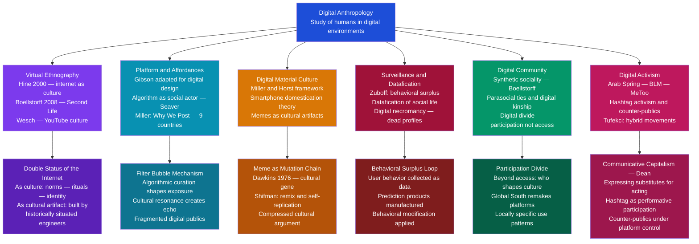

# Digital Anthropology

> [!abstract] TL;DR
> Digital anthropology is the study of humans in digital environments — treating online platforms, virtual worlds, and networked practices as legitimate field sites where real culture, community, and power are produced; its founding insight is that the virtual is not separate from the social but one more theater in which human social life has always been staged.

---

## Intuition

**Analogy:** In 2003, thousands of people began building houses, forming marriages, creating economies, burying their dead, and organizing political protests inside a 3D virtual world called Second Life. They built shrines and memorial gardens for friends who had died offline. They organized labor strikes against the platform's owner. They formed close friendships that lasted decades. When anthropologist Tom Boellstorff spent years doing fieldwork there, attending community meetings, mapping kinship networks, and interviewing residents, skeptics asked: "But is it *real*?" He answered as Malinowski would have: from the inside, it is entirely real. The grief at a virtual funeral is genuine grief. The community that forms around a shared space is a genuine community. The criteria for "real" social life are not proximity, embodiment, or face-to-face contact — they are meaning, relationship, and collective practice. Second Life had all three.

Digital anthropology is the discipline's recognition that wherever humans gather and create meaning — whether in a Polynesian village, a Mumbai slum, or a Discord server for fan fiction writers — anthropological methods and theories apply. The prefix "digital" marks the medium, not a diminishment of the humanity involved.

---

## How It Works



The six pillars map onto anthropology's core concerns: methodology (virtual ethnography), technology (platform affordances), material culture (digital objects and memes), power and political economy (surveillance capitalism), social organization (online community), and social change (digital activism). Each pillar inherits a lineage from classical anthropological theory while addressing phenomena that could not have existed before networked digital computing.

---

## Key Concepts

### Secondary Level

**Digital Dualism vs. Augmented Reality**

The default folk assumption about digital life is what Nathan Jurgenson (2011) called **digital dualism**: the belief that online and offline life are fundamentally separate realms, with the "real world" of embodied, face-to-face interaction being genuine and the "virtual world" being secondary, derivative, or lesser. Digital dualism is embedded in everyday language — "put down your phone and live in the real world" — and in much early academic writing about the internet.

Jurgenson's counter-argument: online and offline are not separate spheres but interpenetrating and mutually constitutive. A protest organized via WhatsApp is not a "digital" event that is separate from the "real" protest in the street; the digital organizing is part of the protest, inextricable from it. A relationship maintained through daily text messages is not a lesser relationship than one maintained face-to-face; it is a relationship of a specific kind, with specific affordances and constraints, and with genuine emotional stakes.

The better concept is **augmented reality** in the sociological sense: digital life augments, extends, and transforms offline life rather than replacing it. We live one social life that has digital and non-digital dimensions in permanent, complex, mutual interaction.

**Sherry Turkle: MUDs and Identity Experimentation**

Turkle's "Life on the Screen" (1995) was the first major anthropological-psychological account of identity in online environments. Her fieldwork was conducted in MUD (Multi-User Dungeon) communities — text-based virtual worlds where participants created and inhabited characters.

Key observations:
- MUD participants maintained multiple simultaneous online identities across different platforms — a practice Turkle described through a postmodern lens as "multiple selves"
- For many users, MUDs were spaces for *identity experimentation*: trying on gender identities, exploring emotional responses, rehearsing personality traits that felt unavailable offline
- Some users reported feeling "more themselves" online than offline — anonymity and symbolic distance allowed expression that social inhibition blocked in embodied contexts

Turkle remained ambivalent: she documented both the liberatory potential (a closeted gay teenager finding community; an abused person practicing assertiveness) and the risk (using online worlds to avoid the developmental challenges of offline life; mistaking virtual connection for genuine intimacy).

**Memes as Cultural Artifacts**

Richard Dawkins coined "meme" in "The Selfish Gene" (1976) as the cultural analog of the gene: a unit of cultural transmission that replicates through minds, mutating as it travels. Examples he gave: tunes, ideas, fashions, catch-phrases, ways of building arches.

Limor Shifman ("Memes in Digital Culture," 2014) adapted the concept for internet memes, noting key differences:
- Internet memes are consciously produced and remixed, not passively transmitted
- Their spread is not through passive copying but through active creative participation — each user adds their own twist to a template
- They function as compressed cultural arguments: to use a meme template is to invoke its cultural history, signal group membership, and make a claim within a specific cultural conversation

Anthropologically, memes are to digital culture what proverbs, songs, and ritual formulas are to oral cultures: portable, memorable, socially functional units of meaning that carry cultural knowledge and group identity across networks.

---

### Undergraduate Level

**Christine Hine: Virtual Ethnography and the Double Status of the Internet**

Hine's "Virtual Ethnography" (2000) established the methodological foundation for studying the internet anthropologically. Her central argument is that the internet has a **double status** that must be held in analytical tension throughout any ethnographic engagement:

| Status | Description | Methodological Implication |
|---|---|---|
| **Internet as culture** | Online spaces are sites where social practices, norms, identities, and communities develop on their own terms | Apply participant observation, attend to local meanings, rituals, and power structures |
| **Internet as cultural artifact** | The internet was produced by specific actors at specific historical moments, embedding cultural values in its architecture | Reflexively analyze how the technical substrate shapes what is possible, visible, and normative |

The researcher cannot simply "go online" and observe neutrally. Every methodological choice — which platform to study, how to establish presence, what constitutes a "community" — is simultaneously a technical and cultural decision. The field site in virtual ethnography is not a pre-given location but something the researcher constructs through reflexive methodological decisions.

**Tom Boellstorff: Coming of Age in Second Life (2008)**

Boellstorff conducted fieldwork *exclusively* in Second Life — he did not interview residents about their offline lives, did not try to "verify" identities, and did not treat Second Life as a reflection of something more real happening elsewhere. His methodological commitment: the avatar *is* the subject of study.

The book's theoretical core is **synthetic sociality**: the forms of community, connection, and meaning that emerge in virtual worlds are genuine social forms, not simulations of offline sociality. They have their own conventions and etiquette, their own spatial politics, their own economics and labor, their own mortuary practices, their own kinship formations. Boellstorff introduced **techné** — the craft, skill, and knowledge through which virtual worlds are produced and inhabited — as the cultural material of digital anthropology, analogous to the objects, rituals, and practices that constitute traditional material culture.

The methodological commitment carried a principled point: if an anthropologist studying a Balinese cockfight does not need to leave the cockfighting arena to verify what is "really" happening in the economy, then an anthropologist studying Second Life does not need to leave the platform to verify what is "really" happening in its residents' offline lives.

**Daniel Miller: "Why We Post" (2016)**

Miller led a nine-country comparative ethnography of social media use, coordinating simultaneous multi-year field studies across Brazil, Chile, China, England, India, Italy, Trinidad, Turkey, and industrial China. The project's most important finding: social media use is radically *locally specific*, not globally homogeneous.

| Country | Dominant Social Media Use Pattern |
|---|---|
| Trinidad | Facebook as family display — maintaining and performing kinship ties |
| Industrial China | QQ as aspirational self — projecting desired rather than actual identity |
| Turkey | Twitter as political resistance — oppositional expression under authoritarian pressure |
| England | Facebook actively avoided by youth — "parents' platform"; identity differentiation from elders |
| India | WhatsApp group messaging — caste, kinship, and religious community management |
| Brazil | Facebook as dense social maintenance — keeping up networks of friends and family |

The key theoretical move: platform **affordances** (what a platform technically allows) interact with pre-existing **cultural schemas** (how local people are already organized socially) to produce locally specific social media cultures. TikTok in the US and TikTok in Vietnam are the same platform with radically different social uses because the cultural schemas they articulate with are different. Silicon Valley's narrative that Facebook is "connecting the world" in a uniform way is empirically false.

**Affordances Theory for Digital Platforms**

J.J. Gibson's ecological affordances (1979) — the possibilities for action that an environment offers — was adapted for digital contexts. In digital anthropology, the key question is: what does this platform's design make *easy*, *common*, and *visible*, and what does it make *difficult*, *rare*, and *invisible*?

| Platform | Key Affordances | Cultural Effects |
|---|---|---|
| Instagram | Visual feed, follower/following asymmetry, Stories ephemerality | Aestheticization of life; influencer culture; aspirational self-presentation |
| TikTok | Algorithmic discovery, short video, infinite scroll | Strangers can go viral; attention economy maximized; trends are global before local |
| WhatsApp | Encrypted groups, no public feed, no algorithmic curation | Private community organization; direct organizing; misinformation in closed groups |
| Twitter/X | Public, text-based, hashtag system, quote-tweet structure | Political discourse, real-time news, hashtag activism, counter-publics |
| Reddit | Anonymous, community-sorted, subreddit organization, karma | Community-specific norms; pseudonymity enables taboo discussion; moderation as governance |

The algorithm is not merely a curation tool — it is a **social actor** (Seaver) that determines which voices are amplified and which are suppressed, which communities are recommended and which fade, which cultural forms are viable and which die for lack of reach.

---

### Graduate Level

**Nick Seaver: Algorithms as Culture**

Seaver's work on recommender systems represents the most rigorous application of anthropological theory to digital infrastructure. His intervention: algorithms are not black boxes to be reverse-engineered by technical analysis — they are **cultural objects** produced by culturally situated practitioners, embedded in specific institutional and business contexts, and continuously modified based on the behaviors they want to produce.

Seaver conducted ethnographic fieldwork among the engineers and product managers who build music recommender systems. Key findings:
- Engineers have rich, culturally specific folk theories of what users "are" and what they "want" — theories that are neither neutral nor universal, but which get encoded in systems used by billions of people globally
- The stated goal of recommender systems is user satisfaction; the operational goal is *engagement* — time on platform, clicking, returning — behaviors that maximize advertising revenue independently of user wellbeing
- Seaver's concept of the algorithm as a **trap**: a trap is an environment designed by an intelligent agent to manipulate another creature's natural behavior — you build it using knowledge of what the prey naturally does, then modify the environment to make that natural behavior serve the trapper's purposes. Recommender systems exploit detailed knowledge of human psychology (loss aversion, variable-ratio reward, social comparison) to manipulate those tendencies into platform-serving behavior

**Shoshana Zuboff: Surveillance Capitalism as Anthropological Object**

Zuboff's "The Age of Surveillance Capitalism" (2019) describes a new form of human social organization requiring anthropological analysis. The structural logic operates in three stages:

1. **Behavioral surplus extraction**: every user interaction generates behavioral data far exceeding what is needed to deliver the service. The surplus — patterns of hesitation, deletion, time-of-day behavior, what you typed and then deleted — is raw material extracted without user knowledge or compensation.
2. **Prediction product manufacture**: behavioral surplus is processed into actuarial predictions of individual and collective future behavior. These predictions are the actual commodity sold by platform capitalism — not content, not software, but *behavioral futures*.
3. **Behavioral modification feedback**: prediction products are sold to actors who want to modify future behavior (advertisers, political campaigns, insurance companies). The loop closes when the platform uses its own prediction capabilities to design environments that nudge users toward behaviors its customers are willing to pay for.

Different cultures have produced different *settlements* with this logic. In China, surveillance capitalism and state surveillance are deeply integrated — social credit systems extend behavioral modification to citizenship itself. In Europe, GDPR represents a contested cultural negotiation between individual data rights and platform business models. In the Global South, the cost of "free" services (WhatsApp, Facebook Free Basics) is denominated in data surrendered by users who have no realistic understanding of the exchange.

**Digital Necromancy and the Anthropology of Death Data**

Elaine Kasket ("All the Ghosts in the Machine," 2019) coined **digital necromancy** for practices through which the living interact with data traces of the dead — sending messages to dead Facebook accounts, curating Instagram profiles as memorials, using AI chatbots to simulate dead loved ones. Facebook estimates that by 2100, dead users will outnumber living ones on the platform, making it primarily a necropolis.

The anthropological stakes are significant: every culture produces practices for managing the boundary between living and dead — mortuary rituals, ancestor veneration, memorial practices, taboos on speaking the dead's name. These practices serve social functions: they manage grief, define the obligations of survivors, and regulate the conditions under which the dead may be invoked or contacted. Digital necromancy is the latest instantiation of this universal problem, but with novel features: the data is corporate property, not community property.

AI chatbots trained on dead people's messages — commercial services that offer to "continue" a deceased person's conversation patterns — raise questions that are simultaneously legal, philosophical, and anthropological: Who controls the dead self? Can a corporation own a person's social persona? What happens when cultural norms around ancestor veneration conflict with platform terms of service?

**Hashtag Activism, Counter-Publics, and Communicative Capitalism**

Three related concepts structure the anthropological analysis of digital political life:

**Counter-publics** (Fraser 1990): subaltern counter-publics are "parallel discursive arenas where members of subordinated social groups invent and circulate counter-discourses to formulate oppositional interpretations of their identities, interests, and needs." Digital platforms have created new counter-publics — #BlackLivesMatter, #MeToo, #ArabSpring, indigenous language revival movements on TikTok — that would not have been possible before networked communication reduced the cost of organizing at scale.

**Communicative capitalism** (Dean 2009): Jodi Dean argues that digital networks do not strengthen democratic participation — they simulate it. The proliferation of messages, tweets, posts, and hashtags creates the subjective experience of political participation while processing political speech as engagement data. The message circulates as a commodity; the speaker feels heard; institutional arrangements remain unchanged. Dean's concern: hashtag activism does not complement offline organizing — for many participants, it *substitutes* for it.

**Hybrid movements** (Tufekci 2017): empirical research on the Arab Spring, Occupy, and Black Lives Matter shows these were not "Twitter revolutions" or purely digital phenomena but hybrid movements that used digital tools for specific tactical functions — rapid mobilization, real-time coordination, narrative amplification — while remaining dependent on offline organizing, physical presence, and face-to-face trust for the sustained commitment that produces political change. Movements built primarily online (low coordination cost, high visibility) often lack the organizational capacity to sustain action when platforms suppress them, states crack down, or internal disagreements emerge.

**The Digital Divide as Anthropological Problem**

The standard "digital divide" framing focuses on access: who has a computer, who has broadband. Digital anthropology has pushed this in two directions:

- **Participation divide** (Jenkins): it is not enough to have access; meaningful participation requires the skills, social capital, and cultural literacy to navigate, produce, and influence platform culture — capacities unequally distributed by class, race, and nationality
- **Data divide** (Eubanks): the surveillance apparatus of digital capitalism operates asymmetrically. Its most intensive data extraction targets poor and marginalized communities (welfare algorithms, predictive policing, credit scoring) while its benefits flow to the affluent

The Global South does not simply adopt platforms designed for the Global North — it remakes them. In India, WhatsApp became the primary vehicle for religious propaganda and mob violence in ways its engineers did not design for. In Brazil, Orkut preceded Facebook as the dominant social network, with entirely different social practices. In Kenya, M-Pesa produced mobile financial services before most European banks offered comparable products. Digital life is plural, not a single global village.

---

## Python Demo

```python
# Cultural Contagion and Filter Bubbles in a Digital Social Network
#
# Models meme virality across a two-community network.
# Core insight: virality is NOT just a function of network connectivity
# (how many bridges exist between groups) but also of "cultural resonance"
# — how well a meme fits the existing cultural schemas of each community.
#
# Three scenarios illustrate key digital anthropology concepts:
#
#   1. Filter Bubble  (high resonance in A, low in B):
#      Meme saturates community A but barely crosses into B.
#      Even with structural bridges, cultural distance suppresses spread.
#      Example: politically partisan content, in-group humor, jargon-heavy discourse
#
#   2. Bridging Content (equal resonance in both):
#      Meme crosses community lines freely.
#      Example: cat videos, natural disasters, Olympic events, universal humor
#
#   3. Cross-Resonant  (low resonance in A, high in B):
#      Meme originates in A but resonates with B — slow start, then delayed
#      cascade once it reaches B's dense internal network.
#      Example: fringe movements going mainstream in unexpected audiences
#
# Model: SI (susceptible-infected) with resonance-weighted adoption probability.
# Uses: numpy, matplotlib only

import numpy as np
import matplotlib
matplotlib.use("Agg")
import matplotlib.pyplot as plt

rng = np.random.default_rng(seed=42)

# ── Network Parameters ────────────────────────────────────────────────────────
N_PER_CLUSTER = 50    # nodes per community (A and B)
N = N_PER_CLUSTER * 2  # total nodes: 0..49 = community A, 50..99 = community B
P_INTRA = 0.15        # edge probability within a community (dense, strong ties)
P_INTER = 0.02        # edge probability between communities (sparse, bridging ties)
T = 40                # simulation time steps

# ── Build Adjacency Matrix ────────────────────────────────────────────────────
adj = np.zeros((N, N), dtype=float)
for i in range(N):
    for j in range(i + 1, N):
        in_same_cluster = (i < N_PER_CLUSTER) == (j < N_PER_CLUSTER)
        p = P_INTRA if in_same_cluster else P_INTER
        if rng.random() < p:
            adj[i, j] = adj[j, i] = 1.0

# ── Assign Cultural Schemas ────────────────────────────────────────────────────
# Community A: schema type 0   Community B: schema type 1
# In real digital anthropology fieldwork, schemas are ethnographically derived.
# Here they are simplified proxies for cultural distance between communities.
schema = np.array([0] * N_PER_CLUSTER + [1] * N_PER_CLUSTER, dtype=int)

def simulate_meme_spread(adj, schema, resonance_A, resonance_B, seed_node, steps):
    """
    SI contagion model with culturally weighted adoption probability.

    For each susceptible node i at each time step:
        p_adopt(i) = (infected_neighbors_i / total_neighbors_i) * resonance[schema[i]]

    Parameters
    ----------
    resonance_A : float  -- per-infected-neighbor adoption prob for schema-0 nodes
    resonance_B : float  -- per-infected-neighbor adoption prob for schema-1 nodes
    seed_node   : int    -- index of the initial meme originator
    steps       : int    -- number of time steps

    Returns
    -------
    A_count : ndarray[steps+1]  -- infected count in community A at each step
    B_count : ndarray[steps+1]  -- infected count in community B at each step
    """
    resonance = np.where(schema == 0, resonance_A, resonance_B)
    infected = np.zeros(N, dtype=bool)
    infected[seed_node] = True

    A_count = [int(infected[:N_PER_CLUSTER].sum())]
    B_count = [int(infected[N_PER_CLUSTER:].sum())]

    for _ in range(steps):
        n_infected_neighbors = adj @ infected.astype(float)
        n_neighbors = adj.sum(axis=1)
        n_neighbors = np.where(n_neighbors == 0, 1.0, n_neighbors)  # avoid division by zero
        p_adopt = (n_infected_neighbors / n_neighbors) * resonance
        newly_infected = (~infected) & (rng.random(N) < p_adopt)
        infected |= newly_infected
        A_count.append(int(infected[:N_PER_CLUSTER].sum()))
        B_count.append(int(infected[N_PER_CLUSTER:].sum()))

    return np.array(A_count), np.array(B_count)

# ── Run Three Scenarios ────────────────────────────────────────────────────────
A1, B1 = simulate_meme_spread(adj, schema, resonance_A=0.75, resonance_B=0.06,
                               seed_node=0, steps=T)  # Filter bubble
A2, B2 = simulate_meme_spread(adj, schema, resonance_A=0.38, resonance_B=0.38,
                               seed_node=0, steps=T)  # Bridging content
A3, B3 = simulate_meme_spread(adj, schema, resonance_A=0.06, resonance_B=0.75,
                               seed_node=0, steps=T)  # Cross-resonant

# ── Network Summary ───────────────────────────────────────────────────────────
total_edges = int(adj.sum() // 2)
intra_edges = (int(adj[:N_PER_CLUSTER, :N_PER_CLUSTER].sum() // 2) +
               int(adj[N_PER_CLUSTER:, N_PER_CLUSTER:].sum() // 2))
inter_edges = int(adj[:N_PER_CLUSTER, N_PER_CLUSTER:].sum())

print("=== Cultural Contagion and Filter Bubble Simulation ===")
print(f"Network: {N} nodes | {total_edges} total edges")
print(f"  Intra-cluster edges: {intra_edges}  (dense, strong ties)")
print(f"  Inter-cluster edges: {inter_edges}  (sparse, bridging ties)")
print(f"  Bridge ratio: {inter_edges / total_edges:.1%} of all edges cross communities")
print()

rows = [
    ("Filter Bubble  (resA=0.75, resB=0.06)", A1, B1),
    ("Bridging       (resA=0.38, resB=0.38)", A2, B2),
    ("Cross-Resonant (resA=0.06, resB=0.75)", A3, B3),
]
print(f"{'Scenario':<44} {'A final':>8} {'B final':>8}")
print("-" * 62)
for label, A, B in rows:
    print(f"{label:<44} {A[-1]/N_PER_CLUSTER*100:>7.0f}%  {B[-1]/N_PER_CLUSTER*100:>7.0f}%")

print()
print("Anthropological interpretation:")
print()
print("  FILTER BUBBLE:")
print("  Meme saturates A but barely penetrates B (<10%).")
print("  Structural bridges exist — the meme can travel — but low cultural")
print("  resonance means B-members encounter it and do not adopt it.")
print("  Cultural distance is a genuine barrier, independent of network distance.")
print()
print("  BRIDGING CONTENT:")
print("  Meme crosses both communities at comparable rates.")
print("  Emotionally universal content (grief, joy, universal humor) produces")
print("  this pattern. Such virality is real but culturally thin — the meme")
print("  spreads because it demands nothing of existing cultural schemas.")
print()
print("  CROSS-RESONANT (delayed cascade):")
print("  Slow start in A (low resonance), then acceleration in B.")
print("  Temporal signature: flat start, steep B inflection, A stays low.")
print("  Pattern of 'surprising virality' in an unexpected audience —")
print("  often misread as random but reflects cultural schema fit.")

# ── Plot ────────────────────────────────────────────────────────────────────────
fig, axes = plt.subplots(1, 3, figsize=(14, 4.8), sharey=True)
fig.suptitle(
    "Cultural Contagion in a Two-Community Digital Network\n"
    "Filter bubbles emerge from resonance differences, not just structural isolation",
    fontsize=10.5
)

plot_configs = [
    (axes[0], A1, B1, "Filter Bubble\n(resA=0.75, resB=0.06)"),
    (axes[1], A2, B2, "Bridging Content\n(resA=0.38, resB=0.38)"),
    (axes[2], A3, B3, "Cross-Resonant Meme\n(resA=0.06, resB=0.75)"),
]

t_arr = np.arange(T + 1)
for ax, A, B, title in plot_configs:
    ax.fill_between(t_arr, A / N_PER_CLUSTER * 100, alpha=0.12, color="#2563eb")
    ax.fill_between(t_arr, B / N_PER_CLUSTER * 100, alpha=0.12, color="#dc2626")
    ax.plot(t_arr, A / N_PER_CLUSTER * 100, lw=2.5, color="#2563eb",
            label="Community A (origin)")
    ax.plot(t_arr, B / N_PER_CLUSTER * 100, lw=2.5, color="#dc2626",
            ls="--", label="Community B")
    ax.axhline(50, lw=0.8, ls=":", color="gray", alpha=0.5)
    ax.set_title(title, fontsize=9.5, pad=8)
    ax.set_xlabel("Time Steps", fontsize=9)
    ax.legend(fontsize=8, loc="upper left")
    ax.set_xlim(0, T)
    ax.set_ylim(-3, 105)
    ax.spines["top"].set_visible(False)
    ax.spines["right"].set_visible(False)

axes[0].set_ylabel("% of Community Reached", fontsize=9)
plt.tight_layout()
plt.savefig("digital_anthropology_contagion.png", dpi=140, bbox_inches="tight")
print("\nFigure saved: digital_anthropology_contagion.png")
```

**What the model demonstrates:**

- **Filter bubbles are cultural, not just structural.** Even when inter-cluster bridges exist, a meme fails to spread across communities if cultural resonance is low. Eli Pariser's original "filter bubble" argument focused on algorithmic curation (the algorithm shows you content from your cluster). This model reveals an additional mechanism: even without algorithmic filtering, memes self-select their audiences through cultural resonance. You can show a meme to someone outside your cultural community; if it does not fit their schema, they will not adopt or share it. Structural access does not guarantee cultural penetration.

- **Bridging content is culturally thin.** The memes that cross all community boundaries — cat videos, natural disasters, Olympic victories — do so precisely because they make minimal demands on cultural schema. They are universally legible because they invoke the most basic emotional repertoires. True cultural communication (carrying specific cultural arguments, humor, or knowledge) is necessarily less viral across cultural boundaries.

- **Delayed cascades are the signature of cross-community virality.** When a meme originates in one community but resonates with another, it produces a distinctive temporal pattern: slow uptake in the origin community, then explosive spread once it reaches the high-resonance community's dense internal network. This pattern explains many "surprising" viral moments — content that languishes in one context and explodes in another.

---

## Real-World Applications

> **Example 1 — Boellstorff and Virtual World Design Ethics:** By demonstrating that synthetic sociality produces genuine emotional stakes — people experience real grief, real betrayal, real community in virtual worlds — Boellstorff established that platform designers are morally responsible for the social consequences of their architectural decisions. Linden Lab's choices about how death and account deletion work, how property rights are structured, and how identity is controlled in Second Life are not neutral technical decisions; they are political decisions with documentable consequences for real people. This framework has directly influenced how social VR and metaverse designers approach platform governance.

> **Example 2 — Miller's Comparative Ethnography and Global Health Communication:** Miller's finding that social media cultures are locally specific has direct operational implications for public health campaigns. A mental health messaging campaign that works on Instagram in the UK (where Instagram affords authentic self-disclosure) will not work in industrial China, where QQ use is organized around aspirational self-projection rather than authentic disclosure. A HIV prevention campaign effective on Facebook in England will fail in Trinidad, where Facebook is organized around family display rather than individual expression. Effective global health communication requires the locally specific ethnographic knowledge that Miller's methodology produces.

> **Example 3 — Seaver's Algorithm Ethnography and Platform Accountability:** Seaver's contribution — establishing that the relevant unit of analysis for algorithmic accountability is the *organizational culture* that produces algorithms (engineering team assumptions, business model incentives, product managers' folk theories of the user) — shifted platform accountability debates from "what does the algorithm do" to "who decides what the algorithm is for and what values it encodes." This is an anthropological contribution to an ongoing legal and policy debate that shapes EU Digital Services Act enforcement and US congressional testimony on algorithmic harms.

> **Example 4 — Tufekci's Hybrid Movement Analysis and Organizing Strategy:** Tufekci's finding that movements built primarily online lack organizational resilience has been adopted by social movement organizers. The Arab Spring uprisings spread rapidly via digital tools and collapsed rapidly for the same reason — offline organizational capacity had not been built. By contrast, movements that used digital tools for specific tactical purposes while building offline organizational infrastructure (Black Lives Matter's local chapter structure, the Movement for Black Lives coalition) proved more institutionally durable. Knowing the difference between digital reach and organizational capacity is now part of movement strategy education.

> **Example 5 — Digital Necromancy and Platform Governance:** After the 2017 Manchester Arena bombing, bereaved families discovered that Facebook's algorithms were serving them "memories" posts of their dead children — automated anniversary reminders set against a cheerful interface. The mismatch between the platform's default grief-management architecture and the actual phenomenology of acute grief produced documented psychological harm. Kasket's digital necromancy framework was deployed in advocacy for the 2018 UK Digital Economy Act provisions requiring platforms to develop meaningful deceased user policies — an anthropological concept translated directly into policy change.

---

## Common Pitfalls

- **Digital dualism by default** — The most pervasive error: treating online behavior as less real, less important, or less worthy of serious analysis than offline behavior. It produces research designs that collect online data as a proxy for "real" behavior rather than studying online practice as a genuine social phenomenon in its own right.

- **Platform essentialism** — Assuming that a platform's affordances determine social practices one-for-one. Miller's "Why We Post" directly refutes this: the same platform (Facebook) produces radically different social media cultures across countries. Affordances shape, constrain, and enable — they do not determine. Local cultural schemas are equally generative of practice.

- **Romanticizing online community** — Early internet discourse celebrated online communities as more democratic, less hierarchical, and more inclusive than offline equivalents. Digital anthropology's cumulative finding is more nuanced: online communities reproduce most of the hierarchies, exclusions, and power dynamics of offline communities, often with new mechanisms added — algorithmic amplification of dominant voices, anonymity enabling harassment, platform moderation as unaccountable governance.

- **Treating the Global South as a laggard** — Much digital sociology assumes a diffusion model: the Global North develops a technology; the Global South eventually adopts it. The empirical reality is more complex. Orkut preceded Facebook in Brazil. M-Pesa produced mobile financial services in Kenya before most European banks offered comparable products. WeChat's super-app model predated anything in the West. The Global South is not adopting a pre-existing digital modernity — it is producing digital modernities of its own.

- **Confusing virality with cultural significance** — High spread does not equal high cultural meaning. The most culturally significant content within a community — the jokes that only members understand, the references that signal deep belonging — may be precisely what does *not* cross into other communities. Optimizing for virality (as platforms do) selects for culturally thin content while algorithmically suppressing the culturally specific content that constitutes genuine community.

- **Ignoring the material substrate** — Digital anthropology can focus so heavily on culture that it forgets the physical world. Data centers require land, water, and energy. Smartphone supply chains involve mining, manufacturing, and e-waste disposal. Submarine cables that carry the internet's traffic are governed by state and corporate agreements that are political-economic entities. The "cloud" is a political geography as much as a technical architecture.

---

## Related Concepts

- [[Ethnographic_Methods_and_Fieldwork]] — Virtual ethnography (Hine) and digital fieldwork (Boellstorff) directly extend the methodological tradition established by Malinowski; the core questions — how to establish presence, what constitutes a "field site," how to manage positionality — recur in digital form with new complications about the relationship between platform and community
- [[Culture_Symbols_and_Meaning]] — Memes are the digital instantiation of the symbolic units that symbolic anthropology analyzed in oral and material cultures; Geertz's thick description applies directly to reading a meme's cultural significance within its network context; meme templates function like dominant symbols (Turner) — multivocal, condensed, emotionally and normatively charged
- [[Material_Culture_and_Technology]] — Miller and Horst's domestication framework for the smartphone extends the archaeology of material culture into the digital present; the smartphone as universal cultural object is the culmination of material culture theory applied to a manufactured global artefact whose cultural meanings vary radically across field sites
- [[Political_Anthropology_and_Power]] — Digital platforms redistribute political power; surveillance capitalism is a new form of concentrated power operating through behavioral modification; counter-publics on social media are a new form of power from below; algorithmic governance is a form of non-state political authority that political anthropology must theorize
- [[Kinship_Marriage_and_Family_Systems]] — Online communities develop genuine kinship-like bonds and household structures (Boellstorff on Second Life family formations; fandom communities using kinship metaphors for hierarchical organization); digital communication technologies transform kinship maintenance practices across distance (Horst and Miller on the mobile phone in Caribbean kinship)
- [[Digital_Society_and_Online_Communities]] — The sociological parallel: while digital anthropology emphasizes locally specific meanings, ethnographic method, and cultural artifacts, digital sociology emphasizes structural positions, datafication as a systemic process, and the political economy of platform capitalism; both converge on surveillance capitalism, the participation divide, and the question of whether online communities constitute genuine publics
- [[Social_Movements_and_Revolution]] — Tufekci's "Twitter and Tear Gas" bridges digital anthropology and social movement theory; hashtag activism, hybrid movements, and counter-publics are contested across both disciplines; the Arab Spring, #BLM, and #MeToo are analyzed from different angles in each field, with digital anthropology contributing the ethnographic texture of what actually happened on the ground as well as on the feed
- [[AI_Agents_Overview]] — Seaver's algorithms-as-culture framework anticipates questions about AI agents as culturally embedded actors; the anthropomorphism of AI systems — people attributing intentions, beliefs, and personalities to chatbots and recommendation systems — is an expanding research area in digital anthropology with direct implications for how AI agents should be designed and governed
- [[Media_Culture_and_Cultural_Industries]] — Appadurai's mediascapes and Barthes's mythological analysis of media images both inform digital anthropology's analysis of viral content and platform-mediated cultural production; Zuboff's surveillance capitalism analysis updates the culture industry critique (Adorno/Horkheimer) for an era in which behavioral data, not mass standardization, is the primary mechanism of cultural control

- [[_MOC_Applied_and_Global_Anthropology|↑ Applied and Global Anthropology MOC]]

---

## Review Questions

### Secondary

1. Nathan Jurgenson argues against "digital dualism." What does this term mean, and why does he consider the distinction between "online" and "real life" misleading? Give a concrete example from your own experience that either supports or challenges his argument.
2. Sherry Turkle found that people used MUDs for identity experimentation online. What does this suggest about the relationship between online persona and offline self? Does performing an identity online make it more or less authentic? Use examples from a current social media platform you use.

### Undergraduate

3. Christine Hine argues the internet has a "double status" — as culture and as cultural artifact. Using one specific platform (TikTok, Reddit, Discord, or WhatsApp), analyze it through both lenses: (a) as a culture with its own norms, rituals, and community practices, and (b) as a cultural artifact whose design reflects the values and assumptions of its creators. What is revealed by holding both lenses simultaneously that neither alone can show?
4. Daniel Miller's nine-country study found that social media use is locally specific, not globally homogeneous. What are the methodological and theoretical implications of this finding for (a) Silicon Valley's design philosophy, (b) global public health communication campaigns, and (c) the claim that digital technology is creating a "global village"?
5. Compare Nick Seaver's concept of "algorithms as culture" with the standard computer science view of algorithms as neutral mathematical procedures. What does the anthropological approach reveal that the technical approach cannot? Identify one concrete limitation of treating algorithms purely ethnographically.

### Graduate

6. Jodi Dean argues that communicative capitalism transforms political speech into data, substituting the circulation of messages for genuine political transformation. Apply this argument to one specific contemporary digital social movement (#MeToo, #BlackLivesMatter, or a climate activism campaign). What evidence supports Dean's concern? What evidence from Tufekci's hybrid movement analysis complicates it? What synthesis do you propose?
7. Zuboff's surveillance capitalism analysis and Seaver's algorithm-as-culture analysis both theorize platform power, but from different disciplinary starting points (critical social theory vs. ethnographic anthropology). What does each approach reveal that the other misses? Develop a synthetic account that incorporates both, and apply it to the specific case of an algorithmic system you have observed shaping social behavior.
8. Boellstorff conducted fieldwork exclusively in Second Life, refusing to "follow" his informants into offline life. Digital necromancy researchers like Kasket argue that death data requires engaging with both digital records and offline bereaved families. What methodological and ethical principles would you use to navigate the question of how to bound a digital ethnographic field site? What is lost, and what is gained, by staying strictly "within" a platform?

---

## Sources

- [Hine, C. (2000). *Virtual Ethnography*. Sage.](https://www.goodreads.com/book/show/1369781.Virtual_Ethnography)
- [Boellstorff, T. (2008). *Coming of Age in Second Life: An Anthropologist Explores the Virtually Human*. Princeton University Press.](https://www.goodreads.com/book/show/2972011-coming-of-age-in-second-life)
- [Turkle, S. (1995). *Life on the Screen: Identity in the Age of the Internet*. Simon & Schuster.](https://www.goodreads.com/book/show/46542.Life_on_the_Screen)
- [Miller, D. et al. (2016). *How the World Changed Social Media*. UCL Press. (Open access)](https://www.uclpress.co.uk/products/78149)
- [Seaver, N. (2019). "Captivating Algorithms: Recommender Systems as Traps." *Journal of Material Culture* 24(4), 421–436.](https://doi.org/10.1177/1359183518820366)
- [Zuboff, S. (2019). *The Age of Surveillance Capitalism*. PublicAffairs.](https://www.goodreads.com/book/show/26195941-the-age-of-surveillance-capitalism)
- [Shifman, L. (2014). *Memes in Digital Culture*. MIT Press.](https://mitpress.mit.edu/9780262525435/memes-in-digital-culture/)
- [Kasket, E. (2019). *All the Ghosts in the Machine: Illusions of Immortality in the Digital Age*. Robinson.](https://www.goodreads.com/book/show/42200016-all-the-ghosts-in-the-machine)
- [Tufekci, Z. (2017). *Twitter and Tear Gas: The Power and Fragility of Networked Protest*. Yale University Press.](https://www.goodreads.com/book/show/32714239-twitter-and-tear-gas)
- [Dean, J. (2009). *Democracy and Other Neoliberal Fantasies: Communicative Capitalism and Left Politics*. Duke University Press.](https://www.goodreads.com/book/show/6479461-democracy-and-other-neoliberal-fantasies)
- [Jurgenson, N. (2011). "Digital Dualism versus Augmented Reality." *The Society Pages — Cyborgology*.](https://thesocietypages.org/cyborgology/2011/02/24/digital-dualism-versus-augmented-reality/)
- [Fraser, N. (1990). "Rethinking the Public Sphere." *Social Text* 25/26, 56–80.](https://www.jstor.org/stable/466240)
- [Miller, D. & Horst, H. (Eds.) (2012). *Digital Anthropology*. Berg.](https://www.goodreads.com/book/show/15748200-digital-anthropology)
- [Wesch, M. (2009). "YouTube and You: Experiences of Self-awareness in the Age of Studied Viral Video." *Explorations in Media Ecology* 8(2), 19–34.](https://www.researchgate.net/publication/290584640)
- [Gibson, J.J. (1979). *The Ecological Approach to Visual Perception*. Houghton Mifflin.](https://www.goodreads.com/book/show/284702.The_Ecological_Approach_to_Visual_Perception)
- [Dawkins, R. (1976). *The Selfish Gene*. Oxford University Press.](https://www.goodreads.com/book/show/61535.The_Selfish_Gene)
- [Eubanks, V. (2018). *Automating Inequality: How High-Tech Tools Profile, Police, and Punish the Poor*. St. Martin's Press.](https://www.goodreads.com/book/show/34964830-automating-inequality)

---

#Anthropology #AppliedGlobalAnthropology #DigitalAnthropology
