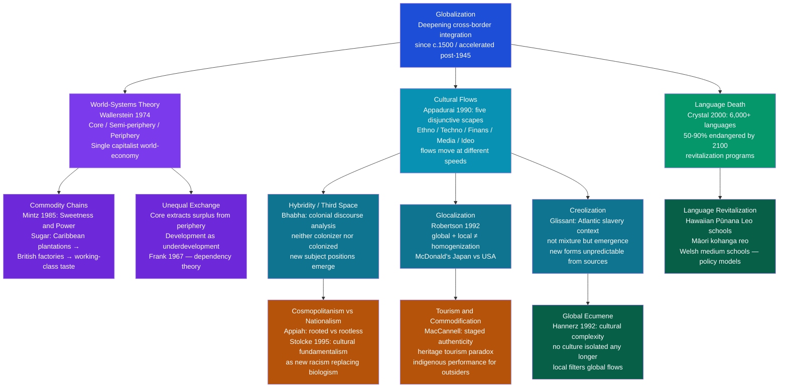

# Globalization and Cultural Change

> [!abstract] TL;DR
> Globalization does not erase cultures — it collides them along structurally unequal fault lines; world-systems theory (Wallerstein) maps the economic architecture of those inequalities, Appadurai's five disjunctive scapes explain why cultural flows are uneven and unpredictable, and hybridity theory (Bhabha, Glissant) and glocalization (Robertson) show that the outcome is neither pure homogenization nor pure local preservation but emergent cultural forms — creole languages, K-pop, Bollywood aesthetics, indigenous-rights NGOs — that could not have been predicted from either side of the encounter.

---

## Intuition

**Analogy:** Imagine two rivers merging. If one river is much larger and faster — say, the Amazon meeting a small tributary — the tributary does not simply maintain its own current, nor does it vanish. The mixing zone produces a third region with its own distinctive chemistry, ecology, and turbulence — patterns that belong entirely to neither river. But the Amazon's sheer volume ensures the merge is not symmetric: the tributary's water is incorporated, dispersed, and transformed far more than the Amazon's. If instead three rivers of roughly equal size converge, the mixing zone is broader, more complex, and all three sources remain legible in the downstream flow.

Cultural globalization works the same way. The world-systems critique (Wallerstein) says: most of the world's cultures are entering the contemporary merge as tributaries meeting a much larger current shaped by five centuries of European expansion, Atlantic slavery, and post-war American economic dominance. The glocalization theorists (Robertson, Appadurai) say: but even tributaries are not simply absorbed — look at McDonald's in Japan, where teriyaki burgers and birthday-party catering turned an American export into a distinctly Japanese cultural institution, or look at how West African rhythmic structures traveled through the Atlantic slave trade, merged with European harmonic traditions under conditions of extreme violence, and produced jazz, blues, reggae, and hip-hop — new forms that belong to neither contributing tradition but transformed both. The mixing zone — what Homi Bhabha calls the *third space* — is where the actual cultural action is.

---

## How It Works



The diagram organizes the field around three analytical axes: the *structural* axis (world-systems theory, commodity chains, dependency) explaining why global cultural flows are power-laden and unequal; the *flows* axis (Appadurai's scapes, hybridity, glocalization, creolization) explaining what actually happens when cultures collide; and the *linguistic-diversity* axis (language death, revitalization) tracing the most measurable consequence of cultural globalization. All three axes intersect in real cases: the Hawaiian language revitalization movement is simultaneously a response to world-system incorporation (American annexation), an exercise in managing cultural flows (resisting Englishization via media- and ideoscapes), and a product of cosmopolitan indigenous-rights networks that are themselves a glocalization outcome.

---

## Key Concepts

### Secondary Level

**What Is Globalization? Three Waves**

Scholars typically identify three phases of accelerating cross-border integration:

| Wave | Approximate Dates | Key Drivers | Cultural Consequences |
|---|---|---|---|
| **Early modern** | c.1500–1800 | European colonialism, Atlantic slave trade, Silk Road | Forced cultural contact; creolization under extreme asymmetry |
| **Industrial** | c.1800–1945 | Steam, telegraph, print capitalism, mass migration | Mass language shift; missionary evangelism; nationalism as counter-movement |
| **Contemporary** | 1945–present | Container shipping, digital media, transnational corporations, internet | Unprecedented speed and volume of cultural flows; hybridity and backlash coexist |

Each wave involved both the transmission of cultural forms from dominant to subordinate societies *and* the transformation of the dominant culture by what it encountered. The Roman Empire absorbed Greek philosophy, Persian court ceremony, and Egyptian religious imagery even as it imposed Latin. The British Empire was permanently altered by Indian cuisine, Caribbean music, and South Asian textile aesthetics even as it imposed English law and the English language. Globalization is not a one-way street; it is a structurally unequal two-way collision.

**World-Systems Theory: The Architecture of Inequality**

Immanuel Wallerstein (*The Modern World-System*, 1974) argued that since approximately 1500, a single capitalist world-economy has been the primary unit of social analysis — not individual nations. This world-economy is organized into three structural zones:

- **Core**: technologically sophisticated nations that extract surplus value from the rest through unequal exchange — they export manufactures, import raw materials, and capture the highest-value-added steps of production chains. Historical cores: England 1750–1870, USA 1945–present.
- **Periphery**: nations consigned to raw material extraction and labor-intensive low-value production. Their agricultural or mineral exports are cheap relative to the manufactures they must import.
- **Semi-periphery**: nations that are simultaneously exploited by the core and exploiting the periphery — industrializing nations, rising powers, or declining former cores. Brazil, India, and China occupy this structural position today.

The cultural implication: cultural flows follow the trade routes and power gradients of the world-system. Hollywood films, English-language popular music, fast-food chains, and social media platforms are not culturally neutral consumer goods — they are products of a specific core civilization, carrying specific assumptions about individual identity, romantic love, consumer behavior, and political legitimacy, moving along the channels carved by economic and military power.

**Cultural Diffusion: Mechanisms of Spread**

Cultural anthropologists identify several mechanisms through which cultural practices, beliefs, and artifacts move across social boundaries:

| Mechanism | Definition | Example |
|---|---|---|
| **Direct diffusion** | Culture contact through trade, intermarriage, or co-residence | Silk Road: papermaking, Islam, silk-cultivation spreading westward |
| **Indirect diffusion** | Cultural traits spread via intermediary populations | Arabic numerals reaching Europe via Arabic-speaking scholars in Spain |
| **Stimulus diffusion** | An idea from another culture inspires a new invention rather than being copied directly | Sequoyah invented the Cherokee syllabary after seeing (but not being able to read) English writing |
| **Forced diffusion** | Colonial or military power compels adoption of dominant cultural forms | Missionary boarding schools eliminating indigenous languages |
| **Media diffusion** | Mass and digital media transmit cultural forms without direct contact | TikTok transmitting dance trends globally within days |

Contemporary globalization compresses all five mechanisms into simultaneous operation. A Kenyan teenager in Nairobi may be exposed to K-pop through YouTube (indirect/media), Chinese consumer goods through a local market (indirect), American political discourse through Twitter (media), and British-derived school curriculum through a colonial education system (forced/historical) — all in a single day.

**Language Death: Scale of the Crisis**

David Crystal (*Language Death*, 2000) synthesized data on the world's linguistic diversity with stark results:

- There are approximately 6,000–7,000 languages spoken in the world today.
- The top 20 languages account for roughly half the world's population.
- Approximately 96% of languages are spoken by only 4% of the world's population.
- Estimates suggest that 50–90% of current languages will be extinct by 2100 if present trends continue — a rate of one language dying every two weeks.
- Languages die when children stop learning them: the decisive indicator is not the number of speakers but whether parents are transmitting the language to their children.

The causes of language shift are overwhelmingly linked to the economic incorporation of minority communities into majority-language economies: schooling in the national/colonial language, employment requiring literacy in the dominant language, and the prestige asymmetry that makes minority-language speakers ashamed to speak their language in front of their own children.

---

### Undergraduate Level

**Appadurai's Five Scapes: Disjuncture in Global Flows**

Arjun Appadurai ("Disjuncture and Difference in the Global Cultural Economy," *Public Culture* 1990) proposed that global cultural flows operate through five interconnected but non-synchronized dimensions — *scapes* — each moving at its own speed and following its own actors:

| Scape | What Flows | Key Actors | Example |
|---|---|---|---|
| **Ethnoscape** | People: migrants, refugees, tourists, students, guest workers | Individuals, diaspora communities | Syrian refugee resettlement reshaping European urban neighborhoods |
| **Technoscape** | Technology, machinery, software, infrastructure | Corporations, states, NGOs | iPhone manufactured across 43 countries; 5G network rollout diverging US/China |
| **Finanscape** | Currency, capital, derivatives, financial instruments | Banks, hedge funds, sovereign wealth funds | 2008 U.S. mortgage crisis transmitting globally within weeks via financial derivatives |
| **Mediascape** | Media production capacity and the images/narratives produced | Studios, platforms, broadcasters | Netflix standardizing global narrative conventions; Al Jazeera as alternative Arab mediascape |
| **Ideoscape** | Political ideologies, concepts, the vocabulary of governance | States, NGOs, social movements | "Democracy," "human rights," "civil society" circulating with NGO infrastructure |

The crucial term in Appadurai's framework is **disjuncture**: the five scapes are *not* synchronized. A country may be deeply integrated into the finanscape (foreign capital dominates its mineral extraction) while being relatively insulated from the ideoscape (authoritarian government controls information flows and civil society). A rural village in Bangladesh may be radically transformed by the mediascape (satellite television and smartphones) while remaining largely outside the finanscape (no access to formal credit). The disjunctures between scapes produce what Appadurai calls "the global cultural economy" — a turbulent, unpredictable system in which the homogenization hypothesis (McWorld, McDonaldization) and the heterogenization hypothesis (clash of civilizations, cultural nationalism) are both partially correct and both miss the real action, which is in the collision and friction *between* scapes.

**Sidney Mintz and the Commodity Chain: Sweetness and Power**

Sidney Mintz (*Sweetness and Power*, 1985) produced what is arguably the most influential demonstration that globalization is not primarily a late-twentieth-century phenomenon. His subject is sugar — a commodity whose global career illuminates the structural connections between colonialism, industrial capitalism, and cultural change with extraordinary precision.

Mintz traces sugar from its origins as a rare luxury in medieval Arab and European courts, through its transformation into a mass commodity via Caribbean plantation slavery, to its eventual incorporation into the daily diet of British industrial workers by the mid-19th century:

1. **Production**: Sugar cultivation required intensive labor in tropical climates. This drove the transatlantic slave trade — approximately 12 million Africans forcibly transported to work Caribbean and Brazilian plantations between 1500 and 1870. The plantation system was itself a proto-industrial enterprise: systematic, time-disciplined, driven by profit maximization.

2. **Trade**: The triangular trade (British manufactured goods to West Africa → enslaved Africans to Caribbean → sugar and rum to Britain) was the structural backbone of early globalization, connecting three continents in a single commodity chain. The profits funded British industrial investment.

3. **Consumption**: As sugar prices fell due to mass production, it moved from aristocratic luxury to working-class staple. By 1900, a British factory worker's daily caloric intake included substantial quantities of sugar — in tea, jam, sweets. This dietary transformation was itself a cultural change: sweetness became associated with comfort, reward, and domesticity in ways that persist today. 

Mintz's argument: the taste for sugar among British workers was not a spontaneous cultural development. It was produced by a specific configuration of colonial power, plantation slavery, industrial capitalism, and deliberate trade policy. *Cultural tastes are commodity chains*. The same analytical logic applies to coffee, chocolate, cotton clothing, and digital devices: every cultural preference that seems natural and local is traceable to a global production system.

**Glocalization: Robertson's Corrective**

Roland Robertson (*Globalization: Social Theory and Global Culture*, 1992) coined **glocalization** to capture something that pure homogenization theories missed: global processes are *always* reinterpreted and reconstructed in local contexts, producing outcomes that are neither the original global form nor the original local form.

The most cited example is McDonald's. In the United States, McDonald's signifies convenience, standardization, and working-class comfort food. In Japan, its cultural meaning has been substantially transformed:

- McDonald's Japan introduced the teriyaki burger, shrimp burger, and seasonal rice-based items — adaptations to local taste preferences that the U.S. parent company adopted globally.
- Birthday parties at McDonald's became a status marker for middle-class Japanese families in the 1980s — an association that never existed in the U.S.
- McDonald's Japan operates in a country where the fast-food aesthetic was reinterpreted through existing Japanese cultural frameworks of cleanliness, precision, and service quality.
- The resulting "Japanese McDonald's" is a genuinely different cultural product from its American counterpart, even as it uses the same corporate branding and supply-chain infrastructure.

Glocalization does not mean that global power asymmetries are irrelevant — McDonald's corporate headquarters are still in Chicago, not Tokyo, and the global brand strategy flows outward from the core. But it means that the outcome on the ground is always a new thing produced by the encounter between a global form and a specific local history, set of tastes, and social structures. This is what Appadurai means by his flows being "disjunctive": global and local do not add up to a simple sum.

**Hybridity and the Third Space: Homi Bhabha**

Homi Bhabha (*The Location of Culture*, 1994) developed the concept of **cultural hybridity** from within postcolonial literary theory. His analysis focuses specifically on colonial discourse — the system of representations through which the colonizer constructed the colonized as simultaneously inferior and desirable, savage and childlike, in need of civilization and dangerously resistant to it.

Bhabha's key move is to identify the **third space of enunciation** — the gap between the statement and its enunciation, between the colonial sign and the context of its reception. When colonial authority attempts to impose its cultural forms on colonized subjects, the result is never a clean transmission. The colonized subject receives the colonial sign and returns it *almost the same, but not quite* — a process Bhabha calls **mimicry**. The colonized mimic who speaks English perfectly, dresses in English clothes, and recites English literature is both proof of colonial civilization's success and a profound threat to colonial authority: if colonized subjects can perfectly imitate the colonizer, then the claimed natural superiority of the colonizer is revealed as nothing more than a set of learnable performances.

The theoretical implication: cultural meaning is always produced in the gap between intention and reception, between the global cultural product sent and the local context of its consumption. There is no pure cultural form that precedes contact, no original authenticity to be preserved or lost. All cultural meaning is produced in the third space.

**The Problem with Hybridity**

Jan Nederveen Pieterse (*Globalization and Culture*, 2003) extended hybridity theory while identifying a fundamental problem: the concept of hybridity logically implies that *pure originals* existed before mixture. The very language of hybridization — "cultures blending," "traditions mixing" — presupposes that prior to contact there were unmixed, pure cultures. But there were not. Every culture that anthropologists have studied is already the product of prior contacts, conquests, migrations, and borrowings. The "traditional Japanese culture" that McDonald's supposedly hybridizes with was itself the product of Chinese Buddhist influence, Korean craft traditions, Portuguese and Dutch trading contacts, and Meiji-era deliberate adoption of European institutions.

Paul Gilroy (*The Black Atlantic*, 1993) made a parallel argument specifically for the African diaspora: there is no pure African cultural "origin" to which diaspora communities could return or from which their hybridity could be measured. The cultures of West Africa were themselves diverse, contact-shaped, and internally differentiated; the Middle Passage did not transport a single "African culture" — it transported enslaved people from dozens of different linguistic and cultural communities who then had to construct new cultural forms under conditions of extreme violence and surveillance. The Black Atlantic cultural world (jazz, gospel, reggae, hip-hop) is not a hybrid of "African" and "European" cultures; it is a genuinely new synthesis produced by specific historical conditions that could not have been foreseen from either contributing tradition.

**Tourism and the Commodification of Culture: MacCannell's Staged Authenticity**

Dean MacCannell (*The Tourist*, 1976) argued that modern tourism is structured around a fundamental contradiction: tourists seek authentic cultural experiences, but the very presence of tourism transforms the cultures being visited into performances staged for tourist consumption. MacCannell analyzed this as a theatrical structure: front regions (what tourists are shown — the cultural performance) and back regions (the actual ongoing life of the community, largely hidden from tourist view).

**Staged authenticity** is the result: cultural forms are preserved, revived, or invented specifically for tourist consumption, in ways that appear to present "traditional" culture but actually produce a new cultural product tailored to the tourist gaze. The consequences are complex:

- **Economic**: Tourism revenue can fund genuine language and cultural preservation programs. The Māori cultural tourism industry in New Zealand has generated resources for Māori language education, arts funding, and community infrastructure.
- **Commodification**: The same revenue creates pressure to simplify, exoticize, and freeze cultural forms in ways that meet tourist expectations of "primitive authenticity," suppressing ongoing cultural change and complexity.
- **Self-determination paradox**: Indigenous communities may have genuine agency in designing and controlling their cultural tourism, but doing so on terms set by the tourist market means adapting to an external gaze whose categories were produced by colonial representations.

The staged authenticity paradox has no clean resolution. The question anthropologists ask is not "is this culture authentic?" but "who controls the staging, who profits from it, and how do community members understand the relationship between their tourist performances and their actual living cultural practice?"

---

### Graduate Level

**Wallerstein's World-System: Full Theoretical Architecture**

Immanuel Wallerstein's world-systems theory (*The Modern World-System*, 3 vols., 1974–1988; *World-Systems Analysis*, 2004) synthesized dependency theory (Frank, Cardoso), the Annales school of long-term historical analysis (Braudel), and Marx's political economy into a structural framework for understanding global inequality.

Key theoretical commitments:

**Historical capitalism as the unit of analysis.** Wallerstein rejected both the nation-state and isolated "civilizations" as the proper unit of social analysis. The relevant unit is the world-system — a multi-state entity organized around a single division of labor. The current world-system, the capitalist world-economy, originated in Europe around 1450–1550 and has been incorporating all other social formations since then through economic expansion, colonialism, and military force.

**Unequal exchange as the mechanism.** Emmanuel Arghiri's concept of unequal exchange explains how the core extracts surplus value from the periphery without direct military coercion. Core industries produce technologically sophisticated goods under conditions of high wages and capital-intensive production; peripheral producers sell labor-intensive raw materials and manufactures at lower wages. The terms of trade systematically favor the core: the same amount of labor produces more purchasing power in the core than in the periphery. This is not merely historical — it is reproduced daily through the price structure of global commodity markets.

**Semi-periphery as political stabilizer.** Wallerstein's most original contribution is the three-tier structure. The semi-periphery — Brazil, India, China, Russia, Mexico — plays a politically stabilizing role: it provides a social mobility "ladder" that prevents the stark two-class polarization (pure core vs. pure periphery) that Marx's model would predict. Semi-peripheral nations aspire to core status, providing ideological legitimacy to the world-system. They also absorb some manufacturing from the core as wages rise (as China did from the 1980s), maintaining the overall system's dynamism.

**Cultural implications.** The world-system's cultural dimension is not epiphenomenal. The dominance of English as the global academic and business language, the concentration of media production in a small number of core nations, and the global prestige of Western educational credentials are all structural features of the world-system — not merely preferences or accidents. Changing cultural flows requires changing the structural conditions that generate the power gradients along which they flow.

**Cultural Fundamentalism: Stolcke's New Racism**

Verena Stolcke ("Talking Culture: New Boundaries, New Rhetorics of Exclusion in Europe," *Current Anthropology*, 1995) identified a troubling development in the political response to immigration in Europe: the replacement of explicit biological racism with what she called **cultural fundamentalism**.

Classical racism argued that different racial groups were biologically unequal — that African or Asian people were inferior to Europeans in intelligence, morality, or civilizational capacity. This argument became politically untenable after 1945. But the same exclusionary politics re-emerged in a new vocabulary: not "they are inferior" but "their culture is incompatible with ours." German neo-conservative politicians argued that Turkish guest workers could not be integrated because Turkish culture was fundamentally different from German culture. French politicians argued that North African Muslim culture was incompatible with French republican values. British politicians argued that Pakistani-origin communities refused to assimilate.

Stolcke's argument: cultural fundamentalism is structurally identical to biological racism but uses culture instead of biology as the marker of essential, immutable difference. The rhetorical move is the same: a social group is assigned a fixed, essential identity (now cultural rather than biological) that makes coexistence with the majority impossible. The practical consequence is the same: exclusion, discrimination, and the denial of political belonging. The difference is that cultural fundamentalism is harder to critique because it deploys the anthropological language of cultural difference and respect — it claims to be *protecting* cultures from contamination by contact, rather than ranking them hierarchically.

The implication for anthropology: the discipline that developed cultural relativism as a weapon against biological racism must be aware that the language of cultural difference can be weaponized in exactly the opposite direction — not to expand tolerance but to justify exclusion.

**Creolization vs. Hybridization: Glissant's Theoretical Distinction**

Édouard Glissant (*Caribbean Discourse*, 1981; *Poetics of Relation*, 1990) drew a crucial distinction between simple **mixture** (hybridity) and **creolization**:

- Hybridization implies that two preexisting pure forms combine to produce a third that contains elements of both and can, in principle, be decomposed back into its components. The hybrid is analytically reducible to its sources.

- Creolization, by contrast, produces *genuinely new and unpredictable* cultural forms that cannot be reduced to or predicted from the contributing elements. The creole language that emerged from the forced encounter of West African languages and French under conditions of Atlantic slavery is not reducible to "X% African" and "Y% French." It is a new grammatical system with its own internal logic — a new thing.

Glissant's broader philosophical framework — the **Poetics of Relation** — argues that the Caribbean experience of creolization offers a model for a global culture of "relation": a world in which cultures remain themselves while remaining permanently open to transformation through contact, rather than claiming either pure identity (cultural fundamentalism) or simple mixture (liberal multiculturalism). Relation is neither rootedness nor rootlessness; it is the creative transformation that arises from the permanent tension between them.

The political and aesthetic stakes are high: Glissant wrote against both colonial cultural imperialism (which demanded assimilation to French metropolitan culture) and nativist anti-colonialism (which idealized a pure African origin to which Caribbean people should return). Both positions, in his view, misunderstood what the Caribbean actually was — not a degraded copy of either Africa or Europe, but a new civilization produced by the most extreme form of cultural violence and turned, paradoxically, into the site of extraordinary cultural creativity.

**Ulf Hannerz: The Global Ecumene and Flows Between Centers and Peripheries**

Ulf Hannerz (*Cultural Complexity*, 1992; "Cosmopolitans and Locals in World Culture," *Theory, Culture and Society*, 1990) developed a framework for understanding cultural globalization that avoids both the homogenization thesis and the simple celebration of hybridity.

Hannerz introduced the concept of the **global ecumene** — the ecumene being the entire inhabited world, now interconnected in a single cultural system for the first time. His central claim: there is no longer any culture that is not in dialogue with the global cultural flow. There are no isolated cultures to be discovered by anthropologists; all communities are already nodes in global networks of meaning, however differently positioned.

His **center-periphery model of cultural flows** maps how this dialogue operates unequally:

- Centers (core) generate cultural forms — aesthetic styles, narrative genres, fashion cycles, musical structures, political concepts — and diffuse them outward.
- Periphery cultures receive these forms, but they do not passively adopt them. They process global cultural inputs through existing local frameworks, producing local versions that are neither simply copied from the center nor simply survivals of pre-contact traditions.
- The periphery also transmits cultural forms back toward the center — the "creolization" of metropolitan cultures through immigration, diaspora cultural production, and the global market for "world music," "ethnic cuisine," and "exotic" aesthetics.

Crucially, Hannerz argues that cultural saturation — the degree to which a periphery culture has been penetrated by metropolitan cultural forms — does not predict loss of local cultural distinctiveness. Japanese popular culture is among the most thoroughly globalized in the world (in terms of American cultural influence since 1945) and is simultaneously among the most distinctively non-Western in its current global cultural output. The relationship between exposure and adoption is mediated by local cultural infrastructure, language, political institutions, and the specific character of the encounter.

**Language Death as a Biodiversity Analog**

Crystal (*Language Death*, 2000) and later scholars (Nettle and Romaine, *Vanishing Voices*, 2000) developed the **biocultural diversity** framework: linguistic diversity and biological diversity are correlated geographically (the tropics have both the highest language density and the highest species diversity) and threatened by the same forces (economic development, deforestation, cultural assimilation).

The analogy to biodiversity is not merely rhetorical:

1. **Cognitive diversity**: Different languages encode different perceptual categories, grammatical distinctions, and conceptual structures. Hopi encodes time differently from English (Whorf). Pirahã has no numbers or recursion (Everett, contested). Guugu Yimithirr encodes spatial direction as absolute (cardinal compass points) rather than relative (left/right), which correlates with extraordinary spatial memory and navigation skill. Each lost language is a lost cognitive technology.

2. **Ecological knowledge**: Indigenous languages encode thousands of years of accumulated ecological knowledge — plant classifications, weather prediction, animal behavior, medicinal use — that has no equivalent in scientific literature. Languages that die carry this knowledge with them.

3. **Revitalization programs**: The successful cases — Hawaiian (Pūnana Leo immersion schools, begun 1984; Hawaiian now official language of Hawaii), Māori (kohanga reo "language nests," begun 1982; Māori now co-official language of New Zealand), and Welsh (bilingual schooling since the 1970s; now spoken by 29% of Wales) — share common features: immersive early childhood education, media presence (radio, television), official recognition, community-controlled institutions, and intergenerational transmission incentives.

The failures are more common than the successes. Language revival requires not just teaching vocabulary but reconstructing the social conditions under which speakers choose to use the language in daily life. A language that children learn in school but do not use at home, with peers, or in employment will not survive. Successful revitalization requires changing the *prestige economy* of language — making the minority language socially and economically valuable in contexts where the dominant language previously monopolized those rewards.

---

## Python Demo

```python
# Cultural Diffusion in Global Networks: Hub-and-Spoke vs. Multipolar
#
# Each of N_CULTURES cultures is represented as a vector of N_TRAITS continuous
# trait values in [0, 1] (food practices, kinship terms, ritual forms, aesthetic
# preferences, political concepts — all as a single continuous vector).
#
# Cultural exchange follows weighted diffusion:
#
#   C_i(t+1) = INERTIA * C_i(t)  +  (1 - INERTIA) * SUM_j [W_ij * C_j(t)]
#
# where W_ij = influence weight of culture j on culture i (row-normalized).
# INERTIA = resistance to external influence (higher = more conservative culture).
#
# Two network regimes:
#   Hub-and-Spoke: one dominant center (hub_idx=0) exerts strong influence on all.
#     Maps to post-WWII U.S. cultural hegemony via Hollywood, fast food, English.
#   Multipolar: three regional hubs with moderate influence.
#     Maps to emergent multipolarity: U.S. + European + East Asian cultural spheres.
#
# Key output: cultural diversity (mean pairwise Euclidean distance) over time,
# and final trait distributions for all cultures under each regime.
#
# Uses: numpy, matplotlib only

import numpy as np
import matplotlib
matplotlib.use("Agg")
import matplotlib.pyplot as plt

rng = np.random.default_rng(42)

N_CULTURES = 10
N_TRAITS   = 40
T          = 300
INERTIA    = 0.82  # 82% of own culture retained each step — realistic cultural conservatism

# ─── Initial cultures: randomly diverse ──────────────────────────────────────
cultures_init = rng.random((N_CULTURES, N_TRAITS))

# ─── Build row-normalized influence matrices ──────────────────────────────────
def make_hub_and_spoke(n, hub_idx=0, hub_w=0.68, baseline_w=0.04, seed=7):
    rng2 = np.random.default_rng(seed)
    W = rng2.random((n, n)) * baseline_w
    W[:, hub_idx] = hub_w    # hub influences all periphery strongly
    W[hub_idx, :] = hub_w    # hub also receives (but INERTIA limits its change)
    np.fill_diagonal(W, 0.0)
    return W / W.sum(axis=1, keepdims=True)

def make_multipolar(n, n_poles=3, pole_w=0.28, baseline_w=0.07, seed=7):
    rng2 = np.random.default_rng(seed)
    W = rng2.random((n, n)) * baseline_w
    poles = np.round(np.linspace(0, n - 1, n_poles)).astype(int)
    for p in poles:
        W[:, p] = pole_w
        W[p, :] = pole_w
    np.fill_diagonal(W, 0.0)
    return W / W.sum(axis=1, keepdims=True)

W_hub   = make_hub_and_spoke(N_CULTURES)
W_multi = make_multipolar(N_CULTURES)

# ─── Diversity metric: mean pairwise Euclidean distance ──────────────────────
def mean_pairwise_dist(C):
    n = C.shape[0]
    total, count = 0.0, 0
    for i in range(n):
        for j in range(i + 1, n):
            total += np.linalg.norm(C[i] - C[j])
            count += 1
    return total / max(count, 1)

# ─── Simulation ───────────────────────────────────────────────────────────────
def simulate(C0, W, inertia, steps):
    C = C0.copy()
    diversity_track = [mean_pairwise_dist(C)]
    for _ in range(steps):
        C = inertia * C + (1 - inertia) * (W @ C)
        C = np.clip(C, 0.0, 1.0)
        diversity_track.append(mean_pairwise_dist(C))
    return C, np.array(diversity_track)

C_hub,   div_hub   = simulate(cultures_init, W_hub,   INERTIA, T)
C_multi, div_multi = simulate(cultures_init, W_multi, INERTIA, T)

# ─── Summary ──────────────────────────────────────────────────────────────────
d0 = mean_pairwise_dist(cultures_init)
print("=== Cultural Diffusion in Global Networks ===\n")
print(f"Parameters: N_CULTURES={N_CULTURES}  N_TRAITS={N_TRAITS}  T={T}  INERTIA={INERTIA}\n")
header = f"{'Regime':<40}  {'Initial div':>12}  {'Final div':>10}  {'Diversity lost':>14}"
print(header)
print("-" * len(header))
for label, div in [
    ("Hub-and-Spoke (hegemonic globalization)", div_hub),
    ("Multipolar (glocalization / multipolarity)", div_multi),
]:
    pct = 100.0 * (d0 - div[-1]) / d0
    print(f"{label:<40}  {d0:>12.4f}  {div[-1]:>10.4f}  {pct:>13.1f}%")

print("\n--- Anthropological interpretation ---")
print("Hub-and-spoke: faster convergence → Wallerstein/Ritzer homogenization thesis.")
print("  Core cultural forms (Hollywood, English, fast food) suppress peripheral diversity.")
print()
print("Multipolar: slower convergence → Robertson's glocalization thesis.")
print("  Three regional hubs mediate global flows, retaining more diversity in the system.")
print()
print("Key glocalization result: in BOTH regimes, peripheral cultures do NOT converge")
print("to the hub culture's exact traits. They converge toward a weighted average")
print("that differs from every original culture — including the hub's.")
print("This is Glissant's creolization: contact does not produce copies; it produces")
print("new forms that could not have been predicted from any contributing culture alone.")

# Convergence toward hub culture in hub-and-spoke
dist_to_hub_t0 = np.mean([np.linalg.norm(cultures_init[i] - cultures_init[0])
                           for i in range(1, N_CULTURES)])
dist_to_hub_tT = np.mean([np.linalg.norm(C_hub[i] - C_hub[0])
                           for i in range(1, N_CULTURES)])
print(f"\nHub-and-spoke: mean distance to hub culture:")
print(f"  t=0: {dist_to_hub_t0:.4f}   t=T: {dist_to_hub_tT:.4f}")
print(f"  Periphery converged {100*(dist_to_hub_t0 - dist_to_hub_tT)/dist_to_hub_t0:.1f}% toward hub — but not to identity.")

# ─── Plot ─────────────────────────────────────────────────────────────────────
fig, axes = plt.subplots(1, 2, figsize=(13, 5))
fig.suptitle(
    "Cultural Diffusion in Global Networks (Anthropological Trait-Vector Model)\n"
    "Hub-and-Spoke (hegemonic) vs. Multipolar (glocalization)",
    fontsize=10, y=1.01
)

t_arr = np.arange(T + 1)

# Left panel: diversity over time
ax = axes[0]
ax.plot(t_arr, div_hub,   color="#c0392b", lw=2.5, label="Hub-and-Spoke (US hegemony)")
ax.plot(t_arr, div_multi, color="#2980b9", lw=2.5, label="Multipolar (regional hubs)")
ax.fill_between(t_arr, div_hub, div_multi,
                where=(div_multi >= div_hub),
                alpha=0.15, color="#27ae60",
                label="Diversity gap (multipolar advantage)")
ax.axhline(div_hub[-1],   color="#c0392b", ls=":", lw=1.2, alpha=0.5)
ax.axhline(div_multi[-1], color="#2980b9", ls=":", lw=1.2, alpha=0.5)
ax.set_xlabel("Time Steps (each ~ one decade of intense globalization)", fontsize=9)
ax.set_ylabel("Cultural Diversity\n(mean pairwise Euclidean distance)", fontsize=9)
ax.set_title("Cultural Diversity Over Time", fontsize=10)
ax.legend(fontsize=8)
ax.set_xlim(0, T)
ax.grid(True, alpha=0.2)

# Right panel: final trait distributions (hub top, multipolar bottom)
ax = axes[1]
combined = np.vstack([C_hub, C_multi])
im = ax.imshow(combined, aspect="auto", cmap="RdYlBu", vmin=0.0, vmax=1.0,
               interpolation="nearest")
ax.axhline(N_CULTURES - 0.5, color="white", lw=2.5)
ax.set_xlabel("Cultural Traits (dimensions)", fontsize=9)
ax.set_ylabel("Culture Index", fontsize=9)
ax.set_title(
    f"Final Trait Distributions at T={T}\n"
    "(rows 0-9: hub-and-spoke  |  rows 10-19: multipolar)",
    fontsize=9
)
labels = (
    [f"H-C{i}" for i in range(N_CULTURES)] +
    [f"M-C{i}" for i in range(N_CULTURES)]
)
ax.set_yticks(range(2 * N_CULTURES))
ax.set_yticklabels(labels, fontsize=7)
plt.colorbar(im, ax=ax, label="Trait value", fraction=0.046, pad=0.04)

plt.tight_layout()
plt.savefig("cultural_diffusion_simulation.png", dpi=140, bbox_inches="tight")
print("\nFigure saved: cultural_diffusion_simulation.png")
```

**What the model demonstrates:**

- **Hub-and-spoke regime** — faster, deeper loss of cultural diversity. The dominant culture (C0) exerts gravitational pull on all peripheral cultures, which converge toward each other *via* the hub as mediator. The resulting cultural convergence maps to Wallerstein's core-periphery dynamic: Hollywood genres, English vocabulary, and American consumer aesthetics spreading globally along trade and media routes established by post-war American hegemony.

- **Multipolar regime** — slower convergence, more residual diversity. Three regional hubs each maintain somewhat different cultural "attractors," and peripheral cultures cluster around their nearest hub. The system converges but retains inter-cluster diversity even at T=300. This maps to Robertson's glocalization: a world in which American, European, and East Asian cultural spheres each shape their regional peripheries differently, producing a patchwork rather than a single global culture.

- **Glocalization in the model** — crucially, in neither regime do peripheral cultures converge to the hub's exact trait values. They converge toward a *weighted average* that differs from every original culture, including the hub's. This is the model's most important result: global cultural influence does not produce copies of the dominant culture. It produces new hybrid forms — a Japanese McDonald's, a Bollywood aesthetic, a Nairobi hip-hop scene — that are genuine cultural novelties.

---

## Real-World Applications

> **Example 1 — Mintz's Sugar as a Template for All Commodity Chains:** Mintz's analysis of sugar as the connective tissue of British colonialism, Caribbean plantation slavery, and English working-class culture prefigures the analysis of every subsequent global commodity. The smartphone repeats the same structure: raw materials (cobalt from the DRC, lithium from Bolivia) extracted by peripheral labor under hazardous conditions; assembled in semi-peripheral factories (Foxconn in China); designed and branded in the core (Apple in California); consumed by a global middle class that has no awareness of the production chain. The cultural forms that accompany smartphone adoption — selfie aesthetics, social media identity performance, always-on connectivity — are as structural as the taste for sweet tea that accompanied sugar's global career.

> **Example 2 — K-pop and Multipolar Cultural Flows:** K-pop demonstrates that contemporary cultural globalization is not simply one-directional from the US core. South Korea, a semi-peripheral nation in Wallerstein's schema, has become one of the most significant cultural exporters in the world. K-pop borrows heavily from American hip-hop and pop production techniques, Japanese idol group management structures, and European electronic music — processing all three through Korean aesthetic sensibilities (synchronized choreography, meticulous visual styling, parasocial fan management) to produce something genuinely new. BTS filling Wembley Stadium and the Grammys broadcasting K-pop performances is not American cultural homogenization; it is Appadurai's scapes operating multipolarly, with Korean mediascapes now flowing back toward the core.

> **Example 3 — Pūnana Leo and Language Revitalization Technology:** In 1984, the Hawaiian community opened the first Pūnana Leo (Language Nest) immersion preschool in Hawaii. In 1978, Hawaiian had been co-official for three years but had fewer than 2,000 speakers, most of them elderly. By 2016, the census counted approximately 18,000 Hawaiian speakers, and the language had a functional media presence, university program, and a growing body of literature. The mechanism was not simply language instruction but the reconstruction of social domains in which Hawaiian was the natural choice: immersion preschools, then elementary schools, then high schools, then university courses, then government services. Crystal's analysis predicts exactly this sequence: language revitalization requires not just teaching but *prestige domain expansion* — creating contexts where the minority language confers social advantage rather than disadvantage.

> **Example 4 — Stolcke's Cultural Fundamentalism in European Migration Politics:** The 2015–16 European migration crisis produced the sharpest recent instance of Stolcke's cultural fundamentalism. Anti-immigration political movements across Europe explicitly disclaimed biological racism while arguing that Muslim-majority migrants were culturally incompatible with "European values" — gender equality, secular governance, liberal individual rights. The rhetorical structure was precisely Stolcke's: not "these people are inferior" but "their culture cannot coexist with ours." The anthropological response is not to deny that cultural differences are real or that they create friction in rapid demographic change. It is to point out that: (1) the same arguments about cultural incompatibility were made about Irish, Italian, and Polish Catholic immigrants to Protestant northern Europe and North America in the 19th century — and were equally wrong; (2) the treatment of cultural difference as fixed and essential rather than dynamic and negotiable is itself a politically motivated distortion of what anthropology actually knows about cultural change; and (3) the European cultures invoked as threatened were themselves products of centuries of contact, conquest, and hybridization with Arab, Ottoman, African, and Asian cultural forms.

> **Example 5 — Bollywood and the Global South's Mediascape:** Bollywood is the world's largest film industry by number of films produced, and its market extends across South Asia, Southeast Asia, the Middle East, Sub-Saharan Africa, and South Asian diaspora communities in the UK, Canada, and USA. Bollywood's aesthetic — melodrama, song-and-dance sequences interrupting narrative, idealization of family honor and romantic sacrifice — combines Indian theatrical (nautanki, parsi theater), classical dance (Bharatanatyam, Kathak), and Hollywood narrative conventions. It constitutes an alternative mediascape that contradicts the homogenization thesis: for hundreds of millions of viewers, Bollywood, not Hollywood, is the primary source of global cultural imagination, romantic ideals, fashion inspiration, and narrative templates.

---

## Common Pitfalls

- **Treating globalization as synonymous with Americanization** — This is the most common undergraduate error and is empirically wrong. K-pop, Bollywood, Nollywood (Nigerian cinema), telenovelas (Latin American soap operas), and anime all constitute major global cultural flows that originate outside the American core. Wallerstein's world-system framework explains why the United States has been *disproportionately* influential, but Appadurai's scapes framework correctly insists that flows are multipolar and disjunctive, not unidirectional.

- **Conflating hybridity with equity** — The existence of cultural hybridity does not mean that the cultural encounter occurred on equal terms. Jazz is a hybrid of West African and European musical traditions, but it was produced under conditions of slavery, racial segregation, and systematic economic exploitation of Black musicians by white-owned music industries. Celebrating the hybrid result without acknowledging the power conditions of its production is a form of cultural appropriation analysis evasion.

- **Assuming "traditional" cultures were static before globalization** — The very concept of "traditional culture" implicitly contrasts a pre-global cultural purity with a post-global contaminated hybridity. But there is no pre-contact baseline. All cultures documented by anthropologists were already in motion — already shaped by prior contacts, migrations, conquests, and internal diversification. The question is not "has this culture changed?" but "who controlled the change, at what speed, and under what conditions of coercion or consent?"

- **Confusing glocalization with genuine resistance** — Robertson's glocalization concept is descriptive, not normative: it describes how global forms are locally reinterpreted, but it does not imply that local reinterpretation constitutes meaningful resistance to global power. A Nigerian community that adopts Pentecostal Christianity from American televangelists but inflects it with local spiritual concepts and communal practices is glocalizing — but this does not liberate them from the structural dynamics that made American evangelical Christianity globally available in the first place. Glocalization and world-systems theory must be used together.

- **Treating language revitalization as simply a matter of will or sentiment** — Language death occurs because economic structures reward speakers for abandoning their language. Reversing language death requires changing those economic structures — creating employment opportunities, government services, and educational credentials in the minority language. Revitalization programs that focus only on emotional attachment to heritage without addressing the prestige and economic dimension of language choice systematically fail. Crystal's evidence is clear: languages survive not when people *love* them but when people *use* them in economically and socially significant contexts.

- **Reading Appadurai's scapes as equally powerful** — The five scapes are not symmetric. In practice, finanscapes (capital flows) and technoscapes (infrastructure investment) typically *constrain* what is possible in mediascapes and ideoscapes. A country that depends on IMF structural adjustment loans is constrained in its ideoscape (which development ideologies it can promote) by its finanscape position. Appadurai's model is a descriptive taxonomy, not an equilibrium — the scapes are disjunctive precisely because they are driven by different forces operating at different speeds, and power asymmetries shape the collision.

---

## Related Concepts

- [[Culture_Symbols_and_Meaning]] — Appadurai's five scapes, creolization, and glocalization are all theories of what happens to the symbolic systems analyzed in this note when they cross cultural boundaries; the question of how meaning is preserved, transformed, or lost in global diffusion is the central analytical link
- [[Political_Anthropology_and_Power]] — World-systems theory and the cultural fundamentalism critique both require a theory of power; colonial power asymmetries determine the conditions under which cultural contact occurs; the political anthropology of the state is the institutional framework within which language policies and tourism economies are administered
- [[Ethnographic_Methods_and_Fieldwork]] — Studying globalization at the ground level requires ethnographic methods (multi-sited ethnography, Marcus 1995) that follow the commodity chain or the cultural flow through multiple sites rather than studying a single bounded community
- [[Classical_Anthropological_Theory]] — Boas's historical particularism and anti-racism foundation is the direct predecessor of both cultural relativism and the critique of cultural fundamentalism; the discipline's theoretical resources for analyzing globalization were built by Boas, Malinowski, and the fieldwork tradition
- [[Structuralism_and_Symbolic_Anthropology]] — Lévi-Strauss's structural method provides the analytical toolkit for understanding how binary oppositions (raw/cooked, nature/culture, self/other) travel across cultural boundaries and are reconfigured in hybrid forms; structural anthropology is the predecessor of both hybridity theory and Appadurai's scapes
- [[Material_Culture_and_Technology]] — Mintz's commodity chain analysis is fundamentally an analysis of material culture (sugar, cotton, steel, smartphones) moving through global production networks; the material dimension of globalization grounds cultural analysis in physical flows
- [[Kinship_Marriage_and_Family_Systems]] — Transnational migration produces new forms of kinship: transnational families, remittance economies, long-distance parenting, and diasporic marriage markets; globalization transforms the very kinship structures that anthropology treats as foundational to social organization
- [[Globalization_and_Social_Change]] — The sociological parallel: Wallerstein's world-systems theory, Robertson's glocalization, Castells' network society, and Ritzer's McDonaldization from the sociological perspective; the anthropological and sociological approaches to globalization are complementary and should be read together
- [[Globalization_and_Its_Discontents]] — The political science perspective: how globalization generates populist backlash, nationalist retrenchment, and the "discontents" that Stiglitz (and before him, Polanyi) identified in the social disruption created by rapid market integration; Stolcke's cultural fundamentalism is the anthropological analysis of the same political phenomenon
- [[Development_Economics]] — Dependency theory (Frank, Cardoso) and the Washington Consensus are the economic policy expression of the world-systems dynamic; Amartya Sen's capabilities approach and postdevelopment theory (Escobar) provide the alternative frameworks that informed participatory and indigenous-rights anthropology
- [[Global_Financial_Crises]] — Appadurai's finanscape is the cultural-anthropological dimension of the financial flows that produce global financial crises; the 2008 crisis demonstrated precisely how fast and far finanscapes can transmit disruption, and how that disruption moves through mediascapes and ideoscapes to produce cultural and political transformations

- [[_MOC_Applied_and_Global_Anthropology|↑ Applied and Global Anthropology MOC]]

---

## Review Questions

### Secondary

1. Your local city has seen a major influx of immigrants over the past decade, and some residents argue that the newcomers should fully adopt local culture rather than maintain their own. Using the concepts of glocalization and cultural fundamentalism, evaluate this argument. What would Robertson predict actually happens to cultures in contact? What does Stolcke warn about the "cultural incompatibility" argument?

2. Mintz showed that the taste for sweet tea among British workers was not simply a matter of individual preference — it was produced by a global system linking Caribbean slavery to British factory labor. Choose one contemporary everyday cultural practice (streaming music, wearing jeans, drinking coffee, scrolling social media) and trace, as specifically as you can, the global commodity chain and power structures that produced the conditions for that practice to exist.

### Undergraduate

3. Appadurai argues that global cultural flows operate through five "disjunctive scapes" that move at different speeds and in different directions. Apply this framework to the 2011 Arab Spring uprisings: identify how each scape (ethnoscape, technoscape, finanscape, mediascape, ideoscape) was operating, how they were disjunctive, and what limits the mediascape/ideoscape analysis of the "Twitter revolution" misses.

4. Bhabha's "third space" and Glissant's "creolization" both theorize what happens when cultures collide under conditions of colonial power asymmetry — but they reach different conclusions about the nature of the resulting cultural forms. Compare and contrast the two frameworks: what does each illuminate about post-colonial cultural production that the other cannot? Use at least one concrete example of a cultural form (a music genre, language variety, religious practice, or cuisine) to ground your comparison.

5. MacCannell's "staged authenticity" and Crystal's "language revitalization" both address the question of how cultural forms are preserved, displayed, or maintained in a globalized world — but they arrive at very different assessments of the prospects. Compare the two analyses: under what conditions does MacCannell's staged authenticity become a vehicle for genuine cultural preservation, and under what conditions does it undermine it? What does Crystal's analysis of successful revitalization programs add?

### Graduate

6. Wallerstein's world-systems theory and Appadurai's scapes framework offer competing accounts of the structure of global cultural flows. Wallerstein's account is structural and macro-historical; Appadurai's is processual and attentive to disjuncture and unpredictability. Develop a theoretically integrated account that preserves what is most powerful in each: how does the structural architecture of the world-system constrain the movement of scapes, and how do disjunctive scapes in turn produce transformations in the world-system's structural positions? Use at least two empirical cases (one historical, one contemporary) to ground your synthesis.

7. Verena Stolcke argues that cultural fundamentalism is structurally identical to biological racism but substitutes culture for biology as the marker of immutable, essential difference. Evaluate this argument against the following objection: surely there are genuine and important cultural differences that do make integration difficult — the claim that cultural fundamentalism is "just racism in disguise" risks erasing real conflicts between cultural values (e.g., between liberal individualism and patriarchal family structures, between secular governance and religious law). Does Stolcke's framework have the resources to distinguish legitimate acknowledgment of cultural difference from culturalist exclusion? If not, how should it be modified?

8. Crystal's language revitalization framework and Glissant's creolization theory seem to pull in opposite directions: Crystal argues for the preservation of existing linguistic diversity through revitalization of endangered languages, while Glissant celebrates the emergence of genuinely new creole forms from the destruction of prior linguistic orders. Is there a theoretical tension here, or can both be right simultaneously? Develop a unified account that specifies when revitalization is the appropriate response to language threat and when creolization represents a more productive relationship with linguistic change — and address the political stakes of each position for indigenous communities making language policy decisions today.

---

## Sources

- [Wallerstein, I. (1974). *The Modern World-System I: Capitalist Agriculture and the Origins of the European World-Economy in the Sixteenth Century*. Academic Press.](https://www.goodreads.com/book/show/248413.The_Modern_World_System_I)
- [Wallerstein, I. (2004). *World-Systems Analysis: An Introduction*. Duke University Press.](https://www.goodreads.com/book/show/248416.World_Systems_Analysis)
- [Mintz, S.W. (1985). *Sweetness and Power: The Place of Sugar in Modern History*. Viking.](https://www.goodreads.com/book/show/234507.Sweetness_and_Power)
- [Appadurai, A. (1990). "Disjuncture and Difference in the Global Cultural Economy." *Public Culture* 2(2), 1–24.](https://doi.org/10.1215/08992363-2-2-1)
- [Appadurai, A. (1996). *Modernity at Large: Cultural Dimensions of Globalization*. University of Minnesota Press.](https://www.goodreads.com/book/show/236093.Modernity_at_Large)
- [Bhabha, H.K. (1994). *The Location of Culture*. Routledge.](https://www.goodreads.com/book/show/248712.The_Location_of_Culture)
- [Robertson, R. (1992). *Globalization: Social Theory and Global Culture*. SAGE.](https://www.goodreads.com/book/show/2246636.Globalization)
- [Glissant, É. (1990). *Poetics of Relation*. Gallimard. (English trans. University of Michigan Press, 1997.)](https://www.goodreads.com/book/show/463271.Poetics_of_Relation)
- [Pieterse, J.N. (2003). *Globalization and Culture: Global Mélange*. Rowman & Littlefield.](https://www.goodreads.com/book/show/1279430.Globalization_and_Culture)
- [Gilroy, P. (1993). *The Black Atlantic: Modernity and Double Consciousness*. Harvard University Press.](https://www.goodreads.com/book/show/240790.The_Black_Atlantic)
- [Hannerz, U. (1992). *Cultural Complexity: Studies in the Social Organization of Meaning*. Columbia University Press.](https://www.goodreads.com/book/show/1272726.Cultural_Complexity)
- [Hannerz, U. (1990). "Cosmopolitans and Locals in World Culture." *Theory, Culture and Society* 7(2–3), 237–251.](https://doi.org/10.1177/026327690007002014)
- [MacCannell, D. (1976). *The Tourist: A New Theory of the Leisure Class*. Schocken Books.](https://www.goodreads.com/book/show/1124049.The_Tourist)
- [Crystal, D. (2000). *Language Death*. Cambridge University Press.](https://www.goodreads.com/book/show/248778.Language_Death)
- [Nettle, D. & Romaine, S. (2000). *Vanishing Voices: The Extinction of the World's Languages*. Oxford University Press.](https://www.goodreads.com/book/show/248782.Vanishing_Voices)
- [Stolcke, V. (1995). "Talking Culture: New Boundaries, New Rhetorics of Exclusion in Europe." *Current Anthropology* 36(1), 1–24.](https://doi.org/10.1086/204339)
- [Frank, A.G. (1967). *Capitalism and Underdevelopment in Latin America*. Monthly Review Press.](https://www.goodreads.com/book/show/248786.Capitalism_and_Underdevelopment_in_Latin_America)
- [Marcus, G.E. (1995). "Ethnography in/of the World System: The Emergence of Multi-Sited Ethnography." *Annual Review of Anthropology* 24, 95–117.](https://doi.org/10.1146/annurev.an.24.100195.000523)
- [Helpful Professor: Appadurai's 5 Scapes Explained](https://helpfulprofessor.com/appadurai-scapes/)
- [Stanford Encyclopedia of Philosophy: Cosmopolitanism](https://plato.stanford.edu/entries/cosmopolitanism/)

---

#Anthropology #AppliedGlobalAnthropology #Globalization #CulturalChange #Hybridity #Glocalization
