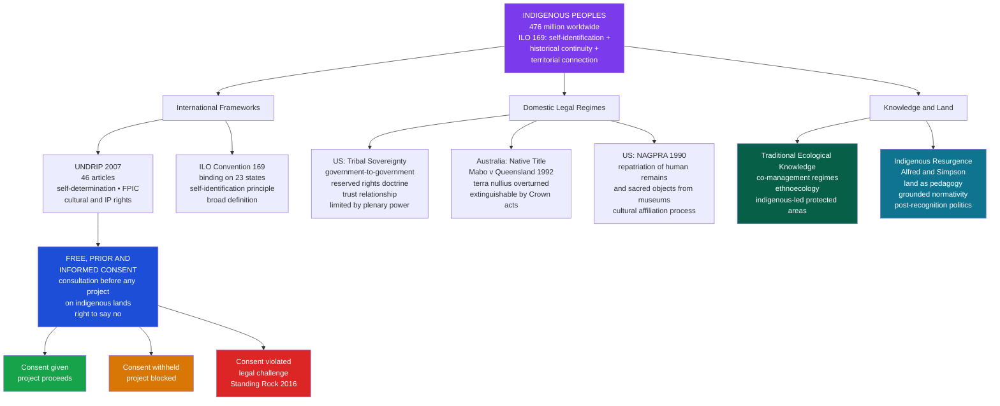

# Indigenous Rights and Sovereignty

> [!abstract] TL;DR
> Indigenous peoples — 476 million people across 90 countries, constituting 5% of humanity but protecting 80% of remaining global biodiversity — hold rights to land, self-determination, and cultural survival codified in the 2007 UN Declaration on the Rights of Indigenous Peoples (UNDRIP); those rights are structurally contested by state sovereignty doctrines, extractive capitalism, and the colonial legal fiction that indigenous-occupied lands were legally empty at the moment of European contact.

---

## Intuition

**Analogy:** Imagine a family that has maintained a house for 500 generations — cultivating the garden, mapping every crack in the walls, developing a detailed oral manual for keeping the roof watertight. One morning, a government surveyor arrives with a deed that declares the land "unoccupied" because the family never filed paperwork with an institution that did not exist when they built the house. The deed is issued to a mining company. The family's protest now goes before a court system created by the very same government — where their proof of ownership must be expressed in a legal language invented after the dispossession and by the dispossessor.

This is the structural condition of indigenous rights: peoples who preceded the states that now judge their claims must navigate legal frameworks designed without them, prove continuous occupation to standards set by those who interrupted that occupation, and argue for a form of sovereignty that state doctrine defines as subordinate to its own. The question is not whether indigenous rights are real — ethically or historically — but whether the institutions available to adjudicate them can recognize them without simultaneously domesticating and diminishing them.

---

## How It Works



---

## Key Concepts

### Secondary Level

**Who Are Indigenous Peoples? The ILO 169 Definition**

There is no single authoritative legal definition of "indigenous peoples," and the politics of that absence are significant — states have often resisted a universal definition because recognizing indigenous status triggers legal obligations. The most widely applied operational framework comes from ILO Convention 169 (1989), which uses three cumulative criteria:

1. **Historical continuity**: descent from populations that occupied a territory before colonization or the formation of the current state
2. **Territorial connection**: a special, constitutive relationship with the lands and resources of an ancestral territory
3. **Self-identification**: the community identifies itself as indigenous, and this self-identification is the most fundamental criterion — no external authority gets to decide who is or is not indigenous on behalf of the community

Applying these criteria globally, the UN estimates approximately 476 million indigenous people across 90 countries, speaking roughly 7,000 of the world's 8,000 languages. Despite being 5% of the global population, indigenous peoples manage or have tenure over territories that contain roughly 80% of the world's remaining biodiversity — a correlation that is not coincidental but reflects millennia of land stewardship.

The politics of recognition are fraught in both directions: some states refuse to recognize any indigenous peoples within their borders (China, India), arguing that all citizens are equally citizens; other states recognize indigenous status selectively, admitting some groups while excluding politically inconvenient others. Some communities resist the "indigenous" label itself — seeing it as a Western categorization that homogenizes extremely diverse peoples — while strategically deploying it in international legal forums where it opens doors unavailable under minority-rights frameworks.

**UNDRIP: The UN Declaration on the Rights of Indigenous Peoples (2007)**

Adopted by the UN General Assembly on 13 September 2007 by a vote of 144 in favor, 4 against (the United States, Canada, Australia, and New Zealand — all settler-colonial states with large indigenous populations and ongoing land disputes), and 11 abstentions, UNDRIP is the most comprehensive international statement of indigenous rights ever produced. It took 25 years to negotiate.

Its 46 articles cover:
- **Self-determination**: indigenous peoples have the right to freely determine their political status and pursue their economic, social, and cultural development (Article 3)
- **Autonomy and self-government**: the right to maintain and strengthen their distinct political, legal, economic, social, and cultural institutions (Article 4)
- **Free, Prior and Informed Consent (FPIC)**: states shall consult with indigenous peoples — through their own representative institutions — before adopting legislative or administrative measures that may affect them, and shall obtain their FPIC before approving any project affecting their lands, territories, or resources (Articles 19, 32)
- **Land, territory, and resources**: the right to own, use, develop, and control lands they have traditionally owned, occupied, or used (Article 26)
- **Cultural and intellectual property**: rights to maintain, control, protect, and develop cultural heritage, traditional knowledge, and traditional cultural expressions (Article 31)
- **Repatriation**: states shall provide effective mechanisms for repatriation of ceremonial objects and human remains (Article 12)

UNDRIP is a declaration, not a binding treaty — it creates no automatic legal obligations under international law. Its political force operates through norm diffusion: it establishes a standard of legitimacy that states violate at reputational cost, provides a benchmark for domestic courts interpreting indigenous rights, and gives indigenous advocacy organizations an authoritative reference point in negotiations.

All four states that initially voted against eventually endorsed the declaration: Australia in 2009, Canada and New Zealand in 2010, and the United States in 2010.

**Terra Nullius and Its Dismantling**

*Terra nullius* ("land of no one") was the legal fiction used by European colonial powers to justify claiming as their sovereign territory land that was manifestly occupied by millions of people. The doctrine held that land could only be legally "possessed" if it was cultivated and improved in ways recognizable to European law — permanent agriculture, private property titles, fixed political boundaries. Mobile pastoralists, forest-dwelling cultivators, and hunter-gatherers were defined as not "using" the land in the relevant legal sense, which made it available for sovereign acquisition.

Terra nullius was not overturned in Australian law until the High Court's landmark ruling in *Mabo v Queensland* (1992), in which Eddie Koiki Mabo of the Meriam People of the Murray Islands demonstrated continuous and exclusive occupation of Mer Island before, during, and after British annexation in 1879. The Court held that the common law of Australia recognized a form of native title where indigenous peoples had maintained a connection to their country and that connection had not been extinguished by subsequent Crown grants. Mabo died of cancer four months before the judgment was handed down.

**Free, Prior and Informed Consent (FPIC): The Basics**

FPIC is a principle — now embedded in UNDRIP and in the operational policies of major development banks — that requires developers seeking to use indigenous lands to:

- **Free**: obtain consent without coercion, manipulation, or inducement
- **Prior**: begin consultation before the project is designed, not as a post-hoc rubber stamp
- **Informed**: provide complete, accessible, culturally appropriate information about the project's nature, scope, and likely impacts
- **Consent**: not merely consult (which can mean informing and then proceeding regardless) but actually obtain the community's agreement — and accept its refusal

In principle, FPIC gives indigenous communities a genuine veto over projects on their territories. In practice, the implementation gap is enormous: "consultation" is routinely conducted after decisions have already been made, communities are divided by selective benefit-sharing with cooperative factions, and states interpret their obligation to "consult" as distinct from any obligation to be bound by the outcome of that consultation.

**NAGPRA: Repatriation of Ancestral Remains**

The Native American Graves Protection and Repatriation Act (NAGPRA), enacted in the United States in 1990, requires federal agencies and institutions receiving federal funding to inventory human remains, funerary objects, sacred objects, and objects of cultural patrimony in their collections, identify affiliated Native American tribes or Native Hawaiian organizations, and repatriate those items upon request.

NAGPRA transformed the ethics of American museums and dramatically shifted the power dynamic between scientific institutions and indigenous communities over who controls the dead. Its most contested case was Kennewick Man — skeletal remains found in Washington State in 1996, dated to approximately 9,000 years ago — over which a coalition of tribes (Umatilla, Yakama, Nez Perce, Colville, and Wanapum) asserted cultural affiliation and requested repatriation, while a group of physical anthropologists argued the remains were too old to establish tribal connection and were a scientific resource. After 20 years of legal battles, the Army Corps of Engineers determined in 2017 that Kennewick Man was "Native American" under NAGPRA, and the remains were reburied as The Ancient One in a ceremony led by the Colville Confederated Tribes.

---

### Undergraduate Level

**Tribal Sovereignty in the United States: Structure and Limits**

The United States has the most developed body of domestic indigenous rights law of any settler state, rooted in nearly 200 years of treaty-making, congressional legislation, and Supreme Court jurisprudence. Its foundations were laid in three early Marshall Court decisions (the "Marshall Trilogy"): *Johnson v M'Intosh* (1823), *Cherokee Nation v Georgia* (1831), and *Worcester v Georgia* (1832).

The core architecture consists of four interlocking doctrines:

| Doctrine | Content | Implication |
|----------|---------|-------------|
| **Government-to-government relationship** | Tribal nations are distinct political entities, not racial minorities or special interest groups | Federal dealings with tribes proceed through the political branches, not as civil rights matters |
| **Reserved rights doctrine** | Treaties are interpreted to preserve for tribes all rights not expressly ceded; any ambiguity is resolved in favor of the tribe | The sovereign "reserves" what it does not give away |
| **Trust responsibility** | The federal government holds a fiduciary duty to protect tribal lands, assets, and welfare | Tribes can sue the US for breach of trust; the Crown/US is trustee of tribal assets |
| **Plenary power doctrine** | Congress holds virtually unlimited authority to modify, abrogate, or terminate tribal rights by legislation | Congress can, and has, unilaterally extinguished treaty rights; tribal sovereignty exists at congressional sufferance |

The plenary power doctrine is the fatal constraint. It means that tribal sovereignty, however real in day-to-day governance, can be legislatively eliminated at any time without constitutional challenge. This was exercised brutally during the Termination Era (1950s–1960s), when Congress enacted policies formally dissolving the recognized status of over 100 tribes, stripping them of federal services and subjecting their lands to state taxation and individual allotment. The policy was largely reversed by the Indian Self-Determination and Education Assistance Act (1975), but the underlying congressional plenary authority was never revoked.

**The Fourth World: George Manuel and Indigenous Nationalism**

In 1974, Shuswap leader and National Indian Brotherhood president George Manuel coined the concept of the "Fourth World" — a category for the world's indigenous and stateless nations that cut across the Cold War's First/Second/Third World taxonomy. The First World (Western capitalism), Second World (Soviet bloc), and Third World (non-aligned decolonizing nations) all shared one feature: they were organized around sovereign states. Indigenous peoples were not decolonizing nations establishing their own states; they were *nations within states*, seeking recognition not as separate sovereign polities but as distinct peoples with rights of self-determination within the territorial frame of existing states.

Manuel's concept was institutionally realized in the formation of the World Council of Indigenous Peoples (1975), which brought together representatives from across North America, Scandinavia, Australia, and New Zealand, and became the first indigenous body to achieve consultative status with the United Nations. It established the precedent of indigenous peoples organizing transnationally, across state borders, as a category with shared political interests — a move that eventually produced UNDRIP.

**Mabo and the Limits of Native Title in Australia**

The *Mabo* decision (1992) was revolutionary in principle but constrained in practice by its own legal logic. The High Court held that native title survived colonization where:
1. The group maintained a continuous connection with the land under traditional laws and customs
2. That connection had not been legally extinguished

The extinguishment clause was the structural limit. Subsequent case law (*Wik* 1996, *Yorta Yorta* 2002) established that pastoral leases did not automatically extinguish native title but that proof requirements were stringent: claimants had to demonstrate an unbroken chain of traditional law and custom from pre-contact society to the present — in courts that applied standards of historical evidence favorable to documentary over oral proof. The *Yorta Yorta* case failed precisely because the judge held that the claimants' traditional law had been "washed away by the tide of history" — a formulation many scholars characterized as requiring indigenous peoples to prove they had been untouched by the very colonial history imposed on them.

**Traditional Ecological Knowledge (TEK) and Co-Management**

Traditional ecological knowledge refers to the cumulative body of knowledge, practices, and beliefs about the relationships among living beings — including humans — and their environment, evolved by adaptive processes and handed down through generations. TEK is not merely "folk ecology" — it is often highly sophisticated, fine-grained, and ecologically accurate, sometimes providing information that instrument-based science cannot access (species distribution patterns over centuries; pre-agricultural vegetation; long-cycle climate phenomena).

Co-management arrangements — joint governance frameworks in which indigenous peoples and state agencies share authority over resource management — have become the dominant institutional model for integrating TEK with government conservation programs. Examples include:

- **Nunavut Land Claims Agreement (1993, Canada)**: Nunavut Tunngavik Incorporated co-manages wildlife with the territorial government; Inuit hunters hold seats on the Nunavut Wildlife Management Board
- **Great Barrier Reef Marine Park**: co-managed with the Gunganyji, Yirrganydji, and 70+ other Traditional Custodian groups
- **Biocultural landscape management in Mexico**: indigenous community-managed forests in Oaxaca (comunidades forestales) achieve deforestation rates 3–5 times lower than national parks

The co-management model is politically appealing but academically contested: it can reproduce dependency relationships if indigenous partners are structured as advisory rather than decision-making; TEK is often extracted and absorbed into state management frameworks without transferring genuine decision-making authority; and the demand for "commensurability" between TEK and Western scientific categories may distort both.

**The Land Back Movement and Extractive Conflict**

The "Land Back" framework — broadly, the assertion that colonized territories should be returned to indigenous stewardship — exists on a spectrum from electoral advocacy for treaty implementation to radical decolonial theory. Its intellectual antecedents include Vine Deloria Jr.'s *Custer Died for Your Sins* (1969) and the American Indian Movement occupations of the 1970s; its current iteration mobilizes across digital platforms, legal challenges, and direct action.

The most internationally visible confrontation was the Standing Rock NoDAPL (No Dakota Access Pipeline) movement of 2016, in which the Standing Rock Sioux Tribe and allies occupied land along the proposed route of the Dakota Access Pipeline, which would cross the Missouri River one mile upstream from the reservation and through lands held sacred by the tribe, including burial grounds. The tribe argued the Army Corps of Engineers violated NEPA (National Environmental Policy Act) and NHPA (National Historic Preservation Act) by failing to adequately consult. The Obama administration halted the project in November 2016 to conduct additional review; the Trump administration reversed this and the pipeline became operational in 2017. Federal courts subsequently found procedural violations, ordering additional environmental reviews — and the Biden administration's Army Corps of Engineers determined in 2021 that the environmental impact statement was insufficient.

The Standing Rock movement was significant beyond its immediate legal outcome: it globalized indigenous opposition to extractive capitalism, drew connections between pipeline resistance, treaty rights, climate activism, and water sovereignty, and demonstrated that FPIC violations could generate sustained international attention.

**Bio-piracy and Traditional Knowledge Protection**

Bio-piracy refers to the appropriation of biological resources and associated traditional knowledge — crop varieties, medicinal plants, preparation techniques — from indigenous communities without consent or benefit-sharing, typically through patent and intellectual property mechanisms. Landmark cases include:

- **Neem tree** (India): a US company patented a fungicidal use of neem extracts known to Indian traditional medicine for centuries; the European Patent Office revoked the patent in 2000 after a challenge led by the Research Foundation for Science, Technology and Ecology
- **Ayahuasca** (Amazon): an American citizen received a US patent on a cultivated variety of Banisteriopsis caapi — the vine used in shamanic ritual across the Amazon — despite its millennia-long use; the patent was partially revoked after challenge
- **Quinoa** (Andes): US researchers claimed patent rights on a traditional Bolivian quinoa variety; Bolivian farmer organizations mobilized to block commercialization

The international legal response has been partial. The Convention on Biological Diversity (CBD, 1992) and its Nagoya Protocol (2010) established an access and benefit-sharing framework requiring states to ensure prior informed consent from indigenous communities for access to genetic resources and to negotiate fair benefit-sharing agreements. Implementation remains uneven: the United States has not ratified the CBD.

The UNESCO Convention for the Safeguarding of the Intangible Cultural Heritage (2003) provides a parallel framework for non-material knowledge — oral traditions, performing arts, social practices, rituals, festive events — but focuses on documentation and safeguarding rather than proprietary control, leaving the commodification question unresolved.

---

### Graduate Level

**Settler Colonialism as Structure: Patrick Wolfe's Logic of Elimination**

Patrick Wolfe's distinction between colonialism and settler colonialism is the foundational analytical move in the field. Classical colonial projects were extractive: they sought labor and resources from indigenous populations, who were therefore needed — "alive and working." Settler colonialism is eliminatory: the settler comes to stay, and the indigenous presence is structurally in the way.

Wolfe's formulation — **"invasion is a structure, not an event"** — means settler colonialism should not be understood as a historical episode that happened and ended. The logic of elimination persists in ongoing land tenure arrangements, in legal doctrines that extinguish native title, in forced assimilation policies, in the disruption of reproduction through child removal (residential schools in Canada, stolen generations in Australia). The goal is to produce a territory in which the settler is the natural inhabitant and the indigenous presence is either removed or residualized as a heritage artifact.

This framework reframes UNDRIP, native title, and tribal sovereignty not as progressive resolution of a historical injustice but as contemporary phases of an ongoing structure: recognition is offered because the logic of elimination has not succeeded and must adapt. The state incorporates indigenous land claims into property law (native title) precisely because converting land relationships into property categories allows the market to do the eliminatory work that brute force once did — extinguishment by alienability, subdivision, and sale.

**The Politics of Recognition: Glen Coulthard's Critique**

Glen Coulthard (Yellowknives Dene) in *Red Skin, White Masks: Rejecting the Colonial Politics of Recognition* (2014) applies Fanon's analysis of colonial subjectivity to critique liberal recognition politics. His argument proceeds in three steps:

1. **Hegel's master-slave dialectic**, adopted by Charles Taylor's liberal multiculturalism and Will Kymlicka's minority rights framework, holds that recognition by the state is the mechanism by which subjects achieve dignity and freedom. Recognition politics — land claims, constitutional recognition, treaty implementation — becomes the horizon of indigenous political aspiration.

2. **Coulthard, following Fanon**, argues that in colonial contexts, recognition does not produce self-determining subjects — it produces "colonial subjects who have come to see themselves and their aspirations through the eyes of their colonial masters." A Dene community that achieves native title has been recognized, but it has also been made to prove its identity in colonial courts, accept the extinguishment provisions that come with recognition, and translate its relationship to land into property categories that are fundamentally alien to it.

3. The alternative is **grounded normativity**: the ethical frameworks and relational practices generated by the land itself — not by the desire for recognition from the state, but by the ongoing responsibility to land, kin, and community that precedes and exceeds the state. Grounded normativity is not nostalgia for a pre-colonial past; it is the live practice of land-based ethics that frames indigenous political resurgence.

**Indigenous Resurgence Theory: Alfred, Simpson, and Land as Pedagogy**

Taiaiake Alfred (Mohawk) and Leanne Betasamosake Simpson (Michi Saagiig Nishnaabeg) represent the resurgence wing of indigenous political theory — a shift from state-oriented rights claims toward the revitalization of indigenous political, cultural, and intellectual traditions on their own terms.

Alfred's *Peace, Power, Righteousness* (1999) and *Wasáse* (2005) argue that indigenous peoples cannot achieve decolonization through engagement with the state, because the state's terms of engagement — property, sovereignty, rights — already encode colonial categories that require indigenous peoples to dismantle themselves to qualify. True self-determination requires reconstructing indigenous political life from within: restoring language, ceremony, governance structures, and land relationships without waiting for colonial validation.

Simpson's *As We Have Always Done: Indigenous Freedom Through Radical Resurgence* (2017) develops what she calls **"land as pedagogy"** — the idea that land is not property, resource, or territory but a system of relationships from which knowledge, ethics, and governance emerge. Learning to live with land — hunting, harvesting, making, ceremony — is simultaneously epistemological and political: it reproduces an indigenous world that is not just culturally distinct but ontologically different from the settler-colonial world organized around land as commodity.

The resurgence framework has been criticized for an apparent de-politicization — for turning away from the institutional sites where colonial power operates toward cultural revitalization. Simpson and Alfred both respond that cultural revitalization *is* political transformation: a people who renew their languages, land practices, and governance traditions become ungovernable by colonial categories, and that is the precondition of any genuine political change.

**Ontological Politics and the Limits of Liberal Pluralism**

Mario Blaser and Arturo Escobar develop a related but distinct critique through what they call **"ontological politics"** — the argument that indigenous claims are not merely cultural differences within a shared world but expressions of genuinely different worlds (ontologies) that cannot be fully translated into the categories of liberal pluralism.

Where liberal multiculturalism treats indigenous peoples as holding different *beliefs* about the same world (beliefs that deserve respect), ontological politics holds that indigenous territories are constituted by different *relationships* — between humans, non-humans, spirits, land, time — that produce a world with different properties. The demand for FPIC, from this perspective, is not just a claim to procedural fairness within a shared legal system; it is a claim that the very project of "assessing the impact" of a pipeline on indigenous territory presupposes a relationship to land (land-as-resource subject to environmental impact scoring) that is itself a colonial imposition.

This creates a fundamental incommensurability problem for liberal rights frameworks: if indigenous rights are expressed in the language of rights (individual or collective), they are already being translated into a framework that cannot recognize what makes them distinctively indigenous.

**The FPIC Implementation Gap: Structural Analysis**

The empirical record on FPIC implementation across different legal contexts reveals a consistent structural pattern: FPIC functions as a procedural requirement that can satisfy its own formal criteria while delivering no genuine consent:

- **Divide-and-conquer consultation**: developers consult with leadership willing to negotiate, manufacturing a "community decision" that masks internal division
- **Information asymmetry**: communities are consulted on complex technical documents (environmental impact assessments running thousands of pages) with inadequate time, resources, or technical capacity to evaluate them
- **Temporal manipulation**: consultation occurs after environmental assessments are submitted and regulatory processes are in motion, creating institutional momentum that is politically difficult to reverse
- **Benefit-sharing as neutralization**: selective employment guarantees and community benefit funds divide communities between those who stand to gain from the project and those who bear its costs
- **Jurisdictional fragmentation**: in federal systems (Canada, US, Australia), both state/provincial and federal governments may claim authority to authorize projects, creating multiple consultation processes each of which can be formally satisfied while none actually obtains genuine consent

Scholars in the political ecology tradition (Bram Büscher, Lorenzo Cotula, Kirsty Gover) argue that the institutionalization of FPIC within development bank policy and state law has paradoxically strengthened the legitimacy of extractive projects: developers who complete FPIC processes can now claim they "consulted indigenous peoples" regardless of outcome, insulating projects from reputational challenges they would otherwise face.

---

## Python Demo

```python
import numpy as np
import matplotlib.pyplot as plt

# Simulate indigenous land retention under different legal protection regimes.
# Each of N_PARCELS land units cycles through three states each time step:
#   State 0 = Alienated  (state/settler controlled)
#   State 1 = Protected  (legally recognized indigenous territory, e.g. native title, reservation)
#   State 2 = Traditional (actively managed under indigenous governance, no formal state recognition)
# Starting condition (loosely calibrated to global 1900 baselines):
#   20% already alienated, 10% formally protected, 70% traditionally managed

np.random.seed(42)
N_PARCELS = 1000
N_STEPS   = 120

def simulate_land(p_trad_to_alien, p_trad_to_prot,
                  p_prot_to_alien, p_alien_to_prot):
    """Run one simulation of land-state transitions under a given policy regime."""
    state   = np.random.choice([0, 1, 2], size=N_PARCELS, p=[0.20, 0.10, 0.70])
    history = np.zeros((N_STEPS, 3))

    for t in range(N_STEPS):
        history[t] = np.bincount(state, minlength=3) / N_PARCELS
        rng       = np.random.random(N_PARCELS)
        new_state = state.copy()

        trad  = state == 2
        prot  = state == 1
        alien = state == 0

        # Traditional parcels: face alienation OR gain legal recognition
        new_state[trad & (rng < p_trad_to_alien)] = 0
        threshold = p_trad_to_alien + p_trad_to_prot
        new_state[trad & (rng >= p_trad_to_alien) & (rng < threshold)] = 1

        # Protected parcels: can be alienated by treaty violation / override
        new_state[prot & (rng < p_prot_to_alien)] = 0

        # Alienated parcels: can be restored via land-back / court-ordered restitution
        new_state[alien & (rng < p_alien_to_prot)] = 1

        state = new_state

    return history

# ── Three policy regimes ──────────────────────────────────────────────────────
# Regime 1: No legal protection (colonial era, pre-UNDRIP baseline)
#   High alienation pressure on both traditional and "protected" land;
#   no restoration pathway.
h_no_prot = simulate_land(
    p_trad_to_alien=0.10, p_trad_to_prot=0.005,
    p_prot_to_alien=0.08, p_alien_to_prot=0.000
)

# Regime 2: FPIC / UNDRIP regime
#   Formal legal recognition pathway opens; protected land harder to alienate;
#   small but nonzero restoration from alienated.
h_fpic = simulate_land(
    p_trad_to_alien=0.03, p_trad_to_prot=0.04,
    p_prot_to_alien=0.005, p_alien_to_prot=0.005
)

# Regime 3: Land Back scenario
#   Active restitution policy; very low new alienation; alienated parcels
#   restored at meaningful rate through court orders and government transfers.
h_land_back = simulate_land(
    p_trad_to_alien=0.01, p_trad_to_prot=0.05,
    p_prot_to_alien=0.002, p_alien_to_prot=0.030
)

# ── Plot ──────────────────────────────────────────────────────────────────────
fig, axes = plt.subplots(1, 3, figsize=(16, 5), sharey=True)
colors = ["#dc2626", "#d97706", "#16a34a"]
labels = ["Alienated (state/settler)", "Legally Protected", "Traditionally Managed"]
titles = [
    "No Legal Protection\n(Colonial Regime)",
    "FPIC / UNDRIP Regime",
    "Land Back Scenario"
]
steps = np.arange(N_STEPS)

for ax, history, title in zip(axes, [h_no_prot, h_fpic, h_land_back], titles):
    for i, (color, label) in enumerate(zip(colors, labels)):
        ax.plot(steps, history[:, i], color=color, linewidth=2.5, label=label)
    ax.set_title(title, fontsize=11, fontweight="bold")
    ax.set_xlabel("Time steps (policy generations)")
    ax.set_ylabel("Proportion of territory")
    ax.set_ylim(0, 1.02)
    ax.legend(fontsize=8, loc="center right")
    ax.grid(alpha=0.3)

plt.suptitle(
    "Indigenous Land Retention Under Different Legal Protection Regimes\n"
    "States: 0=Alienated (red)  |  1=Legally Protected (orange)  |  2=Traditionally Managed (green)",
    fontsize=11, fontweight="bold"
)
plt.tight_layout()
plt.savefig("indigenous_land_simulation.png", dpi=150, bbox_inches="tight")
plt.show()

# ── Terminal summary ──────────────────────────────────────────────────────────
for name, hist in [("No Protection", h_no_prot),
                   ("FPIC/UNDRIP",   h_fpic),
                   ("Land Back",     h_land_back)]:
    final = hist[-1]
    print(f"{name:15s}  Alienated={final[0]:.1%}  Protected={final[1]:.1%}  Traditional={final[2]:.1%}")
```

**What the simulation shows:** Under the colonial baseline, nearly all traditional land is alienated within ~50 time steps and the protected category collapses — the system converges toward near-total alienation. Under FPIC/UNDRIP, the traditional category declines more slowly and the protected category grows substantially, but alienation continues at a lower rate; the long-run equilibrium still shows significant alienated land because FPIC slows but does not reverse the structural dynamic. Only the Land Back scenario reverses the trajectory: alienated land declines as restoration exceeds new alienation, and traditionally managed territory stabilizes at a higher level. The simulation is deliberately stylized — real land trajectories are shaped by specific legal systems, resource endowments, and political conditions — but it captures the structural logic that protection regimes affect not just the rate of loss but the direction of travel.

---

## Real-World Applications

> **Standing Rock and the NoDAPL Movement (2016):** The Dakota Access Pipeline (DAPL), designed to carry crude oil 1,172 miles from the Bakken oil fields to Illinois, was rerouted by the Army Corps of Engineers away from Bismarck, ND — a predominantly white city — to pass one mile upstream from the Standing Rock Sioux Tribe's reservation and through land the tribe considers part of its unceded ancestral territory under the 1851 and 1868 Fort Laramie Treaties. The tribe argued the Army Corps violated its NEPA and NHPA consultation obligations, failed to obtain FPIC, and endangered the tribe's primary water source. The Standing Rock movement drew over 10,000 water protectors from 300+ tribes and became the most prominent indigenous rights mobilization in decades. It illustrated FPIC's implementation gap (the Corps held meetings it counted as consultation, the tribe disputed their adequacy), the intersection of indigenous rights with climate politics, and the fragility of Obama-era protections under executive reversal. Federal courts ultimately found the environmental review inadequate, but the pipeline remains operational.

> **Mabo v Queensland (1992) and the Limits of Native Title:** The High Court's overthrow of terra nullius gave indigenous Australians a legal pathway to claim rights over unceded Crown land for the first time. But the Native Title Act (1993), enacted to implement the ruling, built extinguishment deeply into its architecture: freehold grants, infrastructure construction, and most pastoral leases were deemed to have extinguished native title, removing the vast majority of Australia's land mass from potential claims. The *Yorta Yorta* decision (2002) further imposed a continuity requirement so strict that communities whose traditional practices had been disrupted by colonial policies could be found to have "lost" their native title — effectively penalizing indigenous peoples for the disruption imposed on them.

> **NAGPRA and the Kennewick Man Case:** The 20-year dispute over 9,000-year-old skeletal remains found on the banks of the Columbia River exemplifies the collision between scientific research interests and indigenous sovereignty over the dead. Physical anthropologists sought to study the remains, arguing their great antiquity meant no demonstrable cultural affiliation to any existing tribe. The Umatilla and four allied tribes insisted the remains were their ancestor and must be returned under their law. The eventual reburial (2017) following the Obama administration's NAGPRA interpretation established a legal precedent that pre-Columbian age alone does not override indigenous repatriation rights — but only after two decades of litigation and political mobilization.

> **Sarayaku v Ecuador (Inter-American Court of Human Rights, 2012):** The Kichwa People of Sarayaku in Ecuador successfully argued before the Inter-American Court that the Ecuadorian state violated their right to consultation (FPIC) when it granted oil exploration concessions over their territory in the 1990s without their consent. The Court ordered Ecuador to remove 1,433 kg of buried explosives deposited by the oil company, pay reparations, and create a public radio broadcast acknowledging the violation. This was the first international human rights court ruling to order actual remediation of FPIC violations — establishing that FPIC has binding force under American human rights law even absent specific domestic legislation.

---

## Common Pitfalls

- **Consultation-consent conflation** — Governments and courts routinely satisfy their FPIC obligations procedurally by conducting consultation meetings, even when those meetings occur after decisions are effectively made. FPIC requires genuine consent, not merely documented consultation; the failure to distinguish the two is the primary mechanism by which the doctrine is institutionalized while being emptied of substance.

- **The "ecological Indian" essentialism trap** — Assuming that all indigenous communities are inherently conservationist, spiritually harmonious with nature, or culturally static freezes diverse peoples into an ahistorical archetype and makes their rights conditional on performing a romantic indigeneity. Some indigenous communities have embraced resource extraction on their own terms; their right to do so is part of self-determination, not a betrayal of it.

- **Treating tribal sovereignty as equivalent to state sovereignty** — Tribal sovereignty in the US is real but fundamentally different from state sovereignty: it is domestic, not international; it is limited by congressional plenary power; and it exists in a trust relationship with a federal government that has historically been the primary threat to tribal interests. Analogizing tribal to state sovereignty misleads on the nature of the legal relationship.

- **Terra nullius as historical anachronism** — Terra nullius is sometimes treated as a defunct colonial doctrine safely buried by Mabo. In practice, its logic persists in extinguishment provisions of native title law, in planning regulations that define productive use in ways that exclude indigenous land relationships, and in international investment treaties that treat indigenous territories as sovereign state territory without indigenous encumbrance.

- **Recognition as resolution** — Liberal rights frameworks tend to treat recognition (native title, treaty implementation, UNDRIP endorsement) as the culmination of indigenous rights struggles, when resurgence theory argues recognition is at best a partial, often counterproductive step. Recognition that translates indigenous relationships into state-legible property categories may achieve legal standing while eroding the practices and governance structures that constitute the thing being protected.

- **Conflating UNDRIP with binding law** — UNDRIP is a declaration, not a treaty. It establishes international norms, not enforceable obligations. In jurisdictions without domestic implementing legislation, UNDRIP's provisions are aspirational. Advocates who cite UNDRIP in legal proceedings must demonstrate that its norms have been incorporated into domestic law or recognized as customary international law — a higher evidentiary bar.

---

## Related Concepts

**Anthropology vault:**
- [[Political_Anthropology_and_Power]] — the foundational analysis of political authority types (band, tribe, chiefdom, state) that contextualizes what is at stake when indigenous nations assert sovereignty against state structures
- [[Historical_and_Contemporary_Archaeology]] — covers NAGPRA, repatriation ethics, and public archaeology in depth; directly connected through the politics of who owns ancestral remains and cultural objects
- [[Four_Fields_of_Anthropology]] — the disciplinary context: applied and legal anthropology emerged from the tensions within the four-field framework over colonial complicity
- [[Ethnographic_Methods_and_Fieldwork]] — raises the ethics of research with indigenous communities; FPIC principles directly shaped research ethics codes; participatory and community-based research methods
- [[Classical_Anthropological_Theory]] — the colonial history of anthropology as a discipline that served colonial administrations while claiming scientific objectivity; Morgan's evolutionary schema that placed "savages" below "barbarians" directly scaffolded terra nullius-type reasoning
- [[Culture_Symbols_and_Meaning]] — cultural heritage, sacred objects, and the meaning of repatriation cannot be understood without a theory of how symbols carry social identity and political authority
- [[Religion_Magic_and_Ritual]] — sacred sites, ceremonial objects, and ancestral remains are at the core of NAGPRA and international cultural heritage law; religion is not separable from territorial and political claims
- [[Biocultural_Anthropology]] — traditional ecological knowledge, the human-landscape relationships that constitute TEK, and the health consequences of territorial dispossession are all biocultural phenomena

**Political Science vault:**
- [[Human_Rights_and_International_Law]] — UNDRIP exists within the broader architecture of international human rights; its status as declaration rather than treaty reflects the same gaps in enforcement that characterize the human rights system generally
- [[The_State_System_and_Sovereignty]] — the Westphalian sovereign state system is the structural context against which indigenous sovereignty claims operate; the tension between state sovereignty and indigenous self-determination is a direct consequence of how sovereignty was defined in the 17th century
- [[Climate_Politics_and_Environmental_Governance]] — indigenous communities are disproportionately affected by climate change; indigenous-led territories are among the most effective carbon sinks; indigenous climate activism (Standing Rock, Amazon forest defense) links territorial sovereignty to climate action
- [[Federalism_and_Decentralization]] — tribal sovereignty in the US, First Nations rights in Canada, and Australian native title all operate within federal systems where jurisdictional complexity between state/provincial and federal governments determines the effective scope of indigenous rights

**Sociology vault:**
- [[Race_Ethnicity_and_Racism]] — indigenous peoples occupy a specific position in racial orders that conflates race, culture, and territorial belonging; the politics of recognition are shaped by racial hierarchies that determine whose claims are taken seriously and whose are dismissed
- [[Nationalism_Ethnicity_and_Collective_Identity]] — the Fourth World framework positions indigenous peoples as nations without states; indigenous nationalism is a distinct form of ethnonational mobilization that does not seek a separate state but recognition within existing ones
- [[Social_Movements_and_Revolution]] — Standing Rock, the Idle No More movement (Canada, 2012), the Zapatistas (Mexico, 1994), and the Amazon indigenous land defense are among the most significant contemporary social movements; they connect indigenous rights to broader coalitions around climate, economic justice, and democracy
- [[Global_Inequality_and_Development]] — indigenous peoples consistently rank at the bottom of development indicators in every country where data exist; the structural connection between territorial dispossession and poverty is the developmental dimension of indigenous rights

- [[_MOC_Applied_and_Global_Anthropology|↑ Applied and Global Anthropology MOC]]

---

## Review Questions

### Secondary

1. ILO Convention 169 identifies three criteria for determining who is indigenous. What are they, and why does it treat self-identification as the most important — rather than, say, genetic ancestry or government certification?

2. The United States, Canada, Australia, and New Zealand all voted against UNDRIP in 2007 but later endorsed it. What do these four countries have in common, and what specific provisions of UNDRIP were most likely to concern their governments?

3. What was terra nullius, what legal and moral argument did it make, and what did the Mabo decision actually overturn — and what did it leave in place?

---

### Undergraduate

1. Explain the four doctrines that structure tribal sovereignty in the United States — government-to-government relationship, reserved rights, trust responsibility, and plenary power. In what ways does the plenary power doctrine undermine the other three, and what historical episodes demonstrate this?

2. Compare FPIC as a principle with FPIC as actually implemented in a major extractive industry case (Standing Rock, Sarayaku, or another of your choice). What structural factors determine whether FPIC operates as a genuine veto or as procedural window-dressing?

3. What is traditional ecological knowledge (TEK), and what are the main arguments both for and against integrating it with state-managed conservation through co-management arrangements? Under what institutional conditions does co-management genuinely share power rather than extract knowledge while retaining decision-making authority?

---

### Graduate

1. Glen Coulthard argues, drawing on Fanon, that the politics of recognition ultimately reproduces colonial subjectivity even when indigenous claims succeed. Explain the Hegelian model of recognition that liberal multiculturalism employs, why Coulthard thinks it fails in colonial contexts, and what "grounded normativity" offers as an alternative political horizon. What are the strongest objections to his position?

2. Patrick Wolfe claims that settler colonialism is "a structure, not an event" operating through a "logic of elimination." Distinguish this claim from both classical colonialism and genocide. How does the logic of elimination manifest in contemporary legal forms — native title extinguishment provisions, termination-era legislation, and co-management models — rather than as explicit violence?

3. Mario Blaser and Arturo Escobar argue that indigenous territorial claims involve an "ontological politics" that cannot be fully captured by liberal rights frameworks, because they express not different cultural beliefs about the same world but different worlds with different properties. Evaluate this claim: does it provide analytical purchase that other frameworks miss, or does it risk making indigenous claims so incommensurable with state legal categories as to be strategically counterproductive?

---

## Sources

- [UNDRIP Full Text — United Nations](https://www.un.org/development/desa/indigenouspeoples/wp-content/uploads/sites/19/2018/11/UNDRIP_E_web.pdf)
- [ILO Convention 169 — International Labour Organization](https://www.ilo.org/dyn/normlex/en/f?p=NORMLEXPUB:12100:0::NO::P12100_ILO_CODE:C169)
- [Mabo v Queensland (No 2) — High Court of Australia, 1992](https://www.austlii.edu.au/cgi-bin/viewdoc/au/cases/cth/HCA/1992/23.html)
- [Coulthard, Glen. *Red Skin, White Masks: Rejecting the Colonial Politics of Recognition*. University of Minnesota Press, 2014.](https://www.upress.umn.edu/book-division/books/red-skin-white-masks)
- [Simpson, Leanne Betasamosake. *As We Have Always Done: Indigenous Freedom Through Radical Resurgence*. University of Minnesota Press, 2017.](https://www.upress.umn.edu/book-division/books/as-we-have-always-done)
- [Alfred, Taiaiake. *Wasáse: Indigenous Pathways of Action and Freedom*. University of Toronto Press, 2005.](https://utorontopress.com/9781442601055/wasase/)
- [Wolfe, Patrick. "Settler Colonialism and the Elimination of the Native." *Journal of Genocide Research* 8:4 (2006): 387–409.](https://doi.org/10.1080/14623520601056240)
- [NAGPRA — National Park Service Overview](https://www.nps.gov/subjects/nagpra/index.htm)
- [UN Permanent Forum on Indigenous Issues — Data and Statistics](https://www.un.org/development/desa/indigenouspeoples/about-us.html)
- [Sarayaku v Ecuador — Inter-American Court of Human Rights, 2012](https://www.corteidh.or.cr/docs/casos/articulos/seriec_245_ing.pdf)

---

#Anthropology #AppliedGlobalAnthropology #IndigenousRights #Sovereignty #UNDRIP #LandRights
