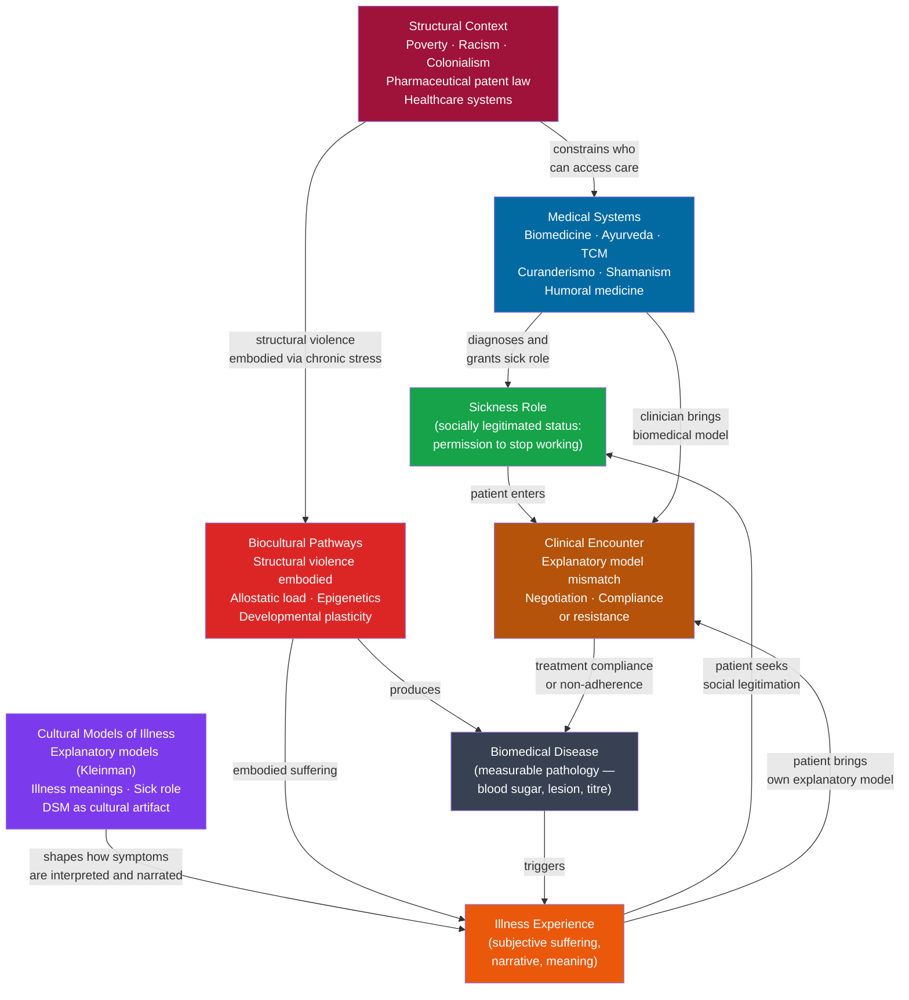

# Medical Anthropology

> [!abstract] TL;DR
> Medical anthropology examines health, illness, and healing as simultaneously biological, cultural, and political phenomena — insisting that what bodies suffer, how suffering is named, and who gets treated are products not of nature alone but of explanatory traditions, social power, and structural inequality. Its three anchoring insights are: the disease/illness/sickness triad (pathology, experience, and social role are distinct objects); Kleinman's explanatory model theory (patients and clinicians operate with incompatible frameworks that produce non-compliance); and Paul Farmer's structural violence thesis (poverty and racism are themselves causes of disease, not merely contexts for it).

---

## Intuition

**Analogy:** Imagine three people fall into the same pothole in the street. The first breaks an ankle. The second, on the same ankle injury, cannot tell their employer they are hurt because their visa status means any sick day triggers dismissal. The third, living near the pothole because it is the only housing their income allows, has already injured the same ankle twice before. Three people, one pothole — but three entirely different situations.

Now scale this up: who dug the pothole? Who filled it in (or didn't)? Who has insurance to pay for the X-ray? Whose pain is believed by the doctor and whose is dismissed? Who can afford the days off to recover?

Medical anthropology asks precisely these questions. It accepts the biological fact of the broken ankle — the pathology is real — but insists that the *experience* of suffering (how much it limits your life, how much it frightens you, what story you tell about why it happened to you), and the *social management* of suffering (whether you are entitled to rest, who treats you, whether treatment is accessible) are at least as consequential as the fracture itself. And it goes further: the structural conditions that determine who falls into potholes, who gets them fixed, and who pays for the consequences are not backdrop — they are, in the field's most powerful claim, *causes of disease* in their own right.

---

## How It Works

Medical anthropology operates at four nested analytical levels simultaneously, from structural to experiential, and insists that understanding any one level without the others distorts the picture.



The key insight embedded in this diagram: the arrow from structural context to both biocultural pathways *and* medical systems means that structural inequality simultaneously makes people sicker (by embodying stress and deprivation) and makes care harder to access. These are not two separate problems; they are the same structure acting through two mechanisms at once.

---

## Key Concepts

### Secondary Level

**The disease / illness / sickness triad.**

The most foundational analytical distinction in medical anthropology is among three things that ordinary language collapses into the word "sick":

- **Disease** is the biomedical object: measurable pathology — elevated HbA1c, a lesion on a scan, a positive PCR result. Disease is the clinician's domain. It is, in principle, observable independent of the patient's experience of it.

- **Illness** is the patient's domain: the subjective, lived experience of suffering and incapacity. Two people with identical HbA1c levels may experience their diabetes entirely differently — one barely notices it while following a familiar diet; the other organizes their entire identity and daily life around fear of complications. Illness is produced at the intersection of the biomedical condition, the person's biography and psychology, and the cultural meanings their community attaches to that condition.

- **Sickness** is the social domain: the publicly recognised status of being ill — the performance of the sick role (Parsons), the legitimate entitlement to rest, medical attention, and exemption from normal obligations. Sickness is socially negotiated: some diseases readily receive sickness status (you get a sick note for a broken leg); others struggle for it (chronic fatigue, long COVID, mental illness in many contexts); and others are actively denied it (undocumented migrants who cannot claim sick days without risking deportation).

Understanding health problems requires all three levels. A diabetes programme that addresses only disease (prescribing metformin) while ignoring the illness experience (the meaning of diabetes in a culture where food sharing is central to identity) and the sickness context (whether the patient can afford time off to attend clinic appointments) will systematically fail certain populations.

**Kleinman's explanatory models.**

Arthur Kleinman (1978, 1988) observed that patients and clinicians routinely hold incompatible explanatory models — systems of belief about what is causing an illness, why it affects this person now, what course it will take, and what should be done about it. Patients do not arrive at clinical consultations as blank slates awaiting a diagnosis; they arrive with a prior explanatory framework shaped by their cultural background, personal history, family experience, and religious beliefs.

The five questions that define an explanatory model are:
1. What do you call this problem?
2. What do you think has caused it?
3. Why do you think it started when it did?
4. What do you think is happening inside your body?
5. What treatment do you think you should receive?

A clinician in a Western hospital and a recent immigrant from rural Bangladesh may give radically different answers to every one of these questions for the same presenting complaint. The clinician attributes a patient's abdominal pain to irritable bowel syndrome and recommends dietary fibre; the patient understands the pain as arising from family distress, a violation of bodily heat-cold balance, and requiring family-mediated reconciliation. Neither model is irrational — each is coherent within its own framework. But if the clinician does not elicit the patient's model and negotiate a shared treatment plan, the patient will not adhere to the dietary advice, the clinician will label the patient "non-compliant," and both will end the encounter frustrated.

Kleinman's clinical intervention is straightforward in principle: ask patients all five questions, explicitly acknowledge the explanatory model they hold, and negotiate — not simply override — toward a shared understanding. In practice, this requires time, cultural humility, and the recognition that the clinician's biomedical model is also a cultural artifact, not a transparent window onto biological reality.

**Ethnomedicine and the plurality of healing systems.**

Every known human society has developed a medical system — a set of explanatory frameworks, therapeutic practices, and specialist practitioners that address suffering. "Biomedicine" (the science-based Western system) is historically recent and globally young. Medical anthropology calls all such systems "ethnomedicine" — including biomedicine, which is the ethnomedicine of Western modernity.

The major traditional medical systems share structural features: a cosmological theory of what the body is (channels of qi; doshas; humors); a theory of what causes illness (imbalance, blocked flows, spirit intrusion, moral transgression); and a therapeutic logic that restores balance through diet, herbal medicine, ritual, social realignment, or physical intervention:

- **Ayurveda** (Indian subcontinent): three doshas (vata, pitta, kapha) — constitutionally variable vital forces — and disease as their imbalance; treatment by dietary regulation, herbs, yoga, and purification.
- **Traditional Chinese Medicine**: qi flowing through meridians; disease as deficiency, excess, or stagnation; treatment by acupuncture, herbal formulas, cupping, and dietary adjustment.
- **Humoral medicine** (Greek-derived, transmitted through Islamic and European medieval systems): four humors (blood, phlegm, yellow bile, black bile) corresponding to temperaments; treatment by bleeding, purging, and heating or cooling.
- **Curanderismo** (Latin America): integrates indigenous, Catholic, and African-derived elements; illness includes susto (soul fright from sudden shock), mal de ojo (evil eye), and empacho (stuck food); treatment combines herbal remedies, prayer, ritual cleansing (limpia), and social repair.
- **Shamanic healing**: found across circumpolar, Amazonian, Central Asian, and African contexts; the shaman enters an altered state of consciousness (trance, possession, spirit journey) to diagnose and treat illness understood as soul loss, spirit intrusion, or disrupted relationship with non-human powers.

The efficacy of these systems is a genuine and complex question. Medical anthropologists distinguish among (a) pharmacological efficacy (many ethnobotanical remedies contain bioactive compounds — artemisinin, from Chinese herbal medicine, became the foundation of modern malaria treatment); (b) symbolic healing (the ritual, meaning-making, and social mobilisation that accompanies treatment can produce measurable physiological changes via placebo, reduced allostatic load, and social support); and (c) non-efficacy (some treatments are ineffective or harmful for their stated biomedical targets while nonetheless serving social functions). The appropriate response to traditional medicine is therefore empirical investigation, not wholesale endorsement or wholesale dismissal.

**The sick role, medicalization, and the politics of diagnosis.**

Talcott Parsons' sick role (see [[Health_Inequality_and_Medical_Sociology]]) grants the ill person temporary exemption from normal obligations in exchange for the obligation to seek recovery and comply with medical authority. This role normalises illness as a temporary, involuntary deviation — but it also places the physician as gatekeeper, with authority to validate or deny the claim to illness.

Peter Conrad's medicalization analysis (built substantially on his collaboration with Joseph Schneider and later extended in *The Medicalization of Society*, 2007) shows that this gatekeeper role has expanded dramatically since the mid-twentieth century: domains of human experience previously governed by religion, criminal law, education, or informal social norms have been progressively redefined as medical conditions requiring clinical management. Childbirth — once a community-managed domestic event — became a medically supervised procedure. Menopause was reconceptualized as an "estrogen deficiency disease." Childhood inattention became ADHD. Persistent sadness became Major Depressive Disorder.

The DSM (Diagnostic and Statistical Manual of Mental Disorders) is the clearest example of diagnosis as a cultural and political artifact. Each successive edition has added conditions (DSM-I in 1952 listed 106 diagnoses; DSM-5 in 2013 lists over 300), and the boundaries of existing conditions have generally expanded. Homosexuality appeared as a disorder in DSM-I and II and was removed only after sustained activist pressure in 1973. The removal was accomplished not by new biological evidence but by a vote of the American Psychiatric Association membership — a definitional fact that makes the cultural construction of psychiatric diagnosis unusually visible.

**Pharmaceuticalization.**

Allied to medicalization is pharmaceuticalization — the increasing tendency to treat social, psychological, and existential problems with pharmacological agents. Where medicalization describes the expansion of medical categories, pharmaceuticalization describes the extension of pharmaceutical solutions to those categories. The two reinforce each other: pharmaceutical companies fund clinical trials that expand diagnostic thresholds (expanding markets); they fund continuing medical education that shapes physician prescribing; and in the United States and New Zealand, they advertise directly to consumers ("Ask your doctor if X is right for you"). The result is a loop in which the definition of what counts as illness and the class of available treatments co-evolve in ways that systematically serve commercial interests.

---

### Undergraduate Level

**Structural violence and health: Paul Farmer's framework.**

Paul Farmer's *Pathologies of Power* (2003) introduced structural violence as the central analytical concept for understanding why poor populations bear a disproportionate burden of infectious disease. Building on Johan Galtung's original formulation, Farmer argued that violence is not only the direct, agentic violence of assault or war. There is also the violence enacted by social structures — economic arrangements, colonial history, political institutions — that systematically shorten certain lives by denying access to resources, dignity, and physical safety.

Farmer's key empirical cases are tuberculosis, HIV/AIDS, and cholera in Haiti and other impoverished settings. In each case, he demonstrated that the disease's distribution is not random or explained by biology or individual behaviour — it precisely follows the contours of poverty, racial hierarchy, and political exclusion. The Haitian patient who dies of tuberculosis for lack of $50 worth of antibiotics dies not of an infection but of a social arrangement that made antibiotics unavailable to her. The violence is real and lethal — but its agency is distributed across centuries of colonial extraction, contemporary trade agreements, and structural adjustment policies that defunded public health, rather than concentrated in a single perpetrator.

The structural violence framework resists three common evasions that Farmer identifies in global health discourse:

1. **Patient non-compliance as cause**: attributing treatment failure to patient irrationality, fatalism, or cultural obstruction obscures the structural barriers (lack of food, transport, income, stable housing) that prevent adherence. Partners in Health (PIH) demonstrated this directly: by providing food, transport, and community health worker accompaniers (accompagnateurs) alongside tuberculosis treatment in rural Haiti, PIH achieved cure rates above 95% — identical to wealthy-country rates — proving that the "non-compliance" was structural, not cultural.

2. **Fatalism about resource availability**: the claim that low-income countries cannot afford high-quality healthcare is empirically refuted by PIH's intervention costs, which are far lower than comparable Western treatments, and by the massive resources that do flow to these regions when the beneficiary is a military or extractive industry.

3. **Clinical detachment**: the structural violence framework makes it illegitimate to treat clinical medicine as a politically neutral practice. Treating a patient's tuberculosis while leaving unaddressed the poverty that infected them and will re-infect them is a form of complicity with the structure that causes disease.

**Structural violence and HIV/AIDS.**

Sub-Saharan Africa carries approximately two-thirds of the global HIV burden despite containing approximately 14% of the world's population. The structural drivers of this distribution are not biological: they include labour migration systems under colonial and post-colonial apartheid regimes (which separated men from their families for extended periods, creating conditions for sexual network patterns that accelerate transmission); gender inequality and economic dependence that limits women's ability to negotiate condom use; stigma that prevents testing and treatment-seeking; and the TRIPS (Trade-Related Aspects of Intellectual Property Rights) agreement, which extended pharmaceutical patent protection globally and made antiretroviral medications ($15,000 per year in the mid-1990s) effectively inaccessible to the populations that needed them most.

The ARV access battle — in which treatment advocates, South Africa's government (led by litigation by the Treatment Action Campaign), and Médecins Sans Frontières successfully pressured pharmaceutical companies and the WTO to permit generic ARV production in developing countries — is the paradigmatic case of health inequality as a political, legal, and economic problem, not merely a technical one. By 2020, approximately 26 million people in low- and middle-income countries were receiving antiretroviral therapy; in 2000, coverage was effectively zero despite the medications' existence.

**Mental health cross-culturally: the category fallacy and culture-bound syndromes.**

Kleinman (1977) coined the term **category fallacy** for the error of applying a diagnostic category developed in one cultural context to members of another, assuming it will have the same meaning, the same symptom profile, and the same social consequences. When DSM-trained clinicians applied their diagnostic criteria to communities in China, India, or sub-Saharan Africa in the mid-twentieth century, they found that their categories fitted imperfectly: presentations differed, symptom emphases differed, and the conditions that caused the most distress were often not those the DSM was designed to capture.

**Culture-bound syndromes** are illness experiences that appear to be specific to particular cultural contexts, whose symptom profiles, triggers, and cultural meanings are shaped by the particular cosmological and social frameworks of those communities:

- **Amok** (Malaysia, Indonesia): a syndrome of sudden violent outburst following a period of brooding, after which the actor has little memory of the episode. The social function of amok in some analyses is to allow otherwise constrained individuals to express accumulated grievances through a cultural script that partially excuses the violence as illness.
- **Koro** (South and Southeast Asia, Southern China): intense fear that the genitals are retracting into the body and that retraction will be fatal. Koro has occurred in epidemic form in West Africa, where the specific anxiety was that the genitals had been stolen by malevolent strangers. The shared feature across contexts is the association of genital integrity with vital force and masculine identity.
- **Susto** (Latin America): "soul fright" — the belief that a sudden shock or frightening experience causes the soul to leave the body, producing fatigue, loss of appetite, depression, and somatic complaints. Susto is a socially shared explanatory framework for a cluster of symptoms that overlap substantially with major depression and anxiety disorders as defined in the DSM.
- **Brain fag** (West Africa, Nigeria in particular): a syndrome of cognitive fatigue, somatic complaints (burning or crawling sensation in the head), and impaired concentration, attributed to excessive use of the brain through study. Brain fag appears predominantly in secondary and university students and clusters the social pressures of educational competition, family expectation, and the novelty of academic institutions in postcolonial societies into a culturally legible somatic idiom of distress.
- **Ataque de nervios** (Latin American, Caribbean): an episode of shouting, crying, trembling, falling to the ground, and verbal or physical aggression, typically triggered by an acute stressor (death, family conflict). Ataque de nervios is culturally sanctioned as a socially readable expression of acute distress and simultaneously a claim for social support and recognition of the stressor's severity.

The status of culture-bound syndromes in contemporary psychiatry is contested. The DSM-5 replaced the culture-bound syndrome concept with "cultural concepts of distress" — acknowledging cultural variation in expression without fully abandoning the assumption that universal underlying disorders exist. Medical anthropologists remain critical: the deeper question is whether any diagnostic category is culture-free, or whether the DSM's own categories — major depression, generalised anxiety disorder, borderline personality disorder — are themselves culturally specific articulations of forms of distress that exist everywhere but are expressed and organised differently.

**Ethan Watters and the globalisation of Western mental health.**

Watters' *Crazy Like Us* (2010) made a provocative empirical argument: the global export of DSM-diagnostic categories, psychopharmaceuticals, and American mental health culture is actively transforming how distress is experienced and expressed in other societies — not simply revealing universal disorders that were previously misunderstood. Watters documents four cases: the emergence of anorexia nervosa in Hong Kong following media coverage of Western cases (before which anorexia was extraordinarily rare and presented without the "fat phobia" central to the Western syndrome); the reshaping of trauma expression in Sri Lanka after the 2004 tsunami through the importation of PTSD frameworks; the transformation of schizophrenia symptom profiles and outcomes in Zanzibar as Western biomedical explanations replaced spirit-possession frameworks; and the expansion of depression as a diagnostic category in Japan following direct-to-consumer pharmaceutical advertising.

Watters' argument is not that these conditions are not real or that people should not receive treatment — it is that the categories we use to understand suffering shape the suffering itself. Illness is not simply discovered; it is produced in the interaction between biological vulnerability, cultural meaning system, and available social scripts for expressing distress.

**Darwinian medicine and the mismatch hypothesis.**

Randolph Nesse and George Williams' *Why We Get Sick* (1994) asked a question rarely posed in biomedicine: why, after billions of years of natural selection, does the human body remain so susceptible to disease? Their answer introduced evolutionary medicine — which reframes symptoms not as failures of the organism but as functional responses: fever is not the disease attacking you but your immune system making the body inhospitable to pathogens; morning sickness concentrates during the first trimester precisely when organogenesis is most vulnerable to teratogenic compounds in food; pain is an adaptive signal, not merely a nuisance.

The mismatch hypothesis extends this: many contemporary diseases are not failures of evolution but evidence that evolution works on a timescale incompatible with the speed of cultural and environmental change. Human biology was calibrated over millions of years in environments of physical activity, caloric scarcity, high microbial exposure, and relatively simple social hierarchies. Modern industrial environments deliver caloric abundance, physical inactivity, low microbial diversity (hygiene hypothesis), and novel social stressors (status anxiety in hyper-competitive markets). The result:

- **Type 2 diabetes and obesity**: thrifty metabolism, calibrated for feast-famine cycling, operates maladaptively in continuous caloric abundance (see [[Biocultural_Anthropology]] for the Barker hypothesis and thrifty phenotype)
- **Autoimmune and allergic diseases**: immune systems calibrated for helminth and bacterial exposure now overreact to pollen, pet dander, and self-tissue in microbiologically sanitised environments
- **Myopia**: eyes evolved for long-distance focal distances develop refractive errors when childhood environments are dominated by close-focus indoor visual tasks
- **Coronary artery disease**: cardiovascular systems not designed for chronic social stress and dietary saturated fat

Mismatch theory does not blame individuals for illness; it shifts the question from "what is wrong with this person's body?" to "what is wrong with the mismatch between this person's evolved biology and the environment social arrangements have delivered to them?" This is structurally parallel to, and convergent with, structural violence analysis — though the two traditions have developed largely independently.

---

### Graduate Level

**Illness narratives and narrative medicine.**

Arthur Kleinman's *The Illness Narratives* (1988) argued that the patient's story of their illness — its origin, meaning, trajectory, and moral significance — is not an obstacle to clinical efficiency but the primary datum of clinical medicine. Illness narratives do several things simultaneously: they impose order on disordered experience (the patient constructs a chronology of causation and meaning); they communicate suffering and claim social recognition; and they locate the illness within the patient's moral universe — what it means about them, what they deserve, what they owe.

Chronic illness is particularly generative of narrative complexity. A patient with rheumatoid arthritis does not simply "have" a disease — they live a transformed identity, renegotiate their relationships, reassess their capacities and plans, and construct an ongoing story about what the disease has taken and what, perhaps, it has revealed. Kleinman found that clinicians who heard these narratives and engaged with them therapeutically — who practiced what he called "clinical empathy" as a professional skill — produced better treatment adherence, better functional outcomes, and substantially less patient suffering than those who treated the biomedical disease as the only legitimate clinical object.

Arthur Frank (1995) extended this into a typology of illness narratives: the **restitution narrative** (I was sick, I got treatment, I returned to my previous self) dominates biomedical culture and implicitly requires that illness be temporary and that the self return to its pre-illness form; the **quest narrative** (illness as a transformative journey that produces insight and a changed self) is common in memoirs and in support communities where illness becomes a source of identity and purpose; the **chaos narrative** (illness without coherence, trajectory, or meaning — a stream of suffering with no structure) is the least socially legible and the least frequently published, because its very formlessness resists the conventions of storytelling, yet it may be the most common experience of serious illness.

**Biopower, clinical gaze, and Foucauldian medical anthropology.**

Michel Foucault's *The Birth of the Clinic* (1963) argued that modern clinical medicine is not simply the application of biological knowledge to sick bodies; it is a historically constituted form of knowledge-power that produces particular kinds of bodies, subjects, and truths. The **clinical gaze** — the physician's trained way of looking at the patient as an assemblage of signs pointing to an underlying disease — made the visible body (examined, measured, classified) the ground of medical truth, replacing the patient's verbal account of their experience. The patient's narrative, in Foucault's account, became largely irrelevant; what mattered was what the physician's trained eye and instruments could reveal.

This Foucauldian framework has been enormously productive for medical anthropology, generating:

- Analysis of how diagnostic categories discipline populations (declaring some bodies normal and others pathological, some sexualities healthy and others disordered)
- Analysis of hospitals and clinics as disciplinary spaces that produce docile patients through surveillance, examination, and normalisation
- Analysis of epidemiology and public health as **biopolitics** — the management of populations through the regulation of life itself (birth rates, death rates, obesity rates, vaccination coverage)
- Critical analysis of global health governance (WHO, Gates Foundation, pharmaceutical industry) as exercises of biopower that determine which diseases count as global problems and which remain "neglected"

The critique is sharp but carries risks: an exclusively Foucauldian medical anthropology can become so focused on the constructed and political character of diagnostic categories that it loses sight of the biological realities those categories, however imperfectly, point toward. People die of tuberculosis whether or not we call it "structural violence" or "clinical surveillance." The challenge is to hold the social analysis and the biological analysis simultaneously, which is precisely the distinctive ambition of medical anthropology.

**Epigenetics and intergenerational trauma.**

A growing body of research in molecular epidemiology has produced evidence that severe social adversity can produce epigenetic changes that are transmitted to the next generation — providing a biological mechanism for what has previously been discussed as "intergenerational trauma" in primarily psychological and social terms.

The Holocaust survivor research (Yehuda et al., 2016) examined cortisol and stress-response profiles in adult children of Holocaust survivors compared to demographically matched controls. The children of survivors showed altered glucocorticoid receptor gene (NR3C1) methylation, altered cortisol profiles, and elevated PTSD risk — patterns consistent with epigenetic transmission of stress-response dysregulation from parent to offspring. The Dutch Hunger Winter data (Heijmans et al., 2008) provides the most methodologically robust evidence for intergenerational epigenetic effects in humans, demonstrating persistent altered IGF2 methylation in the offspring of famine-exposed mothers (see [[Biocultural_Anthropology]]).

These findings create a biological mechanism for a sociological observation that had previously resisted mechanistic explanation: communities that experience severe collective trauma — genocide, slavery, famine, colonial dispossession — show elevated rates of certain health conditions in subsequent generations, beyond what is explained by shared poverty, continued exposure to stressors, or cultural transmission alone. The epigenetic transmission hypothesis is not proven at a population level, and the effect sizes in existing human studies are modest. But the mechanistic plausibility is now established in animal models, and it represents the biological face of structural violence: the body of the survivor does not simply recover after the adversity ends; it transmits a biological signature of that adversity to its children.

Medical anthropologists are cautious about this finding in two directions: over-biologisation (reducing intergenerational trauma entirely to epigenetics, displacing the ongoing social and material transmission of disadvantage) and over-scepticism (refusing to acknowledge biological mechanisms because of a principled commitment to purely social explanation). The mature position is that both mechanisms operate, and that disentangling them requires study designs that can separate biological inheritance from ongoing social exposure — a formidable methodological challenge.

**Global health and the politics of pharmaceutical access.**

The AIDS crisis of the 1990s and 2000s produced the field's clearest case study in how international law, intellectual property rights, and global power relations function as health determinants. The TRIPS agreement (1995), part of the WTO's founding framework, required all member countries to provide 20-year pharmaceutical patent protection, effectively prohibiting the generic manufacture of patented medications. When combination antiretroviral therapy (HAART) became available in 1996, it was transformative: HIV/AIDS in wealthy countries shifted almost overnight from a death sentence to a manageable chronic condition. The cost of HAART was $10,000–$15,000 per patient per year — and sub-Saharan African countries, where over 20 million people were infected, had per-capita annual healthcare budgets of $10–$20.

The battle over generic ARV production — fought by the Treatment Action Campaign in South Africa, MSF, and a coalition of global health advocates against pharmaceutical companies and the United States government — eventually produced the 2001 Doha Declaration, which affirmed TRIPS "flexibilities" allowing compulsory licensing of patented medications for public health emergencies, and the 2003 waiver that allowed export of generics to countries without manufacturing capacity. By the mid-2000s, generic ARVs were available for under $100 per patient per year. This reduction in price — not a new medical discovery, but a political and legal change — is estimated to have saved between 5 and 10 million lives by 2020.

Medical anthropology reads this history as structural violence operating at the level of international trade law: a legal arrangement (pharmaceutical patent protection) systematically produced preventable deaths in a specific population (poor Africans) that would not have occurred under a different legal arrangement — not because of any individual malice, but because the WTO framework prioritised the financial interests of pharmaceutical companies in wealthy countries over the health needs of the global poor.

---

## Python Demo

```python
# Medical Anthropology: Stratified SIR Model
# Simulates infectious disease spread in a socially stratified population.
# Three strata — Elite, Middle, Poor — differ in:
#   (a) within-stratum exposure (beta): crowding, essential work, housing density
#   (b) recovery rate (gamma): healthcare access, treatment quality, time off work
# Shows how structural inequality creates differential disease burden.
# Universal healthcare scenario: equalise recovery rates -> dramatic outcome equalisation.
# Uses numpy and matplotlib only (RK4 integration from scratch).

import numpy as np
import matplotlib.pyplot as plt

# =====================================================================
# STRATA AND PARAMETERS
# =====================================================================
STRATA = ["Elite", "Middle", "Poor"]
COLORS = ["#2563eb", "#f59e0b", "#dc2626"]

# Population fractions: 10% elite, 30% middle, 60% poor
N = np.array([1_000.0, 3_000.0, 6_000.0])

# --- Baseline: structural inequality ---
# Within-stratum transmission (beta_within):
#   Elite: work from home, spacious housing, can isolate
#   Middle: mixed; some essential work; moderate crowding
#   Poor: essential workers, crowded multi-family housing, public transit
beta_within = np.array([0.08, 0.14, 0.32])

# Between-stratum coupling (essential services, delivery, domestic work)
cross_frac = 0.12
beta = np.zeros((3, 3))
for i in range(3):
    for j in range(3):
        if i == j:
            beta[i, j] = beta_within[i]
        else:
            # Asymmetric: poor workers enter elite/middle settings more than vice versa
            beta[i, j] = cross_frac * beta_within[i]

# Recovery rate (gamma = 1 / mean infectious period in days):
#   Elite: ~5.5 days effective infectious period (rapid diagnosis, paid leave, quality care)
#   Middle: ~9 days (partial access, some delay)
#   Poor: ~17 days (delayed diagnosis, no sick leave, limited treatment access)
gamma_baseline = np.array([0.18, 0.11, 0.06])

# --- Universal healthcare scenario ---
# Equalize recovery to near-elite levels for all strata
gamma_universal = np.array([0.18, 0.17, 0.16])

# =====================================================================
# RK4 INTEGRATION (numpy only, no scipy)
# =====================================================================
def sir_rhs(S, I, R, beta_mat, gamma_vec, N_vec):
    """Returns dS/dt, dI/dt, dR/dt for each stratum."""
    dS = np.zeros(3)
    dI = np.zeros(3)
    dR = np.zeros(3)
    for i in range(3):
        # Force of infection on stratum i: sum over all infectious sources j
        foi = sum(beta_mat[i, j] * I[j] / N_vec[j] for j in range(3))
        new_inf = S[i] * foi
        rec = gamma_vec[i] * I[i]
        dS[i] = -new_inf
        dI[i] = new_inf - rec
        dR[i] = rec
    return dS, dI, dR

def rk4_step(S, I, R, dt, beta_mat, gamma_vec, N_vec):
    """One RK4 step."""
    k1S, k1I, k1R = sir_rhs(S, I, R, beta_mat, gamma_vec, N_vec)
    k2S, k2I, k2R = sir_rhs(
        S + 0.5 * dt * k1S, I + 0.5 * dt * k1I, R + 0.5 * dt * k1R,
        beta_mat, gamma_vec, N_vec
    )
    k3S, k3I, k3R = sir_rhs(
        S + 0.5 * dt * k2S, I + 0.5 * dt * k2I, R + 0.5 * dt * k2R,
        beta_mat, gamma_vec, N_vec
    )
    k4S, k4I, k4R = sir_rhs(
        S + dt * k3S, I + dt * k3I, R + dt * k3R,
        beta_mat, gamma_vec, N_vec
    )
    S_new = S + (dt / 6) * (k1S + 2 * k2S + 2 * k3S + k4S)
    I_new = I + (dt / 6) * (k1I + 2 * k2I + 2 * k3I + k4I)
    R_new = R + (dt / 6) * (k1R + 2 * k2R + 2 * k3R + k4R)
    return S_new, I_new, R_new

def simulate(N_vec, beta_mat, gamma_vec, T=200, dt=0.1):
    """Run stratified SIR simulation; return time array and S, I, R histories."""
    I0 = np.ones(3)
    S = N_vec.copy() - I0
    I = I0.copy()
    R = np.zeros(3)

    steps = int(T / dt)
    t = np.linspace(0, T, steps + 1)
    S_hist = np.zeros((steps + 1, 3))
    I_hist = np.zeros((steps + 1, 3))
    R_hist = np.zeros((steps + 1, 3))
    S_hist[0], I_hist[0], R_hist[0] = S, I, R

    for k in range(steps):
        S, I, R = rk4_step(S, I, R, dt, beta_mat, gamma_vec, N_vec)
        S_hist[k + 1] = S
        I_hist[k + 1] = I
        R_hist[k + 1] = R

    return t, S_hist, I_hist, R_hist

t, S_b, I_b, R_b = simulate(N, beta, gamma_baseline)
_, S_u, I_u, R_u = simulate(N, beta, gamma_universal)

# Attack rates: fraction of each stratum eventually infected
attack_b = R_b[-1] / N
attack_u = R_u[-1] / N

# =====================================================================
# VISUALISATION
# =====================================================================
fig, axes = plt.subplots(1, 3, figsize=(17, 5))

# --- Panel 1: Prevalence (I/N %) over time by stratum, baseline ---
ax1 = axes[0]
for i, (label, color) in enumerate(zip(STRATA, COLORS)):
    prevalence = I_b[:, i] / N[i] * 100
    ax1.plot(t, prevalence, color=color, lw=2.5, label=label)
    peak_day = t[np.argmax(prevalence)]
    peak_val = prevalence.max()
    ax1.annotate(
        f"{peak_val:.1f}%",
        xy=(peak_day, peak_val),
        xytext=(peak_day + 8, peak_val + 0.5),
        fontsize=8, color=color,
        arrowprops=dict(arrowstyle="-", color=color, lw=0.8),
    )
ax1.set_xlabel("Days since first case")
ax1.set_ylabel("Active infections (% of stratum)")
ax1.set_title("Disease Prevalence by Social Stratum\n(Structural Inequality Baseline)", fontweight="bold")
ax1.legend(fontsize=10)
ax1.grid(alpha=0.3)

# --- Panel 2: Attack rates — baseline vs universal healthcare ---
ax2 = axes[1]
x = np.arange(3)
w = 0.35
ax2.bar(
    x - w / 2, attack_b * 100, w,
    color=COLORS, alpha=0.88, label="Structural inequality",
    edgecolor="black", linewidth=0.6
)
ax2.bar(
    x + w / 2, attack_u * 100, w,
    color=COLORS, alpha=0.40, label="Universal healthcare access",
    edgecolor="black", linewidth=0.6, hatch="//"
)
for i, (bv, uv) in enumerate(zip(attack_b * 100, attack_u * 100)):
    ax2.text(i - w / 2, bv + 0.6, f"{bv:.1f}%", ha="center", fontsize=9,
             fontweight="bold", color=COLORS[i])
    ax2.text(i + w / 2, uv + 0.6, f"{uv:.1f}%", ha="center", fontsize=9,
             color=COLORS[i])
reduction_poor = (attack_b[2] - attack_u[2]) * 100
ax2.annotate(
    f"Poor: −{reduction_poor:.1f}pp\nwith universal care",
    xy=(2 + w / 2, attack_u[2] * 100),
    xytext=(1.55, attack_b[2] * 100 + 5),
    fontsize=8, color="#dc2626",
    arrowprops=dict(arrowstyle="->", color="#dc2626", lw=1.2)
)
ax2.set_xticks(x)
ax2.set_xticklabels(STRATA, fontsize=11)
ax2.set_ylabel("Cumulative attack rate (%)")
ax2.set_title("Cumulative Disease Burden:\nInequality vs Universal Healthcare", fontweight="bold")
ax2.legend(fontsize=9)
ax2.grid(axis="y", alpha=0.3)

# --- Panel 3: Cumulative cases over time for poor stratum ---
ax3 = axes[2]
for i, (label, color) in enumerate(zip(STRATA, COLORS)):
    ax3.plot(t, R_b[:, i] / N[i] * 100, color=color, lw=2.0, ls="-",
             label=f"{label} (baseline)")
ax3.plot(t, R_u[:, 2] / N[2] * 100, color=COLORS[2], lw=2.5, ls="--",
         label="Poor (universal care)")
ax3.fill_between(
    t, R_b[:, 2] / N[2] * 100, R_u[:, 2] / N[2] * 100,
    alpha=0.15, color="#dc2626", label="Cases prevented"
)
ax3.set_xlabel("Days since first case")
ax3.set_ylabel("Cumulative cases (% of stratum)")
ax3.set_title("Cumulative Cases Over Time:\nUniversal Access Benefits Poor\nStratum Most", fontweight="bold")
ax3.legend(fontsize=8)
ax3.grid(alpha=0.3)

fig.suptitle(
    "Stratified SIR Model: Structural Inequality and Infectious Disease\n"
    "Differential exposure (beta) and healthcare access (gamma) drive divergent outcomes",
    fontsize=12, fontweight="bold", y=1.02
)
plt.tight_layout()
plt.show()

# =====================================================================
# SUMMARY TABLE
# =====================================================================
total_b = R_b[-1].sum()
total_u = R_u[-1].sum()
print(f"\n{'Stratum':<12}  {'Attack (Inequality)':>20}  {'Attack (Universal)':>20}  {'Reduction':>12}")
print("-" * 72)
for i, lbl in enumerate(STRATA):
    red = (attack_b[i] - attack_u[i]) * 100
    print(f"{lbl:<12}  {attack_b[i]*100:>18.1f}%  {attack_u[i]*100:>18.1f}%  {red:>+10.1f}pp")
print(f"\nTotal cases (inequality):     {total_b:.0f} / {N.sum():.0f} = {total_b/N.sum()*100:.1f}%")
print(f"Total cases (universal care): {total_u:.0f} / {N.sum():.0f} = {total_u/N.sum()*100:.1f}%")
print(f"Cases prevented:              {total_b - total_u:.0f}")
print("\nKey: the poor stratum bears the highest absolute and proportional burden.")
print("Equalising healthcare access prevents more cases in the poor stratum than")
print("in the elite and middle strata combined — and benefits all strata via herd effect.")
```

**Reading the three panels.** Panel 1 shows that the epidemic peak is highest and latest in the poor stratum — later because slow recovery keeps infectious individuals circulating longer, sustaining transmission. Panel 2 shows the cumulative attack rate: under structural inequality, the poor stratum may reach a substantially higher attack rate than the elite, despite identical initial seeding; universal healthcare access dramatically narrows this gap. Panel 3 shows the shaded region between the poor stratum's baseline and universal-care trajectories — the cases prevented by equalising recovery rates — demonstrating that healthcare access functions as a structural determinant of epidemic burden, not merely a welfare benefit to individuals already infected.

---

## Real-World Applications

> **Partners in Health and the proof of structural causation.** Paul Farmer's PIH programme in rural Haiti demonstrated that tuberculosis cure rates above 95% — matching US outcomes — were achievable in one of the Western hemisphere's poorest settings when structural barriers to treatment were removed. The intervention provided food (because patients stopped taking appetite-suppressing TB medications when they had no food), transport to clinics, and community health worker accompaniers who supported adherence at the household level. Before PIH, TB treatment failure in Haiti had been routinely attributed to patient non-compliance with a culturally fatalistic population. PIH's results showed that "non-compliance" was a structural outcome, not a cultural trait: the same patients who had "failed" treatment under barrier-laden programmes achieved near-perfect adherence when the structural barriers disappeared.

> **HIV/AIDS and the TRIPS battleground.** When HAART extended life expectancy for HIV-positive patients in wealthy countries to near-normal from 1996, the 25 million people infected in sub-Saharan Africa could not access the same drugs — not because the drugs did not exist, but because TRIPS patent protection made generic manufacture illegal and originator drug prices were $10,000–$15,000 per year. The Treatment Action Campaign's litigation in South Africa (State v. Pharmaceutical Manufacturers' Association, 2001), combined with MSF's advocacy and the Doha Declaration, forced a legal renegotiation of pharmaceutical patent law as a human rights and structural violence issue. Generic ARV prices fell to under $100 per patient per year. The implication for medical anthropology is stark: the single most impactful "medical intervention" for African HIV in this decade was a change in trade law, not a biomedical discovery.

> **Culture-bound syndromes and DSM globalisation.** Ethan Watters documented that anorexia nervosa, virtually unknown in Hong Kong before the 1990s, emerged as a culturally legible syndrome following extensive Western media coverage of anorexia deaths, and that the Hong Kong presentation notably shifted from the traditional food-refusal explanation (food "blocking the throat") to the Western "fat phobia" explanation as Western biomedical frameworks became culturally available. This is not a case of detecting a pre-existing disorder; it is a case of a cultural script for expressing a form of distress being transmitted across cultures through media and medical systems, and reshaping the phenomenology of distress in the process.

> **Ebola in West Africa, 2014 and the infrastructure of healthcare.** The 2014–2016 West African Ebola epidemic infected approximately 28,000 people and killed 11,000. The countries most severely affected — Guinea, Liberia, Sierra Leone — had healthcare infrastructure devastated by civil war (Liberia, Sierra Leone) and chronic underfunding shaped by structural adjustment conditionalities that required health spending cuts in exchange for debt relief. Ebola is a highly transmissible virus; it is also a virus that can be contained by standard barrier-nursing procedures widely available in wealthy countries. The question of why it produced the largest epidemic in history in West Africa is not biological — it is structural: the absence of functional health infrastructure, personal protective equipment, contact-tracing capacity, and public trust in health authorities (eroded by years of neglect) are products of political and economic histories, not of biology.

> **COVID-19 and the racial/class health gradient.** The COVID-19 pandemic produced health disparities that tracked structural inequality with striking precision. In the United States, Black, Latino, and Indigenous Americans died at approximately 2–3 times the age-adjusted rate of white Americans in the epidemic's early phases, despite similar baseline infection rates. The mechanisms were structural: Black and Latino workers were overrepresented in "essential worker" categories (food processing, healthcare support, transit, delivery) with high occupational exposure; residential segregation concentrated these populations in higher-density housing with less isolation capacity; historical underinvestment in healthcare infrastructure in these communities meant less testing availability, less hospital capacity, and more comorbidities; and longstanding medical racism produced distrust that delayed care-seeking. COVID-19's racial disparity is a case study in how structural inequality, embodied as differential exposure and differential access, transforms a uniform pathogen into a socially patterned epidemic.

---

## Common Pitfalls

- **Conflating disease, illness, and sickness** — The triad is not stylistic variation; the three categories track analytically distinct phenomena that may be present in different combinations. A person can have measurable disease with no illness experience (asymptomatic hypertension) or intense illness experience with no biomedical disease (medically unexplained symptoms, somatic expression of psychological distress). Collapsing the three forecloses the most important medical anthropological questions.

- **Treating non-compliance as a patient failure** — Farmer's structural violence framework and Kleinman's explanatory model analysis both converge on the same critique: "non-compliance" is almost always a clinical attribution that reflects the clinician's inability or unwillingness to understand the patient's structural situation and explanatory framework. PIH's evidence is definitive: remove structural barriers, and compliance rates match wealthy-country norms in even the poorest populations. Attributing adherence failure to culture or fatalism before examining structural barriers is methodologically and ethically indefensible.

- **Romanticising traditional medicine** — Affirming cultural diversity in healing should not collapse into an uncritical stance toward all traditional practices. Some ethnobotanical remedies have pharmacological efficacy; many are inert; some are harmful (traditional healers in some contexts have transmitted HIV through shared scarification instruments, or delayed antiretroviral therapy through extended treatment with ineffective alternatives). The appropriate stance is empirical investigation and respectful but honest evaluation, not either wholesale rejection or wholesale embrace.

- **The category fallacy in both directions** — Kleinman's category fallacy warns against applying Western diagnostic categories to non-Western populations as if they were universal. But the reverse error is equally dangerous: assuming that non-Western populations do not have depressive disorders, schizophrenia, or anxiety disorders because these conditions are "Western constructs." People everywhere experience severe psychotic episodes, profound withdrawal and anhedonia, and disabling anxiety — the question is how these experiences are culturally shaped, expressed, and managed, not whether the underlying vulnerabilities are universal (they are).

- **Structural determinism without patient agency** — The structural violence framework can become a framework in which poor and marginalised people appear only as victims of systems, stripped of agency, creativity, and resistance. Good medical anthropology documents both the structures that constrain and the ways in which individuals and communities navigate, resist, and sometimes transform those structures — the Treatment Action Campaign, the Partners in Health accompagnateur model, and community-based harm-reduction programmes all demonstrate structured agency, not passive victimhood.

- **Confusing medicalization with pathologisation** — Conrad's medicalization analysis concerns the expansion of medical jurisdiction, not always the imposition of stigma or harm. The medicalization of alcoholism reduced criminal punishment and enabled treatment; the medicalization of epilepsy reduced discrimination and enabled effective management. Medicalization is analytically ambivalent: the critical task is to specify which medicalized conditions serve primarily to extend social control or pharmaceutical profit (medically unexplained symptoms reclassified as fibromyalgia following pharmaceutical lobbying) and which provide genuine legitimation and effective treatment to previously stigmatised conditions.

---

## Related Concepts

- [[Biocultural_Anthropology]] — shares the foundational analytical commitment that biology and social context are mutually constitutive; the Barker hypothesis, thrifty phenotype, allostatic load, and embodiment theory are the biocultural foundations on which medical anthropology's account of structural violence's biological consequences rests; the two sub-disciplines are continuous, differing in emphasis (medical anthropology focuses more on healing systems and clinical encounter; biocultural anthropology more on developmental and evolutionary mechanisms)

- [[Health_Inequality_and_Medical_Sociology]] — the sociological twin of medical anthropology; Parsons' sick role, Conrad's medicalization, Farmer's structural violence, Krieger's ecosocial theory, and Marmot's gradient are shared theoretical resources; medical sociology attends more to institutional analysis of healthcare systems; medical anthropology more to cross-cultural healing systems and illness narratives

- [[Ethnographic_Methods_and_Fieldwork]] — the primary methodological toolkit of medical anthropology is clinical ethnography: participant observation in clinical settings, illness narrative interviews, and community-based participatory research; the methodological debates about reflexivity, power, and the ethics of studying suffering are shared with the broader ethnographic tradition

- [[Religion_Magic_and_Ritual]] — ethnomedicine and shamanic healing are continuous with ritual healing more broadly; Malinowski's magic-as-anxiety-management framework applies directly to healing rituals; symbolic healing (the efficacy of ritual acts in transforming experience and physiology) is a core medical anthropological concept rooted in the anthropology of religion

- [[Culture_Symbols_and_Meaning]] — illness is always symbolically mediated: the meaning of a diagnosis, the cultural narratives available for expressing suffering, and the moral weight attached to particular diseases (AIDS stigma; "deserved" illness from lifestyle) shape how illness is experienced and how it is socially managed; Kleinman's explanatory model framework is an application of symbolic anthropology to clinical settings

- [[Political_Anthropology_and_Power]] — structural violence analysis requires understanding how political and economic power creates and maintains health-generating and health-destroying conditions; the colonial and post-colonial political economies of healthcare access, patent law, and public health infrastructure are political anthropological questions with direct medical consequences

- [[Psychological_Disorders_Overview]] — culture-bound syndromes, Kleinman's category fallacy, and the DSM as a cultural artifact directly implicate the clinical psychology of mental illness; the debate about whether depression, anxiety, and psychosis are universal or culturally specific conditions is continuous between medical anthropology and clinical psychology

- [[Stress_and_Coping]] — the HPA axis, allostatic load, and cortisol physiology are the proximate biological mechanisms through which structural violence is embodied; chronic stress from poverty, racism, and social exclusion activates pathological stress-response cycles that medical anthropology analyses at the structural level and psychobiology analyses at the physiological level

- [[Poverty_Social_Mobility_and_Life_Chances]] — structural violence analysis is the medical anthropological account of poverty's mechanisms; diseases of poverty (TB, cholera, AIDS, undernutrition) follow poverty's distribution not by coincidence but by the causal pathways that structural violence analysis specifies

- [[Race_Ethnicity_and_Racism]] — racial health disparities in HIV, COVID-19, maternal mortality, and cardiovascular disease are explicable not by biological race differences but by the allostatic burden of navigating structural racism, residential and occupational segregation, and differential healthcare access — a structural violence argument at the intersection of race and health

- [[Globalization_and_Social_Change]] — global health governance, pharmaceutical patent law (TRIPS), the export of DSM diagnostic categories, and the structural adjustment policies that defunded public health infrastructure in low-income countries are all globalisation processes with direct health consequences analysed by medical anthropology

- [[Conflict_Theory_and_Critical_Theory]] — Farmer's structural violence framework is a conflict-theoretic analysis of health: political-economic structures that serve particular interests systematically harm other populations; the pharmaceutical industry's influence over diagnostic categories and global patent law is a conflict-theoretic account of health politics

- [[Intersectionality]] — health outcomes at the intersection of race, class, and gender are not simply additive but multiplicatively shaped; Black women's maternal mortality in the United States (3x the white rate even after controlling for income and education) is legible only through intersectional analysis that neither race nor class alone can explain

- [[_MOC_Applied_and_Global_Anthropology|↑ Applied and Global Anthropology MOC]]

---

## Review Questions

### Secondary

1. Kleinman argues that patients and doctors often have incompatible "explanatory models" of illness. What are the five questions that define an explanatory model? Give a concrete example of a patient-doctor encounter where incompatible explanatory models might prevent effective treatment, and explain what the doctor could do differently.
2. Paul Farmer says that poor people in Haiti die of tuberculosis from "structural violence." What does he mean? Who is the "perpetrator" of this violence, and why does Farmer insist on calling it violence at all? What evidence does he offer that the problem is structural rather than individual?
3. Culture-bound syndromes such as susto or koro are sometimes dismissed as exotic curiosities. What might a medical anthropologist say in response? Could the same analysis apply to conditions in Western societies — for example, to anorexia or to ADHD?

### Undergraduate

1. Kleinman's "category fallacy" warns against applying Western diagnostic categories cross-culturally as if they were universal. But critics argue that rejecting universal categories risks denying treatment to populations outside the West who genuinely suffer from depression, schizophrenia, and anxiety. How would you navigate this tension? What would a diagnostic framework look like that takes both the universality of certain vulnerabilities and the cultural specificity of their expression seriously?
2. Conrad's medicalization thesis and Farmer's structural violence thesis both concern the relationship between social structures and health, but they identify different mechanisms and have different political implications. In Conrad's account, who benefits from the expansion of medical categories? In Farmer's account, who bears the cost of structural violence? Are these two frameworks compatible with each other, and what would an integrated analysis of, say, the opioid epidemic look like if it drew on both?
3. Ethan Watters argues that the global export of Western mental health frameworks transforms how distress is experienced, not merely how it is diagnosed. What are the mechanisms through which a diagnostic category could reshape the phenomenology of suffering, not just its label? What evidence does Watters marshal for this argument in the Hong Kong anorexia case, and what alternative explanations exist for the data he presents?

### Graduate

1. The TRIPS agreement and the AIDS treatment crisis provide what Paul Farmer would call a paradigmatic instance of structural violence operating through international law. Design a comparative study that would test the structural violence hypothesis against two alternative explanations: (a) that ARV inaccessibility in sub-Saharan Africa reflects genuine resource constraints rather than structural inequality; and (b) that the primary driver of differential HIV mortality was not treatment access but prevention failure traceable to cultural factors. What data would distinguish among these explanations, and what methodological challenges arise in operationalising "structural violence" as an empirical variable?
2. Medical anthropology's claim that the DSM is a "cultural artifact" is sometimes read as meaning it is merely conventional, arbitrary, or politically determined — and therefore that psychiatric diagnoses are not "real." Reconstruct the stronger and more precise version of the cultural artifact claim: what exactly is culturally constructed (the category boundary? the symptom threshold? the explanation of mechanism? the moral weight attached to the diagnosis?), what is not claimed to be constructed, and how does this analysis reshape rather than simply dismiss the project of clinical psychiatry? Use the history of the homosexuality diagnosis as your primary evidence.
3. Epigenetic transmission of trauma and the mismatch hypothesis both provide biological mechanisms for arguing that historical social adversity produces contemporary health disadvantage — but they operate on different timescales and through different mechanisms, and they carry different political implications. Compare the two frameworks along the following dimensions: (a) the timescale of the relevant biological change; (b) the specificity of the historical event required to produce the effect; (c) the modifiability of the biological outcome by current social change; and (d) the risk that each framework naturalises health disparities by locating their cause in biology rather than in ongoing structural inequality. Which framework is more empirically supported in humans, and what study designs would be needed to strengthen the evidence base for the weaker one?

---

## Sources

- [Kleinman, A. (1978). Concepts and a model for the comparison of medical systems as cultural systems. *Social Science and Medicine*, 12(2B), 85–93.](https://doi.org/10.1016/0160-7978(78)90014-5)
- [Kleinman, A. (1988). *The Illness Narratives: Suffering, Healing and the Human Condition*. Basic Books.](https://www.basicbooks.com/titles/arthur-kleinman/the-illness-narratives/9780465032044/)
- [Farmer, P. (2003). *Pathologies of Power: Health, Human Rights, and the New War on the Poor*. University of California Press.](https://www.ucpress.edu/book/9780520243262/pathologies-of-power)
- [Conrad, P. (2007). *The Medicalization of Society*. Johns Hopkins University Press.](https://www.press.jhu.edu/books/title/10028/medicalization-society)
- [Watters, E. (2010). *Crazy Like Us: The Globalization of the American Psyche*. Free Press.](https://www.simonandschuster.com/books/Crazy-Like-Us/Ethan-Watters/9781416587927)
- [Nesse, R.M. & Williams, G.C. (1994). *Why We Get Sick: The New Science of Darwinian Medicine*. Times Books.](https://www.penguinrandomhouse.com/books/126600/why-we-get-sick-by-randolph-m-nesse-and-george-c-williams/)
- [Frank, A. (1995). *The Wounded Storyteller: Body, Illness, and Ethics*. University of Chicago Press.](https://press.uchicago.edu/ucp/books/book/chicago/W/bo22273.html)
- [Yehuda, R. et al. (2016). Holocaust Exposure Induced Intergenerational Effects on FKBP5 Methylation. *Biological Psychiatry*, 80(5), 372–380.](https://doi.org/10.1016/j.biopsych.2015.08.005)
- [Good, B.J. (1994). *Medicine, Rationality, and Experience: An Anthropological Perspective*. Cambridge University Press.](https://www.cambridge.org/core/books/medicine-rationality-and-experience/5E1D0A6B3B4FC67D86FAB9F7E6A02B6C)
- [Singer, M. & Baer, H. (2012). *Introducing Medical Anthropology: A Discipline in Action* (2nd ed.). AltaMira Press.](https://rowman.com/ISBN/9780759121720)
- [Lock, M. & Nguyen, V.K. (2010). *An Anthropology of Biomedicine*. Wiley-Blackwell.](https://www.wiley.com/en-us/An+Anthropology+of+Biomedicine-p-9781405110716)
- [WHO (2008). *Closing the Gap in a Generation: Health Equity Through Action on the Social Determinants of Health*. WHO Commission on Social Determinants of Health.](https://www.who.int/publications/i/item/WHO-IER-CSDH-08.1)

---

#Anthropology #AppliedGlobalAnthropology #MedicalAnthropology #GlobalHealth
