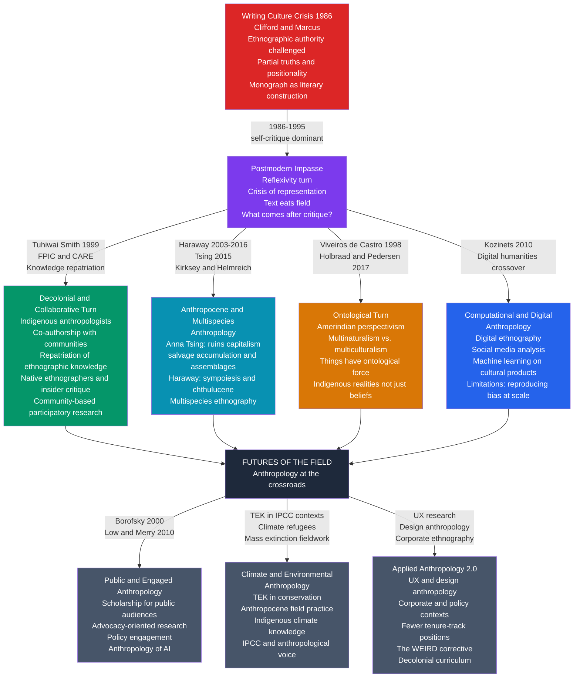

# The Future of Anthropology

> [!abstract] TL;DR
> Anthropology is simultaneously in crisis and in renaissance: the postmodern critique of ethnographic authority (Writing Culture, 1986) dissolved the discipline's positivist self-confidence, while three intertwined responses — Anthropocene anthropology (Tsing, Haraway), the ontological turn (Viveiros de Castro, Holbraad and Pedersen), and the decolonial and collaborative turn (Tuhiwai Smith) — are rebuilding it around radically new objects, methods, and ethical obligations; the discipline's future lies in harnessing multispecies thinking, computational tools, and public engagement to address the climate crisis, the WEIRD problem in the human sciences, and the unprecedented scale of AI-driven cultural change.

---

## Intuition

**Analogy:** Imagine a mapmaker's guild that spent two centuries drawing maps of distant continents — maps always drawn from the perspective of the harbor town the guild called home. The maps were good and useful, but they placed the guild's harbor at the center of the world, labeled the distant peoples in the guild's own language, and never once asked the people being mapped whether they recognized the landscape the mapmaker had drawn. In the 1980s, a series of devastating critiques arrived: the maps were drawn from a specific angle; the scales were wrong; some features were invented by the mapmakers because they expected to find them; and the people being mapped had their own maps, which the guild had systematically ignored.

The guild has three options. Option one: defend the old maps. Option two: stop making maps entirely and write only about the problems with cartography. Option three — and this is where anthropology is now — learn to make maps collaboratively, with the communities being mapped, using new instruments (satellite imagery, community GPS, acoustic sensing of animal corridors, indigenous knowledge of seasonal variation) that make the older single-angle survey obsolete, and accept that the resulting map will be partial, contested, and co-owned.

That third option is what the best contemporary anthropology is attempting. It is harder, slower, and more politically fraught than either confident colonial ethnography or comfortable postmodern self-critique. But it is also where the discipline's intellectual energy is concentrated — and where its unique contribution to human self-understanding, in the era of the Anthropocene, may be most urgently needed.

---

## How It Works



The field's contemporary situation is best described as a productive fragmentation: four partially competing paradigm-responses to the Writing Culture crisis — decolonial/collaborative, Anthropocene/multispecies, ontological, and computational — each offer a different answer to the question of what anthropology is for after its epistemological innocence was lost. No single paradigm has won; the discipline is in a genuinely pluralist moment.

---

## Key Concepts

### Secondary Level

**What is the crisis — and why does it matter?**

For most of its history, anthropology operated on a tacit confidence: a trained Western researcher could travel to a distant community, live there for a year or two, and produce a written account that reliably described that community's culture, values, and social organization. The resulting ethnographic monograph was treated as a piece of social science: objective, evidence-based, and generalizable.

The 1986 publication of *Writing Culture: The Poetics and Politics of Ethnography*, edited by James Clifford and George Marcus, ended that confidence systematically. The essays in the volume argued that ethnographic monographs are not neutral reports but *literary constructions* shaped by the writer's gender, race, institutional position, and the rhetorical conventions of the genre. The "Other" whose culture was being described had no voice in whether the description was accurate or fair. The entire enterprise was entangled with colonial power structures that gave Western researchers the right to know and represent non-Western peoples, while those peoples had no corresponding right to know or represent Western researchers.

This was devastating because it attacked not the conclusions of ethnography but its methodological foundation. If every ethnographic text is positioned knowledge — partial, perspectival, and shaped by power — what makes anthropology a reliable source of understanding about human cultures? This is called the **crisis of representation**, and the discipline has been working through its consequences ever since.

The responses to this crisis define the contemporary landscape of anthropology. The most important ones are:

| Response | Core Move | Key Figures | Key Works |
|---|---|---|---|
| **Decolonial and collaborative** | Share authorship and knowledge with communities; center indigenous perspectives | Tuhiwai Smith, Borofsky | *Decolonizing Methodologies* (1999) |
| **Multispecies and Anthropocene** | Dissolve the human/nature boundary; study human entanglements with other species | Tsing, Haraway, Kohn | *Mushroom at the End of the World* (2015); *Staying with the Trouble* (2016) |
| **Ontological turn** | Take indigenous ontologies seriously as genuine alternative realities, not just beliefs | Viveiros de Castro, Holbraad, Pedersen | *The Ontological Turn* (2017) |
| **Computational / digital** | Combine ethnographic depth with large-scale data analysis | Kozinets, many others | *Netnography* (2010) |

**Key terms:**

| Term | Definition |
|---|---|
| **Anthropocene** | The proposed geological epoch in which human activity has become the dominant force shaping Earth's systems; coined by atmospheric chemist Paul Crutzen (2000); adopted in anthropology to describe a period requiring new analytical frameworks |
| **Multispecies ethnography** | Ethnographic study of human entanglements with other species — fungi, bacteria, animals, plants — treating non-human actors as analytically significant rather than as backdrop |
| **Ontological turn** | The methodological move of taking indigenous ontologies seriously as potentially correct descriptions of reality, not merely as different beliefs about a shared world |
| **TEK (Traditional Ecological Knowledge)** | The body of knowledge about local ecosystems held by indigenous and local communities, transmitted across generations; increasingly recognized as a scientific resource in conservation and climate adaptation |
| **WEIRD problem** | An acronym coined by Henrich, Heine, and Norenzayan (2010): psychological research overwhelmingly studies Western, Educated, Industrialized, Rich, Democratic populations, then treats the results as universal human findings. Anthropological cross-cultural data systematically contradicts this universalism |
| **Public anthropology** | Anthropological scholarship explicitly designed to reach public audiences rather than solely academic ones; associated with Robert Borofsky's Center for a Public Anthropology |
| **Decolonizing methodologies** | The program of restructuring research relationships with indigenous communities so that research is governed by community consent (FPIC — Free, Prior, and Informed Consent), serves community interests, and shares knowledge ownership |
| **CARE principles** | Collective benefit, Authority to control, Responsibility, Ethics — a framework for indigenous data sovereignty developed as a counterpart to FAIR data principles in open science |

---

### Undergraduate Level

#### The Writing Culture Crisis and What Came After

*Writing Culture* (1986) crystallized four specific charges against the ethnographic monograph as a form:

1. **The authority claim**: the monograph asserted the right to represent a community authoritatively — "I was there, I know" — while concealing the constructed and selective nature of that authority. This is what Clifford called **ethnographic authority**.
2. **The absent other**: the people being written about appeared as informants and objects of analysis but almost never as co-producers of the knowledge. Their own theories of their own lives were paraphrased or quoted selectively to illustrate the anthropologist's argument.
3. **The writing as invisible**: monographs used conventions borrowed from the 19th-century realist novel — omniscient third-person narration, the present tense of "ethnographic authority" ("The Nuer are a pastoral people..."), and the suppression of the fieldwork encounter itself — that created an illusion of transparent reportage concealing enormous interpretive choices.
4. **The political economy of representation**: the ability to produce authoritative ethnographic knowledge about non-Western peoples was not symmetrical. Anthropologists from former colonial metropoles could study anyone; anthropologists from former colonies found their fieldwork in their home countries treated as less scientifically rigorous than work by outsiders.

The immediately postcritique decade (late 1980s to mid-1990s) generated what is sometimes called the **reflexive turn**: ethnographers began including their own presence in their texts, writing themselves into the fieldwork encounter, analyzing the conditions of their own knowledge production. This was necessary and valuable. But it generated its own pathologies, which Stephen Tyler (one of the *Writing Culture* contributors) diagnosed as **navel-gazing**: a preoccupation with the conditions of ethnographic knowledge that left the communities being studied analytically invisible while the anthropologist's interior life became the main subject. "Ethnographic authority" had been replaced by "therapeutic confession."

The more productive responses took two forms. The first was **collaborative ethnography** — actually restructuring the research process so that community members participated in question design, data interpretation, and text review. Luke Lassiter's *The Chicago Guide to Collaborative Ethnography* (2005) articulated this as a methodology rather than a wish. The second was the **native anthropologist** movement — the recognition that anthropologists trained in and by the communities they study are not compromised but advantaged, and that the discipline's historical gatekeeping of who counts as a legitimate researcher has been structurally racist.

**Linda Tuhiwai Smith and Decolonizing Methodologies**

Linda Tuhiwai Smith's *Decolonizing Methodologies* (1999) is the most influential statement of the decolonial case. Smith, a Maori scholar, argued that the research paradigm inherited from European social science — the questions deemed worth asking, the methods deemed legitimate, the audiences addressed, the ownership of knowledge produced — was itself a colonial technology. The title's noun is programmatic: "methodologies" plural, because the decolonial project is not merely about ethics but about reconfiguring the entire apparatus of what counts as knowledge and who produces it.

Smith's specific contributions:
- The **FPIC principle**: research on indigenous communities requires Free, Prior, and Informed Consent from the community, not merely from individual informants
- **Research as a dirty word**: the very act of coming to study a community is not politically neutral — it is positioned within a history of colonial extraction of indigenous knowledge for outside benefit
- **Indigenous research as resistance**: communities should define their own research agendas; the researcher's role is to facilitate community knowledge production, not to extract data for external analysis
- The **CARE principles** for indigenous data governance (Collective benefit, Authority to control, Responsibility, Ethics) — a framework that is now being adopted in international data governance discussions

The discipline has responded unevenly. Top journals now require more careful informed-consent documentation and encourage attention to indigenous data sovereignty. But the structural economics of the academy — publishing in English for peer review by predominantly Western scholars — continue to reproduce the asymmetries Smith identified.

---

#### Anthropocene Anthropology: Anna Tsing, Donna Haraway, and Bruno Latour

The most intellectually generative development in early 21st-century anthropology is the convergence of **Anthropocene thinking** with ethnographic method. This convergence dissolved the human/nature boundary that classical anthropology had inherited from the Enlightenment — the assumption that "culture" (distinctly human, studied by anthropology) stood over and apart from "nature" (studied by biology and ecology).

**Anna Tsing: Ruins Capitalism and Multispecies Assemblages**

Anna Tsing's *The Mushroom at the End of the World: On the Possibility of Life in Capitalist Ruins* (2015) is the defining text of Anthropocene anthropology. Its object is the matsutake mushroom — simultaneously a commodity traded for thousands of dollars per kilogram in Japanese luxury markets, and a symbiotic organism whose fruiting body requires the precise ecological conditions of damaged forests (it thrives in logged-over, second-growth, pine-colonized landscapes). The mushroom will not grow under cultivation; it requires the disturbance of commercial forestry to create its habitat.

Tsing uses the matsutake to develop three major theoretical concepts:

**Salvage accumulation**: capitalism does not require industrial production to generate value. It can accumulate by attaching itself to non-capitalist value-creation processes — foragers who pick matsutake in Oregon forests, Japanese gift-exchange systems that price the mushroom according to criteria (cultural prestige, aesthetic quality, geographical provenance) alien to industrial commodity logic — and converting their outputs into tradeable commodities. The mushroom trade is a global commodity chain that works precisely because it cannot be industrialized; each stage of the chain involves non-capitalist forms of labor, knowledge, and value. Tsing calls this the "pericapitalist" zone.

**Precarity as condition**: classical development economics imagined that global capitalism would progressively integrate all economic activity into a uniform system of wage labor and industrial production. Tsing argues the opposite: precarity — unstable, patchwork, non-integrated economic arrangements — is not a transitional condition on the way to modern stability but the normal condition of the majority of the world's population. The matsutake foragers of Oregon, many of them Southeast Asian refugees from the Vietnam and Laotian wars, represent not pre-modern backwardness but a specifically contemporary condition of displaced survival in the ruins of industrial capitalism.

**Multispecies assemblages**: the matsutake mushroom, the red pine, the forager, the Japanese gift system, the logged Oregon forest, and the global commodity market are all constitutive actors in the same assemblage. No single node causes the others; the mushroom's existence depends on the logged forest, the logged forest depends on 20th-century timber capitalism, the timber capitalism creates the conditions for the refugee labor that harvests the mushroom, and the mushroom's market value depends on Japanese cultural traditions of gift-giving that predate and survive industrial capitalism. Tsing calls this "multispecies entanglement": the anthropological object is the assemblage, not any single actor within it.

**Donna Haraway: Staying with the Trouble**

Donna Haraway's *Staying with the Trouble: Making Kin in the Chthulucene* (2016) offers a more deliberately provocative alternative to the dominant Anthropocene narrative. Her critique of the concept "Anthropocene" is that it positions the human species as the central villain of a planetary narrative that continues to keep humanity at the center of the story. It is, she argues, still a fundamentally anthropocentric framework even while lamenting anthropocentrism.

Haraway proposes **sympoiesis** (making-together) in place of autopoiesis (self-making) as the fundamental biological metaphor. No organism is self-creating; all life is co-constituted through relationship. The immune system, the gut microbiome, the mycorrhizal networks that link tree roots — these are all systems in which "organism" and "environment" cannot be separated. Human beings are not individuals who exist and then enter into relationships; they are constituted *by* their multispecies relationships.

Her alternative geological epoch name, **Chthulucene**, is coined from Cthulhu (the Lovecraftian tentacled entity as figure of non-human strangeness) and Pimoa cthulhu, a spider species named for the former. It is designed to be provocative: the relevant actors in the current planetary moment are not primarily human; they include the bacterial mats that predate multicellular life, the fungal networks that may be the planet's primary information-transmission system, the microbial life that outnumbers human cells in any human body by ten to one.

**Haraway's companion species and feminist science studies**: before *Staying with the Trouble*, Haraway's *Companion Species Manifesto* (2003) established the theoretical framework. Dogs and humans co-evolved: the domestication of the dog is not merely a human act performed on wolves but a co-evolutionary entanglement in which wolf populations that could form attachment relationships with humans acquired fitness advantages, while human populations that could form attachment relationships with canines acquired tracking and hunting advantages. There is no original human standing over and domesticating a natural wolf; there are only the entangled trajectories of two species that made each other.

**Bruno Latour and Actor-Network Theory applied to climate**

Latour's actor-network theory (ANT), developed with Michel Callon and John Law in the sociology of science, argued that scientific facts are not discovered from pre-existing nature but assembled through networks of human and non-human actors: scientists, instruments, laboratory spaces, funding bodies, journals, specimens, and the non-human entities being studied all participate in producing scientific knowledge. Applied to climate science, this framework produces a specific diagnosis of why climate denial has been so politically potent: the facts about anthropogenic climate change are not simply "out there" waiting to be communicated. They are assembled through specific networks — IPCC working groups, satellite temperature-measurement systems, global climate models — and those networks can be attacked and delegitimized as political objects rather than engaged on their scientific merits.

Latour's late work (*Down to Earth*, 2018) argued that the political response to ecological crisis requires what he called **Terrestrial politics**: rather than a politics organized around the competing interests of humans alone, a politics that takes the interests of the Earth system — rivers, soils, atmospheric systems, non-human species — as legitimate political actors. Anthropology, with its long tradition of representing the perspectives of those who lack a voice in dominant political structures, is positioned to contribute to this Terrestrial politics in ways that no other discipline is.

---

#### More-than-Human Anthropology: Amerindian Perspectivism and the Ontological Turn

**Eduardo Viveiros de Castro: Multinaturalism**

Eduardo Viveiros de Castro's Amerindian perspectivism, developed in a series of articles from 1992 and synthesized in *Cannibal Metaphysics* (2009), is the most radical and theoretically rigorous challenge to Western anthropological common sense in the contemporary discipline.

The central claim: Western modernity operates on the assumption of **multiculturalism** — there is one shared nature (the world as described by physics, chemistry, and biology) and many different cultures that interpret and represent this nature differently. Different cultures have different beliefs about the one world. This is, in fact, the premise of anthropology itself: we all live in the same world; we just conceptualize it differently.

Amazonian Amerindian cosmologies reverse this: they operate on the premise of **multinaturalism**. Culture is singular and universal — all beings (humans, animals, spirits, plants, rivers) share the same perspective on themselves, which is the perspective of a person living in a social world. Nature is plural — different beings inhabit different bodies that give them different environments. The jaguar does not experience the world the way a human does not because the jaguar lacks culture but because the jaguar has a different body that produces a different world. When the jaguar drinks blood from a kill, it experiences it as manioc beer (the Amerindian staple). When the anaconda sees a riverbank, it sees a longhouse. The jaguar and the anaconda are persons; they have the same cultural perspective on themselves as persons; they simply occupy different bodies that produce genuinely different natural worlds.

This is not merely an interesting indigenous belief to be recorded and explained by Western theory. Viveiros de Castro's provocation is methodological: he argues that the anthropological concept of "perspective" — that different cultures have different perspectives on the same world — is in fact the Western ontology masquerading as a universal methodology. Amerindian perspectivism reveals that "perspective" itself is not a neutral analytical tool but a culturally specific metaphysics. Taking indigenous ontologies seriously means suspending the assumption that Western ontology is the framework within which all indigenous ontologies are to be classified and explained.

The practical implication is what Viveiros de Castro calls **controlled equivocation**: the anthropologist in the field does not seek to resolve the apparent clash between indigenous and scientific ontologies by reducing one to the other. Instead, she makes productive use of the equivocation — the gap between the terms she and her interlocutors use — to reveal the assumptions embedded in each ontology.

**Martin Holbraad and Morten Axel Pedersen: The Ontological Turn**

Holbraad and Pedersen's *The Ontological Turn: An Anthropological Exposition* (2017) consolidates the ontological turn as a methodological program. Their central move: anthropological analysis should not proceed by explaining what indigenous concepts really mean in terms of a pre-given analytical framework (usually some form of Western social science). Instead, analysis should follow the implications of indigenous concepts until the analytical framework itself is transformed.

Their example: Cuban *oriaté* (Ifá divination priests) use powder (aché) in divination rituals that are said to "be" the divine power of Ifá, not merely to represent or symbolize it. A Western analyst would explain: "The Cubans believe the powder represents divine power — this is a symbolic or performative claim." Holbraad argues this analysis is wrong not because it misunderstands the Cubans but because it preemptively categorizes aché as a "symbol" within a pre-given framework of symbolic analysis. If you take the practitioners' claim seriously — the powder is divine power, not a representation of it — the analytical question becomes: what theory of things (what ontology) makes this claim coherent? This is a genuinely different question, and pursuing it opens conceptual possibilities that the symbolic analysis closes off.

The ontological turn has been controversial. Critics (Paleček and Risjord; Vigh and Sausdal) argue that it is either trivially true (of course cultural categories structure what appears real to their users) or incoherent (if we cannot adjudicate between ontologies, how do we avoid relativism or simply endorsing whatever practitioners claim?). Viveiros de Castro's response: the point is not to determine which ontology is correct but to use the encounter between ontologies as a philosophical instrument for expanding the conceptual repertoire available to theory.

---

#### Collaborative and Engaged Anthropology

**Public Anthropology (Borofsky)**

Robert Borofsky's Center for a Public Anthropology (established 2001) defined public anthropology as "scholarship that reaches beyond the academy to engage broader audiences in addressing pressing social problems." The model is not popularization — dumbing down academic findings for mass consumption — but genuine intellectual engagement with public audiences who bring their own knowledge and stake in the questions.

The critique that motivates public anthropology: academic anthropology has become progressively more insular. Theoretical sophistication has increased; public relevance has decreased. The discipline that produced Margaret Mead — whose *Coming of Age in Samoa* (1928) shaped American public debate about adolescence and cultural diversity — now primarily produces work that reaches audiences of several hundred specialist readers. This is not merely a matter of public relations; it is a political failure in a moment when the questions anthropology is best positioned to address — how do different human communities navigate climate change, inequality, and cultural contact? — have never been more urgent.

**Engaged Anthropology (Low and Merry)**

Setha Low and Sally Engle Merry's 2010 piece "Engaged Anthropology" in *Current Anthropology* distinguished between five forms of engagement: teaching and public education, advocacy, sharing research results with studied communities, collaboration, and activism. They argued that engaged anthropology requires a fundamental reorientation of the research relationship: the research question is defined in collaboration with the community, not merely taken to the community for "data collection." The resulting knowledge is co-owned and returned to the community in usable form — not merely published in journals the community has no access to.

Concrete examples of engaged anthropology:
- **Repatriation of ethnographic knowledge**: returning field recordings, photographs, genealogical records, and sacred-object documentation to the communities they came from; the Smithsonian's NMAI (National Museum of the American Indian) repatriation program is the largest institutional example
- **NAGPRA**: the 1990 Native American Graves Protection and Repatriation Act institutionalized the Boasian critique of evolutionary museum collecting into law — human remains and sacred objects must be returned to tribal nations
- **Community-based participatory research (CBPR)**: the research methodology (developed partly in public health) in which communities are partners in all stages — question design, data collection, analysis, and dissemination; used in urban anthropology, health anthropology, and environmental anthropology

**Co-authorship and knowledge repatriation**

The most radical form of collaborative anthropology involves actual co-authorship with research participants. Luke Lassiter's work with Kiowa communities in Oklahoma produced ethnographies in which community members reviewed and revised every paragraph and are credited as co-authors. This practice remains marginal in mainstream academic publishing — co-authorship with community members is rare in top journals — but it represents the logical conclusion of the Writing Culture critique: if the problem was the absence of the other's voice, the solution is to put them in the author position.

---

#### Computational and Digital Anthropology

The computational turn in anthropology involves two distinct projects that are often confused.

**Digital ethnography** (Kozinets's *Netnography*, 2010) applies classic ethnographic methods to online communities and digital social spaces. The object of study is the community's digital life — its rituals, hierarchies, conflicts, shared meanings, and identity practices — and the methods are interpretive: extended participant observation, close reading of interaction, attention to context and meaning. Digital ethnography is not computational in any strong sense; it is conventional ethnographic interpretation applied to a new field site.

**Computational analysis of cultural products** is more genuinely novel. Researchers are using machine learning to analyze large corpora of ethnographic data, oral histories, social media content, and historical texts in ways that are impossible by hand. Examples: natural language processing applied to decades of ethnographic field notes to identify patterns of metaphor use; network analysis of kinship systems across hundreds of societies; computational text analysis of IPCC reports to track the increasing incorporation of indigenous ecological knowledge. The theoretical claim motivating this work: ethnographic depth (the understanding of meaning and context that comes from extended fieldwork) and computational breadth (the pattern detection possible with large datasets) are complementary rather than competing. The field needs both.

**The limitations are significant.** Computational approaches reproduce the biases in the data they analyze. If the training corpus is drawn from published anthropological monographs — which are predominantly written by Western researchers, about non-Western communities, in English — the model will reproduce the perspective of those monographs. The WEIRD problem is algorithmic as well as theoretical: if psychological and behavioral data is overwhelmingly drawn from WEIRD populations, machine learning trained on that data will generalize Western findings as universal. Anthropology's corrective role — providing genuinely cross-cultural empirical data — is needed upstream of the computational analysis, not as an afterthought.

**The WEIRD problem as anthropological mandate**

Henrich, Heine, and Norenzayan's 2010 paper "The Weirdest People in the World" demonstrated that the overwhelming majority of psychological research — on cognition, perception, moral judgment, cooperation, fairness — is conducted on WEIRD (Western, Educated, Industrialized, Rich, Democratic) university students, who make up approximately 12% of the world's population. When the same experiments are run cross-culturally, the results frequently do not replicate. The visual illusions standard in introductory psychology courses (Müller-Lyer, Ebbinghaus) show dramatically reduced effects in non-WEIRD populations. The "ultimatum game" findings on fairness — treated as evidence for universal human concerns for fairness and cooperation — show enormous cross-cultural variation when run by anthropologists in field settings.

This gives contemporary anthropology a specific, empirically tractable contribution: it is the only discipline with the methodological apparatus (extended fieldwork, linguistic competence, community trust) to generate the cross-cultural data needed to adjudicate claims about universal human psychology.

---

#### Climate and Environmental Anthropology

**TEK (Traditional Ecological Knowledge) in conservation**

The growing recognition that indigenous communities have developed detailed, empirically sophisticated knowledge of local ecosystems over centuries of close observation has transformed the relationship between anthropologists and conservation biologists. TEK — the body of knowledge about seasonal patterns, species distributions, ecological indicators of change, and sustainable harvest methods held by indigenous communities — is increasingly incorporated into conservation planning, species management, and climate adaptation. The Arctic Council's monitoring programs now formally integrate Inuit knowledge of sea ice behavior alongside satellite data; the IPCC's sixth assessment report (AR6, 2021) incorporated indigenous and local knowledge systematically for the first time.

Anthropologists are often the intermediaries in this integration. The methodological challenges are significant: TEK is not simply a database to be extracted and appended to scientific models. It is embedded in cosmological frameworks, kinship obligations, and social practices that are inseparable from the knowledge itself. An Inuit elder's knowledge of seal behavior cannot be fully separated from his knowledge of which ancestral routes should be traveled in which seasons, which behaviors are spiritually prohibited, and what obligations he has to the animals he hunts. TEK translation is an anthropological problem as much as a technical one.

**Climate refugees and the anthropological response**

Anthropologists are studying communities that are physically displaced or facing displacement by climate change: Pacific island communities facing sea-level rise (Tuvalu, Kiribati), Bangladeshi coastal communities, Alaskan village communities whose permafrost foundations are collapsing, Sahelian pastoral communities whose traditional migration corridors are blocked by expanding agricultural land and desertification. These are not merely disaster scenarios to be described; they are situations in which communities are making deliberate, culturally specific choices about how to maintain identity, community cohesion, and knowledge systems across forced migration.

The anthropological contribution to climate-refugee policy: the difference between "relocation" (moving bodies to a new location) and "migration with dignity" (maintaining community structure, cultural practices, land rights, and political voice in the new location) is entirely a question of social organization that only anthropological fieldwork can adequately specify.

**Anthropology in IPCC contexts**

The IPCC Working Group II (Impacts, Adaptation, and Vulnerability) increasingly draws on anthropological fieldwork data. The AR6 Chapter on Small Islands explicitly incorporates ethnographic accounts of community resilience, indigenous resource management, and cultural values at stake in climate-driven displacement. The challenge: IPCC synthesis processes are designed to assess established scientific findings, not to engage qualitative ethnographic evidence. Translating anthropological claims into forms that can be weighed against climatological and ecological data without losing their contextual specificity is an ongoing methodological problem.

---

#### Applied Anthropology 2.0: UX Research, Design Anthropology, and Corporate Ethnography

The structural economics of the academic discipline have shifted dramatically. Tenure-track positions at research universities have been shrinking since the 1980s; the ratio of PhD graduates to available positions now stands at roughly 10:1 in cultural anthropology in the United States. The result: the majority of anthropology PhDs work outside the academy, in applied and practice contexts.

**UX research** (user experience research) is the largest single employer of non-academic anthropologists. Companies including Intel (whose foundational work with gerontologist Ken Anderson produced the first large-scale corporate ethnography in the early 1990s), IDEO, Microsoft, and Google have employed anthropologists to study how people actually use technology in everyday life — as opposed to how engineers predict they will use it. The core anthropological skill transferred is the same as in academic fieldwork: extended observation of behavior in natural contexts, attention to discrepancies between what people say they do and what they actually do, and interpretation of the cultural context that shapes usage patterns.

**Design anthropology** goes beyond UX research: it involves anthropologists as collaborators in the design process from the beginning, using ethnographic fieldwork to define design problems and evaluate prototypes in the communities they will serve. The Danish tradition (Suchman, Bødker, Greenbaum) developed participatory design as an explicitly political practice: users of technology should participate in its design, not merely be observed as its recipients.

**The tension between applied and academic anthropology**

The growth of applied anthropology has generated a structural tension. Academic anthropology has increasingly oriented itself around theoretical questions — ontological turns, multispecies assemblages, decolonial methodologies — that applied practitioners find difficult to translate into practical contexts. Applied practitioners have responded by developing their own theoretical frameworks (design thinking, human-centered design, service design) that draw selectively on anthropological training while largely dispensing with the academic literature. The result is two communities — academic and applied anthropologists — that share training but speak different languages, publish in different venues, and are largely invisible to each other.

**The anthropology of AI**

One of the most rapidly growing subfields is the anthropology of AI: ethnographic study of how AI systems are designed, deployed, and experienced in different cultural contexts. Key findings from this emerging literature:

- AI systems trained on Western data systematically perform worse on non-Western populations (facial recognition, natural language processing, medical diagnosis models) — a problem that requires both technical and anthropological remediation
- The "last mile" of AI deployment — how systems are integrated into everyday life — is entirely a question of social organization, not engineering; ethnographic study of AI adoption in healthcare, agriculture, and education in Global South contexts shows that techno-optimist predictions consistently underestimate the importance of trust, social structure, and existing knowledge systems
- The "workers of AI" — the data labelers, content moderators, and model evaluators who make AI systems function — are predominantly from low-income countries and are engaged in forms of digital piecework that recapitulate colonial patterns of invisible labor enabling metropolitan consumption

---

### Graduate Level

#### The Decolonial Project and Its Institutional Limits

The decolonial turn in anthropology is intellectually robust and institutionally constrained. The intellectual case — that the discipline's research relationships, theoretical frameworks, publication structures, and curricula reproduce colonial knowledge hierarchies — is well documented and widely accepted in principle. The institutional constraints are equally well documented and less widely discussed.

The currency of academic anthropology remains publication in English-language peer-reviewed journals, citation in those journals, and employment at universities that rank according to international metrics weighted toward English-language output. This means that an anthropologist writing in Quechua about Andean cosmology for a community audience is invisible to the metrics by which her career will be evaluated. An anthropologist writing in English about Andean cosmology for a Western theoretical debate is legible to the academic reward system but may be doing exactly what Tuhiwai Smith criticized: extracting indigenous knowledge for metropolitan theoretical consumption.

The CARE principles for indigenous data sovereignty represent the most systematic institutional response. The claim is structural: indigenous communities have the right to govern their own data — to determine what is collected, who has access, how it is used, and who benefits. This requires changes not only in researcher ethics but in institutional review board (IRB) procedures, journal publication policies, and funder data-sharing requirements. The Open Science movement — which requires all research data to be publicly accessible — is, from an indigenous data sovereignty perspective, potentially in direct tension with CARE principles: open access for the global research community may mean open access to data that communities have restricted for cultural or political reasons.

#### Multispecies Methodology: Between Ethnography and Science

Multispecies ethnography faces a methodological challenge it has not fully resolved: the non-human actors it studies cannot report their experience. Anna Tsing can interview matsutake foragers and market traders; she cannot interview the matsutake. Eduardo Kohn's *How Forests Think* (2013) — which argues that non-human life forms engage in semiotic processes (signs and representations) and that the forest itself is a kind of cognition — is methodologically dependent on Runa community members' interpretations of their relationships with forest animals. The forest thinks through its Runa interlocutors.

This is not a fatal problem, but it means that multispecies anthropology is, in practice, an anthropology of human-non-human relationships rather than an anthropology that has achieved genuine access to non-human experience. It requires philosophical modesty about what the method can establish. The claim "the jaguar sees blood as manioc beer" is a claim about Amerindian cosmology, not a report from inside jaguar phenomenology. Whether this matters analytically depends on what theoretical work the multispecies framework is doing: if it is demonstrating that the human/nature boundary is historically and culturally specific (true, and important), it succeeds. If it is claiming direct access to non-human experience, it overreaches.

The most productive use of multispecies thinking has been in the study of **co-evolutionary relationships**: dog domestication, the mycorrhizal networks linking tree communities in old-growth forests, the microbiome's co-evolution with human immune function, and the reciprocal transformations of human agricultural landscapes and the animal species that adapted to live within them. These are empirical relationships between lineages that can be studied through the combined toolkit of evolutionary biology, ecology, and ethnography. The theoretical claim is modest: human history is not separable from the evolutionary histories of the organisms humans live with.

#### The Future of the Discipline: Pluralism vs. Convergence

The contemporary discipline faces what might be called the **paradigm pluralism problem**. Classical science studies (Kuhn, *The Structure of Scientific Revolutions*, 1962) suggested that mature sciences are characterized by a dominant paradigm — a shared framework of questions, methods, and standards that defines what counts as a scientific contribution. The social sciences have never achieved this kind of paradigm dominance, and anthropology is currently more fragmented than at any point in its history.

This fragmentation is simultaneously a source of intellectual vitality and professional dysfunction. Different sub-communities — biological anthropologists using genomic sequencing to trace human migrations, multispecies ethnographers following fungi and foragers, computational anthropologists doing network analysis of kinship systems, indigenous methodologists doing community-based participatory research — are all called "anthropology" but share very few theoretical frameworks, methods, or evaluative standards. Practitioners within each sub-community can barely evaluate work from others.

The four-field holism that Boas institutionalized as the discipline's distinctive contribution has become, in this context, both a philosophical aspiration and a practical impossibility. No individual scholar can be competent across biological anthropology, linguistics, archaeology, and cultural anthropology. The question is whether multi-field collaboration can substitute for individual holism — and whether the institutional structure of the discipline (departments that train and hire across the four fields; journals that aspire to cross-field relevance) can sustain this collaboration against the centrifugal pressures of academic specialization.

The most optimistic answer comes from the Anthropocene: the climate crisis is a problem that demonstrably cannot be addressed from within any single disciplinary framework. It requires paleoclimatology (archaeology), evolutionary biology (biological anthropology), linguistic anthropology (for TEK translation), and cultural anthropology (for the study of how different communities are adapting and what they value). The crisis may force a new kind of four-field synthesis, not around the study of a specific community, but around the study of a specific entangled problem.

---

## Python Demo

```python
import numpy as np
import matplotlib
matplotlib.use("Agg")
import matplotlib.pyplot as plt

# ---------------------------------------------------------------
# Paradigm Shift Dynamics in Anthropological Theory (1945-2030)
#
# N_AGENTS anthropologists each hold a "theoretical commitment
# vector" across K paradigms (values sum to 1 like probabilities).
# At each time step:
#   1. A landmark work may appear (scheduled by year) and shift
#      agents toward its paradigm, weighted by citation impact
#      times the agent's existing sympathy with that paradigm.
#   2. Peer conformity: agents drift toward the field-mean,
#      scaled by a conformity_rate parameter.
#
# SCENARIO A: Convergent discipline (high conformity_rate)
#   => strong social pressure toward the dominant paradigm
#   => heterodox positions are squeezed out
#
# SCENARIO B: Pluralist discipline (low conformity_rate)
#   => weak social pressure; multiple paradigms coexist
#   => heterodox positions persist in niches
#
# The heterodoxy index = fraction of agents whose personal
# dominant paradigm differs from the field's dominant paradigm.
# ---------------------------------------------------------------

rng = np.random.default_rng(7)

K = 6
PARADIGM_NAMES = [
    "Functionalism",
    "Structuralism",
    "Interpretivism",
    "Postmodernism",
    "Multispecies",
    "Ontological/Decolonial",
]
COLORS = ["#6366f1", "#0ea5e9", "#10b981", "#f59e0b", "#ef4444", "#a855f7"]

N_AGENTS = 150
T_START = 1945
T_END = 2030
T_RANGE = T_END - T_START

# Landmark works: (label, year, paradigm_index, citation_impact)
# citation_impact ∈ (0, 1]: how strongly the work reshapes
# commitment upon encounter
LANDMARK_WORKS = [
    ("Radcliffe-Brown, Structure and Function (1952)",      1950, 0, 0.65),
    ("Lévi-Strauss, Structural Anthropology (1958)",        1958, 1, 0.70),
    ("Geertz, The Interpretation of Cultures (1973)",       1973, 2, 0.90),
    ("Writing Culture — Clifford and Marcus (1986)",        1986, 3, 0.85),
    ("Tuhiwai Smith, Decolonizing Methodologies (1999)",    1999, 5, 0.60),
    ("Haraway, Companion Species Manifesto (2003)",         2003, 4, 0.55),
    ("Tsing, Mushroom at the End of the World (2015)",      2015, 4, 0.75),
    ("Holbraad and Pedersen, The Ontological Turn (2017)",  2017, 5, 0.70),
    ("Computational / Digital Anthropology (2020)",         2020, 2, 0.45),
]


def init_agents(n, k, seed_rng):
    """Draw initial commitment vectors from a symmetric Dirichlet."""
    return seed_rng.dirichlet(np.ones(k) * 1.5, size=n)


def simulate(n_agents, t_start, t_end, conformity_rate,
             landmark_works, rng_seed=42):
    """
    Returns
    -------
    history    : (T, K) mean paradigm share at each time step
    dominant   : (T,)   index of field-dominant paradigm
    heterodoxy : (T,)   fraction of agents outside dominant paradigm
    """
    rng2 = np.random.default_rng(rng_seed)
    agents = init_agents(n_agents, K, rng2)
    T = t_end - t_start

    history = np.zeros((T, K))
    dominant = np.zeros(T, dtype=int)
    heterodoxy = np.zeros(T)

    work_by_year = {
        year - t_start: (pidx, impact)
        for (_, year, pidx, impact) in landmark_works
        if t_start <= year < t_end
    }

    for t in range(T):
        # --- Landmark-work influence ---
        if t in work_by_year:
            pidx, impact = work_by_year[t]
            # Encounter probability scales with existing sympathy + base rate
            sympathy = agents[:, pidx] + 0.10
            encounter_prob = np.clip(sympathy * impact, 0.0, 1.0)
            encounters = rng2.random(n_agents) < encounter_prob
            step_size = rng2.uniform(0.08, 0.20, n_agents)
            for i in np.where(encounters)[0]:
                delta = np.zeros(K)
                delta[pidx] = step_size[i]
                agents[i] = np.abs(agents[i] + delta)
                agents[i] /= agents[i].sum()

        # --- Peer conformity ---
        field_mean = agents.mean(axis=0)
        noise = rng2.normal(0.0, 0.01, (n_agents, K))
        agents += conformity_rate * (field_mean - agents) + noise
        agents = np.clip(agents, 1e-6, None)
        agents /= agents.sum(axis=1, keepdims=True)

        mean_vec = agents.mean(axis=0)
        history[t] = mean_vec
        dom = int(np.argmax(mean_vec))
        dominant[t] = dom
        agent_dom = np.argmax(agents, axis=1)
        heterodoxy[t] = (agent_dom != dom).mean()

    return history, dominant, heterodoxy


years = np.arange(T_START, T_END)

hist_conv, dom_conv, het_conv = simulate(
    N_AGENTS, T_START, T_END,
    conformity_rate=0.12, landmark_works=LANDMARK_WORKS, rng_seed=7
)
hist_plur, dom_plur, het_plur = simulate(
    N_AGENTS, T_START, T_END,
    conformity_rate=0.03, landmark_works=LANDMARK_WORKS, rng_seed=7
)

# --- Console summary ---
print("=" * 64)
print("Paradigm Shift Simulation — Anthropological Theory 1945-2030")
print("=" * 64)
print(f"\nParadigms: {', '.join(PARADIGM_NAMES)}\n")

for label, hist, het in [
    ("Convergent (high peer conformity, rate=0.12)", hist_conv, het_conv),
    ("Pluralist  (low  peer conformity, rate=0.03)", hist_plur, het_plur),
]:
    final = hist[-1]
    dom_idx = int(np.argmax(final))
    print(f"SCENARIO: {label}")
    print(f"  Final dominant paradigm : {PARADIGM_NAMES[dom_idx]}")
    for i, name in enumerate(PARADIGM_NAMES):
        bar = "#" * int(final[i] * 40)
        print(f"  {name:<28} {final[i]:.3f}  {bar}")
    print(f"  Final heterodoxy index  : {het[-1]:.3f}")
    print()

# --- Plot (2 rows x 3 columns) ---
fig, axes = plt.subplots(2, 3, figsize=(17, 9))
fig.suptitle(
    "Disciplinary Paradigm Dynamics in Anthropology (1945-2030)\n"
    "Agent-Based Model: Landmark-Work Influence + Peer Conformity",
    fontsize=11, fontweight="bold",
)

WORK_YEARS = [year for (_, year, _, _) in LANDMARK_WORKS
              if T_START <= year < T_END]
WORK_SHORT = [lbl.split("(")[0].strip()[:26]
              for (lbl, year, _, _) in LANDMARK_WORKS
              if T_START <= year < T_END]


def draw_work_lines(ax):
    for wy in WORK_YEARS:
        ax.axvline(x=wy, color="#94a3b8", lw=0.7, linestyle=":", alpha=0.55)


# Row 0, Col 0 — Convergent: mean paradigm share
ax = axes[0, 0]
for i in range(K):
    ax.plot(years, hist_conv[:, i], color=COLORS[i], lw=2.0,
            label=PARADIGM_NAMES[i])
draw_work_lines(ax)
ax.set_title("Scenario A: Convergent\nMean paradigm-commitment share", fontsize=9)
ax.set_xlabel("Year", fontsize=8)
ax.set_ylabel("Mean commitment weight", fontsize=8)
ax.legend(fontsize=6.5, loc="upper left", framealpha=0.7)
ax.set_xlim(T_START, T_END)
ax.set_ylim(0, 0.85)
ax.grid(True, alpha=0.2)

# Row 0, Col 1 — Pluralist: mean paradigm share
ax = axes[0, 1]
for i in range(K):
    ax.plot(years, hist_plur[:, i], color=COLORS[i], lw=2.0,
            label=PARADIGM_NAMES[i])
draw_work_lines(ax)
ax.set_title("Scenario B: Pluralist\nMean paradigm-commitment share", fontsize=9)
ax.set_xlabel("Year", fontsize=8)
ax.set_xlim(T_START, T_END)
ax.set_ylim(0, 0.85)
ax.grid(True, alpha=0.2)

# Row 0, Col 2 — Heterodoxy index
ax = axes[0, 2]
ax.plot(years, het_conv, lw=2.5, color="#6366f1", label="Convergent")
ax.plot(years, het_plur, lw=2.5, color="#ef4444",
        linestyle="--", label="Pluralist")
draw_work_lines(ax)
ax.set_title("Heterodoxy Index\n(fraction outside field-dominant paradigm)", fontsize=9)
ax.set_xlabel("Year", fontsize=8)
ax.set_ylabel("Heterodoxy fraction", fontsize=8)
ax.legend(fontsize=9)
ax.set_xlim(T_START, T_END)
ax.set_ylim(0, 1.0)
ax.grid(True, alpha=0.2)

# Row 1, Col 0 — Convergent: dominant paradigm step plot
ax = axes[1, 0]
ax.step(years, dom_conv, where="post", lw=2.5, color="#6366f1")
ax.set_yticks(range(K))
ax.set_yticklabels([p[:22] for p in PARADIGM_NAMES], fontsize=7)
draw_work_lines(ax)
ax.set_title("Scenario A: Dominant Paradigm Over Time", fontsize=9)
ax.set_xlabel("Year", fontsize=8)
ax.set_xlim(T_START, T_END)
ax.grid(True, alpha=0.2, axis="x")

# Row 1, Col 1 — Pluralist: dominant paradigm step plot
ax = axes[1, 1]
ax.step(years, dom_plur, where="post", lw=2.5, color="#ef4444")
ax.set_yticks(range(K))
ax.set_yticklabels([p[:22] for p in PARADIGM_NAMES], fontsize=7)
draw_work_lines(ax)
ax.set_title("Scenario B: Dominant Paradigm Over Time", fontsize=9)
ax.set_xlabel("Year", fontsize=8)
ax.set_xlim(T_START, T_END)
ax.grid(True, alpha=0.2, axis="x")

# Row 1, Col 2 — Pluralist stacked area (shows coexistence)
ax = axes[1, 2]
ax.stackplot(years, hist_plur.T, labels=PARADIGM_NAMES,
             colors=COLORS, alpha=0.80)
draw_work_lines(ax)
ax.set_title("Scenario B: Stacked Paradigm Composition\n(coexistence visible)", fontsize=9)
ax.set_xlabel("Year", fontsize=8)
ax.set_ylabel("Mean commitment share", fontsize=8)
ax.legend(fontsize=6.5, loc="upper left", framealpha=0.7)
ax.set_xlim(T_START, T_END)
ax.set_ylim(0, 1)
ax.grid(True, alpha=0.2, axis="x")

plt.tight_layout()
plt.savefig("future_of_anthropology_paradigm_model.png",
            dpi=110, bbox_inches="tight")
plt.show()
```

**What the model demonstrates:**

The six panels show two different possible futures for the discipline, distinguished only by the peer-conformity rate — how strongly the average field-mean position pulls individual researchers toward it.

- **Convergent scenario (high conformity)**: each landmark work triggers a large shift in the field's center of mass, and the majority of researchers follow the shift. Functionalism gives way to structuralism, then to interpretivism, then to postmodernism, then to a consolidated Multispecies/Ontological synthesis. The heterodoxy index collapses: almost all researchers end up aligned with whatever the current dominant paradigm is. This is the Kuhnian "normal science" model — periodically interrupted by paradigm shifts, but characterized by consensus between shifts.

- **Pluralist scenario (low conformity)**: the same landmark works arrive with the same impact scores, but because peer conformity pressure is weak, each work creates a new cluster of commitment rather than shifting the entire field. Interpretivism rises after 1973 without displacing structuralism. Postmodernism rises after 1986 without eliminating interpretivism. The multispecies and ontological paradigms achieve real but not dominant shares after 2015. The stacked area plot shows genuine coexistence. The heterodoxy index remains high throughout: at any given time, a substantial fraction of researchers hold commitments at odds with the field's nominal center.

- **The vertical dotted lines** mark the years of landmark works. In both scenarios, each major work triggers a visible inflection. The difference is in what happens *between* landmark works: in the convergent scenario, drift toward consensus; in the pluralist scenario, persistent heterogeneity.

The model captures a real empirical debate in the science studies literature: whether the social sciences converge toward paradigms (as Kuhn predicted for mature sciences), or whether their subject matter is inherently resistant to paradigm consensus because the phenomena studied — human meaning, social interpretation — are genuinely theory-laden in a way that physical phenomena are not.

---

## Real-World Applications

> **TEK in IPCC AR6 and Arctic Climate Monitoring**: The IPCC's Sixth Assessment Report (2021) incorporated indigenous and local knowledge (ILK) systematically for the first time, with a dedicated cross-chapter box on ILK in the Working Group II contribution. Arctic Council monitoring programs — particularly the Arctic Climate Impact Assessment — formally integrate Inuit knowledge of sea ice behavior, seal distribution patterns, and polar bear habitat alongside satellite data. Inuit hunters have documented systematic changes in ice predictability that preceded satellite confirmation by years; their knowledge of which ice formations are safe to cross, based on visual and tactile indicators developed over generations, is complementary to satellite thickness measurements and often more actionable at the local scale. Anthropologists at the University of Alaska Fairbanks and the Inuit Circumpolar Council have been central intermediaries in this integration.

> **Corporate Ethnography at Intel and IDEO**: Intel's pioneering People and Practices Research group (founded by Ken Anderson in the 1990s) used longitudinal ethnographic fieldwork in multi-generational households to understand how older adults were actually using (or avoiding) technology — producing findings that contradicted the engineering assumption that resistance to technology was primarily a learning problem. The research showed that technology adoption was structured by family dynamics, fear of surveillance, and the social meaning of appearing competent or incompetent in front of grandchildren. This finding reshaped Intel's product strategy for the aging-in-place market. IDEO's human-centered design methodology — which became a template for design thinking worldwide — was developed by trained anthropologists (including Jan Chipchase, who did fieldwork on mobile phone use in rural India before smartphones existed) and is the most widespread institutional form of applied anthropological method in commercial contexts.

> **NAGPRA Repatriation and the Kennewick Man Case**: The 1990 Native American Graves Protection and Repatriation Act (NAGPRA) institutionalized the Boasian critique of evolutionary museum collecting. The legal and anthropological debate over Kennewick Man — a 9,000-year-old skeleton found in Washington State in 1996, claimed by the Army Corps of Engineers for scientific study and by the Umatilla Nation for repatriation — forced a public confrontation between scientific claims to knowledge and indigenous claims to ancestral remains. The 2016 decision to repatriate Kennewick Man to a coalition of Columbia Plateau tribes, based in part on genomic evidence of ancestry, represented both a vindication of indigenous repatriation claims and a reconciliation of scientific and community interests that had previously been framed as irreconcilable.

> **Netnography in Public Health**: During the COVID-19 pandemic, netnographic methods (Kozinets) were applied to analyze vaccine hesitancy communities on Facebook, Reddit, and Telegram. Researchers at McGill University and the Oxford Internet Institute used ethnographic participant observation in online communities to understand the cosmological frameworks — not merely the misinformation content — organizing vaccine skepticism: narratives of bodily sovereignty, distrust of institutional expertise as a form of epistemic colonialism, and community norms around parenthood and risk. These findings influenced public health communication strategies in ways that standard survey-based research on vaccine hesitancy had failed to: addressing the underlying meaning-frameworks rather than simply correcting false factual claims.

> **Anthropology of AI and Data Labeling**: Anthropological fieldwork by Sareeta Amrute, Mary Gray, and Siddharth Suri has documented the working conditions of the "hidden workers" who make AI systems function — the content moderators in Manila and Nairobi who review traumatic content flagged by platforms, the Amazon Mechanical Turk workers who label training data for machine learning systems, the Ghost Workers (Gray and Suri's term) who perform the micro-tasks that make automated systems appear to function seamlessly. This work has directly influenced policy debates about AI platform governance, the classification of gig workers in digital labor markets, and the ethical frameworks being developed for AI supply chain accountability.

---

## Common Pitfalls

- **Confusing ontological claims with relativism** — The ontological turn does not argue that all ontologies are equally valid descriptions of the world. It argues that taking indigenous ontologies seriously as analytical resources produces better anthropological theory. This is a methodological claim, not a metaphysical one. The confusion generates both false comfort (ontological anthropology vindicates the view that every belief system is its own truth) and false horror (it commits the anthropologist to believing that blood becomes manioc beer when jaguars drink it). Neither reading is correct.

- **Treating Anthropocene anthropology as anti-science** — Multispecies anthropology and actor-network theory are sometimes misread as rejecting scientific knowledge about climate, evolution, or ecology in favor of indigenous cosmologies. This is a misreading. Latour's critique of "Science" is a critique of the *political* claim that scientific facts are self-evidently authoritative — not a denial that climate science is better than climate denial. Tsing uses biological knowledge of mycorrhizal networks alongside ethnographic observation. Haraway explicitly positions herself within feminist science studies, not against science.

- **Conflating collaborative anthropology with the erasure of analytical perspective** — Collaborative and community-based research does not require the anthropologist to endorse all community positions or to refrain from analysis. The community co-authorship model involves genuine intellectual partnership: the anthropologist contributes theoretical frameworks that community members do not necessarily have; community members contribute knowledge and interpretive authority that the anthropologist lacks. The pathology to avoid is using "collaboration" as a rhetorical fig leaf while maintaining the same extractive research relationship with a consent form attached.

- **The WEIRD corrective as new universalism** — Recognizing that psychological research has systematically over-generalized from WEIRD populations is important and correct. But the corrective — collecting cross-cultural data — can reproduce the same extractive patterns if it is conducted as a data-collection exercise that feeds into theoretical models developed entirely in Western universities. The anthropological corrective to the WEIRD problem requires genuine theoretical partnerships with non-Western scholars, not merely the addition of new field sites to existing Western theoretical frameworks.

- **Overextending multispecies agency** — The claim that fungi, rivers, or atmospheric systems are "actors" or "agents" in a social network is analytically productive when it means: these entities have causal effects that social analysis cannot ignore and that are not fully captured by treating them as passive background or resources. It becomes analytically incoherent when it is taken to mean that fungi make decisions or that rivers have intentions in any sense comparable to human intentionality. The productive version opens analysis; the incoherent version closes it down by substituting metaphor for mechanism.

- **Confusing public engagement with populism** — Public anthropology is not the abandonment of analytical rigor in favor of what audiences find reassuring. Some of the most important anthropological findings for public debates — that kinship systems are socially constructed rather than biologically given; that the nuclear family is a historically specific institution rather than a human universal; that climate adaptation varies systematically with cultural values in ways that engineering solutions miss — are counterintuitive and politically challenging. The standard for public engagement is not popularity but accessibility without distortion.

- **Treating digital ethnography as a shortcut to fieldwork** — Online communities are real communities with genuine social structures, rituals, conflicts, and meaning systems. But digital ethnographic observation is not equivalent to extended in-person fieldwork in all contexts. For communities whose identity is organized around embodied practice — craft traditions, land-based indigenous communities, ritual communities organized around physical presence — digital observation misses precisely the most analytically important material. The right choice of method depends on the question, not on the convenience of the researcher.

---

## Related Concepts

- [[Interpretive_and_Postmodern_Anthropology]] — the Writing Culture crisis (Clifford and Marcus) is the immediate predecessor to all four contemporary responses mapped here; the ontological turn is a direct continuation of the Geertzian interpretive tradition pushed to its logical limit; multispecies anthropology extends the postmodern critique of the human/nature boundary established in feminist science studies
- [[Ethnographic_Methods_and_Fieldwork]] — collaborative and community-based research transforms the ethical and methodological protocols of classical fieldwork; multi-sited ethnography is a direct response to the limitations of single-site fieldwork in a globalized world; digital netnography extends fieldwork methods to online communities
- [[Classical_Anthropological_Theory]] — Boas's four-field holism and historical particularism are the methodological ancestors of decolonial anthropology; Morgan's evolutionary comparativism is the explicit target of the decolonial critique of unilinear progress narratives; Mauss's total social fact anticipates the multispecies claim that phenomena cannot be analyzed through a single disciplinary lens
- [[Four_Fields_of_Anthropology]] — the debate about whether anthropology's four-field structure can survive the discipline's theoretical fragmentation is the institutional form of the paradigm pluralism problem; the Anthropocene creates a new argument for four-field synthesis organized around a problem rather than a community
- [[Biocultural_Anthropology]] — multispecies anthropology and biocultural anthropology converge on the dissolution of the nature/culture boundary; the microbiome's co-evolutionary relationship with the human immune system is simultaneously a biological and a cultural phenomenon (shaped by diet, hygiene practices, and social organization)
- [[Political_Anthropology_and_Power]] — decolonial anthropology is a direct extension of political anthropology's analysis of power asymmetries in knowledge production; TEK incorporation into IPCC processes is a site of political contest over whose knowledge counts in climate governance; the NAGPRA repatriation framework is a legal instantiation of political anthropological claims about sovereignty and knowledge
- [[The_Future_of_Society]] — the sociology of futures (Castells's network society, Zuboff's surveillance capitalism, the platform economy) converges with the anthropology of AI on the same empirical terrain; anthropology's corrective contribution is the cross-cultural data that prevents the sociology of futures from universalizing specifically Western platform experiences
- [[Responsible_AI]] — the anthropology of AI (Gray and Suri on ghost workers; Amrute on race and coding; data labeling labor conditions) provides the empirical grounding for responsible AI frameworks that remain abstract without ethnographic documentation of actual harm patterns; the WEIRD problem in training data is both a technical and an anthropological problem
- [[Anthropogenic_Climate_Change]] — TEK incorporation in IPCC processes is the primary institutional site where environmental anthropology interfaces with climate science; climate refugee anthropology provides the human-scale data that climate models cannot generate; the Anthropocene concept is simultaneously a geological, climatological, and anthropological category
- [[Environmental_Sociology_and_Ecological_Crisis]] — environmental sociology and environmental anthropology share the Anthropocene as a common problem space; the difference is methodological: sociology uses survey and institutional analysis; anthropology uses extended fieldwork; the two approaches are complementary in studying how communities adapt to ecological crisis
- [[Globalization_and_Social_Change]] — multispecies assemblages (Tsing's matsutake commodity chain) are global phenomena that connect Oregonian forests, Japanese gift economies, and Southeast Asian refugee labor through a single non-human actor; the anthropology of globalization and the multispecies turn share the conviction that economic analysis alone cannot account for the full range of actors in global commodity chains

- [[_MOC_Applied_and_Global_Anthropology|↑ Applied and Global Anthropology MOC]]

---

## Review Questions

### Secondary

1. Anna Tsing argues that the matsutake mushroom cannot be cultivated industrially — it requires the disturbance of logged forests to grow. How does this biological fact connect to her theory of "salvage accumulation"? What does it show about the relationship between capitalism and nature that conventional economic analysis misses?
2. What is the WEIRD problem, and why is it specifically an anthropological problem rather than just a problem for psychology? Give a concrete example of a psychological finding that has been shown not to generalize cross-culturally.
3. The *Writing Culture* critique (1986) argued that ethnographic monographs are literary constructions shaped by power asymmetries. If this is true, should anthropologists stop writing monographs? What are the alternative approaches, and what are their limitations?

### Undergraduate

1. Eduardo Viveiros de Castro argues that Western anthropology operates on a framework of **multiculturalism** (one nature, many cultures) while Amerindian perspectivism operates on **multinaturalism** (one culture — personhood — many natures/bodies). Explain this distinction precisely, show why it is not merely a terminological reversal, and evaluate the methodological claim that follows from it: that anthropological concepts must be transformed by their encounter with indigenous ontologies, not merely applied to them.
2. Donna Haraway proposes **sympoiesis** (making-together) as a replacement for the Anthropocenic narrative. What is the specific intellectual target of this move — what assumption does the Anthropocene narrative retain that Haraway wants to dislodge — and does sympoiesis successfully escape it, or does it merely relocate the human at the center of a new vocabulary?
3. The **decolonial project in anthropology** and the **open science movement** are in potential tension: open science requires publicly accessible data, while indigenous data sovereignty (CARE principles) may require restricted access. Reconstruct this tension precisely and propose a methodological framework that could accommodate both sets of concerns without fully sacrificing either.

### Graduate

1. The **ontological turn** has been criticized on two grounds: (a) it is trivially true — of course ontologies vary across cultures; (b) it is incoherent — if we cannot adjudicate between ontologies, we have no basis for any cross-cultural claim. Reconstruct the strongest version of each objection and evaluate them against Holbraad and Pedersen's methodological argument. Does the ontological turn require either the trivially true or the incoherent reading, or can it occupy a third position?
2. Latour's actor-network theory, Tsing's multispecies assemblages, and Haraway's sympoiesis all dissolve the traditional boundary between human social actors and non-human entities. Evaluate the analytical implications of this dissolution for two specific empirical domains: (a) the study of climate change adaptation in indigenous communities, and (b) the anthropology of AI. In each case, does the non-human-turn improve or complicate the analysis?
3. The **WEIRD problem** provides anthropology with a specific and potentially transformative contribution to the human sciences: the cross-cultural empirical data needed to test claims about universal human psychology, cognition, and moral reasoning. However, collecting this cross-cultural data risks reproducing the extractive research relationship that decolonial anthropology has critiqued. Is there a methodological framework that can generate the cross-cultural comparative data required to address the WEIRD problem while genuinely satisfying the ethical and political standards of decolonial research? What would it require institutionally?

---

## Sources

- [Clifford, J. and Marcus, G. (eds.) (1986). *Writing Culture: The Poetics and Politics of Ethnography*. University of California Press](https://www.goodreads.com/book/show/326949.Writing_Culture)
- [Tsing, A.L. (2015). *The Mushroom at the End of the World: On the Possibility of Life in Capitalist Ruins*. Princeton University Press](https://press.princeton.edu/books/paperback/9780691178325/the-mushroom-at-the-end-of-the-world)
- [Haraway, D. (2016). *Staying with the Trouble: Making Kin in the Chthulucene*. Duke University Press](https://www.dukeupress.edu/staying-with-the-trouble)
- [Haraway, D. (2003). *The Companion Species Manifesto: Dogs, People, and Significant Otherness*. Prickly Paradigm Press](https://www.goodreads.com/book/show/548249.The_Companion_Species_Manifesto)
- [Tuhiwai Smith, L. (1999). *Decolonizing Methodologies: Research and Indigenous Peoples*. Zed Books](https://www.goodreads.com/book/show/69799.Decolonizing_Methodologies)
- [Viveiros de Castro, E. (2009). *Cannibal Metaphysics*. Univocal Publishing](https://www.goodreads.com/book/show/17573498-cannibal-metaphysics)
- [Holbraad, M. and Pedersen, M.A. (2017). *The Ontological Turn: An Anthropological Exposition*. Cambridge University Press](https://www.cambridge.org/core/books/ontological-turn/AA2D3CC8C0A4E7F4B8A63E8F78CC0EB7)
- [Kohn, E. (2013). *How Forests Think: Toward an Anthropology Beyond the Human*. University of California Press](https://www.ucpress.edu/book/9780520276109/how-forests-think)
- [Latour, B. (2018). *Down to Earth: Politics in the New Climatic Regime*. Polity Press](https://www.politybooks.com/bookdetail?book_slug=down-to-earth-politics-in-the-new-climatic-regime--9781509530571)
- [Henrich, J., Heine, S.J., and Norenzayan, A. (2010). "The Weirdest People in the World." *Behavioral and Brain Sciences* 33(2–3), 61–83](https://doi.org/10.1017/S0140525X0999152X)
- [Borofsky, R. (2000). "Public Anthropology: Where To? What For?" *Anthropology News* 41(9)](https://doi.org/10.1111/an.2000.41.9.9)
- [Low, S.M. and Merry, S.E. (2010). "Engaged Anthropology: Diversity and Dilemmas." *Current Anthropology* 51(S2), S203–S226](https://doi.org/10.1086/653837)
- [Kozinets, R.V. (2010). *Netnography: Doing Ethnographic Research Online*. SAGE](https://www.goodreads.com/book/show/7131424-netnography)
- [Gray, M.L. and Suri, S. (2019). *Ghost Work: How to Stop Silicon Valley from Building a New Global Underclass*. Houghton Mifflin Harcourt](https://ghostwork.info)
- [Carroll, S.R. et al. (2020). "The CARE Principles for Indigenous Data Governance." *Data Science Journal* 19(1), 43](https://doi.org/10.5334/dsj-2020-043)
- [Lassiter, L.E. (2005). *The Chicago Guide to Collaborative Ethnography*. University of Chicago Press](https://press.uchicago.edu/ucp/books/book/chicago/C/bo3621999.html)
- [Kirksey, S.E. and Helmreich, S. (2010). "The Emergence of Multispecies Ethnography." *Cultural Anthropology* 25(4), 545–576](https://doi.org/10.1111/j.1548-1360.2010.01069.x)
- [IPCC (2021). *Sixth Assessment Report, Working Group II: Impacts, Adaptation and Vulnerability*. Cambridge University Press](https://www.ipcc.ch/report/ar6/wg2/)

---

#Anthropology #AppliedGlobalAnthropology #FutureAnthropology #PublicAnthropology #Anthropocene #Multispecies #OntologicalTurn #DecolonialAnthropology #MoreThanHuman #TEK #CollaborativeEthnography #WritingCulture
