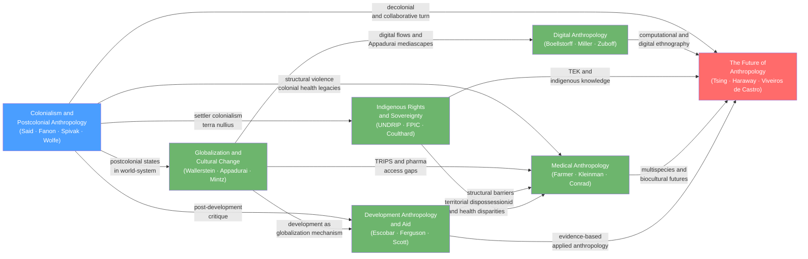

# Applied and Global Anthropology

> [!abstract] Section Overview
> This section turns anthropological theory outward to face the modern world — colonialism's long shadow, the uneven collisions of globalization, the politics of health and development, and the contested sovereignty of indigenous peoples. It closes by asking where the discipline itself is headed: into Anthropocene entanglements, digital environments, and collaborative futures that its founders could not have imagined. The organizing thread running through all seven notes is power: who produces knowledge, who controls land and bodies, and who gets to define what counts as progress.

## Notes in This Section

- [[Colonialism_and_Postcolonial_Anthropology]] — How anthropology was born inside colonial empires and how postcolonial theory exposes knowledge as power (Said, Fanon, Spivak, Bhabha, Wolfe).
- [[Globalization_and_Cultural_Change]] — Why globalization produces neither pure homogenization nor pure preservation, but emergent hybrid forms along structurally unequal fault lines (Wallerstein, Appadurai, Mintz, Robertson).
- [[Medical_Anthropology]] — Health, illness, and healing as simultaneously biological, cultural, and political phenomena; structural violence makes poverty a cause of disease, not merely its context (Farmer, Kleinman).
- [[Development_Anthropology_and_Aid]] — International development as both a practice to improve and a discourse to interrogate; how aid depoliticizes structural inequality and what participatory and evidence-based alternatives offer (Escobar, Ferguson, Scott).
- [[Indigenous_Rights_and_Sovereignty]] — 476 million indigenous people navigate UNDRIP, FPIC, and native title against state sovereignty doctrines and the ongoing logic of settler colonialism (Coulthard, Simpson, Wolfe).
- [[Digital_Anthropology]] — Online platforms and virtual worlds as legitimate ethnographic field sites where real culture, community, and power are produced (Boellstorff, Miller, Seaver, Zuboff).
- [[The_Future_of_Anthropology]] — Anthropocene multispecies thinking, the ontological turn, decolonial collaboration, and computational methods as the discipline's responses to its post-Writing Culture crisis (Tsing, Haraway, Viveiros de Castro).

---

## Concept Map



*(Blue = foundational entry point, Red = advanced synthesis, Green = intermediate; arrows show "leads to" or "builds on" relationships)*

---

## Learning Path

*Recommended order for a first pass through this section:*

1. [[Colonialism_and_Postcolonial_Anthropology]] — Start here because the colonial entanglement of the discipline frames every subsequent note; Said, Fanon, Spivak, and Wolfe provide the critical vocabulary that all other notes assume.
2. [[Globalization_and_Cultural_Change]] — Builds on postcolonial critique by mapping the structural architecture of contemporary inequality; Wallerstein's world-system and Appadurai's scapes explain how power flows through culture.
3. [[Development_Anthropology_and_Aid]] — Applies the globalization and postcolonial critiques to the concrete machinery of international aid; Escobar's discourse analysis and Ferguson's anti-politics machine show how good intentions reproduce colonial structures.
4. [[Medical_Anthropology]] — Extends structural analysis to bodies; Farmer's structural violence demonstrates that poverty and racism are not contexts for disease but causes of it, and Kleinman's explanatory models bridge cross-cultural healing systems with clinical practice.
5. [[Indigenous_Rights_and_Sovereignty]] — Takes the most politically charged terrain: ongoing struggles over land, self-determination, and cultural survival; Coulthard's critique of recognition politics and Simpson's grounded normativity push beyond liberal rights frameworks.
6. [[Digital_Anthropology]] — Shifts to a newly emergent domain; Boellstorff's virtual ethnography, Miller's comparative platform study, and Zuboff's surveillance capitalism analysis extend anthropological methods and concerns into digital life.
7. [[The_Future_of_Anthropology]] — Synthetic capstone; reads the Writing Culture crisis and the four responses — multispecies, ontological, decolonial/collaborative, computational — as converging on a discipline transformed by the Anthropocene and its own ethical reckoning.

---

## All Notes in This Topic

| Note | Core Idea | Difficulty |
|------|-----------|------------|
| [[Colonialism_and_Postcolonial_Anthropology]] | Anthropology's colonial origins exposed as knowledge-as-power; decolonizing the discipline requires dismantling salvage paradigm and epistemic violence | Intermediate |
| [[Globalization_and_Cultural_Change]] | Cultural globalization produces hybrid and creolized forms, not simple homogenization, along the unequal gradients of the capitalist world-system | Intermediate |
| [[Medical_Anthropology]] | Disease, illness, and sickness are analytically distinct; structural violence embodied as differential health outcomes across race and class | Intermediate |
| [[Development_Anthropology_and_Aid]] | Development invented poverty as a technical problem to depoliticize structural inequality; participatory and cash-transfer alternatives challenge the anti-politics machine | Intermediate |
| [[Indigenous_Rights_and_Sovereignty]] | UNDRIP and FPIC codify rights that settler colonialism's ongoing logic of elimination structurally contests; recognition politics may domesticate what it claims to protect | Intermediate |
| [[Digital_Anthropology]] | Online environments are real field sites; platform affordances interact with local cultural schemas to produce locally specific digital practices; surveillance capitalism extracts behavioral surplus | Intermediate |
| [[The_Future_of_Anthropology]] | Post-Writing Culture responses — multispecies, ontological turn, decolonial collaboration, computational methods — are rebuilding the discipline around Anthropocene challenges and ethical obligations | Advanced |

---

## Key Questions This Topic Answers

- How did European colonialism shape the production of anthropological knowledge, and what does genuinely decolonizing the discipline require beyond performative gestures?
- When cultures collide in a structurally unequal world, does globalization produce homogenization, creolization, or something more unpredictable — and who controls the terms of the encounter?
- Why are health outcomes, development results, and land rights distributed so unequally across populations, and what does structural violence analysis reveal that individual-level explanations conceal?
- On what grounds can indigenous peoples assert sovereignty, cultural survival, and free prior and informed consent against state sovereignty doctrines and extractive capitalism?
- Is the internet a new kind of field site, or just the same social life in a new medium — and what does the answer imply for ethnographic method and the politics of surveillance?
- What does anthropology look like after its postmodern crisis of representation, and how do multispecies thinking, the ontological turn, and collaborative methodology address the WEIRD problem and the Anthropocene at the same time?

---

## Cross-Section Links

- [[Classical_Anthropological_Theory]] — Evolutionism, structural-functionalism, and the salvage paradigm are the intellectual targets that postcolonial anthropology and development critique actively dismantle; Boas's anti-racism is the discipline's first internal reckoning with colonial knowledge.
- [[Ethnographic_Methods_and_Fieldwork]] — FPIC, collaborative co-authorship, virtual ethnography, and community-based participatory research are all methodological transformations driven directly by the critiques in this section.
- [[Political_Anthropology_and_Power]] — Foucauldian power-knowledge, Ferguson's anti-politics machine, and Coulthard's critique of recognition all require the political anthropological toolkit to analyze how state power operates through expertise and legal categories.
- [[Biocultural_Anthropology]] — Structural violence is embodied through allostatic load and epigenetics; TEK and multispecies anthropology share the dissolution of the nature-culture boundary that biocultural analysis pioneered.
- [[Culture_Symbols_and_Meaning]] — Postcolonial hybridity, illness explanatory models, memes as cultural artifacts, and Bhabha's third space are all applications of symbolic anthropology's core concern with meaning-making under conditions of power asymmetry.
- [[Interpretive_and_Postmodern_Anthropology]] — The Writing Culture crisis is the immediate predecessor to The Future of Anthropology's four responses; Geertz's thick description is the shared ancestor of both interpretive fieldwork and the ontological turn's attention to indigenous conceptual worlds.
- [[Religion_Magic_and_Ritual]] — Shamanic healing systems and ethnomedicine are continuous with the anthropology of ritual; NAGPRA's politics of sacred objects and ancestral remains require the theoretical vocabulary of the anthropology of religion.
- [[Historical_and_Contemporary_Archaeology]] — NAGPRA repatriation, the Kennewick Man case, and the ethics of collecting human remains bridge this section's applied concerns directly with archaeological practice and public archaeology debates.
```
