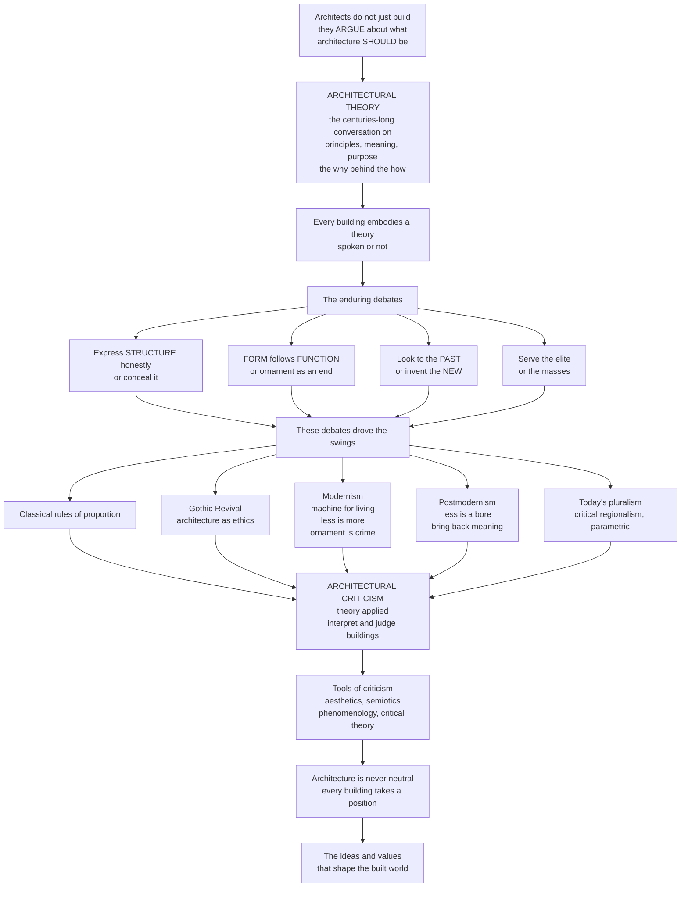

# 🏛️ Architectural Theory and Criticism

> [!abstract] TL;DR
> **Architectural theory** is the centuries-long *argument* — carried in treatises, manifestos, and manifestly opinionated buildings — about what architecture *should* be: the **principles, meaning, and purpose** behind the "how." Its handful of recurring debates (**form vs function**, **honest vs concealed structure**, **ornament vs austerity**, **tradition vs innovation**, **elite vs mass**) drove architecture's dramatic swings — from the classical rules of the Renaissance, through the moral fervour of the Gothic Revival, the machine-age radicalism of Modernism ("a house is a machine for living in," "less is more," "ornament is crime"), the meaning-restoring rebellion of Postmodernism ("less is a bore"), to today's pluralism. **Architectural criticism** is that theory *applied* — the interpretation and judgment of actual buildings, drawing on **aesthetics, semiotics, phenomenology, and critical theory**. The deep point: architecture is never neutral. Every building takes a position and makes an argument about how we should live.

---

## Intuition

**Analogy: architects don't just build — they *argue*.** A physicist writes papers to defend a theory; a lawyer writes briefs to win a case. An architect does the same thing in three media at once — the polemical *manifesto*, the systematic *treatise*, and, most powerfully, the *building itself*, which stands in the street as a permanent, un-retractable claim about the good life. When Adolf Loos wrote "Ornament and Crime," he was not decorating a wall; he was prosecuting a whole civilization for wasting human labour on frippery. When Le Corbusier called a house "a machine for living in," he was not describing plumbing; he was picking a fight with the entire nineteenth century. A building is a frozen sentence in a debate that has run, unresolved, for two thousand years.

So before it is glass and steel, architecture is a set of *questions* every designer must answer, whether they admit it or not. **Should a building express its structure honestly, or hide it behind a beautiful mask? Should form follow function, or can beauty and ornament be ends in themselves? Should it revere the past or invent the new? Should it serve the elite or the masses, express one genius or the collective spirit of the age?** Architectural theory is the record of these answers; architectural criticism is the act of grading them — reading a finished building to say what it means, whether it succeeds, and *whose* values it has built into the world. The companion notes *Architecture Overview and the Art of Building* and *Vitruvius and the Principles of Architecture* supply the "how buildings stand up"; this note supplies the "why they were built that way at all."

---

## How It Works

### Core mechanics: theory → debates → movements → criticism

1. **Theory is the discipline of the "why."** Where engineering asks *will it stand?* and practice asks *how do we build it?*, **theory** asks *why this way and not another — what does it mean, whom does it serve, what is it for?* It is the systematic reflection on architecture's principles, meaning, purpose, and values, and it lives in three forms: the **treatise** (Vitruvius, Alberti, Palladio — comprehensive systems of rules and proportion), the **manifesto** (Loos, Le Corbusier, Venturi — polemical calls to arms), and **theory embodied in buildings** themselves, which argue by example.

2. **A small set of enduring debates structures the whole field.** Nearly every position is a stance on a handful of recurring questions:
   - **Form vs function** — Louis Sullivan's "**form follows function**": the shape should express the use. Functionalism versus *formalism* and the autonomy of form (see the companion note *Form, Function, and Ornament*).
   - **Structure and truth** — "**structural honesty**" and "truth to materials": should a building *express* how it is made, or *conceal* it? Ruskin and the Gothic Revivalists made it a moral demand; Viollet-le-Duc turned Gothic into pure structural rationalism; the Modernists made "honest structure" a creed.
   - **Ornament and its morality** — Ruskin *loved* ornament as the record of joyful human craft; Loos called it a *crime*, a mark of degeneracy and waste. The status of decoration is a proxy war over the meaning of the whole discipline.
   - **Tradition vs innovation** — revive the classical/historical, or invent the avant-garde and new? Revival versus revolution.
   - **The zeitgeist** — the Hegelian "spirit of the age": architecture as the inevitable expression of its historical moment, so that steel and glass are the *destiny* of the machine age, not a choice.

3. **These debates drove architecture's dramatic swings.** Each movement is largely a *reaction* against the last — a dialectic of over-correction:
   - **Classicism and the Renaissance treatises** (Alberti, Palladio): beauty as rule, order, and harmonic proportion.
   - **Enlightenment rationalism** (Laugier's "primitive hut"): architecture traced back to a rational, structural origin — post, beam, and pediment stripped of excess.
   - **Romanticism and the Gothic Revival** (Pugin, John Ruskin's *The Seven Lamps of Architecture*): architecture as **ethics** — truth, sacrifice, and craft against the shoddy machine.
   - **Modernism** (Le Corbusier's Five Points and "machine for living"; Mies's "less is more"; the Bauhaus and the International Style; Loos, Gropius): the machine aesthetic, functionalism, the abolition of ornament.
   - **Postmodernism** (Robert Venturi's *Complexity and Contradiction* and "less is a bore"; Charles Jencks): the *return* of meaning, symbolism, history, and communication — the famous "**duck vs decorated shed**."
   - **Today's pluralism**: Deconstructivism, Kenneth Frampton's **critical regionalism** (resisting placeless globalism), phenomenology, parametric and sustainable theories — no single reigning creed.

4. **Criticism is theory applied.** Where theory sets out principles, **criticism** interprets and *judges the individual work* — what it means, how it succeeds or fails, how it fits its program, context, and culture. Its toolkit: **aesthetics** (the beauty and felt quality of the building), **semiotics** (the building as a system of *signs* — Eco, Jencks), **phenomenology** (the embodied, multisensory experience of space and place — Norberg-Schulz's *genius loci*, Pallasmaa's *The Eyes of the Skin*), and **critical/social theory** (architecture as **power**, ideology, gender, and class — Manfredo Tafuri's Marxist critique, feminist and postcolonial theory). This last strand connects to the companion note *Architecture, Culture, and Society*.

5. **The deep insight: architecture is never neutral.** Every building embodies values, takes a position, and makes an argument about how we should live, what matters, and who counts. Theory is the practice of making that implicit argument *explicit* — and the conversation is ongoing and unresolved.

### The argument, mapped



---

## Key Concepts

### Secondary (explainable to a beginner)

- **Theory is the "why" behind the "how."** Anyone can ask *how* to build a wall; theory asks *why* build it *this* way — what it should look like, mean, and do.
- **Form follows function.** Louis Sullivan's rule: the shape of a building should come from what it is *for*. A modernist battle cry — and the single most-quoted phrase in architecture.
- **The ornament fight.** John Ruskin *loved* ornament as the trace of loving human craft; Adolf Loos called it a *crime*. How you feel about a carved leaf tells you which side you are on.
- **Past vs new.** Should we copy the beautiful old styles (revival) or invent something never seen (the avant-garde)? Architecture keeps swinging between the two.
- **Criticism is judging buildings.** A critic reads a finished building the way a reviewer reads a film — describing it, saying what it means, and deciding whether it is any good.

### Undergraduate (needs some background)

- **The recurring debates.** Beyond form/function: **structural honesty / truth to materials** (express or conceal how it is built — Viollet-le-Duc's structural rationalism), **ornament and morality** (Ruskin vs Loos), **tradition vs innovation**, the **zeitgeist** (architecture as the spirit of its age — a Hegelian inheritance), architecture and **nature** (organicism, mimesis), and the debate over **type** (the enduring building "type" as the unit of architectural thought).
- **The great movements as manifestos.** *Classicism* (Alberti and Palladio: rule and harmonic proportion) → *Enlightenment rationalism* (Laugier's "primitive hut": the rational origin of architecture) → *Gothic Revival* (Pugin and Ruskin: architecture as moral and ethical, "The Seven Lamps") → *Modernism* (Le Corbusier's Five Points and "machine for living," Mies's "less is more," the Bauhaus and International Style, Loos and Gropius) → *Postmodernism* (Venturi's "Complexity and Contradiction" / "less is a bore," Jencks: the return of meaning, symbolism, and history).
- **The duck vs the decorated shed.** Venturi and Scott Brown's distinction: a building whose whole *shape* is the sign (the "duck," e.g. a duck-shaped stand) versus an ordinary box with a communicative sign or facade applied (the "decorated shed"). A whole theory of architectural meaning in one image.
- **The tools of criticism.** *Aesthetics* (the aesthetic experience of the building), *semiotics* (architecture as a **language of signs** — Eco, Jencks), *phenomenology* (the felt, embodied experience of space — Norberg-Schulz, Pallasmaa), and *critical/social theory* (architecture and power, class, gender, ideology).

### Graduate (system-level thinking)

- **Does form follow structure — or merely exploit it?** The structural-rationalist claim (Viollet-le-Duc: Gothic form is the *logical expression* of its structure) collides with the counter-claim (Pol Abraham: Gothic forms are aesthetic-symbolic and only *permitted* by structure). The same tension underlies Modernism's "honest structure": structure is never *only* structure — it is always also rhetoric.
- **Critical regionalism.** Kenneth Frampton's mediating position: resist the placeless, image-driven globalism of the International Style *and* the reactionary kitsch of nostalgia, by grounding architecture in the tectonic, the tactile, the light and topography of a *place* — architecture "of resistance." Links to the vernacular and the felt experience of place.
- **Architecture, ideology, and power.** Manfredo Tafuri's Marxist critique argues that architecture cannot redeem society from within capitalism — that "utopian" design is ideology, masking the very contradictions it claims to solve. Feminist and postcolonial theory extend the question: whose bodies, whose labour, whose gaze does a space assume? Foucault's *panopticon* reads the building as a *technology of power*.
- **Phenomenology and the critique of ocularcentrism.** Pallasmaa's *The Eyes of the Skin* attacks modern architecture's obsession with the *visual* image and argues for a multisensory, bodily architecture — touch, sound, smell, the weight of a door. Norberg-Schulz's *genius loci* treats place as *lived meaning*, not neutral volume.
- **Semiotics and the problem of meaning.** If a building is a "sign," what is its code, and who reads it? Umberto Eco distinguished a building's *denotation* (its function — this is a door) from its *connotation* (its symbolism — this is a *grand* entrance signifying power). Postmodernism weaponised connotation; the risk is a scenography of empty quotations.
- **Theory as making the implicit explicit.** The unifying thesis of the whole field: because every building unavoidably takes a position on how to live, the choice is never *whether* to have a theory but only whether to have one *consciously*. Criticism keeps the argument honest.

---

## Python Demo

```python
# Architectural theory as a dialectic -- two views of the "centuries-long argument".
#   Panel 1 -- THE THEORY PENDULUM: dominant theory swings between ORNAMENT and
#              AUSTERITY across eras; each movement reacts against the last.
#   Panel 2 -- THE VALUES MAP: positions movements in a 2D space of
#              "function-driven form" vs "ornament & historical reference",
#              showing Modernism and Postmodernism cluster on OPPOSITE sides --
#              the "form follows function" thesis vs its alternatives.
# Uses only numpy + matplotlib.
import numpy as np
import matplotlib.pyplot as plt

fig, (ax1, ax2) = plt.subplots(1, 2, figsize=(15, 6.5))

# -----------------------------------------------------------------
# Panel 1: THE THEORY PENDULUM  (ornament  <->  austerity  over time)
# -----------------------------------------------------------------
# Each movement at (year, ornament_index): +1 = ornate/expressive,
# -1 = stripped/austere.  The zig-zag IS the dialectic of reaction.
movements = [
    ("Renaissance\nClassicism",        1500,  0.45),
    ("Baroque",                        1660,  0.90),
    ("Neoclassical\nRationalism",      1770, -0.10),
    ("Gothic\nRevival",                1850,  0.70),
    ("Modernism\nornament is crime",   1930, -0.95),
    ("Postmodernism\nless is a bore",  1985,  0.65),
    ("Deconstructivism",               1998,  0.20),
    ("Contemporary\nPluralism",        2015,  0.15),
]
years = np.array([m[1] for m in movements], dtype=float)
orn   = np.array([m[2] for m in movements], dtype=float)

# smooth interpolation through the points for the "pendulum" feel
ys  = np.linspace(years.min(), years.max(), 400)
osw = np.interp(ys, years, orn)
ax1.axhline(0, color="#888", lw=1, ls="--")
ax1.plot(ys, osw, color="#34495e", lw=1.5, alpha=0.6, zorder=1)
colors = plt.cm.coolwarm((orn + 1) / 2)
ax1.scatter(years, orn, c=colors, s=150, edgecolor="k", zorder=3)
for name, yr, o in movements:
    va  = "bottom" if o >= 0 else "top"
    off = 0.11 if o >= 0 else -0.11
    ax1.annotate(name, (yr, o + off), ha="center", va=va, fontsize=7.5)
ax1.text(1490, 1.02, "ORNATE / EXPRESSIVE", fontsize=9, color="#c0392b", weight="bold")
ax1.text(1490, -1.06, "STRIPPED / AUSTERE", fontsize=9, color="#2980b9", weight="bold")
ax1.set_title("1. The theory pendulum -- each movement reacts against the last")
ax1.set_xlabel("Year")
ax1.set_ylabel("austerity  <--  ornament index  -->  ornate")
ax1.set_ylim(-1.4, 1.4)
ax1.set_xlim(1460, 2070)
ax1.grid(alpha=0.2)

# -----------------------------------------------------------------
# Panel 2: THE VALUES MAP  (form-follows-function  vs  its alternatives)
# -----------------------------------------------------------------
# x = how much FUNCTION drives form (0 symbolic ... 1 functional)
# y = how much ORNAMENT / historical reference is embraced (0 ... 1)
pts = [
    # name,            function, ornament, camp
    ("Renaissance",      0.50, 0.75, "historicist"),
    ("Gothic Revival",   0.40, 0.92, "historicist"),
    ("Bauhaus",          0.88, 0.08, "modernist"),
    ("Intl. Style",      0.92, 0.10, "modernist"),
    ("Brutalism",        0.72, 0.18, "modernist"),
    ("High-Tech",        0.85, 0.28, "modernist"),
    ("Postmodernism",    0.32, 0.85, "postmodern"),
    ("Deconstructivism", 0.25, 0.38, "postmodern"),
    ("Parametric",       0.55, 0.48, "contemporary"),
]
camp_col = {"modernist": "#2980b9", "historicist": "#8e44ad",
            "postmodern": "#c0392b", "contemporary": "#16a085"}
for name, fx, oy, camp in pts:
    ax2.scatter(fx, oy, s=180, color=camp_col[camp], edgecolor="k", zorder=3)
    ax2.annotate(name, (fx, oy), textcoords="offset points",
                 xytext=(7, 6), fontsize=8)
# the "form follows function" corner vs the "less is a bore" corner
ax2.axvspan(0.70, 1.0, ymin=0.0, ymax=0.33, color="#2980b9", alpha=0.08)
ax2.text(0.85, 0.03, '"form follows function"\ncorner', ha="center",
         fontsize=8, color="#2980b9")
ax2.text(0.32, 0.96, '"less is a bore"\ncorner', ha="center",
         fontsize=8, color="#c0392b")
for camp, col in camp_col.items():
    ax2.scatter([], [], color=col, label=camp, s=90, edgecolor="k")
ax2.legend(loc="center left", fontsize=8, title="camp")
ax2.set_title("2. The values map -- Modernism and Postmodernism cluster apart")
ax2.set_xlabel("form driven by FUNCTION  -->")
ax2.set_ylabel("ornament & historical reference  -->")
ax2.set_xlim(0, 1); ax2.set_ylim(0, 1)
ax2.grid(alpha=0.2)

plt.suptitle("Architectural theory as a dialectic: the pendulum and the values map",
             fontsize=14)
plt.tight_layout()
plt.savefig("architectural_theory_dialectic.png", dpi=120)
plt.show()

# --- the dialectic of reaction, in numbers ---
print("Swing between successive movements (sign flip = a reaction against the last):")
for i in range(1, len(movements)):
    prev_name = movements[i - 1][0].splitlines()[0]
    name      = movements[i][0].splitlines()[0]
    delta     = movements[i][2] - movements[i - 1][2]
    toward    = "toward ORNAMENT" if delta > 0 else "toward AUSTERITY"
    print(f"  {prev_name:>16} -> {name:<16} delta={delta:+.2f}  ({toward})")
```

Panel 1 shows theory as a **pendulum**: ornate Baroque provokes austere Neoclassical rationalism, which yields to the ornamented Gothic Revival, which is annihilated by Modernism's "ornament is crime," which is answered by Postmodernism's "less is a bore" — a literal zig-zag of over-correction, exactly the *dialectic of reaction* the printed swings quantify. Panel 2 turns the same story into a **values map**: plot each movement by how much *function* drives its form versus how much *ornament and history* it embraces, and Modernism collapses into the bottom-right "form follows function" corner while Postmodernism and the historicists scatter to the ornamented left — showing that a "style" is really a *position* in a space of values.

---

## Real-World Applications

- **Manifestos that rebuilt cities.** CIAM's *Athens Charter* (1933) codified functionalist zoning — separate the city into work, dwelling, recreation, traffic — and directly shaped decades of postwar urban renewal and tower-in-the-park housing. Its later critique (Jane Jacobs, Team 10) is theory correcting theory in real asphalt and concrete.
- **Preservation philosophy.** The Ruskin-vs-Viollet-le-Duc quarrel — *conserve* the honest, aged fabric (Ruskin, "do not restore") versus *restore* it to an ideal complete state (Viollet-le-Duc) — still governs every heritage decision, from the Notre-Dame reconstruction debate to UNESCO conservation charters.
- **Critical regionalism in practice.** Frampton's theory names what architects like Alvar Aalto, Luis Barragán, Glenn Murcutt, and Peter Zumthor do — grounding buildings in local light, material, and topography — and now underpins much place-based and sustainable design.
- **Criticism in the public sphere.** Architecture critics (Ada Louise Huxtable, Reyner Banham, Charles Jencks) and awards (the Pritzker Prize) shape public taste, protect or doom buildings, and translate theory for a wide audience — criticism as a civic force.
- **The "Bilbao effect."** Postmodern and later theory's insistence that buildings *communicate* underlies the era of the iconic signature building (Gehry's Guggenheim Bilbao) as urban branding — architecture as a semiotic and economic instrument.
- **Power-aware and inclusive design.** Feminist, postcolonial, and Foucauldian critique feed directly into contemporary concerns with accessibility, surveillance, gendered and public space, and whose needs a building's program assumes.

---

## Common Pitfalls

- **Treating a manifesto as a law.** "Form follows function" was a *polemic*, not a theorem. Plenty of great architecture is symbolic, expressive, or ornamental first — and stripped functionalism has its own aesthetic (and its own failures, like windswept plazas and unloved housing slabs).
- **Confusing style with theory.** "Gothic" or "Modernist" names a *look*; the theory is the *argument* the look expresses. Copying pointed arches or white boxes without the reasoning is pastiche, not position.
- **Taking "honest structure" as absolute.** Structure is *always* also expression and rhetoric — even a "truthful" exposed beam is a chosen statement. The claim that a building merely *reveals* its structure conceals the design decisions that shaped it.
- **Presentism in criticism.** Judging a historical building solely by today's values (accessibility, sustainability, politics) without reconstructing its own program, technology, and context yields anachronistic verdicts. Good criticism holds a work to relevant, situated criteria.
- **Reducing criticism to opinion — or to pure ideology-hunting.** "I like it" louder is not criticism; nor is treating a building only as a symptom of capitalism/patriarchy while ignoring the work itself. Criticism is *reasoned* judgment grounded in the building's actual features.
- **Believing architecture is neutral or apolitical.** The most ideological move of all is to pretend a building carries no values. Every plan encodes assumptions about who counts and how we should live.
- **The genius cult (and its over-correction).** Crediting a lone "starchitect" erases the clients, engineers, builders, and social forces that make a building — but swinging to a pure zeitgeist determinism ("the age built it") erases human choice. Both are lazy explanations.

---

## Related Concepts

**Cross-vault (Glob-verified):**

- [[Architecture_and_the_Built_Environment]] — the structural / Vitruvian companion in the aesthetics vault (firmitas, utilitas, venustas and how buildings stand up); this note supplies the *ideas and arguments* behind that "how."
- [[Art_Criticism_and_Interpretation]] — the describe–analyze–interpret–evaluate operations of art criticism; architectural criticism applies the very same four moves to buildings.
- [[Formalism_and_Aesthetic_Theory]] — formalism and the autonomy of form is the *aesthetic pole* of the form-versus-function debate.
- [[Iconography_and_Semiotics_of_Art]] — buildings-as-signs; the semiotic reading of architecture (Eco, Jencks, the duck vs the decorated shed) is the architectural branch of this.
- [[Aesthetics_and_Art_Overview]] — beauty, taste, and the aesthetic experience carried into the felt quality of buildings.
- [[Art_Society_and_Politics]] — art and architecture as expressions of power, ideology, and class; the shared "never neutral" thesis.
- [[Feminist_and_Postcolonial_Art_Theory]] — feminist and postcolonial critique extended into architectural theory (whose bodies, whose spaces, whose gaze).
- [[Marx_and_Critical_Theory]] — the Marxist / Frankfurt-School lineage behind Manfredo Tafuri's critique of architecture and ideology.
- [[Hegel_and_German_Idealism]] — the Hegelian "spirit of the age" (zeitgeist) that theory invokes to explain why each era builds as it does.
- [[Analytic_and_Continental_Philosophy]] — the continental / phenomenological tradition behind the felt-experience-of-space theories (Norberg-Schulz, Pallasmaa).
- [[Poststructuralism_and_Deconstruction]] — Derrida's deconstruction directly seeded architectural Deconstructivism (Eisenman, Tschumi).
- [[Urban_Sociology_and_the_City]] — buildings aggregate into the city; the social and power reading of the built environment at urban scale.

**Within the Architecture vault (prose siblings, not yet linked):** *Architecture Overview and the Art of Building*, *Vitruvius and the Principles of Architecture*, *Form, Function, and Ornament*, *Architecture, Culture, and Society*, *Modern Architecture and the Modern Movement*, and *Postmodern and Contemporary Architecture*.

---

## Review Questions

1. **(Secondary)** In your own words, what is the difference between architectural *theory* and architectural *criticism*? Pick a building you know well and name one *argument* it seems to make about how people should live or what matters.
2. **(Undergraduate)** Explain the "form follows function" thesis and one serious objection to it. Then use the "duck vs the decorated shed" distinction to describe how Postmodernism answered Modernism — what did Venturi mean by "less is a bore," and what was he reacting against?
3. **(Graduate)** "Architecture is never neutral." Defend or challenge this claim using at least two of the following critical lenses — semiotics, phenomenology, critical regionalism, or Tafuri's Marxist critique. In your answer, address whether the ideal of "honest structure" is itself a value-laden rhetorical position rather than a neutral fact.

---

## Sources

- Nesbitt, Kate (ed.). *Theorizing a New Agenda for Architecture: An Anthology of Architectural Theory, 1965–1995*. Princeton Architectural Press, 1996.
- Ruskin, John. *The Seven Lamps of Architecture*. 1849.
- Venturi, Robert. *Complexity and Contradiction in Architecture*. Museum of Modern Art, 1966.
- Pallasmaa, Juhani. *The Eyes of the Skin: Architecture and the Senses*. Wiley, 2005 (orig. 1996).
- Frampton, Kenneth. *Modern Architecture: A Critical History*. Thames & Hudson, 1980.

---

#architecture #architectural-theory #criticism #form-follows-function #architectural-manifestos
