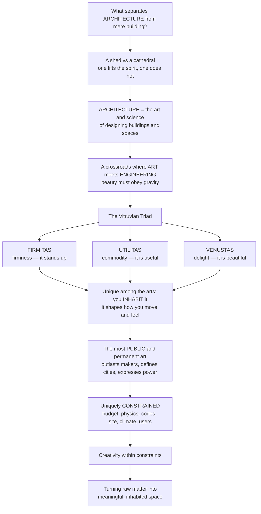

# Architecture Overview and the Art of Building

> [!abstract] TL;DR
> **Architecture is the art and science of designing buildings and the spaces we inhabit** — it lives at the crossroads where **art meets engineering**, where beauty must obey gravity and where human needs, cultural meaning, and physical reality are all reconciled in a single made thing you can walk *through*. The Roman architect **Vitruvius** captured its irreducible demands 2,000 years ago as a triad: **firmitas** (it must stand up), **utilitas** (it must be useful), and **venustas** (it must delight). Unlike any other art, architecture is *inhabited* rather than merely viewed, it is the most *public and permanent* thing most societies make, and it is *uniquely constrained* — creativity forced to work within budget, physics, codes, site, and climate.

---

## Intuition

**Analogy — the shed and the cathedral.** A bicycle shed keeps the rain off. So does Lincoln Cathedral. Both are *buildings*: both enclose space, shed water, and stand against gravity. Yet only one of them lifts the spirit. Walk into the shed and you notice nothing; walk into the cathedral and the soaring stone, the coloured light, the hush of scale pull the eye upward and something in you responds before a single thought forms. That surplus — the intention to *mean* something, to move a body and a mind and not just shelter them — is exactly what separates **architecture** from **mere building**. The art historian Nikolaus Pevsner put it bluntly: *"A bicycle shed is a building; Lincoln Cathedral is a piece of architecture."*

Extend the analogy into the technical domain and you get the whole discipline. Architecture is the *art and science of designing buildings and spaces*: it sits at a fascinating crossroads where **art meets engineering**, where beauty must obey gravity, and where the client's budget, the laws of physics, the building code, the site, the climate, the available materials, and the needs of real human users all have to be reconciled in one thing you can inhabit. It is the most *public* and *permanent* of the arts — buildings outlast their makers by centuries, define cities and skylines, and speak the values and power of whole civilizations. And it is uniquely *constrained*: unlike a painter facing a blank canvas, the architect creates only *within brutal limits*. As Churchill said, *"we shape our buildings; thereafter they shape us"* — which is why getting architecture right matters far beyond the drawing board.

---

## How It Works

### Core mechanics

Architecture is a discipline of **reconciliation**. Every design problem is the same shape: a set of human desires meeting a set of hard-edged realities, resolved into a physical object that people will live inside. The mechanism runs roughly like this:

1. **The distinction — architecture vs. building.** All architecture is building, but not all building is architecture. What is *added* is the deliberate dimension of aesthetic and cultural intention: design that considers not just *whether it stands and shelters* but *how it looks, feels, means, and shapes experience*. Architecture is therefore simultaneously an **art**, an **engineering/technology**, and a **social/functional practice** — it stands at the meeting point of the humanities, the sciences, and the professions.
2. **The Vitruvian triad — the foundational principles.** In *De Architectura* (c. 30–15 BCE), the Roman architect **Vitruvius** named the three demands every work of architecture must satisfy: **firmitas** (firmness/durability — it must be structurally sound and last), **utilitas** (commodity/utility — it must serve human use and the program), and **venustas** (delight/beauty — it must please the eye and lift the spirit). Sir Henry Wotton's 1624 English gloss — *"firmness, commodity, and delight"* — has stuck for four centuries. Good architecture is the perpetual **synthesis** of the three, not the maximizing of any one.
3. **What makes it distinctive — you inhabit it.** Architecture is the only art you experience by *moving through and dwelling in* it. It is bodily, spatial, temporal, and multisensory; it surrounds you and shapes how you move, gather, feel, and live — mostly below conscious awareness. It is also the most **public and permanent** art (buildings are collective, lasting, and inescapable) and it **expresses culture, values, and power** — temples, cathedrals, palaces, capitols, and skyscrapers are civilization's most legible symbols.
4. **The discipline of reality — creativity within constraints.** The architect is a *reconciler of competing demands*: the client and brief, the **budget**, the **laws of physics** (gravity and loads), the **materials** and construction technology, the **site, climate, and context**, the **building codes** and accessibility rules, and the needs of **users**. Constraints do not kill creativity; they *are* the creative problem.
5. **The design process.** Architecture moves from **brief** (what is needed) to **concept** (the guiding idea) to **drawings and models** (the representation) to the **built work** — an iterative loop of proposing, testing against constraints, and refining until firmness, commodity, and delight cohere.

### Flow / Architecture



---

## Key Concepts

**Secondary (can explain to a bright 16-year-old):**
- **Architecture vs. building.** Every building shelters; architecture *also* has design intention — it is meant to be useful *and* beautiful *and* to mean something. A shed is a building; a cathedral is architecture.
- **The three things every good building needs (Vitruvian triad).** It must **stand up** (firmness), **be useful** (commodity), and **look good / feel good** (delight). Miss any one and it fails as architecture.
- **You live inside it.** Unlike a painting you look at, a building surrounds you — you experience it by walking through and using it. That is what makes architecture special.

**Undergraduate (needs some background):**
- **The triad as a design tension.** Firmitas, utilitas, and venustas frequently pull against one another — a bolder form may cost more structure; more usable floor area may cost delight. Design is the *negotiated synthesis*, not the optimization of one axis. This is the seed of the enduring **form / function / ornament** debate.
- **Architecture at the crossroads.** It is at once **art** (aesthetic/cultural expression), **engineering** (structure, materials, physics), and **social practice** (serving programs, clients, and communities). It therefore borrows from the humanities, the sciences, and the professions at the same time.
- **Constraints define the problem.** A design must satisfy multiple **hard constraints** — budget, structural loads, code and egress, site and setback, program — that together carve a *feasible region* out of the design space. Within that region the architect optimizes for quality and delight. Removing constraints is not freedom; it is loss of the problem.
- **Architecture as expression of power and value.** Buildings are the most public artifacts a society makes; temples, palaces, capitols, and skyscrapers encode who holds power and what a culture prizes.

**Graduate (system-level thinking):**
- **The triad as a normative theory of quality.** Vitruvius' scheme is not a checklist but a claim about *what architecture is for* — a tripartite value system later reworked by every major theorist (Alberti's *concinnitas*, Ruskin's moral reading of ornament, Le Corbusier's *"machine for living,"* Venturi's *"complexity and contradiction"*). The perennial dualities — art vs. technology, form vs. function, the individual creator vs. society — are all restatements of tensions *internal* to the triad.
- **Constrained optimization as a model of practice.** Formally, architecture resembles multi-objective constrained optimization over an enormous, ill-defined design space: hard constraints bound feasibility; soft objectives (delight, experience, sustainability) are traded off; the "objective function" is contested and cultural. Unlike engineering optimization, there is *no unique optimum* — which is why architecture remains an art.
- **Phenomenology of inhabited space.** Because architecture is experienced through the moving, dwelling body over time, its meaning is *emergent and relational* — a matter of light, proportion, threshold, and sequence, not object-properties alone. This grounds the study of **space and spatial experience** as central rather than decorative.
- **Permanence and path-dependence.** Buildings are the largest, most expensive, longest-lived artifacts most societies produce; they lock in embodied energy, urban form, and behaviour for generations. *"We shape our buildings; thereafter they shape us"* is, at scale, a claim about civilizational path-dependence.

---

## Python Demo

```python
# Architecture overview: (a) the Vitruvian triad as a design-tradeoff space,
# and (b) architecture as constrained optimization carving a feasible design region.
# Requires: numpy, matplotlib
import numpy as np
import matplotlib.pyplot as plt

# ----- (a) THE VITRUVIAN TRIAD: firmitas / utilitas / venustas as a radar -----
# Each building type scored 0-10 on Structure (firmitas), Function (utilitas), Beauty (venustas).
axes_labels = ["Firmitas\n(structure)", "Utilitas\n(function)", "Venustas\n(beauty)"]
buildings = {
    "Warehouse  (utility-max)":   [7, 10, 2],   # useful + sturdy, little delight
    "Monument  (beauty-max)":     [6,  2, 10],  # glorious, barely functional
    "Cathedral  (balanced-high)": [9,  7, 10],  # firm, useful, and sublime
    "Well-rounded house":         [7,  8,  7],  # a considered synthesis of all three
}

N = 3
angles = np.linspace(0, 2 * np.pi, N, endpoint=False).tolist()
angles += angles[:1]  # close the polygon

fig = plt.figure(figsize=(13, 5.6))
ax1 = fig.add_subplot(1, 2, 1, polar=True)
for name, scores in buildings.items():
    vals = scores + scores[:1]
    ax1.plot(angles, vals, linewidth=2, label=name)
    ax1.fill(angles, vals, alpha=0.08)
ax1.set_xticks(angles[:-1])
ax1.set_xticklabels(axes_labels, fontsize=9)
ax1.set_ylim(0, 10)
ax1.set_title("Vitruvian triad: 'good architecture'\nbalances all three, not just one",
              fontsize=10, pad=20)
ax1.legend(loc="upper center", bbox_to_anchor=(0.5, -0.08), fontsize=7, ncol=2)

# ----- (b) ARCHITECTURE AS CONSTRAINED OPTIMIZATION: the feasible design region -----
ax2 = fig.add_subplot(1, 2, 2)
grid = np.linspace(0, 10, 500)
X, Y = np.meshgrid(grid, grid)   # x = footprint/cost proxy, y = height/form ambition

# Hard constraints, each carving away part of the design space:
budget    = Y <= 9 - 0.6 * X     # bigger + taller costs more
structure = Y <= 8               # slenderness / load limit
site      = X <= 8               # lot boundary / setback
program   = Y >= 2               # minimum usable height
egress    = X >= 1.5             # code: minimum footprint for exits
feasible  = budget & structure & site & program & egress

ax2.contourf(X, Y, feasible.astype(int), levels=[0.5, 1.5],
             colors=["#8ecae6"], alpha=0.6)
x = np.linspace(0, 10, 400)
ax2.plot(x, 9 - 0.6 * x, "r-",  lw=1.5, label="budget limit")
ax2.axhline(8,   color="k",     ls="--", lw=1.2, label="structural limit")
ax2.axvline(8,   color="g",     ls="--", lw=1.2, label="site boundary")
ax2.axhline(2,   color="purple",ls=":",  lw=1.4, label="min usable height (program)")
ax2.axvline(1.5, color="brown", ls=":",  lw=1.4, label="code egress minimum")
ax2.text(4.1, 4.0, "FEASIBLE\nDESIGN\nREGION", ha="center", va="center",
         fontsize=9, weight="bold")
ax2.set_xlim(0, 10); ax2.set_ylim(0, 10)
ax2.set_xlabel("footprint / cost  →")
ax2.set_ylabel("height / form ambition  →")
ax2.set_title("Architecture as constrained optimization:\nconstraints carve a feasible region",
              fontsize=10)
ax2.legend(loc="upper right", fontsize=7)

plt.tight_layout()
plt.savefig("architecture_overview.png", dpi=120)
plt.show()

# Takeaway:
#  (a) The warehouse maximizes utility, the monument maximizes beauty, but the
#      cathedral and the well-rounded house SYNTHESIZE all three - that synthesis
#      is what "good architecture" means.
#  (b) The architect never designs on a blank canvas: budget, structure, code,
#      site and program bound a feasible region, and creativity happens INSIDE it.
```

Running this produces two panels: a **radar chart** showing how different building types weight firmness, commodity, and delight (and how the best works balance all three), and a **design-space plot** in which five hard constraints intersect to leave a shrinking blue **feasible region** — a compact picture of "creativity within constraints."

---

## Real-World Applications

> **The Sydney Opera House (firmitas as the binding constraint).** Jørn Utzon's 1957 competition-winning sketch was pure *venustas* — sculptural shells that no one yet knew how to build. It took years, Ove Arup's engineers, and the reconception of the shells as segments of a single sphere before *firmitas* would allow the beauty to stand. The saga is the Vitruvian triad played out in public: delight had to be renegotiated until physics permitted it.

> **The Gothic cathedral (the triad, engineered).** The pointed arch, ribbed vault, and flying buttress were structural inventions (*firmitas*) that channelled loads to slender points, freeing the walls for vast stained glass — which flooded the nave with coloured light (*venustas*) inside a space organized for liturgy and pilgrimage (*utilitas*). Medieval masons had no calculus, yet solved the triad empirically over generations.

> **Contemporary practice — BIM and parametric design.** Modern architects encode the constraint-satisfaction picture literally: Building Information Modelling (Revit, ArchiCAD) and parametric tools (Grasshopper) let a design be tested against structure, cost, code, energy, and daylight *simultaneously*, so the feasible region can be explored computationally before anything is built — the S06 *digital frontier* of the discipline.

> **Zoning, codes, and the shape of cities.** Setback rules, floor-area ratios, and egress requirements are the visible edges of the "feasible design region." New York's 1916 zoning law produced the iconic stepped "wedding-cake" skyscraper *directly* — proof that constraints do not merely limit form; they *generate* it.

---

## Common Pitfalls

- **Collapsing architecture into engineering (or into art).** Treating a building as *only* a structural/functional problem yields the bicycle shed — sound and useful but mute. Treating it as *only* sculpture yields monuments that leak, cost too much, or ignore their users. Architecture is the *reconciliation*; dropping any leg of the triad is the classic failure.
- **Maximizing one value instead of synthesizing three.** Chasing pure *venustas* (a striking image) at the expense of *utilitas* and *firmitas* produces the "iconic" building that is miserable to inhabit and ruinous to maintain. The radar chart's lesson: the best works are *balanced*, not spiky.
- **Mistaking constraints for the enemy of creativity.** Beginners fantasize about "unlimited budget, no site, no code." But removing the constraints removes the *problem* — and with it the discipline that makes a design meaningful. Great architecture is famously *born from* tight constraints, not despite them.
- **Judging buildings as objects, not as inhabited space.** Photographing a façade misses the point: architecture is experienced by a moving body over time — threshold, sequence, light, and scale. A design that "looks great in the render" can feel oppressive to walk through.
- **Forgetting permanence.** Because buildings outlast their makers and lock in embodied energy and urban form for generations, a careless design is a *long* mistake. The stakes — cost, longevity, public presence — are higher than in almost any other creative field.

---

## Related Concepts

*This is the S01 hub for the Architecture vault. Its sibling foundation notes — **Vitruvius and the Principles of Architecture**, **Architectural Theory and Criticism**, **Form, Function and Ornament**, **Architecture, Culture and Society**, **The Design Process and Architectural Representation**, and **Space and Spatial Experience** — expand the themes introduced here, while later sections cover the vault's six-part scope: theory and principles, history across cultures, structure–materials–construction, the design of space and form, building types and professional practice, and the sustainable and digital frontiers.*

Cross-vault connections (verified to exist):

- [[Architecture_and_the_Built_Environment]] — the Art & Aesthetics vault's view of architecture *as an art form*; the aesthetic/venustas side of the triad from the humanities angle.
- [[Beauty_and_Taste]] — the philosophy of beauty underlying *venustas*: what it means for a building to "delight."
- [[Civil_Engineering_Overview]] — the engineering discipline that makes buildings *stand up*; the firmitas side rendered as science and calculation.
- [[Structural_Loads_and_Load_Paths]] — gravity, wind, and live loads: the physics the architect's form must obey.
- [[Design_Codes_and_Structural_Safety]] — codes and regulations as hard constraints carving the feasible design region.
- [[Concrete_Technology_and_Cement]] — the dominant material of modern construction; the materials leg of firmitas.
- [[Stress_Strain_and_Elastic_Moduli]] — how building materials deform and resist load, from the Materials Science side.
- [[The_Roman_Empire]] — the world in which Vitruvius wrote *De Architectura* and codified the triad that still governs the discipline.

---

## Review Questions

**Secondary:**
1. A bicycle shed and a cathedral both keep the rain off. Using the idea of the Vitruvian triad, explain what the cathedral has that the shed lacks — and why that makes it *architecture* rather than just a *building*.

**Undergraduate:**
2. A client wants the tallest, most sculptural possible building, but the budget is fixed, the lot is small, and the code demands minimum exits and a maximum height. Describe how these constraints together define a "feasible design region," and explain why a good architect treats that region as an opportunity rather than an obstacle. Which leg(s) of the Vitruvian triad does each constraint most directly protect?

**Graduate:**
3. Vitruvius' triad is often read as a timeless checklist, but the history of theory (Alberti, Ruskin, Le Corbusier, Venturi) can be read as a *series of renegotiations* of the balance between firmitas, utilitas, and venustas. Choose one of the perennial dualities — art vs. technology, form vs. function, or individual vs. society — and argue whether it is a genuine opposition or simply a tension *internal* to the triad. What does your answer imply about whether architecture can ever have a single "correct" solution?

---

## Sources

- Vitruvius, *The Ten Books on Architecture* (De Architectura), trans. M. H. Morgan — [Project Gutenberg](https://www.gutenberg.org/ebooks/20239)
- Nikolaus Pevsner, *An Outline of European Architecture* (Penguin) — [Wikipedia overview](https://en.wikipedia.org/wiki/Nikolaus_Pevsner)
- Francis D. K. Ching, *Architecture: Form, Space, and Order* (Wiley) — [Publisher page](https://www.wiley.com/en-us/Architecture:+Form,+Space,+and+Order,+4th+Edition-p-9781119853374)
- Roger Scruton, *The Aesthetics of Architecture* (Princeton University Press) — [Publisher page](https://press.princeton.edu/books/paperback/9780691158334/the-aesthetics-of-architecture)
- Sir Henry Wotton, *The Elements of Architecture* (1624) — origin of "firmness, commodity and delight" — [Wikipedia: Vitruvius](https://en.wikipedia.org/wiki/Vitruvius)

---

#architecture #vitruvian-triad #art-of-building #built-environment #architectural-theory
