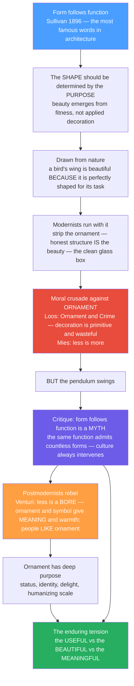

# 🏛️ Form, Function and Ornament

> [!abstract] TL;DR
> **Form** is a building's shape, appearance and composition; **function** is its purpose and use; **ornament** is its decoration and symbolic elaboration. Their relationship is one of architecture's oldest debates. In 1896 **Louis Sullivan** wrote *"form ever follows function"* — the three most famous words in architecture and the rallying cry of modernism: shape should be dictated by purpose, and beauty should emerge from fitness, not be applied on top. Modernists radicalised this into a crusade against ornament (**Adolf Loos**, *"Ornament and Crime"*, 1908; **Mies van der Rohe**, *"less is more"*). But the pendulum swung back: critics showed that form follows function is a **myth** — the same function admits countless forms — and postmodernists answered *"less is a bore"* (**Robert Venturi**), reclaiming ornament, symbol and meaning. The genuine tension between the **useful**, the **beautiful** and the **meaningful** never resolves — which is exactly why it stays productive.

---

## Intuition

**Analogy: a bird's wing versus a wedding cake.** Sullivan's argument starts in nature. A bird's wing, a shark's body, a tree's branching are *beautiful*, he said, precisely because they are perfectly shaped for their task — beauty is a by-product of fitness. *"Form ever follows function — this is the law."* So a building, too, should look like what it does: strip away the fake columns and pasted-on mouldings, let the honest structure and use *be* the beauty, and you get the clean glass box. That is the wing.

The wedding cake is the opposite instinct — tiers of decoration that do nothing structural, added purely to signal celebration, status and delight. Adolf Loos looked at the wedding-cake buildings of his day and called ornament a *crime*: primitive, wasteful, a drag on a civilised modern culture. **"Less is more,"** said Mies. But then people noticed something awkward. The bare glass box could feel sterile, cold, alienating — and, worse, *"form follows function"* turned out to be a bluff. A house, an office, a museum: each function can take a thousand different forms, so form is **never simply dictated** by function. Aesthetics, culture and choice always sneak in the back door. So Venturi fired back: **"Less is a bore."** People *like* ornament; it carries meaning, identity and human warmth. The real subject of this note is that unresolved triangle — the useful, the beautiful, the meaningful — and why every designer, of buildings or of anything else, still lives inside it.

---

## How It Works

The classical brief for architecture is older than modernism: Vitruvius asked for *firmitas* (it must stand), *utilitas* (it must work) and *venustas* (it must delight) — structure, function and beauty held in balance. The modern debate is a two-thousand-year argument about **which of those three drives the others**, and where ornament fits. Sullivan proposed that *utilitas* should generate *venustas* automatically. Loos and Mies purged ornament to make that purity total. The critique showed the logic was circular, and postmodernism restored ornament as a legitimate carrier of meaning. The diagram traces that swing.



---

## Key Concepts

### 🟢 Secondary — the core vocabulary
- **Form** = a thing's shape, appearance and composition. **Function** = its purpose and use. **Ornament** = its decoration and symbolic detail.
- **"Form follows function"** (Louis Sullivan, 1896): the shape of a thing should be determined by what it is *for*, and beauty should come from that fitness rather than from applied decoration.
- **Functionalism**: the design philosophy that makes function the primary driver of form.
- The two slogans that frame the whole fight: **"Less is more"** (Mies van der Rohe) versus **"Less is a bore"** (Robert Venturi).
- The four protagonists: **Sullivan** (coined it), **Loos** (attacked ornament), **Mies** (perfected the bare box), **Venturi** (brought ornament back).

### 🟡 Undergraduate — the modernist argument and its critique
- **Sullivan's source in nature**: he read form-follows-function off evolved organisms, where a wing or fin looks the way it does *because* of its task. Beauty as a by-product of fitness-for-purpose.
- **Loos, *Ornament and Crime* (1908)**: ornament is atavistic, wasteful of labour and material, and dishonest; a mature, modern culture should produce plain, unornamented objects. The argument is as much **ethical and social** as aesthetic.
- **The machine aesthetic**: standardisation, mass production, the plain white wall and glass curtain wall as expressions of an industrial age — the moral case that ornament is *elitist* and *dishonest*.
- **The critique (Peter Collins, Edward De Zurko)**: form follows function is **under-determined** — a single function is satisfied by an unbounded family of forms, so function *constrains* but never *dictates* form. Aesthetics and culture always enter.
- **The postmodern return**: Venturi, Scott Brown and Izenour's *Learning from Las Vegas* (1972) distinguishes **"the decorated shed"** (an ordinary building carrying applied signs and symbols) from **"the duck"** (a building whose whole form *is* a symbol). They defend the "ugly and ordinary" and the communicative value of ornament. **Charles Jencks** dated modernism's "death" to a demolition and championed the plural, symbolic language of postmodernism.

### 🔴 Graduate — dissolving the binary
- **"Function" is plural, not singular.** A building functions *practically* (shelter, circulation) but also *symbolically*, *psychologically* and *socially* — a bank must look trustworthy, a court authoritative. Symbolic function is irreducible, so a *purely* practical functionalism is impossible; the bare box is itself a loud symbol (of purity, wealth, technocracy).
- **"Honesty of structure" is a rhetorical stance, not a neutral truth.** Exposed beams, expressed frames and "truth to materials" are aesthetic *choices* dressed as ethics; Mies's I-beam mullions on the Seagram Building are famously **decorative** applied elements — ornament by another name.
- **The naturalistic fallacy in Sullivan's "law."** Evolution optimises for reproductive fitness, not beauty, and "form follows function" in biology is a description, not a design prescription. Reading an *ought* (how we should build) off an *is* (how nature is built) is a logical slip.
- **Ornament's cognitive function.** Ernst Gombrich's *The Sense of Order* (1979) reframes ornament from waste to a deep **perceptual and psychological need** — the mind seeks pattern, rhythm and framing; ornament marks hierarchy, thresholds and scale, and gives the eye relief and orientation.
- **Contemporary syntheses**: performance-driven form (structure and environment generating shape), **expressive structure** (the frame as the architecture), and the **digital/parametric return of ornament** — computation makes elaborate, non-repeating detail cheap again, so *ornament-as-structure* and *ornament-as-data* re-open a door modernism thought it had shut.

---

## Python Demo

```python
# Form, Function and Ornament -- two quantitative arguments:
#   (1) "form follows function" is UNDER-DETERMINED: one function -> many forms
#   (2) the ornament debate has an INTERIOR OPTIMUM (not 0, not maximal),
#       and swings as a historical pendulum.
import numpy as np
import matplotlib.pyplot as plt
from matplotlib.patches import Rectangle

fig, ax = plt.subplots(2, 2, figsize=(13, 10))

# ----------------------------------------------------------------------
# THEME 1: one fixed FUNCTION (a dwelling needing a set floor area)
# is satisfied EQUALLY WELL by an infinite family of FORMS.
# ----------------------------------------------------------------------
A_required = 100.0                       # m^2 of usable floor area = the FUNCTION
widths  = np.array([4, 5, 6.325, 8, 10, 12.5, 16, 20, 25])
heights = A_required / widths            # depth forced so width*depth = area

# --- Panel (a): a sample of the many valid footprints -----------------
ax0 = ax[0, 0]
x_cursor = 0.0
for w, h in zip(widths, heights):
    ax0.add_patch(Rectangle((x_cursor, 0), w, h, alpha=0.35, edgecolor="black"))
    x_cursor += w + 2
ax0.set_xlim(0, x_cursor); ax0.set_ylim(0, heights.max() + 2)
ax0.set_aspect("equal")
ax0.set_title("One FUNCTION, many FORMS\nevery footprint encloses exactly 100 m^2")
ax0.set_xlabel("plan width (m)"); ax0.set_ylabel("plan depth (m)")

# --- Panel (b): the space of valid forms is a whole CURVE, not a point -
ax1 = ax[0, 1]
w_cont = np.linspace(2, 50, 400)
ax1.plot(w_cont, A_required / w_cont, lw=2)
ax1.scatter(widths, heights, zorder=5)
ax1.set_xlim(0, 50); ax1.set_ylim(0, 50); ax1.grid(alpha=0.3)
ax1.set_title("The space of valid forms\nwidth x depth = 100 -> infinitely many solutions")
ax1.set_xlabel("width (m)"); ax1.set_ylabel("depth (m)")
ax1.text(18, 33, "function constrains but\ndoes NOT determine form\n-> aesthetics choose the point",
         fontsize=9)

# ----------------------------------------------------------------------
# THEME 2: the ornament debate as an OPTIMUM.
# cost (labour, material, Loos's "waste") rises super-linearly;
# value (meaning, delight, identity) rises but SATURATES.
# Net benefit peaks at an interior optimum: not 0, not maximal.
# ----------------------------------------------------------------------
ax2 = ax[1, 0]
x     = np.linspace(0, 1, 400)                 # ornament level: 0 = bare box, 1 = maximal
cost  = 1.6 * x**1.7                            # Loos's waste argument
value = 1.3 * (1 - np.exp(-4.0 * x))           # diminishing meaning / delight
net   = value - cost
x_star = x[np.argmax(net)]
ax2.plot(x, cost,  label="cost of ornament (waste)")
ax2.plot(x, value, label="value of ornament (meaning, delight)")
ax2.plot(x, net,   label="net benefit", lw=2.5)
ax2.axvline(x_star, ls="--", color="k")
ax2.scatter([x_star], [net.max()], zorder=5)
ax2.set_title("Ornament as an OPTIMUM\noptimal level is neither 0 nor maximal")
ax2.set_xlabel("ornament level"); ax2.set_ylabel("utility (arb. units)")
ax2.legend(fontsize=8); ax2.grid(alpha=0.3)

# ----------------------------------------------------------------------
# THEME 3: the modernism <-> postmodernism pendulum over time.
# ----------------------------------------------------------------------
ax3 = ax[1, 1]
t = np.linspace(1890, 2025, 500)
premodern    = 0.75 * np.exp(-((t - 1900) / 22) ** 2)   # Beaux-Arts / Art Nouveau
postmodern   = 0.65 * np.exp(-((t - 1985) / 16) ** 2)   # PoMo ornament revival
contemporary = 0.35 * np.exp(-((t - 2015) / 12) ** 2)   # parametric / measured return
ornament_level = np.clip(0.08 + premodern + postmodern + contemporary, 0, 1)
ax3.plot(t, ornament_level, lw=2)
ax3.axvspan(1925, 1965, alpha=0.12, color="gray")
ax3.text(1945, 0.03, "Modernist trough\n'less is more'", ha="center", fontsize=8)
ax3.text(1985, ornament_level.max(), "'less is a bore'", ha="center", fontsize=8)
ax3.set_title("The ornament pendulum\nmodernism strips it, postmodernism restores it")
ax3.set_xlabel("year"); ax3.set_ylabel("cultural ornament level"); ax3.grid(alpha=0.3)

plt.tight_layout()
plt.savefig("form_function_ornament.png", dpi=130)

print(f"Function requires floor area A = {A_required:.0f} m^2")
print(f"Sampled {len(widths)} valid FORMS, all enclosing exactly {A_required:.0f} m^2")
print("=> 'form follows function' is UNDER-DETERMINED: many forms -> one function")
print(f"Optimal ornament level x* = {x_star:.2f}  (interior: not 0, not 1)")
```

Running it prints an optimum ornament level around `x* ≈ 0.4` — a middle ground that rebukes *both* strict modernism (zero ornament) and decorative excess — and shows a whole curve of footprints satisfying the single 100 m² requirement, making the under-determination of form concrete.

---

## Real-World Applications

> **Example — the Seagram Building (Mies van der Rohe, 1958).** The canonical "less is more" tower: a bronze-and-glass curtain wall of near-perfect restraint. Yet Mies applied non-structural **I-beam mullions** to the facade purely to *express* the frame — a decorative gesture on a supposedly ornament-free building. Modernism's purest icon is quietly ornamented, which is exactly the critique's point.

- **The duck versus the decorated shed** — Venturi's roadside taxonomy explains everything from a giant duck-shaped shop (form *is* the sign) to a plain big-box store with a huge logo (a shed carrying applied symbols). Most commercial architecture is decorated sheds; recognising this legitimised signage, symbol and ornament as real design content.
- **The AT&T Building (Philip Johnson, 1984)** — a skyscraper topped with a broken "Chippendale" pediment, the poster child of postmodern ornament's return and a deliberate slap at the flat-topped modernist box.
- **Islamic geometric ornament and Gothic tracery** — centuries of ornament that encode cosmology, identity and craft, humanise vast scale and mark thresholds; evidence that ornament carries *meaning*, not just decoration.
- **Product and interface design** — Dieter Rams and Apple translate "form follows function" into industrial design, while the skeuomorphism-versus-flat-design cycle in software UIs is the same modernism/postmodernism pendulum replayed on screens.
- **Parametric and 3D-printed facades** — computation makes non-repeating detail cheap again, reviving *ornament-as-structure* (responsive shading screens, patterned load-bearing skins) and reopening the door modernism thought it had closed.

---

## Common Pitfalls

- **Taking "form follows function" literally.** It is under-determined: function constrains the form-space but never picks a single point. Treating it as a deterministic law hides the aesthetic and cultural choices always being made.
- **Believing all ornament is "crime."** Loos's essay was a polemic of its specific moment, not a timeless proof. Ornament demonstrably communicates status, identity and meaning and answers a real perceptual need (Gombrich).
- **Confusing "no ornament" with "no aesthetic choice."** The minimalist glass box is a highly styled, often expensive, deeply *aesthetic* decision — absence of ornament is itself a strong stylistic statement, not neutrality.
- **Mistaking "honesty of structure" for objective truth.** Expressed frames and exposed services are rhetorical, chosen effects; the "truthful" building is arguing a position, not reporting a fact.
- **The naturalistic fallacy.** Sullivan read a design *ought* off nature's *is*. Evolution optimises for fitness, not beauty; you cannot derive how we *should* build from how organisms *are* built.
- **Treating function as singular.** Symbolic, social and psychological functions are real functions. A design that "works" practically but signals the wrong thing has failed a genuine functional requirement.

---

## Related Concepts

*Sibling notes in this vault (referenced in prose, to be written): **Architecture_Overview_and_the_Art_of_Building**, **Vitruvius_and_the_Principles_of_Architecture** (the firmitas/utilitas/venustas triad this debate reorders), **Architectural_Theory_and_Criticism**, **Modern_Architecture_and_the_Modern_Movement** (where "less is more" and the ornament purge belong), **Postmodern_and_Contemporary_Architecture** (where "less is a bore" and the decorated shed belong), and **Materials_and_Tectonics_in_Architecture** (structural honesty and ornament-as-structure).*

Cross-vault links (verified to exist):

- [[Architecture_and_the_Built_Environment]] — the built-environment overview that fixes the Vitruvian triad this note argues over.
- [[Design_and_the_Applied_Arts]] — the same form/function/ornament tension in product and applied design.
- [[Beauty_and_Taste]] — the deeper question of *where beauty comes from* that Sullivan answered with "fitness."
- [[Formalism_and_Aesthetic_Theory]] — the view that form itself is the seat of aesthetic value, a cousin of functionalist purity.
- [[Contemporary_and_Postmodern_Art]] — the wider postmodern turn that rehabilitated ornament, symbol and reference.
- [[Art_and_Meaning]] — ornament as a carrier of meaning, identity and communication.

---

## Review Questions

**🟢 Secondary**
1. What did Louis Sullivan mean by "form follows function," and where did he say the idea came from?
2. Who said "less is more" and who answered "less is a bore" — and what does each slogan claim about ornament?

**🟡 Undergraduate**
3. Explain why critics call "form follows function" *under-determined*. Use the idea that one function can be met by many forms.
4. Summarise Adolf Loos's argument in *Ornament and Crime* and then explain what Venturi's "decorated shed" proposed instead.

**🔴 Graduate**
5. "A purely functionalist architecture is impossible because symbolic function is irreducible." Argue for or against, using the claim that a bank must *look* trustworthy.
6. How does Gombrich's *The Sense of Order* reframe ornament from wasteful decoration to a cognitive necessity — and why does that undercut Loos's moral case?

---

## Sources

- Louis H. Sullivan, [*The Tall Office Building Artistically Considered*](https://en.wikipedia.org/wiki/Form_follows_function) (Lippincott's Magazine, 1896).
- Adolf Loos, [*Ornament and Crime*](https://en.wikipedia.org/wiki/Ornament_and_Crime) (essay, 1908; published 1913).
- Robert Venturi, Denise Scott Brown & Steven Izenour, [*Learning from Las Vegas*](https://mitpress.mit.edu/9780262720069/learning-from-las-vegas/) (MIT Press, 1972).
- Ernst H. Gombrich, [*The Sense of Order: A Study in the Psychology of Decorative Art*](https://en.wikipedia.org/wiki/The_Sense_of_Order) (Phaidon, 1979).
- Peter Collins, [*Changing Ideals in Modern Architecture, 1750–1950*](https://www.mqup.ca/changing-ideals-in-modern-architecture--1750-1950-products-9780773517158.php) (1965) — on the critique of functionalism.

---

#architecture #form-follows-function #ornament #functionalism #less-is-more
