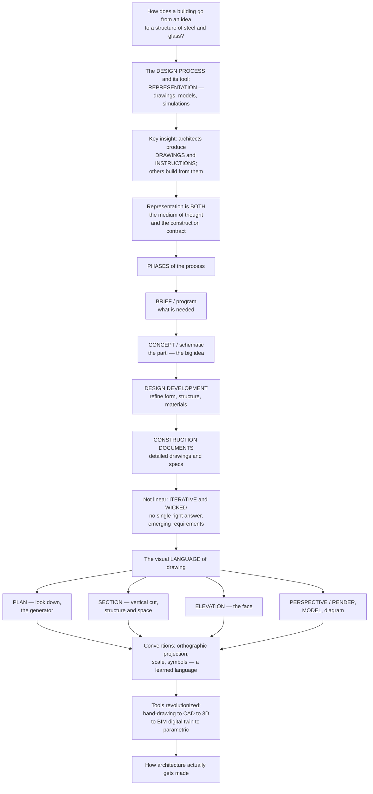

# The Design Process and Architectural Representation

> [!abstract] TL;DR
> **A building travels from a vague idea in someone's head to a physical structure of steel and glass through the DESIGN PROCESS and its essential tool: REPRESENTATION** — the drawings, models, and digital simulations that let architects *think, explore, communicate, and specify* a building before a single brick is laid. The crucial insight is that **architects do not build buildings** — they produce **drawings and instructions**, and others build from those. So representation is not mere illustration; it is *the very medium of architectural thought* and the *legal-technical contract* for construction. The process flows through phases — **brief → concept/schematic → design development → construction documents** — but rarely linearly: it is **iterative** and a **"wicked problem"** with no single right answer. Architects speak a learned visual language — **plan, section, elevation, perspective, model** — each revealing different information through conventions of **projection, scale, and symbol**; and the tools have revolutionized from hand-drafting to CAD to **BIM's data-rich digital twin** to parametric design.

---

## Intuition

**Analogy — the architect as a novelist who never lifts a brick.** A novelist does not *live* the story; she writes *marks on paper* from which readers build the world in their heads. An architect is stranger still: she designs a cathedral she will never physically touch, by producing **marks on paper** — plans, sections, elevations — from which *contractors* build the cathedral in the world. The architect's entire craft happens in the space *between* the idea and the building: in the drawing. The drawing is where she thinks (a sketch is not a picture of a decision, it *is* the deciding), where she persuades the client, where she coordinates the structural engineer, and where — finally — she hands the builder an instruction precise enough to pour concrete against. Miss the point of the drawing and you miss what architecture actually *is* as a practice.

Extend the analogy into the discipline. **Representation is a double thing.** Looking *inward*, it is the **medium of architectural thought** — architects reason *by drawing*, testing a form the way a mathematician tests a proof by writing it out. Looking *outward*, it is a **specification and a contract** — the construction documents are a legally binding instruction set that says exactly where every wall, pipe, and bolt goes. Between those two poles lies the whole **design process**: from the **brief** (what the client needs), to the **concept** or *parti* (the big generative idea), through **design development** (resolving form, structure, materials), to the **construction documents** (the builder's manual). It is never a tidy assembly line — it loops back on itself, and it is a *wicked problem* in the technical sense: ill-defined, with requirements that only emerge as you solve it, and no provably "correct" answer. To make it thinkable, architects use a special visual **language** — the **plan** (a horizontal cut seen from above, *"the plan is the generator"* said Le Corbusier), the **section** (a vertical cut baring height and structure), the **elevation** (the flat exterior face), the **perspective**, the **model**, the **diagram** — each a different lens on the same three-dimensional truth.

---

## How It Works

### Core mechanics

The design process is a machine for **converting uncertainty into instruction**. It runs, roughly, like this:

1. **The founding fact — architects produce representations, not buildings.** The architect's deliverable is a set of **drawings, models, and specifications**; the *building* is produced by others (contractors, trades, fabricators) reading those documents. This single fact makes representation the discipline's core skill: it is simultaneously the architect's **thinking tool** (the sketch as exploration) and the project's **technical-legal instruction** (the construction contract). There is always a **gap** between the representation and the built work — managing that gap is much of what practice is about.
2. **The phases — brief to building.** Work typically flows through recognizable stages: the **brief / program** (client needs, budget, site analysis, constraints), **concept / schematic design** (the generative *parti* or big idea, rapid sketches, exploring alternatives), **design development** (refining form, structure, materials, and building systems into a coherent whole), and **construction documentation** (detailed working drawings and written specifications precise enough to build and price from).
3. **The shape of the process — iterative and "wicked."** The stages are *not* a one-way pipeline. Design **loops**: each proposed solution reveals new problems and reframes the question. Rittel and Webber called such tasks **wicked problems** — ill-defined, lacking a stopping rule, with no single right answer and requirements that *emerge through the act of solving*. You stop not when the design is "correct" but when it is *good enough* (satisficing).
4. **Design as a way of knowing.** Nigel Cross called this **"designerly ways of knowing"**; Donald Schön called it **reflective practice** — a *conversation with the materials of a situation* conducted through sketch, model, and studio critique. The drawing is not a record of thought that happened elsewhere; it is *where the thinking occurs*.
5. **The visual language — projection, scale, symbol.** Each drawing type applies **orthographic projection** (parallel rays, no perspective distortion, so dimensions stay true) to reveal different information: the **plan** shows spatial arrangement, the **section** shows vertical and structural relationships, the **elevation** shows the facade. **Scale** (1:100, 1:20, 1:5…) selects how much detail is shown; **line weight** and **standardized symbols** encode meaning. It is a *learned professional language*, as conventional as musical notation.
6. **Tools shape what can be imagined.** The medium is not neutral: **hand-drafting → 2D CAD → 3D modeling → BIM → parametric/generative design** each expanded what architects could conceive, coordinate, and build. **BIM** (Building Information Modeling) makes the model a data-rich **digital twin** that integrates geometry, materials, systems, cost, and schedule; parametric tools let *algorithms* generate and optimize form.

### Flow / Architecture



---

## Key Concepts

**Secondary (can explain to a bright 16-year-old):**
- **Architects draw; builders build.** An architect makes detailed *drawings and instructions*; other people follow them to construct the actual building. So the drawing is the architect's real product.
- **Three ways to draw a building.** The **plan** is what you see looking straight *down* (the layout of rooms). The **elevation** is the flat *front* of the building (how the face looks). The **section** is what you would see if you *sliced* the building open (how tall the rooms are inside). Each shows something the others cannot.
- **Design is messy, not straight.** You start with what's needed, sketch a big idea, and keep changing it — going backward and forward — because every fix creates a new question. There is no single "right" building.

**Undergraduate (needs some background):**
- **The phases and the parti.** Real projects move through **brief → schematic → design development → construction documents**, driven early on by a **parti** — a single organizing idea (a spine, a courtyard, a wrapped box) from which the rest of the design is generated.
- **Orthographic projection.** Plans, sections, and elevations use **parallel projection** onto a plane, so **measurements stay true** (unlike perspective). A plan is literally a *horizontal cut* taken about a metre up and viewed from above; a section is a *vertical cut*. Scale, line-weight hierarchy, and standardized symbols make the drawings readable and buildable.
- **Wicked problems.** Following Rittel and Webber, architectural design is **ill-structured**: you cannot fully state the problem before solving it, there is no true/false answer (only better/worse), and there is no natural stopping point — you satisfice. This is why design is *iterative* by necessity, not by sloppiness.
- **Representation types as information filters.** The **diagram** abstracts organization; the **perspective/render** communicates appearance; the **axonometric** keeps 3D *and* measurability; the **physical model** tests form, light, and structure. Choosing the right representation for the question is itself a skill.

**Graduate (system-level thinking):**
- **Representation as a semiotic and legal system.** Construction documents are a **performative specification**: the drawing does not *describe* a building so much as *instruct* its coming-into-being, and its authority is contractual and regulatory. The persistent **gap** between drawing and built work (tolerances, RFIs, site conditions) is where architectural intent is negotiated, degraded, or ingeniously preserved.
- **Designerly epistemology.** Cross's *"designerly ways of knowing"* and Schön's *reflective practitioner* frame design cognition as **abductive** and **situated** — a "reflective conversation with the situation" in which the medium (sketch, model) *talks back*. This distinguishes design reasoning from the deductive/inductive modes of the sciences and grounds why the **studio** and the **sketch** are pedagogically irreducible.
- **The medium constrains the imaginable.** Each tool era has an implicit formal grammar: hand-drawing privileges the orthographic and the memorable line; CAD privileges the repeatable and the layered; **BIM** privileges the coordinated, object-oriented, and analyzable; **parametric/generative** design privileges the rule-based, continuously variable, and optimizable. Tools are not neutral scribes — they shape *what forms can be conceived, coordinated, and costed*.
- **Wickedness, path-dependence, and the ethics of the render.** Because the design commits enormous, long-lived resources under irreducible uncertainty, early framing decisions are strongly **path-dependent**, and the seductive photoreal **render** raises a genuine ethics of representation — the persuasive image can promise experiences the built work will not deliver.

---

## Python Demo

```python
# The design process & architectural representation:
#  (a) ORTHOGRAPHIC PROJECTION - deriving PLAN, ELEVATION and SECTION from ONE 3D form
#  (b) ITERATIVE / "WICKED" design - competing criteria converging on a satisficing whole
# Requires: numpy, matplotlib
import numpy as np
import matplotlib.pyplot as plt

# ---------------------------------------------------------------
# A single 3D building form: a gable-roofed "house" massing.
#   footprint  x in [0, 8], y in [0, 6];   walls to z = 4;   ridge at x = 4, z = 6
#   PLAN, ELEVATION and SECTION are three ORTHOGRAPHIC projections of THIS one solid.
# ---------------------------------------------------------------
W, D, EAVE, RIDGE = 8.0, 6.0, 4.0, 6.0   # width, depth, eave height, ridge height

fig, axes = plt.subplots(2, 2, figsize=(12, 10))

# ---------- (a1) PLAN - a horizontal cut seen from ABOVE (footprint + layout) ----------
ax = axes[0, 0]
ax.add_patch(plt.Rectangle((0, 0), W, D, fill=False, lw=2))            # outer walls
ax.plot([4, 4], [0, D], "k--", lw=1)                                   # roof ridge above
ax.plot([5, 5], [0, D], color="0.5", lw=1.2)                           # interior partition
ax.plot([0, 5], [3.6, 3.6], color="0.5", lw=1.2)                       # interior partition
ax.add_patch(plt.Rectangle((3.4, -0.08), 1.2, 0.16, color="saddlebrown"))  # door opening
ax.text(2.3, 1.7, "living", ha="center", fontsize=8)
ax.text(6.5, 3.0, "rooms",  ha="center", fontsize=8)
ax.text(4, D + 0.45, "ridge line - roof above", ha="center", fontsize=7, color="0.4")
ax.set_title("PLAN  -  look DOWN\n'the plan is the generator'", fontsize=10)
ax.set_xlim(-1, 9); ax.set_ylim(-1, 8); ax.set_aspect("equal"); ax.axis("off")

# ---------- (a2) FRONT ELEVATION - exterior FACE, projected onto a vertical plane ----------
ax = axes[0, 1]
house = np.array([[0, 0], [W, 0], [W, EAVE], [W/2, RIDGE], [0, EAVE], [0, 0]])  # gable
ax.plot(house[:, 0], house[:, 1], "k-", lw=2)
ax.add_patch(plt.Rectangle((3.4, 0), 1.2, 2.2, color="saddlebrown"))   # door
for wx in (1.2, 5.6):                                                  # windows
    ax.add_patch(plt.Rectangle((wx, 1.4), 1.2, 1.2, fill=False, lw=1.2))
ax.set_title("ELEVATION  -  the exterior FACE\nhow the facade looks", fontsize=10)
ax.set_xlim(-1, 9); ax.set_ylim(-1, 8); ax.set_aspect("equal"); ax.axis("off")

# ---------- (a3) SECTION - a VERTICAL cut, revealing interior heights & structure ----------
ax = axes[1, 0]
ax.fill(house[:, 0], house[:, 1], facecolor="#d9e8f5", edgecolor="k", lw=2)  # cut solid
ax.plot([0, W], [EAVE, EAVE], "k-", lw=1.2)                            # ceiling / tie line
ax.annotate("", xy=(0.6, 0), xytext=(0.6, EAVE), arrowprops=dict(arrowstyle="<->"))
ax.text(1.0, EAVE/2, "room\nheight\n4 m", fontsize=7, va="center")
ax.annotate("", xy=(7.4, 0), xytext=(7.4, RIDGE), arrowprops=dict(arrowstyle="<->"))
ax.text(6.2, RIDGE/2, "ridge\n6 m", fontsize=7, va="center")
ax.set_title("SECTION  -  a VERTICAL cut\nreveals interior height & structure", fontsize=10)
ax.set_xlim(-1, 9); ax.set_ylim(-1, 8); ax.set_aspect("equal"); ax.axis("off")

# ---------- (b) ITERATIVE, "WICKED" design: quality converging over refinements ----------
ax = axes[1, 1]
rng = np.random.default_rng(3)
it = np.arange(0, 25)
def refine(target, noise):     # each criterion climbs toward "good enough" with reframing jolts
    base = target * (1 - np.exp(-it / 6.0))
    return np.clip(base + rng.normal(0, noise, it.size) * np.exp(-it / 12.0), 0, 1)
form      = refine(0.90, 0.06)
function  = refine(0.85, 0.05)
cost      = refine(0.80, 0.07)
structure = refine(0.88, 0.05)
overall   = np.min(np.vstack([form, function, cost, structure]), axis=0)   # weakest link
for name, c in [("form", form), ("function", function), ("cost", cost), ("structure", structure)]:
    ax.plot(it, c, lw=1.2, alpha=0.7, label=name)
ax.plot(it, overall, "k-", lw=2.5, label="overall - satisficing")
ax.axhline(0.75, color="green", ls="--", lw=1, label="'good enough' threshold")
ax.set_xlabel("design iteration"); ax.set_ylabel("solution quality")
ax.set_title("ITERATIVE & WICKED design:\ncompeting criteria converge on a whole", fontsize=10)
ax.set_ylim(0, 1.05); ax.legend(fontsize=7, loc="lower right")

plt.tight_layout()
plt.savefig("design_process_representation.png", dpi=120)
plt.show()

# Takeaway:
#  (a) PLAN, ELEVATION and SECTION are three orthographic projections of ONE 3D form -
#      each reveals different information (layout, facade, interior height), which is
#      exactly why architects need multiple views to fully specify a building.
#  (b) Design is not linear: many competing criteria are refined together over
#      iterations, and the "overall" quality tracks the WEAKEST leg - a satisficing
#      search on a wicked problem, not a single-objective optimum.
```

Running this produces four panels. The first three — **plan, elevation, section** — are all orthographic projections of the *same* gable-roofed massing, yet each carries information the others cannot (spatial layout, facade appearance, interior height and structure), demonstrating why a single view can never specify a building. The fourth panel models the **iterative, wicked** nature of design: form, function, cost, and structure each climb toward "good enough," and the **overall** quality tracks the *weakest leg* — a satisficing search, not a single-objective optimum.

---

## Real-World Applications

> **Construction documents as a legal instrument.** On any real project, the drawings the architect stamps and issues *are* the contract set that the general contractor prices and builds against. A misplaced dimension or a missing detail is not an aesthetic slip — it is a **change order**, a cost, and sometimes a liability. This is representation at its most consequential: the mark on paper becomes a binding instruction to pour concrete.

> **Le Corbusier and "the plan is the generator."** In *Vers une architecture* (1923), Le Corbusier argued that the **plan** is where architectural order originates — organize the plan well and section, elevation, and experience follow. His Villa Savoye is legible as a plan-driven object: the *promenade architecturale* is literally a path drawn first in plan and section, then walked in three dimensions.

> **BIM and the digital twin — coordination before construction.** In tools like Revit or ArchiCAD, the building is a single **data-rich 3D model** from which plans, sections, elevations, schedules, and quantities are *derived* automatically and stay coordinated. **Clash detection** flags a duct running through a beam *in the model*, months before either is fabricated — a wicked-problem loop compressed into software, and the reason BIM is now mandated on many large public projects.

> **Parametric and generative design.** With Grasshopper (Rhino) or generative solvers, the architect encodes *rules and objectives* — daylight, structural depth, floor-area targets — and lets algorithms *generate and optimize* thousands of candidate forms. The representation stops being a fixed drawing and becomes a **space of possible buildings** the designer navigates, an idea developed further in the vault's parametric-design frontier.

> **The render and the ethics of persuasion.** The photoreal render sells the project to clients, planning boards, and the public. But the seductive image — glowing dusk light, impossibly clean plazas, cheerful crowds — can promise an experience the built work will not deliver, which is why the accuracy and honesty of architectural representation is a live professional-ethics question.

---

## Common Pitfalls

- **Mistaking the drawing for illustration.** Beginners treat the sketch as a *picture of a finished decision*. In real practice the sketch is *how the decision is made* — thinking-through-drawing. Skipping messy exploratory drawing in favor of pretty final images produces shallow, un-interrogated designs.
- **Confusing elevation and section.** Both are vertical views, but an **elevation** shows the *exterior face* while a **section** shows a *cut through the interior* revealing heights and structure. Reading one as the other is a classic student error and hides exactly the spatial information a section exists to expose.
- **Treating design as a linear pipeline.** Expecting brief → concept → documents to run once, forward, with no loops. Design is **iterative and wicked**: skipping the loop-backs (or "freezing" the concept too early) bakes in problems that surface expensively during construction.
- **Ignoring scale conventions.** A plan at 1:500 answers different questions than one at 1:20; drawing detail the scale cannot support, or omitting detail the scale demands, makes documents unbuildable. Scale is a decision about *what information to show*, not just how big to draw.
- **Believing the render.** Confusing a persuasive photoreal image with the lived building. Renders flatter light, weather, crowds, and wear; a design that "looks great in the render" can be oppressive to walk through — and promising it is an ethical hazard.
- **Assuming BIM removes judgment.** A data-rich model coordinates geometry, but it does not decide the *parti*, resolve the wicked trade-offs, or guarantee the render matches reality. Tools shape what can be imagined; they do not do the imagining.

---

## Related Concepts

*This note sits in the Architecture vault's S01 foundations, alongside its sibling notes — **Architecture Overview and the Art of Building** (what architecture is), **Architectural Theory and Criticism** (how we judge it), **Space and Spatial Experience** (what plans and sections ultimately shape), **Circulation, Program and Plan** (the organizational logic drawings encode), and the S06 digital-frontier pair **Parametric and Computational Design** and **BIM, Digital Fabrication and Smart Buildings**, which carry the representation story from hand-drawing into algorithmic and data-driven practice. These siblings are referenced here in prose; the cross-vault links below are Glob-verified to exist.*

- [[Projection_and_Viewing]] — the Computer Graphics account of orthographic and perspective projection; the same mathematics that turns a 3D scene into a 2D image underlies plan, section, and elevation.
- [[3D_Transforms_and_Matrices]] — the matrix machinery behind 3D modeling and rotating a virtual building to derive any view; the digital successor to the drafting board.
- [[Projective_Geometry]] — the mathematics of perspective and vanishing points that makes a **perspective drawing** or render geometrically correct.
- [[Coordinate_Geometry]] — projecting a solid onto coordinate planes is exactly what a plan (onto the horizontal) and an elevation (onto the vertical) *are*.
- [[Product_Design_Overview]] — the broader design-process and design-thinking discipline; architecture is one domain of the same brief-to-prototype-to-iteration logic.
- [[Product_Discovery]] — the software analog of the architectural **brief**: understanding needs and constraints before committing to a solution.
- [[Composition_and_Design_Principles]] — the visual-composition principles (balance, hierarchy, rhythm) that govern how an elevation or a diagram reads.
- [[Design_and_the_Applied_Arts]] — design as a discipline within the arts; situates architectural drawing among the applied and design arts.
- [[Design_Codes_and_Structural_Safety]] — building codes and standards as the hard constraints that construction documents must satisfy and encode.

---

## Review Questions

**Secondary:**
1. An architect never physically builds the building she designs — so what *does* she actually produce, and how does a real building get made from it? Using a house, explain what a **plan**, an **elevation**, and a **section** each show that the other two cannot.

**Undergraduate:**
2. A client says, "Just tell me the one correct design for my house." Using the idea of design as a **wicked problem** (Rittel and Webber) and the notion of **satisficing**, explain why there is no single correct answer, and why the process must be **iterative** rather than a straight pipeline. How do the phases (brief → schematic → design development → construction documents) still give structure to something that loops?

**Graduate:**
3. "The medium is not a neutral scribe — it shapes what can be imagined." Compare **hand-drafting**, **BIM**, and **parametric/generative design** as regimes of representation. For each, argue what kinds of buildings it makes *easy* to conceive, coordinate, and cost, and what it makes *hard* or invisible. What does your analysis imply about the claim that a tool merely records design intent rather than co-producing it?

---

## Sources

- Francis D. K. Ching, *Architectural Graphics* and *Design Drawing* (Wiley) — the standard references on orthographic projection, plan/section/elevation, and drawing conventions — [Publisher page](https://www.wiley.com/en-us/Architectural+Graphics%2C+6th+Edition-p-9781118738030)
- Horst W. J. Rittel & Melvin M. Webber, "Dilemmas in a General Theory of Planning," *Policy Sciences* 4 (1973) — the origin of "wicked problems" — [JSTOR](https://www.jstor.org/stable/4531523)
- Donald A. Schön, *The Reflective Practitioner: How Professionals Think in Action* (Basic Books, 1983) — design as a reflective conversation with the situation — [Publisher overview](https://www.hachettebookgroup.com/titles/donald-a-schon/the-reflective-practitioner/9780465068784/)
- Nigel Cross, *Designerly Ways of Knowing* (Springer, 2006) — the distinctive epistemology of design — [Springer](https://link.springer.com/book/10.1007/978-1-84628-301-9)
- Le Corbusier, *Towards a New Architecture* (1923) — source of "the plan is the generator" — [Internet Archive](https://archive.org/details/towardsnewarchit00leco)

---

#architecture #design-process #architectural-drawing #representation #plan-section-elevation
