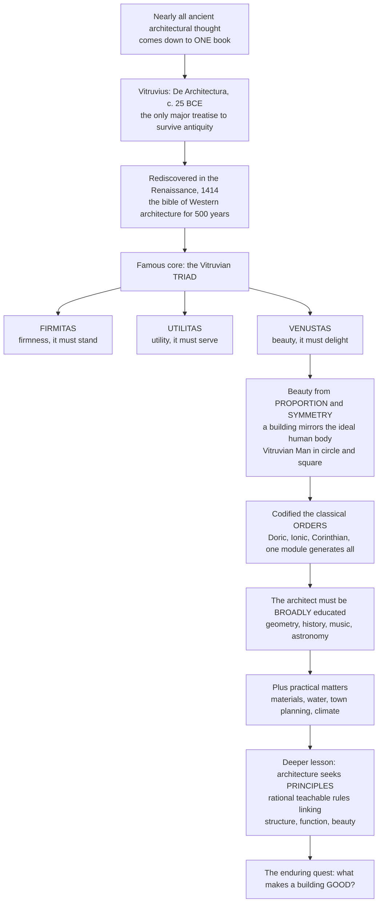

# 🏛️ Vitruvius and the Principles of Architecture

> [!abstract] TL;DR
> Nearly everything we know about ancient architectural *thought* comes down to **one book by one Roman military engineer** — Vitruvius's **De Architectura** (c. 25 BCE), the only major architectural treatise to survive from antiquity and, after its Renaissance rediscovery, the single most influential book in Western architectural history. Its famous core is the triad every good building must possess — **firmitas** (it must stand), **utilitas** (it must serve), **venustas** (it must delight) — but Vitruvius gave far more: he grounded beauty in **proportion and symmetry** modelled on the ideal human body (the source of Leonardo's *Vitruvian Man*), codified the **classical orders**, and insisted the architect be a broadly educated universal thinker. His deepest lesson is that architecture perennially seeks **principles** — rational, teachable rules linking structure, function, and beauty — the quest to define what makes a building *good*.

---

## Intuition

**Analogy: imagine that everything humanity remembered about how to *think* about buildings for two thousand years fit inside a single surviving scroll — and it did.** Ancient Greece and Rome built temples, aqueducts, and domes of staggering sophistication, yet almost no ancient writing about *why* they built that way came down to us. One text slipped through: Vitruvius's *Ten Books on Architecture*. It is as if all the world's cookbooks burned and one survived — that book would silently define what "cooking" *means* for everyone who came after, simply by being the only voice left in the room. When a scholar rediscovered a dusty copy in a monastery library in 1414, that lone voice became the bible of Renaissance architecture and shaped Western building for five hundred years.

And its central claim is beautifully simple. A good building, Vitruvius says, must do three things at once, and cannot cheat on any: it must **stand up** (firmitas), it must **work** (utilitas), and it must **move us** (venustas). An ugly bridge that stands is mere engineering; a gorgeous ceiling that collapses is a tragedy; a beautiful building nobody can use is a folly. Architecture is what happens when you must solve structure, function, and beauty *simultaneously* — and Vitruvius was the first to write down that this balance is the whole discipline. The further insight is that beauty is not arbitrary: it comes from **proportion**, the harmonious relation of every part to the whole and to a single common unit — the very same logic by which a well-made human body is "in proportion." That is why Leonardo drew a man inscribed in a circle and a square: a picture of Vitruvius's claim that the well-proportioned body, and thus the well-proportioned building, embodies a hidden order.

---

## How It Works

### Core mechanics

1. **One source, one canon.** Vitruvius Pollio, a Roman architect and military engineer under Augustus, compiled *De Architectura* — ten "books" (scrolls) covering town planning, materials, temples and the orders, public and private buildings, water supply, geometry and astronomy, and machines. Because it is the *only* comprehensive treatise to survive antiquity, it silently defined the vocabulary of all later theory.
2. **The triad.** Good architecture = **firmitas** (durable structure), **utilitas** (functional fitness), **venustas** (beauty). Henry Wotton's 1624 English rendering — *"firmness, commodity, and delight"* — is still quoted in architecture schools today. The three are **interdependent**: a structural choice (a dome) creates an aesthetic possibility (a soaring interior); a functional need (a column-free hall) forces a structural invention.
3. **Beauty as proportion.** Venustas is not decoration but **commensurability**: every dimension derives from a single shared unit so the parts agree with one another and with the whole. Vitruvius calls this *symmetria*, animates it as *eurythmia* (graceful proportion), and anchors it in the **human body** as nature's model of ideal ratio.
4. **The module system.** In the orders, that shared unit is the **module** — the column's lower diameter. Column height, spacing, and entablature all follow as simple multiples of the module, so an entire façade is "generated" from one number, like DNA unfolding a body.
5. **The orders and decorum.** Vitruvius codifies **Doric** (sturdy, plain), **Ionic** (slender, scrolled), and **Corinthian** (ornate, acanthus). *Decorum* is the rule of appropriateness — matching the order's character to the building's purpose or deity.
6. **The learned architect.** Vitruvius insists the architect combine *fabrica* (hands-on practice) and *ratiocinatio* (reasoned theory), and be educated in geometry, history, philosophy, music, medicine, law, and astronomy — architecture as a **principled, learned discipline**, not mere craft.

### Flow / architecture



---

## Key Concepts

### Secondary (school level)
- **Who and what.** Marcus Vitruvius Pollio, a Roman engineer of the 1st century BCE, wrote *The Ten Books on Architecture*, dedicated to the emperor Augustus. It is the **only** big architecture book that survived from the ancient world, which is why it matters so much.
- **The triad in plain words.** Every good building must **stand up** (firmitas), **be useful** (utilitas), and **look and feel beautiful** (venustas) — "firmness, commodity, and delight."
- **The Vitruvian Man.** Leonardo da Vinci's famous drawing of a man inside a circle and a square illustrates Vitruvius's idea that a perfect body — and a perfect building — has ideal **proportions**.
- **The three orders.** The classic column styles: **Doric** (plain and sturdy), **Ionic** (slimmer, with scroll-like volutes), and **Corinthian** (tall and leafy).

### Undergraduate (some background)
- **Symmetria and the module.** For Vitruvius *symmetria* means **commensurability** — parts related by a common unit — not modern mirror symmetry. In the orders that unit is the **module** (column diameter); Doric columns run ~7 diameters tall, Ionic ~9, Corinthian ~10, and everything else scales from it.
- **The six fundamentals.** Vitruvius names *ordinatio* (order/quantity), *dispositio* (arrangement, via plan/elevation/perspective), *eurythmia* (graceful proportion), *symmetria* (commensurability), *decor* (decorum/appropriateness), and *distributio* (economy of means).
- **Decorum.** Choice of order and ornament should suit the building's function, patron, and dedicated deity — a semantic grammar, not just taste.
- **The rediscovery.** The humanist Poggio Bracciolini found a manuscript at the abbey of St. Gallen in **1414**; printing spread it, and it became the foundation for the great Renaissance treatises — **Alberti**, **Serlio**, **Vignola**, and **Palladio** — which re-codified the orders and proportion for a new age.

### Graduate (system-level thinking)
- **Harmonic proportion and humanism.** Rudolf Wittkower's *Architectural Principles in the Age of Humanism* argued that Renaissance theorists (esp. Alberti and Palladio) fused Vitruvian proportion with **musical consonance** — the small integer ratios 1:2, 2:3, 3:4 — treating a building as frozen music and a mirror of cosmic harmony.
- **The transmission problem.** Vitruvius's Latin is technical and idiosyncratic, and **no original illustrations survive** — every diagram, including the Vitruvian Man, is a later reconstruction. Much "Vitruvian" doctrine is therefore *interpretation*, and the "canonical" order ratios vary between Vitruvius, Alberti, Vignola, and Palladio.
- **Prescription vs description.** Writing in Augustan Rome, Vitruvius often *idealizes* Greek practice rather than reporting it; the treatise is partly a normative program, which complicates using it as archaeological evidence.
- **The classical-vs-modern debate.** From the Enlightenment (Perrault questioned whether proportion is objective or merely customary) through Modernism ("form follows function" reweighting the triad toward *utilitas*) to Postmodernism's ironic reuse of the orders, Vitruvius frames a recurring argument: are architectural principles **universal** and rule-like, or **culturally contingent**? The triad endures precisely because it is a flexible *evaluative lens*, not a fixed formula.

---

## Python Demo

```python
# Vitruvius's proportional systems, visualized two ways:
#   (A) The classical ORDERS generated from ONE module (the column diameter):
#       the whole building's dimensions unfold from a single unit and simple ratios.
#   (B) HARMONIC / musical proportion + the golden ratio phi: the Renaissance link
#       between architecture, mathematics, and music (small integer ratios).
import numpy as np
import matplotlib.pyplot as plt
from matplotlib.patches import Rectangle

fig, (axA, axB) = plt.subplots(1, 2, figsize=(13, 6))

# ----- (A) THE CLASSICAL ORDERS: everything scales from one module = column diameter -----
module = 1.0  # the generative unit (Vitruvius's "modulus")
orders = [
    ("Doric",      7.0,  "#8d99ae"),   # sturdy / "masculine"
    ("Ionic",      9.0,  "#a8dadc"),   # slender / "feminine"
    ("Corinthian", 10.0, "#e9c46a"),   # ornate, tallest
]
x, gap = 0.0, 2.0
for name, ratio, color in orders:
    diameter = module
    col_h    = ratio * module          # column height = ratio x diameters
    entab_h  = 0.25 * col_h            # entablature ~ 1/4 of column height (classical rule of thumb)
    axA.add_patch(Rectangle((x, 0), diameter, col_h,
                            facecolor=color, edgecolor="black"))               # shaft
    axA.add_patch(Rectangle((x - 0.15, col_h), diameter + 0.30, entab_h,
                            facecolor="#adb5bd", edgecolor="black"))           # capital + entablature
    axA.text(x + diameter / 2, -0.7, name, ha="center", weight="bold")
    axA.text(x + diameter / 2, col_h + entab_h + 0.4,
             f"{ratio:.0f} : 1", ha="center", fontsize=10)
    x += gap
axA.set_title("The Classical Orders\ncolumn height = ratio x one module (diameter)")
axA.set_ylabel("height in modules (column diameters)")
axA.set_xlim(-1, x); axA.set_ylim(-1.5, 14)
axA.set_aspect("equal"); axA.set_xticks([])

# ----- (B) HARMONIC PROPORTION: nested rectangles whose sides are simple ratios + phi -----
phi = (1 + np.sqrt(5)) / 2
proportions = [
    (1.0,    "1:1  unison / square"),
    (4 / 3,  "3:4  fourth"),
    (3 / 2,  "2:3  fifth"),
    (2.0,    "1:2  octave"),
    (phi,    f"1:phi  golden = {phi:.3f}"),
]
colors = plt.cm.viridis(np.linspace(0.05, 0.9, len(proportions)))
for i, ((r, label), c) in enumerate(zip(proportions, colors)):
    # each rectangle shares the bottom-left corner; short side = 1, long side = ratio
    axB.add_patch(Rectangle((0, 0), r, 1.0, fill=False, edgecolor=c, linewidth=2.2))
    # stagger labels vertically so the nested rectangles' edges stay readable
    axB.text(r, 1.05 + 0.11 * i, label, ha="right", va="bottom", fontsize=9, color=c)
axB.set_title("Harmonic proportion: simple integer ratios\n(the music-architecture link) + the golden ratio phi")
axB.set_xlim(0, 2.2); axB.set_ylim(0, 1.9)
axB.set_aspect("equal"); axB.axis("off")

plt.tight_layout()
plt.savefig("vitruvius_principles.png", dpi=120)
plt.show()

# Console check: the module rule reproduces the whole facade from one number.
for name, ratio, _ in orders:
    print(f"{name:11s}: column {ratio:.0f} modules tall, "
          f"entablature {0.25 * ratio:.2f} modules -> total {1.25 * ratio:.2f} modules")
```

The left panel shows the "proportional DNA" of classical architecture: pick one module (the column's diameter) and the Doric, Ionic, and Corinthian orders unfold at their canonical 7:1, 9:1, and 10:1 slenderness. The right panel shows why the Renaissance called a building "frozen music" — the pleasing dimensions are the same small integer ratios (1:2, 2:3, 3:4) that produce musical consonances, with the golden ratio phi as the celebrated irrational cousin.

---

## Real-World Applications

> **The Pantheon (Rome, c. 126 CE)** is *firmitas* incarnate: an unreinforced concrete dome 43 m across that still stands after nineteen centuries, its coffers and single oculus resolving structure, light, and geometry into one proportioned volume — exactly the union Vitruvius theorized.

> **Palladio's villas** (e.g., Villa Rotonda, 1567) applied Vitruvian proportion and the orders so systematically that "**Palladianism**" became a global style. It crossed to Britain (Inigo Jones, Lord Burlington) and to America, where **Thomas Jefferson** designed Monticello and the University of Virginia, and where the **US Capitol**, the Supreme Court, and countless banks and courthouses still wear Corinthian porticoes to signal permanence and civic virtue — decorum in action.

> **Le Corbusier's Modulor** (1948) is a modern reboot of Vitruvius's human-proportion canon: a measuring system derived from the human body and the golden ratio, used to dimension the Unité d'Habitation. It shows the Vitruvian idea — that building should be commensurate with the human figure — surviving into Modernism.

> **Professional practice today.** Architecture accreditation and licensing (RIBA, NCARB/ARE, NAAB) still teach and test against firmness, function, and delight; building codes formalize *firmitas* (structural and life-safety), accessibility and programming formalize *utilitas*, and design review boards adjudicate *venustas*. The 2,000-year-old triad is the implicit rubric of the modern design jury.

---

## Common Pitfalls

- **Treating the triad as a checklist, not a balance.** Firmitas–utilitas–venustas are *interdependent variables to optimize together*, not three boxes to tick in sequence. Great buildings are where the three reinforce one another; Modernism's "form follows function" was one deliberate *reweighting*, not a rejection.
- **Reading Vitruvius as an accurate history of Greek building.** He wrote in Augustan Rome and often prescribes an *idealized* practice. The "canonical" order ratios differ between Vitruvius, Alberti, Vignola, and Palladio — there is no single fixed number.
- **Over-literal diagrams.** The surviving text has **no original illustrations** — the Vitruvian Man and every proportional figure are later reconstructions. Do not mistake Leonardo's drawing for Vitruvius's own diagram.
- **The "symmetria" false friend.** Vitruvian *symmetria* means **commensurability** (parts sharing a common module), not modern bilateral mirror-symmetry. Translating it as "symmetry" quietly distorts the theory.
- **Anthropomorphism taken too far.** The human-body analogy is about *proportional order*, not literally making buildings look like people. It is a claim about ratio, not resemblance.
- **Assuming classical proportion equals the golden ratio.** Vitruvius worked with **small whole-number ratios**; the "golden ratio is everywhere in classical architecture" claim is largely a 19th–20th-century retrofit, not a Vitruvian doctrine.

---

## Related Concepts

*(This note is the theoretical keystone of the Architecture vault. Its sibling notes —* Architecture_Overview_and_the_Art_of_Building, Architectural_Theory_and_Criticism, Form_Function_and_Ornament, Proportion_Scale_and_Geometry, Ancient_and_Classical_Architecture, *and* Renaissance_and_Baroque_Architecture *— are referenced here in prose and will link back once written.)*

- [[Architecture_and_the_Built_Environment]] — the Art & Aesthetics companion note; it too takes the Vitruvian triad as architecture's "permanent brief," approached from structure and materials rather than theory and history.
- [[Beauty_and_Taste]] — the philosophy of *venustas*: is architectural beauty objective (proportion, order) or a matter of taste? The classical-vs-modern debate lives here.
- [[Renaissance_and_Baroque]] — the movement that rediscovered Vitruvius and, via Alberti and Palladio, turned his principles into the grammar of Western architecture for centuries.
- [[The_Roman_Empire]] — Vitruvius's world: an Augustan engineer writing for an emperor building in marble; the Roman arch, dome, and concrete are *firmitas* at imperial scale.
- [[The_Italian_Renaissance]] — the humanist rediscovery (Poggio, 1414) that resurrected the text and made "return to the ancients" a design program.
- [[Euclidean_Geometry]] — the geometry of circle, square, and ratio that underlies *symmetria* and the Vitruvian Man's *homo ad circulum et quadratum*.
- [[Intervals_and_Consonance]] — the small integer ratios (2:3, 3:4) that make musical consonance; Renaissance theorists borrowed them as the mathematics of "pleasing" architectural proportion.

---

## Review Questions

1. **(Secondary)** Name the three parts of the Vitruvian triad and give a one-line meaning of each. Why is *De Architectura* considered so historically important that a single surviving book could shape Western architecture for 500 years?
2. **(Undergraduate)** Explain how the **module** generates the proportions of a classical order, using the Doric, Ionic, and Corinthian slenderness ratios. What did **decorum** require when choosing an order, and how did the 1414 rediscovery reshape Renaissance design?
3. **(Graduate)** Wittkower argued that Renaissance architects tied proportion to musical consonance and cosmic harmony. Evaluate the claim that Vitruvian principles are **universal** versus **culturally specific**, drawing on the classical-vs-modern debate over rules. Is the triad still a valid evaluative framework for a windowless data center or a parametric, algorithm-generated façade — and if not, what replaces *venustas*?

---

## Sources

- [Vitruvius, *The Ten Books on Architecture*, trans. M. H. Morgan (full text)](https://www.gutenberg.org/ebooks/20239) — the standard English translation; the triad and the human-proportion passage are in Books I and III.
- [*De architectura* — overview and transmission history](https://en.wikipedia.org/wiki/De_architectura) — scope, the 1414 rediscovery, and later editions.
- [*Vitruvian Man* — Leonardo's illustration of the proportional canon](https://en.wikipedia.org/wiki/Vitruvian_Man) — the figure inscribed in circle and square.
- Rudolf Wittkower, *Architectural Principles in the Age of Humanism* (Academy Editions / Wiley) — the classic study of harmonic proportion, Alberti, and Palladio.
- Leon Battista Alberti, *On the Art of Building in Ten Books*, trans. Rykwert, Leach & Tavernor (MIT Press) — the Renaissance treatise modelled directly on Vitruvius; and Andrew Ballantyne, *Architecture: A Very Short Introduction* (Oxford University Press) for a concise modern framing.

---

#architecture #vitruvius #classical-orders #proportion #firmitas-utilitas-venustas
