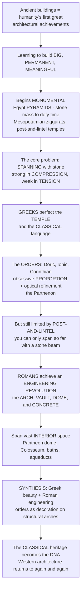

# 🏛️ Ancient and Classical Architecture

> [!abstract] TL;DR
> The buildings of the ancient world are **humanity's first great architectural achievements**, and the **classical Greek and Roman** foundations laid then still shape how we build today — visible in every columned bank, courthouse, and capitol. The story is one of learning to build **big, permanent, and meaningful**: it begins with Egypt's **pyramids** perfecting sheer stone mass, and the massive **post-and-lintel** temples that wrestled with the basic problem of *spanning space in stone* — a material **strong in compression but weak in tension**. The **Greeks** perfected the **temple** and gave us the language of the **classical orders** (Doric, Ionic, Corinthian), obsessive **proportion**, and the **optical refinements** that made the Parthenon appear perfect — yet remained trapped by the short stone beam. The **Romans** then achieved an engineering **revolution** — the **arch, vault, dome, and concrete** — and could suddenly enclose vast **interior** volumes: the Pantheon's dome, the Colosseum, the great baths and aqueducts that built an empire. This classical heritage — orders, proportion, arch, and dome — became the **DNA** Western architecture has returned to again and again.

---

## Intuition

**Analogy: look at almost any bank, courthouse, museum, or capitol built in the last three hundred years and you are looking at ancient Greece and Rome, still giving orders.** The columns, the triangular pediment over the entrance, the grand symmetrical front, the sense of dignity and permanence — none of it is modern invention. It is a vocabulary perfected two and a half thousand years ago and *deliberately quoted* ever since, because a portico of stone columns says "permanence, authority, civic virtue" more instantly than any words. When the founders of the United States wanted the Capitol and the Supreme Court to *look* legitimate and eternal, they reached back past everything in between and put a Roman temple front on a democracy. That reflex — reaching back to the ancients whenever we want a building to mean something serious — is the single best proof of how foundational this era is.

Now rewind to how it was built. The whole story is humanity slowly solving one stubborn physical problem: **how do you span an open space with stone?** Stone is superb at being *squeezed* (compression) but pathetic at being *stretched* (tension), so a stone beam laid across two supports cracks along its underside and can only reach a few metres before it fails. The Egyptians answered by not really spanning at all — they piled up **mass**, the pyramids being nothing but a mountain of stone perfected to defy time and death. The Greeks answered with the elegant but limited **post-and-lintel** temple: forests of closely spaced columns carrying short stone beams, refined to breathtaking beauty but forever crowded by the tyranny of that short beam. The **Romans** broke the deadlock. By mastering the **arch** — which turns a span into pure compression, exactly what stone loves — and then the **vault**, the **dome**, and above all **concrete** (a genuinely new, pourable, mass material), they could finally roof and *enclose* enormous interior volumes. Rome wrapped Greek beauty around Roman engineering, and the result was architecture at a scale and utility the world had never seen — and a classical language the West has been speaking ever since.

---

## How It Works

### Core mechanics

1. **The birth of monumental architecture.** With the first civilizations came surplus, organized labour, and the will to build *permanently* — architecture as the expression of divine and royal power and of cosmic order. **Egypt** perfected **mass masonry**: the pyramids solve nothing structurally clever, they simply pile shaped stone into an indestructible mountain aimed at eternity and the afterlife, while the great **hypostyle halls** (Karnak) march the worshipper along an **axial, processional** path through a forest of columns. **Mesopotamia**, lacking stone, built **ziggurats** in sun-dried and fired **mud-brick** and even used the **true arch** early — but in humble material, so it never scaled.
2. **The structural problem: spanning stone.** Stone (and brick) is **strong in compression, weak in tension**. A horizontal stone **lintel** carrying load bends, putting its *underside in tension*, where it cracks — so **trabeated** (post-and-lintel) construction can span only a short distance. This single fact governs the shape of every pre-Roman monument: many columns, close together, carrying short beams.
3. **Greece perfects the temple and the classical language.** The Greek **temple** (the columned, **peripteral** box housing the *cella*) became the perfected architectural type. The Greeks codified the **orders** — **Doric** (sturdy, plain), **Ionic** (slender, scrolled *volutes*), **Corinthian** (tall, acanthus-leaf) — complete systems of column, capital, and *entablature* with fixed proportions and character. They pursued **proportion, harmony, and mathematical ratio** obsessively, and added **optical refinements**: **entasis** (a subtle convex bulge so a column reads as straight rather than pinched), an upward-curving *stylobate*, and columns leaning slightly inward — tiny deliberate distortions correcting for the eye. The **Parthenon** is the summit. But Greece stayed **trabeated**: beauty without the long span.
4. **Rome's engineering revolution.** Rome mastered the **arch** (load carried in pure **compression**, so long spans become possible), the **vault** (barrel and groin), the **dome**, and above all **concrete** (*opus caementicium*) — a mouldable, mass material that could be cast into any shape and faced with brick or stone. The consequence was a revolution in **enclosing and spanning interior space**: architecture shifted from the exterior-focused Greek temple to grand Roman **interiors**. The **Pantheon**'s coffered concrete **dome** (43 m across, thinning toward its **oculus**) remained the largest unreinforced concrete dome for ~1,900 years; the **Colosseum**, the **Baths of Caracalla**, the multipurpose **basilica** (later the model for churches), and the **aqueducts, bridges, and roads** were imperial infrastructure at unmatched scale.
5. **The synthesis and the classical language.** Rome borrowed the Greek **orders as decoration** — pilasters and half-columns applied to structural arches and concrete walls — fusing Greek *venustas* with Roman *firmitas*. What crystallized was the **classical language**: orders, **proportion, symmetry, axiality**, the **arch/vault/dome**, and a vocabulary of columns, **pediments**, entablatures, and moldings — a coherent, teachable **system** codified by **Vitruvius** and carrying meanings of dignity, order, permanence, and civic virtue.
6. **The enduring legacy.** Because it is a *system*, the classical could be **revived** again and again: the **Renaissance** returned to Rome, the **Baroque** dramatized it, and **Neoclassicism** made it the default language of civic authority — the banks, courthouses, capitols, museums, and memorials that still surround us.

### Flow / architecture



---

## Key Concepts

### Secondary (school level)
- **Building big and forever.** Ancient people learned to build **huge, permanent** things that meant something — temples and tombs for gods, kings, and the dead. The **Egyptian pyramids** are the ultimate example: a giant mountain of stone meant to last forever.
- **The problem with stone.** Stone is great at being **squeezed** but bad at being **stretched**, so a flat stone beam laid across two columns can only reach a short distance before it cracks. That is why Greek temples have **so many columns packed close together**.
- **The Greek look.** The **columns**, the **triangular top** over the front (the *pediment*), and the careful, balanced shape — the **Parthenon** in Athens is the most famous. There are three column styles, or **orders**: plain **Doric**, scrolled **Ionic**, and leafy **Corinthian**.
- **The Roman breakthrough.** The Romans invented ways to span *big* spaces: the **arch**, the **dome**, and **concrete**. That let them build enormous roofed buildings like the **Pantheon** and the **Colosseum**, plus **aqueducts** to carry water for miles.

### Undergraduate (some background)
- **Trabeated vs arcuated construction.** *Trabeated* (post-and-lintel) systems carry load through **beams in bending** — limited by stone's weak tension. *Arcuated* systems (arch, vault, dome) carry load in **compression along a curved thrust line** — stone's strength — freeing far longer spans and, crucially, roofed interior space.
- **The orders as a proportional system.** Each order fixes the ratios of column, capital, and entablature from a single **module** (the column's lower diameter) — Doric ~7 diameters tall, Ionic ~9, Corinthian ~10. The order also carries *character* and *decorum*: matching the order to the building's purpose and deity.
- **Optical refinement.** The Parthenon is almost devoid of true straight lines: **entasis** swells each column ~1.75 cm so it looks straight; the *stylobate* curves gently upward at the centre; corner columns are thickened and tilted inward. These are perceptual corrections, engineering the *appearance* of geometric perfection.
- **From exterior to interior.** The Greek temple is a **sculptural object seen from outside** (the ritual happened at an outdoor altar); the Roman revolution turned architecture *inward*, making the grand enclosed **interior volume** — the domed rotunda, the vaulted hall — the new artistic subject.
- **Roman concrete.** *Opus caementicium* — lime, volcanic ash (*pozzolana*), water, and aggregate — was a genuinely new, pourable **mass material**, cast into vaults and domes and faced with brick. It made the arch/vault/dome cheap, fast, and monumental.

### Graduate (system-level thinking)
- **Why the arch is the pivot of architectural history.** For a beam under load, peak bending (tensile) stress grows roughly as **span²**; for a well-shaped arch, the material stress is **compression** and grows only ~linearly with span. Combined with stone being an order of magnitude stronger in compression than tension, this is *why* the arch multiplies achievable spans by an order of magnitude — the structural leap the Python demo below quantifies.
- **The funicular line and thrust.** An arch is in pure compression only if its centre-line follows the **funicular** (inverted-catenary / parabolic) shape of its loading; deviations introduce bending. Real masonry arches survive because the **line of thrust** stays within the *middle third* of the ring — the true design constraint behind Roman semicircular arches and their massive abutments (which is why aqueducts need such heavy piers to resist horizontal **thrust**).
- **The classical as a generative grammar.** The orders are not ornament bolted on but a **rule system** — a module generates every dimension, decorum governs selection, symmetry and axiality govern composition — teachable and endlessly recombinable. This *systematicity* is exactly why classicism could be codified by Vitruvius, revived by Alberti and Palladio, and redeployed by Jefferson: it behaves like a language, not a style.
- **Revival as cultural signalling.** The repeated returns to the classical (Renaissance → Neoclassicism → Beaux-Arts → countless civic buildings) are less about aesthetics than **legitimacy**: quoting Rome imports connotations of permanence, reason, and civic authority. The classical vocabulary functions semiotically — a portico is an argument about power.
- **The limits reconsidered.** Rome's dome/vault mastery still lacked **tensile reinforcement**; unreinforced concrete and masonry can only work in compression, capping form (hemispheres, barrel vaults, heavy buttressing). The next two revolutions — the Gothic flying buttress and, far later, *reinforced* concrete and steel — are precisely the story of finally taming **tension**.

---

## Python Demo

```python
# Ancient & classical architecture, two ways:
#   (a) POST-AND-LINTEL vs ARCH - the structural leap that let Rome span vast space:
#       stone is strong in COMPRESSION, weak in TENSION, so a stone beam (lintel) bends
#       and cracks after a short span, while an arch carries load in pure compression.
#   (b) GREEK OPTICAL REFINEMENT (entasis) - the subtle convex bulge that makes a
#       geometrically straight, tapered column READ as perfectly straight to the eye.
# Requires: numpy, matplotlib
import numpy as np
import matplotlib.pyplot as plt

fig, (axA, axB) = plt.subplots(1, 2, figsize=(13, 6))

# ================= (a) POST-AND-LINTEL vs ARCH: why the arch revolutionized spanning =========
rho   = 2400.0            # limestone density, kg/m^3
g     = 9.81              # gravity, m/s^2
rho_g = rho * g / 1e6     # weight density in MPa per metre  (N/m^3 -> MPa/m)

h_lintel   = 0.6          # stone lintel depth, m
load_mult  = 4.0          # lintel/arch also carry entablature + wall, ~4x self-weight
rise_ratio = 5.0          # arch rise = span / rise_ratio (a fairly shallow arch)
sigma_t    = 1.5          # allowable TENSILE strength of stone, MPa (very low!)
sigma_c    = 12.0         # allowable COMPRESSIVE strength of stone, MPa (much higher)

L = np.linspace(0.1, 50, 500)   # clear span, metres

# LINTEL: simply-supported beam, uniform load. Peak tensile bending stress = M / S,
# with M = wL^2/8 and section modulus S = b*h^2/6  -> width b cancels:
#   sigma_lintel = (3/4) * load_mult * rho_g * L^2 / h    (grows as L^2)
sigma_lintel = 0.75 * load_mult * rho_g * L**2 / h_lintel

# ARCH: horizontal thrust H = wL^2 / (8 f), with rise f = L / rise_ratio -> H = (rise_ratio/8) w L.
# axial compressive stress = H / A, with A = b*t and w = load_mult*rho_g*(b*t):
#   sigma_arch = (rise_ratio/8) * load_mult * rho_g * L      (grows only linearly with L)
sigma_arch = (rise_ratio / 8.0) * load_mult * rho_g * L

axA.plot(L, sigma_lintel, color="#c1121f", lw=2.5, label="stone LINTEL - tension ~ L^2")
axA.plot(L, sigma_arch,   color="#118ab2", lw=2.5, label="stone ARCH - compression ~ L")
axA.axhline(sigma_t, color="#c1121f", ls="--", lw=1.3, label=f"tensile limit ~{sigma_t} MPa")
axA.axhline(sigma_c, color="#118ab2", ls="--", lw=1.3, label=f"compressive limit ~{sigma_c} MPa")

# max lintel span = where the tensile curve meets the (low) tensile limit
L_lintel_max = np.sqrt(sigma_t * h_lintel / (0.75 * load_mult * rho_g))
axA.axvline(L_lintel_max, color="#c1121f", ls=":", lw=1.2)
axA.annotate(f"lintel cracks at ~{L_lintel_max:.1f} m\nthe tyranny of the short stone beam",
             xy=(L_lintel_max, sigma_t), xytext=(L_lintel_max + 5, sigma_t + 4.5),
             fontsize=8, color="#c1121f",
             arrowprops=dict(arrowstyle="->", color="#c1121f"))
axA.annotate("arch stays far below its limit\nacross the whole practical range",
             xy=(46, sigma_arch[-30]), xytext=(17, 9.2),
             fontsize=8, color="#118ab2",
             arrowprops=dict(arrowstyle="->", color="#118ab2"))
axA.set_xlim(0, 50); axA.set_ylim(0, 16)
axA.set_xlabel("clear span  L  (metres)")
axA.set_ylabel("peak material stress  (MPa)")
axA.set_title("Why the arch revolutionized spanning\nlintel TENSION explodes as L^2; arch COMPRESSION grows only as L")
axA.legend(loc="upper center", fontsize=7.5)

# ================= (b) GREEK OPTICAL REFINEMENT: ENTASIS =====================================
H = 10.0                        # column height, m
r_base, r_top = 0.90, 0.65      # columns taper INWARD toward the top
y = np.linspace(0, H, 400)

r_straight = r_base + (r_top - r_base) * (y / H)     # truncated cone = "geometrically straight"
entasis_amp = 0.12                                   # EXAGGERATED ~20x so it is visible on paper
bulge = entasis_amp * np.sin(np.pi * (y / H)**0.8)   # convex bulge, peaks ~1/3 up the shaft
r_entasis = r_straight + bulge

x0, x1 = 0.0, 3.4               # centres of the two columns
axB.fill_betweenx(y, x0 - r_straight, x0 + r_straight, color="#adb5bd", alpha=0.85)
axB.plot(x0 - r_straight, y, "k-", lw=1); axB.plot(x0 + r_straight, y, "k-", lw=1)
axB.fill_betweenx(y, x1 - r_entasis, x1 + r_entasis, color="#e9c46a", alpha=0.9)
axB.plot(x1 - r_entasis, y, "k-", lw=1); axB.plot(x1 + r_entasis, y, "k-", lw=1)

axB.text(x0, -0.9, "GEOMETRICALLY STRAIGHT\ntruncated cone\n-> the eye reads it as PINCHED",
         ha="center", va="top", fontsize=8)
axB.text(x1, -0.9, "WITH ENTASIS\nsubtle convex bulge\n-> the eye reads it as STRAIGHT",
         ha="center", va="top", fontsize=8)
axB.set_title("Greek optical refinement: ENTASIS\nbulge exaggerated ~20x; real Parthenon bulge ~1.75 cm on a 10 m shaft")
axB.set_xlim(-2, 5.6); axB.set_ylim(-3, 11)
axB.set_aspect("equal"); axB.axis("off")

plt.tight_layout()
plt.savefig("ancient_classical_architecture.png", dpi=120)
plt.show()

# Console: the structural leap in two lines
print(f"Max stone lintel span ~ {L_lintel_max:4.1f} m  -> Greek temple columns must crowd close together")
print("Roman arches routinely spanned 20-35 m in pure compression - an order of magnitude more.")
```

The left panel is the whole reason Roman architecture looks different from Greek: the lintel's **tensile** stress rockets up as **span²** and pierces stone's feeble tensile limit after only ~3-4 metres (why Greek temples must crowd their columns), while the arch's **compressive** stress creeps up only *linearly* and never approaches stone's far higher compressive limit across the entire practical range. The right panel shows the Greeks' obsessive refinement: a truly straight, tapered column looks subtly *pinched*, so they carved a barely perceptible convex **entasis** to make it read as perfectly straight — perfection engineered for the eye, not the ruler.

---

## Real-World Applications

> **The Great Pyramid of Giza (c. 2560 BCE)** is architecture as pure **mass and permanence**: ~2.3 million limestone and granite blocks piled into a 146 m mountain aimed at eternity and the afterlife. It spans nothing and encloses almost no interior — it simply defeats time by sheer accumulation of stone, the opposite pole from Rome's later obsession with enclosing *space*.

> **The Parthenon (Athens, 447-432 BCE)** is the summit of the Greek temple and of **optical refinement**: Doric order, meticulous proportion, and a design in which almost nothing is truly straight — entasis on every column, an upward-curving stylobate, inward-leaning corner columns thickened against the sky. It is beauty at the limit of what post-and-lintel stone allows, which is exactly why its interior is modest while its exterior is sublime.

> **The Pantheon (Rome, c. 126 CE)** is the Roman revolution incarnate: an unreinforced **concrete dome** 43 m in diameter, coffered and progressively lightened toward a central **oculus**, resting on massive walls. It remained the world's largest unreinforced concrete dome for roughly **1,900 years** and made the grand, top-lit *interior* the new subject of architecture — the direct ancestor of every domed capitol and rotunda.

> **The Pont du Gard and Roman aqueducts** turned the **arch** into infrastructure: tiers of semicircular stone arches marching across valleys to carry water on a near-imperceptible gradient for tens of kilometres. The heavy piers are not decoration — they resist the horizontal **thrust** every arch generates, the practical price of spanning in compression.

> **The United States Capitol, Supreme Court, and countless banks and courthouses** are living **Neoclassicism**: Corinthian porticoes, pediments, and domes deliberately quoting Greece and Rome to signal permanence, reason, and civic virtue. The classical vocabulary, codified by Vitruvius and revived by the Renaissance, is still the default language of institutional authority — proof that this "ancient" architecture never actually ended.

---

## Common Pitfalls

- **Thinking "classical" means one thing.** Greek and Roman architecture are *different revolutions*: Greece perfected the **trabeated, exterior** temple and the orders; Rome added the **arcuated** system (arch/vault/dome) and **concrete** and turned architecture *inward*. Rome then wore the Greek orders as *decoration* over its own structure. Collapsing the two hides the single most important development in the whole story — the arch.
- **Assuming the Greeks lacked the arch out of ignorance.** They knew the arch; they largely *chose* the columned temple as the noble form. Their real constraint was aesthetic-cultural, not purely technical — though it was **post-and-lintel** stone that capped how far they could span and roof.
- **Reading the orders as mere ornament.** The orders are a **proportional system** generated from a module, carrying character and *decorum*, not interchangeable decorative caps. Getting the proportions or the pairing wrong (a delicate Corinthian on a heavy fortress) violates the grammar the classical world took seriously.
- **Missing entasis and the other refinements.** Beginners describe the Parthenon as a model of "straight lines and right angles." It is almost the opposite: a web of **deliberate curves and tilts** engineered so the eye *perceives* straightness. The perfection is perceptual, not geometric.
- **Underrating Roman concrete.** *Opus caementicium* is often dismissed as "just cheap fill behind marble." In fact the pourable, mouldable **mass material** is what made the dome, the vault, and the great interior *possible and affordable* — the true engine of the Roman revolution, and a material science not matched again until the 19th century.
- **Treating the classical as finished history.** Its repeated **revivals** (Renaissance, Baroque, Neoclassicism, Beaux-Arts) mean the classical vocabulary is *active*, not archived — it is still being built and still signalling authority today.

---

## Related Concepts

*This is the opening note of the Architecture vault's history section (S02). Its sibling notes are referenced here in prose and will link back once written: it sets up* **Medieval Architecture (Romanesque and Gothic)** *— which finally tames tension with the pointed arch and flying buttress — and* **Renaissance and Baroque Architecture** *— the great revival that resurrected these very orders and domes; it applies the theory laid out in* **Architecture Overview and the Art of Building** *(the Vitruvian triad) and* **Vitruvius and the Principles of Architecture** *(the orders, proportion, and* De Architectura*, written in this Roman world); and it grounds the technical themes developed in* **Structure and Architectural Form** *and* **Spanning Space: Arches, Domes and Shells** *(the compression-only structures the Romans pioneered).*

Cross-vault connections (verified to exist):

- [[The_Roman_Empire]] — the world in which the arch, vault, dome, and concrete were mastered at imperial scale; Vitruvius's Rome and the aqueducts, baths, and basilicas of empire.
- [[Ancient_Greece_and_the_Polis]] — the civic and cultural world that produced the perfected temple, the orders, and architecture as the embodiment of reason and idealized beauty.
- [[Ancient_Egypt_Kingdoms]] — the pyramids and hypostyle temples: monumental mass masonry, the afterlife, and the earliest large-scale stone construction.
- [[The_Italian_Renaissance]] — the humanist rebirth that rediscovered Vitruvius and made "return to the ancients" a design program, reviving the orders, proportion, and the dome.
- [[Architecture_and_the_Built_Environment]] — the Art & Aesthetics vault's companion view of architecture as an art form; the *venustas* side from the humanities.
- [[Prehistoric_and_Ancient_Art]] — the wider artistic context of pyramids, temples, and Greek sculpture from which this architecture is inseparable.
- [[Classical_to_Medieval_Art]] — the visual-arts arc that parallels this architectural story from Greece and Rome into the Middle Ages.
- [[Concrete_Technology_and_Cement]] — the modern descendant of Roman *opus caementicium*; how the mouldable mass material the Romans pioneered works.
- [[Bridge_Engineering]] — the arch as long-span structure; Roman arch bridges and aqueducts are the ancestors of the modern arch bridge.
- [[Beams_Shear_and_Bending_Moment]] — the mechanics of the post-and-lintel beam: why bending puts the stone lintel's underside into tension and limits its span.
- [[Structural_Loads_and_Load_Paths]] — compression vs tension load paths; how the arch reroutes load into pure compression, the leap the demo quantifies.
- [[Ceramics_and_Glasses]] — the brittle-material behaviour (strong in compression, weak in tension) shared by stone, brick, and concrete that governs the whole story.

---

## Review Questions

1. **(Secondary)** Stone is strong when squeezed but weak when stretched. Use this fact to explain *why* Greek temples have so many columns crowded close together, and then explain what the Romans invented to escape that limit and build huge roofed spaces like the Pantheon.
2. **(Undergraduate)** Distinguish **trabeated** from **arcuated** construction, and explain why the peak stress in a stone lintel grows roughly with the *square* of the span while an arch's stress grows only *linearly*. What does this quantitative difference, combined with stone's compression-vs-tension asymmetry, tell you about why the Roman arch was such a decisive innovation? Separately, describe two of the Parthenon's optical refinements and what perceptual problem each corrects.
3. **(Graduate)** The classical is often described as a *language* rather than a *style*. Using the module-generated orders, decorum, and the repeated revivals (Renaissance, Neoclassicism), argue for or against that claim. Then explain the sense in which Roman architecture, for all its brilliance, was still "trapped in compression," and how that unresolved problem sets up the two later revolutions — the Gothic buttress and reinforced concrete/steel — that finally tamed tension.

---

## Sources

- Marvin Trachtenberg & Isabelle Hyman, *Architecture: From Prehistory to Postmodernity* (Prentice Hall / Abrams) — [publisher overview](https://en.wikipedia.org/wiki/Marvin_Trachtenberg)
- Spiro Kostof, *A History of Architecture: Settings and Rituals* (Oxford University Press) — [publisher page](https://global.oup.com/academic/product/a-history-of-architecture-9780195083781)
- A. W. Lawrence, *Greek Architecture* (Yale University Press, Pelican History of Art) — [publisher page](https://yalebooks.yale.edu/book/9780300064926/greek-architecture/)
- William L. MacDonald, *The Architecture of the Roman Empire* (Yale University Press) — [publisher page](https://yalebooks.yale.edu/book/9780300028195/the-architecture-of-the-roman-empire-volume-1/)
- *Pantheon (Rome)* — dome, oculus, and Roman concrete — [Wikipedia](https://en.wikipedia.org/wiki/Pantheon,_Rome); and *Entasis* — [Wikipedia](https://en.wikipedia.org/wiki/Entasis)

---

#architecture #classical-architecture #greek-and-roman #the-arch #ancient-architecture
