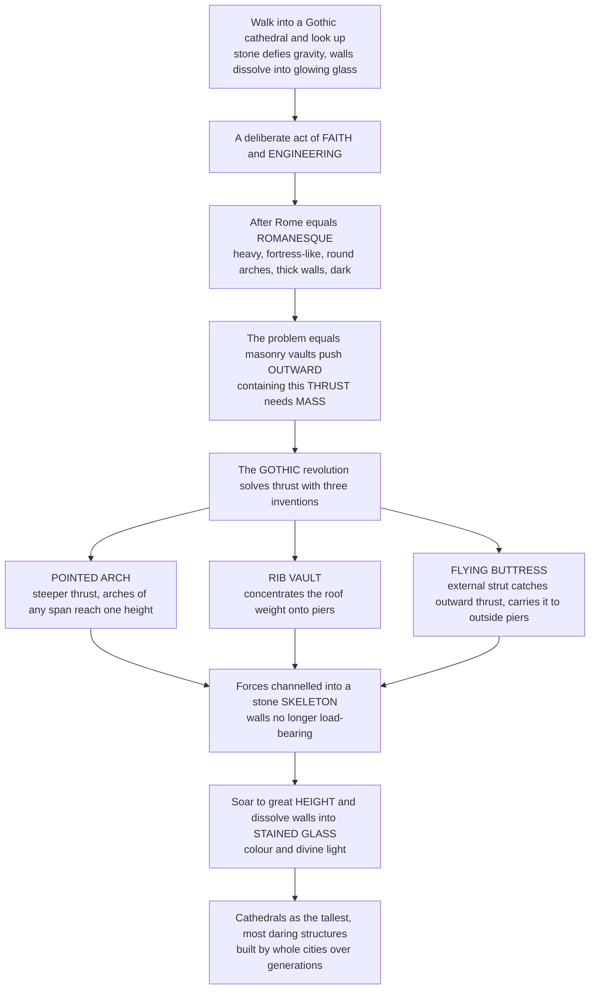

# ⛪ Medieval Architecture: Romanesque and Gothic

> [!abstract] TL;DR
> Medieval architecture is the story of how the drive to build ever-higher **houses of God** produced one of humanity's most sublime fusions of **engineering, art, and faith**. After Rome fell, the story picks up with **Romanesque** (~1000–1150): heavy, fortress-like churches with **round arches**, thick walls, small windows, and dark interiors — massive because to roof a space in stone you needed enormous mass to contain the outward **thrust** of masonry vaults. The **Gothic** revolution (~1150–1500) solved that thrust problem as a *system* of three interlocking inventions — the **pointed arch** (directs thrust steeply downward and lets arches of any span reach one height), the **rib vault** (concentrates loads onto piers), and the **flying buttress** (catches the vault's outward thrust and carries it to freestanding piers *outside*). Together they channelled all forces into a **skeleton of stone**, so walls no longer had to be load-bearing — freeing builders to soar to dizzying heights and dissolve the wall into vast **stained glass**, flooding the interior with symbolic coloured light. Built by whole cities over generations, Gothic cathedrals were the tallest and most technically daring structures of their age.

---

## Intuition

**Analogy — walk into a great Gothic cathedral and look up.** Stand under the vaults of Chartres or Notre-Dame de Paris and raise your eyes. The stone seems to *defy gravity* — soaring impossibly high, the walls dissolved into glowing sheets of stained glass, the whole space pulling your eye and your spirit upward. That vertical pull is not an accident of decoration; it is a deliberate, breathtaking act of both **faith** and **engineering**, and it is the climax of medieval architecture — one of the great structural revolutions in history.

Rewind to understand it. When Rome fell, the West lost much of its engineering confidence, and monumental building had to be slowly relearned around its new centre of gravity: the **Church**. The first great fruit was **Romanesque** — churches that feel like fortresses: round Roman arches, walls metres thick, tiny windows, dim candle-lit interiors. Why so heavy? Because a masonry vault does something dangerous. It does not just press *down*; it pushes *outward*. A stone roof is a frozen avalanche perpetually trying to shove its supporting walls apart. This sideways force is **thrust**, and the only Romanesque answer was **mass** — pile on enough wall to lean against the thrust and hold it. Height and light were the price of stability.

The **Gothic** builders refused that bargain. Beginning at the abbey of St-Denis under Abbot Suger around 1140, they attacked thrust not with brute mass but with a brilliant structural *system*. **(1)** The **pointed arch** turns the thrust more steeply downward, so less of it pushes sideways — and, geometrically, pointed arches of *different spans can all rise to the same height*, freeing the vaulting of any oddly shaped bay. **(2)** The **rib vault** gathers the roof's weight into slender stone ribs that funnel it onto specific *points* — the piers — instead of a continuous wall. **(3)** The **flying buttress** is an external half-arch that reaches over the side aisles, "catches" whatever outward thrust remains at the top of the nave wall, and carries it safely down to a heavy pier standing *outside* the building. Add the three together and every force in the cathedral is channelled into a discrete **skeleton of stone points**. The wall between those points now carries almost nothing — so it can vanish into **stained glass**. That is how the Gothic did the impossible: it went *taller and lighter at the same time*, turning a wall of stone into a wall of coloured light understood as a metaphor for the divine. To grasp medieval architecture is to grasp how devotion, geometry, and gravity were fused into the most daring buildings of their thousand years.

---

## How It Works

### Core mechanics

1. **The inherited problem — spanning space in masonry.** Stone and brick are strong in *compression* but weak in *tension*; you cannot lay a long stone "beam" across a wide space without it snapping. The only way to roof a wide space permanently in masonry is the **arch** and its 3-D children, the **vault** and **dome**. But every arch and vault generates a horizontal **thrust** at its base that tries to spread the supports. Containing thrust is the central structural drama of the whole period.
2. **Romanesque — solidity as the answer (~1000–1150).** The "Roman-like" style revived the **round (semicircular) arch** and the **barrel** and **groin vault**. Because a round arch's thrust is high and its rise is fixed at half the span, Romanesque churches contained it with **mass**: thick load-bearing walls, sturdy piers, small window openings, and dark, cavernous, earthbound interiors. Great pilgrimage churches and monasteries (Cluny, Vézelay, Durham, Speyer) express permanence and weight.
3. **The Byzantine parallel (East).** While the West built heavy, the Eastern Empire solved the "dome on a square" with the **pendentive** — a curved triangular spandrel transferring a round dome's load onto four piers. **Hagia Sophia** (537) floats a vast dome over a ring of windows, achieving luminous space centuries before the Gothic did it in the West.
4. **The Gothic system — three inventions that beat thrust together (~1150–1500).**
   - **Pointed (ogival) arch:** steepens the line of thrust so more force runs *down* and less *out*; and, unlike the round arch, its height is *not* locked to its span, so bays of any proportion can be vaulted to a common crown height.
   - **Rib vault:** a frame of arched stone ribs carries the vault's loads and channels them to the **piers**, letting the web (the infill between ribs) be thin and light.
   - **Flying buttress:** an external arched strut that intercepts the residual outward thrust high on the nave wall and conducts it across the aisle roofs to a massive freestanding **buttress pier**, often weighted with a **pinnacle** whose downward load steepens the resultant force so it stays safely inside the masonry.
5. **The consequence — a skeleton, not a wall.** Loads now travel along a discrete stone frame (ribs → piers → buttresses → ground). The wall becomes structurally optional, so it **dissolves into glass**: lancets, the great **rose window**, and delicate stone **tracery**. Height races upward (Chartres ~37 m, Amiens ~42 m, Beauvais's choir ~48 m before it collapsed in 1284), and coloured light floods the nave.
6. **Building without statics.** Medieval masons had **no modern structural theory** — no calculus, no free-body diagrams. They worked by **geometry and rules of thumb** passed down through masons' guilds, sizing buttresses by proportion and precedent. Modern analysis (Heyman's *safe theorem*; Robert Mark's photoelastic models) shows *why* this empiricism worked: a masonry structure stands as long as a valid **thrust line** fits *anywhere* within its stones, so generous, over-built proportions were forgiving.

### Flow / architecture



---

## Key Concepts

### Secondary (school level)
- **Romanesque vs Gothic in one image.** Romanesque churches are **heavy and dark** — thick walls, round arches, small windows, like a stone fortress. Gothic cathedrals are **tall and bright** — pointed arches, thin walls, and huge stained-glass windows that make them feel like they are reaching for heaven.
- **Why the walls were thick.** A stone roof pushes *sideways* as well as down (this sideways push is called **thrust**). Romanesque builders stopped the walls from being pushed apart by simply making them very thick and heavy.
- **The three Gothic inventions.** The **pointed arch**, the **rib vault**, and the **flying buttress** worked together to carry all the weight along a stone "skeleton," so the walls no longer had to hold up the roof and could be replaced with **glass**.
- **A whole city's project.** A great cathedral took **generations** — sometimes over a century — to build. Whole towns paid for and worked on them as acts of religious devotion and civic pride, often competing to build the tallest.

### Undergraduate (some background)
- **Thrust and the rise-to-span ratio.** For an arch under load, the horizontal thrust scales roughly as `H ~ wL^2 / (8h)` — *inversely* with the rise `h`. A round arch's rise is fixed at `h = L/2`, so its thrust is high. A **pointed** arch has a *greater* rise for the same span, so its thrust is markedly lower — less buttressing is needed. (See the Python demo.)
- **The pointed arch's geometric gift.** A round arch's crown height is *locked* to half its span, so vaulting a **rectangular bay** (whose diagonals and sides differ in length) forced awkward domed-up "stilted" solutions. Pointed arches can be drawn to reach a **common crown height at any span**, so ribs of different lengths meet cleanly — the key to flexible **quadripartite** and **sexpartite** vaulting.
- **The load path as a system.** Nave-vault load → **rib** → **pier**; residual outward thrust at the clerestory → **flying buttress** → external **buttress pier** → ground. Remove any one element and the system fails; the Gothic achievement was treating structure as an *integrated frame*, not a stack of walls.
- **St-Denis and the theology of light.** Abbot **Suger** rebuilt the choir of **St-Denis** (c. 1140–1144), the conventional birthplace of Gothic, explicitly to admit more light — following a Neoplatonic theology (via Pseudo-Dionysius) in which material light is a symbol of divine light (`lux continua`). The wall-of-glass is theology made structural.
- **The phases.** **Early Gothic** (St-Denis, Sens, early Notre-Dame) → **High Gothic** (Chartres, Reims, Amiens) → **Rayonnant** (radiating tracery, ever more glass; Sainte-Chapelle) → **Late/Flamboyant** (flame-like tracery). England developed its own sequence ending in the **Perpendicular** style (fan vaults, King's College Chapel).

### Graduate (system-level thinking)
- **The birth of the structural frame.** Gothic is the first architecture to fully **separate structure from enclosure** — a *skeleton* of piers, ribs, and buttresses carrying load, with a non-structural glass "curtain" between. In this it prefigures, conceptually, the **steel/glass curtain-wall** of modern architecture; Viollet-le-Duc read it exactly this way, making Gothic rationalism a direct ancestor of Modernism.
- **Why empiricism succeeded — plastic theory of masonry.** Jacques **Heyman** showed that masonry, treated as rigid blocks with no tension and infinite compression, obeys a **safe (lower-bound) theorem**: if *any* statically admissible thrust line fits within the stonework, the structure is safe. Medieval geometric rules of thumb reliably produced such over-stiff sections, which is why cathedrals stand for 800 years — and why the *height race* eventually found a real limit at **Beauvais** (collapse 1284, then 1573).
- **Panofsky's structural homology.** In *Gothic Architecture and Scholasticism* (1951), Erwin **Panofsky** argued that the High Gothic cathedral and the scholastic **summa** share a common *mental habit* (`habitus`): totality, hierarchical articulation into parts and sub-parts, and the making-visible of logical structure — the cathedral as scholastic reason built in stone, an "encyclopedia in stone" whose sculpture and glass taught doctrine to the illiterate.
- **Structure as experimental science.** Robert **Mark** used **photoelastic** plastic models under polarized light (and later finite-element analysis) to reveal the actual stress flow in Gothic sections, showing that features once read as pure ornament (pinnacles, the profile of flyers) are structurally *active* — pinnacle weight steepens the buttress resultant, keeping the thrust line inside the pier against wind and vault thrust.
- **The Gothic Revival and its ideology.** The 19th-century revival was not just stylistic: **Pugin** and **Ruskin** (*The Seven Lamps of Architecture*, *The Stones of Venice*) tied Gothic to *moral* and *national* virtue ("honest," "Christian," "truthful" construction), while **Viollet-le-Duc** recast it as proto-**rationalism** — structure legible and every member justified. These readings shaped Victorian architecture and fed directly into modern structural honesty.

---

## Python Demo

```python
# Medieval structural revolution, visualized with numpy + matplotlib:
#   (A) ROUND vs POINTED arch geometry + funicular (thrust-line) parabolas for the same span.
#   (B) Horizontal THRUST magnitude: pointed arches direct force downward -> far less thrust.
#   (C) "Same height, any span": pointed arches reach a common crown height (freeing bays);
#       round arches are locked to height = span/2.
#   (D) WALL DISSOLUTION: as load concentrates onto piers, window/wall area rises across the period.
import numpy as np
import matplotlib.pyplot as plt

fig, ax = plt.subplots(2, 2, figsize=(13, 10))

# ---------- shared geometry helpers ----------
def round_arch(L, n=200):
    """Semicircular arch of span L: rise fixed at L/2."""
    R = L / 2.0
    x = np.linspace(0, L, n)
    y = np.sqrt(np.clip(R**2 - (x - L/2)**2, 0, None))
    return x, y

def pointed_arch(L, h, n=200):
    """Two-centred pointed arch of span L reaching crown height h.
    Left/right arcs have radius r = L/4 + h^2/L, centres on the springing line."""
    r = L/4.0 + h**2 / L
    xl = np.linspace(0, L/2, n // 2)                 # left half, centre at (r, 0)
    yl = np.sqrt(np.clip(r**2 - (xl - r)**2, 0, None))
    xr = np.linspace(L/2, L, n // 2)                 # right half, centre at (L-r, 0)
    yr = np.sqrt(np.clip(r**2 - (xr - (L - r))**2, 0, None))
    return np.concatenate([xl, xr]), np.concatenate([yl, yr])

def thrust_line(L, h, n=200):
    """Funicular of a uniformly loaded arch = parabola of rise h. Thrust H = w L^2 / (8 h)."""
    x = np.linspace(0, L, n)
    y = 4 * h * (x / L) * (1 - x / L)
    return x, y

# ---------- (A) round vs pointed: shapes + thrust lines, same span ----------
L = 10.0
h_round = L / 2                       # 5.0  -> round arch crown height (locked)
h_point = np.sqrt(3) / 2 * L          # ~8.66 -> equilateral pointed arch crown height
xr, yr = round_arch(L)
xp, yp = pointed_arch(L, h_point)
txr, tyr = thrust_line(L, h_round)
txp, typ = thrust_line(L, h_point)

axA = ax[0, 0]
axA.plot(xr, yr, color="#c1121f", lw=2.5, label="round arch (semicircle)")
axA.plot(xp, yp, color="#1d3557", lw=2.5, label="pointed arch (equilateral)")
axA.plot(txr, tyr, color="#c1121f", ls=":", lw=1.8, label="round thrust line")
axA.plot(txp, typ, color="#1d3557", ls=":", lw=1.8, label="pointed thrust line")
axA.set_title("(A) Same span, different arches\npointed rises higher -> steeper, more contained thrust line")
axA.set_xlabel("span"); axA.set_ylabel("height")
axA.set_aspect("equal"); axA.legend(fontsize=7, loc="upper right"); axA.grid(alpha=0.3)

# ---------- (B) horizontal thrust magnitude (units of w*L), H = w L^2 / (8 h) ----------
axB = ax[0, 1]
arch_types = ["Round\nh=L/2", "Pointed\nequilateral", "Steep lancet\nh=1.2L"]
rises = np.array([L/2, h_point, 1.2 * L])
H = L**2 / (8 * rises)                # in units of w (per unit load w); numeric thrust proxy
bars = axB.bar(arch_types, H, color=["#c1121f", "#457b9d", "#1d3557"])
for b, val in zip(bars, H):
    axB.text(b.get_x() + b.get_width()/2, val + 0.05, f"{val:.2f} wL",
             ha="center", fontsize=9, weight="bold")
axB.set_title("(B) Horizontal THRUST  H = wL^2 / (8h)\nhigher rise -> less outward thrust -> less buttressing")
axB.set_ylabel("horizontal thrust  (units of w x L)")
axB.grid(axis="y", alpha=0.3)

# ---------- (C) same crown height, any span (pointed) vs locked height (round) ----------
axC = ax[1, 0]
spans = [6.0, 10.0, 14.0]
h_target = 8.0
colors = ["#2a9d8f", "#e9c46a", "#e76f51"]
for s, c in zip(spans, colors):
    xp2, yp2 = pointed_arch(s, h_target)             # all reach h_target
    axC.plot(xp2, yp2, color=c, lw=2.5, label=f"pointed span {s:.0f} -> h={h_target:.0f}")
    xr2, yr2 = round_arch(s)                          # locked at s/2
    axC.plot(xr2, yr2, color=c, lw=1.6, ls="--", label=f"round span {s:.0f} -> h={s/2:.0f}")
axC.axhline(h_target, color="gray", ls=":", lw=1.5)
axC.text(0.2, h_target + 0.15, "common crown height (pointed)", fontsize=8, color="gray")
axC.set_title("(C) Pointed arches reach ONE height at ANY span\n(round arches are locked to height = span/2)")
axC.set_xlabel("span"); axC.set_ylabel("height")
axC.set_aspect("equal"); axC.legend(fontsize=6.5, loc="upper right"); axC.grid(alpha=0.3)

# ---------- (D) wall dissolution: window/wall area fraction across the period ----------
axD = ax[1, 1]
periods = ["Romanesque\n~1080", "Early Gothic\n~1150", "High Gothic\n~1220",
           "Rayonnant\n~1280", "Flamboyant\n~1400"]
window_frac = np.array([0.05, 0.20, 0.42, 0.60, 0.70])   # illustrative window/wall ratio
axD.bar(periods, window_frac * 100, color=plt.cm.YlOrBr(np.linspace(0.35, 0.85, len(periods))))
axD.plot(range(len(periods)), window_frac * 100, "o-", color="#1d3557", lw=2)
for i, f in enumerate(window_frac):
    axD.text(i, f*100 + 1.5, f"{int(f*100)}%", ha="center", fontsize=9, weight="bold")
axD.set_title("(D) Dissolution of the wall\nload concentrates on piers -> wall becomes glass")
axD.set_ylabel("window area as % of wall")
axD.set_ylim(0, 85); axD.grid(axis="y", alpha=0.3)

plt.tight_layout()
plt.savefig("medieval_architecture.png", dpi=120)
plt.show()

# ---- console summary ----
print(f"Round arch  thrust  H = {L**2/(8*h_round):.3f} wL   (rise h = {h_round:.2f})")
print(f"Pointed arch thrust H = {L**2/(8*h_point):.3f} wL   (rise h = {h_point:.2f})")
print(f"Thrust reduction of pointed vs round: "
      f"{100*(1 - (h_round/h_point)):.0f}% less horizontal thrust")
```

The four panels retrace the Gothic insight structurally. **(A)** For the same span, the pointed arch rises higher, so its **thrust line** is steeper and more easily contained within a slim section. **(B)** Because thrust scales as `1/h`, the pointed arch's larger rise cuts horizontal thrust by roughly **40%** versus the round arch — directly reducing the buttressing (mass) needed. **(C)** shows the geometric gift that freed the vaulting: pointed arches of spans 6, 10, and 14 all reach a **common crown height**, while the round arches are stuck at heights 3, 5, and 7. **(D)** captures the payoff: as loads concentrate onto piers, the wall stops carrying load and dissolves into ever more **glass** across the period — Romanesque's ~5% window-to-wall soaring to ~70% in the Flamboyant "wall of light."

---

## Real-World Applications

> **Durham Cathedral (England, from 1093).** One of the earliest large buildings to use **pointed** arches and **rib vaults** over its nave — a Romanesque body already reaching, structurally, toward the Gothic. A textbook transitional monument.

> **St-Denis and Sainte-Chapelle (Paris).** Abbot **Suger's** choir at St-Denis (c. 1140) is the conventional *birth* of Gothic — thin walls, pointed arches, and light as theology. A century later **Sainte-Chapelle** (1248) perfects the **Rayonnant** ideal: the stone almost vanishes, leaving a shrine that is essentially a **cage of stained glass**.

> **Chartres, Reims, Amiens (High Gothic, France).** The classic **quadripartite rib vault + flying buttress + clerestory** synthesis. **Chartres** (c. 1194–1220) preserves the most complete original stained-glass programme; **Amiens** pushes the nave to ~42 m; **Reims** refined the tracery — together the canonical High Gothic sequence.

> **Beauvais Cathedral (the overreach).** Builders drove the choir vault to a record ~48 m — and it **collapsed in 1284**; a later crossing tower fell in 1573. Beauvais is the empirical *limit* of the height race, the point where medieval rule-of-thumb proportioning outran what the system could safely do.

> **Hagia Sophia (Constantinople, 537).** The Byzantine counter-tradition: a colossal dome carried on **pendentives** over four piers, ringed with windows so it seems to float. It solved luminous monumental space centuries before the Gothic — the great Eastern parallel.

> **The Gothic Revival and modern conservation.** **Pugin & Barry's** Palace of Westminster and **Viollet-le-Duc's** restorations (Notre-Dame, Carcassonne) reanimated Gothic as national and rationalist architecture. Today the same structural understanding — **thrust-line and finite-element analysis** — guides restoration, as in the engineering assessment and rebuilding of **Notre-Dame de Paris** after the 2019 fire.

---

## Common Pitfalls

- **Thinking the pointed arch was purely a style choice.** Its virtues are *structural and geometric*: lower thrust for a given span, and a crown height decoupled from span so rectangular bays vault cleanly. Aesthetics followed engineering, not the reverse.
- **Treating flying buttresses as decoration.** They are load-bearing *props*. Many were added or thickened **after** construction to arrest cracking and outward lean (early Notre-Dame, Chartres). The pinnacles on top are structurally active — their weight steepens the buttress resultant to keep the thrust line inside the pier.
- **Assuming medieval masons "calculated" their structures.** There was **no statics, no calculus** — only geometry, proportion, and precedent inherited through guilds. Heyman's *safe theorem* explains why generous, over-built masonry nonetheless stands: any valid thrust line fitting within the stone suffices.
- **Reading "Gothic" as a compliment the builders used.** It was a **Renaissance insult** — implying crude, "barbaric," Goth-made work — retro-applied to a style the Middle Ages simply called *opus francigenum* ("French work"). No Goths were involved.
- **Confusing Romanesque with Roman decay.** Romanesque was a deliberate **revival and reinvention** around 1000, not the last gasp of Roman building. Its round arches are a conscious return, and its regional varieties (Norman, Lombard, Rhenish) are inventive, not degenerate.
- **Believing taller was always better.** The height race hit a physical wall at **Beauvais**. More rise lowers thrust but raises wind exposure, slenderness, and buckling risk on the tall piers — a real trade-off, not a free lunch.
- **Seeing stained glass as mere ornament.** The vast windows are the *structural consequence* of concentrating load onto piers; the glass could only exist because the wall no longer had to carry the roof.

---

## Related Concepts

*This note sits in the Architecture vault's history section (S02). Its sibling notes — written or to come — **Ancient_and_Classical_Architecture** (the Roman arch, vault, and dome the Middle Ages inherited and partly forgot), **Renaissance_and_Baroque_Architecture** (the classical reaction that coined "Gothic" as an insult and returned to Vitruvian order), **Structure_and_Architectural_Form** (how load paths shape form), **Spanning_Space_Arches_Domes_and_Shells** (the deep mechanics of arch, vault, and thrust), **Light_Color_and_Atmosphere** (light as an architectural material, from Suger's `lux continua` onward), and **Architectural_Theory_and_Criticism** (Ruskin, Viollet-le-Duc, and the Gothic Revival's moral and rationalist arguments) — are referenced here in prose and will interlink once complete.*

Cross-vault connections (verified to exist):

- [[Architecture_Overview_and_the_Art_of_Building]] — the vault's hub; the Gothic cathedral is its recurring case study of *firmitas* engineered so *venustas* can soar.
- [[Vitruvius_and_the_Principles_of_Architecture]] — the classical order the Renaissance restored *against* Gothic; the medieval builders worked outside the Vitruvian canon.
- [[Form_Function_and_Ornament]] — Gothic tracery, ribs, and pinnacles blur the line between structural function and ornament, a central theme of that debate.
- [[The_High_Middle_Ages]] — the feudal, urban, and religious world (c. 1000–1300) that produced the cathedrals and the wealth and organization to build them.
- [[The_Byzantine_Empire]] — the Eastern parallel: the pendentive, the dome, and Hagia Sophia's luminous space.
- [[Fall_of_the_Western_Roman_Empire]] — the rupture after which Roman building technique was partly lost and had to be relearned.
- [[Christianity_and_the_Christian_Traditions]] — the faith whose liturgy, pilgrimage, and theology of light drove the cathedral as *the* medieval building project.
- [[Sacred_Symbols_Space_and_Time]] — how sacred space is organized and oriented; the cathedral as a cosmos in stone and glass.
- [[Pilgrimage_Festival_and_Devotion]] — the pilgrimage economy and devotion that funded and filled the great churches.
- [[Architecture_and_the_Built_Environment]] — the Art & Aesthetics companion; the Gothic as an art form and aesthetic experience.
- [[Classical_to_Medieval_Art]] — the art-historical sweep in which Romanesque and Gothic sculpture and glass sit.
- [[Iconography_and_Semiotics_of_Art]] — the "encyclopedia in stone": how cathedral sculpture and glass encoded doctrine for the illiterate.
- [[Light_Shadow_and_Value]] — light as an artistic and architectural medium; the Gothic dissolution of the wall into coloured light.
- [[Structural_Loads_and_Load_Paths]] — the modern engineering account of the load path (rib → pier → buttress → ground) the masons intuited.
- [[Timber_Masonry_and_Composite_Structures]] — masonry mechanics: compression-strong, tension-weak material behaving exactly as the arch exploits.
- [[Bridge_Engineering]] — the masonry arch as a structural type shared by cathedrals and bridges alike.

---

## Review Questions

1. **(Secondary)** In plain words, why were Romanesque churches so heavy and dark, and how did the three Gothic inventions — pointed arch, rib vault, and flying buttress — let cathedrals become tall and full of light instead?
2. **(Undergraduate)** Horizontal thrust in an arch scales roughly as `H ~ wL^2 / (8h)`. Using this, explain *two* distinct advantages the **pointed** arch has over the round arch for building a Gothic vault: one about the *magnitude* of thrust, and one about the *geometry* of vaulting rectangular bays. Why does each advantage reduce the mass a builder needs?
3. **(Graduate)** Medieval masons had no statics, yet their cathedrals stand after 800 years — while Beauvais collapsed. Reconcile this using Heyman's **safe theorem** for masonry and the idea of the **thrust line**. Then evaluate Panofsky's claim that the High Gothic cathedral is scholastic reason "built in stone": is the structural-intellectual homology a real explanatory parallel or an elegant metaphor?

---

## Sources

- Spiro Kostof, *A History of Architecture: Settings and Rituals* (Oxford University Press) — the standard survey; strong chapters on Romanesque and Gothic in cultural context. [Publisher](https://global.oup.com/academic/product/a-history-of-architecture-9780195174267)
- Otto von Simson, *The Gothic Cathedral: Origins of Gothic Architecture and the Medieval Concept of Order* (Princeton University Press / Bollingen) — Suger, St-Denis, and the theology of light. [Publisher](https://press.princeton.edu/books/paperback/9780691018676/the-gothic-cathedral)
- Robert Mark, *Light, Wind, and Structure: The Mystery of the Master Builders* (MIT Press) — photoelastic and analytical study of how Gothic structures actually carry load. [Publisher](https://mitpress.mit.edu/9780262631600/light-wind-and-structure/)
- Erwin Panofsky, *Gothic Architecture and Scholasticism* (Meridian / Archabbey Press, 1951) — the classic essay on the cathedral as scholastic reason in stone. [Overview](https://en.wikipedia.org/wiki/Gothic_Architecture_and_Scholasticism)
- Jacques Heyman, *The Stone Skeleton: Structural Engineering of Masonry Architecture* (Cambridge University Press) — the safe theorem and thrust-line analysis that explain why medieval empiricism worked. [Publisher](https://www.cambridge.org/9780521629638)

---

#architecture #gothic #romanesque #flying-buttress #pointed-arch
