# 🏙️ Modern Architecture and the Modern Movement

> [!abstract] TL;DR
> Around **1900**, architecture underwent its most radical revolution in two thousand years: **a total break with the past**. For millennia architecture had *meant* columns, arches, ornament and historical style; modernism swept it all away to build a brand-new architecture for a brand-new **machine age** — clean, functional, honest and universal. What made this possible were the Industrial Revolution's new materials: **steel** (strong in both tension *and* compression, enabling frames and skyscrapers), reinforced **concrete** (moldable, spanning, cantilevering) and large sheets of **glass**. The structural **frame** freed the wall from carrying load — the wall became a thin glass *"curtain,"* and the interior became open and flexible (the **free plan**). **Le Corbusier** crystallised the new logic in his **Five Points** and the slogan *"a house is a machine for living in."* The creed was **functionalism** (*"form follows function"*), **minimalism** (*"less is more"* — Mies), the rejection of ornament (*"ornament is crime"* — Loos), **truth to materials**, and a **utopian social mission** of mass-produced, healthy, light-filled housing. The **Bauhaus** fused art, craft and industry; the resulting **International Style** reshaped every city on Earth. But the utopia often curdled — sterile, placeless housing (whose demolished **Pruitt-Igoe** became modernism's symbolic tombstone) — and provoked the **postmodern** backlash.

---

## Intuition

**Analogy — burning the rulebook to build a spaceship.** Imagine that every architect for 2,000 years had inherited the same fat rulebook: put columns *here*, an arch *there*, a cornice on top, choose a historical style — Greek, Gothic, Renaissance — and decorate. Then, around 1900, a generation of radicals **threw the rulebook in the fire**. Not "let's add a new chapter" but "let's start from *nothing* and design as if buildings had just been invented — for a world of machines, cars, factories and mass society." Strip off *all* the ornament and all the historical costume, and let the building be exactly, honestly, only what it *is*: structure, space, light, function. That total, deliberate erasure of the past is the beating heart of modernism.

What let them do it was not a new *idea* but new *stuff*. The Industrial Revolution handed architects **steel** — a material strong in both pulling (tension) and squashing (compression), so you could build a rigid **skeleton frame** and stack it dozens of storeys high. It handed them **reinforced concrete** — liquid stone you could pour into any shape and cantilever into thin air. And it handed them huge sheets of **glass**. The consequence was revolutionary: if a slender steel or concrete *frame* holds the building up, then **the wall no longer has to**. The wall stops being a thick load-bearing mass and becomes a weightless *skin* — a glass **curtain** hung on the frame — while the interior, no longer chopped up by structural walls, opens into free, flowing, flexible space. **Le Corbusier** turned this into a manifesto — his **Five Points** (lift the building on columns, free the plan, free the facade, run a horizontal ribbon window, garden the roof) — and a battle cry: *"a house is a machine for living in."* From the **Bauhaus** to the glass tower, the movement's creed of function, minimalism, honesty and social utopia spread across the planet as the **International Style**. Yet the same purity that thrilled the avant-garde could feel cold and inhuman at street level, and when the modernist housing project **Pruitt-Igoe** was dynamited in 1972, a critic called it *"the day modern architecture died"* — and the **postmodern** reaction was already gathering. To understand modernism is to understand the revolution that built the world you actually live in.

---

## How It Works

### Core mechanics

The modern movement is a chain of causes: an industrial world demanded a new architecture, new materials made one *possible*, and a new structural logic — the frame — reorganised what a building even *is*, from which the manifestos, the schools and the global style all followed.

1. **The break with the past.** The nineteenth century had built in *historical revivals* — neo-Gothic town halls, neo-classical banks — dressing new buildings in old costumes. The avant-garde rejected this as dishonest and dead. Driven by the **Industrial Revolution**, mass society, the automobile and a utopian faith in progress, they sought a **universal, rational, authentic** architecture *of its own time* — the *zeitgeist*, the "spirit of the age," made into form.
2. **The technological enablers.** Three industrial materials made the revolution structurally possible. **Steel** carries both tension and compression, so it can be assembled into a rigid **skeleton frame** — and the skyscraper. **Reinforced concrete** (concrete for compression, embedded steel bars for tension) is *moldable*, *spanning* and *cantilevering*. **Large-plate glass** can enclose without enclosing the light.
3. **The structural revolution — the frame frees the wall.** In traditional masonry the *wall* both encloses space *and* carries the load, so it must be thick and gets thicker as the building rises. The **frame** separates **structure** (the columns and beams) from **enclosure** (the wall). Once the frame holds the building up, the wall carries only *itself*: it becomes the all-glass **curtain wall**, and the interior — no longer divided by bearing walls — becomes the **free plan**, an open floor whose partitions can go anywhere.
4. **The manifestos and the creed.** On this new structure the pioneers built an ideology: **functionalism** (*"form follows function,"* Sullivan), the **rejection of ornament** (Loos's *Ornament and Crime*), **minimalism** (*"less is more,"* Mies), **truth to materials** and structural honesty, **standardisation** and mass production, and above all a **utopian social mission** — rational, hygienic, sunlit, affordable housing to cure the diseased industrial city. Le Corbusier's **Five Points** and *"a house is a machine for living in"* fused all of it into a programme.
5. **The schools, the style, and the global spread.** The **Bauhaus** (Gropius) fused art, craft and industry into a teaching machine; **Mies**, **Le Corbusier**, and the parallel strands of **De Stijl**, **Constructivism** and **Expressionism** produced the icons; and in 1932 Hitchcock and Johnson named the exportable aesthetic the **International Style** — volume not mass, regularity, no ornament — which then reshaped every city on Earth, before its social failures (**Pruitt-Igoe**, urban renewal) triggered the **postmodern** revolt.

### Flow / Architecture

```mermaid
flowchart TD
    A["Around 1900 - architecture undergoes its most radical revolution in 2000 years<br/>a TOTAL BREAK with the past"] --> B["Strip ALL ornament and historical style<br/>make a NEW architecture for the MACHINE AGE - clean, functional, honest, universal"]
    B --> C["Enabled by NEW MATERIALS<br/>STEEL - strong in tension AND compression, makes frames<br/>reinforced CONCRETE - moldable, spanning<br/>large-plate GLASS"]
    C --> D["The FRAME frees the WALL from load<br/>the wall becomes a thin GLASS CURTAIN<br/>the interior becomes OPEN and flexible - the FREE PLAN"]
    D --> E["Le Corbusier's FIVE POINTS<br/>pilotis, free plan, free facade, ribbon window, roof garden<br/>plus - a house is a MACHINE for living in"]
    E --> F["The creed<br/>FUNCTIONALISM, less is more, ornament is crime<br/>truth to materials, utopian mass housing"]
    F --> G["The BAUHAUS fuses ART and INDUSTRY"]
    G --> H["The INTERNATIONAL STYLE spreads worldwide<br/>the glass box, the white villa, the housing slab"]
    H --> I["But the dreams CURDLE<br/>sterile, placeless housing - Pruitt-Igoe demolished 1972<br/>loss of ornament, history and human warmth"]
    I --> J["The POSTMODERN backlash"]
    style A fill:#4a9eff,color:#fff
    style C fill:#6c5ce7,color:#fff
    style E fill:#ff9f43,color:#fff
    style F fill:#e74c3c,color:#fff
    style H fill:#27ae60,color:#fff
    style I fill:#c0392b,color:#fff
```



---

## Key Concepts

### 🟢 Secondary — the revolution in one page
- **What modernism was.** Roughly **1900–1970**, architects *rejected* the old styles — columns, arches, ornament, historical costume — and built a brand-new architecture for the **machine age**: plain, functional, honest, universal.
- **Why it became possible.** Three new industrial materials: **steel** (makes strong slender frames and skyscrapers), reinforced **concrete** (pour it into any shape), and big sheets of **glass**.
- **The big idea — the frame frees the wall.** With a steel or concrete skeleton holding the building up, the wall no longer carries weight, so it can be **all glass** (the curtain wall) and the inside can be one **open, flexible** space.
- **The slogans everyone quotes.** *"Form follows function"* (Sullivan), *"less is more"* (Mies), *"ornament is crime"* (Loos), and *"a house is a machine for living in"* (Le Corbusier).
- **The famous names and school.** **Le Corbusier**, **Mies van der Rohe**, **Walter Gropius** and the **Bauhaus**; the worldwide result was called the **International Style** — the glass-and-steel box.

### 🟡 Undergraduate — the enablers, the principles, the pioneers
- **The precursors.** Iron-and-glass engineering announced the new age before the architects caught up: the **Crystal Palace** (Paxton, 1851) and the **Eiffel Tower** (1889). The **Chicago School** and **Louis Sullivan** invented the tall steel-framed office building — the birth of the **skyscraper** — and coined *"form follows function."*
- **Structure vs. enclosure.** The essential modernist move is *separating the structural frame from the building's skin*. This yields two liberations at once: the **curtain wall** (a non-load-bearing glass envelope) and the **free plan** (interior partitions freed from structural duty, placeable anywhere on the column grid).
- **Le Corbusier's Five Points of a New Architecture (1927).** ① **pilotis** — lift the mass on slender columns, freeing the ground; ② the **free plan** — open floors; ③ the **free facade** — a non-structural, freely composed skin; ④ the **horizontal ribbon window** — long strips of glass; ⑤ the **roof garden** — reclaiming the space the building took from the earth. Villa Savoye is the built diagram of all five.
- **The manifestos and the creed.** **Functionalism** (form follows function); **Loos's *Ornament and Crime* (1908)** framing decoration as wasteful and atavistic; **truth to materials** and structural honesty; **standardisation and mass production** as a moral and economic programme; and the **utopian social mission** — light, air, greenery and hygiene as the cure for the slum.
- **The pioneers, schools and movements.** **Walter Gropius** and the **Bauhaus** (Weimar → Dessau) fusing art, craft and industry; **Le Corbusier** (Villa Savoye, the Unité d'Habitation, the *Modulor*, his radical city visions); **Mies van der Rohe** (the glass-and-steel box, Farnsworth House, the Seagram Building — *"less is more,"* *"God is in the details"*); **Frank Lloyd Wright**, a distinctively *American* and *organic* counter-strand (the Prairie house, Fallingwater); plus **De Stijl** (Rietveld's Schröder House), **Russian Constructivism** and **Expressionism**.
- **The International Style.** Named by **Henry-Russell Hitchcock and Philip Johnson** for a 1932 MoMA exhibition: an aesthetic of *volume not mass*, *regularity not axial symmetry*, and *no applied ornament* — the exportable, global face of modernism.

### 🔴 Graduate — the ambiguous legacy and the critique
- **Modernism was never one thing.** The textbook "International Style" flattens a plural movement: Wright's **organic** architecture rejected the machine aesthetic; **Expressionism** (Mendelsohn, Scharoun) was sculptural and emotive; **Constructivism** was revolutionary and dynamic; late Le Corbusier's **béton brut** (raw concrete) launched **Brutalism**. Treating modernism as a single glass box is a critical error.
- **The myth of functional determinism.** *"Form follows function"* is **under-determined**: one function admits countless forms, so aesthetics and ideology always choose the form. The "objective," "rational," "styleless" building is itself a *style* — and often an expensive one. Mies's applied I-beam mullions are literally **decorative** elements on a supposedly ornament-free tower: "structural honesty" is a rhetorical stance, not a neutral truth. *(See the sibling note **Form, Function and Ornament**.)*
- **The utopia curdles — the housing critique.** Modernism's greatest ambition, mass housing, produced its most visible failures. **Pruitt-Igoe** (St. Louis, 1954–1972), a Corbusian slab-block scheme, was dynamited barely 20 years after completion; **Charles Jencks** called its demolition *"the day Modern architecture died"* — though the causes were as much **policy, funding, management and racism** as design. **Jane Jacobs** (*The Death and Life of Great American Cities*, 1961) attacked modernist **urban renewal** for destroying the fine-grained, mixed-use street life that makes cities live.
- **Placelessness and the loss of meaning.** The universal glass box, buildable and identical anywhere, was charged with being **sterile, monotonous, inhuman in scale**, and stripped of the **ornament, history, symbolism and human warmth** that carry meaning. **Kenneth Frampton** later proposed **Critical Regionalism** — modern technique tempered by place, climate, light and craft — as a corrective.
- **The city as tabula rasa.** Le Corbusier's *Ville Radieuse*, and the built modernist capitals of **Brasília** (Niemeyer/Costa) and **Chandigarh** (Le Corbusier), embody the movement's totalising ambition to *plan the whole city from scratch* — celebrated as visionary and criticised as authoritarian and unwalkable. **Robert Venturi's** *"less is a bore"* and the **postmodern** turn answered the exhaustion of the movement by reclaiming ornament, history and symbol.

---

## Python Demo

```python
# Modern Architecture -- the STRUCTURAL revolution that made modernism possible.
#   (a) THE FRAME FREES THE WALL: a load-bearing MASONRY wall must thicken as a
#       building rises (limiting height); a STEEL/CONCRETE FRAME lets the wall stay
#       thin at ANY height -> the skyscraper and the all-glass curtain wall.
#   (b) THE FREE PLAN: a frame's regular column grid frees interior partitions to go
#       almost anywhere, multiplying layout freedom vs. fixed load-bearing walls.
# Requires: numpy, matplotlib
import numpy as np
import matplotlib.pyplot as plt

fig, ax = plt.subplots(1, 2, figsize=(13, 5.4))

# ---------------------------------------------------------------------------
# (a) LOAD-BEARING MASONRY vs THE STRUCTURAL FRAME
# Each storey adds vertical load; masonry base-wall thickness must grow to carry
# the accumulating load, while a framed building's wall carries only ITSELF.
# ---------------------------------------------------------------------------
stories   = np.arange(1, 31)                       # number of floors
k_masonry = 0.1125                                 # m of wall thickness added per floor
t_masonry = k_masonry * stories                    # base-wall thickness GROWS with height
t_curtain = np.full_like(stories, 0.15, dtype=float)  # frame: thin curtain wall, constant

practical_limit    = 2.0                            # walls thicker than this eat the plan
max_masonry_stories = int(practical_limit / k_masonry)

ax0 = ax[0]
ax0.plot(stories, t_masonry, "o-", color="#b5651d", lw=2,
         label="load-bearing MASONRY wall")
ax0.plot(stories, t_curtain, "s-", color="#4a9eff", lw=2,
         label="STEEL / concrete FRAME - curtain wall")
ax0.axhline(practical_limit, ls="--", color="k")
ax0.annotate("Monadnock Building - 1891\n16 stories, ~1.8 m base walls",
             xy=(16, 1.8), xytext=(2.5, 2.55), fontsize=8,
             arrowprops=dict(arrowstyle="->"))
ax0.text(19.5, 2.07, "practical thickness limit", fontsize=8)
ax0.text(15.5, 0.34, "frame: wall stays THIN\nat any height", fontsize=8, color="#4a9eff")
ax0.set_xlabel("building height - number of stories")
ax0.set_ylabel("required base WALL thickness  [m]")
ax0.set_title("The frame frees the wall from load\nmasonry thickens with height; the frame does not")
ax0.legend(loc="upper left", fontsize=8); ax0.grid(alpha=0.3)

# ---------------------------------------------------------------------------
# (b) THE FREE PLAN: where can an interior partition go?
# Load-bearing walls lock partitions onto fixed bearing lines; a frame lets
# partitions land almost anywhere on the floor -> the "free plan."
# ---------------------------------------------------------------------------
L         = np.linspace(6, 40, 200)   # floor length [m]
s_bearing = 5.0                        # bearing walls every ~5 m (floor-joist span)
res_free  = 0.5                        # frame: partitions at 0.5 m resolution
positions_bearing = L / s_bearing      # partitions LOCKED to bearing-wall lines
positions_free    = L / res_free       # free plan: partitions almost anywhere

ax1 = ax[1]
ax1.plot(L, positions_bearing, lw=2, color="#b5651d",
         label="load-bearing walls - partitions LOCKED to bearing lines")
ax1.plot(L, positions_free, lw=2, color="#27ae60",
         label="FREE PLAN - partitions almost anywhere")
ax1.fill_between(L, positions_bearing, positions_free, alpha=0.12, color="#27ae60")
ax1.set_xlabel("floor length  [m]")
ax1.set_ylabel("number of possible partition positions")
ax1.set_title("The free plan\nthe frame's grid multiplies interior layout freedom")
ax1.legend(loc="upper left", fontsize=8); ax1.grid(alpha=0.3)

plt.tight_layout()
plt.savefig("modern_architecture.png", dpi=130)

# --- Takeaways -------------------------------------------------------------
print(f"Masonry becomes impractical beyond ~{max_masonry_stories} stories "
      f"(base walls exceed {practical_limit:.0f} m).")
print(f"Framed building: curtain wall stays at {t_curtain[0]:.2f} m at ANY height.")
ratio = (1 / res_free) / (1 / s_bearing)
print(f"Free plan offers ~{ratio:.0f}x more partition positions than load-bearing walls.")
```

Running it prints that masonry becomes impractical beyond ~17 storeys (its base walls exceed 2 m and start eating the floor plate, exactly the wall-thickness that limited nineteenth-century masonry towers like the **Monadnock Building**), while the framed building's wall stays a thin 0.15 m at *any* height — and that the frame's grid offers roughly **10× more** interior partition positions than fixed bearing walls. Two plots make concrete *why* the frame liberated architecture: it unlocked **height**, the **all-glass curtain wall**, and the **open, flexible free plan** all at once.

---

## Real-World Applications

> **Example — Villa Savoye (Le Corbusier, Poissy, 1931).** The purest built manifesto in architecture: a white box lifted on **pilotis**, wrapped by a horizontal **ribbon window**, organised as a **free plan** behind a **free facade**, and capped by a **roof garden** — all five points at once, made possible by a reinforced-concrete frame. It is the "machine for living in" you can walk through.

- **The Bauhaus, Dessau (Walter Gropius, 1926)** — the school *as* its own doctrine: a glass-curtain-walled workshop wing, asymmetric functional volumes and no ornament, teaching the fusion of art, craft and industry that would spread modernism worldwide.
- **The Seagram Building (Mies van der Rohe & Philip Johnson, New York, 1958)** — the definitive corporate glass-and-steel tower and the icon of *"less is more,"* whose applied bronze **I-beam mullions** quietly reveal that even the purest modernism ornaments its frame.
- **Unité d'Habitation (Le Corbusier, Marseille, 1952)** — the utopian **housing slab**: a self-contained "vertical village" of 337 flats in raw concrete (*béton brut*), the prototype for a million post-war housing blocks and the launch of **Brutalism**.
- **Pruitt-Igoe (Minoru Yamasaki, St. Louis, 1954–1972)** — modernist mass housing's most infamous failure; its televised dynamiting became, for critic **Charles Jencks**, the *symbolic death of modern architecture* and a permanent caution about utopian planning divorced from social reality.
- **Brasília and Chandigarh** — whole modernist *capitals* planned from scratch (Niemeyer/Costa; Le Corbusier), the movement's totalising city-vision realised — monumental and photogenic, yet criticised as car-scaled and hostile to the pedestrian street life **Jane Jacobs** defended.

---

## Common Pitfalls

- **Treating "form follows function" as a deterministic law.** It is under-determined — one function admits countless forms — so the modernist building is *chosen*, not *dictated*. The rhetoric of pure functionalism hides real aesthetic and ideological decisions.
- **Believing the glass box has "no style" or is neutral.** Absence of ornament is itself a loud stylistic and political statement — of purity, technocracy, universality and often wealth. Minimalism is a style, not the absence of one.
- **Assuming modernism was a single unified movement.** It was plural and contradictory: Wright's organic strand, Expressionism, Constructivism, De Stijl and Brutalism all sit under the label. Collapsing it to "the International Style glass box" erases half the story.
- **Blaming architecture alone for the housing failures.** Pruitt-Igoe failed through a tangle of underfunding, mismanagement, policy and racism as much as design. "Modernism killed public housing" is a seductive but incomplete verdict.
- **Mistaking "truth to materials" and "structural honesty" for objective facts.** Exposed frames and expressed structure are *rhetorical, chosen* effects — Mies's decorative I-beams prove that the "honest" building is arguing a position, not reporting one.
- **Confusing the International Style with modernism itself.** The International Style is one *aesthetic* codified by Hitchcock and Johnson in 1932; the modern *movement* is the broader ethical, social and technological project. The style can be copied; the ideology is what actually reshaped cities.

---

## Related Concepts

*Sibling notes in this Architecture vault (referenced in prose; some to be written): **Renaissance_and_Baroque_Architecture** (the classical, ornamented tradition modernism overthrew), **Postmodern_and_Contemporary_Architecture** (the "less is a bore" backlash that reclaimed ornament, history and symbol), **Form_Function_and_Ornament** (where "form follows function," "less is more" and "ornament is crime" are argued in full), **Architectural_Theory_and_Criticism** (the manifestos, the zeitgeist and Jencks's critique), **The_Tall_Building_and_the_Skyscraper** (the Chicago School and the steel frame that modernism ran skyward), and **Materials_and_Tectonics_in_Architecture** (steel, reinforced concrete, glass and the frame-vs-wall logic that made the movement possible).*

Cross-vault links (Glob-verified to exist):

- [[Architecture_and_the_Built_Environment]] — the Art & Aesthetics view of architecture as an art form; the aesthetic and cultural stakes of stripping ornament.
- [[Modern_Art_Movements]] — the parallel modernist revolution in painting and sculpture (Cubism, De Stijl, abstraction) that shared modernism's break with the past.
- [[The_Second_Industrial_Revolution]] — the steel, mass production and machine culture that drove and enabled the modern movement.
- [[Structural_Steel_Design]] — the engineering of the steel frame: the skeleton that freed the wall and raised the skyscraper.
- [[Reinforced_Concrete_Design]] — the moldable, spanning material behind Le Corbusier's Five Points and the housing slab.
- [[Phase_Diagrams_and_the_Iron_Carbon_System]] — why steel is strong in both tension and compression: the metallurgy under the machine-age frame.

---

## Review Questions

**🟢 Secondary**
1. Modernists said they made "a total break with the past." What did they *reject*, and what did they build *instead*?
2. Name the three new industrial materials that made modern architecture possible, and explain what the structural *frame* let architects do to the wall.

**🟡 Undergraduate**
3. List Le Corbusier's **Five Points of a New Architecture** and explain how the reinforced-concrete frame makes each one possible.
4. Explain the difference between the **International Style** (the aesthetic) and the **modern movement** (the broader project). Why does confusing the two lead people to misunderstand modernism?

**🔴 Graduate**
5. *"Form follows function"* was modernism's rallying cry, yet critics call it a *myth*. Using the idea that one function admits many forms — and the example of Mies's decorative I-beam mullions — argue whether a truly "functional, ornament-free, styleless" architecture is even possible.
6. The demolition of **Pruitt-Igoe** is often cited as *"the death of modern architecture."* Evaluate that claim: to what extent were modernist design ideas responsible for the failure, and to what extent were policy, funding and social factors? What does your answer imply about how we should judge the modern movement's utopian ambitions?

---

## Sources

- Kenneth Frampton, [*Modern Architecture: A Critical History*](https://thamesandhudson.com/modern-architecture-a-critical-history-9780500204443) (Thames & Hudson, 5th ed.) — the standard critical survey.
- Le Corbusier, [*Toward an Architecture* (Vers une architecture, 1923)](https://en.wikipedia.org/wiki/Toward_an_Architecture) — the founding manifesto, "a house is a machine for living in."
- Nikolaus Pevsner, [*Pioneers of Modern Design: From William Morris to Walter Gropius*](https://en.wikipedia.org/wiki/Pioneers_of_Modern_Design) (1936) — the movement's origins.
- Reyner Banham, [*Theory and Design in the First Machine Age*](https://en.wikipedia.org/wiki/Theory_and_Design_in_the_First_Machine_Age) (1960) — the machine-age idea, critically read.
- Henry-Russell Hitchcock & Philip Johnson, [*The International Style*](https://en.wikipedia.org/wiki/The_International_Style_(book)) (1932) — the naming of modernism's global aesthetic.

---

#architecture #modernism #international-style #le-corbusier #bauhaus
