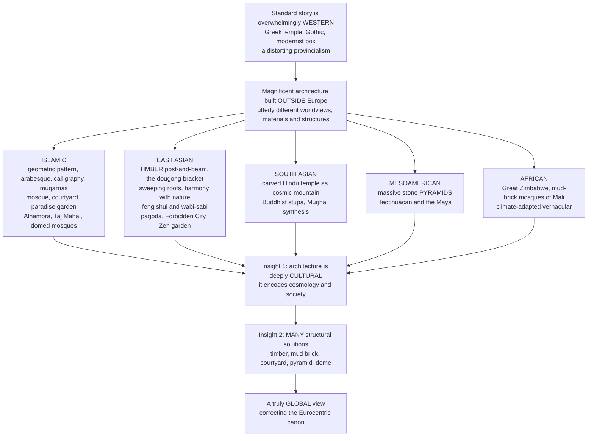

# 🌏 Non-Western Architectural Traditions

> [!abstract] TL;DR
> **The standard story of architecture — Greek temple, Roman arch, Gothic cathedral, Renaissance dome, modernist glass box — is overwhelmingly *Western*, and that is a distorting provincialism.** Some of the most magnificent, sophisticated, and influential buildings in human history were raised *outside* Europe, expressing utterly different worldviews, materials, and structural ideas. **Islamic** architecture built a dazzling aesthetic of geometric pattern, arabesque, calligraphy, and *muqarnas* honeycomb vaulting around the mosque, the courtyard, and the garden-as-paradise — from the Alhambra to the Taj Mahal to the great domed mosques of Sinan. **East Asian** architecture built a whole civilization in *timber*, with the elegant *dougong* bracket set letting roofs sweep and cantilever, an ethos of harmony with nature (*feng shui*), and the Japanese beauty of impermanence and *wabi-sabi*. **South Asian** architecture carved the Hindu temple as a symbolic cosmic mountain and raised the Buddhist stupa. **Mesoamerican** civilizations built massive stone pyramids; **African** traditions ranged from Great Zimbabwe's dry-stone city to the mud-brick mosques of Mali. Two insights matter most: architecture is deeply **cultural** (each tradition encodes a distinct cosmology, religion, and social order), and there are **many valid structural and aesthetic solutions** to building — timber frame, mud brick, courtyard, pyramid, dome — not one Western stone-and-arch lineage.

---

## Intuition

**Analogy — the world atlas with only one continent drawn.** Imagine being handed a "complete atlas of the world" that lavishes hundreds of detailed pages on Europe — every river, every town — and then compresses the entire rest of the planet into a blurry margin labelled "elsewhere." You would rightly call it not an atlas but a *provincialism dressed up as universality*. That is exactly what the conventional architecture survey does. It marches from the Parthenon to the Colosseum to Chartres to Brunelleschi's dome to Le Corbusier's white villa and calls the sequence "the history of architecture" — when in truth it is the history of *one peninsula*. Meanwhile, on the pages squeezed into the margin, sit the Alhambra's stalactite ceilings, the timber halls of the Forbidden City floating on bracket-clusters, Borobudur rising as a stone mandala you climb toward enlightenment, the pyramids of Teotihuacan aligned to the heavens, and the sculpted mud pinnacles of the Great Mosque of Djenné. The map is not wrong because it drew Europe; it is wrong because it drew *only* Europe and called that the whole.

Redraw the atlas fully and two things leap out. First, **architecture is deeply cultural** — each tradition is a different *cosmology made buildable*: the mosque orients a community toward Mecca and forbids idols, so its genius pours into pattern and the written word of God; the Chinese hall answers to *feng shui* and the emperor's cosmic axis; the Hindu temple is literally a mountain-of-the-gods you can walk into; the Maya pyramid is a sacred mountain with a temple-cave at its summit. Second, **there are many valid structural solutions to building** — the West's stone-and-arch lineage is *one* answer among several, and not always the cleverest. East Asia solved the very same problem of spanning space and surviving earthquakes with a flexible *timber* frame; hot-arid societies solved comfort with thick earthen mass and a shaded courtyard centuries before air-conditioning; the Sahel raised monumental architecture out of nothing but sun-dried mud. To study non-Western traditions is not multicultural charity — it is the correction that turns a parochial story into a *global* one.

---

## How It Works

### Core mechanics

Non-Western architecture is not one thing but a family of great, internally coherent civilizational traditions. The field turns on one central move — **decentering Europe** — and then follows it into the world's major building cultures.

1. **The critique of the canon.** The inherited survey (Greece → Rome → Gothic → Renaissance → Baroque → Modern) is a *nineteenth-century construction*, tuned to legitimize a European lineage and rank everything else as "influence," "exotica," or "not-yet-architecture." A **global history** instead treats each tradition on its own terms, and asks what building *meant* inside each cosmology rather than how closely it approaches Vitruvius.
2. **Islamic architecture — pattern, dome, and paradise.** Organized around the **mosque** (prayer hall, *mihrab* niche marking the *qibla* toward Mecca, *minaret*, and open *sahn* courtyard), the *madrasa*, the palace, and the garden. Because a strong current of **aniconism** discouraged figural images in sacred settings, genius was redirected into three non-figural arts: infinite **geometric pattern** (*girih*), the flowing vegetal **arabesque**, and supreme **calligraphy** (the word of God as the highest visual art). Its signatures are the horseshoe and pointed **arch**, the **dome-on-pendentives** (mastered alongside Byzantium — Sinan's Ottoman mosques are Hagia Sophia's structural heirs), and the **muqarnas**, a honeycomb of stalactite cells dissolving the transition from wall to vault. The **courtyard house** turns inward for privacy and cool, and the **chahar bagh** garden — quartered by water channels — is a built image of paradise (Alhambra, Great Mosque of Córdoba, Isfahan, the Taj Mahal, the mud mosques of Mali).
3. **East Asian architecture — the timber civilization.** China, Korea, and Japan built primarily in **wood**, using a sophisticated **post-and-beam frame** in which walls carry no load and the roof rests on columns. The genius joint is the **dougong** — an interlocking bracket set stacked atop each column that spreads the roof's weight and lets deep, **sweeping eaves** cantilever far outward. The system is **modular and standardized** (codified in the Song-dynasty *Yingzao Fashi* manual), enabling prefabrication and axial, symmetrical **courtyard planning** (the Forbidden City). Deep principles govern it: **harmony with nature** and **feng shui** cosmology; the contemplative garden (the Chinese scholar's garden, the Japanese Zen *karesansui* dry-rock garden); and the Japanese aesthetics of **impermanence, emptiness, asymmetry, and wabi-sabi** — the beauty of the imperfect and transient, seen in the teahouse, the temple, and the timber **pagoda**. Timber's *flexibility* is also a structural answer to **earthquakes**.
4. **South and Southeast Asian architecture — the temple as cosmos.** The **Hindu temple** is a symbolic **cosmic mountain** and **mandala**: the tower (*shikhara* in the north, *vimana* in the south) rises over the dark womb-chamber (*garbhagriha*) housing the deity, its surface a teeming carved microcosm — the building *is* the universe in miniature. The Buddhist **stupa** (Sanchi) and the colossal mandala-mountain of **Borobudur**, the **rock-cut** halls of Ajanta and Ellora, and the temple-mountain of **Angkor Wat** extend the theme, while the **Indo-Islamic / Mughal synthesis** fuses Persian and Indian idioms.
5. **The Americas and Africa.** Mesoamerican and Andean civilizations raised massive **stone pyramids** and ceremonial centers — **Teotihuacan**, the **Maya**, Aztec **Tenochtitlan** — and the astonishing mortar-less **Inca stonework** of **Machu Picchu**. African architecture spans **Great Zimbabwe**'s dry-stone city, the **mud-brick / adobe** monumentality of the Sahel (**Djenné**, **Timbuktu**), the **rock-hewn churches** of Lalibela, and a vast repertoire of **vernacular** forms exquisitely tuned to climate.
6. **The cross-cultural lessons.** Read together, these traditions teach that architecture is *culturally specific* (cosmology, religion, and society encoded in built form), that **structural and material solutions are plural** (timber frame, mud brick, courtyard, pyramid, dome), that pre-modern builders held deep **climate-responsive** wisdom (thermal mass, passive cooling, the courtyard), and that architecture has always travelled along routes of **exchange** (the Silk Road, Islamic-to-European transmission, and the later Western "Orientalist" borrowing). Recovering them is both a *decolonizing* of the discipline and a *resource* for a sustainable, plural future.

### Flow / Architecture



---

## Key Concepts

**Secondary (can explain to a bright 16-year-old):**
- **The famous buildings are not all European.** The Taj Mahal, the Forbidden City, the pyramids of Mexico, and the Alhambra are as sophisticated as any cathedral — and they look completely different because the people who built them believed different things and used different materials.
- **You can build magnificently without stone arches.** East Asia built palaces and temples out of *wood* using clever brackets that let the roofs curve and float. West Africa built giant mosques out of *mud*. There is more than one way to make a great building.
- **Buildings carry a worldview.** A mosque points everyone toward Mecca and covers itself in beautiful patterns instead of statues. A Hindu temple is shaped like a sacred mountain. A Chinese palace is laid out along a cosmic axis. The building tells you what its makers held holy.

**Undergraduate (needs some background):**
- **The Eurocentric canon and its critique.** The standard "Western-lineage" survey is a constructed narrative, not a natural fact. A *global* history de-provincializes architecture by judging each tradition against its own cosmology, program, and materials rather than against the Greek order.
- **Islamic aesthetic logic.** Aniconism reroutes creative energy into **geometry, arabesque, and calligraphy**; the **dome-on-pendentives** and the **muqarnas** solve the geometry of covering a square with a circle and dissolving structural transitions into ornament; the **courtyard** and **chahar bagh garden** organize climate and cosmology at once.
- **The dougong / timber system.** East Asian building is a **modular timber frame** where the bracket cluster (dougong) transfers roof load to columns, frees the wall of structural duty, and enables cantilevered eaves. Standardization (*Yingzao Fashi*) makes it prefabricable, and the frame's flexibility resists earthquakes — a fundamentally different structural philosophy from European load-bearing masonry.
- **The temple-as-cosmos.** The Hindu temple is a **mandala and cosmic mountain**: plan, proportion, tower, and carving together diagram the universe, so the worshipper's movement inward and the tower's rise are a journey toward the divine center.

**Graduate (system-level thinking):**
- **Decolonizing architectural history.** Ching, Jarzombek, and Prakash's *global* framework replaces the single European timeline with **synchronic world sections**, exposing how "influence" language and the craft/architecture split were instruments of hierarchy. The move is not to append non-Western chapters to a Western spine but to *dissolve the spine* into a genuinely planetary account of building.
- **Structure as cosmology (Ardalan & Bakhtiar).** In Persian architecture the geometry is not decoration laid over structure but a **Sufi metaphysics made spatial** — the point, the circle, and the recursive pattern figure divine unity (*tawhid*) radiating into multiplicity. Form, number, and meaning are one system; reading the muqarnas as mere ornament misses that it is a *theology of light and infinity* built in plaster.
- **Material determinism and its limits.** Timber-versus-masonry is not simply a resource accident: the timber choice co-evolved with an aesthetics of impermanence and renewal (Ise Shrine's ritual rebuilding), a modular building bureaucracy, and seismic pragmatism — while masonry co-evolved with permanence, the arch, and a different politics of the monument. Material *conditions* a tradition's whole conceptual world without strictly *determining* it.
- **Climate wisdom as recoverable science.** The courtyard house, the wind-catcher (*badgir*), thick earthen **thermal mass**, and the shaded garden constitute a pre-mechanical building science of passive comfort. Quantifying their **decrement factor** and **time lag** shows they are not folklore but tuned thermal engineering — a serious argument for treating vernacular and non-Western traditions as a resource for **sustainable** design, not a museum.

---

## Python Demo

```python
# Non-Western architectural traditions, quantified two ways:
#   (a) CLIMATE-ADAPTED THERMAL MASS -- how the thick earthen walls of hot-arid
#       Islamic/vernacular architecture DAMP and DELAY the daily temperature swing
#       (the "decrement factor" and "time lag" of a periodic thermal wall), keeping
#       the interior cool by day and warm by night while the outside swings wildly.
#   (b) ISLAMIC GEOMETRIC PATTERN -- generate a star-and-polygon tessellation from
#       rotational and reflectional symmetry: the mathematical basis of girih ornament.
# Requires: numpy, matplotlib
import numpy as np
import matplotlib.pyplot as plt
from matplotlib.patches import Polygon

# ================= (a) THERMAL MASS: decrement factor and time lag ==================
# Periodic (sinusoidal) daily outdoor temperature drives a homogeneous earthen wall.
# Analytical periodic-wall solution: an interior sinusoid of the SAME 24 h period,
# attenuated by a decrement factor f and shifted by a time lag phi that both grow
# with wall thickness L and shrink with thermal diffusivity alpha.
P_hours = 24.0
P = P_hours * 3600.0                       # daily period [s]
alpha = 5.0e-7                             # thermal diffusivity of adobe/mud brick [m^2/s]
omega = 2 * np.pi / P
k = np.sqrt(omega / (2 * alpha))           # thermal wave number [1/m]

t = np.linspace(0, 48, 400)                # two days [h]
T_mean, A = 25.0, 12.0                     # mean 25 C, +/-12 C -> day 37 C, night 13 C
T_out = T_mean + A * np.sin(2 * np.pi * t / P_hours - np.pi / 2)   # coolest at dawn

def interior(L):
    f = np.exp(-k * L)                     # decrement factor (0..1): swing attenuation
    lag_h = (k * L) / omega / 3600.0       # time lag [h]
    T_in = T_mean + A * f * np.sin(2 * np.pi * (t - lag_h) / P_hours - np.pi / 2)
    return T_in, f, lag_h

walls = {"thin wall  0.15 m": 0.15, "thick earthen wall  0.60 m": 0.60}

fig, axes = plt.subplots(1, 2, figsize=(14, 5.6))

axes[0].plot(t, T_out, "k--", lw=2, label="outdoor  (swings wildly)")
for name, L in walls.items():
    T_in, f, lag_h = interior(L)
    axes[0].plot(t, T_in, lw=2.2,
                 label=f"{name}:  f={f:.2f}, lag={lag_h:.1f} h")
axes[0].axhspan(20, 27, color="green", alpha=0.10)          # comfort band
axes[0].text(1, 26.4, "comfort band", fontsize=8, color="green")
axes[0].set_xlabel("time  [hours]")
axes[0].set_ylabel("temperature  [deg C]")
axes[0].set_title("Climate-adapted thermal mass:\nthick earthen walls damp and delay the daily swing",
                  fontsize=10)
axes[0].legend(loc="upper right", fontsize=8)
axes[0].grid(alpha=0.25)

# ================= (b) ISLAMIC GEOMETRIC TESSELLATION: star-and-polygon =============
def star_polygon(cx, cy, n=8, r_out=0.5, r_in=0.207, phase=0.0):
    """n-pointed star from ALTERNATING radii -> n-fold rotational + reflectional symmetry."""
    ang = np.linspace(0, 2 * np.pi, 2 * n, endpoint=False) + phase
    r = np.where(np.arange(2 * n) % 2 == 0, r_out, r_in)
    return np.column_stack([cx + r * np.cos(ang), cy + r * np.sin(ang)])

ax = axes[1]
nx, ny = 5, 5
teal, gold = "#0d5c63", "#e0a500"
# Eight-pointed stars on a unit square lattice: their points meet, tessellating the plane.
for i in range(nx):
    for j in range(ny):
        star = star_polygon(i, j, n=8, r_out=0.5, r_in=0.207, phase=np.pi / 8)
        ax.add_patch(Polygon(star, closed=True, facecolor=teal,
                             edgecolor=gold, lw=1.4))
# Interstitial rotated squares fill the gaps -> classic star-and-cross girih motif.
for i in range(nx - 1):
    for j in range(ny - 1):
        sq = star_polygon(i + 0.5, j + 0.5, n=4, r_out=0.293, r_in=0.293, phase=np.pi / 4)
        ax.add_patch(Polygon(sq, closed=True, facecolor=gold,
                             edgecolor=teal, lw=1.2))
ax.set_xlim(-0.6, nx - 0.4); ax.set_ylim(-0.6, ny - 0.4)
ax.set_aspect("equal"); ax.axis("off")
ax.set_title("Islamic geometric ornament:\nstar-and-polygon tessellation from rotational symmetry",
             fontsize=10)

plt.tight_layout()
plt.savefig("non_western_architecture.png", dpi=120)
plt.show()

# Takeaway:
#  (a) A 0.6 m mud-brick wall cuts the daily temperature swing to a fraction of the
#      outdoor swing (small decrement factor f) and delays the peak by many hours
#      (large time lag) -> interior sits inside the comfort band while the exterior
#      bakes and freezes. Passive climate control, centuries before HVAC.
#  (b) Repeating one symmetric star tile plus its interstitial polygon fills the plane
#      with no gaps -> the mathematical logic (rotation + reflection) behind the
#      infinite, non-figural ornament of Islamic architecture.
```

The left panel is the **thermal-mass** result: a thin wall barely blunts the outdoor swing, but a 0.6 m earthen wall collapses the daily amplitude (a small *decrement factor*) and shifts its peak by many hours (a large *time lag*), so the interior floats gently inside the comfort band while the exterior alternately bakes and freezes — the physics behind why the courtyard house of the hot-arid world stays livable without machinery. The right panel builds an **Islamic tessellation** by repeating a single eight-pointed star (whose alternating radii give it eight-fold rotational and full reflectional symmetry) plus an interstitial square, filling the plane seamlessly — the compact mathematical logic underneath *girih* ornament and, by extension, the *muqarnas*.

---

## Real-World Applications

> **The Alhambra, Granada — geometry as paradise.** The Nasrid palace is the summit of Islamic ornament: honeycombed *muqarnas* vaults dissolve overhead like frozen light, walls carry infinite interlaced *girih* patterns and Arabic calligraphy praising God, and the courtyards (the Court of the Lions, the Court of the Myrtles) fuse water, shade, and quartered garden into a built image of paradise. Nothing figural, everything mathematical and cool — a complete non-figural aesthetic universe.

> **The Forbidden City, Beijing — timber statecraft.** The world's largest surviving palace complex is built almost entirely in **wood**: hundreds of halls whose massive sweeping roofs rest on *dougong* bracket clusters atop columns, arrayed along a single cosmic north-south axis that stages the emperor as the pivot of heaven and earth. It is modular timber construction scaled to imperial cosmology — the polar opposite of European load-bearing stone.

> **The Taj Mahal, Agra — Mughal synthesis.** The Mughal mausoleum fuses Persian, Central Asian, and Indian idioms into perfect bilateral symmetry: a double-shelled bulbous **dome** on a plinth, framed by four minarets and a *chahar bagh* paradise garden reflected in a water channel, its white marble inlaid with *pietra dura* floral arabesque and Quranic calligraphy. Islamic structural and garden logic, executed with South Asian craft.

> **The Great Mosque of Djenné, Mali — monumental mud.** The largest mud-brick building on Earth is raised from sun-dried earth (*banco*) bristling with projecting palm-wood beams (*toron*) that double as permanent scaffolding for the annual community re-plastering. Thick earthen walls give it huge **thermal mass** against the Sahel heat — proof that monumental, climate-tuned architecture needs neither stone nor steel.

> **Borobudur, Java, and Machu Picchu, Peru — mountains of meaning.** Borobudur is a colossal stone **mandala** the pilgrim ascends level by level toward enlightenment; Machu Picchu shows Inca **ashlar** masonry so precise the mortar-less granite blocks resist five centuries of earthquakes. Two non-Western answers to making sacred, enduring architecture from stone — one as cosmic diagram, one as seismic engineering.

---

## Common Pitfalls

- **Treating "Western architecture" as *the* architecture.** The deepest error is the unmarked default: calling the Greek-to-modernist line "the history of architecture" and everything else "non-Western," "vernacular," or "exotic." That framing smuggles in a hierarchy. The corrective is a genuinely *global* baseline in which the European tradition is one regional case among many.
- **Ranking traditions on a single ladder.** Judging a Chinese timber hall or a Malian mud mosque by how closely it approaches the Parthenon (does it have columns? a "true" arch?) imposes alien criteria and guarantees the verdict "less developed." Each tradition must be assessed against *its own* program, cosmology, and materials.
- **Reading ornament as "mere decoration."** Dismissing the muqarnas, the arabesque, or the girih as surface prettiness misses that in Islamic architecture geometry *is* the meaning — a metaphysics of unity and infinity. Ornament here is structure of thought, not icing on structure.
- **Exoticizing and freezing living traditions.** Orientalist and "primitivist" framing turns non-Western building into timeless spectacle, ignoring its engineering logic, its internal debates, and its continued life. The Ise Shrine is *rebuilt* every twenty years; these are working traditions, not relics.
- **Mistaking material for primitiveness.** Assuming timber, mud brick, or earth is a "lesser" material than cut stone inverts the truth: these are often the *cleverer* climate-and-seismic solutions. Thick earthen mass out-performs thin masonry for desert comfort, and a flexible timber frame out-survives rigid stone in an earthquake.

---

## Related Concepts

*Within the Architecture vault this note sits in S02 (History of Architecture) as the deliberate counterweight to the Western survey. Its sibling notes carry the argument in both directions: **Ancient_and_Classical_Architecture** and **Renaissance_and_Baroque_Architecture** are precisely the canon this note de-centers, so read against them the "provincialism" claim becomes concrete; **Architecture_Culture_and_Society** supplies the master principle that every building encodes a cosmology and social order, which is exactly why traditions differ so radically; **Vernacular_Architecture_and_Regional_Design** shares this note's climate-and-material wisdom (the courtyard, the earthen wall, the wind-catcher) and its case for a plural, sustainable canon; **Materials_and_Tectonics_in_Architecture** grounds the timber-versus-mud-versus-stone contrast in structural first principles; and **Genius_Loci_Place_and_Context** frames each tradition as an architecture rooted in the spirit of its particular place.*

Cross-vault connections (verified to exist):

- [[Islam_and_the_Islamic_Tradition]] — the faith whose mosque, aniconism, *qibla*, and paradise imagery generate the entire Islamic architectural aesthetic.
- [[Hinduism_and_the_Dharmic_Traditions]] — the cosmology behind the Hindu temple as cosmic mountain and mandala, and the Buddhist stupa.
- [[East_Asian_and_Indigenous_Religions]] — the Daoist, Confucian, Buddhist, and Zen worldviews behind *feng shui*, the scholar's and dry-rock gardens, and *wabi-sabi*.
- [[Sacred_Symbols_Space_and_Time]] — how religions organize sacred space and orientation, the comparative-religion frame for reading temple, mosque, and pyramid.
- [[Rise_of_Islam_and_the_Caliphates]] — the historical expansion that spread the mosque and Islamic building across three continents.
- [[Al_Andalus]] — the Iberian context of the Alhambra and the Great Mosque of Córdoba.
- [[Gunpowder_Empires_Ottoman_Mughal_Qing]] — the Ottoman (Sinan's mosques) and Mughal (Taj Mahal) states behind the great early-modern Islamic monuments.
- [[Ancient_Chinese_Dynasties]] — the imperial order whose cosmic axis and bureaucracy shaped the timber palace and the Forbidden City.
- [[Mesoamerican_Civilizations]] — the Maya, Aztec, and Teotihuacan builders of the great stone pyramids.
- [[Andean_Civilizations_and_the_Inca]] — the Inca masons of Machu Picchu and mortar-less ashlar stonework.
- [[West_African_Empires]] — Mali, Songhai, and the Sahelian world of Djenné and Timbuktu's mud-brick architecture.
- [[Material_Culture_and_Technology]] — anthropology's reading of buildings and objects as material culture carrying belief and social relations.
- [[Non_Western_and_Global_Art_Traditions]] — the parallel decolonizing argument in art history, from Chinese brushwork to African masks to Islamic pattern.
- [[Iconography_and_Semiotics_of_Art]] — how ornament, symbol, and image encode meaning, the interpretive lens for arabesque, calligraphy, and temple carving.
- [[Architecture_and_the_Built_Environment]] — the art vault's companion treatment of architecture as an aesthetic and cultural medium.

---

## Review Questions

**Secondary:**
1. Name three great non-European buildings from three different traditions, say roughly where each is, and explain one way each looks or works differently from a European stone cathedral. Why does including them change what "the history of architecture" means?

**Undergraduate:**
2. East Asia built palaces in *timber* with the *dougong* bracket, while hot-arid Islamic and Sahelian societies built in thick *mud brick* around courtyards. Choose either tradition and explain how its material choice is tied to a structural problem (earthquakes, or desert heat) *and* to a worldview (harmony with nature, or the mosque and paradise garden). What does this reveal about the claim that "there are many valid solutions to building"?

**Graduate:**
3. The conventional survey narrates architecture as a single European lineage and files everything else as "non-Western." Construct an argument for a genuinely *global* history of architecture: what exactly is wrong with the canonical framing, what does a decolonized account replace it with (consider Ching–Jarzombek–Prakash's synchronic world sections and Ardalan–Bakhtiar's "structure as cosmology"), and what practical value do these traditions hold for a *sustainable* twenty-first-century architecture? Where might the decolonizing move itself risk over-correction?

---

## Sources

- Spiro Kostof, *A History of Architecture: Settings and Rituals* (Oxford University Press, 2nd ed. 1995) — [Publisher page](https://global.oup.com/academic/product/a-history-of-architecture-9780195083798)
- Francis D. K. Ching, Mark M. Jarzombek & Vikramaditya Prakash, *A Global History of Architecture* (Wiley, 3rd ed. 2017) — [Publisher page](https://www.wiley.com/en-us/A+Global+History+of+Architecture%2C+3rd+Edition-p-9781118981337)
- Nader Ardalan & Laleh Bakhtiar, *The Sense of Unity: The Sufi Tradition in Persian Architecture* (University of Chicago Press, 1973) — [Publisher page](https://press.uchicago.edu/ucp/books/book/chicago/S/bo3684408.html)
- Nancy Shatzman Steinhardt, *Chinese Architecture: A History* (Princeton University Press, 2019) — [Publisher page](https://press.princeton.edu/books/hardcover/9780691169989/chinese-architecture)
- Oleg Grabar, *The Formation of Islamic Art* (Yale University Press, rev. ed. 1987) — [Wikipedia overview](https://en.wikipedia.org/wiki/Islamic_architecture)

---

#architecture #global-architecture #islamic-architecture #east-asian-architecture #non-western
