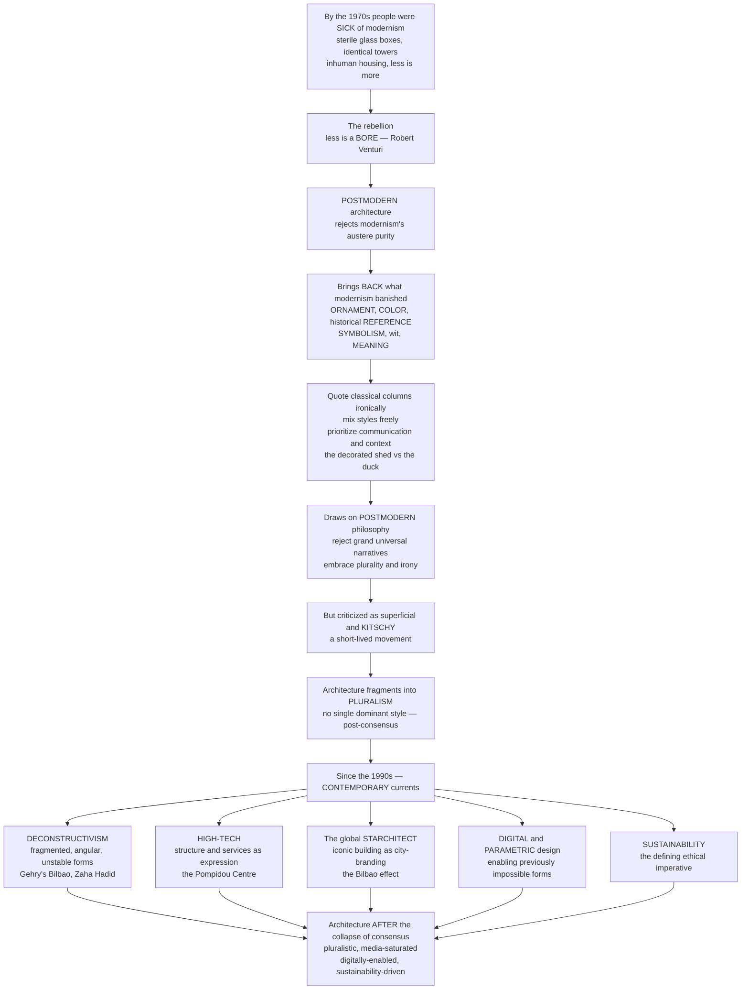

# 🏙️ Postmodern and Contemporary Architecture

> [!abstract] TL;DR
> By the 1970s the world had grown **sick of modernism** — the sterile glass boxes, the identical towers, the inhuman housing blocks, the arrogant dictum that *"less is more"* and *ornament is crime*. The rebellion came with a defiant slogan: **"less is a *bore*"** (Robert Venturi). **Postmodern architecture** (roughly 1970s–1990s) rejected modernism's austere purity and brought back everything it had banished — **ornament, color, historical reference, symbolism, wit, and meaning** — quoting classical columns and pediments (often ironically), mixing styles freely, and prioritizing **communication and context** over abstract purity (Venturi's "**decorated shed**" versus the "**duck**"; the AT&T Building's Chippendale top; Michael Graves's playful civic buildings). It drew on **postmodern philosophy** — the rejection of grand universal narratives and the embrace of plurality and irony. But postmodernism was soon dismissed as **superficial and kitschy**, and architecture fragmented into a rich **pluralism** with no single dominant style. Since the 1990s, **contemporary architecture** has been shaped by several powerful currents: **deconstructivism** (fragmented, unstable, angular forms — Gehry's Guggenheim Bilbao, Zaha Hadid), **high-tech** (structure as expression — the Pompidou Centre), the rise of the global **starchitect** and the **iconic building as city-branding** (the "Bilbao effect"), the transformative impact of **digital and parametric design**, and the dominance of **sustainability** as the defining imperative. To understand it is to understand architecture *after modernism's collapse of consensus*.

---

## Intuition

**Analogy: the party guest who finally speaks up.** Imagine a decades-long dinner party where one guest — Modernism — has monopolized the conversation, lecturing everyone that taste is vulgar, that ornament is a *crime*, that the only honest building is a stripped white box, that history is dead weight and *less is more*. For a while it was thrilling. But by the 1970s the other guests are exhausted. The buildings this creed produced were often cold, placeless, and — in the case of the demolished **Pruitt-Igoe** housing project — outright failures. So a guest named Robert Venturi finally leans back and says the line that breaks the spell: **"less is a *bore*."** The room erupts. Suddenly everyone wants their ornament back, their color, their jokes, their columns and arches — even if they quote them with a wink. The single voice has ended; a noisy, plural, argumentative dinner conversation begins.

That is the shift this note is about. **Postmodern architecture** rejected modernism's puritanical purity and reintroduced *ornament, color, historical reference, symbolism, wit, and meaning*, prioritizing how a building *communicates* over how "pure" it is — Venturi's famous "**decorated shed**" (an ordinary box carrying a communicative sign or facade) against the "**duck**" (a building whose whole sculptural form *is* the message). It borrowed its nerve from **postmodern philosophy** — the suspicion of grand universal "narratives," the taste for irony, the mixing of *high* and *low* culture. But the party never returned to a single voice. Postmodernism was itself soon mocked as superficial kitsch, and architecture splintered into a **pluralism** with no reigning style. Since the 1990s that plural field has been dominated by loud personalities and powerful forces: **deconstructivism**'s shattered geometries (Frank Gehry's swooping titanium **Guggenheim Bilbao**, Zaha Hadid's liquid curves), **high-tech**'s guts-on-the-outside honesty (the **Pompidou Centre**), the global "**starchitect**" and the **iconic building as city-branding** (the "**Bilbao effect**"), the **digital and parametric** revolution that made previously impossible curving forms buildable, and — increasingly the moral center of gravity — **sustainability**. Understanding postmodern and contemporary architecture is understanding a media-saturated, digitally-enabled, globalized, sustainability-driven landscape of *competing visions* rather than one grand plan.

---

## How It Works

### Core mechanics: revolt → return → fragmentation → contemporary currents

1. **The revolt against modernism (from ~1966/1972).** Discontent had been building for decades: modernism's austerity, uniformity, and *placelessness*, its contempt for the street, and its visible failures (windswept plazas, alienating housing megastructures, the 1972 dynamiting of Pruitt-Igoe that critic **Charles Jencks** half-jokingly dated as "the day modern architecture died"). Two books lit the fuse. **Robert Venturi's** *Complexity and Contradiction in Architecture* (1966) answered Mies's "less is more" with "**less is a bore**," defending *ambiguity, richness, and "both-and" rather than either-or*. Venturi, Denise Scott Brown, and Steven Izenour's *Learning from Las Vegas* (1972) then took the commercial strip seriously, extracting the "**decorated shed**" (an ordinary building made meaningful by an applied *sign* or facade) versus the "**duck**" (a building whose whole *form* is the sign).

2. **The postmodern return — bringing back what modernism banished.** Postmodern architecture reinstated **ornament, color, and historical reference** (classical columns, pediments, arches — usually *ironic, playful, or theatrical* rather than reverent), plus **symbolism, wit, humor, eclecticism and pastiche** (mixing periods and styles freely), **contextualism**, and the deliberate blending of **"high" and "low" culture**. Its intellectual license came from **postmodern philosophy/theory**: the rejection of modernist utopianism and *grand universal narratives*, the embrace of plurality and irony, and Jencks's idea of "**double coding**" — a building speaking to the architectural elite and the general public *at the same time*.

3. **Key postmodern figures and works.** Venturi's own buildings; **Michael Graves's** Portland Building (1982), a candy-colored civic block; **Philip Johnson's** AT&T (now Sony) Building (1984) with its notorious broken "**Chippendale**" pediment; **Charles Moore's** exuberant Piazza d'Italia in New Orleans; and the theorists of type and memory — **Aldo Rossi**, **James Stirling**, **Ricardo Bofill**. **Charles Jencks's** *The Language of Post-Modern Architecture* (1977) named and theorized the whole movement.

4. **The critique and fragmentation.** Postmodernism had a short life and its own sins: **superficiality, kitsch, empty historical quotation, and commercialism**. As it faded, no successor style claimed the throne. Architecture entered a "**post-consensus**" condition — a genuine **pluralism** in which many approaches coexist with no single dominant creed.

5. **Contemporary currents (1990s–present).** The plural field organized around several strands:
   - **Deconstructivism** — fragmented, unstable, angular, non-rectilinear, seemingly-chaotic forms, loosely inspired by Derrida's *deconstruction* and consolidated by the 1988 MoMA show. **Frank Gehry** (the swooping titanium **Guggenheim Bilbao**, 1997; Walt Disney Concert Hall), **Zaha Hadid** (fluid, dynamic, parametric geometries), **Daniel Libeskind**, **Rem Koolhaas/OMA**, **Peter Eisenman**, **Coop Himmelb(l)au**.
   - **High-tech / structural expressionism** — celebrating structure, services, and technology *as* the aesthetic: the **Pompidou Centre** (Piano & Rogers, guts on the outside), **Norman Foster**, the **Lloyd's building**.
   - **Minimalism / neo-modernism** — a purified return to restraint: **Tadao Ando**, **John Pawson**.
   - **Critical regionalism** — **Kenneth Frampton's** call to resist placeless globalism by rooting architecture in local place, climate, light, and material.

6. **The contemporary *condition* and its forces.** Overlaying the styles are the structural forces of the present: the global "**starchitect**" and the **iconic building as spectacle and city-branding** (the "**Bilbao effect**" — architecture as tourism and economic driver); **globalization** and the Gulf/Asian building booms and the super-tall race; the **digital/parametric revolution** (computationally generated and fabricated blob and parametric forms — Patrik Schumacher's "**parametricism**"); the dominance of **sustainability/green architecture** as the defining ethical imperative; **adaptive reuse** and preservation; and socially-engaged, participatory, humanitarian design. The result is a pluralistic, media-saturated, digitally-enabled, globalized, sustainability-driven field of *competing visions* — architecture after the collapse of consensus.

### The arc, mapped



---

## Key Concepts

### 🟢 Secondary — the core story

- **Modernism got old and cold.** By the 1970s the plain glass boxes and identical towers felt sterile and inhuman, and some — like the demolished Pruitt-Igoe housing — had failed badly.
- **"Less is a bore."** Robert Venturi's comeback to modernism's "less is more." Postmodern buildings brought back **ornament, color, decoration, historical shapes, jokes, and meaning**.
- **Quoting the past with a wink.** Postmodern buildings borrow classical columns, arches, and pediments — but often *ironically* or theatrically, not seriously. Philip Johnson's **AT&T Building** wears a giant "Chippendale" furniture top.
- **The decorated shed vs the duck.** A plain box with a big communicative sign (the *decorated shed*) versus a building shaped like its meaning, e.g. a duck-shaped stand (the *duck*). It is a theory of how buildings "talk."
- **No single style anymore.** Postmodernism was soon mocked as tacky, and architecture split into *many* coexisting styles — the "pluralism" we still live in.
- **The famous new buildings.** Frank Gehry's shiny, wavy **Guggenheim Bilbao** and Zaha Hadid's flowing curves are the icons of contemporary architecture.

### 🟡 Undergraduate — the movement and its currents

- **Two founding texts.** Venturi's *Complexity and Contradiction in Architecture* (1966) and Venturi/Scott Brown/Izenour's *Learning from Las Vegas* (1972) supplied the theory; **Charles Jencks's** *The Language of Post-Modern Architecture* (1977) named the movement and popularized "**double coding**."
- **Postmodern qualities.** The *return* of ornament, color, historical reference and quotation, symbolism, wit, eclecticism/pastiche, contextualism, and the mixing of "high" and "low" culture — communication and meaning over abstract purity.
- **The philosophy connection.** Postmodern architecture parallels postmodern *thought*: distrust of modernist utopian "grand narratives," an embrace of plurality, irony, and surface — the same intellectual weather as poststructuralism and deconstruction.
- **Deconstructivism.** Fragmented, angular, non-rectilinear, deliberately unstable forms, consolidated by the **1988 MoMA "Deconstructivist Architecture"** show — Gehry, Hadid, Libeskind, Eisenman, Koolhaas/OMA, Tschumi, Coop Himmelb(l)au.
- **High-tech and minimalism.** High-tech (Pompidou, Foster, Lloyd's) makes structure and services the aesthetic; minimalism/neo-modernism (Ando, Pawson) purifies rather than decorates — evidence of the *plural* field.
- **The starchitect and the Bilbao effect.** The 1997 Guggenheim Bilbao turned a declining industrial city into a tourist destination, launching the era of the **iconic signature building as urban branding** — architecture as economic and media instrument.

### 🔴 Graduate — the contemporary condition and its tensions

- **The collapse of consensus is the real subject.** Modernism was the last near-*universal* architectural creed. Its exhaustion did not produce a new creed but a *condition of pluralism* — the interesting analytic object is the loss of a single legitimating narrative, not any one successor style. Postmodern *architecture* and postmodern *theory* rhyme precisely here: both distrust the grand narrative.
- **Semiotics as the postmodern engine — and its trap.** Venturi and Jencks read the building as a *system of signs* (denotation vs connotation, the decorated shed as applied sign). This reopened *meaning* that modernism had suppressed — but untethered from craft or conviction, the sign becomes a *scenography of empty quotation*, which is exactly the "kitsch" charge that killed the movement.
- **Deconstructivism's uneasy borrowing.** The label leans on Derrida's *deconstruction*, but as a formal language (fragmentation, instability, non-orthogonal geometry) it is often more an *aesthetic of disruption* than a rigorous philosophical program — a caution about how architecture imports theory as branding.
- **The icon economy and its diminishing returns.** The "Bilbao effect" made the spectacular one-off building a tool of city marketing and global capital, in tension with *context, social need, and place*. As every city commissions its own starchitect icon, novelty erodes and the strategy yields diminishing returns — spectacle competing with the everyday fabric of the city.
- **The digital/parametric turn.** Computation (CAD/CAM, scripting, parametric modeling, digital fabrication) made complex, curving, non-repeating, previously *unbuildable* forms both designable and constructible — reviving *ornament-as-data* and *ornament-as-structure* that modernism thought it had abolished, and raising the question of whether form is now driven by *data and process* rather than function or symbol.
- **Sustainability as the new legitimating imperative.** If modernism's legitimacy was *function/progress* and postmodernism's was *meaning/communication*, contemporary architecture's emerging center of gravity is **environmental and social performance** — carbon, energy, adaptive reuse, resilience, equity — arguably the first candidate since modernism for a shared, cross-stylistic *ethic*. The open question is whether it becomes the next consensus or remains one competing value among many.

---

## Python Demo

```python
# Postmodern & contemporary architecture -- two quantitative pictures of
# "architecture after the collapse of consensus":
#   Panel 1 -- FROM MONOPOLY TO PLURALISM: modernism's near-monopoly mid-century
#              collapses after ~1970 into a fragmented field of many coexisting
#              styles.  A rising DIVERSITY (Shannon-entropy) index measures the
#              loss of a single consensus.
#   Panel 2 -- THE BILBAO EFFECT and its DIMINISHING RETURNS: the first iconic
#              starchitect building creates a huge tourism/attention spike; every
#              city that copies the strategy captures a SMALLER spike as novelty
#              erodes -> diminishing returns of the iconic-building strategy.
# Uses only numpy + matplotlib.
import numpy as np
import matplotlib.pyplot as plt

fig, (ax1, ax2) = plt.subplots(1, 2, figsize=(15, 6.5))

# ---------------------------------------------------------------
# Panel 1: FROM MODERNISM'S MONOPOLY TO POSTMODERN PLURALISM
# ---------------------------------------------------------------
t = np.linspace(1920, 2025, 420)

def logistic(x, x0, k):
    return 1.0 / (1.0 + np.exp(-(x - x0) / k))

# unnormalized "presence" of each approach through time
modern      = logistic(t, 1930, 4) * (1 - 0.82 * logistic(t, 1975, 9)) + 0.05
postmodern  = 0.85 * np.exp(-((t - 1985) / 13) ** 2)
deconstruct = 0.55 * logistic(t, 1993, 5) * (1 - 0.30 * logistic(t, 2015, 8))
hightech    = 0.45 * logistic(t, 1982, 6)
minimalist  = 0.42 * logistic(t, 1997, 6)
sustainable = 0.80 * logistic(t, 2007, 6)
parametric  = 0.62 * logistic(t, 2010, 5)

styles = {
    "Modernism":        np.clip(modern, 0, None),
    "Postmodern":       np.clip(postmodern, 0, None),
    "Deconstructivist": np.clip(deconstruct, 0, None),
    "High-Tech":        np.clip(hightech, 0, None),
    "Minimalist":       np.clip(minimalist, 0, None),
    "Sustainable":      np.clip(sustainable, 0, None),
    "Parametric":       np.clip(parametric, 0, None),
}

M = np.vstack(list(styles.values()))
shares = M / M.sum(axis=0, keepdims=True)          # -> market share per year

ax1.stackplot(t, shares, labels=list(styles.keys()), alpha=0.85)
ax1.set_xlim(t.min(), t.max()); ax1.set_ylim(0, 1)
ax1.set_title("1. From modernism's monopoly to postmodern PLURALISM")
ax1.set_xlabel("year"); ax1.set_ylabel("share of architectural attention")
ax1.legend(loc="lower left", fontsize=7, ncol=2)

# diversity = Shannon entropy of the share vector, normalized to [0, 1]
eps = 1e-12
entropy = -(shares * np.log(shares + eps)).sum(axis=0)
entropy /= np.log(len(styles))                     # 0 = one style, 1 = perfectly even
ax1b = ax1.twinx()
ax1b.plot(t, entropy, "k--", lw=2, label="style diversity index")
ax1b.set_ylim(0, 1); ax1b.set_ylabel("diversity / entropy index")
ax1b.axvline(1972, color="crimson", ls=":", lw=1.5)
ax1b.text(1973, 0.08, "consensus\nbreaks ~1972", color="crimson", fontsize=8)

# ---------------------------------------------------------------
# Panel 2: THE BILBAO EFFECT and its DIMINISHING RETURNS
# ---------------------------------------------------------------
tt = np.linspace(0, 42, 600)
launches = [0, 6, 12, 18, 24, 30]                  # years cities unveil their "icon"
novelty_decay = 0.62                               # each copy captures less attention
tau = 5.0                                          # attention fades after opening

peaks = []
for k, L in enumerate(launches):
    amp = novelty_decay ** k                       # diminishing peak per copycat
    curve = amp * np.where(tt >= L, np.exp(-(tt - L) / tau), 0.0)
    label = "Bilbao (original)" if k == 0 else f"copycat #{k}"
    ax2.plot(tt, curve, lw=2, label=label)
    peaks.append((L, amp))

pk_x, pk_y = zip(*peaks)
ax2.plot(pk_x, pk_y, "ko--", lw=1, alpha=0.6)
ax2.text(18, 0.72, "diminishing returns:\neach new icon\ncaptures less", fontsize=8)
ax2.set_title("2. The Bilbao effect -- iconic spike, then diminishing returns")
ax2.set_xlabel("years since first icon"); ax2.set_ylabel("tourism / attention (arb.)")
ax2.set_xlim(0, 42); ax2.set_ylim(0, 1.05)
ax2.legend(fontsize=7, loc="upper right")

plt.suptitle("Postmodern & contemporary architecture: the collapse of consensus",
             fontsize=14)
plt.tight_layout()
plt.savefig("postmodern_contemporary_architecture.png", dpi=120)
plt.show()

# --- the story, in numbers ---
i1950 = int(np.argmin(np.abs(t - 1950)))
i2020 = int(np.argmin(np.abs(t - 2020)))
print(f"Style diversity index  1950: {entropy[i1950]:.2f}   (near-monopoly)")
print(f"Style diversity index  2020: {entropy[i2020]:.2f}   (pluralism)")
print("Iconic-building attention captured per city (diminishing returns):")
for k, (L, amp) in enumerate(peaks):
    tag = "original" if k == 0 else f"copy #{k}"
    print(f"  {tag:>9} at year {L:>2}: peak={amp:.2f}")
```

Panel 1 turns the historical claim into a picture: modernism's stacked "share" swells to a **near-monopoly** by mid-century (the diversity index near zero — one voice), then *collapses* after ~1970 as postmodern, deconstructivist, high-tech, minimalist, sustainable, and parametric approaches all crowd in, driving the **diversity/entropy index sharply upward** — the quantitative signature of the "post-consensus" pluralism. Panel 2 models the **Bilbao effect**: the original iconic building captures a huge attention spike that decays, and each city that *copies* the strategy captures a smaller spike as novelty erodes — the dashed envelope of falling peaks is the **diminishing returns** of the iconic-building game, the tension between spectacle and the everyday city made numeric.

---

## Real-World Applications

> **Example — the Guggenheim Museum Bilbao (Frank Gehry, 1997).** The single most consequential building of the contemporary era. Its swooping, computer-modeled titanium-clad form (designed with CATIA aerospace software — the digital turn made visible) transformed a declining Basque industrial port into a global tourist magnet, coining the "**Bilbao effect**": architecture as urban branding and economic engine. It fuses three of this note's threads at once — *deconstructivist* form, the *starchitect* icon, and the *digital/parametric* enabling technology.

- **The AT&T Building (Philip Johnson & John Burgee, 1984).** A granite skyscraper crowned with a broken "Chippendale" pediment — the poster child of postmodern historical quotation and a deliberate, witty slap at the flat-topped modernist box.
- **The Portland Building (Michael Graves, 1982).** A boldly colored, ornamented civic block widely taken as the first major *built* statement of postmodernism in a public building.
- **The Pompidou Centre (Renzo Piano & Richard Rogers, 1977).** High-tech's manifesto: structure, ducts, escalators, and services turned inside-out and color-coded on the exterior, freeing the interior — technology *as* ornament.
- **Piazza d'Italia (Charles Moore, 1978).** A theatrical, neon-lit collage of classical orders for New Orleans' Italian-American community — postmodernism at its most exuberant and populist.
- **Heydar Aliyev Center (Zaha Hadid, 2012).** A seamless, flowing parametric skin with no straight lines — deconstructivism matured into fluid, computationally-generated form and national branding.
- **Parametricism and the super-tall boom.** From Foster's Gherkin to the Gulf and Asian skyline races, parametric tools and global practices produce complex, performance-tuned facades — and increasingly, *sustainability* certifications (LEED, net-zero) as the marketing and ethical frame.

---

## Common Pitfalls

- **Treating postmodernism as merely "adding columns."** Its real content is a *theory of meaning and communication* (the decorated shed, double coding), not a style kit. Reducing it to applied pediments is exactly the "empty quotation" that discredited it.
- **Confusing postmodern *architecture* with postmodern *philosophy*.** They rhyme (distrust of grand narratives, irony, plurality) but are not identical; deconstructivist buildings borrow Derrida's *name* far more rigorously than his *method*. Do not assume the building "does" the philosophy.
- **Equating "contemporary" with a single style.** The defining feature of the present is precisely that there is *no* dominant style — pluralism, not a movement. Naming "the contemporary style" mistakes the condition for a school.
- **Believing the iconic building always "works."** The Bilbao effect is often *not* replicable; most copycat icons deliver diminishing returns, and spectacle can crowd out context, affordability, and the everyday fabric of the city.
- **Mistaking parametric novelty for meaning.** Digital tools make dazzling curving forms cheap to generate; complexity is not the same as significance, and "blob" form can be as empty as postmodern pastiche.
- **Reading sustainability as a bolt-on.** Treating green features as a certification checklist rather than a driver of form and program repeats modernism's mistake of separating ethics from architecture — the emerging imperative is *integral*, not decorative.
- **Anachronistic contempt.** Dismissing postmodernism wholesale as kitsch ignores what it recovered — *meaning, context, pluralism, and the public* — that modernism had suppressed and that contemporary practice still relies on.

---

## Related Concepts

*Sibling notes in this Architecture vault (referenced in prose, to be written or linked as the section fills): **Modern_Architecture_and_the_Modern_Movement** (the sterile-box austerity and "less is more" that this note revolts against), **Architectural_Theory_and_Criticism** (the manifestos, the duck-vs-decorated-shed, and the semiotic/critical tools used here), **Form_Function_and_Ornament** (where "less is a bore" and the return of ornament belong), **Parametric_and_Computational_Design** (the digital tools enabling contemporary form), **Sustainable_and_Green_Architecture** (the defining contemporary imperative), and **The_Reach_and_Future_of_Architecture** (what comes after the collapse of consensus).*

Cross-vault links (Glob-verified to exist):

- [[Contemporary_and_Postmodern_Art]] — the parallel postmodern turn in the visual arts; architecture and art shared the same revolt against modernist purity, the same irony, pastiche, and mixing of high and low culture.
- [[Modern_Art_Movements]] — the modernist avant-garde in art whose austere abstraction is the aesthetic cousin of the architecture postmodernism rebelled against.
- [[Architecture_and_the_Built_Environment]] — the built-environment overview in the aesthetics vault that frames how buildings function and signify; this note is its "after modernism" chapter.
- [[Iconography_and_Semiotics_of_Art]] — the building-as-system-of-signs; the decorated shed vs the duck and Jencks's "double coding" are architectural semiotics in action.
- [[Poststructuralism_and_Deconstruction]] — Derrida's deconstruction is the philosophical namesake behind *deconstructivist* architecture (Eisenman, Tschumi) and the postmodern distrust of grand narratives.
- [[Structuralism_and_Narratology]] — the structuralist theory of signs and codes from which architectural semiotics and its poststructural critique descend.
- [[Analytic_and_Continental_Philosophy]] — the continental tradition that houses postmodern and poststructuralist thought, the intellectual weather of this whole shift.
- [[Art_Society_and_Politics]] — art and architecture as instruments of branding, power, and economy; the "Bilbao effect" as the built form of this thesis.
- [[Digital_Art_and_New_Media]] — the digital/computational turn in the arts that parallels architecture's parametric revolution and its previously-impossible forms.

---

## Review Questions

**🟢 Secondary**
1. What did people dislike about modernist architecture by the 1970s, and what did Robert Venturi mean by "less is a bore"?
2. Name two things postmodern architecture brought *back* that modernism had banished, and give one famous example building.

**🟡 Undergraduate**
3. Explain the difference between a "decorated shed" and a "duck," and use the distinction to describe how postmodernism understood architectural *meaning* differently from modernism.
4. What is deconstructivism, and how do Gehry's Guggenheim Bilbao and Zaha Hadid's work exemplify it? Name the enabling technology that made such forms buildable.

**🔴 Graduate**
5. "The real subject of postmodern and contemporary architecture is not a style but the *collapse of consensus*." Defend or challenge this claim, using the shift from modernism's near-monopoly to a plural, post-consensus field.
6. The "Bilbao effect" made the iconic signature building an instrument of city-branding. Analyze the tensions this creates (icon vs context, spectacle vs social need, global vs local) and argue whether **sustainability** could become architecture's next shared consensus after modernism.

---

## Sources

- Charles Jencks, [*The Language of Post-Modern Architecture*](https://en.wikipedia.org/wiki/The_Language_of_Post-Modern_Architecture) (Academy Editions, 1977; 6th ed. 1991).
- Robert Venturi, [*Complexity and Contradiction in Architecture*](https://www.moma.org/calendar/exhibitions/history) (Museum of Modern Art, 1966); with Denise Scott Brown & Steven Izenour, [*Learning from Las Vegas*](https://mitpress.mit.edu/9780262720069/learning-from-las-vegas/) (MIT Press, 1972).
- Kenneth Frampton, [*Modern Architecture: A Critical History*](https://en.wikipedia.org/wiki/Modern_Architecture:_A_Critical_History) (Thames & Hudson, 1980; later chapters on postmodernism, high-tech, and critical regionalism).
- Philip Jodidio, [*Architecture Now!*](https://www.taschen.com/) (Taschen, ongoing series) — a survey of contemporary global practice.
- Hal Foster (ed.), [*The Anti-Aesthetic: Essays on Postmodern Culture*](https://en.wikipedia.org/wiki/The_Anti-Aesthetic) (Bay Press, 1983) — the philosophical/theoretical frame of postmodernism.

---

#architecture #postmodernism #deconstructivism #contemporary-architecture #starchitecture
