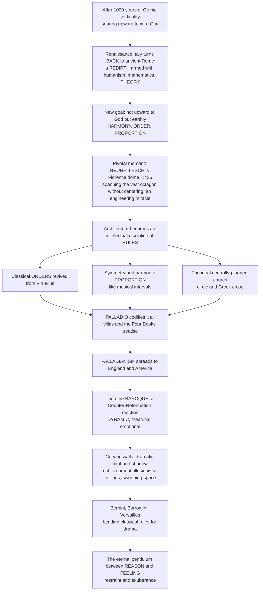

# 🏛️ Renaissance and Baroque Architecture

> [!abstract] TL;DR
> After a thousand years of **Gothic verticality** soaring toward God, Renaissance Italy did something radical: it turned **back to ancient Rome**, reviving classical architecture with the fervour of *rebirth* — but now armed with **humanism, mathematics, and self-conscious theory**. Where the Gothic soared upward, the Renaissance sought earthly **harmony, order, and proportion**: architecture as rational, human-centred beauty grounded in mathematical ratio. The pivotal moment was **Brunelleschi's dome** for Florence Cathedral (1436), an engineering miracle spanning a vast octagon without traditional centering. Architects like **Alberti, Bramante, and Palladio** treated building as a **rule-governed intellectual discipline** — the classical orders (from Vitruvius), symmetry, harmonic proportion like musical intervals, and the ideal centrally-planned church. Palladio's codification spawned a **Palladianism** that spread to England and America. Then the **Baroque** (~1600–1750) arrived as the Counter-Reformation's dramatic, theatrical reaction: **dynamic, sensuous, overwhelming** curving walls, dramatic light, rich ornament, and sweeping spaces built to move the emotions — bending the classical rules for spectacle. Together, the rational Renaissance and emotional Baroque are Western architecture's great re-engagement with its classical roots and the eternal **pendulum between reason and feeling**.

---

## Intuition

**Analogy: imagine a family that, after ten generations of speaking an entirely new dialect, deliberately relearns the language of its ancient ancestors — and then, a century later, its grandchildren take that same recovered language and turn it into flamboyant poetry.** For a thousand years medieval Europe had spoken "Gothic": pointed arches, flying buttresses, stained glass, everything straining *upward* toward heaven. Then fifteenth-century Florence looked at the ruins of ancient Rome standing all around and asked a stunning question: *why did we ever stop building like that?* The Renaissance is that conscious act of relearning the ancestral tongue — the round arch, the column, the dome, the ordered façade — but spoken by people who now also had humanism, printing, mathematics, and a brand-new idea that architecture should be **governed by rules you could write down and teach**.

And the mood of that recovered language was **calm, balanced, and rational**. A Renaissance building wants to feel *resolved*: symmetrical, its parts held in simple proportions the way musical notes fall into pleasing chords. A room might be as wide as it is long, or in a 2:3 ratio, precisely because those are the ratios that sound consonant to the ear — the Renaissance genuinely believed a beautiful building was **frozen music** mirroring the harmony of the cosmos. The perfect church, in this view, was a perfect **circle**: no direction favoured, every part equal, a geometric emblem of divine perfection.

Then the grandchildren rebelled — not by abandoning the classical language, but by making it *shout*. The **Baroque** took the same columns, arches, and orders and set them in **motion**: walls that curve and undulate like breathing lungs, oval rooms instead of static circles, shafts of dramatic light slicing through shadow, ceilings that dissolve into painted heavens, and vast sweeping spaces designed to overwhelm and *move* you before you can think. Where the Renaissance whispers *order*, the Baroque roars *drama*. Understanding these two movements is understanding how the classical language of architecture was first **reborn and systematised**, then **dramatised** — and how Western architecture has swung ever since between reason and feeling, restraint and exuberance.

---

## How It Works

### Core mechanics

1. **The rebirth (rinascita).** In fifteenth-century Florence, humanists rediscovered the texts of antiquity — above all **Vitruvius's** *De Architectura* — and rejected the Gothic (which they dismissively called "barbarian," i.e. of the Goths). Architecture returned to **classical vocabulary**: the round arch, the column and the orders, the dome, the pediment, the symmetrical façade.
2. **Architecture becomes theory.** Building was reconceived as a **learned, rule-governed discipline**, not a mason's craft. **Leon Battista Alberti's** *De re aedificatoria* (c. 1450) revived Vitruvius for a new age; architects now designed on paper, in the round-arched language of Rome, guided by written principles.
3. **The pivotal engineering feat.** **Filippo Brunelleschi's** dome for Santa Maria del Fiore (1420–1436) spanned a 43-metre octagonal opening with a **double-shell, herringbone-brick** structure raised **without full wooden centering** — a feat medieval builders could not manage. Brunelleschi also reinvented **linear perspective**, and the dome symbolically reconnected architecture with **Roman ambition**, launching the Renaissance.
4. **Harmony, order, proportion.** The Renaissance ideal was **mathematical beauty**: symmetry, geometric purity, and **harmonic proportion**. Buildings were dimensioned in **small integer ratios** (1:1, 2:3, 3:4, 1:2) — the very ratios that produce **musical consonances** — so a building was literally "frozen music" mirroring cosmic harmony.
5. **The centralised ideal.** The perfect church was **centrally planned** — the **circle** or the **Greek cross** (four equal arms) — because its rotational symmetry symbolised **divine perfection**. Bramante's Tempietto and the original plan for St. Peter's embodied this.
6. **Palladio codifies it.** **Andrea Palladio's** *I quattro libri dell'architettura* (1570) reduced the whole system to teachable rules and beautiful plates. His symmetrical, **temple-fronted villas** (Villa Rotonda) and harmonic room sequences spread as **Palladianism** — to England (Inigo Jones) and to America (Jefferson's Monticello and the neoclassical lineage of the White House and Capitol).
7. **The Baroque reaction.** Driven by the **Counter-Reformation** (art as emotional *persuasion* to win back the faithful) and absolutist power, the Baroque (~1600–1750) **bent the classical rules for drama**: undulating **concave-convex** walls, **oval** and complex plans, **chiaroscuro** light and shadow, illusionistic painted ceilings (*quadratura*), rich ornament, and grand unified space. **Bernini** (St. Peter's colonnade), **Borromini** (San Carlo alle Quattro Fontane), **Versailles**, and the exuberant Central-European Baroque — trailing into the light, playful **Rococo** — carried it across Europe.

### Flow / architecture



---

## Key Concepts

### Secondary (school level)
- **Renaissance = rebirth.** After the Gothic Middle Ages, architects in Italy (starting in Florence) went **back to the style of ancient Rome** — round arches, columns, domes, and balanced, symmetrical buildings. "Renaissance" literally means *rebirth*.
- **Brunelleschi's dome.** The huge dome on **Florence Cathedral** (finished 1436) was an engineering marvel: it covered an enormous octagonal hole **without the usual wooden supports underneath**, and it kicked off the whole Renaissance.
- **Order and proportion.** Renaissance buildings feel **calm, orderly, and balanced**, with careful proportions — the two halves usually mirror each other, and the sizes of the parts follow simple ratios.
- **The Baroque = drama.** Starting around 1600, the **Baroque** style made classical architecture **exciting and emotional**: curving walls, dramatic light and shadow, gold and ornament, and grand spaces meant to amaze you. Think **Versailles** or **St. Peter's Square** in Rome.
- **Two moods.** Renaissance = **restraint and reason**; Baroque = **movement and feeling**. Same classical "alphabet," very different sentences.

### Undergraduate (some background)
- **From craft to theory.** The Renaissance turned architecture into a **learned discipline** with written treatises: **Alberti** (*De re aedificatoria*) revived Vitruvius; **Serlio**, **Vignola**, and **Palladio** re-codified the orders and proportion. The architect became an intellectual, not a guild mason.
- **The harmonic-proportion doctrine.** Following **Rudolf Wittkower**, Renaissance theorists (esp. Alberti and Palladio) tied architectural beauty to **musical consonance** — the small integer ratios 1:2, 2:3, 3:4 — so a well-proportioned room was a spatial chord and the building a mirror of cosmic harmony.
- **The centralised church.** The Renaissance *ideal* church was **centrally planned** (circle / Greek cross) for its symbolic perfection — but the Counter-Reformation liturgy pushed back toward the **longitudinal** (Latin-cross) nave for congregations, a tension visible at **St. Peter's**.
- **Key figures & works.** **Brunelleschi** (Florence dome, linear perspective) → **Alberti** (theorist, classical façades) → **Bramante** (High Renaissance; the **Tempietto**, St. Peter's plan) → **Michelangelo** (St. Peter's dome; the tense, rule-bending **Laurentian Library**, a proto-**Mannerist** work). **Mannerism** is the knowing, deliberately strained late-Renaissance phase that breaks the rules it knows.
- **Palladio and Palladianism.** Palladio's **Four Books** and his **temple-fronted villas** (Villa Rotonda) became a portable, international grammar — **Inigo Jones** and English Palladianism, then **Jefferson** and American Neoclassicism (the villa-and-temple-front reaching England and America).
- **Baroque devices.** Undulating **concave-convex** façades, **oval** plans, **chiaroscuro** lighting, **quadratura** (illusionistic painted ceilings), and a unified **spatial** experience that fuses architecture, sculpture, and painting into one theatrical whole (*Gesamtkunstwerk* avant la lettre).

### Graduate (system-level thinking)
- **Wittkower vs the empiricists.** *Architectural Principles in the Age of Humanism* (1949) argued that harmonic proportion was a **genuine generative system** with metaphysical weight, not mere decoration. Later scholars (e.g. reactions to Wittkower) question how strictly architects *actually* built to ratio versus rationalising it after the fact — a live debate about whether proportion is **operative rule** or **retrospective theory**.
- **Wölfflin's polarities.** Heinrich Wölfflin's *Renaissance and Baroque* (1888) and *Principles of Art History* formalised the contrast as five paired categories — **linear vs painterly, plane vs recession, closed vs open form, multiplicity vs unity, absolute vs relative clarity**. These give a rigorous vocabulary for *why* Renaissance reads as static and Baroque as dynamic, treating the shift as a structural transformation of vision, not just taste.
- **Geometry of movement.** The Renaissance privileges **static** forms with rotational or bilateral symmetry (circle, square, Greek cross). Borromini's Baroque substitutes **dynamic** conics and curves — the **ellipse/oval**, serpentine walls, interpenetrating geometric figures (San Carlo's plan derives from overlapping triangles and ovals) — mathematising *motion* itself into the plan.
- **Ideology in stone.** Both movements are **instruments of power and belief**: Renaissance humanism and republican/princely patronage vs Baroque **Counter-Reformation persuasion** and **absolutist spectacle** (Versailles as the architecture of Louis XIV's sovereignty). Style is argument.
- **The recurring pendulum.** The Renaissance-vs-Baroque polarity — **reason vs feeling, restraint vs exuberance, rule vs rule-breaking** — recurs across architectural history: Neoclassicism vs Romanticism, Modernism's austerity vs Postmodernism's ironic exuberance. The classical language, once reborn, becomes the shared field on which this oscillation plays out.

---

## Python Demo

```python
# Renaissance & Baroque architecture, visualized four ways:
#   (A) RENAISSANCE HARMONIC facade  -> a symmetric bay grid dimensioned by
#       musical consonances (2:3, 1:1, 3:2): the "frozen music" of proportion.
#   (B) UNHARMONIC facade            -> the same facade with arbitrary, non-consonant
#       widths: restless and off-balance, to show what the ratios are DOING.
#   (C) CENTRALIZED PLAN             -> the Renaissance ideal: circle + Greek cross,
#       4-fold rotational symmetry as an emblem of divine perfection.
#   (D) BAROQUE DYNAMISM             -> the shift from STATIC circle to a DYNAMIC oval
#       plus an undulating concave-convex wall: geometry set in motion.
import numpy as np
import matplotlib.pyplot as plt
from matplotlib.patches import Rectangle, Circle
from fractions import Fraction

fig, axes = plt.subplots(2, 2, figsize=(13, 11))

# ---------- (A) RENAISSANCE HARMONIC facade: bays as musical consonances ----------
axA = axes[0, 0]
bay_ratios = [2/3, 1.0, 3/2, 1.0, 2/3]      # symmetric: 2:3, 1:1, 3:2, 1:1, 2:3
bay_labels = ["2:3", "1:1", "3:2", "1:1", "2:3"]
H = 3/2                                       # facade height, itself a harmonic ratio
x = 0.0
for w, lab in zip(bay_ratios, bay_labels):
    axA.add_patch(Rectangle((x, 0), w, H, facecolor="#e9ecef", edgecolor="#264653", lw=1.6))
    ww = 0.5 * w                              # window width  = half the bay
    wh = 1.5 * ww                             # window height : width = 3:2 (a consonance)
    axA.add_patch(Rectangle((x + 0.25 * w, 0.28 * H), ww, wh,
                            facecolor="#a8dadc", edgecolor="#264653"))
    axA.text(x + w / 2, -0.13, lab, ha="center", fontsize=11, weight="bold")
    x += w
axA.set_title("Renaissance HARMONIC facade\nbay widths = musical consonances (2:3, 1:1, 3:2)")
axA.set_xlim(-0.3, x + 0.3); axA.set_ylim(-0.5, H + 0.4)
axA.set_aspect("equal"); axA.axis("off")

# ---------- (B) UNHARMONIC facade: arbitrary widths, no common ratio ----------
axB = axes[0, 1]
rng = np.random.default_rng(7)
arb = rng.uniform(0.45, 1.55, size=5)         # arbitrary bay widths
Hs = 1.37                                      # arbitrary height (not a simple ratio)
x = 0.0
for w in arb:
    axB.add_patch(Rectangle((x, 0), w, Hs, facecolor="#f6d6d6", edgecolor="#9d0208", lw=1.6))
    ww = 0.5 * w
    wh = min(rng.uniform(0.8, 1.9) * ww, 0.72 * Hs)
    axB.add_patch(Rectangle((x + 0.25 * w, 0.18 * Hs), ww, wh,
                            facecolor="#e5989b", edgecolor="#9d0208"))
    x += w
axB.set_title("UNHARMONIC facade\narbitrary widths, no common ratio -> restless, off-balance")
axB.set_xlim(-0.3, x + 0.3); axB.set_ylim(-0.5, Hs + 0.4)
axB.set_aspect("equal"); axB.axis("off")

# ---------- (C) RENAISSANCE CENTRALIZED plan: circle + Greek cross, 4-fold symmetry ----------
axC = axes[1, 0]
axC.add_patch(Circle((0, 0), 1.0, fill=False, edgecolor="#264653", lw=2))
arm, wdt = 1.0, 0.42                            # Greek cross: four EQUAL arms
axC.add_patch(Rectangle((-arm, -wdt), 2 * arm, 2 * wdt, fill=False, edgecolor="#2a9d8f", lw=2))
axC.add_patch(Rectangle((-wdt, -arm), 2 * wdt, 2 * arm, fill=False, edgecolor="#2a9d8f", lw=2))
for ang in range(0, 360, 90):                   # rotational-symmetry axes every 90 deg
    a = np.radians(ang)
    axC.plot([0, 1.18 * np.cos(a)], [0, 1.18 * np.sin(a)], color="#e76f51", ls="--", lw=1)
axC.set_title("Renaissance IDEAL: centralized plan\ncircle + Greek cross, 4-fold symmetry = divine perfection")
axC.set_xlim(-1.4, 1.4); axC.set_ylim(-1.4, 1.4)
axC.set_aspect("equal"); axC.axis("off")

# ---------- (D) BAROQUE DYNAMISM: static circle vs oval + undulating wall ----------
axD = axes[1, 1]
t = np.linspace(0, 2 * np.pi, 400)
axD.plot(np.cos(t), np.sin(t), color="#264653", lw=2, label="Renaissance: static circle")
axD.plot(1.6 * np.cos(t), 0.9 * np.sin(t), color="#e76f51", lw=2, label="Baroque: dynamic oval")
xs = np.linspace(-1.8, 1.8, 400)                # serpentine concave-convex facade
axD.plot(xs, -1.4 + 0.18 * np.sin(3 * np.pi * xs / 1.8), color="#9d0208", lw=2.4,
         label="Baroque: undulating facade")
axD.set_title("Renaissance STATIC vs Baroque DYNAMIC geometry\ncircle -> oval + serpentine wall = movement")
axD.set_xlim(-2, 2); axD.set_ylim(-1.8, 1.35)
axD.set_aspect("equal"); axD.legend(loc="upper center", fontsize=8, framealpha=0.9)
axD.axis("off")

plt.tight_layout()
plt.savefig("renaissance_baroque_architecture.png", dpi=120)
plt.show()

# Console check: harmonic bays reduce to small-integer fractions; arbitrary ones do not.
print("Harmonic bays (module fractions):")
for w, lab in zip(bay_ratios, bay_labels):
    print(f"  {w:.3f} = {Fraction(w).limit_denominator(8)}  ({lab})")
print("\nArbitrary bays (no small-integer ratio):")
for w in arb:
    print(f"  {w:.3f} = {Fraction(w).limit_denominator(8)}")
```

The top row makes the Renaissance's core claim visible: the **harmonic** façade (A) uses only consonant ratios (2:3, 1:1, 3:2) and reads as resolved and balanced, whereas the **arbitrary** façade (B) — the same idea with random widths — feels restless, exactly the "unharmonic" disorder the theory was invented to avoid. The bottom row stages the historical shift: the **static** Renaissance ideal (C) is a circle plus a Greek cross with perfect 4-fold symmetry (no direction favoured), while the **dynamic** Baroque (D) replaces the circle with an **oval** and adds a **serpentine, concave-convex wall** — geometry that no longer sits still but *moves*, which is precisely what Borromini brought to San Carlo alle Quattro Fontane.

---

## Real-World Applications

> **Florence Cathedral dome (Santa Maria del Fiore, 1420–1436) — the launch of the Renaissance.** Brunelleschi's **double-shell, herringbone-brick** dome spanned the 43-metre octagon **without full centering**, solving a problem left open for decades. It is the moment architecture reconnects with Roman engineering ambition — *firmitas* at Renaissance scale — and it remains the largest masonry dome ever built.

> **Palladio's Villa Rotonda (Vicenza, 1567) and global Palladianism.** A perfectly symmetrical villa with **four identical temple-fronted porticoes** around a central domed hall — the centralised ideal made domestic. Its plates in the *Four Books* travelled: **Chiswick House** (Lord Burlington), the country houses of English Palladianism, and, across the Atlantic, **Jefferson's Monticello and University of Virginia** and the neoclassical vocabulary of the **White House** and the **US Capitol**. A single treatise became a transatlantic style.

> **St. Peter's Square, Rome (Bernini, 1656–1667) — Baroque as urban theatre.** Bernini's vast **elliptical colonnade** of 284 columns reaches out like "the motherly arms of the Church" to embrace pilgrims — an **oval** (dynamic, Baroque) rather than a circle (static, Renaissance), staging the approach to the basilica as emotional spectacle in service of the **Counter-Reformation**.

> **San Carlo alle Quattro Fontane, Rome (Borromini, 1638–1646).** On a tiny corner site, Borromini bent the classical rules into a **writhing, undulating façade** and an **oval dome** coffered with interlocking crosses and hexagons that seems to breathe — the purest demonstration of Baroque **movement** and geometric complexity, and the direct inspiration for the demo's serpentine wall.

> **Palace of Versailles (1660s–1710s) — the Baroque of absolutism.** French classical Baroque marshals endless enfilades, the mirrored **Galerie des Glaces**, and vast axial gardens into one overwhelming instrument of royal power — architecture as the visible logic of **Louis XIV's** sovereignty, later echoed by the exuberant Central-European and Iberian/colonial Baroque and the lighter **Rococo**.

---

## Common Pitfalls

- **Thinking "Renaissance" and "Baroque" are just decoration styles.** They are **opposed conceptions of space and effect**: Renaissance seeks *static balance and clarity*; Baroque seeks *dynamic movement and emotional overwhelm*. Wölfflin's polarities (linear/painterly, closed/open) capture a genuine structural shift in how architecture is conceived, not merely a change in ornament.
- **Assuming the Renaissance "rediscovered" Roman building from ruins alone.** The crucial trigger was the **textual** rediscovery of **Vitruvius** plus new humanist theory; the movement is as much about *reading and writing* architecture as about copying ruins. It made building a **learned discipline**.
- **Equating classical proportion with the golden ratio.** Renaissance harmonic theory worked overwhelmingly with **small whole-number ratios** (1:2, 2:3, 3:4) drawn from **musical consonance**. The "golden ratio is everywhere in Renaissance architecture" claim is largely a later (19th–20th c.) retrofit, not the historical doctrine.
- **Confusing the centralised *ideal* with what actually got built.** The circle/Greek-cross church was the theorists' emblem of perfection, but **liturgy and congregation size** repeatedly forced the longitudinal Latin-cross nave (as at St. Peter's). Ideal geometry and functional reality were in tension.
- **Treating the Baroque as "Renaissance with more ornament."** The Baroque **breaks** the rules deliberately — undulating walls, oval plans, illusionistic ceilings, fused arts — for *dramatic and persuasive* ends tied to the **Counter-Reformation** and absolutism. It is a change of *purpose* (to move the viewer), not just of quantity of decoration.
- **Reading the two as strictly sequential and clean.** **Mannerism** (the tense, rule-bending late Renaissance of Michelangelo's Laurentian Library) already strains the rules before the Baroque, and **Palladian classicism** persists *alongside* and *after* the Baroque. The pendulum overlaps; it does not tick in tidy stages.

---

## Related Concepts

*This note is a History-of-Architecture sibling to (currently prose-only, to be written)* Ancient_and_Classical_Architecture *(the Greco-Roman source the Renaissance revived),* Medieval_Architecture_Romanesque_and_Gothic *(the verticality it reacted against),* Proportion_Scale_and_Geometry *(the mathematics of harmonic ratio),* Modern_Architecture_and_the_Modern_Movement *(the later swing back toward austerity), and* Spanning_Space_Arches_Domes_and_Shells *(the structural engineering behind Brunelleschi's dome). Verified cross-links below:*

- [[Vitruvius_and_the_Principles_of_Architecture]] — the ancient treatise whose Renaissance rediscovery *is* the trigger; Alberti and Palladio re-codified its orders, proportion, and triad into the grammar of the whole movement.
- [[The_Italian_Renaissance]] — the historical context: Florentine humanism, patronage, and the "return to the ancients" that produced Brunelleschi, Alberti, and Bramante.
- [[Humanism_and_the_Arts]] — the intellectual engine of the rebirth; the human-centred worldview that reframed architecture as rational, teachable, proportion-based beauty.
- [[The_Protestant_Reformation]] — its Catholic answer, the **Counter-Reformation**, drove the Baroque's use of art as emotional *persuasion* and spectacle to win back the faithful.
- [[Renaissance_and_Baroque]] — the Art & Aesthetics companion covering the **painting and sculpture** of the same two movements (Wölfflin's polarities apply to both).
- [[Architecture_and_the_Built_Environment]] — the Art & Aesthetics overview of architecture as an art form; a structural/materials-first counterpart to this historical treatment.
- [[Space_Perspective_and_Depth]] — Brunelleschi's reinvention of **linear perspective**, the same rational geometry that governs Renaissance spatial order.
- [[Light_Shadow_and_Value]] — **chiaroscuro**, the dramatic light-and-shadow the Baroque weaponised (Bernini's hidden windows, illusionistic ceilings) to move the emotions.
- [[Intervals_and_Consonance]] — the small integer ratios (2:3, 3:4) of musical consonance that Renaissance theorists borrowed as the mathematics of "pleasing" architectural proportion.
- [[Euclidean_Geometry]] — the geometry of circle, square, and Greek cross underlying the Renaissance centralised plan and its symmetry.
- [[Conic_Sections]] — the **ellipse/oval** that the Baroque substituted for the Renaissance circle (Bernini's colonnade, Borromini's dome) to introduce dynamism.

---

## Review Questions

1. **(Secondary)** Why is the movement called the "Renaissance," and what did architects turn *back* to? Explain why Brunelleschi's dome for Florence Cathedral was such a big deal, and describe in one sentence each how a **Renaissance** building and a **Baroque** building make you *feel* differently.
2. **(Undergraduate)** Explain the Renaissance doctrine that beauty comes from **harmonic proportion**, and how it connects architecture to **musical consonance**. Then contrast the Renaissance **centralised plan** (circle / Greek cross) with the **Baroque** preference for the **oval** and undulating walls — what changes conceptually, not just visually? Name one work for each.
3. **(Graduate)** Using **Wölfflin's** polarities (linear/painterly, closed/open form, etc.), analyse the shift from Renaissance to Baroque as a transformation of vision rather than mere ornament. Then evaluate the claim that harmonic proportion was an **operative generative system** versus a **retrospective rationalisation** (the debate around Wittkower). Finally, argue whether the Renaissance-vs-Baroque **reason-vs-feeling pendulum** genuinely recurs in the Modernism-vs-Postmodernism opposition, or whether that analogy is superficial.

---

## Sources

- Rudolf Wittkower, *Architectural Principles in the Age of Humanism* (Academy Editions / Wiley) — the foundational study of harmonic proportion, Alberti, and Palladio.
- Andrea Palladio, *The Four Books of Architecture* (I quattro libri dell'architettura, 1570; Dover reprint of the Isaac Ware translation) — the treatise that codified and exported the classical villa.
- Heinrich Wölfflin, *Renaissance and Baroque* (1888; trans. Kathrin Simon, Cornell University Press) — the classic formulation of the Renaissance/Baroque polarity.
- Peter Murray, *The Architecture of the Italian Renaissance* (Schocken / Thames & Hudson) — a standard narrative history from Brunelleschi to Palladio.
- [Renaissance architecture — overview and periodisation](https://en.wikipedia.org/wiki/Renaissance_architecture) and [Baroque architecture — overview](https://en.wikipedia.org/wiki/Baroque_architecture) — concise encyclopaedic framing of both movements.

---

#architecture #renaissance #baroque #palladio #brunelleschi
