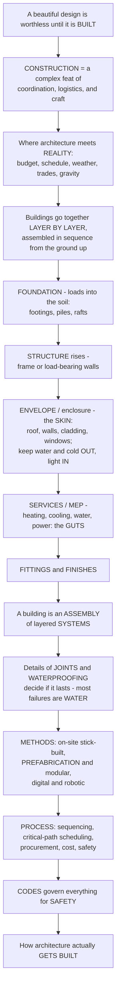

# Construction and Building Technology

> [!abstract] TL;DR
> **A beautiful design is worthless until it is actually BUILT — and turning drawings into a standing building is a staggeringly complex feat of coordination, logistics, and craft called CONSTRUCTION.** This is where architecture meets reality: budgets, schedules, weather, hundreds of workers, dozens of trades, thousands of components, and the unforgiving laws of gravity, all orchestrated to assemble a building safely and correctly. Buildings go together **layer by layer** — from the **foundation** (transferring loads into the soil), up the rising **structure**, out to the **envelope** (the "skin" that keeps water and cold out while letting light in — a surprisingly hard building-physics problem), through the **services/MEP** (the guts: heating, cooling, water, power, data), to the **interior finishes**. A building is therefore an **assembly of layered systems**, and the details of how those layers *join and seal* decide whether it lasts or fails — because **most building failures are about water getting in**. Methods run from traditional on-site "stick-built" work through **prefabrication and modular** construction to **digital and robotic** fabrication; the whole thing is a project-management problem of **sequencing, critical-path scheduling, procurement, cost, and safety**, all governed by **building codes**.

---

## Intuition

**Analogy — the recipe versus the dinner for three hundred, cooked in a storm.** A stunning recipe is not a meal. To turn it into three hundred plated dinners you need a kitchen, a delivery of ingredients timed so nothing spoils, a brigade of cooks each doing one job, the right sequence (you cannot plate before you sear, you cannot sear before the stove is lit), and a head chef watching the clock so everything lands hot at once — and you must do it in a kitchen with no roof while it rains. **Construction is exactly this, scaled to a building.** The architect's drawing is the recipe; the finished building is the banquet; and between them lies a monstrous act of logistics, sequencing, and craft in which hundreds of people, dozens of trades, and thousands of components must arrive in the right order and fit together to the millimetre — outdoors, on a budget, against a deadline, obeying gravity.

Extend the analogy into the discipline and the whole subject appears. A building is not poured in one go; it is **assembled in layers, in sequence, from the ground up**. First the **foundation** carries the building's weight safely down into the soil — footings for firm ground, a raft to spread the load on soft ground, piles driven deep when the surface cannot bear. Then the **structure** rises, the frame or load-bearing walls that hold everything else up. Then the **envelope** — the roof, walls, cladding, and windows — the "skin" that must keep out water, wind, cold, and heat while letting in light and controlling air, which turns out to be one of the hardest problems in the building. Then the **services** (mechanical, electrical, plumbing — the "guts") thread through it. Then the **interior fittings and finishes** make it habitable. Because a building is an **assembly of layered systems**, the make-or-break detail is always the *junction* — where two layers or materials meet, seal, and are jointed. Get the joint wrong and water finds it, and water is the enemy: the overwhelming majority of building failures trace back to moisture getting where it should not. That is why **construction and building technology is the science and craft of assembly** — the discipline of how a design actually becomes a durable, functioning, inhabited building.

---

## How It Works

### Core mechanics

Construction is a machine for **converting a set of drawings into a standing, watertight, serviced building** by assembling layered systems in the right sequence, under management, within the law. The mechanism runs roughly like this:

1. **The gap between design and building.** The architect produces a representation; the *building* is produced by others reading it — and reality intrudes at once in the form of **cost, time, labour, weather, logistics, safety, tolerance, and error**. Construction is where architecture confronts physical and economic reality, and much of the craft is managing the distance between design intent and *buildability*. It is a deeply **collaborative** act: client, architect, structural and services engineers, main contractor, specialist subcontractors and trades, and suppliers must all be coordinated.
2. **The building as layered systems.** A building is composed of interdependent **systems assembled in sequence**: the **substructure** (the **foundations** — footings, rafts, piles, caissons — matched to the soil and the load), the **superstructure** (the **structure** — frame or load-bearing), the **envelope / enclosure** (roof, external walls, **cladding**, **windows/glazing**, insulation — the skin separating and mediating inside and outside), the **services / MEP** (mechanical/HVAC, electrical, plumbing, fire protection, vertical transport), and the **interior** (partitions, finishes, fittings). Stewart Brand's **"shearing layers"** names six that change at different rates — *site, structure, skin, services, space-plan, stuff* — which is why a good building lets the fast layers change without disturbing the slow ones.
3. **The envelope as a building-physics problem.** The **envelope's job** is to keep out water, wind, cold, heat, and noise while admitting light and controlling air. That makes it a **performance** problem governed by **building physics**: heat transfer and insulation (U-values, thermal bridges), **moisture and waterproofing** (vapour, condensation, rain penetration — the number-one cause of building failure), air-tightness, and acoustics. The **detail** and the **junction** — how layers and materials connect, seal, and are jointed — is where buildings succeed or fail.
4. **Construction methods.** Buildings are assembled by **traditional on-site ("stick-built") construction** and its trades (concrete, masonry, carpentry, steel erection); by **prefabrication, off-site and modular construction** (factory-made panels or whole volumetric rooms, then assembled on site — faster, more precise, higher quality); and increasingly by the **digital and robotic frontier** (BIM-coordinated construction, 3D printing, robotic assembly, and **DfMA** — design for manufacture and assembly). All of it rides on **temporary works** — scaffolding, formwork, cranes.
5. **The construction process and management.** Delivery is a project-management discipline: **sequencing and scheduling** (the **critical path**, Gantt charts, phasing), **procurement and contracts** (design-bid-build, design-build), **cost estimating and control** (budget, value engineering), quality and **tolerances**, **safety** (construction is a hazardous industry), site logistics, and the coordination of trades — all under the tension between design intent and buildability/cost.
6. **Codes, standards, and regulation.** **Building codes** govern structure, fire, egress, energy, and **accessibility**; standards and specifications, inspection, and the legal/liability framework enforce safety and performance. Codes are, in effect, **codified lessons from past failures** — every serious clause is usually a memorial to a building that collapsed, burned, or leaked.

### Flow / Architecture



---

## Key Concepts

**Secondary (can explain to a bright 16-year-old):**
- **Buildings go up in layers, in order.** You cannot start in the middle: first the **foundation** in the ground, then the **structure** that holds it up, then the **skin** that keeps the weather out, then the **pipes and wires** inside, then the **finishes** you actually see. Each layer depends on the one before.
- **The skin is harder than it looks.** The outside of a building — roof, walls, windows — has to keep out rain, wind, and cold while still letting in light. Getting a wall to do all of that at once, at every joint, is one of the trickiest parts of building.
- **Water is the enemy.** Most buildings that fail do so because **water got in** where it shouldn't — through a bad joint, a leaky roof, or condensation inside a wall. Keeping water out is job one.
- **Building is a team sport against the clock.** Dozens of trades — concrete workers, carpenters, electricians, plumbers — have to show up in the right order, and one delay can hold up everyone else.

**Undergraduate (needs some background):**
- **Substructure vs. superstructure.** The **substructure** is the **foundation** — footings, rafts, piles, or caissons — sized to the **soil** and the load so the building neither sinks nor tips (the geotechnical problem). The **superstructure** is everything above ground: the **structure**, the **envelope**, and the interior.
- **The envelope and building physics.** The enclosure is a *performance* assembly. **Heat** flows through it in proportion to its **U-value** (lower is better; more insulation = lower U); a **thermal bridge** is a conductive shortcut (a steel stud, a balcony slab) that leaks heat and can chill an interior surface below the **dew point**, causing **condensation**. **Moisture control** — rain screens, flashings, vapour retarders, air barriers — is what separates a wall that lasts from one that rots.
- **The junction is where buildings fail.** Materials expand, move, and age at different rates; the **detail** at every joint must accommodate movement *and* stay sealed. Flashing, sealants, laps, and drainage planes exist entirely to manage water at these junctions.
- **Prefabrication and DfMA.** Moving work **off-site into a factory** buys precision, quality, weather-independence, and speed, and unlocks a **learning-curve** advantage — repeated modules get faster and cheaper per unit. **Design for Manufacture and Assembly (DfMA)** designs the building *to be made and assembled* efficiently, blurring the line between building and manufacturing.
- **The critical path.** A construction programme is a network of activities with durations and dependencies; the **critical path** is the longest dependent chain, and it sets the **minimum project duration**. Activities on it have zero **float** — any slip delays the whole building — while off-path activities can slide within their float.

**Graduate (system-level thinking):**
- **Buildings as loosely-coupled layered systems.** Brand's **shearing layers** reframe a building as subsystems with radically different lifespans (structure ~decades to centuries; services ~7–15 years; space-plan ~3 years; stuff ~months). Good construction *decouples* them so the fast-changing layers can be replaced without demolishing the slow ones — an argument for accessible service voids, demountable partitions, and adaptability as a design value.
- **Hygrothermal design and the physics of the wall.** The envelope is a coupled **heat-and-moisture** transport problem. Steady-state U-value analysis (series thermal resistances) is only the start; real design must locate the **dew point** within the assembly, keep the vapour drive and the drainage plane consistent ("the wall must be able to dry"), and manage air leakage, which moves far more moisture than diffusion. Thermal bridges are analysed with 2-D/3-D heat-flow (psi- and chi-values), not 1-D U-values.
- **Buildability, tolerance, and the design–construction interface.** Every drawing implies a **tolerance stack-up**; components fabricated to different tolerances must still fit at the joint. The tension between design intent and **means-and-methods** (the contractor's domain) is mediated by shop drawings, RFIs, mock-ups, and value engineering — a negotiation in which architectural intent is preserved, degraded, or ingeniously realised.
- **The programme as an optimisation and risk object.** Critical-path method (CPM) exposes the schedule's sensitivity structure; float is *slack to absorb risk*, and compressing the schedule (crashing, fast-tracking, overlapping design and construction) trades cost and risk for time. Procurement choice (design-bid-build vs. design-build vs. construction management) reallocates who owns the coordination risk and the buildability knowledge.
- **Codes as an evolutionary memory.** Building regulation is a **path-dependent, failure-driven** system: fire codes after fires, egress after crowd disasters, structural provisions after collapses, energy codes after the oil shocks. The regulatory envelope is the accumulated, codified memory of how buildings have killed people — which is why it grows and rarely shrinks.

---

## Python Demo

```python
# Construction and building technology, quantified:
#   (a) CRITICAL PATH METHOD (CPM): model the construction PROGRAMME as an activity
#       network, compute the critical path (the chain with zero float that sets the
#       minimum duration) and each activity's float, and draw a Gantt chart.
#   (b) BUILDING ENVELOPE / BUILDING PHYSICS: temperature profile and U-value through
#       a layered wall assembly, showing where a thermal bridge / dew-point risk lies.
#   (c) PREFABRICATION LEARNING CURVE: repeated factory modules get cheaper per unit
#       than one-off site construction - the economics of modular.
# Requires: numpy, matplotlib
import numpy as np
import matplotlib.pyplot as plt

# ============================================================
# (a) CRITICAL PATH METHOD - the construction schedule
#     activity: (duration_days, [predecessors])
# ============================================================
activities = {
    "A Site prep":        (5,  []),
    "B Foundation":       (10, ["A Site prep"]),
    "C Structure":        (20, ["B Foundation"]),
    "D Envelope":         (15, ["C Structure"]),
    "E MEP rough-in":     (12, ["C Structure"]),
    "G Site/landscaping": (8,  ["B Foundation"]),
    "F Finishes":         (10, ["D Envelope", "E MEP rough-in", "G Site/landscaping"]),
}

# Forward pass: earliest start/finish (activities are in topological order)
ES, EF = {}, {}
for name, (dur, preds) in activities.items():
    ES[name] = max([EF[p] for p in preds], default=0)
    EF[name] = ES[name] + dur
project_duration = max(EF.values())

# Backward pass: latest start/finish, and float (slack)
LS, LF = {}, {}
for name in reversed(list(activities)):
    succs = [n for n, (d, preds) in activities.items() if name in preds]
    LF[name] = min([LS[s] for s in succs], default=project_duration)
    LS[name] = LF[name] - activities[name][0]
float_ = {n: LS[n] - ES[n] for n in activities}
critical_path = [n for n in activities if float_[n] == 0]

print(f"Minimum project duration = {project_duration} days")
print("Critical path (zero float):", " -> ".join(critical_path))
for n in activities:
    tag = "CRITICAL" if float_[n] == 0 else f"float {float_[n]}d"
    print(f"  {n:<18} ES={ES[n]:>3}  EF={EF[n]:>3}  ({tag})")

# ============================================================
# (b) BUILDING ENVELOPE - heat flow through a layered wall
#     layers inside -> outside: (name, thickness_m, conductivity_k_W_per_mK)
# ============================================================
layers = [
    ("Gypsum board", 0.013, 0.25),
    ("Insulation",   0.120, 0.035),
    ("Sheathing",    0.012, 0.13),
    ("Air cavity",   0.025, 0.16),
    ("Brick",        0.100, 0.77),
]
Rsi, Rso = 0.13, 0.04                        # interior / exterior surface films (m^2K/W)
R_layers = [t / k for (_, t, k) in layers]
R_total  = Rsi + sum(R_layers) + Rso
U_value  = 1.0 / R_total                     # W/m^2K  (lower = better insulated)

Tin, Tout = 20.0, -5.0                        # interior / exterior AIR temperatures (degC)
dT = Tin - Tout
# temperature at each interface, walking from the interior surface outward
cumR = Rsi
xpos = [0.0]
temp = [Tin - (cumR / R_total) * dT]          # interior SURFACE temperature
for (name, t, k) in layers:
    cumR += t / k
    xpos.append(xpos[-1] + t * 1000.0)        # position in mm
    temp.append(Tin - (cumR / R_total) * dT)
dew_point = 9.3                               # dew point for 20 degC, 50% RH (approx)

# ============================================================
# (c) PREFABRICATION LEARNING CURVE
#     unit cost = C1 * n**b,  b = log2(learning_rate)
# ============================================================
n_units = np.arange(1, 41)
def learning_curve(c1, LR):
    return c1 * n_units ** (np.log(LR) / np.log(2.0))
site_built = learning_curve(1.0, 0.97)        # little learning on a one-off site
modular    = learning_curve(1.0, 0.80)        # strong repetition effect in a factory

# ============================================================
# PLOT
# ============================================================
fig = plt.figure(figsize=(14, 11))
gs = fig.add_gridspec(2, 2, height_ratios=[1.05, 1.0], hspace=0.32, wspace=0.24)

# ---- (a) Gantt chart with critical path highlighted ----
axg = fig.add_subplot(gs[0, :])
names = list(activities)
ypos = np.arange(len(names))[::-1]            # first activity on top
for y, name in zip(ypos, names):
    crit = float_[name] == 0
    axg.barh(y, activities[name][0], left=ES[name], height=0.55,
             color="#d1495b" if crit else "#4c72b0",
             edgecolor="black", zorder=3)
    if float_[name] > 0:                       # draw the float as a light bar
        axg.barh(y, float_[name], left=EF[name], height=0.55,
                 color="#4c72b0", alpha=0.22, hatch="//", edgecolor="none", zorder=2)
    axg.text(ES[name] + activities[name][0] / 2, y, f"{activities[name][0]}d",
             ha="center", va="center", color="white", fontsize=8, weight="bold", zorder=4)
axg.set_yticks(ypos)
axg.set_yticklabels(names, fontsize=9)
axg.set_xlabel("project day")
axg.axvline(project_duration, color="black", ls="--", lw=1)
axg.text(project_duration, len(names) - 0.4, f" min duration = {project_duration}d",
         fontsize=9, va="top")
axg.set_title("(a) Construction programme: the CRITICAL PATH (red = zero float, "
              "hatched = float)\n" + " -> ".join(critical_path), fontsize=10)
axg.grid(axis="x", alpha=0.3)

# ---- (b) Envelope temperature profile ----
axe = fig.add_subplot(gs[1, 0])
axe.plot(xpos, temp, "o-", color="#c44e52", lw=2, zorder=4, label="temperature through wall")
# shade each material layer
x0 = 0.0
palette = ["#f2e8cf", "#a7c957", "#dda15e", "#cfe8ef", "#bc6c25"]
for (name, t, k), col in zip(layers, palette):
    axe.axvspan(x0, x0 + t * 1000.0, color=col, alpha=0.45)
    axe.text(x0 + t * 500.0, -3.4, name, rotation=90, ha="center", va="bottom", fontsize=7)
    x0 += t * 1000.0
axe.axhline(dew_point, color="navy", ls="--", lw=1.4, label=f"dew point ~{dew_point} degC")
axe.text(xpos[-1] * 0.02, dew_point + 0.4, "condensation risk BELOW this line",
         fontsize=7, color="navy")
axe.set_xlabel("position through wall  (mm, inside -> outside)")
axe.set_ylabel("temperature (degC)")
axe.set_title(f"(b) Building envelope: heat flow & U-value\n"
              f"U = {U_value:.2f} W/m2K   (most of the drop is across the insulation)",
              fontsize=10)
axe.legend(fontsize=7, loc="upper right")
axe.grid(alpha=0.3)

# ---- (c) Prefabrication learning curve ----
axp = fig.add_subplot(gs[1, 1])
axp.plot(n_units, site_built, "s-", color="#8c8c8c", ms=3, lw=1.6,
         label="site-built (one-off, LR 0.97)")
axp.plot(n_units, modular, "o-", color="#2a9d8f", ms=3, lw=1.8,
         label="modular / prefab (LR 0.80)")
axp.fill_between(n_units, modular, site_built, where=(site_built > modular),
                 color="#2a9d8f", alpha=0.12)
axp.set_xlabel("module number produced")
axp.set_ylabel("cost / time per unit (normalized)")
axp.set_title("(c) Prefabrication learning curve:\nrepeated factory modules get "
              "cheaper per unit", fontsize=10)
axp.legend(fontsize=7)
axp.grid(alpha=0.3)

plt.savefig("construction_and_building_technology.png", dpi=120, bbox_inches="tight")
plt.show()

# Takeaway:
#  (a) The critical path A -> B -> C -> D -> F fixes the minimum build time; MEP and
#      landscaping carry float, so they can slip a little without delaying handover -
#      which is exactly why construction sequencing is managed around the critical path.
#  (b) The layered wall's U-value is dominated by the insulation, where the temperature
#      plunges; a thermal bridge or a poorly placed layer that pulls a surface below the
#      dew point is where condensation - and eventual failure - begins.
#  (c) Prefabrication turns building into manufacturing: repetition drives a learning
#      curve that site-built one-offs never enjoy - the economic case for modular.
```

Running this prints the schedule (minimum duration and each activity's float) and produces three panels: a **Gantt chart** with the **critical path** in red and non-critical activities showing their **float**; a **layered-wall temperature profile** with the computed **U-value** and a **dew-point line** marking condensation risk (the building-physics of the envelope); and a **learning curve** showing how repeated **prefabricated** modules fall below the cost of one-off site construction.

---

## Real-World Applications

> **Broad Group's B57 tower — prefabrication at its limit.** In 2015 the Chinese firm Broad Group assembled a 57-storey tower in Changsha in **19 days** by stacking factory-built modules at a rate of three storeys a day. Almost all the work — structure, envelope, services, even finishes — was done off-site in a controlled factory and merely *assembled* on the crane's schedule. It is the learning-curve panel of the demo made concrete: turn a building into a repeated manufactured product and you compress its programme dramatically.

> **Grenfell Tower (2017) — the envelope and the junction as life-safety.** The fire that killed 72 people spread through a **cladding** system whose combustible insulation and rainscreen panels, and the detailing of the cavity, turned the envelope into a chimney. It is the darkest lesson of this note: the enclosure is not decoration but a *performance and safety* system, its **details and junctions** are where it lives or dies, and **building codes are codified memory** — the UK regulations were rewritten in its wake.

> **The Empire State Building — sequencing and the critical path.** Built in **410 days** in 1930–31, the tower is a legend of construction management: steel, floors, envelope, and services were choreographed so tightly that the steel frame rose about **four and a half storeys a week**, with materials delivered just-in-time by a railway on each floor. Long before CPM was formalised, it was critical-path thinking in action — the frame was the critical chain, and everything else was sequenced around it.

> **Passive House and hygrothermal design.** Certified **Passivhaus** buildings drive the envelope's **U-value** to roughly 0.15 W/m2K or below, eliminate **thermal bridges**, and achieve near-airtight enclosures with heat-recovery ventilation — the building-physics panel of the demo taken to its logical conclusion. The result is a building heated almost entirely by its occupants, appliances, and the sun.

> **BIM clash detection and DfMA on megaprojects.** On projects like London's Crossrail, a coordinated **BIM** model let mechanical, electrical, structural, and architectural systems be checked for **clashes** (a duct through a beam) *in software*, months before fabrication, and let components be built off-site to **DfMA** principles. Coordination that once happened destructively on site now happens digitally in the model.

---

## Common Pitfalls

- **Designing something that cannot be built (ignoring buildability).** A form that looks effortless in the render may have no sane construction sequence, no craneable pieces, or a junction no trade can actually execute to tolerance. Design intent must be tested against **means-and-methods** early — through shop drawings, mock-ups, and contractor input — or it is renegotiated expensively on site.
- **Treating the envelope as a surface, not a system.** The skin is not a single skin: it is a layered assembly of drainage plane, air barrier, vapour control, insulation, and cladding, each of which must be *continuous* and correctly ordered. A gap in the air barrier or a vapour retarder on the wrong side lets **water** — the primary cause of building failure — into the wall.
- **Forgetting the junction.** Designers detail the middle of a wall and neglect where it meets a window, a roof, a slab, or another material. Movement, thermal bridging, and water ingress all concentrate at these **junctions**; the flashing and the sealant, not the wall field, are where most failures start.
- **Front-loading the critical path, starving the float.** Compressing the schedule by overlapping design and construction (**fast-tracking**) or by running everything in parallel removes the **float** that absorbs risk. When weather, a late delivery, or an RFI hits the critical path with no slack left, the whole project slips.
- **Assuming prefabrication is automatically cheaper.** The **learning curve** only pays off with *repetition and volume*; a one-off bespoke module carries factory setup and transport costs without the repetition benefit, and demands the design be frozen early (DfMA) — the opposite of the iterative design loop. Modular wins on *repeated* units, not on every project.
- **Coordinating MEP last.** Squeezing mechanical, electrical, and plumbing into whatever space the structure and finishes left over guarantees clashes, exposed ducts, and lost ceiling height. Services must be **coordinated with structure from the start** (ideally in BIM), because the "guts" need routes, access, and voids designed *for* them.

---

## Related Concepts

*This note sits in the Architecture vault's S03 (Structure, Materials and Construction). Its sibling notes — **Architecture Overview and the Art of Building** (what architecture is), **Structure and Architectural Form** (the frame and load-bearing systems that rise on the foundation), **Materials and Tectonics in Architecture** (the materials and the art of the joint), **Building Systems and Environmental Control** (the MEP "guts" and comfort), **BIM, Digital Fabrication and Smart Buildings** (the digital and robotic construction frontier), and **Codes, Accessibility and the Ethics of Building** (the regulatory envelope) — expand the themes introduced here and are referenced in prose. The cross-vault links below are Glob-verified to exist.*

- [[Construction_Engineering_and_Management]] — Civil Engineering's view of construction as *delivery*: means-and-methods, site logistics, safety, and putting the building up.
- [[Project_Planning_and_Scheduling]] — the CPM, Gantt, and float machinery of the construction programme; the critical-path engine modelled in this note's demo.
- [[Foundation_Engineering]] — the substructure: designing footings, rafts, piles, and caissons to carry the building's loads safely into the ground.
- [[Soil_Mechanics_Fundamentals]] — why the foundation type is *matched to the soil*: bearing capacity, settlement, and the ground the whole building stands on.
- [[Construction_Materials_and_Quality]] — concrete, steel, and masonry on site, with the quality control and tolerances that make an assembly buildable.
- [[Civil_Engineering_Overview]] — the sister engineering discipline; construction is where architecture and structural/civil engineering meet on the site.
- [[Delivery_and_Execution]] — the software-engineering analogue of the construction programme: sequencing dependencies and shipping a complex project on schedule.
- [[Corrosion_and_Electrochemical_Degradation]] — the materials-science of durability failure (rebar corrosion, moisture-driven decay) behind the rule that "most building failures are water."

---

## Review Questions

**Secondary:**
1. Buildings are put together in a fixed order — foundation, structure, envelope, services, finishes. Pick two of these layers and explain why you cannot build the second one before the first. Then explain, in your own words, why builders say "water is the enemy" and where in a wall water is most likely to get in.

**Undergraduate:**
2. A building's exterior wall must keep out rain and cold while letting in light. Using the ideas of **U-value**, **thermal bridge**, and **dew point**, explain what makes a wall a good *thermal and moisture* barrier, and why a single conductive shortcut (say a steel stud or a balcony slab) can cause condensation inside an otherwise well-insulated wall. Why is the **junction**, not the middle of the wall, where most envelope failures begin?

**Graduate:**
3. A developer wants to shorten a 12-month build to 8 months. Compare two strategies: (i) **fast-tracking** — overlapping design and construction and compressing the **critical path**, and (ii) **modular prefabrication** — building volumetric units off-site in parallel with foundation work. Using the concepts of **float**, the **learning curve**, **DfMA**, and **buildability**, analyse what each strategy trades away (risk, cost, design flexibility) and under what project conditions — one-off signature building vs. a repetitive hotel or housing block — you would choose each.

---

## Sources

- Edward Allen & Joseph Iano, *Fundamentals of Building Construction: Materials and Methods* (Wiley) — the standard textbook on how buildings are assembled — [Publisher page](https://www.wiley.com/en-us/Fundamentals+of+Building+Construction%3A+Materials+and+Methods%2C+7th+Edition-p-9781119446194)
- Francis D. K. Ching, *Building Construction Illustrated* (Wiley) — the illustrated grammar of foundations, structure, envelope, and finishes — [Publisher page](https://www.wiley.com/en-us/Building+Construction+Illustrated%2C+6th+Edition-p-9781119583080)
- Stewart Brand, *How Buildings Learn: What Happens After They're Built* (Viking, 1994) — the "shearing layers" model of a building as systems that change at different rates — [Internet Archive](https://archive.org/details/howbuildingslear0000bran)
- Andrea Deplazes (ed.), *Constructing Architecture: Materials, Processes, Structures* (Birkhäuser) — construction as the union of material, process, and structure — [Publisher page](https://www.degruyter.com/document/doi/10.1515/9783035620108/html)
- Grenfell Tower Inquiry, *Phase 2 Report* (2024) — how envelope/cladding detailing and regulation failed, and why codes are codified lessons from failure — [Official report](https://www.grenfelltowerinquiry.org.uk/phase-2-report)

---

#architecture #construction #building-technology #building-envelope #prefabrication
