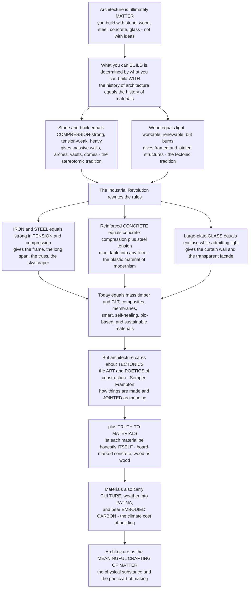

# 🧱 Materials and Tectonics in Architecture

> [!abstract] TL;DR
> Architecture is inescapably **matter**: you cannot build with pure ideas, only with **stone, wood, brick, steel, concrete, and glass**, and each material has its own nature — its possibilities, its limits, its beauty. So the history of architecture is inseparable from the history of **materials**: *what you can build is determined by what you can build with.* Stone and brick (strong in **compression**, heavy) gave us the massive, earthbound world of walls, arches, and domes; **wood** (light, workable, but combustible) gave us framed and jointed construction worldwide. Then the Industrial Revolution delivered three transformative materials — **iron and steel** (strong in *both* tension and compression → the structural frame, the long span, the skyscraper), **reinforced concrete** (the genius marriage of concrete's compression with embedded steel's tension → mouldable into any form, the defining material of modernism), and large-plate **glass** (enclosing while admitting light → the curtain wall). Today the palette expands again into **mass timber (CLT), composites, and smart/sustainable materials.** But architecture cares about more than a material's engineering numbers: it cares about **tectonics** — the *art and poetics of construction*, the idea that *how* a building is made and jointed is itself a source of meaning (Semper, Frampton). Its ethical-aesthetic core is **"truth to materials"** — letting each material be honestly itself rather than faking or hiding it. Materials also carry **cultural meaning**, **weather into patina**, and bear enormous **environmental consequence** (embodied carbon). Materials and tectonics reveal architecture as the **meaningful crafting of matter**.

---

## Intuition

**Analogy — a sculptor cannot carve marble the way a carpenter joins oak, and neither can be built from an idea alone.** Give an architect a pure concept — "a soaring, weightless hall" — and nothing exists yet. The concept becomes architecture only when it is made *out of something*: piled stone, jointed timber, poured concrete, bolted steel, sheeted glass. And the moment you choose the stuff, the stuff pushes back. Stone will carry a mountain of weight pressing *down* on it but shears and cracks the instant you try to *stretch* it, so stone "wants" to be an arch, a wall, a dome — compression forms that stay earthbound and massive. Timber is light and endlessly workable and spans a room, but it burns and rots and can only reach so far, so it "wants" to be a frame of posts and beams, cut and pegged and joined. You are never designing in the abstract; you are always in a *negotiation with matter*, and each material offers a different bargain of strength, weight, cost, span, and beauty. That is the first, unavoidable truth: **architecture is matter, and every material has a nature.**

That is why the whole history of building tracks the history of **materials technology** — *what you can build is set by what you can build with.* For millennia the palette was fixed (stone, brick, wood, earth), so the great forms were the compression forms those materials allow: the Roman vault, the Gothic buttress, the earthen wall. Then, in barely a century, the Industrial Revolution rewrote the rules. **Iron and steel** could take tension *and* compression, so a building no longer needed thick load-bearing walls — it could stand on a slender **frame** and rise into a **skyscraper**. **Reinforced concrete** put steel rods where a beam is stretched and concrete where it is squeezed, fusing two materials into one that could be *poured into any shape* — the plastic, sculptural material Le Corbusier and Nervi used to define modernism. **Large-plate glass** let a wall both enclose and vanish, giving the **glass curtain wall**. Suddenly forms that were literally impossible became routine. Today the frontier moves again: **mass timber** lets us build tall in a material that *stores* carbon, while composites and smart, self-healing, bio-based materials promise a further revolution.

But here is the turn that makes this an *architectural* subject and not merely an engineering one. Architecture cares about far more than a material's stress numbers; it cares about **tectonics** — the **art and poetics of construction**. Tectonics is the deep idea that *how* a building is put together — how a beam meets a column, how two materials are jointed, how a wall is layered and revealed — is itself a **source of architectural meaning and beauty**. Gottfried Semper first theorised it; Kenneth Frampton, in *Studies in Tectonic Culture*, called it the *"poetics of construction."* The **joint**, the **detail**, the honest expression of load — these are where architecture speaks. Bound up with tectonics is a moral-aesthetic principle: **"truth to materials"** — letting each material be *authentically itself* (raw concrete showing its board-marks and texture, wood looking like wood, steel expressing the tension it carries, brick allowed, as Louis Kahn put it, to *"want to be an arch"*) rather than plastering, faking, or disguising it. And materials do more than stand up: they carry **cultural meaning** (marble reads as luxury, exposed concrete as brutalist gravitas, glass as corporate transparency), they **age and weather** into **patina** (materials that grow more beautiful with time versus those that just decay), and they carry vast **environmental consequence** — the **embodied carbon** locked into cement and steel is one of the largest climate impacts of the built environment. To understand materials and tectonics, then, is to understand architecture as the **meaningful crafting of matter**: the physical substance *and* the poetic art of making that together turn material into architecture.

---

## How It Works

### Core mechanics

1. **Architecture is material before it is anything else.** A design is realised only in physical substance, and every substance has a *structural nature* — chiefly, how it behaves in **compression** (being squeezed) versus **tension** (being stretched). This single distinction organises the whole story. Masonry (stone, brick, concrete) is *strong in compression, weak in tension*; steel is *strong in both*; timber is *good in both relative to its light weight.* Form follows from that nature.
2. **The traditional palette and its compression forms.** With stone, brick, and earth — heavy, durable, compression-strong, tension-weak — you build **massive**: thick walls, and to span space you must use the **arch, vault, and dome**, geometries that turn a roof's load into pure compression pushing down the curve (and outward as thrust). This is the *stereotomic* tradition — architecture of **mass**, carved and piled, earthbound and monumental (classical temples, Roman baths, medieval cathedrals). **Wood** offers the opposite bargain: light, renewable, easily cut and jointed, with a good strength-to-weight ratio, but combustible and limited in span — so timber cultures build the **frame**, a lattice of posts and beams joined at the connections (East Asian bracket systems, European half-timbering, vernacular framing worldwide). This is the *tectonic* tradition — architecture of the **lightweight, jointed frame.**
3. **The modern materials revolution — three new natures.** Industrialisation supplied materials that broke the old compression-only limit:
   - **Iron then steel** — strong in **tension and compression**, manufactured to precise sizes. This enables the **structural frame** (load carried on a slender skeleton, not walls), the **truss**, the **long span**, and — with the safety elevator — the **skyscraper**. The wall is freed from load-bearing duty and can become a thin **curtain**.
   - **Reinforced concrete** — the **synergy**: concrete is cheap, mouldable, fireproof, and superb in compression but weak and brittle in tension, so **steel reinforcing bars (rebar)** are cast into exactly the regions where the member is stretched. The steel carries tension, the concrete carries compression and protects the steel, and the two — with nearly identical thermal expansion — act as one composite material that can be **poured into any form**, span, and **cantilever**. Prestressing goes further, squeezing the concrete in advance so it never cracks. This is the defining *plastic* material of modernism (Le Corbusier's *béton brut*, Nervi's soaring shells).
   - **Large-plate glass** — mass-produced flat glass makes it possible to **enclose while admitting light**, dissolving the wall into the **glass curtain wall** and the transparent facade.
4. **Tectonics — from carrying load to carrying meaning.** Engineering asks *will it stand?*; tectonics asks *what does the way it stands mean?* Tectonics is the **expressive, poetic dimension of construction** — the deliberate treatment of **how a building is assembled and jointed** as a bearer of architectural meaning. The **joint** and the **detail** (how a beam lands on a column, the *reveal* or shadow-gap where materials meet, the layering of a wall) become the locus of value. Frampton distinguishes the **tectonic** (the *frame* — lightweight, jointed, articulated) from the **stereotomic** (the *earthwork* — mass, carved, compressive), and argues that resisting the flatness of pure image with an authentic *culture of building* is architecture's ethical ground.
5. **"Truth to materials" and material expression.** The principle that each material should be allowed to be **honestly itself** — exploited according to its real nature and shown, not faked. Ruskin and the Arts and Crafts movement gave it a moral charge; modernists made it a creed (exposed structure, *béton brut*); Louis Kahn dramatised it — *"you say to brick, 'What do you want, brick?' Brick says, 'I like an arch.'"* Beyond honesty, materials have **phenomenal** qualities — texture, colour, weight, temperature, sound, the way they catch **light** — that Pallasmaa and Zumthor treat as the true medium of architectural *atmosphere*.
6. **Ageing, meaning, and carbon.** Materials **weather**: some acquire a beautiful **patina** (weathering steel, lead, oak, stone), others simply stain and decay — a real design variable. Materials carry **cultural and symbolic meaning** independent of performance. And they carry **environmental cost**: **embodied carbon**, the CO₂ emitted to extract, manufacture, and transport them. Cement (concrete's binder) alone is responsible for roughly **8% of global CO₂ emissions**, and steel adds several more — so material *selection* is one of architecture's largest levers on the climate, and the rise of low-carbon **mass timber** is a direct response.

### Flow / architecture



---

## Key Concepts

### 🟢 Secondary — the material palette
- **Architecture is made of stuff.** You cannot build with ideas — only with real materials, and each one behaves differently. The most basic difference: some materials are good at being **squeezed** (compression) and some are good at being **stretched** (tension).
- **The old materials.** **Stone and brick** are strong, heavy, and last forever, but they can only be *squeezed*, not stretched — so they make thick walls, and to cross a space they use **arches and domes**. **Wood** is light and easy to cut and join, and it spans small rooms, but it can **burn** — so it makes **frames** of posts and beams.
- **The new materials that changed everything.** **Steel** is strong in *both* squeezing and stretching, so buildings could stand on a thin **skeleton (frame)** and grow into **skyscrapers**. **Reinforced concrete** mixes concrete (great at squeezing) with steel bars (great at stretching), so it can be **poured into any shape**. **Glass** lets a wall be a window — the **glass wall**.
- **Tectonics = the art of how things are made.** Architecture cares not only that a building stands, but about *how* it is put together — how a beam meets a column, how a joint is made — because that can be **beautiful and meaningful.**
- **"Truth to materials."** Let each material *look like what it really is*: let wood look like wood and concrete look like concrete, instead of painting or hiding it to fake something else.

### 🟡 Undergraduate — properties, the modern revolution, and tectonic theory
- **Structural nature drives form.** **Masonry** (stone, brick, concrete): high **compressive** strength, very low **tensile** strength (concrete's tension ≈ 10% of its compression), heavy, durable → arches, vaults, mass walls. **Steel**: high strength in *both* tension and compression, high stiffness, ductile → frames, trusses, long spans, but corrodes and loses strength in fire. **Timber**: excellent strength-to-**weight**, workable, renewable → frames and joinery, but anisotropic (strong along the grain), combustible, moisture-sensitive.
- **The reinforced-concrete synergy.** Plain concrete cracks in tension at a low **modulus of rupture**; a beam therefore fails suddenly at the bottom (tension) face. Casting **rebar** into the tension zone lets steel carry that tension while concrete carries compression, multiplying the beam's moment capacity many-fold and giving *ductile*, warned failure. Nearly matched thermal expansion coefficients and concrete's alkalinity (which passivates the steel against corrosion) make the partnership durable. **Prestressing** pre-compresses the concrete so it stays in compression under service load and never cracks.
- **The frame and the curtain wall.** Steel (and reinforced-concrete) framing separates **structure** from **enclosure**: loads run down a skeleton, so the exterior wall carries only itself and can become a thin, light **curtain wall** of glass and cladding. This is the technical basis of the modern skyscraper and the glass tower.
- **Semper's four elements.** Gottfried Semper (1851) rooted architecture in **making**, distinguishing the **earthwork** (mound/platform, mass), the **hearth** (the social core), the **framework/roof** (the light structure), and the **enclosing membrane** (the woven wall, originally textile) — grounding architectural form in *craft and material process*, the seed of tectonic theory.
- **The stereotomic and the tectonic.** Two poles of construction: the **stereotomic** — architecture of **compressive mass**, carved or piled (the wall, the earthwork, load-bearing masonry); and the **tectonic** — architecture of the **lightweight, jointed frame** (the column-and-beam, the truss). Most buildings mix them (a heavy base, a light top). This pairing organises much of Frampton's analysis.
- **Contemporary palette.** **Mass/engineered timber** — **glulam** (glued laminated beams) and **CLT** (cross-laminated timber panels) — makes timber high-rises possible while *storing* biogenic carbon. **High-performance concrete and steel**, **aluminium**, **FRP composites**, tensile **membranes and ETFE** (for shells and lightweight roofs), **smart/high-performance glass**, and **self-healing, bio-based, and recycled materials** extend what is buildable.

### 🔴 Graduate — the poetics of construction and the ethics of matter
- **Frampton's tectonic culture.** In *Studies in Tectonic Culture* (1995), Kenneth Frampton argues against architecture-as-scenography (the building reduced to a flat image or "decorated shed") and for a **"poetics of construction"**: meaning arising from the *ontology of building* — the honest articulation of structure, load, and the **joint**. The **joint** is, for Frampton (after Marco Frascari's "the tell-tale detail"), *"the fundamental nexus around which building comes into being"* — the detail is where a building is *narrated*. Tectonics resists the placelessness of pure image by insisting on a **culture of making** tied to structure, gravity, and site.
- **Semper versus Laugier — dressing versus frame.** A foundational tension: the Enlightenment **"primitive hut"** (Laugier) makes the load-bearing **frame** the origin and essence of architecture, while **Semper's** *Bekleidung* (dressing/cladding) theory makes the **enclosing surface** — originally the woven textile wall — primary, with structure serving the *space-making membrane*. The whole modern debate about structure-as-expression versus surface-as-expression descends from this split.
- **"Truth to materials" as contested doctrine.** From Ruskin's *Seven Lamps* (the "Lamp of Truth" condemning material deceit) through the Arts and Crafts movement to modernist *béton brut*, material honesty is treated as an *ethic*. But it is also a **rhetorical stance dressed as truth**: exposed structure and "honest" concrete are aesthetic *choices*, and a material can be "expressed" in ways that are themselves illusions (Mies's non-structural I-beam mullions "express" a frame they do not constitute). Honesty to materials is a value, not a neutral fact.
- **Phenomenology and atmosphere.** Juhani **Pallasmaa** (*The Eyes of the Skin*) and Peter **Zumthor** (*Atmospheres*, *Thinking Architecture*) shift attention from material *performance* to material *presence*: the weight, temperature, grain, acoustic softness, and **light-reflectance** of surfaces as the medium of embodied, multisensory experience. Materials are designed as **atmospheres**, and their **ageing and patina** — how oak silvers, copper greens, concrete stains — are part of the design, not its failure. This connects material choice to the wider question of architectural **phenomenology** and light.
- **The material basis of style-history.** Read structurally, whole periods are *material* revolutions: the Gothic dissolution of the wall is a masonry-and-glass achievement; the Crystal Palace (1851) and the Eiffel Tower are iron-and-glass demonstrations; the Modern Movement is unthinkable without reinforced concrete, steel, and plate glass; Brutalism *is* an aesthetic of exposed concrete. What architects could imagine was disciplined by what industry could produce.
- **Embodied carbon and material responsibility.** With operational energy falling as buildings get efficient, **embodied carbon** — emissions locked into materials at manufacture — becomes the dominant lifetime impact, and it is dominated by **cement and steel** (cement ≈ 8% of global CO₂). The response reframes material selection as an *ethical* act: **low-carbon and reuse-friendly** structural systems, **circular-economy** detailing (design for disassembly), **local and renewable** materials, and **carbon-storing mass timber**. Tectonics and sustainability converge: honest, well-jointed, demountable construction is *also* low-carbon construction.

---

## Python Demo

```python
# Materials and Tectonics in Architecture -- four quantitative views:
#   (A) ASHBY-STYLE selection chart: strength vs density (log-log) for common
#       building materials, with strength-to-weight guide lines -> "the right
#       material for the job".
#   (B) TENSION vs COMPRESSION strength: masonry clusters high-compression /
#       low-tension (arches & mass); steel is strong in BOTH (frames & spans);
#       timber has good strength for its weight.
#   (C) EMBODIED CARBON per kg: why material choice dominates a building's
#       climate impact, and why carbon-storing mass timber is rising.
#   (D) REINFORCED-CONCRETE SYNERGY: a plain concrete beam fails in tension at
#       a tiny moment; adding steel rebar multiplies capacity dramatically.
import numpy as np
import matplotlib.pyplot as plt

# --- representative properties (order-of-magnitude, for teaching) ------------
#            name          rho(kg/m3)  strength(MPa)  tension(MPa) comp(MPa)  co2(kgCO2e/kg)
materials = [
    ("Stone/Granite",       2650,        130,           10,          130,      0.06),
    ("Brick",               1900,         30,            3,           30,       0.24),
    ("Concrete",            2400,         40,            4,           40,       0.13),
    ("Timber (softwood)",    500,         45,            90,          40,      -0.45),  # net C storage
    ("Mass timber (CLT)",    480,         50,            95,          45,      -0.40),
    ("Structural steel",    7850,        355,           400,         355,      1.55),
    ("Aluminium",           2700,        250,           250,         250,      8.20),
    ("Glass",               2500,         50,            50,          500,      0.85),
]
names = [m[0] for m in materials]
rho   = np.array([m[1] for m in materials], float)
stren = np.array([m[2] for m in materials], float)
tens  = np.array([m[3] for m in materials], float)
comp  = np.array([m[4] for m in materials], float)
co2   = np.array([m[5] for m in materials], float)

fig, ax = plt.subplots(2, 2, figsize=(14, 11))

# ---------- (A) Ashby chart: strength vs density (log-log) -------------------
axA = ax[0, 0]
axA.scatter(rho, stren, s=140, c=np.arange(len(names)), cmap="tab10", zorder=5,
            edgecolor="black")
for n, x, y in zip(names, rho, stren):
    axA.annotate(n, (x, y), fontsize=8, xytext=(5, 4), textcoords="offset points")
# strength-to-weight guide lines (strength / density = const)
xline = np.array([300, 9000])
for c, lab in [(0.02, "low  s/rho"), (0.1, "high s/rho")]:
    axA.plot(xline, c * xline, ls="--", color="gray", lw=1)
    axA.text(xline[1]*0.55, c*xline[1]*0.55, lab, color="gray", fontsize=8, rotation=18)
axA.set_xscale("log"); axA.set_yscale("log")
axA.set_xlabel("density  rho  [kg/m^3]"); axA.set_ylabel("strength  [MPa]")
axA.set_title("(A) Ashby chart: strength vs density\nguide lines = strength-to-weight ratio")
axA.grid(which="both", alpha=0.25)

# ---------- (B) tension vs compression strength -----------------------------
axB = ax[0, 1]
axB.scatter(comp, tens, s=140, c=np.arange(len(names)), cmap="tab10", zorder=5,
            edgecolor="black")
for n, x, y in zip(names, comp, tens):
    axB.annotate(n, (x, y), fontsize=8, xytext=(5, 4), textcoords="offset points")
lim = max(comp.max(), tens.max()) * 1.1
axB.plot([0, lim], [0, lim], ls=":", color="k", lw=1)
axB.text(lim*0.62, lim*0.66, "equal in\ntension & compression", fontsize=8, rotation=45)
axB.axhspan(0, 15, xmax=1, color="#e76f51", alpha=0.08)
axB.text(lim*0.45, 5, "masonry zone: strong squeeze, weak stretch  ->  ARCHES & MASS",
         fontsize=8, color="#b5341b")
axB.set_xlabel("compressive strength  [MPa]"); axB.set_ylabel("tensile strength  [MPa]")
axB.set_title("(B) Tension vs compression\nmasonry cluster low-tension; steel strong in BOTH")
axB.set_xlim(0, lim); axB.set_ylim(0, lim); axB.grid(alpha=0.25)

# ---------- (C) embodied carbon per kg --------------------------------------
axC = ax[1, 0]
order = np.argsort(co2)
colors = ["#2a9d8f" if c < 0 else ("#e9c46a" if c < 1 else "#e76f51") for c in co2[order]]
axC.barh(np.array(names)[order], co2[order], color=colors, edgecolor="black")
axC.axvline(0, color="k", lw=1)
for i, (nm, c) in enumerate(zip(np.array(names)[order], co2[order])):
    axC.text(c + (0.15 if c >= 0 else -0.15), i, f"{c:+.2f}",
             va="center", ha="left" if c >= 0 else "right", fontsize=8, weight="bold")
axC.set_xlabel("embodied carbon  [kg CO2e per kg]")
axC.set_title("(C) Embodied carbon by material\nmass timber STORES carbon; aluminium & steel are costly")
axC.grid(axis="x", alpha=0.25)

# ---------- (D) reinforced-concrete synergy: plain vs reinforced beam --------
# Rectangular section: b=300 mm, h=550 mm, cover to steel gives d=500 mm.
b, h, d = 300.0, 550.0, 500.0          # mm
fc = 30.0                              # concrete compressive strength, MPa
fr = 0.62 * np.sqrt(fc)                # modulus of rupture (ACI), MPa
I  = b * h**3 / 12.0                   # gross moment of inertia, mm^4
y  = h / 2.0                           # extreme fibre, mm
M_plain = fr * I / y                   # cracking moment (plain concrete fails here), N*mm

fy = 420.0                             # rebar yield strength, MPa
As = 3 * (np.pi/4) * 20.0**2           # 3 bars of 20 mm diameter, mm^2
a  = As * fy / (0.85 * fc * b)         # depth of equivalent stress block, mm
M_rc = As * fy * (d - a/2.0)           # nominal flexural capacity (steel yields), N*mm

M_plain_kNm = M_plain / 1e6            # -> kN*m
M_rc_kNm    = M_rc / 1e6
ratio = M_rc_kNm / M_plain_kNm

axD = ax[1, 1]
bars = axD.bar(["Plain concrete\n(fails in tension)", "Reinforced concrete\n(rebar carries tension)"],
               [M_plain_kNm, M_rc_kNm], color=["#c1121f", "#1d3557"], edgecolor="black")
for bar, val in zip(bars, [M_plain_kNm, M_rc_kNm]):
    axD.text(bar.get_x() + bar.get_width()/2, val + 2, f"{val:.1f} kN*m",
             ha="center", fontsize=10, weight="bold")
axD.set_ylabel("bending moment capacity  [kN*m]")
axD.set_title(f"(D) The reinforced-concrete synergy\nrebar multiplies capacity ~{ratio:.0f}x")
axD.grid(axis="y", alpha=0.25)

plt.tight_layout()
plt.savefig("materials_and_tectonics.png", dpi=120)
plt.show()

# ---- console summary ----
print("ASHBY / selection:")
print("  masonry (stone, brick, concrete): high compression, LOW tension -> arches, vaults, mass")
print("  steel: high in BOTH tension & compression -> frames, trusses, long spans, skyscrapers")
print("  timber: best strength-to-WEIGHT -> light frames, and it STORES carbon")
print()
print(f"Reinforced-concrete synergy (b={b:.0f} mm, h={h:.0f} mm, fc'={fc:.0f} MPa):")
print(f"  plain concrete cracking moment  M = {M_plain_kNm:6.1f} kN*m")
print(f"  reinforced (3-#20, fy={fy:.0f})     M = {M_rc_kNm:6.1f} kN*m")
print(f"  => rebar multiplies capacity by ~{ratio:.0f}x  (this is why RC revolutionised building)")
```

The four panels make the argument concrete. **(A)** The **Ashby chart** places each material in a *property space* of strength versus density: steel sits high (strong but heavy), timber and mass timber sit at excellent **strength-to-weight**, and masonry clusters low-and-heavy — visualising *"the right material for the job."* **(B)** Plotting **tension against compression** exposes the deep divide: stone, brick, and concrete huddle in the low-tension band (strong squeezed, weak stretched → *arches and mass*), while **steel** rides the diagonal, strong in *both* → the frame and the long span. **(C)** **Embodied carbon** per kilogram shows why material choice dominates climate impact: aluminium and virgin steel are carbon-expensive, concrete is modest per-kg but is used in vast tonnage, and **mass timber is net-negative** (carbon storage) — the engine behind the timber-high-rise movement. **(D)** The **reinforced-concrete synergy**: a plain concrete beam cracks and fails at a tiny moment, but casting steel rebar into the tension zone multiplies its capacity roughly *tenfold or more* — quantifying exactly why the concrete-plus-steel marriage revolutionised what could be built.

---

## Real-World Applications

> **Unité d'Habitation, Marseille (Le Corbusier, 1952) — béton brut and truth to materials.** Le Corbusier left the reinforced concrete **raw**, board-marked, its formwork grain and imperfections on show — *"béton brut"* ("raw concrete"), which gave **Brutalism** its name. It is a manifesto of material honesty: the structural material is not clad, painted, or faked but allowed to be exactly, texturally itself.

- **Nervi's structural shells (Palazzetto dello Sport, Rome, 1957)** — Pier Luigi Nervi exploited reinforced concrete's *plasticity* to pour thin, ribbed, doubly-curved shells whose visible rib pattern *is* the load path made beautiful: engineering and tectonic expression fused, the material shaped to follow the forces.
- **The Crystal Palace (1851) and the Eiffel Tower (1889)** — the great early demonstrations of the **iron-and-glass** revolution: prefabricated iron members and mass-produced plate glass enclosing vast, luminous space, proving that the new industrial materials could make forms impossible in stone.
- **Seagram Building / glass curtain wall (Mies van der Rohe, 1958)** — the **steel frame plus glass curtain wall** perfected: structure on a slender skeleton, the exterior reduced to a taut, non-load-bearing membrane of glass and bronze — the template for the corporate glass tower.
- **Mjøstårnet and Ascent (mass-timber high-rises, 2019–2022)** — 18–25 storey towers in **glulam and CLT**, demonstrating that engineered timber can go tall while *storing* biogenic carbon, the leading edge of low-embodied-carbon structural design.
- **Thermal Baths, Vals (Peter Zumthor, 1996)** — stacked local **Valser quartzite** designed as a total sensory *atmosphere*: the weight, texture, temperature, sound, and light-play of stone as the actual medium — architecture as material phenomenology rather than shape.
- **Weathering-steel and copper facades (e.g. Corten cladding, patinated roofs)** — materials chosen precisely *because* they age well: Corten forms a stable rust patina, copper greens, lead and oak silver — designing with **weathering and patina** as a feature, not a defect.

---

## Common Pitfalls

- **Treating materials as neutral, interchangeable "fill."** Each material has a *structural nature* (compression versus tension), a workability, a cost, an appearance, and a carbon cost. Choosing the wrong one — stone in tension, timber for a giant clear span, concrete where lightness is needed — fights the material instead of exploiting it.
- **Confusing tectonics with mere structure (or mere decoration).** Tectonics is neither raw engineering nor applied ornament: it is the *expressive articulation* of how a building is made and jointed. Ignoring it yields buildings that stand but say nothing; faking it (fake joints, applied "structure") betrays it.
- **Mistaking "truth to materials" for an objective fact rather than a value.** Exposed concrete and expressed frames are aesthetic *choices* arguing an ethic; a material can be "honestly expressed" in ways that are themselves illusions (non-structural mullions "expressing" a frame). Honesty is a stance, not a proof.
- **Forgetting that reinforced concrete is a *partnership* that can fail.** The concrete-steel synergy depends on the concrete's alkalinity protecting the rebar and on matched thermal expansion. Once carbonation or chloride ingress lets the **rebar corrode**, it expands and spalls the concrete — the defining durability failure of 20th-century concrete. The "miracle material" needs cover, quality, and maintenance.
- **Ignoring embodied carbon while chasing operational efficiency.** A super-insulated building framed in carbon-intensive concrete and steel can emit more over its life than a slightly less efficient timber building. Material *selection* — not just energy performance — is a first-order climate decision.
- **Designing for the day it is built, not for how it ages.** Materials weather. Some gain a beautiful **patina**; others streak, stain, corrode, and rot. Failing to detail for water, weathering, and ageing turns intended honesty into premature decay.
- **Anisotropy and fire blind spots with timber.** Wood is strong *along* the grain and much weaker across it, and it burns — mass timber mitigates but does not erase these facts. Detailing timber as if it were isotropic or fireproof invites failure.

---

## Related Concepts

*Sibling notes in this Architecture vault (Section 03 and beyond), referenced here in prose: **Architecture_Overview_and_the_Art_of_Building** (the vault hub — materials and tectonics as one pillar of the art of building), **Structure_and_Architectural_Form** (how load paths and material nature generate form — the structural partner to this material one), **Construction_and_Building_Technology** (how these materials are actually assembled on site — the "making" that tectonics reflects on), **Form_Function_and_Ornament** (where "truth to materials" and structure-as-ornament intersect the ornament debate), **Sustainable_and_Green_Architecture** (the embodied-carbon and material-lifecycle argument developed fully), and **Light_Color_and_Atmosphere** (the phenomenal, sensory dimension of materials — texture, weight, and how they hold light). These interlink once complete.*

Cross-vault connections (verified to exist):

- [[Stress_Strain_and_Elastic_Moduli]] — the materials-science foundation for *compression versus tension*, stiffness, and strength that underlies every architectural material choice.
- [[Reinforced_Concrete_Design]] — the engineering account of the concrete-plus-steel synergy this note treats as an architectural revolution (the moment-capacity calculation in the demo).
- [[Concrete_Technology_and_Cement]] — how cement and concrete are actually made (and why cement carries such heavy embodied carbon).
- [[Structural_Steel_Design]] — the engineering of the steel frame that freed the wall from load-bearing and made the skyscraper and curtain wall possible.
- [[Timber_Masonry_and_Composite_Structures]] — the mechanics of timber and masonry — the traditional palette and its modern engineered forms (glulam, CLT).
- [[Sustainable_Materials_and_Circular_Economy]] — embodied carbon, material lifecycle, reuse, and the circular economy that make material selection an environmental act.
- [[Texture_Pattern_and_Materiality]] — the art-and-aesthetics companion: **materiality**, texture, and surface as expressive content, the phenomenal side of tectonics.
- [[Architecture_and_the_Built_Environment]] — the Art & Aesthetics overview of architecture as an art form, into which materials and tectonics feed.

---

## Review Questions

**🟢 Secondary**
1. Why can stone and brick be used for arches and thick walls but *not* stretched across a big gap like a rope? Using that difference, explain why steel let builders make skyscrapers.
2. What does "truth to materials" mean, and what is one example of letting a material "be itself" instead of hiding it?

**🟡 Undergraduate**
3. Explain the **reinforced-concrete synergy**: which material carries tension, which carries compression, and why the two work as a durable single material. What happens to the partnership when the rebar corrodes?
4. Distinguish the **stereotomic** from the **tectonic**, giving a material and a building type for each. Why does timber tend toward the tectonic and stone toward the stereotomic?

**🔴 Graduate**
5. Kenneth Frampton calls the **joint** *"the fundamental nexus around which building comes into being"* and argues for a "poetics of construction." Argue for or against the claim that *how* a building is jointed is a genuine source of architectural *meaning*, not merely a technical necessity.
6. "Truth to materials" is often presented as an ethic. Using the example of exposed concrete or non-structural expressed frames, argue whether material honesty is an objective truth or an aesthetic stance dressed as one — and connect your answer to why **embodied carbon** now reframes material selection as a *different* kind of ethical choice.

---

## Sources

- Kenneth Frampton, [*Studies in Tectonic Culture: The Poetics of Construction in Nineteenth and Twentieth Century Architecture*](https://mitpress.mit.edu/9780262561495/studies-in-tectonic-culture/) (MIT Press, 1995) — the definitive modern treatment of tectonics and the poetics of construction.
- Gottfried Semper, [*The Four Elements of Architecture and Other Writings*](https://www.cambridge.org/9780521180702) (1851; Cambridge University Press, trans. 1989) — earthwork, hearth, frame, and enclosing membrane; the origin of tectonic theory.
- Michael F. Ashby, [*Materials Selection in Mechanical Design*](https://www.elsevier.com/books/materials-selection-in-mechanical-design/ashby/978-0-08-100599-6) (Butterworth-Heinemann) — the Ashby materials-selection charts (strength vs density, etc.) behind the demo.
- Peter Zumthor, [*Atmospheres: Architectural Environments, Surrounding Objects*](https://www.birkhauser.com/books/9783764374952) (Birkhäuser, 2006) — materials as sensory presence and atmosphere.
- Andrea Deplazes (ed.), [*Constructing Architecture: Materials, Processes, Structures — A Handbook*](https://www.birkhauser.com/books/9783035620313) (Birkhäuser) — a comprehensive reference on architectural materials and their construction.

---

#architecture #materials #tectonics #truth-to-materials #reinforced-concrete
