# 🕌 Spanning Space: Arches, Domes and Shells

> [!abstract] TL;DR
> This is the ancient, beautiful problem of **roofing a huge space with no columns in the middle** — a cathedral, a train station, a stadium — and its solutions are among architecture's most sublime achievements, where **structure becomes pure poetry**. The enemy is always the same: a flat beam spanning a large gap **sags and cracks** because it works in inefficient **bending** (compression on top, tension on the bottom, most of the material idle). The great insight, discovered over millennia, is that if you give the structure the **right shape**, it can carry loads in **pure compression** or **pure tension** — no bending at all — which is vastly more efficient, spanning enormous distances with minimal material. The **arch** is the first great solution: a curve that turns load into pure compression flowing down to its supports (the ideal shape is the inverted **catenary**, the curve a hanging chain makes, flipped) — though it pushes **outward** with *thrust* that must be resisted by buttresses or a tie. Rotate an arch and you get the **dome** (the Pantheon, Hagia Sophia, Brunelleschi's Florence dome, St. Peter's), which develops *hoop* tensions contained by a chain or ring at its base; stretch it and you get the **vault**. The modern era brought incredibly thin concrete **shells** (eggshell-thin surfaces carrying load through their *curvature*, as in Candela, Isler, and Saarinen), and the ultimate efficiency of **tensile and membrane** structures working in pure tension — cables, nets, and fabric, as in Frei Otto's Munich roofs. Unifying it all is **form-finding**: the optimal shape can be *discovered* — physically (Gaudí hung chains upside-down; Otto used soap films) or computationally — so the structure follows the flow of forces perfectly.

---

## Intuition

**Analogy: imagine you must roof an enormous room — a train station, a market hall, a stadium — and you are forbidden to put a single column anywhere in the middle. How?** Lay a flat beam across the gap and it *sags*: gravity bends it into a shallow smile, squeezing the top face and stretching the bottom face, and because the middle of the beam is barely stressed at all, you are hauling tonnes of material that does almost no work — so the beam gets impossibly heavy and cracks long before it reaches across a big room. This is the tyranny of **bending**, and it caps a flat span at a pathetically short distance.

Now try a different trick. Take a chain and let it hang between two hooks: it settles, all by itself, into a graceful sagging curve called a **catenary**, and every link is in pure **tension** — no link is bent, because a chain *cannot* bend, it can only pull. Freeze that shape and flip it upside down, and you have an **arch**: now every stone is in pure **compression**, pushing on its neighbours down a smooth curve to the ground, with *no bending anywhere*. That is the whole secret of spanning: **find the shape the forces want, and the structure carries the load the effortless way.** Spin that arch around a vertical axis and it becomes a **dome**; stretch it sideways and it becomes a **vault**; shave it eggshell-thin and let its double-curvature do the work and it becomes a **shell**; and if you let the whole thing hang in pure tension like the original chain — a cable net, a fabric tent, a suspension bridge — you reach the most efficient structure of all. The great designers didn't guess these shapes; they *discovered* them — Gaudí hung weighted strings upside-down to read the ideal arch straight off gravity, and Frei Otto dipped wire frames in soap to let surface tension find the perfect minimal roof. Spanning is where structural physics and sublime form turn out to be the same thing.

---

## How It Works

### Core mechanics

1. **The spanning problem and why bending is the enemy.** To roof or bridge a large space *without intermediate supports*, you must span. A beam or flat slab spans in **flexure (bending)**: load makes it curve, putting the top fibres in compression and the bottom fibres in tension, with a neutral axis of nearly *zero stress* through the middle. Because peak bending stress grows roughly as **span²** while only the extreme fibres are working, a flat span is heavy, material-hungry, and self-limited — it runs out of strength carrying mostly *its own weight* after a short distance.
2. **The great insight — the right shape gives axial or membrane action.** Give the structure the shape that the load "wants" (its **funicular** shape) and the internal forces become **axial** — pure compression or pure tension flowing along the member — or, in a surface, **membrane** forces acting in the plane of the surface. There is *no bending*, so the whole cross-section works uniformly, and the same material now spans an order of magnitude farther. This is **"form follows forces."**
3. **The arch — compression along a curve.** An arch converts a transverse load into **pure compression** running down its curve to the supports. Its ideal shape is the **funicular / thrust line** of its loading: the inverted **catenary** (`y = a·cosh(x/a)`) for self-weight, and the **parabola** for a load uniform along the horizontal (as on a suspension cable). When the arch's centre-line matches this funicular, the thrust line sits at the centroid and there is no bending; a mismatched shape (a semicircle under self-weight) forces bending, which masonry survives only by keeping the **line of thrust within the ring** (Heyman's "middle-third" and plastic collapse analysis of voussoir arches).
4. **The thrust problem.** An arch pushes **outward** at its springings — horizontal **thrust**. This must be resisted, by massive **abutments/buttresses** (Roman aqueducts, Gothic flying buttresses) or by a **tie** across the springings that takes the thrust in tension. Ignore the thrust and the supports spread and the arch collapses.
5. **The vault and the dome — extending the arch.** *Extrude* an arch and you get the **vault** (barrel; two crossed barrels make a **groin** vault). *Rotate* an arch about a vertical axis and you get the **dome** — a compression **shell of revolution**. A dome under load carries **meridional compression** (top-to-bottom) plus **hoop forces** around its circumference; in the lower dome the hoop forces turn **tensile**, which cracks masonry radially unless contained by a **tension ring or chain** at the base. Putting a round dome on a square room needs **pendentives** (Byzantine, Hagia Sophia) or **squinches**.
6. **Thin shells — membrane action.** A **shell** is a thin, curved surface that carries load through **in-plane membrane forces**, like an eggshell: its *curvature*, not its thickness, gives it strength, so a doubly-curved concrete shell can span vast distances at eggshell proportions (Candela's hypars, Isler's form-found shells, Saarinen's TWA, the Sydney Opera House). The design challenge is **form-finding** the shape and controlling **buckling** (the failure mode of thin compression surfaces).
7. **Tensile and membrane structures — pure tension.** The ultimate efficiency: **cables, nets, fabric, and pneumatic** membranes carry load in **pure tension**, which needs the least material of all (a tent, a suspension bridge, Frei Otto's Munich cable nets, ETFE-cushion stadium roofs, air-supported domes, tensegrity). The catch moves to the **anchorage**: the tension must be caught by masts, foundations, and ground anchors.
8. **Form-finding as the unifying idea.** Across all of these, the optimal shape is *discovered* so the structure follows the force flow: physically with **hanging models** (Gaudí's upside-down chain models for the Sagrada Família), **soap films** and tension nets (Otto), or **computationally** (dynamic relaxation, force-density, thrust-network analysis). Structural efficiency and sublime form become one act.

### Flow / architecture

```mermaid
graph TD
    A["How do you roof a HUGE space<br/>with NO columns in the middle"] --> B["The problem of SPANNING"]
    B --> C["The enemy: a flat BEAM sags and cracks<br/>in inefficient BENDING<br/>compression on top, tension on bottom<br/>most material idle at the neutral axis"]
    C --> D["The INSIGHT: the RIGHT SHAPE carries load<br/>in pure COMPRESSION or pure TENSION<br/>no bending, vastly more efficient"]
    D --> E["The ARCH: a curve carrying load<br/>in pure compression to the supports<br/>ideal shape = the inverted CATENARY<br/>of a hanging chain"]
    E --> F["But an arch pushes OUTWARD with THRUST<br/>needs a buttress or a tie to resist it"]
    F --> G["Rotate an arch = the DOME<br/>a compression shell<br/>Pantheon, Hagia Sophia, Florence<br/>HOOP tension to contain with a ring or chain"]
    G --> H["Stretch an arch = the VAULT<br/>barrel and groin"]
    H --> I["Modern thin SHELLS<br/>eggshell-thin, MEMBRANE action<br/>Candela, Isler, Saarinen"]
    I --> J["The ultimate: TENSILE and MEMBRANE<br/>structures in pure TENSION<br/>cables, nets, fabric, Frei Otto"]
    J --> K["FORM-FINDING: discover the ideal shape<br/>Gaudi hanging chains, Otto soap films<br/>or computationally"]
    K --> L["The most soaring, column-free,<br/>and beautiful spaces in architecture"]
```



---

## Key Concepts

### Secondary (school level)
- **Spanning without columns.** The challenge is to cover a big space — a church, a station, a stadium — with a roof that has no posts in the middle. A flat beam **sags in the middle and cracks**, so you cannot get very far with one.
- **The chain trick (the arch).** Hang a chain between two hooks and it makes a smooth sagging curve; every bit of the chain is being **pulled**. Turn that shape upside-down and you get an **arch**, in which every stone is being **squeezed** — the strong, efficient way to carry load. That is why bridges and cathedrals use arches.
- **Domes and vaults.** Spin an arch in a circle and you get a **dome** (like the Pantheon in Rome). Slide an arch along and you get a **vault** (a tunnel-shaped roof). Both let you cover big spaces in squeezing (compression), which stone loves.
- **Eggshells and tents.** A curved **shell** (like an eggshell) is amazingly strong for how thin it is, because of its *curve*. And a **tent** held up by ropes and poles works purely by being **pulled tight** — the lightest kind of roof of all.

### Undergraduate (some background)
- **Bending vs axial action.** A beam spans in **bending**: stress varies across the depth (top compression, bottom tension, zero in the middle) and peak stress scales with **span²**, so most of the material is wasted. Shaping the structure to its **funicular** curve converts this into **axial** force (uniform compression or tension across the section) — far more of the material works, and span capacity leaps.
- **Funicular shapes.** The funicular of a **uniform load per horizontal length** is a **parabola** (the suspension-bridge cable); the funicular of **self-weight** (uniform load per unit *arc length*) is the **catenary**, `y = a·cosh(x/a)`. Inverting a funicular tension shape gives the ideal **compression** shape — the basis of arch and shell form-finding.
- **Thrust and its resolution.** Every arch generates horizontal **thrust** `H ≈ wL² / (8f)` (smaller thrust for a *deeper* rise `f`). Resist it with **abutments/buttresses** or a **tie**. Flatter arches look elegant but push harder — a key design trade-off.
- **Dome membrane forces.** A spherical dome under self-weight carries **meridional compression** everywhere and **hoop forces** that are compressive near the crown but turn **tensile** below a half-angle of about **52°** — which is why masonry domes crack radially near the base and need a **tension ring/chain** (the Pantheon's stepped rings, the iron chains around St. Peter's).
- **Shell types.** **Domes** (double curvature, synclastic), **barrel** shells (single curvature), **hyperbolic paraboloids / hypars** (anticlastic, saddle-shaped — Candela's signature, and buildable from straight lines), and **free-form** shells (Isler). Curvature, not thickness, is what makes a shell strong.

### Graduate (system-level thinking)
- **Why bending is exponentially costly and shape is the fix.** For a given span `L` and load `w`, a beam's peak fibre stress `σ ∝ wL²/(b·h²)` grows as `L²` with only the outer fibres engaged, whereas a funicular arch's stress `σ = H/A ∝ wL/A` grows only *linearly* with a uniformly stressed section. This quadratic-vs-linear gap, multiplied by the compression-vs-tension asymmetry of masonry/concrete, is the quantitative reason arches, domes, and shells span an **order of magnitude** farther than flat elements of the same material — the leap the Python demo quantifies.
- **Heyman's plastic theory of masonry.** Real voussoir arches and domes are not elastic beams; they are assemblies of blocks that fail by **hinging**, not crushing. Safety is *geometric*: an arch stands **iff a thrust line in equilibrium with the loads fits entirely within the masonry** (the "safe theorem"). This is why the *thickness* of the ring and where the thrust wanders (the "middle-third") — not stress — govern medieval arch and dome safety.
- **Membrane vs bending in shells and the buckling limit.** An ideal shell carries load in **membrane** (in-plane) stresses with negligible bending, but boundaries, point loads, and shape imperfections force local **bending boundary layers**, and thin compression shells fail by **buckling** long before material crushing — buckling capacity is exquisitely sensitive to imperfection amplitude. This is the central design tension: make the shell thin for efficiency, but not so thin (or so imperfect) that it buckles.
- **Form-finding as constrained optimization.** Hanging models, soap films, force-density, dynamic relaxation, and **thrust-network analysis** all solve the same problem: find a geometry whose *equilibrium* under the design loads is a pure axial/membrane state. Physically, a soap film minimizes surface area (a **minimal surface**, mean curvature zero) — the natural anticlastic tent form; a hanging net finds the funicular. Computationally these become numerical relaxations that let designers steer form while guaranteeing efficient statics.
- **The typological payoff.** Long-span typologies — stadiums, hangars, exhibition halls, stations, airport terminals — are essentially *applied spanning theory*: choose compression (arch/dome/shell) where you can buttress the thrust and want mass/permanence, and tension (cable net/membrane) where you want the lightest, largest, demountable roof and can anchor the pull. The choice between **compression form** and **tension form** is the master decision of long-span design.

---

## Python Demo

```python
# Spanning structures, two ways:
#   (a) FUNICULAR FORM-FINDING - the CATENARY (ideal self-weight compression arch,
#       the inverted hanging chain) vs the PARABOLA (ideal for a load uniform along
#       the horizontal, e.g. a suspension cable), contrasted with a SEMICIRCLE. When
#       an arch matches the funicular of its loads it is pure compression (thrust line
#       at the centroid, no bending); a mismatched semicircle forces the self-weight
#       thrust line to dip below its centroid at the haunches -> bending / hinging,
#       which masonry survives only by keeping the thrust inside the ring.
#   (b) DOME MERIDIONAL vs HOOP forces - a spherical dome is meridionally compressed
#       everywhere, but its HOOP force turns TENSILE below a half-angle ~51.8 deg ->
#       radial cracking -> why real domes need a tension ring/chain at the base
#       (the Pantheon's stepped rings, St Peter's iron chains).
# Requires: numpy, matplotlib
import numpy as np
import matplotlib.pyplot as plt

fig, (axA, axB) = plt.subplots(1, 2, figsize=(13, 5.6))

# ================= (a) CATENARY vs PARABOLA vs SEMICIRCLE (funicular form-finding) ===========
# Arches span x in [-1, 1] (span L = 2), springings at y = 0, crown rise = 1 (match semicircle).
L_half = 1.0
rise   = 1.0

# Solve for catenary parameter a so that rise = a*(cosh(1/a) - 1)  (bisection, no scipy).
def cat_rise(a):
    return a * (np.cosh(L_half / a) - 1.0)
lo, hi = 0.30, 3.0
for _ in range(80):
    mid = 0.5 * (lo + hi)
    if cat_rise(mid) > rise:   # cat_rise decreases as a grows
        lo = mid
    else:
        hi = mid
a_cat = 0.5 * (lo + hi)

x = np.linspace(-L_half, L_half, 400)
y_cat  = a_cat * (np.cosh(L_half / a_cat) - np.cosh(x / a_cat))   # inverted catenary ARCH
y_par  = rise * (1.0 - (x / L_half) ** 2)                          # parabola, same span & rise
y_circ = np.sqrt(np.clip(L_half**2 - x**2, 0, None))              # semicircle centroid line

# Masonry ring band around the semicircle (mean radius 1, thickness +/-0.12).
th = np.linspace(0, np.pi, 300)
r_out, r_in = 1.12, 0.88
axA.fill(np.r_[r_out*np.cos(th), r_in*np.cos(th[::-1])],
         np.r_[r_out*np.sin(th), r_in*np.sin(th[::-1])],
         color="#d8d8d8", alpha=0.9, zorder=0, label="masonry ring (semicircle)")

axA.plot(x, y_cat, color="#118ab2", lw=2.8, label="CATENARY = self-weight funicular (pure compression)")
axA.plot(x, y_par, color="#e07a00", lw=2.2, ls="--", label="PARABOLA = uniform-horizontal-load funicular")
axA.plot(x, y_circ, color="#8d99ae", lw=1.8, ls=":", label="SEMICIRCLE centroid (not funicular)")

# Mark where the self-weight thrust line (catenary) dips below the semicircle -> haunch bending.
xh = 0.62
yh_cat  = a_cat * (np.cosh(L_half / a_cat) - np.cosh(xh / a_cat))
yh_circ = np.sqrt(L_half**2 - xh**2)
axA.annotate("self-weight thrust line dips\nBELOW the semicircle at the haunch\n-> bending / hinge unless the\nring is thick enough to contain it",
             xy=(xh, yh_cat), xytext=(-0.05, 0.30), fontsize=7.5, color="#118ab2",
             arrowprops=dict(arrowstyle="->", color="#118ab2"))
axA.plot([xh, xh], [yh_cat, yh_circ], color="#c1121f", lw=1.4)

axA.set_title("Form-finding the arch\ncatenary vs parabola vs semicircle (span L=2, rise=1)")
axA.set_xlabel("horizontal position  x"); axA.set_ylabel("height  y")
axA.set_xlim(-1.25, 1.25); axA.set_ylim(-0.15, 1.35); axA.set_aspect("equal")
axA.legend(loc="lower center", fontsize=6.6, framealpha=0.9)

# ================= (b) DOME: MERIDIONAL COMPRESSION vs HOOP FORCE ============================
# Spherical shell, self-weight q per unit area, radius R. Membrane theory (force per length):
#   N_phi   = -q*R / (1 + cos phi)                 (meridional: always COMPRESSION)
#   N_theta =  q*R * ( 1/(1+cos phi) - cos phi )   (hoop: compression near crown, TENSILE lower)
phi = np.linspace(0.0, np.pi / 2, 400)             # half-angle from the crown (0) to springing (90 deg)
N_phi   = -1.0 / (1.0 + np.cos(phi))               # in units of q*R
N_theta = 1.0 / (1.0 + np.cos(phi)) - np.cos(phi)  # in units of q*R
deg = np.degrees(phi)

# Transition angle where hoop force changes sign: cos^2 + cos - 1 = 0 -> cos phi = (sqrt(5)-1)/2.
phi_star = np.degrees(np.arccos((np.sqrt(5) - 1) / 2))

axB.axhline(0, color="k", lw=0.8)
axB.plot(deg, N_phi,   color="#118ab2", lw=2.6, label="meridional  N_phi  (always compression)")
axB.plot(deg, N_theta, color="#c1121f", lw=2.6, label="hoop  N_theta  (compression -> TENSION)")
axB.fill_between(deg, N_theta, 0, where=(N_theta > 0), color="#c1121f", alpha=0.18)
axB.axvline(phi_star, color="#6a4c93", ls="--", lw=1.4)
axB.annotate(f"hoop force turns TENSILE\nat phi ~ {phi_star:.1f} deg\n-> radial cracking\n-> need a tension RING / CHAIN",
             xy=(phi_star, 0), xytext=(phi_star + 2, 0.42), fontsize=8, color="#6a4c93",
             arrowprops=dict(arrowstyle="->", color="#6a4c93"))
axB.set_title("Dome membrane forces under self-weight\nhoop tension below ~52 deg is why domes crack and need a base ring")
axB.set_xlabel("half-angle from crown  phi  (degrees)")
axB.set_ylabel("membrane force  /  (q R)   [tension +, compression -]")
axB.set_xlim(0, 90); axB.set_ylim(-2.1, 0.9)
axB.legend(loc="lower left", fontsize=8)

plt.tight_layout()
plt.savefig("spanning_arches_domes_shells.png", dpi=120)
plt.show()

# Console summary
print(f"Catenary parameter a for span=2, rise=1 : a = {a_cat:.4f}")
print(f"Dome hoop force turns tensile at half-angle phi = {phi_star:.2f} deg")
print("=> a hemispherical masonry dome cracks radially below the 'haunch' and needs a tension ring/chain at its base.")
```

The left panel is the whole logic of arch form-finding: the **catenary** is the shape a hanging chain settles into under its own weight, so *inverted* it is the perfect **pure-compression** arch for self-weight, while the **parabola** is the perfect shape for a load spread uniformly along the horizontal (the suspension cable). They are close but not identical, and both differ from the **semicircle** — which is why a semicircular masonry arch under its own weight has its self-weight thrust line dip *below* the ring at the haunches and must be made *thick* (or buttressed) to keep the thrust inside the stone. The right panel quantifies the dome's hidden problem: it is squeezed **meridionally** everywhere, but its **hoop** force flips from compression to **tension** below a half-angle of about **52°**, which is exactly why real masonry domes crack radially near their base and have been girdled with **tension rings and iron chains** since antiquity.

---

## Real-World Applications

> **The Pantheon (Rome, c. 126 CE)** is the archetypal compression dome: an unreinforced concrete hemisphere 43 m across, coffered and lightened toward its **oculus**, resting on massive walls. Its builders intuited the **hoop-tension** problem the demo plots — the dome is thickest and stepped with concentric rings near the base precisely where the hoop forces turn tensile — and it remained the largest unreinforced concrete dome for roughly 1,900 years.

> **Brunelleschi's dome (Florence Cathedral, 1420-1436) and St. Peter's (Rome)** show the mature management of dome thrust and hoop tension: Brunelleschi's **double-shell** brick dome, built without centering using a self-supporting herringbone pattern, and embedded stone-and-iron **tension chains** to contain the outward thrust; when St. Peter's dome later cracked radially, engineers wrapped it in additional **iron chains** — a direct, historical confirmation of the hoop-tension curve above.

> **Félix Candela's concrete shells (Mexico, 1950s-60s)**, above all *Los Manantiales* restaurant in Xochimilco, are **hyperbolic-paraboloid (hypar)** shells only a few centimetres thick spanning tens of metres. The saddle-shaped double curvature lets the shell carry load in **membrane** action; that a straight-line-ruled surface could be built from straight formwork boards made these breathtakingly thin roofs buildable and cheap.

> **The Sydney Opera House (Utzon with Arup, 1957-1973)** and **Saarinen's TWA Terminal (1962)** made the shell an icon of modern architecture. The Opera House's soaring "sails" were ultimately rationalized as segments of a single **sphere** (Utzon's spherical-solution form-finding) so they could be prefabricated; the TWA's swooping concrete shells turned membrane structure into the very image of flight.

> **Frei Otto's Munich Olympic roofs (1972)** are the tensile masterpiece: sweeping **cable-net** canopies whose forms were **found** with soap-film and hanging models so every cable works in pure tension, anchored by masts and ground anchors. This lineage runs straight to modern **ETFE-cushion** and cable-net **stadium** roofs and **air-supported** domes — the lightest large-span roofs ever built — and back to **Gaudí's** upside-down hanging-chain models for the Sagrada Família, the founding act of physical form-finding.

---

## Common Pitfalls

- **Confusing the shape that looks "arch-like" with the funicular shape.** A **semicircle** is *not* the ideal arch for self-weight — the catenary is. Designing a semicircular masonry arch and making it thin forces the thrust line outside the ring at the haunches, producing hinges and collapse. The rule is geometric: **the thrust line must stay within the masonry**, so non-funicular shapes must be made thick or buttressed.
- **Forgetting the thrust.** An arch or vault or dome pushes **outward** at its base; a beautiful arch with inadequate abutment, buttressing, or a tie will spread and fail. Flatter arches look elegant but generate *larger* horizontal thrust — the thrust does not disappear, it grows.
- **Ignoring dome hoop tension.** Treating a masonry dome as "compression everywhere" leads to the radial cracks that have plagued the Pantheon, Florence, and St. Peter's. Below roughly 52° the **hoop force is tensile**; masonry cannot take it, so a **tension ring or chain** at the base is not optional.
- **Assuming a thin shell is safe because the stresses are low.** Thin compression shells usually fail by **buckling**, not crushing, and buckling capacity is brutally sensitive to shape **imperfections** and boundary conditions. A shell that is "strong enough" in membrane stress can still buckle at a fraction of that load if it is too thin or poorly formed.
- **Neglecting anchorage in tensile structures.** A cable net or membrane is only as good as the **masts, foundations, and ground anchors** that catch its tension. The efficiency of pure tension moves the whole problem to the anchorage and foundation — often the hardest and most expensive part.
- **Treating form-finding as styling.** The catenary, the minimal surface, and the funicular net are not arbitrary aesthetic curves — they are **equilibrium shapes**. Distorting a form-found geometry for looks reintroduces the bending it was designed to avoid, quietly wrecking the very efficiency that justified the shape.

---

## Related Concepts

*This note sits in the Architecture vault's structure section (S03). Its sibling notes are referenced here in prose and will link back once written: it deepens the physics-of-form theme opened in* **Structure and Architectural Form** *(the fundamental compression-vs-tension logic of structure) and the materiality of* **Materials and Tectonics in Architecture** *(masonry, reinforced concrete, cable, and fabric are what make each spanning type possible); it is the technical heart of the historical achievements narrated in* **Ancient and Classical Architecture** *(the Roman arch, vault, and Pantheon dome) and* **Medieval Architecture: Romanesque and Gothic** *(the pointed arch and flying buttress that finally tamed thrust); it feeds directly into* **Structural Innovation and Iconic Engineering** *(the shell and tensile masterworks of Candela, Nervi, Otto, and Arup); and its form-finding methods are formalized in* **Parametric and Computational Design** *(hanging-model, force-density, and thrust-network methods gone digital).*

Cross-vault connections (verified to exist):

- [[Bridge_Engineering]] — the arch bridge (pure compression) and the suspension/cable-stayed bridge (pure tension) are the civil-engineering twins of these spanning forms; the parabolic main cable is the suspension bridge's funicular.
- [[Beams_Shear_and_Bending_Moment]] — the mechanics of the flat span this whole note escapes: why bending puts one face in tension and wastes the neutral core, and why peak stress grows with span².
- [[Structural_Loads_and_Load_Paths]] — the load path is exactly what shape control redirects; arches and shells reroute load into pure compression, cables into pure tension.
- [[Timber_Masonry_and_Composite_Structures]] — masonry behaviour (strong in compression, weak in tension) that governs voussoir arches, vaults, and domes and Heyman's thrust-line safety.
- [[Reinforced_Concrete_Design]] — the material that made the thin doubly-curved shell possible (Candela, Isler, Nervi, the Opera House).
- [[Structural_Stability_and_Buckling]] — the true limit state of thin compression shells: buckling, not crushing, and its sensitivity to imperfections.
- [[Statics_and_Equilibrium]] — the equilibrium of forces underlying thrust, the funicular polygon, and the membrane force balance in a dome.
- [[Stress_Strain_and_Deformation]] — the in-plane membrane stress state that makes a shell carry load through its surface rather than its thickness.
- [[Conic_Sections]] — the parabola (funicular of uniform horizontal load) and the geometry of arches, vaults, and shells of revolution.
- [[Applications_of_Integration]] — arc length and the calculus behind the catenary `y = a·cosh(x/a)` and the shapes hanging models trace.
- [[Second_Order_Linear_ODEs]] — the differential equation of the hanging chain whose solution is the catenary, the arch's ideal self-weight form.
- [[Mathematics/14_Advanced_Topics/Differential_Geometry|Differential_Geometry]] — curvature, Gaussian curvature, and minimal surfaces: why synclastic domes, anticlastic hypars, and soap-film tents behave as they do.

---

## Review Questions

1. **(Secondary)** A flat wooden plank laid across a wide gap sags and cracks in the middle, but a stone arch of the same span stands easily. Using the idea of "squeezing versus stretching," explain why the arch is so much stronger, and describe how you could *discover* the ideal arch shape using nothing but a hanging chain.
2. **(Undergraduate)** Define the **funicular** shape of a load, and explain why the **catenary** is ideal for an arch carrying its own weight while the **parabola** is ideal for a suspension cable carrying a uniform deck. Then explain, using the dome's **meridional** and **hoop** forces, why a hemispherical masonry dome cracks radially near its base and why builders since the Pantheon have added a **tension ring or chain**. What roughly is the transition half-angle, and where does it come from?
3. **(Graduate)** Compare **compression form-finding** (arches, vaults, domes, funicular/thrust-network methods, Heyman's safe theorem) with **tension form-finding** (cable nets, minimal-surface membranes, soap-film and hanging models). For a 200 m column-free span — say a stadium or an exhibition hall — argue when you would choose a thin compression **shell** versus a **tensile cable-net/membrane** roof, addressing thrust and anchorage, the **buckling** limit of thin shells, imperfection sensitivity, material, and constructability. What does the choice reveal about the deep unity of structural efficiency and architectural form?

---

## Sources

- Jacques Heyman, *The Stone Skeleton: Structural Engineering of Masonry Architecture* (Cambridge University Press) — [publisher page](https://www.cambridge.org/9780521629638)
- Mario Salvadori, *Why Buildings Stand Up: The Strength of Architecture* (W. W. Norton) — [publisher page](https://wwnorton.com/books/9780393306767)
- David P. Billington, *The Tower and the Bridge: The New Art of Structural Engineering* (Princeton University Press) — [publisher page](https://press.princeton.edu/books/paperback/9780691023939/the-tower-and-the-bridge)
- Frei Otto & Bodo Rasch, *Finding Form: Towards an Architecture of the Minimal* (Edition Axel Menges) — [publisher/overview](https://en.wikipedia.org/wiki/Frei_Otto)
- Heinz Isler and shell theory — J. Chilton, *Heinz Isler: The Engineer's Contribution to Contemporary Architecture* (Thomas Telford) — [overview](https://en.wikipedia.org/wiki/Heinz_Isler); and *Thin-shell structure* — [Wikipedia](https://en.wikipedia.org/wiki/Thin-shell_structure)

---

#architecture #arches-and-domes #shell-structures #catenary #form-finding
