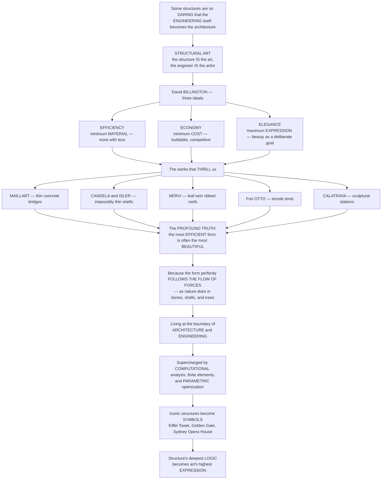

# Structural Innovation and Iconic Engineering

> [!abstract] TL;DR
> **Some structures are so daring, so expressive, that the *engineering itself* becomes the architecture** — the structure *is* the art, and the engineer *is* the artist. This is the tradition the engineer-historian **David Billington** called **structural art**: a discipline distinct from both architecture and pure engineering, governed by three ideals — **efficiency** (minimum *material* — elegance through doing more with less), **economy** (minimum *cost*), and **elegance** (maximum *expression* — beauty pursued as the engineer's deliberate goal). The works that thrill us precisely because of *how they stand* — **Maillart's** soaring thin-concrete bridges, **Candela's** impossibly thin shells, **Nervi's** leaf-vein ribbed roofs, **Frei Otto's** tensile tents, **Calatrava's** sculptural stations — reveal a profound truth: *the most structurally efficient form is often also the most beautiful*, because efficiency means the form perfectly **follows the flow of forces**, and nature works the same way in bones, shells, and trees. Supercharged by **computational analysis** and **parametric optimization**, and producing beloved cultural **symbols** like the Eiffel Tower and the Sydney Opera House, structural innovation makes the deepest *logic* of structure into the highest *expression* of art.

---

## Intuition

**Analogy — when the acrobat's balance becomes the performance.** Watch a great gymnast hold an iron cross on the rings: nothing is hidden, nothing is decorated, and *that* is exactly why it is beautiful. The body is doing something at the very edge of the possible, and every muscle is placed precisely where the force demands — you are watching pure physics turned into pure grace. There is no ornament to add; the *effort itself*, made visible and made perfect, is the art. A daring structure is the same. A wafer-thin concrete arch leaping a gorge, a stone-less roof held up by nothing but tension in a curved net, a dome only centimetres thick spanning a stadium — these thrill us not *despite* being feats of engineering but *because of it*. The structure is not something to be clad and concealed behind architecture; the structure **is** the architecture.

Extend the analogy into the discipline and you arrive at **structural art**. The engineer-historian David Billington argued that alongside architecture and alongside routine engineering there is a *third* thing: a fine art whose medium is structure itself, whose masters are structural engineers, and whose masterpieces are bridges, roofs, shells, and towers pursued for beauty as deliberately as a sculptor pursues form. Billington gave it three ideals. **Efficiency**: use the minimum *material* — elegance comes from lightness, from doing more with less. **Economy**: use the minimum *cost* — it must be genuinely buildable, not a subsidised stunt. **Elegance**: within those disciplines, pursue the maximum *expression* — beauty is the engineer's conscious, personal choice, not a lucky by-product. The astonishing payoff is that these ideals are not in tension with beauty; they *generate* it. The most efficient form is the one where the geometry perfectly traces the **flow of forces** — the funicular arch that stands in pure compression, the cable that hangs in pure tension, the shell that carries load in its curved surface — and there is a deep aesthetic pleasure in that *rightness*, the same rightness we feel looking at a bone, a nautilus, or a wind-shaped tree. This tradition lives at the fertile boundary between architecture and engineering, has been transformed by the computer's power to model and optimise *any* form, and gives us the structures that become the emblems of whole cities: the Eiffel Tower, the Golden Gate, the Sydney Opera House. It is architecture at its most daring frontier.

---

## How It Works

### Core mechanics

Structural art is not a style but a *discipline with a logic*. Reading it means tracing how the pursuit of efficiency and honesty produces beauty:

1. **Structure as the primary source of expression.** In most architecture, structure is a means: it holds up the *real* architectural idea (the plan, the façade, the ornament). In **structural art**, structure is the *end* — the arch, the shell, the tower is not clad, decorated, or hidden but *celebrated* as the thing itself. Billington's claim is radical: this is a fine art in its own right, with its own masters (structural *engineers*, not architects), its own history, and its own critical standards — parallel to painting or music, not subordinate to building.
2. **The three ideals — efficiency, economy, elegance.** **Efficiency** is minimum *material*: the lightest structure that safely carries the load, achieved by putting material only where force flows and in the mode it does best. **Economy** is minimum *cost*: real construction on a real budget, competitive with alternatives — this keeps structural art honest and distinguishes it from expensive sculpture. **Elegance** is maximum *expression*: within efficiency and economy the engineer still has *freedom* — many forms are efficient — and the disciplined, personal choice among them for beauty is where the *art* enters. Discipline (science, cost, physics) and freedom (aesthetic choice) together define the field.
3. **Why efficiency breeds beauty — form follows forces.** The deep principle. For any load there is an ideal geometry that carries it in **pure axial force with no bending**: hang a chain and it finds the *catenary* in pure tension; invert it and it stands as an *arch* in pure compression; a doubly-curved *shell* carries load in its surface like an eggshell. These **funicular** and **form-found** shapes need the least material precisely because no material is wasted resisting bending — and they read to the eye as *lightness, clarity, and rightness*. Nature discovered this long ago: bone lays down its **trabeculae** exactly along the lines of principal stress (a natural **Michell truss**), shells and eggs are efficient compression surfaces, trees taper to follow their bending. Structural optimisation and evolution converge on the same elegant forms.
4. **The tools that made daring possible.** Structure grew bolder as *analysis* grew stronger — from empirical rules of thumb, to **statics** and **strength of materials**, to the modern **theory of structures**. The decisive leap was **computational analysis**: the **finite element method** lets engineers model and check *any* complex geometry, so a form that could never be hand-calculated can now be verified and refined. Today **parametric, generative, and topology optimisation** go further, letting an algorithm *find* the optimal structural form directly — the funicular become a computable design tool. Better analysis expanded the frontier of what could be safely and daringly built.
5. **Iconic structures as symbols.** Beyond efficiency lies *meaning*. The greatest structures escape their engineering and become cultural **landmarks** — the Eiffel Tower, the Brooklyn and Golden Gate Bridges, the Sydney Opera House, the Gateway Arch, Fuller's geodesic domes. They become emblems of cities, of nations, and of human aspiration itself: the "engineering sublime," where a public feels awe at what people can build. The engineer, in structural art, is finally an artist whose gallery is the skyline.

### Flow / Architecture



---

## Key Concepts

**Secondary (can explain to a bright 16-year-old):**
- **Sometimes the engineering *is* the art.** A wafer-thin concrete bridge leaping a gorge or a curved roof held up by nothing but tension thrills us *because* of how cleverly it stands. The structure isn't hidden behind the architecture — it *is* the architecture.
- **Do more with less.** The best structures use the *least* material to hold up the *most* — and that lightness is exactly what makes them beautiful. A heavy, clumsy design and an elegant, minimal one can both work; the minimal one is the art.
- **Beauty copies nature.** The efficient shapes engineers discover — arches, shells, tapered forms — are the same shapes nature uses in bones, eggshells, and trees, because both are solving the same problem: carry the load with as little material as possible.
- **The masters.** A few great structural engineers — Robert **Maillart** (bridges), Pier Luigi **Nervi** (ribbed roofs), Félix **Candela** (shells), Frei **Otto** (tents), Santiago **Calatrava** (sculptural bridges and stations) — made structures so beautiful that they are treated as works of art.

**Undergraduate (needs some background):**
- **Structural art as a distinct discipline (Billington).** In *The Tower and the Bridge*, Billington argued that structural art is neither architecture nor routine engineering but a *third* fine art, governed by **efficiency** (minimum material), **economy** (minimum cost), and **elegance** (maximum expression). Crucially, elegance is a *free* choice made *within* the disciplines of efficiency and economy — many forms are efficient, and choosing the beautiful one is the art.
- **Form follows forces — why efficient is beautiful.** The efficient form carries load in **pure axial action** (the funicular arch in compression, the cable in tension, the membrane/shell in surface stress) with little or no bending, so almost no material is wasted. The eye reads that as lightness, clarity, and rightness. This is the mechanical basis of structural beauty, and it is why **form-finding** (Gaudí's hanging chains, Otto's soap films, Isler's inverted cloths) yields shapes that are simultaneously optimal and gorgeous.
- **The material revolutions behind the forms.** Reinforced and **prestressed concrete** let Maillart, Nervi, and Candela make thin, continuous, curved, monolithic forms impossible in stone or early iron; high-strength steel cable let Otto and the suspension-bridge engineers work in pure tension; iron and steel framing let Eiffel and Fazlur Khan build tall. Each new material opened a new region of achievable structural expression.
- **Analysis as the enabler.** Empirical rules gave way to statics, strength of materials, and the theory of structures; then the **finite element method** let engineers analyse *arbitrary* geometry. You cannot *safely* dare what you cannot *analyse* — so the history of daring structure tracks the history of structural analysis and, latterly, computing.

**Graduate (system-level thinking):**
- **Efficiency, economy, and elegance as competing objective functions.** Structural art is a *constrained multi-objective* problem: minimise material, minimise cost, maximise expressive quality — with strength, stiffness, stability, and buildability as constraints. Billington's masters are precisely those who found the *Pareto* forms where efficiency and elegance coincide. Calatrava marks the contested frontier where *expression* is pushed past efficiency and economy (deliberately over-articulated, material-heavy, costly), raising the discipline's central normative question: is expensive structural *sculpture* still structural *art*?
- **Structural optimisation and the deep unity with nature.** Michell's 1904 theory of least-weight trusses shows that optimal material layout follows the **principal stress trajectories** — the same orthogonal families that streamline through a loaded body, and the same pattern that bone **trabeculae** self-organise into under Wolff's law. Modern **topology optimisation** (SIMP, level-set, and evolutionary methods) rediscovers these organic, branching, bone-like forms algorithmically — a computational vindication that structural efficiency and natural form are the *same* attractor. This is the rigorous core of "biomimicry" in structure.
- **From physical to numerical form-finding.** Gaudí's funiculars, Otto's minimal surfaces, and Isler's hanging membranes solved *physically* an inverse problem — find the geometry that eliminates bending for a given load and boundary. Dynamic relaxation, force-density, and thrust-network analysis now pose the same problem numerically, coupling **parametric geometry** to **FEM** in a closed optimisation loop. The catenary became a matrix equation; form-finding became design software.
- **The engineer–architect synthesis and the meaning of monuments.** The canonical icons emerge from *collaboration*: Utzon with **Ove Arup** and the Opera House shells re-rationalised as sphere segments; Rogers and Piano with **Peter Rice** at the Pompidou; Fazlur **Khan**'s tubular systems enabling the tall building. And beyond mechanics lies semiotics: iconic structures accrue *public meaning* — the Eiffel Tower shifted from engineers' provocation to beloved emblem of Paris. Structural art is thus simultaneously a mechanics, an aesthetics, and a sociology of the built symbol.

---

## Python Demo

```python
# Structural innovation: efficiency IS elegance, and force-flow IS form.
# (a) STRUCTURAL OPTIMIZATION / material minimization: a "fully-stressed" cantilever
#     whose DEPTH follows the bending-moment demand -> an organic, tapered, bone-like
#     wedge that deepens toward the support and tapers to nothing at the tip
#     (Maillart's bridges, a tree branch, a bone), vs a naive constant section.
# (b) NATURE-INSPIRED / FORCE-FOLLOWING form: the PRINCIPAL STRESS TRAJECTORIES in a
#     loaded cantilever -- the two orthogonal families of curves that optimal material
#     wants to follow (the Michell/trabecular pattern behind bone and topology design).
# Requires: numpy, matplotlib
import numpy as np
import matplotlib.pyplot as plt

fig, axs = plt.subplots(1, 2, figsize=(14, 5.8))

# ---------- (a) MATERIAL-MINIMIZING TAPER: depth follows the moment ----------
L = 12.0                                  # cantilever length, m
w = 8.0                                   # uniform load, kN/m
x = np.linspace(0.0, L, 400)
M = w * (L - x)**2 / 2.0                  # cantilever moment: MAX at root, ZERO at tip
# Fully-stressed design: keep peak stress constant -> section modulus ~ M.
# For a rectangular section of unit width, modulus ~ depth^2, so depth ~ sqrt(M).
d = np.sqrt(M / M.max())                  # optimized depth profile (normalized to 1 at root)
d_const = np.ones_like(x)                 # naive design: constant depth sized for the ROOT

mat_opt = np.trapz(d,       x)            # "material" = area of the depth profile
mat_con = np.trapz(d_const, x)
saved   = 100.0 * (1.0 - mat_opt / mat_con)

ax = axs[0]
# naive constant-depth block (outline)
ax.plot([0, L, L, 0, 0], [0.5, 0.5, -0.5, -0.5, 0.5],
        color="#adb5bd", lw=1.6, ls="--", label="naive CONSTANT section")
# optimized tapered wedge (filled) -- the "efficiency = elegance" form
ax.fill_between(x,  d/2, -d/2, color="#457b9d", alpha=0.85,
                label="OPTIMIZED taper: depth ~ sqrt(moment)")
ax.plot([0], [0], "ks", ms=9)             # the fixed support (root)
ax.text(0.3, 0.62, "SUPPORT\n(max moment)", fontsize=8, va="bottom")
ax.text(L*0.72, 0.15, "tapers to nothing\nat the tip", fontsize=8)
ax.text(L*0.30, -0.72, f"material saved ~ {saved:.0f}%\n"
        "form FOLLOWS the force\n(like a bone / Maillart's bridge)",
        fontsize=9, ha="center",
        bbox=dict(boxstyle="round", fc="#e9f5db", ec="grey"))
ax.set_title("Structural optimization: minimum material\n-> an organic, force-following FORM")
ax.set_xlabel("position along span  [m]")
ax.set_ylabel("section depth  [normalized]")
ax.set_ylim(-1.0, 1.0)
ax.legend(loc="upper right", fontsize=8)

# ---------- (b) PRINCIPAL STRESS TRAJECTORIES: the Michell / trabecular pattern ----------
Lc, h, P = 10.0, 3.0, 1.0                  # cantilever length, depth, tip load
xs = np.linspace(0.05, Lc, 60)
ys = np.linspace(-h/2, h/2, 40)
Xg, Yg = np.meshgrid(xs, ys)               # shape (len(ys), len(xs)) for streamplot
I  = h**3 / 12.0                           # 2nd moment of area, unit thickness
# Timoshenko cantilever stress field (tip load P at x = Lc):
sx  = -(P * (Lc - Xg) * Yg) / I            # bending normal stress
txy = -(P / (2.0 * I)) * ((h**2 / 4.0) - Yg**2)   # parabolic shear stress
theta = 0.5 * np.arctan2(2.0 * txy, sx)    # principal angle (sy = 0)

ax = axs[1]
# family 1 (one set of stress trajectories) and its orthogonal family:
ax.streamplot(xs, ys, np.cos(theta),           np.sin(theta),
              color="#c1121f", density=1.3, linewidth=0.8, arrowsize=0)
ax.streamplot(xs, ys, np.cos(theta + np.pi/2), np.sin(theta + np.pi/2),
              color="#023047", density=1.3, linewidth=0.8, arrowsize=0)
ax.plot([0, 0], [-h/2, h/2], "k-", lw=3)   # the fixed support
ax.set_title("Force-following form: PRINCIPAL STRESS trajectories\n"
             "optimal material lies along these lines (bone / Michell truss)")
ax.set_xlabel("length along cantilever  [m]")
ax.set_ylabel("depth  [m]")
ax.text(Lc*0.02, h*0.30, "TENSION family\n(red)", color="#c1121f", fontsize=8)
ax.text(Lc*0.02, -h*0.42, "COMPRESSION family\n(blue)", color="#023047", fontsize=8)
ax.set_aspect("equal", adjustable="box")

plt.tight_layout()
plt.savefig("structural_innovation.png", dpi=120)
plt.show()

# Takeaways:
#  (a) Sizing a member so its DEPTH follows the bending-moment demand (a "fully-stressed"
#      design) removes idle material and yields a smooth, tapered, ORGANIC wedge that
#      deepens toward the support and vanishes at the tip - the same logic that gives a
#      bone, a tree branch, and Maillart's thin concrete bridges their forms. Here the
#      taper saves ~50% of material versus a constant section: EFFICIENCY becomes ELEGANCE.
#  (b) The two crossing families of PRINCIPAL STRESS TRAJECTORIES show where force actually
#      flows through a loaded body. Optimal structures (Michell trusses) and living bone
#      (trabeculae) both lay material along exactly these lines - the deep unity of
#      structural optimization and natural form that modern topology optimization recovers.
```

Running this produces two panels. On the left, a naive **constant-section** cantilever (dashed outline) is overlaid with the **optimised, fully-stressed** profile — a smooth wedge whose depth tracks `sqrt(moment)`, deepening toward the support and tapering to nothing at the tip, saving roughly half the material and looking unmistakably *organic*, like a bone or a Maillart bridge. On the right, the two orthogonal families of **principal-stress trajectories** in a loaded cantilever trace exactly the lines along which optimal material — and living bone — arranges itself, the Michell/trabecular pattern that unites structural optimisation with the forms of nature. Together they make the chapter's thesis visual: *the pursuit of efficiency produces beauty because efficient form follows the flow of forces.*

---

## Real-World Applications

> **Robert Maillart's Salginatobel Bridge, Switzerland (1930) — efficiency as beauty.** Maillart's three-hinged, hollow-box reinforced-concrete arch spans a 90-metre alpine gorge as a thin, curving ribbon that swells at the crown and tapers toward the hinges — the concrete placed *only* where force flows. It was built as the *cheapest* of nineteen competition entries, yet it is celebrated as one of the twentieth century's most beautiful structures and is a landmark of structural art. Efficiency, economy, and elegance in a single object — Billington's thesis made concrete.

> **Pier Luigi Nervi's Palazzetto dello Sport, Rome (1957) — the leaf-vein roof.** Nervi roofed the arena with a shallow ribbed concrete dome whose **isostatic ribs** curve to follow the principal bending stresses, branching across the ceiling exactly like the veins of a leaf. Cast from reusable **ferrocemento** moulds for economy, the roof is both a rigorous least-material structure and one of the most beautiful ceilings ever built — the stress lines themselves become the ornament.

> **Félix Candela and Heinz Isler — the impossibly thin shell.** Candela's hyperbolic-paraboloid shell at Los Manantiales, Xochimilco (1958), and Isler's free-form hanging-derived shells span great spaces in surfaces only a few centimetres thick, because the doubly-curved **shell** carries load in near-pure membrane compression. Isler *form-found* his shells physically, by inverting hanging cloths — the funicular made into a roof.

> **Frei Otto's Munich Olympic Stadium roof (1972) — form-found tension.** Otto derived his sweeping cable-net and membrane roofs from **soap-film** and hanging-model experiments that find the minimal-surface shape carrying load in pure **tension**. The lightweight, translucent, landscape-like forms are impossible in compression materials; the tension system *is* the form — a masterpiece of lightness that reshaped how the world thought about roofs.

> **The Sydney Opera House and the engineer as collaborator.** Jørn Utzon's 1957 sketch of sculptural shells was pure expression that *no one knew how to build* — until Ove Arup and Peter Rice's engineers re-conceived every shell as a segment of one sphere, making them analysable and buildable. The result became the defining **symbol** of a nation. It is the perfect case of structural innovation as architect–engineer synthesis, and of an engineering achievement transcending engineering to become a beloved cultural icon — the lineage that runs on to Santiago **Calatrava's** biomorphic bridges and stations and to Fazlur **Khan's** tube systems that made the supertall tower possible.

---

## Common Pitfalls

- **Confusing structural art with mere structural expression.** Billington's test has *three* legs. A form can *look* structural yet be wildly inefficient and ruinously expensive — decorative "structure" that carries little, or an "expressed" frame that hides the real load path. True structural art is honest *and* efficient *and* economical; sculpture that merely quotes structure is not structural art. This is the crux of the long-running critical debate around Calatrava's most extravagant works.
- **Assuming efficient always equals elegant automatically.** Efficiency *enables* elegance but does not *guarantee* it: many forms are efficient, and choosing the beautiful one is a deliberate, disciplined, personal act. An engineer who optimises for material alone can produce something merely gaunt. Elegance is the *free* choice made within the constraints — the art is not automatic.
- **Dropping economy — the subsidised stunt.** A "daring" structure that ignores cost and buildability betrays the discipline that gives structural art its integrity. Minimum *cost* keeps the form honest and repeatable; abandon it and you have an expensive one-off, not an art form with a future.
- **Using a material against its nature.** The masters' forms are inseparable from their materials — thin *compression* shells in concrete, pure *tension* nets in steel cable. Loading concrete or masonry in tension, or a slender shell into **buckling**, invites collapse; the whole point of form-finding is to keep every material in the mode it does best. Copying a form without its force-logic is dangerous.
- **Trusting a daring geometry without adequate analysis.** Bold structures live near their limits, so they demand *more* analysis, not less. Historic and modern failures alike trace to geometries whose real behaviour — buckling, dynamic wind or crowd response, second-order effects — outran the analysis available. The finite element method enabled daring precisely by making it checkable; skipping rigorous verification because "it looks right" is how icons fall.
- **Mistaking the icon for the engineering.** A structure's fame as a *symbol* is not proof of its structural artistry, and vice versa: some beloved landmarks are ordinary engineering made famous by siting or history, while some supreme works of structural art are barely known. Judge the structure by efficiency, economy, and elegance — not by the postcard.

---

## Related Concepts

*This note closes the **Structure, Materials, and Construction** section (S03) of the Architecture vault by carrying its themes to the expressive frontier. It builds directly on its section-opener sibling **Structure and Architectural Form** (how buildings stand and how force-flow generates form) and on **Materials and Tectonics in Architecture** (the concrete, steel, and cable that made these forms possible); it is the expressive counterpart of **Spanning Space: Arches, Domes, and Shells** (the funicular and form-found systems the masters used) and of **The Tall Building and the Skyscraper** (Khan's structural artistry in the tower); and it looks forward to **Parametric and Computational Design** (the algorithmic optimisation that now finds these forms) and **The Reach and Future of Architecture** (adaptive, ultra-light, and 3D-printed structural expression). Deliberately a **distinct** treatment, it complements — and links to — the quantitative structural notes in the Civil and Mechanical Engineering vaults and the technological history in the History of Science vault.*

Intra-vault connections (verified to exist):

- [[Structure_and_Architectural_Form]] — the S03 section-opener; force-flow and "form follows forces," the mechanical basis this note turns into art.
- [[Architecture_Overview_and_the_Art_of_Building]] — the crossroads where *art meets engineering*; structural art is that crossroads at its most extreme.
- [[Form_Function_and_Ornament]] — "truth to structure" and structural honesty as an aesthetic ethic, the debate structural art embodies.
- [[Renaissance_and_Baroque_Architecture]] — Brunelleschi's dome as engineered compression shell, an ancestor of the structural-artist tradition.
- [[Modern_Architecture_and_the_Modern_Movement]] — Eiffel's iron, the exposed frame, and the Modernist celebration of structure.
- [[Postmodern_and_Contemporary_Architecture]] — Calatrava and the contemporary iconic structure, where expression is pushed past efficiency.
- [[Architecture_Culture_and_Society]] — iconic structures as cultural symbols and emblems of cities and nations.

Cross-vault connections (verified to exist):

- [[Bridge_Engineering]] — the engineering of Maillart's arches and the suspension and cable-stayed forms of structural art.
- [[Reinforced_Concrete_Design]] — the material that made Maillart's, Nervi's, and Candela's thin curved forms possible.
- [[Prestressed_Concrete]] — high-strength pretensioning that let concrete span farther and thinner in expressive structures.
- [[Analysis_of_Trusses_and_Frames]] — the member-force analysis behind Michell trusses and Khan's tubular tall-building systems.
- [[Structural_Stability_and_Buckling]] — the compression failure mode that governs how thin a shell or slender an arch can dare to be.
- [[CAD_CAE_and_Finite_Element_Method]] — the computational analysis that let engineers model and optimise *any* daring geometry.
- [[Bending_and_Beam_Theory]] — why depth follows the moment, the basis of the fully-stressed tapered form in the demo.
- [[Stress_Strain_and_Deformation]] — stress, strain, and principal directions: the trajectories optimal material follows.
- [[Newtonian_Mechanics_and_the_Principia]] — the statics and mechanics whose maturation made rational structural analysis possible.
- [[Science_Technology_and_Society]] — how engineering achievements become public symbols and cultural landmarks.
- [[Civil_Engineering_Overview]] — the discipline within which structural art is practised, and from which its masters came.
- [[The_Reach_and_Future_of_Civil_Engineering]] — adaptive, ultra-light, and computationally-optimised structures at the frontier of structural expression.

---

## Review Questions

**Secondary:**
1. A plain concrete beam and one of Maillart's thin, curving concrete bridges both carry a road across a gap, but only one is celebrated as a work of art. Using the idea that "doing more with less" is beautiful, explain what makes the bridge *structural art* — and why a bone, a tree branch, and Maillart's bridge all end up with a similar tapered shape.

**Undergraduate:**
2. David Billington argued that structural art has three ideals: efficiency (minimum material), economy (minimum cost), and elegance (maximum expression). Take one masterwork — Nervi's ribbed roof, Candela's shell, or Otto's tensile roof — and explain how it satisfies all three. Then explain the claim that "form follows forces": why does carrying load in *pure axial action* (arch, cable, or shell) both minimise material *and* produce a form we find beautiful?

**Graduate:**
3. Michell's least-weight trusses place material along the principal stress trajectories — the very same pattern that bone trabeculae self-organise into, and that modern topology optimisation rediscovers algorithmically. Discuss what this convergence of structural optimisation and natural form implies about the relationship between *efficiency* and *elegance*. Then take the contested case of Santiago Calatrava, whose work is often material-heavy and costly: does pushing *expression* past efficiency and economy still count as *structural art* by Billington's definition, or does it become sculpture? Argue your position.

---

## Sources

- David P. Billington, *The Tower and the Bridge: The New Art of Structural Engineering* (Princeton University Press) — [Publisher page](https://press.princeton.edu/books/paperback/9780691023939/the-tower-and-the-bridge)
- David P. Billington, *Robert Maillart's Bridges: The Art of Engineering* (Princeton University Press) — [Publisher page](https://press.princeton.edu/books/hardcover/9780691087894/robert-maillarts-bridges)
- Pier Luigi Nervi, *Aesthetics and Technology in Building* (Harvard University Press, Charles Eliot Norton Lectures) — [Author overview](https://en.wikipedia.org/wiki/Pier_Luigi_Nervi)
- Bill Addis, *Building: 3000 Years of Design Engineering and Construction* (Phaidon) — [Publisher page](https://www.phaidon.com/store/architecture/building-3000-years-of-design-engineering-and-construction-9780714869391/)
- Eugene S. Ferguson, *Engineering and the Mind's Eye* (MIT Press) — [Publisher page](https://mitpress.mit.edu/9780262560788/engineering-and-the-minds-eye/)

---

#architecture #structural-art #iconic-engineering #nervi-and-calatrava #efficiency-and-elegance
