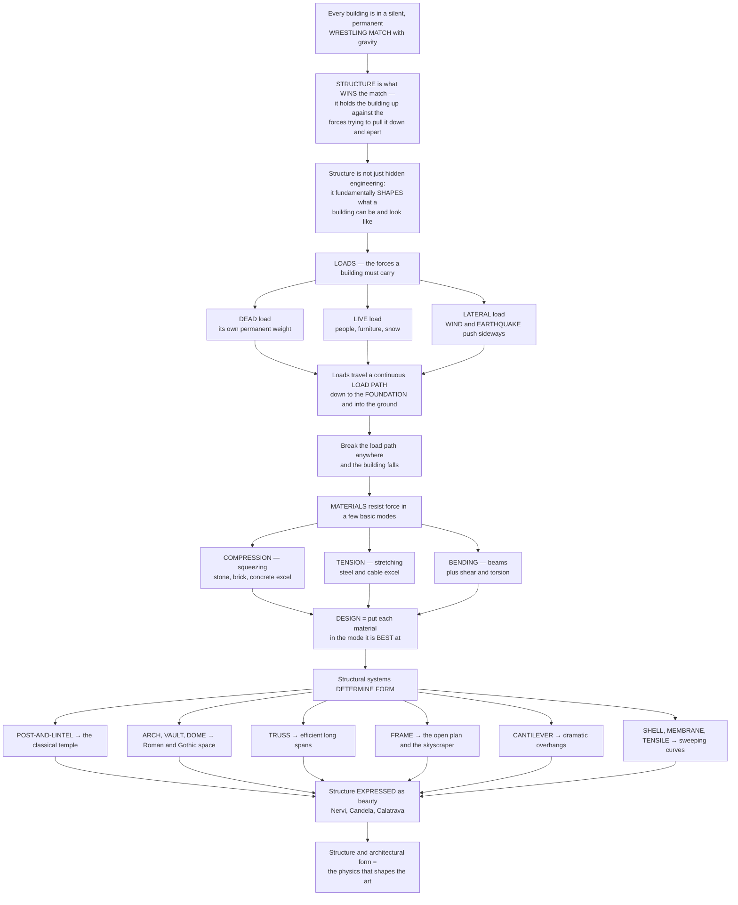

# Structure and Architectural Form

> [!abstract] TL;DR
> **Every building is in a silent, permanent wrestling match with gravity — and its structure is what wins that match**, holding the building up against the loads forever trying to pull it down and apart. But structure is not merely hidden engineering behind the walls: it fundamentally **shapes what a building can be and look like**. Understanding architecture means grasping how **loads** — the building's own *dead* weight, the *live* weight of people and snow, and the *lateral* push of wind and earthquakes — travel down a continuous **load path** to the foundation, and how materials resist force in a few basic modes: **compression** (stone, brick, concrete), **tension** (steel, cable), **bending** (beams), and shear. The genius of structural design is putting each material in the mode it does best. And the deep architectural point is that **structural systems determine form**: post-and-lintel gives the classical temple; the arch, vault, and dome give Roman and Gothic space; the frame gives the open plan and the skyscraper; the cantilever gives dramatic overhangs; and shells and tensile membranes give sweeping curves. From Gothic ribs to Nervi, Candela, and Calatrava, great builders have made structure itself into beauty — **the physics that shapes the art.**

---

## Intuition

**Analogy — the wrestling match with gravity.** Imagine a building not as a static object but as an athlete locked in a match that never ends. Gravity is the opponent, pulling relentlessly down; wind and earthquakes are the shoves from the side; the building's own weight, the crowd inside, the snow on the roof are all extra loads piled onto its shoulders. The **structure** is the set of muscles, bones, and stance that *wins* this match — moment by moment, century after century, holding the whole assembly up and keeping it from being pulled down and apart. The instant the structure loses — one bone snaps, one grip fails — the building falls.

But here is what makes structure *architectural* rather than merely engineering: a wrestler's stance is not hidden; it *shapes the whole silhouette*. In exactly the same way, structure fundamentally shapes what a building can **be** and look **like**. The forces do not just have to be carried — the *way* they are carried decides the span you can reach, the height you can rise to, the openness of the plan, the curve of the roof. To understand a building you must learn to see the invisible **flow of forces** running through it. It starts with **loads** — the forces the building must carry: **dead** loads (its own permanent weight), **live** loads (people, furniture, snow), and **lateral** loads (wind and earthquakes pushing sideways). These must travel down a continuous **load path** — from where they act, through beams and columns, to the foundation and into the ground. Break that path anywhere and the building comes down. Materials fight back in a handful of modes: **compression** (being squeezed — stone and concrete are superb at this), **tension** (being stretched — steel and cables excel), **bending** (beams, which combine both), and shear. The whole art is choosing systems that keep each material in the mode it is *best at* — and, crucially, letting that choice generate the architecture itself.

---

## How It Works

### Core mechanics

Reading a building structurally means tracing forces from the sky to the soil, and then recognising the *form* that force-flow produces:

1. **Loads — the forces a building must carry.** **Dead load** is the permanent self-weight of the structure and everything fixed to it. **Live load** is the movable, changeable weight — occupants, furniture, stored goods, snow. **Lateral / environmental loads** push *sideways* or dynamically: wind pressure, seismic ground shaking, thermal expansion. Gravity loads a building expects; the sideways loads are what most often bring it down.
2. **The load path — continuity or collapse.** Every load must find a **continuous route** down to the foundation: floor slab → beam → column → footing → soil. This chain is the **load path**. The single most important principle in structural safety is that *the load path must be unbroken* — a discontinuous column, a removed wall, a failed connection interrupts the flow and the loads have nowhere to go but into failure. **Equilibrium** (forces balance), **stability** (it will not tip or buckle), and **redundancy** (alternate paths if one element fails) keep the building standing.
3. **How materials resist force — the structural actions.** **Compression** squeezes a member shorter — masonry, stone, brick, and concrete are cheap and strong here, though they can **buckle** if slender. **Tension** stretches a member longer — steel, cables, and good timber excel, and tension elements can be astonishingly thin. **Bending** (in beams) is a *combination*: the top face is compressed while the bottom face is stretched, with a neutral axis between — which is why bending is inefficient (material near the middle barely works) and why **depth matters** so much. **Shear** and **torsion** round out the set. The core of structural logic is **matching each material to the force it does best**.
4. **Structural systems determine form — the key relationship.** Because each system channels forces differently, each *generates a different architecture*: **post-and-lintel** (trabeated columns and beams — the classical temple, limited by bending); the **arch, vault, and dome** (compression systems that span and enclose volume — Roman, Byzantine, Gothic); the **truss** (triangulated members in pure tension and compression — efficient long spans); the **frame / skeleton** (steel or concrete columns and beams — the free plan, curtain wall, and skyscraper); the **cantilever** (projecting beyond its support — dramatic overhangs); and **shells, membranes, and tensile** structures (thin surfaces working like a soap bubble or a tent — sweeping curves).
5. **Structure as architectural expression.** Structure can be *hidden*, or it can be **expressed** as beauty. The Gothic rib, the exposed steel frame, and High-Tech architecture make structure visible and honest. The great **engineer-architects** — Pier Luigi Nervi, Félix Candela, Eduardo Torroja, Frei Otto, Santiago Calatrava, and the engineers Ove Arup and Peter Rice — went further, making structure *itself* the architecture, often via **form-finding**: deriving the ideal shape directly from the force flow (Gaudí's hanging chains, Otto's soap films, the catenary and funicular).

### Flow / Architecture



---

## Key Concepts

**Secondary (can explain to a bright 16-year-old):**
- **Buildings fight gravity forever.** The structure is the part that wins — the columns, beams, walls, and foundations that hold everything up. If any part gives way, the building falls.
- **Three kinds of load.** A building must carry its own weight (**dead load**), the weight of the people and snow inside and on it (**live load**), and the sideways push of **wind and earthquakes** (**lateral load**).
- **Squeeze vs. stretch.** Some materials are great at being **squeezed** (stone, brick, concrete) and some at being **stretched** (steel cables). Good design uses each material the way it is strongest.
- **Shape follows the job.** A flat beam, a curved arch, a triangle-filled truss, a tall skeleton frame, a jutting cantilever, a thin curved shell — each *shape* is a different way of carrying load, and each gives buildings a different *look*.

**Undergraduate (needs some background):**
- **The load path is sacred.** Loads travel floor → beam → column → foundation → soil. This path must be **continuous**; a discontinuity — a column that stops, a wall that is removed, a weak "soft storey" — is where buildings fail. Equilibrium, stability, and **redundancy** (alternate paths) are the safeguards.
- **Bending is inefficient; depth is everything.** In a beam, only the *extreme fibres* — top in compression, bottom in tension — do serious work; material near the neutral axis is nearly idle. That is why we use **I-beams** (material concentrated at the flanges) and why doubling a beam's **depth** roughly quadruples its bending strength. Stone, weak in tension, cracks on its bottom face — which is precisely why pre-industrial builders could not make long stone beams and turned to the **arch**.
- **Form follows forces — the funicular.** For a given load there is an ideal shape that carries it in **pure axial force with zero bending**: hang a chain and it finds the **catenary** in pure tension; invert that shape and it stands in pure compression as an **arch**. Because they eliminate bending, arches, cables, and shells span *far* further for *far* less material than beams — the deep reason the arch, the suspension bridge, and the thin-shell roof exist.
- **Each system, a different architecture.** Post-and-lintel limits span (bending in the lintel); the arch/vault/dome enclose great volumes in compression; the truss spans efficiently by triangulation; the steel/concrete **frame** liberates the plan and enables the skyscraper and curtain wall; the cantilever projects into space; tensile and shell structures make lightweight sweeping curves.

**Graduate (system-level thinking):**
- **Structure as a form-generator, not a constraint.** The mature view is that structural logic is not a limit *on* architecture but a *source of* it. Louis Kahn's "what does the brick want to be?", Nervi's *scienza del costruire*, and the whole tradition of **structural rationalism** (Viollet-le-Duc reading Gothic as pure structural logic) treat the flow of forces as an ordering principle for form itself.
- **Form-finding and the physical/analytical inverse problem.** Gaudí's hanging-chain models, Frei Otto's minimal-surface soap films, and Heinz Isler's inverted hanging cloths solved, *physically*, an optimisation that we now pose numerically: find the geometry that minimises bending for a given load and boundary. Today parametric and finite-element form-finding (dynamic relaxation, force-density, thrust-network analysis) generalises this — the funicular becomes a computable design tool.
- **Efficiency versus expression.** Minimum-material efficiency (shells, tensile nets) and maximum *expressive* drama (Calatrava's skeletal exuberance, the deliberately "over-articulated" High-Tech joint) are different objective functions. Structural honesty is an *ethic* (Ruskin, Pugin, the Modernist "truth to structure") as much as an economy — and expressed structure is not always the most efficient structure.
- **The architect–engineer synthesis.** The greatest structural architecture emerges from deep collaboration — Utzon with Arup, Rogers and Piano with Peter Rice, Foster with Buro Happold. The **structural grid and module** set the rhythm of the plan; the choice of system fixes the achievable **span, height, and openness**; and the engineer's analysis feeds back into the architect's form in an iterative loop. Reading a building well means reading that dialogue in the built fabric.

---

## Python Demo

```python
# Structure & architectural form: how forces flow, and how form follows the forces.
# (a) BEAM vs ARCH/CABLE force flow  -> why bending is inefficient and the funicular is not.
# (b) The CANTILEVER penalty + structural efficiency across systems.
# Requires: numpy, matplotlib
import numpy as np
import matplotlib.pyplot as plt

fig, axs = plt.subplots(2, 2, figsize=(13, 9))

# ---------- (a-i) SIMPLY-SUPPORTED BEAM: bending moment + stress fibers ----------
L = 10.0          # span, m
w = 5.0           # uniform load, kN/m
x = np.linspace(0, L, 200)
M = w * x * (L - x) / 2.0            # bending moment (a parabola), kN.m

ax = axs[0, 0]
ax.plot(x, M, color="#c1121f", lw=2)
ax.fill_between(x, M, alpha=0.15, color="#c1121f")
ax.annotate("max moment at midspan", xy=(L/2, M.max()),
            xytext=(L/2, M.max()*0.55), ha="center", fontsize=9,
            arrowprops=dict(arrowstyle="->"))
ax.text(0.4, M.max()*0.92, "TOP fiber: COMPRESSION\nBOTTOM fiber: TENSION",
        fontsize=8, va="top",
        bbox=dict(boxstyle="round", fc="#ffe8d6", ec="grey"))
ax.set_title("Simply-supported BEAM under load\nbending: one face squeezed, the other stretched")
ax.set_xlabel("position along span  [m]")
ax.set_ylabel("bending moment  [kN.m]")

# ---------- (a-ii) ARCH vs CABLE: the funicular carries the SAME load with NO bending ----------
f = 3.0                                    # rise / sag, m
shape = 1 - (2*x/L - 1)**2                 # parabolic funicular for a uniform load
y_arch  =  f * shape                       # parabola up   -> PURE COMPRESSION
y_cable = -f * shape                       # parabola down -> PURE TENSION

ax = axs[0, 1]
ax.plot(x, y_arch,  color="#023047", lw=2.5, label="ARCH  = pure COMPRESSION  (stone, concrete)")
ax.plot(x, y_cable, color="#2a9d8f", lw=2.5, label="CABLE = pure TENSION  (steel)")
ax.axhline(0, color="grey", lw=0.8, ls="--")
ax.plot([0, L], [0, 0], "ks", ms=7)        # the two shared supports
ax.text(L/2, 0.4, "same load, ZERO bending\n-> spans far more efficiently",
        ha="center", fontsize=8,
        bbox=dict(boxstyle="round", fc="#e9f5db", ec="grey"))
ax.set_title("FORM FOLLOWS FORCES: the funicular shape\nturns the load into PURE axial force")
ax.set_xlabel("position along span  [m]")
ax.set_ylabel("height  [m]")
ax.legend(fontsize=7, loc="lower center")
ax.set_aspect("equal", adjustable="box")

# ---------- (b-i) THE CANTILEVER PENALTY: moment grows with the SQUARE of the reach ----------
Lc = np.linspace(0.5, 8, 100)              # cantilever projection, m
M_root = w * Lc**2 / 2.0                   # root bending moment for a uniform load, kN.m

ax = axs[1, 0]
ax.plot(Lc, M_root, color="#7209b7", lw=2.5, label="root moment  proportional to L squared")
ax.fill_between(Lc, M_root, alpha=0.12, color="#7209b7")
ax.set_title("The CANTILEVER: root moment ~ (projection) squared\nlong overhangs need deep, strong sections")
ax.set_xlabel("cantilever projection L  [m]")
ax.set_ylabel("root bending moment  [kN.m]")
ax.legend(fontsize=8, loc="upper left")

# ---------- (b-ii) STRUCTURAL EFFICIENCY across SYSTEMS (illustrative) ----------
systems  = ["Post-and-\nbeam", "Truss", "Arch /\nvault", "Shell"]
material = [100, 55, 35, 20]               # relative material to span a fixed distance
ax = axs[1, 1]
bars = ax.bar(systems, material, color=["#adb5bd", "#8d99ae", "#457b9d", "#1d3557"])
for b, m in zip(bars, material):
    ax.text(b.get_x()+b.get_width()/2, m+2, str(m), ha="center", fontsize=9)
ax.set_title("Structural EFFICIENCY: FORM, not just material,\nsets how much it takes to span (illustrative)")
ax.set_ylabel("relative material to span a fixed distance")
ax.set_ylim(0, 115)

plt.tight_layout()
plt.savefig("structure_and_form.png", dpi=120)
plt.show()

# Takeaways:
#  (a) A BEAM resists load by BENDING - top fiber squeezed, bottom stretched - so only
#      material far from the neutral axis works hard (why we use I-beams, and why stone,
#      weak in tension, cracks in bending). Bend the load path into the FUNICULAR shape
#      (arch up, cable down) and the SAME load is carried in PURE axial force with ZERO
#      bending - the arch and cable span far further for far less material.
#  (b) A CANTILEVER's root moment grows with the SQUARE of its reach, so every extra metre
#      of dramatic overhang is dearly bought. Across systems, FORM - not just material -
#      sets efficiency: shells and arches spanning in near-pure compression beat beams.
```

Running this produces four panels: a **beam** whose parabolic bending moment peaks at midspan (with the top fibre in compression and the bottom in tension); the **arch-versus-cable funicular**, where the same load is carried in pure compression (arch up) or pure tension (cable down) with *no bending at all*; the **cantilever penalty**, where the root moment climbs with the *square* of the projection; and a **systems comparison** showing how dramatically form — from post-and-beam down to the thin shell — changes the material needed to span. Together they make the chapter's thesis quantitative: *form follows forces.*

---

## Real-World Applications

> **The Gothic cathedral (the load path made visible).** The pointed arch, ribbed vault, and flying buttress are a single, legible load-path invention: roof loads gather into the ribs, funnel down to slender piers, and the outward *thrust* of the vaults is caught by flying buttresses that carry it to massive external buttresses and into the ground. Because the stone works almost entirely in **compression**, the walls no longer carry the roof and can dissolve into stained glass. Structure here is not hidden — it *is* the architecture, and it directly produces the soaring, luminous Gothic interior.

> **Brunelleschi's dome, Florence (compression, engineered).** The 42-metre octagonal dome of Santa Maria del Fiore rises without centering by working as a self-supporting **compression** shell, its double skin and herringbone brick pattern channelling forces so the ring stays in equilibrium as it is built. The form is inseparable from the structural insight.

> **Nervi, Candela, and Torroja (the thin-shell masters).** Pier Luigi Nervi's ribbed concrete domes (Palazzetto dello Sport, Rome) and Félix Candela's hyperbolic-paraboloid shells (Los Manantiales restaurant, Xochimilco) span vast spaces in surfaces only centimetres thick, because the doubly-curved **shell** carries load in near-pure membrane compression — *form-found* structure as breathtaking architecture.

> **Fallingwater, Frank Lloyd Wright (the cantilever as drama).** The house's reinforced-concrete terraces **cantilever** boldly over the waterfall, projecting into space with no visible support. The cantilever is the whole architectural idea — and, true to the square-law of the demo, its ambition strained the structure to (and, historically, past) its limits, requiring later post-tensioned repair.

> **Frei Otto and the tensile roof (Munich Olympic Stadium, 1972).** Otto derived his sweeping cable-net and membrane roofs through physical **form-finding** — soap films and hanging models that find the minimal-surface shape carrying load in pure **tension**. The lightweight, curving forms are impossible in compression materials; the tension system *is* the form. The same lineage runs through Gaudí's hanging-chain models and, in structural expressionism, through Santiago **Calatrava's** skeletal, bone-like bridges and stations where the structure is dramatised as the primary architecture.

---

## Common Pitfalls

- **Treating structure as an afterthought.** Designing a form first and asking the engineer to "make it stand up" later produces buildings that are inefficient, expensive, and structurally dishonest. Structure and form are most powerful when conceived *together* — the whole tradition from Nervi to Arup is built on integration, not sequence.
- **Using a material in the wrong mode.** Loading stone, brick, or plain concrete in **tension or bending** invites cracking and collapse, because they are strong only in compression; conversely, a slender steel or masonry column loaded in compression can **buckle** long before it is crushed. The single most common historical failure is asking a compression material to resist tension — which is exactly why the arch replaced the stone lintel.
- **Breaking the load path.** Discontinuous columns, transfer beams that fail, a removed shear wall, or a **soft storey** (a weak open ground floor under a stiff building) interrupt the flow of force to the foundation. Loads do not disappear — they find the failure. Continuity and **redundancy** are non-negotiable.
- **Designing only for gravity, forgetting lateral loads.** A structure perfectly adequate for its own weight can be flattened by **wind or an earthquake** if it lacks bracing, shear walls, or moment frames to resist sideways force. Lateral-load resistance is what most often decides whether a building survives.
- **The span-and-cantilever hubris.** Because bending moment grows with the *square* of span or cantilever reach, doubling an overhang roughly *quadruples* the demand — and deflection grows even faster (with the fourth power for a beam). Long spans and dramatic cantilevers are disproportionately costly and deflection-prone; ambition here must be paid for in depth, material, and detailing.
- **Confusing structural expression with structural honesty.** *Applied* or *fake* structure — decorative members that carry nothing, or an "expressed" frame that hides the real load path — betrays the very logic that makes expressed structure beautiful. Honest structure shows what is actually doing the work.

---

## Related Concepts

*This is the S03 section-opener for **Structure, Materials, and Construction**. Its sibling notes — **Architecture Overview and the Art of Building** (the S01 hub and the firmitas leg of the Vitruvian triad), **Materials and Tectonics in Architecture**, **Construction and Building Technology**, **The Tall Building and the Skyscraper**, **Spanning Space: Arches, Domes, and Shells**, and **Structural Innovation and Iconic Engineering** — extend the themes opened here from the material, constructional, typological, and expressive sides. This note is the **architectural** view of structure; it deliberately complements the **structural-analysis** notes in the Civil and Mechanical Engineering vaults, which supply the quantitative machinery behind the forms discussed above.*

Intra-vault connections (verified to exist):

- [[Architecture_Overview_and_the_Art_of_Building]] — the S01 hub; structure is *firmitas*, the leg of the Vitruvian triad this note unpacks.
- [[Vitruvius_and_the_Principles_of_Architecture]] — *firmitas / utilitas / venustas*; structure as the "firmness" that beauty must obey.
- [[Ancient_and_Classical_Architecture]] — the **post-and-lintel** temple, the archetype of the trabeated system and its bending-limited spans.
- [[Medieval_Architecture_Romanesque_and_Gothic]] — the **arch, vault, rib, and flying buttress**: compression systems made into architecture.
- [[Renaissance_and_Baroque_Architecture]] — the **dome** as compression shell (Brunelleschi, Michelangelo) and its structural drama.
- [[Form_Function_and_Ornament]] — the debate into which "structure as form" and "truth to structure" directly feed.

Cross-vault connections (verified to exist):

- [[Structural_Loads_and_Load_Paths]] — the Civil Engineering treatment of dead, live, and lateral loads and the continuous load path this note describes qualitatively.
- [[Beams_Shear_and_Bending_Moment]] — the quantitative analysis behind the beam's bending-moment diagram and its compression/tension fibres.
- [[Analysis_of_Trusses_and_Frames]] — how the **truss** and **frame** systems are actually solved for member forces.
- [[Structural_Stability_and_Buckling]] — the compression **failure mode** that limits slender columns, arches, and shells.
- [[Timber_Masonry_and_Composite_Structures]] — masonry as the classic compression material and its structural behaviour.
- [[Earthquake_Engineering_and_Seismic_Design]] — the **seismic** lateral loads a building's structure must resist.
- [[Structural_Dynamics_and_Wind_Engineering]] — the **wind** lateral loads and dynamic effects on tall and long-span structures.
- [[Bending_and_Beam_Theory]] — the Mechanical Engineering account of why beam **depth** dominates bending resistance.
- [[Stress_Strain_and_Deformation]] — stress, strain, and equilibrium at the material level, from the mechanics side.
- [[Stress_Strain_and_Elastic_Moduli]] — how building materials deform under load, from Materials Science.
- [[Civil_Engineering_Overview]] — the engineering discipline that makes buildings stand up.

---

## Review Questions

**Secondary:**
1. A stone bench is held up by two short stone legs with a flat stone slab across the top. If you stand in the *middle* of the slab, which face of the slab is being *stretched* — the top or the bottom? Given that stone is weak when stretched, explain why ancient builders could not make very long stone beams, and what shape they used instead to span wider openings.

**Undergraduate:**
2. You are asked to roof a large sports hall with a single clear span. Compare a **steel truss**, a **concrete arch**, and a **thin concrete shell** in terms of (a) which structural actions — compression, tension, bending — each relies on, and (b) roughly how much material each needs. Using the idea that "form follows forces," explain why the shell can be so thin, and name one architectural consequence (spatial, visual, or constructional) of each choice.

**Graduate:**
3. Frei Otto's soap-film models, Gaudí's hanging chains, and Heinz Isler's inverted hanging cloths were all physical ways of **form-finding** — deriving a structural shape from the flow of forces. Explain the mathematical relationship between the hanging cable (the catenary, in pure tension) and the standing arch (in pure compression), and discuss what is *gained* and what is *lost* when a designer prioritises this force-optimal "funicular" form. In what sense is the most efficient structure not always the best *architecture*?

---

## Sources

- Mario Salvadori, *Why Buildings Stand Up: The Strength of Architecture* (W. W. Norton) — [Publisher page](https://wwnorton.com/books/9780393306767)
- Angus J. Macdonald, *Structure and Architecture*, 2nd ed. (Architectural Press / Routledge) — [Publisher page](https://www.routledge.com/Structure-and-Architecture/Macdonald/p/book/9780750643573)
- Bjørn N. Sandaker, Arne P. Eggen & Mark R. Cruvellier, *The Structural Basis of Architecture*, 3rd ed. (Routledge) — [Publisher page](https://www.routledge.com/The-Structural-Basis-of-Architecture/Sandaker-Eggen-Cruvellier/p/book/9781138838215)
- Rowland J. Mainstone, *Developments in Structural Form*, 2nd ed. (Architectural Press) — [Publisher page](https://www.routledge.com/Developments-in-Structural-Form/Mainstone/p/book/9780750642262)
- Edward Allen & Waclaw Zalewski, *Form and Forces: Designing Efficient, Expressive Structures* (Wiley) — [Publisher page](https://www.wiley.com/en-us/Form+and+Forces%3A+Designing+Efficient%2C+Expressive+Structures-p-9780470174654)

---

#architecture #structure #load-path #compression-and-tension #structural-form
