# 🏢 The Tall Building and the Skyscraper

> [!abstract] TL;DR
> The **skyscraper is modernity's signature building** — humanity's ancient dream of building toward the sky, from the Tower of Babel to the Gothic spire, finally realised through nineteenth-century engineering and now the defining, symbolic form of the modern city. But **building tall is genuinely hard**, and each obstacle drove a landmark invention. First, you cannot build tall with **load-bearing walls**: to be tall, a masonry base wall must be impossibly thick (Chicago's **Monadnock Building** has ground walls almost **2 m** thick), so the skyscraper became possible only with the **steel** (later reinforced-concrete) **structural frame** — a slender skeleton that carries the loads and frees the wall to be a thin glass **curtain**. Second, no one climbs 50 flights of stairs, so tall buildings are impossible without the **safety elevator** (Otis, 1853). Third and hardest: **as a building rises, the enemy shifts from gravity to wind and earthquakes**. A tall building is essentially a **giant vertical cantilever** sticking out of the ground; wind tries to push it over and make it **sway**, and the taller it gets, the more these **lateral loads** dominate and the harder it is to keep the building **stiff** enough that occupants do not feel sick. This drove a century of innovation in **lateral systems** — the rigid frame, the braced core, **Fazlur Khan's revolutionary "tube"** concept (treating the whole perimeter as a hollow tube resisting wind, enabling the John Hancock and Sears/Willis Towers), and today's **mega-columns, outriggers and tuned mass dampers** (the giant swinging sphere in **Taipei 101**). Pushing **supertall** (>300 m) and **megatall** (>600 m, the **Burj Khalifa** at 828 m) drives structure, materials, elevators, wind engineering and construction to their limits — and because skyscrapers are never *only* engineering but also about **land value, prestige and density**, the tall building is at once one of engineering's greatest challenges and the modern city's defining form.

---

## Intuition

**Analogy — a fishing rod planted in the ground.** Hold a solid metal *rod* upright and stand on it: it barely notices your weight. That is gravity, a vertical load, and it is *easy* — a column is superb at carrying weight straight down. Now hold a long, springy **fishing rod** upright, plant its butt in the ground, and let the *wind* blow sideways against it. The tip whips back and forth. Make the rod twice as long and the same wind makes the tip sway not twice but *sixteen times* as far. **That is the entire secret of why tall buildings are hard.** A skyscraper is a fishing rod planted in the earth — engineers call it a **vertical cantilever** — and the taller it grows, the less it worries about the weight pressing *down* and the more it worries about the wind (and earthquakes) pushing it *sideways* and making it **sway**. The whole history of the skyscraper is the story of stopping that sway.

Humanity has *always* wanted to build toward the sky — the ziggurat, the Tower of Babel, the pyramid, the 160 m Gothic cathedral spire. For thousands of years the only way up was to pile **stone on stone**, and stone has a cruel arithmetic: the higher you go, the more weight the walls at the bottom must carry, so the base walls swell until they are metres thick and swallow the ground floor. Chicago's **Monadnock Building** (1891), the tallest load-bearing masonry office block ever built, has base walls nearly **2 m thick** — a dead end. The skyscraper only became possible when three nineteenth-century inventions arrived together. The **steel frame** replaced the fat wall with a slender steel *skeleton* that carries all the loads, so the wall carries only *itself* and can shrink to a thin glass **curtain**. The **safety elevator** (Elisha Otis, 1853) made the upper floors reachable — nobody rents the 40th floor if they must climb to it. And behind them came fireproofing, water pumps, deep foundations and, later, air conditioning. With the frame and the elevator, the building could finally rise — and the moment it did, **wind became the boss**. Keeping a tall, slender building stiff enough that it does not sway sickeningly in a storm turned into the central problem of an entire field, and its answers march through the twentieth century: the rigid frame, the braced core, the **outrigger**, and above all **Fazlur Khan's "tube"** — the insight that you should stop thinking of a skyscraper as a stack of floors and start thinking of it as *one giant hollow tube* cantilevering out of the ground, its whole skin fighting the wind together. That single idea unlocked the Sears (Willis) Tower and the World Trade Center, and its descendants — mega-columns, diagrids and the swaying **tuned mass dampers** slung inside Taipei 101 and the Burj Khalifa — are why we can now build over 800 m into the sky. To understand the tall building is to watch engineering wrestle, floor by floor, with the wind.

---

## How It Works

### Core mechanics

A skyscraper is a chain of solved problems: the aspiration to build tall runs into masonry's dead end, the frame and the elevator open the door, and then the rising building hands engineers a *new* and harder problem — the wind — whose answers become the lateral systems that define the whole field.

1. **The masonry dead end.** In a load-bearing wall, the *wall* both encloses space and carries the accumulating weight of everything above it, so it must thicken as the building rises. Past roughly 15–20 storeys the base walls grow metres thick, devouring floor space and light — the reason the **Monadnock Building** was masonry's last word.
2. **Enabler 1 — the steel (then concrete) frame.** A rigid **skeleton** of steel columns and beams (later reinforced/prestressed concrete) carries *all* the gravity load down to the foundations. The wall is now relieved of structural duty and becomes a thin, non-load-bearing **curtain wall** — glass and aluminium hung on the frame. This is the same "frame frees the wall" logic that made modern architecture; it also unlocks unlimited height.
3. **Enabler 2 — the safety elevator.** Otis's 1853 safety brake (which grips the rails if the cable fails) made vertical transport trustworthy. Without it the upper floors are worthless; with it, the *higher* floors become the *most* valuable. Elevators — and in supertalls the **sky lobby** and double-deck cars — are as decisive as the structure.
4. **Enabler 3 — the supporting systems.** Fireproofing of the steel, pumps to lift water hundreds of metres, HVAC to condition sealed interiors, and **deep foundations** (piles, caissons, a raft) to spread the enormous *concentrated* column loads into the soil or rock. The skyscraper is an *interdependent* bundle of technologies; remove any one and it collapses conceptually.
5. **The load flips from gravity to lateral.** Gravity load grows *linearly* with height. But treat the building as a **vertical cantilever**: uniform wind pressure over a taller building produces an overturning **moment at the base that grows with height squared**, and a lateral **sway at the top that grows with height to the fourth power**. So beyond a certain height the governing design driver stops being *strength against gravity* and becomes **stiffness against lateral drift** — keeping sway small enough for safety and, crucially, for **human comfort** (occupants feel *acceleration*, and too much makes them queasy).
6. **Dynamics and the wind.** A tall building has a **natural frequency**; wind is not steady but gusty, and smooth flow past a bluff shape sheds alternating **vortices** that push the building rhythmically side to side. If the shedding frequency nears the natural frequency the building **resonates** and sway explodes — the same physics as pushing a child on a swing. Managing frequency, damping and shape (tapering, twisting, adding openings to confuse the vortices) is **wind engineering**.
7. **The lateral systems — a century of answers.** To buy stiffness economically as height rises, engineers evolved a ladder of systems: the **rigid (moment) frame**, then **shear walls / braced core**, then the **outrigger-and-belt-truss** (levering the core against perimeter columns), then **Fazlur Khan's tube** (framed tube, braced/trussed tube, bundled tube, tube-in-tube — the *perimeter* acts as one hollow cantilever), then the **diagrid** and **mega-column / mega-frame / buttressed core**, plus **tuned mass dampers** that actively cancel sway. Each system extends the height a given amount of material can economically reach — Khan's famous "heights for structural systems" chart.

### Flow / Architecture

```mermaid
flowchart TD
    A["The SKYSCRAPER equals modernity's signature building<br/>the ancient dream of building skyward - Babel, cathedral spires - realised"] --> B["But building TALL is genuinely HARD<br/>a cascade of engineering problems"]
    B --> P1["Problem 1 - LOAD-BEARING WALLS must be impossibly thick<br/>Monadnock Building base walls almost 2 m"]
    P1 --> S1["SOLVED by the STEEL FRAME<br/>a slender skeleton carries the loads<br/>the wall becomes a thin glass CURTAIN"]
    S1 --> P2["Problem 2 - the ELEVATOR<br/>Otis safety elevator 1853 - no one climbs 50 flights"]
    P2 --> P3["Problem 3 - as it RISES the enemy shifts<br/>from GRAVITY to WIND and EARTHQUAKE - the LATERAL loads"]
    P3 --> C["A tall building equals a giant vertical CANTILEVER<br/>wind pushes it over and makes it SWAY<br/>overturning grows with height squared, sway with height to the fourth"]
    C --> L["Drives LATERAL SYSTEMS<br/>rigid frame - braced core - OUTRIGGER<br/>Fazlur Khan's TUBE - mega-columns - tuned mass DAMPERS - Taipei 101 sphere"]
    L --> M["SUPERTALL over 300 m and MEGATALL over 600 m - Burj Khalifa 828 m<br/>push structure, materials, elevators, wind and construction to the LIMIT"]
    M --> N["Plus LAND VALUE, PRESTIGE and urban DENSITY<br/>never only engineering"]
    N --> Z["Engineering's great challenge AND the modern city's defining, symbolic form"]
    style A fill:#4a9eff,color:#fff
    style B fill:#e74c3c,color:#fff
    style S1 fill:#6c5ce7,color:#fff
    style P3 fill:#e67e22,color:#fff
    style C fill:#c0392b,color:#fff
    style L fill:#16a085,color:#fff
    style Z fill:#27ae60,color:#fff
```



---

## Key Concepts

### 🟢 Secondary — why building tall is hard

- **The ancient dream.** People have always wanted to build toward the sky — the ziggurat, the Tower of Babel, the pyramids, the soaring Gothic **cathedral spire**. The modern **skyscraper** is that dream realised by engineering, and it became the symbol of the modern city, of ambition and progress.
- **Why you cannot just stack stone higher.** With **load-bearing walls**, the higher you build, the thicker the bottom walls must be to hold the weight above — until they are metres thick and useless. Chicago's **Monadnock Building** hit that wall with base walls almost 2 m thick.
- **The two inventions that unlocked it.** (1) The **steel frame** — a slender metal *skeleton* carries the weight, so the walls can be thin glass "curtains." (2) The **elevator** (Otis, 1853, with a safety brake) — because nobody climbs 50 flights of stairs.
- **The real enemy is sideways, not down.** A tall building is like a **fishing rod planted in the ground**: gravity pushing *down* is easy, but **wind pushing sideways** makes the top **sway**, and the taller it gets the worse the sway. Stopping that sway is the hard part.
- **Born in Chicago and New York.** The first true skyscrapers rose in **Chicago** in the 1880s–90s (the "Chicago School," architect **Louis Sullivan**) and then New York, kicking off a **race for the world's tallest** that has never really stopped — today's champion is the 828 m **Burj Khalifa**.

### 🟡 Undergraduate — the enablers, the loads and the systems

- **The frame frees the wall.** The essential move is separating **structure** (columns and beams carrying load) from **enclosure** (the skin). Once a steel or reinforced-concrete frame holds the building up, the wall carries only itself and becomes a **curtain wall**, while the floor plan opens up. Sullivan theorised the type in *"The Tall Office Building Artistically Considered"* (1896) and coined *"form follows function."*
- **Gravity vs. lateral loads.** Gravity (dead + live load) accumulates roughly **linearly** with height and is handled by columns. **Lateral loads** — **wind** and **seismic** — are the problem: modelled as a **vertical cantilever**, uniform wind gives a base **overturning moment ∝ H²** and a top **drift ∝ H⁴**. Two demands follow: **strength** (do not overturn or overstress) and, more bindingly, **stiffness** (control **drift**, often limited to about H/400–H/500).
- **Serviceability and human comfort.** A skyscraper can be perfectly *safe* and still be a *bad* building if it moves too much: people perceive **acceleration**, not deflection, and excessive sway causes motion sickness. Comfort criteria (peak acceleration under a ~10-year wind) often govern the design more than strength does.
- **Dynamics — frequency, resonance, vortex shedding.** Every building has a **natural frequency**; gusty wind and **vortex shedding** (alternating swirls peeling off the sides) can drive it near **resonance**, amplifying sway. Fixes include increasing stiffness, adding **damping**, and **aerodynamic shaping** — tapering, twisting, rounding corners, or cutting openings to "confuse" the vortices (as on the Shanghai World Financial Center and Burj Khalifa).
- **The lateral-system ladder.** In rough order of the height each can reach economically: **rigid/moment frame** → **shear walls / braced core** → **outrigger + belt truss** → **framed tube** → **braced (trussed) tube** → **bundled tube / tube-in-tube** → **diagrid, mega-frame, buttressed core**. Each rung, plotted on **Khan's "heights for structural systems"** chart, pushes back the "**premium for height**" — the extra structural material per floor area needed as buildings climb.
- **Foundations and services.** Concentrated column loads demand **deep foundations** — piles or caissons to bedrock, or a thick **raft/mat**. Water must be pumped up in pressure zones, HVAC conditions sealed floors, and elevators are zoned with **sky lobbies** and express cars so the shafts do not eat the whole plan.

### 🔴 Graduate — the tube, the frontier, and the debate

- **Fazlur Khan's tube revolution.** Working at SOM in the 1960s–70s, **Fazlur Rahman Khan** reconceived the skyscraper: instead of an interior frame resisting wind, make the **entire perimeter act as a single hollow cantilever tube**. Closely spaced perimeter columns tied by deep spandrel beams give enormous stiffness for little material. Variants: the **framed tube** (DeWitt-Chestnut, World Trade Center), the **braced/trussed tube** with giant diagonals (**John Hancock Center**, its "X" bracing), the **bundled tube** of nine cells that step back with height (**Sears/Willis Tower**), and **tube-in-tube** (perimeter tube plus core tube). The tube made the 1970s supertalls economically buildable — a genuine paradigm shift, not an increment.
- **Shear lag and the tube's limit.** A real framed tube is not a perfect tube: the flexible spandrels let the **corner columns take more load than the middle** ("**shear lag**"), so the section is less efficient than an ideal hollow box. Bracing (trussed tube), bundling, or a **diagrid** (a triangulated perimeter that carries both gravity *and* lateral load in axial-only members, e.g. **30 St Mary Axe / the Gherkin**, **Hearst Tower**) mitigate it.
- **Dampers — adding stiffness you cannot build.** When shaping and structure cannot cut sway enough, add **auxiliary damping**. A **tuned mass damper (TMD)** is a large secondary mass on springs and dashpots tuned to the building's natural frequency; as the building sways one way the mass lags and pulls the other, cancelling motion at resonance. **Taipei 101** hangs a **660-tonne steel sphere** near its top; **432 Park Avenue** uses two TMDs; **tuned liquid (sloshing) dampers** do the same with water. **Den Hartog's** optimal tuning (frequency ratio ≈ 1/(1+μ)) splits the single resonant peak into two tamer peaks.
- **The supertall / megatall frontier.** CTBUH categories: **tall**, **supertall ≥ 300 m**, **megatall ≥ 600 m**. The **Burj Khalifa** (828 m) uses a **"buttressed core"** — a hexagonal central core braced by three wings that buttress each other and shed vortices by setbacks. The unbuilt **Jeddah Tower** aimed past 1 km; **Shanghai Tower** twists 120° and wraps a second glass skin to cut wind loads. The boom concentrates in **Asia and the Gulf**. Extreme height compounds every problem at once — wind, elevators (rope weight limits single rises; sky lobbies rebreak the trip), construction logistics, foundations, evacuation, embodied cost and sway.
- **Economics, urbanism and culture.** Skyscrapers are driven by **land value** — multiplying rentable **floor area** on expensive urban land (high **floor-area ratio**) — and by **prestige**: the "world's tallest" race is corporate and national branding as much as real estate (many supertalls have huge, unusable "**vanity height**" spires). They enable **dense, vertical cities**, but the **sustainability** case is contested: density and shared walls save land and transport energy, yet supertalls carry heavy **embodied carbon**, need constant mechanical services, and past a point the structural "premium for height" makes each extra floor disproportionately costly and carbon-intensive.
- **Safety and hard lessons.** Fire and evacuation are existential at height. **9/11** reshaped codes (wider, hardened stairs, better fireproofing, redundant egress); the **Grenfell Tower** fire (2017) indicted combustible cladding on the *curtain-wall* system that the frame made possible. The skyscraper's enabling technologies each carry their own failure modes.

---

## Python Demo

```python
# The Tall Building -- WHY HEIGHT CHANGES THE PROBLEM, and how dampers help.
#
#   (a) LATERAL-LOAD DOMINANCE: model the skyscraper as a vertical CANTILEVER under
#       uniform wind pressure. As height H grows, the base OVERTURNING MOMENT grows
#       ~ H^2, but the top SWAY (drift) grows ~ H^4 -- an explosion. So lateral
#       drift, NOT gravity, becomes the governing design driver for tall buildings,
#       which is why ever-stiffer lateral systems (frame -> core -> tube -> outrigger)
#       are needed as buildings climb.
#
#   (b) TUNED MASS DAMPER: a secondary mass-spring tuned to the building's natural
#       frequency cancels sway at resonance. Using Den Hartog's classic 2-DOF result,
#       plot the building's steady-state response WITH vs WITHOUT the damper -- the
#       single lethal resonant peak is split into two tame peaks (Taipei 101's sphere).
#
# Requires: numpy, matplotlib
import numpy as np
import matplotlib.pyplot as plt

fig, ax = plt.subplots(1, 2, figsize=(13, 5.4))

# ---------------------------------------------------------------------------
# (a) VERTICAL CANTILEVER: overturning moment ~ H^2, top sway ~ H^4
# Uniform wind pressure p over a building of width B, height H:
#   line load w = p * B  [N/m];  base moment M = w * H^2 / 2  (~ H^2)
#   top drift   d = w * H^4 / (8 * E * I)  (~ H^4 for a uniform cantilever)
# We normalise both to their value at a 50 m reference so the SHAPES compare.
# ---------------------------------------------------------------------------
H      = np.linspace(50, 600, 300)     # building height [m]
H_ref  = 50.0
M_norm = (H / H_ref) ** 2              # base overturning moment, normalised
d_norm = (H / H_ref) ** 4             # top sway / drift, normalised

ax0 = ax[0]
ax0.plot(H, M_norm, lw=2.4, color="#e67e22",
         label="base OVERTURNING moment  ~ H squared")
ax0.plot(H, d_norm, lw=2.4, color="#c0392b",
         label="top SWAY (drift)  ~ H to the fourth")
ax0.set_yscale("log")                 # log axis: the H^4 explosion dwarfs the rest
ax0.axvline(300, ls="--", color="grey"); ax0.text(305, 2, "supertall\n(>300 m)", fontsize=8)
for h in (100, 200, 400):
    ax0.annotate(f"{(h/H_ref)**4:.0f}x sway",
                 xy=(h, (h/H_ref)**4), xytext=(h-38, (h/H_ref)**4*3.0),
                 fontsize=7.5, color="#c0392b",
                 arrowprops=dict(arrowstyle="->", color="#c0392b"))
ax0.set_xlabel("building height  H  [m]")
ax0.set_ylabel("response, normalised to a 50 m building  (log scale)")
ax0.set_title("The building as a vertical CANTILEVER\nsway explodes with height -> lateral drift governs")
ax0.legend(loc="upper left", fontsize=8); ax0.grid(alpha=0.3, which="both")

# ---------------------------------------------------------------------------
# (b) TUNED MASS DAMPER (Den Hartog, undamped primary structure)
# Dynamic magnification of the main mass |X1 k1 / F0| vs forcing ratio g = w/wn.
#   mu      = damper mass / building mass
#   f       = damper freq / building freq  (optimal tuning f = 1/(1+mu))
#   zeta_a  = damper damping ratio         (optimal zeta = sqrt(3 mu / (8 (1+mu)^3)))
# WITHOUT damper: lightly damped SDOF -> one huge resonant spike.
# ---------------------------------------------------------------------------
g   = np.linspace(0.6, 1.4, 800)      # forcing frequency ratio w / wn
mu  = 0.02                            # 2 percent mass ratio (typical for a TMD)
f   = 1.0 / (1.0 + mu)                                  # Den Hartog optimal tuning
za  = np.sqrt(3.0 * mu / (8.0 * (1.0 + mu) ** 3))       # Den Hartog optimal damping

num = (2 * za * g) ** 2 + (g ** 2 - f ** 2) ** 2
den = ((2 * za * g) ** 2) * (g ** 2 - 1 + mu * g ** 2) ** 2 \
      + (mu * f ** 2 * g ** 2 - (g ** 2 - 1) * (g ** 2 - f ** 2)) ** 2
X_with = np.sqrt(num / den)           # magnification WITH the tuned mass damper

zeta_s = 0.01                         # bare steel building: ~1 percent damping
X_without = 1.0 / np.sqrt((1 - g ** 2) ** 2 + (2 * zeta_s * g) ** 2)

ax1 = ax[1]
ax1.plot(g, X_without, lw=2.4, color="#c0392b",
         label=f"WITHOUT damper  (zeta = {zeta_s:.0%})")
ax1.plot(g, X_with, lw=2.4, color="#16a085",
         label=f"WITH tuned mass damper  (mu = {mu:.0%})")
ax1.axvline(1.0, ls="--", color="grey"); ax1.text(1.01, 0.85 * X_without.max(),
            "resonance\nw = wn", fontsize=8)
ax1.set_ylim(0, X_without.max() * 1.05)
ax1.set_xlabel("forcing frequency ratio  w / wn  (wind gust vs building)")
ax1.set_ylabel("sway magnification  |X k / F|")
ax1.set_title("Tuned mass damper tames the sway\none lethal peak split into two tame peaks")
ax1.legend(loc="upper right", fontsize=8); ax1.grid(alpha=0.3)

plt.tight_layout()
plt.savefig("tall_building.png", dpi=130)

# --- Takeaways -------------------------------------------------------------
print(f"Doubling height 50 -> 100 m: overturning x{(100/50)**2:.0f}, sway x{(100/50)**4:.0f}.")
print(f"A 400 m tower sways ~{(400/50)**4:.0f}x a 50 m one under the same wind pressure.")
print(f"TMD (mu={mu:.0%}) cuts peak sway from {X_without.max():.0f}x to "
      f"{X_with.max():.1f}x -> ~{X_without.max()/X_with.max():.0f}x reduction.")
```

Running it shows the crux of tall-building engineering. In panel (a), doubling a building's height multiplies the base **overturning moment by 4** but the top **sway by 16** — and a 400 m supertall sways about **4,096×** as far as a 50 m building under the same wind pressure. This is why, past a certain height, controlling **lateral drift** — not resisting gravity — becomes the governing problem, and why each new **lateral system** exists to buy stiffness. Panel (b) shows a **tuned mass damper** with just a 2 % mass ratio slicing the single catastrophic resonant peak of a lightly damped steel tower into two modest humps — roughly an order-of-magnitude cut in peak sway — which is exactly what the 660-tonne sphere hanging inside **Taipei 101** does for the people working below it.

---

## Real-World Applications

> **Example — the Willis (Sears) Tower, Chicago (SOM / Fazlur Khan, 1973; 442 m).** The built proof of Khan's **bundled tube**: nine square tube "cells" bundled into one giant cantilever, with cells terminating at different heights to give the tower its stepped silhouette. Bundling curbs the **shear lag** of a single framed tube, so the tower reached 108 storeys with strikingly *little* steel per floor — the economic breakthrough that made 1970s supertalls buildable. For over two decades it was the world's tallest building.

- **Home Insurance Building, Chicago (William Le Baron Jenney, 1885; ~42 m)** — widely cited as the **first skyscraper**: an early metal (iron/steel) skeleton frame that let the walls stop carrying load. Modest by today's numbers, it is the type's origin point and the seed of the **Chicago School**.
- **John Hancock Center, Chicago (SOM / Khan, 1969; 344 m)** — the **braced (trussed) tube**, its giant external "**X**" diagonals turning the whole perimeter into a super-efficient truss and making the bracing the building's defining visual signature — structure *as* architecture.
- **Taipei 101, Taiwan (C.Y. Lee; TMD by Motioneer, 2004; 508 m)** — a typhoon- and earthquake-prone site tamed by the world's most famous **tuned mass damper**: a **660-tonne** gold sphere suspended between the 87th and 92nd floors, visible to visitors, cutting occupant-felt sway in high winds by roughly 40 %.
- **Burj Khalifa, Dubai (SOM / Bill Baker, 2010; 828 m)** — the reigning **megatall**, built on a **buttressed core**: a central hexagonal core braced by three wings that buttress one another, with **setbacks** that spiral up the tower to break up the wind and disrupt **vortex shedding** — aerodynamics and structure co-designed.
- **432 Park Avenue, New York (2015; 426 m)** — an extreme **slenderness ratio** (~1:15) "pencil tower" of reinforced concrete, its square tube perforated by open mechanical floors that let wind blow *through* to reduce loads, and stabilised by **two tuned mass dampers** — the supertall economics of Manhattan land value made visible.

---

## Common Pitfalls

- **Thinking gravity is the hard part.** Columns carry weight superbly; a tall building rarely fails because it is too heavy. The governing challenge is **lateral** — wind and seismic drift and the **acceleration** occupants feel. Design a tall building for gravity alone and it will be safe, stiff-less, and *nauseating*.
- **Confusing strength with stiffness (and safety with comfort).** A building can be strong enough never to break yet still sway so much people feel sick. **Serviceability** (drift limits, peak-acceleration comfort criteria) frequently governs a tall design *more* than ultimate strength. They are different checks.
- **Assuming the "tube" behaves like a perfect hollow box.** Flexible spandrel beams cause **shear lag**: corner columns hog the load while mid-face columns lag, so a real framed tube is markedly less efficient than the ideal. Ignoring shear lag overestimates stiffness — hence bracing, bundling and diagrids.
- **Treating wind as a static sideways push.** Wind is **dynamic**: gusts and **vortex shedding** can drive the building near **resonance**, and the cross-wind (across-flow) response can exceed the along-wind one. Static analysis alone misses the very effect that dampers and aerodynamic shaping exist to fix — you need wind-tunnel testing and dynamics.
- **Believing "taller is always better/greener."** The **premium for height** means each extra floor costs disproportionately more material, carbon and mechanical services; much supertall height is unusable **vanity height** (spire). Density has real sustainability benefits, but past a point extreme height is driven by **prestige**, not efficiency.
- **Forgetting the elevator and evacuation.** Rope self-weight limits how high a single hoist can run, forcing **sky lobbies** and transfers that eat floor area; and getting everyone *down* in a fire or blackout is an unsolved-at-scale problem that **9/11** and **Grenfell** pushed to the centre of tall-building codes. Structure is necessary but not sufficient.

---

## Related Concepts

*Sibling notes in this Architecture vault (referenced in prose; some to be written): **Structure_and_Architectural_Form** (how structure shapes and expresses architectural form, of which the skyscraper is the extreme case), **Materials_and_Tectonics_in_Architecture** (steel, reinforced/prestressed concrete, glass and the frame-vs-wall logic that made the tall building possible), **Construction_and_Building_Technology** (foundations, elevators, curtain walls, fireproofing and the services the skyscraper bundles together), **Modern_Architecture_and_the_Modern_Movement** (the Chicago School, Sullivan's "the tall office building" and the frame that modernism ran skyward), **Structural_Innovation_and_Iconic_Engineering** (Fazlur Khan's tube and the tradition of structure-as-icon), and **Urban_Design_and_the_City** (floor-area ratio, land value, density and the vertical city).*

Cross-vault links (Glob-verified to exist):

- [[Modern_Architecture_and_the_Modern_Movement]] — the machine-age revolution whose steel-and-glass frame *is* the skyscraper's enabling logic; the Chicago School and Sullivan sit at its origin.
- [[Structural_Dynamics_and_Wind_Engineering]] — the natural frequency, resonance, vortex shedding and gust response that make lateral, not gravity, load the tall building's true enemy.
- [[Earthquake_Engineering_and_Seismic_Design]] — the *other* great lateral load; ductility, base isolation and dampers that tall buildings share with seismic design.
- [[Structural_Steel_Design]] — the engineering of the steel skeleton and its tubes, braces and mega-frames that carry the loads and free the wall.
- [[Foundation_Engineering]] — the deep piles, caissons and rafts that spread a supertall's enormous concentrated column loads into soil and rock.
- [[Mechanical_Vibrations]] — the mass-spring-damper theory behind the natural frequency, resonance and the **tuned mass damper** that cancels sway.
- [[Oscillations_and_SHM]] — the physics of the swaying cantilever and the resonance that a TMD is tuned to defeat.
- [[The_Second_Industrial_Revolution]] — the cheap **steel**, mass production, electricity and urbanisation that gave birth to the skyscraper city.

---

## Review Questions

**🟢 Secondary**
1. Using the "fishing rod planted in the ground" idea, explain why a tall building worries more about **wind pushing sideways** than about **gravity pushing down** — and why the problem gets worse the taller it grows.
2. Name the **two inventions** that made the skyscraper possible, and say what each one did (what the steel frame did to the *walls*, and why the elevator was essential).

**🟡 Undergraduate**
3. A skyscraper is modelled as a **vertical cantilever** under uniform wind. Explain why the base **overturning moment** grows roughly with height *squared* while the top **sway** grows with height to the *fourth* — and why this makes **drift/stiffness**, not strength, the governing design driver.
4. Distinguish **strength**, **stiffness (drift control)** and **occupant comfort (acceleration)** in tall-building design. Why can a building be perfectly safe yet still be a *failure* for the people inside it?

**🔴 Graduate**
5. Explain **Fazlur Khan's tube concept** and why it was a paradigm shift rather than an increment. What is **shear lag**, why does it stop a real framed tube from behaving like an ideal hollow box, and how do the **braced tube**, **bundled tube** and **diagrid** each respond to it?
6. A 500 m tower in a typhoon zone still sways beyond comfort limits after its lateral system is optimised. Walk through the options — **aerodynamic shaping**, added **structural stiffness**, and a **tuned mass / tuned liquid damper** — explaining the physics of each, their trade-offs in cost and floor area, and when you would reach for the damper (cite Taipei 101). Then argue whether pushing to **megatall** height is justified on engineering and sustainability grounds, or mainly on **land value and prestige**.

---

## Sources

- Mir M. Ali & Kyoung Sun Moon, [*"Structural Developments in Tall Buildings: Current Trends and Future Prospects"*](https://www.tandfonline.com/doi/abs/10.3763/asre.2007.5027) (*Architectural Science Review*, 2007) — the standard survey of tall-building structural systems and the tube evolution.
- Yasmin Sabina Khan, [*Engineering Architecture: The Vision of Fazlur R. Khan*](https://wwnorton.com/books/9780393730210) (W. W. Norton, 2004) — the definitive account of Khan and the tube concept.
- Bill Addis, [*Building: 3000 Years of Design Engineering and Construction*](https://www.phaidon.com/store/architecture/building-3000-years-of-design-engineering-and-construction-9780714869391/) (Phaidon, 2007) — the long history of structural engineering, including the frame and the skyscraper.
- [Council on Tall Buildings and Urban Habitat (CTBUH)](https://www.ctbuh.org/) — height criteria (tall / supertall / megatall), the Skyscraper Center database and technical resources.
- Louis H. Sullivan, [*"The Tall Office Building Artistically Considered"*](https://en.wikipedia.org/wiki/The_Tall_Office_Building_Artistically_Considered) (*Lippincott's*, 1896) — the founding architectural statement of the type, source of "form follows function."

---

#architecture #skyscraper #tall-buildings #tube-structure #lateral-loads
