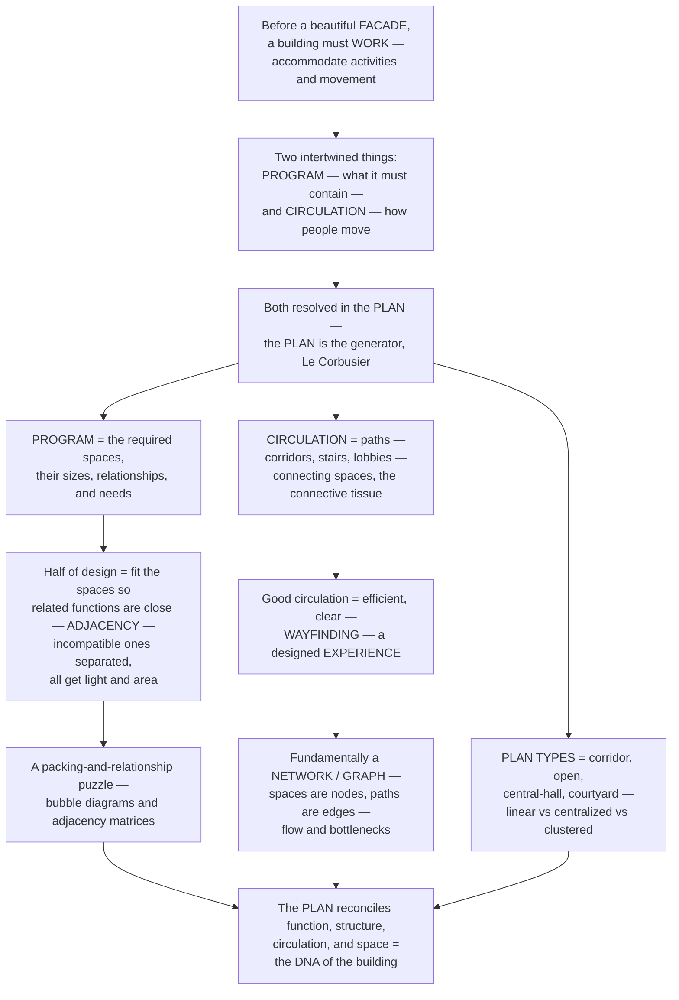

# Circulation, Program, and Plan

> [!abstract] TL;DR
> **Before a building has a beautiful facade, it must *work* — it must accommodate the activities of the people inside and let them move through it sensibly.** That functional core comes down to three intertwined things, all resolved from above in the *plan*: the **PROGRAM** (the list of spaces a building must contain and their required sizes, needs, and relationships), **CIRCULATION** (the system of paths — corridors, stairs, elevators, lobbies — by which people and goods move between those spaces), and the **PLAN** itself (the two-dimensional arrangement that reconciles both — which Le Corbusier called *"the generator"*). Half of design is a packing-and-relationship puzzle: fit every required space so related functions are **adjacent**, incompatible ones are **separated**, and each gets its light, access, and area — worked out with **bubble diagrams** and **adjacency matrices**. Circulation is the building's *connective tissue*, and good circulation is efficient, clear enough to navigate (**wayfinding**), and can become a designed *experience* like the grand stair or the architectural promenade. Because circulation is fundamentally a **network** — spaces are nodes, paths are edges — architects reason about **flow, bottlenecks, and connectivity**, which is exactly why **space-syntax** analysis can predict movement and social encounter from a plan alone. Different **plan types** — the double-loaded corridor, the open plan, the central hall, the courtyard — organise the same program differently. The plan is the **DNA of the building**: where function, structure, circulation, and space are all reconciled.

---

## Intuition

**Analogy — the dinner-party host and the body's circulation.** Before you fuss over the paint colour or the shape of the front door, imagine you are hosting a big party in a house you get to design from scratch. First you write down *what the house must contain* and how large each part must be — a kitchen, a dining room, a coat closet, enough bathrooms — and you immediately start solving a puzzle of *relationships*: the kitchen must sit next to the dining room, the coat closet near the front door, the noisy speaker far from where grandma will sit, the guest bathroom *not* opening straight onto the buffet. That list-and-relationship puzzle is the **PROGRAM**. Next you think about how people will *move*: they come through the door — then where? Is there one narrow hallway everyone jams into, or a smooth loop? Where are the stairs? That is **CIRCULATION** — and if you get it wrong, thirty guests bottleneck at a single doorway while the far rooms sit empty. Finally you draw the whole thing *from above*, choosing the one arrangement that makes all of this work at once. That drawing is the **PLAN**.

In the technical domain this maps almost exactly onto how architects work. The rooms you serve — bedrooms, offices, operating theatres — are the **"served" spaces**; the corridors, stairs, ducts, and lobbies that connect and supply them are the **"servant" connective tissue**, just as arteries and corridors serve the organs of a body or the districts of a city. The program is a *constraint-satisfaction and packing problem* that designers externalise as **bubble diagrams** and **adjacency matrices**; circulation is a *network* whose flow and bottlenecks can be measured. And the plan is where all of it — plus structure, light, and site — is reconciled at once. This is why Le Corbusier insisted *"the plan is the generator … the plan holds in itself the essence of sensation"*: solve the plan and you have solved how the building **works**, long before you have decided how it looks.

---

## How It Works

### Core mechanics

Designing how a building works means resolving *program* and *circulation* together in *plan* — the functional logic beneath the form:

1. **The program (the "brief") — what the building must contain.** Programming is the design activity of listing the required **spaces**, their **areas** (in net square metres), and their functional **needs** (daylight, ventilation, plumbing, structural clearances, security) and, crucially, their **relationships** — which spaces must be *near* which, and which must be kept *apart*. A hospital's brief demands operating rooms beside recovery and sterile supply; a house demands the kitchen beside the dining room; a school demands classrooms grouped and buffered from the noisy gym. Half of architectural design is simply solving this puzzle so that everything fits and every relationship is honoured.
2. **Space planning — adjacency, separation, and zoning.** The core moves are **adjacency** (place related functions next to each other — kitchen/dining, OR/recovery), **separation** (hold incompatible functions apart — noisy/quiet, public/private, clean/dirty, served/servant), and **zoning** (group spaces by function, by a **privacy gradient** from public to private, or into **served and servant** spaces — Louis Kahn's distinction between the rooms people occupy and the "servant" cores of stairs, ducts, and toilets that serve them). Designers work this out with **bubble/relationship diagrams** and **adjacency matrices**, treating layout as a **constraint-satisfaction / optimisation** problem.
3. **Circulation — the connective tissue and its elements.** Circulation is the system of **paths** — corridors, hallways, **stairs**, **elevators**, escalators, ramps, lobbies, atria, streets, and bridges — that link the spaces and carry the movement of people and goods. Its classic **elements** are the *approach*, the *entrance / threshold*, the *path*, the *node* or intersection, and the *vertical circulation* that stitches floors together. Good circulation is **efficient** (appropriately direct — but not always the *shortest*), **legible** for **wayfinding** (you can orient yourself and find your way — Kevin Lynch's *legibility*, built from landmarks, edges, nodes, and clear sequence), *separated by flow type* (public / service / emergency), sized for **capacity** and safe **egress**, and — at its best — a designed **experience**: the procession, the grand stair, the *architectural promenade*.
4. **Circulation as a network — the graph view and space syntax.** Circulation and spatial connectivity form a **network / graph**: spaces are **nodes**, connections are **edges**. This lets designers reason quantitatively about **shortest paths**, **flow**, **bottlenecks**, and **connectivity** — and underlies **space syntax** (Bill Hillier), which analyses the *configuration* of a plan (measuring **integration**, **connectivity**, and **depth**) and shows that the layout of paths alone **predicts** patterns of movement, co-presence, encounter, and even social and economic life — the "social logic of space." Pedestrian- and crowd-flow **simulation** extends the same idea to evacuation and busy public buildings.
5. **Plan types and the plan as synthesis.** The same program can be organised by different **plan types / parti** — the **corridor / double-loaded** plan, the **open** plan, the central-**hall** plan, the **courtyard / atrium** plan, the loft, the pavilion — and by different spatial **organisations**: **centralised**, **linear**, **radial**, **clustered**, and **grid** (Francis Ching). The **plan** is where **program**, **circulation**, **structure** (the structural grid), **space**, and **site** are all reconciled; its **poché** (the solid, inhabited thickness of walls and servant zones) and its figure-ground are read together. Function may be *the generator* — or form may be — but in the mature view the two are conceived at once, with **flexibility** and *loose fit* built in so the building can accommodate change.

### Flow / Architecture



---

## Key Concepts

**Secondary (can explain to a bright 16-year-old):**
- **A building must work before it can be pretty.** Whatever it looks like from outside, a building has to hold the *right rooms* and let people *get around* inside. Those two jobs are the **program** (what rooms you need) and **circulation** (how you move between them).
- **The program is a fitting puzzle.** You make a list — kitchen, dining room, bedrooms, bathrooms — with a size for each, and rules about what goes next to what: kitchen near dining, bathroom *not* next to the dining table. Getting all the pieces to fit and honour those rules is half of designing a building.
- **Circulation is the building's hallways and stairs.** These are the "connective tissue." Good ones are short where they need to be, easy to *find your way* through (**wayfinding**), and safe to get out of in a fire.
- **The plan is the map seen from above.** It shows how all the rooms and hallways are arranged. Le Corbusier said "the plan is the generator" — get the plan right and you have basically got the building right.

**Undergraduate (needs some background):**
- **Programming and net-to-gross.** A brief specifies **net** (usable) areas per space and their relationships; the built **gross** area also includes circulation, walls, and services. The ratio of usable space to total (the **net-to-gross** or *efficiency* ratio) is a key metric — too much corridor wastes money and land, too little strangles movement.
- **Zoning by adjacency, separation, and gradient.** Real plans are organised by **adjacency matrices** (rooms scored strong / neutral / must-not-be-adjacent), by a **public-to-private gradient**, and by **served/servant** separation (Kahn) — the machinery of a building (stairs, ducts, toilets) pulled into dedicated cores so the served rooms stay clear and flexible.
- **Circulation types and elements.** Ching's patterns — **linear, radial, spiral, grid, network** — describe how paths are configured; the elements (approach, threshold, path, node, vertical circulation) describe the experience of moving. Codes govern **egress**: minimum widths, travel distances, two independent exits, so capacity and life-safety are met.
- **Plan types as parti.** The **double-loaded corridor** (rooms on both sides of a central hall — efficient, used in hotels, hospitals, schools) versus the **open plan**, **central-hall**, and **courtyard** types are *parti diagrams* — the big organising idea from which the rest of the design flows.
- **The graph view.** Model the plan as a graph and you can compute travel distances, find **shortest paths**, size corridors for **flow**, and locate **bottlenecks** — the same toolkit used for transport and utility networks.

**Graduate (system-level thinking):**
- **Space syntax and configuration.** Hillier and Hanson's method treats the plan as a *configuration* and derives measures — **integration** (how shallow/accessible a space is from all others), **connectivity**, **depth**, and axial/visibility graphs — that *predict* pedestrian movement and encounter with striking accuracy. The radical claim of *The Social Logic of Space* is that the arrangement of paths is itself a **social technology**: it structures who meets whom, and thus community, surveillance, and even retail vitality. Configuration, not just the rooms, is the object of design.
- **Programming as constraint satisfaction and optimisation.** Space planning is formally a **facility-layout / quadratic-assignment** problem: minimise total weighted travel or maximise satisfied adjacencies subject to area, shape, and site constraints. It is NP-hard in general, which is why designers use heuristics — bubble diagrams, force-directed relaxation, and now generative/parametric layout tools — rather than exact solution. The trade-off between **functional efficiency** and **spatial/formal quality** is a genuine multi-objective tension, not a solved problem.
- **Servant/served, poché, and the deep structure of the plan.** Kahn's served/servant, the **poché** of thick inhabited walls, and the *figure-ground* reading of the plan express a theory that a building's organisation has a *deep structure* — a diagram — that persists beneath stylistic surface. The best plans read clearly as a single idea (a *parti*) while resolving dozens of competing constraints.
- **Flexibility, loose fit, and typology.** Because programs *change*, resilient plans are designed for **adaptability** — generic structural grids, "loose fit" (long-life buildings loosely matched to short-life uses), and separation of *shearing layers* (structure vs. services vs. space plan, each changing at its own rate). Program shapes building **type** (the hospital, the school, the airport each have a characteristic circulatory diagram), and the perennial debate — *function as generator* vs. *form as generator* — is really about which layer leads the design.

---

## Python Demo

```python
# Circulation, Program & Plan: the functional organization of a building, quantitatively.
# (a) PROGRAM as a GRAPH: rooms = nodes, desired ADJACENCIES = weighted edges
#     (positive = keep close, negative = keep apart). A force-directed layout turns those
#     relationships into a "bubble diagram" -- the opening move of space planning.
# (b) CIRCULATION as a NETWORK: compare PLAN TYPES (double-loaded corridor vs central hall
#     vs courtyard loop) by all-pairs shortest travel distance -- quantifying the trade-offs.
# Requires: numpy, matplotlib
import numpy as np
import matplotlib.pyplot as plt

rng = np.random.default_rng(7)

# ----------------------------------------------------------------------
# (a) PROGRAM as a weighted adjacency graph
# ----------------------------------------------------------------------
rooms = ["Entry", "Living", "Dining", "Kitchen", "Bed", "Bath", "Garage", "Study"]
n = len(rooms)
idx = {r: i for i, r in enumerate(rooms)}

# desired adjacency: (+) want close, (-) keep apart, 0 neutral
pairs = {
    ("Entry", "Living"): 3, ("Living", "Dining"): 3, ("Dining", "Kitchen"): 3,
    ("Kitchen", "Garage"): 2, ("Entry", "Garage"): 2, ("Living", "Study"): 1,
    ("Bed", "Bath"): 3, ("Bed", "Study"): 2, ("Living", "Bed"): 1,
    ("Bed", "Kitchen"): -2, ("Bath", "Dining"): -3, ("Garage", "Bed"): -2,
}
W = np.zeros((n, n))
for (a, b), w in pairs.items():
    W[idx[a], idx[b]] = W[idx[b], idx[a]] = w

# --- force-directed layout: adjacency pulls together, repulsion + negatives push apart ---
P = rng.normal(size=(n, 2))
k = 1.0
for step in range(600):
    disp = np.zeros((n, 2))
    for i in range(n):
        d = P[i] - P                       # vectors pointing from every node TO node i
        dist = np.linalg.norm(d, axis=1)
        dist[i] = 1.0
        u = d / dist[:, None]              # unit directions
        rep = (k * k / dist)[:, None] * u  # baseline repulsion between all pairs
        rep[i] = 0
        att = np.zeros((n, 2))
        pos = W[i] > 0                      # attraction along desired adjacencies
        att[pos] = -(W[i][pos] * dist[pos] / k)[:, None] * u[pos]
        neg = W[i] < 0                      # extra repulsion for incompatible pairs
        rep[neg] += ((-W[i][neg]) * k * k / dist[neg])[:, None] * u[neg]
        disp[i] = (rep + att).sum(axis=0)
    temp = 0.15 * (1 - step / 600) + 0.01  # cooling: cap each node's move
    dlen = np.linalg.norm(disp, axis=1, keepdims=True)
    P += disp / np.maximum(dlen, 1e-9) * np.minimum(dlen, temp)
    P -= P.mean(axis=0)

zone = {"Entry": "public", "Living": "public", "Dining": "public", "Kitchen": "public",
        "Bed": "private", "Bath": "private", "Study": "private", "Garage": "service"}
zcol = {"public": "#e76f51", "private": "#2a9d8f", "service": "#8d99ae"}

# ----------------------------------------------------------------------
# (b) CIRCULATION as a network: PLAN-TYPE efficiency via all-pairs shortest paths
# ----------------------------------------------------------------------
INF = 1e9

def floyd(A):                              # Floyd-Warshall all-pairs shortest path
    D = A.copy()
    for kk in range(D.shape[0]):
        D = np.minimum(D, D[:, kk:kk + 1] + D[kk:kk + 1, :])
    return D

def build(edges, N):
    A = np.full((N, N), INF)
    np.fill_diagonal(A, 0.0)
    for a, b, w in edges:
        A[a, b] = A[b, a] = w
    return A

def mean_room_dist(edges, N, nrooms=6):    # mean shortest travel distance among rooms
    D = floyd(build(edges, N))
    sub = D[:nrooms, :nrooms]
    return sub[np.triu_indices(nrooms, 1)].mean()

# 6 rooms are indices 0..5; circulation nodes take higher indices.
# Double-loaded corridor: spine C6-C7-C8, two rooms hang off each corridor node.
dl = [(6, 7, 2), (7, 8, 2), (0, 6, 1), (1, 6, 1),
      (2, 7, 1), (3, 7, 1), (4, 8, 1), (5, 8, 1)]
# Central hall: single hall node 6, every room attaches to it.
ch = [(i, 6, 1.5) for i in range(6)]
# Courtyard loop: rooms form a ring around an open court.
cy = [(i, (i + 1) % 6, 2) for i in range(6)]

plans = ["Double-loaded\ncorridor", "Central\nhall", "Courtyard\nloop"]
means = [mean_room_dist(dl, 9), mean_room_dist(ch, 7), mean_room_dist(cy, 6)]

# ----------------------------------------------------------------------
# Plots
# ----------------------------------------------------------------------
fig, axs = plt.subplots(2, 2, figsize=(13, 11))

# (a-i) adjacency matrix -- the program's relationships
ax = axs[0, 0]
im = ax.imshow(W, cmap="RdBu", vmin=-3, vmax=3)
ax.set_xticks(range(n)); ax.set_xticklabels(rooms, rotation=45, ha="right", fontsize=8)
ax.set_yticks(range(n)); ax.set_yticklabels(rooms, fontsize=8)
ax.set_title("PROGRAM as an ADJACENCY MATRIX\nblue = want close,  red = keep apart")
fig.colorbar(im, ax=ax, fraction=0.046, pad=0.04)

# (a-ii) resulting bubble diagram from the force-directed layout
ax = axs[0, 1]
for i in range(n):
    for j in range(i + 1, n):
        if W[i, j] > 0:
            ax.plot([P[i, 0], P[j, 0]], [P[i, 1], P[j, 1]],
                    color="#6c757d", lw=W[i, j], alpha=0.6, zorder=1)
        elif W[i, j] < 0:
            ax.plot([P[i, 0], P[j, 0]], [P[i, 1], P[j, 1]],
                    color="#e63946", lw=1.0, ls=":", alpha=0.7, zorder=1)
for i, r in enumerate(rooms):
    ax.scatter(P[i, 0], P[i, 1], s=1400, color=zcol[zone[r]],
               edgecolor="k", zorder=2, alpha=0.9)
    ax.text(P[i, 0], P[i, 1], r, ha="center", va="center", fontsize=8, zorder=3)
ax.set_title("BUBBLE DIAGRAM: layout that satisfies the program\n"
             "adjacencies pull together, incompatibilities push apart")
ax.set_aspect("equal"); ax.axis("off")

# (b-i) one circulation network with a highlighted shortest path
ax = axs[1, 0]
posn = {0: (0, 1), 1: (0, -1), 2: (2, 1), 3: (2, -1), 4: (4, 1), 5: (4, -1),
        6: (0, 0), 7: (2, 0), 8: (4, 0)}
for a, b, w in dl:
    ax.plot([posn[a][0], posn[b][0]], [posn[a][1], posn[b][1]],
            color="#adb5bd", lw=2, zorder=1)
path = [(0, 6), (6, 7), (7, 8), (8, 5)]                 # shortest route Bed R0 -> Room R5
for a, b in path:
    ax.plot([posn[a][0], posn[b][0]], [posn[a][1], posn[b][1]],
            color="#7209b7", lw=4, zorder=2)
for nd, (x, y) in posn.items():
    room_node = nd < 6
    ax.scatter(x, y, s=900 if room_node else 500,
               color="#457b9d" if room_node else "#ffb703",
               edgecolor="k", zorder=3)
    ax.text(x, y, ("R%d" % nd) if room_node else "cor", ha="center", va="center",
            fontsize=8, zorder=4)
ax.set_title("CIRCULATION as a NETWORK: rooms = nodes, corridors = edges\n"
             "purple = shortest path from R0 to R5 (a graph problem)")
ax.set_aspect("equal"); ax.axis("off")

# (b-ii) plan-type efficiency: mean travel distance among rooms
ax = axs[1, 1]
bars = ax.bar(plans, means, color=["#457b9d", "#2a9d8f", "#e76f51"])
for b, m in zip(bars, means):
    ax.text(b.get_x() + b.get_width() / 2, m + 0.05, "%.2f" % m, ha="center", fontsize=9)
ax.set_ylabel("mean shortest travel distance between rooms")
ax.set_title("PLAN TYPES compared on circulation efficiency\n"
             "central hall is shortest -- but funnels ALL flow through one node")
ax.set_ylim(0, max(means) * 1.25)

plt.tight_layout()
plt.savefig("circulation_program_plan.png", dpi=120)
plt.show()

# Takeaways:
#  (a) The PROGRAM is a network/optimization problem. An adjacency matrix scores which
#      rooms want to be close (blue) or apart (red); a force-directed layout relaxes that
#      into a BUBBLE DIAGRAM where public/private/service zones self-separate -- the first,
#      pre-geometric move of space planning.
#  (b) CIRCULATION is a graph. Modeling rooms as nodes and corridors as edges lets us find
#      SHORTEST PATHS and compare PLAN TYPES: the central hall minimizes mean travel distance
#      but concentrates every trip through one node (a bottleneck / single point of failure),
#      the double-loaded corridor is a balanced workhorse, and the courtyard loop trades
#      longer average trips for redundancy -- there are always two ways around the ring.
```

Running this yields four panels that trace the design logic end to end. The **adjacency matrix** encodes the *program* as data — blue cells for functions that want to be close, red for pairs that must be separated. The **bubble diagram** is what a force-directed relaxation makes of that matrix: the public rooms (entry/living/dining/kitchen), the private rooms (bed/bath/study), and the service space (garage) *self-organise into zones*, with the incompatible bedroom–kitchen and bath–dining pairs visibly pushed apart. The **circulation network** shows the same building as a graph, with the shortest path from one room to another highlighted — circulation reduced to a classic graph problem. Finally the **plan-type comparison** quantifies the trade-off the whole discipline lives with: the central hall gives the shortest average walk but funnels *every* trip through a single node (a bottleneck), the double-loaded corridor is the balanced workhorse, and the courtyard loop pays with longer trips for the redundancy of always having *two ways around*.

---

## Real-World Applications

> **The hospital (adjacency and separation as life-safety).** No building type is more program-driven. Operating theatres must sit beside recovery, sterile supply, and the surgical stores; the emergency department needs direct ambulance access and a fast path to imaging and theatres; and *clean and dirty flows must never cross* — soiled materials, patients, staff, and visitors travel on separated circulation. Planners resolve this with detailed adjacency matrices and "stacking" diagrams, because a poorly placed department costs nurses kilometres of walking every shift and can cost lives in an emergency. The plan, quite literally, is the machine that heals.

> **Louis Kahn's served and servant spaces (Salk Institute; Richards Medical Labs).** Kahn crystallised programming into a theory: pull the *servant* elements — stairs, ducts, shafts, pipes, toilets — into their own architecturally expressed cores so the *served* laboratory and study spaces remain clear, day-lit, and flexible. At the Salk Institute the interstitial service floors and the flanking study towers are this diagram made monumental; the servant/served split is simultaneously a programming strategy, a circulation strategy, and the building's form.

> **Space syntax at the airport and in the city (Hillier).** Bill Hillier's consultancy used space-syntax *integration* analysis to redesign the movement network of London's **Trafalgar Square** and to plan the circulation of major museums and the **Tate**; the method predicts where crowds will naturally flow and where "dead" under-used space will form — from the plan geometry alone. Airports lean on the same logic plus explicit **wayfinding** design (Lynch-style legibility: clear sightlines, landmarks, consistent signage, and a legible sequence check-in → security → gates) so that first-time visitors navigate a vast building under time pressure without getting lost.

> **The architectural promenade (Le Corbusier's Villa Savoye; Wright's Guggenheim).** Circulation is not only utilitarian — it can be the primary *experience*. At Villa Savoye a gentle **ramp** unspools a choreographed *promenade architecturale* from ground to roof garden; the Guggenheim Museum *is* a single circulation element — a continuous spiral ramp down which the entire visit unfolds. Here the path is the architecture.

> **The office floor plate: open vs. cellular plan.** The perennial workplace debate is a plan-type argument. The **open plan** maximises flexibility, daylight penetration, and chance encounter (high space-syntax integration) but sacrifices acoustic privacy and focus; the **cellular / corridor** plan does the reverse. Contemporary "activity-based" workplaces try to zone both into one plan — a direct, everyday application of adjacency, separation, and circulation design.

---

## Common Pitfalls

- **Treating circulation as leftover space.** Corridors and stairs designed as an afterthought — the gaps between the "real" rooms — produce buildings that are confusing, inefficient, and unpleasant to move through. Circulation is a *primary* design system; it should be shaped deliberately, sized for its flows, and, where it matters, made an experience.
- **Getting the net-to-gross wrong in either direction.** *Too much* circulation (sprawling corridors, oversized lobbies) wastes expensive floor area and land; *too little* creates congestion and fails egress codes. Efficient buildings watch the net-to-gross ratio closely — but "efficient" is not the only goal, and a generous stair or atrium can be worth its area.
- **Ignoring adjacency, imposing chronic travel cost.** Placing related functions far apart — the ward far from its nurses' station, the copy room across the building, the kitchen remote from the dining room — bakes in *permanent* wasted movement. The cost is invisible on the drawing but paid every day for the building's life; adjacency matrices exist precisely to catch this early.
- **Single points of failure and unmanaged bottlenecks.** A plan where all movement funnels through one node (the seductively efficient central hall) or one stair is fast on average but fragile: it congests under load and endangers occupants during evacuation. Codes demand *two independent means of egress* for exactly this reason; good plans provide **redundancy** (alternate paths) where flow and safety require it.
- **Over-applying the open plan.** The open plan is not free flexibility — without acoustic zoning and separation it destroys privacy and concentration, and its high visual/functional integration that helps a café or a trading floor can wreck a space needing focus. Match the plan type to the program, not to fashion.
- **Poor wayfinding (illegibility).** A functionally correct plan can still be a maze. Long undifferentiated corridors, hidden or inconsistent vertical circulation, and no landmarks or sightlines defeat orientation. Legibility — clear sequence, landmarks, daylight and views as cues, decision points at nodes — must be *designed*, not assumed.
- **Freezing the plan against change.** Programs evolve; a plan tuned too tightly to today's brief (load-bearing partitions everywhere, services fused to the layout) resists tomorrow's use and invites premature demolition. Designing for **flexibility** — generic grids, loose fit, separable service layers — is how plans stay useful for decades.

---

## Related Concepts

*This is a section note within **Space, Form, and Design (S04)** of the Architecture vault. Its sibling notes are referenced here in prose rather than as links: it is the **functional-organisation** counterpart to **Space and Spatial Experience** (the phenomenal, three-dimensional experience of the volumes this plan arranges) and to **Composition, Order, and Form** (the ordering principles — axis, hierarchy, rhythm, proportion — that discipline the same plan); it operationalises the workflow described in **The Design Process and Architectural Representation** (where the plan is drawn and the parti is developed) and depends on the foundations in **Architecture Overview and the Art of Building** (the utilitas / "commodity" leg of the Vitruvian triad that this note unpacks). Program shapes type, the theme of **Building Typologies**, and configuration shapes society, the theme of **Architecture, Culture, and Society** (Hillier's "social logic of space"). Together these siblings frame program, circulation, and plan as the functional logic beneath architectural form.*

Cross-vault connections (verified to exist):

- [[Graph_Representation]] — the formal foundation of the "spaces = nodes, paths = edges" model: adjacency lists/matrices are exactly the *adjacency matrix* of space planning.
- [[Dijkstra]] — shortest-path travel distance between spaces on a circulation network; the algorithm behind the demo's "how far is R0 from R5?".
- [[BFS]] — reachability and depth from an entrance — the graph analogue of space-syntax *depth* and of "how many rooms deep is this space?".
- [[DSA/07_Graphs/Network_Flow|Network Flow]] — modelling egress/evacuation as flow with capacities, and finding the corridor/door bottlenecks that limit it (basename path-qualified — a `Network_Flow` note also exists in Optimization).
- [[Network_Science_Fundamentals]] — nodes, edges, degree, and paths; the language in which circulation configuration and connectivity are measured.
- [[Centrality_and_Community_Structure]] — betweenness and closeness centrality are the network-science kin of space-syntax *integration* and *connectivity*, predicting which spaces attract movement.
- [[Urban_and_Infrastructure_Systems]] — the city-scale version of the same idea: street networks, pedestrian flow, and infrastructure as circulation writ large.
- [[Integer_Programming]] — space planning as a facility-layout / quadratic-assignment optimisation: place rooms to maximise satisfied adjacencies subject to area and site constraints.
- [[Mental_Representation]] — cognitive maps (Tolman) and the internal representations behind **wayfinding** and Lynch's legibility — why some plans are navigable and others are mazes.

---

## Review Questions

**Secondary:**
1. You are designing a small house. Give two pairs of rooms that should be placed *next to each other* (adjacency) and one pair that should be kept *apart* (separation), and explain your reasoning for each. Then explain, in your own words, why an architect might say "the plan is the generator."

**Undergraduate:**
2. The same program of six rooms can be organised as a *double-loaded corridor*, a *central hall*, or a *courtyard loop*. Model each as a graph (rooms and circulation as nodes, connections as edges) and compare them on (a) average travel distance between rooms, (b) vulnerability to a bottleneck or single point of failure, and (c) daylight access. Which would you choose for a small clinic, and why? Reference the trade-offs the demo makes quantitative.

**Graduate:**
3. Space syntax claims that the *configuration* of a plan — measured as integration, connectivity, and depth — predicts patterns of movement and social encounter, so that "the plan is a social technology." Explain the mechanism by which spatial layout could shape social outcomes, relate space-syntax *integration* to a network-centrality measure of your choice, and discuss the tension between designing a plan for **functional efficiency** (minimum travel, maximum net-to-gross) and designing it for **spatial/formal quality and social life**. When should the architect deliberately make circulation *less* efficient?

---

## Sources

- Francis D. K. Ching, *Architecture: Form, Space, and Order*, 4th ed. (Wiley) — the standard reference on spatial organisation, circulation types, and plan/parti. [Publisher page](https://www.wiley.com/en-us/Architecture%3A+Form%2C+Space%2C+and+Order%2C+4th+Edition-p-9781118745083)
- Bill Hillier & Julienne Hanson, *The Social Logic of Space* (Cambridge University Press) — the founding text of space syntax and configuration analysis. [DOI / publisher](https://doi.org/10.1017/CBO9780511597237)
- Kevin Lynch, *The Image of the City* (MIT Press) — legibility, wayfinding, and the mental image of the environment (paths, edges, districts, nodes, landmarks). [Publisher page](https://mitpress.mit.edu/9780262620017/the-image-of-the-city/)
- Julius Panero & Martin Zelnik, *Human Dimension and Interior Space* (Watson-Guptill) — anthropometrics, clearances, and the human basis for sizing spaces and circulation. [Archive listing](https://archive.org/details/humandimensionin0000pane)
- Ernst Neufert, *Architects' Data*, 5th ed. (Wiley-Blackwell) — the classic dimensional and programmatic handbook of space requirements by building type. [Publisher page](https://www.wiley.com/en-us/Architects%27+Data%2C+5th+Edition-p-9781119312512)

---

#architecture #circulation #architectural-program #plan #space-syntax
