# Composition, Order, and Form

> [!abstract] TL;DR
> **A building is a crowd of parts — walls, windows, rooms, masses, volumes — and the whole art of design is getting that crowd to behave as one coherent, satisfying WHOLE rather than a jumble.** The means are **composition** and **order**: the *grammar* of architecture, close cousins of the composition principles in painting and music, adapted to three-dimensional, inhabited **form**. Every composition wrestles with one fundamental tension — **unity versus variety**: a design needs enough **order** to feel coherent and calm, but enough **variety** to avoid monotony (too much unity is dull, too much variety is chaos — great design finds *unity in variety*). Architects impose order through a timeless repertoire of **ordering principles**: **axis** (an organizing line), **symmetry** (balance about that axis) and its dynamic counterpart **asymmetrical balance** (equilibrium of unequal parts, like a mobile), **hierarchy** (making some elements dominant to guide the eye), **rhythm and repetition** (recurring elements that create pattern and movement), **datum** (a reference line, plane, or grid that gathers everything), and **proportion and scale**. And beneath composition lies **form** itself — the play of **solid and void**, the **additive and subtractive** shaping of **mass**, the primary geometric solids and their transformations. These are not rigid rules but a repertoire of ordering strategies architects use *consciously* and viewers feel *unconsciously* — the visual and organizational grammar that shapes parts into a meaningful whole.

---

## Intuition

**Analogy — turning a crowd into a choir.** Imagine handing a hundred people the same short phrase and asking them to say it. Let them all speak whenever they like and you get a *jumble* — noise, no meaning. Now give them **order**: a downbeat to start on (an **axis** in time), a leader whose voice rises above the rest (**hierarchy**), a repeating pulse everyone locks onto (**rhythm**), a steady drone note that anchors the harmony (**datum**), a balanced arrangement of high and low voices (**symmetry** or its subtler cousin, **balance**). Suddenly the crowd is a **choir** — the *same* hundred voices, now a single coherent, moving whole. Composition in architecture is exactly this: the art of taking a collection of physical parts and *conducting* them into a unified performance. And just as a choir that sang one endless identical note would bore you to sleep, a building needs **variety** woven through its order — the tension between *unity* (coherence) and *variety* (interest) is the fundamental problem every composition must resolve.

Now make the choir *three-dimensional and inhabited*. The painter composes on a flat rectangle you look *at*; the composer arranges sound you move *through* in time; the architect does both at once, arranging **masses, volumes, planes, openings, and spaces** that you look at *and* walk through, that change as you move, that must also stand up and shelter you. So architectural composition borrows the whole vocabulary of the visual arts — **line, shape, form, balance, rhythm, proportion, figure and ground** — and adds the burden and the gift of the third dimension and real use. The remarkable thing is that we *feel* good composition before we can name it: a well-ordered façade reads as calm and dignified, a chaotic one as agitating, and a monotonous one as dead — long before we consciously spot the axis or count the columns. Learning composition is learning to make *deliberate* what viewers experience *unconsciously*: the grammar by which parts become a satisfying, expressive, legible whole.

---

## How It Works

### Core mechanics

Composing a building means choosing, from a shared repertoire of **ordering principles**, the devices that will gather its parts into a coherent whole — and then shaping the **form** those parts take. Read any well-designed building and you can trace this grammar at work:

1. **The governing problem — unity and variety.** The single deepest question in composition is *how much order?* **Unity** is coherence: the sense that the parts belong together and add up to one legible thing (achieved through consistency, repetition, a controlling geometry, a limited palette). **Variety** is interest: the differences that reward attention and prevent monotony. Too much unity yields something *dull and rigid*; too much variety yields something *chaotic and incoherent*. The classic ideal — **"unity in variety"** (or *unity with variety*) — is a design that is unmistakably *one thing* yet full of incident. Underneath, the eye organizes the field automatically through the **Gestalt principles** — proximity, similarity, closure, continuity, and figure–ground — which is *why* repetition and alignment read as order.
2. **Axis — the organizing line.** An **axis** is an imaginary line, established by two points and reinforced by the elements ranged along or about it, that organizes a composition. It is the oldest and most powerful ordering device: the processional **axis** of a Beaux-Arts plan, the nave of a cathedral, the grand vista of Versailles all march the eye and the body along a controlling spine. An axis implies **movement** and, usually, a **terminus** — something worth arriving at.
3. **Symmetry and its counterpart, dynamic balance.** **Symmetry** is the balanced distribution of equal elements about a shared axis or point — **bilateral** (mirror), **radial**, or **rotational**. It confers *dignity, order, stability, and monumentality* (temples, palaces, capitols) — but can tip into *rigidity or pomposity*. Its opposite is **asymmetrical / dynamic balance** ("occult" balance): the equilibrium of *unequal* parts, balanced not by mirroring but by their **visual moments**, exactly like a mobile or a see-saw where a large mass near the center is balanced by a small one far out. This is the characteristic composition of the **modernists** and the **picturesque** — active, informal, and dynamic rather than static.
4. **Hierarchy — dominant and subordinate.** **Hierarchy** articulates *importance*: it makes some elements **dominant** and others **subordinate** by differences in **size, shape, placement, or elaboration** — the main entrance larger than the side doors, the tower rising over the wings, the dome over the crossing. Hierarchy *guides the eye* (giving the composition a place to begin), and it *expresses meaning* (what matters most is made most visible). Without hierarchy, a composition of equals has no focus and no story.
5. **Rhythm and repetition.** **Repetition** — recurring like elements — is the simplest unifier. **Rhythm** is repetition given *movement*: the regular beat of a colonnade, the recurrence of a window bay, the run of a façade's fenestration. Rhythm may be **regular** (a-a-a), **alternating** (a-b-a-b), **progressive / graduated** (elements changing steadily in size or spacing), or **syncopated** (a regular pattern deliberately broken for accent). Rhythm creates *pattern, tempo, and a sense of motion* even in a static object.
6. **Datum — the anchoring reference.** A **datum** is a line, plane, volume, or grid that, by its regularity and continuity, *gathers* otherwise disparate elements into relationship — a strong base line, a cornice, a spine wall, a structural grid, a repeating floor plane. The datum works as a *reference*: elements read as ordered *because* they align to, sit on, or are contained by it.
7. **Proportion, scale, and transformation.** **Proportion** (the mathematical relationships among the parts and to the whole) and **scale** (size relative to the human body and to context) tune the composition's *harmony* and *presence*. **Transformation** — dimensional, additive, or subtractive change of a formal theme — lets a designer generate variety within unity by developing one idea through a family of related moves.
8. **Form — the shaping of mass and void.** Beneath composition lies the vocabulary of **form**: the primary **shapes** and **Platonic solids** (square/cube, circle/sphere, triangle/pyramid) and their meanings; **additive** form (built up by aggregating volumes) versus **subtractive** form (carved away from a mass); the play of **solid and void** (the mass and the space it displaces, **figure and ground**); the treatment of **mass, volume, and silhouette**; and the composition of the **façade** — the "face" of the building, ordered by its openings, its solid-to-void ratio, and its layering. Form carries *meaning*: shapes are read as stable or dynamic, austere or exuberant, sacred or civic.

### Flow / Architecture

```mermaid
graph TD
    A["How do you organize a collection of parts —<br/>walls, windows, rooms, masses, volumes —<br/>into a coherent WHOLE, not a jumble?"] --> B["COMPOSITION and ORDER =<br/>the GRAMMAR of design"]
    B --> C["Cousins of composition in painting and music,<br/>adapted to three-dimensional inhabited FORM"]
    C --> D["The core tension = UNITY vs VARIETY<br/>order for coherence, variety for interest —<br/>find the balance: unity in variety"]
    D --> E["ORDERING PRINCIPLES —<br/>the designer's repertoire"]
    E --> F["AXIS — an organizing line<br/>about which elements are arranged"]
    F --> G["SYMMETRY — balance about an axis<br/>and ASYMMETRICAL BALANCE —<br/>dynamic equilibrium of unequal parts"]
    G --> H["HIERARCHY — dominant and subordinate,<br/>guiding the eye and expressing importance"]
    H --> I["RHYTHM and REPETITION —<br/>recurring elements, pattern and movement"]
    I --> J["DATUM — a line, plane, or grid<br/>that gathers and organizes elements"]
    J --> K["PROPORTION and SCALE —<br/>tuning harmony and presence"]
    K --> L["FORM = solid and void,<br/>additive and subtractive MASS,<br/>primary geometric forms and transformations"]
    L --> M["Not rigid rules but a REPERTOIRE —<br/>used consciously, felt unconsciously"]
    M --> N["Parts shaped into a MEANINGFUL WHOLE"]
```



---

## Key Concepts

**Secondary (can explain to a bright 16-year-old):**
- **Order turns a pile into a design.** A building is made of many parts. If they are just heaped together it looks like a mess; if they are *arranged* with a plan they look like one coherent thing. That arranging is **composition**.
- **Unity vs. variety — the balancing act.** A design needs to feel like *one thing* (unity) but also have enough *interesting differences* (variety). All-same is boring; all-different is chaos. Good design is **"unity in variety."**
- **The order toolkit.** Architects line things up on an **axis**, arrange them evenly on both sides (**symmetry**), make the most important part biggest (**hierarchy**), repeat elements in a beat (**rhythm**), and anchor everything to a strong reference line (**datum**).
- **Balance without a mirror.** A design does not have to be symmetrical to feel balanced. Like a see-saw, a *big* thing close to the middle can balance a *small* thing far out — this is **asymmetrical balance**, and it feels lively rather than stiff.
- **Form is solid and empty space.** A building is not only its walls (**solid**) but also the spaces and openings (**void**). Designers shape both — building volumes up (**additive**) or carving them away (**subtractive**).

**Undergraduate (needs some background):**
- **Composition is a grammar, not a rulebook.** The ordering principles — Ching's classic set of **axis, symmetry, hierarchy, rhythm, datum, and transformation** — are a *repertoire* of strategies, deployed and combined judgmentally, not a formula. Their job is to make a design **legible**: readable as an organized whole.
- **Two roads to equilibrium.** **Symmetry** (formal/static balance) achieves order by *mirroring equal parts about an axis* — powerful for monumentality and calm, risky for rigidity. **Asymmetrical / dynamic balance** achieves order by *balancing visual moments* — weight times distance from a center — so unequal elements hold each other in a lively, informal equilibrium. The shift from the former to the latter is one of the defining moves from classical to modern composition.
- **Hierarchy is how a composition is "read."** By manipulating **size, shape, placement, and elaboration**, the designer creates a *dominant* element that captures attention first, then ranked *subordinates* — establishing a sequence of attention and expressing the relative importance of parts (entrance, principal room, tower). A composition of undifferentiated equals is inert.
- **Rhythm has grammar too.** Beyond simple **regular** repetition lie **alternation** (a-b-a-b), **gradation/progression** (a steady change in size or interval), and **syncopation** (a break in the pattern for emphasis) — the same devices a composer uses, producing tempo and movement across a static façade.
- **The datum organizes without dominating.** A **datum** need not be a visible "focus"; its power is *relational*. A shared base line, cornice, grid, or spine gives scattered elements a common reference, so they read as belonging to one order. Grids are the most pervasive datum in modern architecture.
- **Form and its transformations.** The **primary solids** (cube, sphere, pyramid, cylinder, cone) are the raw vocabulary; **additive** and **subtractive** operations, and **dimensional / configurational transformations**, develop them into architectural form while keeping a legible family resemblance — variety generated *from* a unifying theme.

**Graduate (system-level thinking):**
- **Composition as the reconciliation of all demands.** Mature ordering is not applied *to* a building as decoration; it *emerges from* the integration of structure, program, site, and construction. The Beaux-Arts **parti** — the single organizing diagram or concept of a scheme — is precisely a compositional idea that *resolves* functional, structural, and formal demands into one order. Order that ignores those demands is arbitrary and brittle.
- **The classical / modern / parametric turn.** Three broad compositional paradigms coexist: the **classical / Beaux-Arts** tradition of axial, hierarchical, symmetrical composition governed by the orders and proportion; the **modernist** turn to *free, asymmetrical, dynamic* composition (De Stijl's sliding planes, the "free plan," balance-by-moment rather than by mirror); and **contemporary / parametric** approaches where ordering is generated by rules, fields, and algorithms rather than fixed axes. Each redefines what "order" *is* while pursuing the same end — a coherent, expressive whole.
- **Order, complexity, and the aesthetics of pattern.** There is a perceptual and cognitive basis to our sense of order: the brain rewards *processing fluency* and pattern, yet also craves the stimulation of complexity — which frames beauty as an optimal balance of **order and complexity** (too little is boring, too much is overwhelming). Robert Venturi's *Complexity and Contradiction in Architecture* was a direct polemic *against* pure, reductive order and *for* "messy vitality" — richness, ambiguity, and the "difficult whole." The debate over how much order is *too much* is one of the central arguments of architectural theory.
- **Gestalt, figure–ground, and legibility.** The **Gestalt** laws of perceptual organization (proximity, similarity, closure, continuity, common fate, figure–ground) are the low-level machinery that makes composition *work* on the viewer: alignment reads as order because of *continuity*; a colonnade reads as a unit because of *proximity* and *similarity*; a courtyard reverses **figure and ground**. Composition, at bottom, is the deliberate steering of these automatic perceptual processes.
- **Ordering as discipline and as freedom.** The deepest reading is dialectical: ordering principles are simultaneously a *constraint* (a discipline that guarantees coherence) and a *generative freedom* (a repertoire that opens possibilities). The greatest architects neither ignore the grammar nor obey it slavishly — they *speak* it, bending and breaking rules for expressive effect the way a great writer bends syntax, always in service of the "difficult whole."

---

## Python Demo

```python
# Composition, Order & Form: quantifying the grammar of design.
# (a) TWO ROADS TO BALANCE:
#     (i)  BILATERAL SYMMETRY  - a facade mirrored about a central axis (equal parts,
#          moments cancel by construction: the classical / monumental order).
#     (ii) ASYMMETRICAL BALANCE - unequal elements balanced like a see-saw: a LARGE mass
#          near the center balanced by a SMALL mass far out, so visual MOMENTS balance
#          (weight x distance) despite visual inequality: the modernist composition.
# (b) RHYTHM & REPETITION  - regular, alternating (ABAB), graduated, and syncopated
#     patterns of elements - and HIERARCHY - ranking elements by "visual weight" so one
#     dominant element leads the eye and subordinates follow.
# Requires: numpy, matplotlib
import numpy as np
import matplotlib.pyplot as plt
from matplotlib.patches import Rectangle

fig, axs = plt.subplots(2, 2, figsize=(13, 9))

# ---------- (a-i) BILATERAL SYMMETRY: a facade mirrored about a central axis ----------
ax = axs[0, 0]
# window bays placed symmetrically about the axis x = 0; equal visual weights
pos = np.array([-4.0, -2.0, 2.0, 4.0])      # window-bay centers (mirror pairs)
wts = np.array([1.0, 1.0, 1.0, 1.0])        # equal visual weight per bay
ax.add_patch(Rectangle((-5.2, 0), 10.4, 4.6, fill=False, ec="#333", lw=1.5))  # facade
for x in pos:                                # the mirrored window bays
    ax.add_patch(Rectangle((x-0.55, 1.2), 1.1, 2.4, fc="#a8dadc", ec="#333"))
ax.add_patch(Rectangle((-0.7, 0), 1.4, 2.6, fc="#457b9d", ec="#333"))  # central door on axis
ax.axvline(0, color="#c1121f", ls="--", lw=2)                          # the axis of symmetry
moment_sym = float(np.sum(wts * pos))        # first moment about the axis
ax.text(0, 5.05, "AXIS OF SYMMETRY", color="#c1121f", ha="center", fontsize=9, weight="bold")
ax.text(0, -0.9, f"sum of (weight x distance) about axis = {moment_sym:.1f}\n"
                 "equal parts mirror -> perfect static balance",
        ha="center", fontsize=8, bbox=dict(boxstyle="round", fc="#ffe8d6", ec="grey"))
ax.set_title("BILATERAL SYMMETRY\nbalance by MIRRORING equal parts (classical order)")
ax.set_xlim(-6, 6); ax.set_ylim(-1.6, 5.6); ax.set_aspect("equal"); ax.axis("off")

# ---------- (a-ii) ASYMMETRICAL / DYNAMIC BALANCE: unequal parts, equal moments ----------
ax = axs[1, 0]
# see-saw about a fulcrum at x = 0: big mass near center vs small mass far out
big_w, big_x   = 4.0, -1.0     # large element, close in
small_w, small_x = 1.0,  4.0   # small element, far out
ax.plot([-5.5, 5.5], [0, 0], color="#333", lw=3)          # the balance beam
ax.plot([0], [0], marker="^", ms=18, color="#c1121f")     # the fulcrum
# draw the two unequal masses (marker area proportional to visual weight)
ax.scatter([big_x],  [0.55], s=big_w*900,   color="#457b9d", zorder=3)
ax.scatter([small_x],[0.35], s=small_w*900, color="#2a9d8f", zorder=3)
m_left  = big_w   * abs(big_x)      # visual moment of the large element
m_right = small_w * abs(small_x)    # visual moment of the small element
ax.text(big_x,   1.7, f"LARGE\nw={big_w:.0f}, d={abs(big_x):.0f}\nmoment={m_left:.0f}",
        ha="center", fontsize=8)
ax.text(small_x, 1.4, f"small\nw={small_w:.0f}, d={abs(small_x):.0f}\nmoment={m_right:.0f}",
        ha="center", fontsize=8)
ax.text(0, -1.4, f"moments balance: {m_left:.0f} = {m_right:.0f}   ->   dynamic equilibrium\n"
                 "unequal parts, balanced by weight x distance (modernist composition)",
        ha="center", fontsize=8, bbox=dict(boxstyle="round", fc="#e9f5db", ec="grey"))
ax.set_title("ASYMMETRICAL BALANCE\nbalance by MOMENTS of unequal parts (dynamic order)")
ax.set_xlim(-6, 6); ax.set_ylim(-2.2, 2.6); ax.set_aspect("equal"); ax.axis("off")

# ---------- (b-i) RHYTHM & REPETITION: four kinds of ordered recurrence ----------
ax = axs[0, 1]
n = 9
xr = np.arange(n)
patterns = {
    "regular  a-a-a":        (np.ones(n)*0.6, np.zeros(n)),                    # equal, even
    "alternating  a-b-a-b":  (np.where(xr % 2 == 0, 0.75, 0.4), np.zeros(n)),  # two sizes
    "graduated / progression":(0.3 + 0.06*xr, np.zeros(n)),                    # steady growth
    "syncopated  (accent)":  (np.ones(n)*0.5, np.where(xr == 5, 0.6, 0.0)),    # one break
}
for row, (name, (sizes, offset)) in enumerate(patterns.items()):
    y = -row
    for xi, s, off in zip(xr, sizes, offset):
        ax.add_patch(Rectangle((xi + off - s/2, y - s/2), s, s,
                               fc="#8d99ae" if off == 0 else "#e63946", ec="#333"))
    ax.text(-1.4, y, name, ha="right", va="center", fontsize=8)
ax.set_title("RHYTHM & REPETITION\nrecurring elements make pattern & movement")
ax.set_xlim(-5.0, 9.5); ax.set_ylim(-3.8, 1.0); ax.set_aspect("equal"); ax.axis("off")

# ---------- (b-ii) HIERARCHY: rank elements by visual weight; the eye follows ----------
ax = axs[1, 1]
labels  = ["Tower /\ndominant", "Main\nentrance", "Wing", "Bay", "Detail"]
weight  = np.array([10.0, 6.0, 3.5, 2.0, 1.0])   # illustrative visual weight / salience
order   = np.argsort(-weight)                    # reading order: strongest first
colors  = ["#1d3557", "#457b9d", "#8d99ae", "#a8dadc", "#cdd6db"]
bars = ax.bar(range(len(labels)), weight, color=colors, ec="#333")
for rank, idx in enumerate(order, start=1):      # annotate the path of attention 1,2,3...
    ax.text(idx, weight[idx] + 0.3, f"eye #{rank}", ha="center", fontsize=8, weight="bold")
ax.set_xticks(range(len(labels))); ax.set_xticklabels(labels, fontsize=8)
ax.set_ylabel("visual weight / salience")
ax.set_title("HIERARCHY\ndominant vs subordinate elements guide attention")
ax.set_ylim(0, 12)

plt.tight_layout()
plt.savefig("composition_order_and_form.png", dpi=120)
plt.show()

# Takeaways:
#  (a) There are TWO roads to visual equilibrium. SYMMETRY balances by MIRRORING equal
#      parts about an axis - the moment about the axis is zero by construction, giving a
#      static, dignified, classical order. ASYMMETRICAL BALANCE balances by MOMENTS -
#      weight x distance - so a LARGE mass near the center can be held in equilibrium by a
#      SMALL mass far out, exactly like a see-saw: unequal parts, equal moments, a dynamic
#      and informal (modernist) order.
#  (b) RHYTHM turns repetition into movement - regular, alternating, graduated, or
#      syncopated - while HIERARCHY ranks elements by visual weight so a dominant element
#      leads the eye and subordinates follow, giving the composition a place to begin and
#      a story to tell. Together: order that is coherent yet full of interest -> unity in variety.
```

Running this produces four panels that make the grammar of composition quantitative. Panel one shows a **bilaterally symmetrical façade** whose mirrored bays make the first moment about the central axis vanish — static, classical balance. Panel two shows **asymmetrical balance** as a see-saw, where a *large* mass close to the fulcrum is held in equilibrium by a *small* mass far out (equal *moments*, unequal parts) — the dynamic, modernist path to the same visual stability. Panel three lays out the four grammars of **rhythm** — regular, alternating, graduated, and syncopated. Panel four ranks elements by **visual weight** to show how **hierarchy** sequences attention. Together they dramatize the chapter's thesis: *order for coherence, variety for interest — unity in variety.*

---

## Real-World Applications

> **Palladio's Villa Rotonda (perfect symmetry as dignity).** Andrea Palladio's villa near Vicenza is a masterclass in **bilateral and rotational symmetry**: a central domed rotunda with four identical temple-front porticoes, the whole composition balanced about crossing axes and governed by harmonic **proportion**. The result reads instantly as calm, ordered, and monumental — order pushed to its classical limit, where symmetry itself carries the meaning of dignity and repose.

> **Versailles and the Beaux-Arts axis (order at the scale of a landscape).** The palace, gardens, and town of Versailles are organized by one colossal **processional axis** that runs from the town through the palace and out along the Grand Canal to the horizon. Axis, symmetry, and **hierarchy** (the king's apartments at the compositional center) turn a vast collection of buildings, parterres, and waterworks into a single legible order — the Beaux-Arts principle of axial composition writ across kilometres.

> **A classical colonnade or a Georgian terrace (rhythm made architecture).** The repeating columns of the Parthenon's peristyle, or the regular window bays of a Georgian street, are **rhythm and repetition** in their purest architectural form — a steady beat that unifies the whole while the eye travels along it. Alter that beat (a wider central bay, a pedimented centerpiece) and you introduce **hierarchy** and **syncopation** into the rhythm, marking the important part.

> **Rietveld's Schröder House and De Stijl (dynamic, asymmetrical order).** The Schröder House (1924) is composition-by-**asymmetrical balance**: sliding planes, cantilevered slabs, and lines of primary color balanced not by mirroring but by the *visual moments* of unequal elements — a three-dimensional Mondrian. It is the modernist alternative order made explicit: dynamic equilibrium replacing static symmetry, the "free composition" of the twentieth century.

> **Le Corbusier's regulating lines and the Villa Savoye (order as a discipline).** Le Corbusier's *tracés régulateurs* ("regulating lines") overlay a façade with a geometry of **datum** lines and **proportional** relationships that align windows, edges, and masses into a controlled order — an explicit demonstration that even "free" modern composition rests on an underlying disciplining geometry. The Villa Savoye then plays free, additive/subtractive **form** and the promenade of **circulation** against that quiet order.

> **Robert Venturi's "complexity and contradiction" (arguing with order itself).** Venturi's own Vanna Venturi House (1964) deliberately *disrupts* pure order — a split pediment, a distorted symmetry, an oversized chimney off-balance — to argue for **"unity in variety"** as *richness* rather than reductive simplicity. It is composition as commentary: an ordered whole made intentionally "difficult," proving that the grammar is expressive precisely because it can be bent.

---

## Common Pitfalls

- **Confusing symmetry with balance.** Symmetry is *one* way to achieve balance, not the only one. Chasing literal mirror-symmetry when the program is genuinely unequal produces forced, dishonest plans (fake doors, dead rooms behind symmetric windows). **Asymmetrical / dynamic balance** — equilibrium of *moments*, not of mirrored parts — is often the truer and livelier answer. Balance is the goal; symmetry is only one route to it.
- **Order without variety — the tyranny of the module.** A relentlessly repeated bay, an unbroken grid, a single controlling geometry with no incident, reads as *monotonous and dead*. Pure unity is not the ideal; **unity in variety** is. Every strong order needs points of accent, hierarchy, and relief — the syncopation that keeps rhythm alive.
- **Variety without order — the jumble.** The opposite failure: piling up interesting parts with no axis, datum, hierarchy, or repeating theme to gather them yields *chaos and illegibility*. Interest without coherence exhausts the viewer. Variety must be disciplined *by* an order to become richness rather than noise.
- **A composition with no hierarchy — nowhere to look.** When every element shouts equally — same size, same emphasis, no dominant — the eye has no place to begin and the design has no focus or meaning. Establish a **dominant** element and rank the **subordinates**; a composition of undifferentiated equals is inert.
- **Order applied as skin-deep styling.** Treating composition as a cosmetic layer added *after* the plan and structure are fixed produces façade patterns that fight the building behind them. True order **integrates** structure, program, site, and form (the *parti*); ordering that ignores these is arbitrary and reads as such.
- **Mistaking rules for the goal.** The ordering principles are a *repertoire*, not a rulebook to be satisfied mechanically. Slavish symmetry, textbook proportion, or a grid imposed regardless of use can strangle a design. The principles serve the end — a coherent, expressive, legible whole — and a great designer bends or breaks them *for that end*, not against it.

---

## Related Concepts

*This is a section-opener for **Space, Form, and Design (S04)**. Its sibling notes — **Architecture: Overview and the Art of Building** (the vault hub and the *venustas* leg of the Vitruvian triad, where composition lives), **Space and Spatial Experience** (the void that composition arranges and that you move through), **Proportion, Scale, and Geometry** (the mathematical harmony that tunes any composition), **Light, Color, and Atmosphere** (the surface and mood that dress the ordered form), **Circulation, Program, and Plan** (the functional order the axis and datum organize), and **Architectural Theory and Criticism** (the debates — from classical order to Venturi's "complexity and contradiction" — over how much order is too much) — extend the themes opened here from the spatial, proportional, atmospheric, functional, and theoretical sides. This note is the **compositional / organizational** view of design; it deliberately complements the composition-and-design-principle notes in the Art and Aesthetics vault, which treat the same grammar on the two-dimensional picture plane.*

Cross-vault connections (verified to exist):

- [[Composition_and_Design_Principles]] — the direct two-dimensional counterpart: balance, emphasis, rhythm, unity, and variety on the picture plane, from which architectural composition is adapted to inhabited form.
- [[Line_Shape_and_Form]] — the elements-of-art vocabulary of shape and form that architecture composes in three dimensions.
- [[Space_Perspective_and_Depth]] — figure and ground, solid and void, and the reading of depth that architectural form makes physical.
- [[Design_and_the_Applied_Arts]] — the wider discipline of design in which these ordering principles operate across media.
- [[Formalism_and_Aesthetic_Theory]] — the theory that locates aesthetic value in *significant form* and arrangement itself, the intellectual backdrop to composition.
- [[Psychology_of_Art_and_Perception]] — the Gestalt and perceptual basis of why arrangement reads as order.
- [[Architecture_and_the_Built_Environment]] — architecture treated as an art form within the aesthetics vault.
- [[Sensation_and_Perception]] — the Gestalt principles of perceptual organization (proximity, similarity, closure, figure-ground) that make composition "work" on the viewer.
- [[Attention_and_Cognitive_Load]] — how hierarchy and salience steer the eye and sequence attention.
- [[Euclidean_Geometry]] — the geometry of the primary shapes, Platonic solids, and symmetry that underlie architectural form.
- [[Rhythm_Meter_and_Tempo]] — rhythm and its patterns in music, the temporal cousin of architectural rhythm and repetition.
- [[Musical_Form_and_Structure]] — the arrangement of parts into a coherent whole in time, the closest musical analogue to composition in space.
- [[Motif_Development_and_Variation]] — theme, repetition, and transformation in music, mirroring how architecture develops a formal theme into unity-in-variety.

---

## Review Questions

**Secondary:**
1. Look at a classical building (a bank, a courthouse, a temple) with columns evenly spaced across its front and a bigger doorway in the middle. Name *three* ways its parts are put in **order** — for example, are the two sides mirror images, is one part made biggest and most important, do the columns repeat in a steady beat? Then explain, in your own words, why a building with *no* order at all — parts of every size scattered with no plan — would feel like a "jumble" rather than a design.

**Undergraduate:**
2. A modern museum has a large gallery block placed close to the main entrance and a small café pavilion set far out at the end of a long wall — and the composition somehow feels *balanced* even though it is not symmetrical. Using the idea of **visual moments** (visual weight multiplied by distance from a center), explain how this **asymmetrical balance** works and why it feels *dynamic* rather than *static*. Then contrast it with a symmetrical composition of the same program, and name one advantage and one drawback of each approach.

**Graduate:**
3. "Too much order is dull and rigid; too much variety is chaotic and incoherent — good composition is *unity in variety*." Discuss this claim with reference to (a) the shift from the classical/Beaux-Arts tradition of axial, symmetrical, hierarchical order to modernist *free* composition, and (b) Robert Venturi's argument in *Complexity and Contradiction in Architecture* for the "difficult whole." Where, in your view, does the optimal balance of order and complexity lie, and is that balance a matter of *perception* (how the mind processes pattern) as much as of *aesthetics* — and what would that imply for how architects should compose?

---

## Sources

- Francis D. K. Ching, *Architecture: Form, Space, and Order*, 4th ed. (Wiley) — [Publisher page](https://www.wiley.com/en-us/Architecture%3A+Form%2C+Space%2C+and+Order%2C+4th+Edition-p-9781118745083)
- Rob Krier, *Architectural Composition* (Academy Editions / Rizzoli) — [WorldCat record](https://search.worldcat.org/title/17300753)
- Rudolf Arnheim, *The Dynamics of Architectural Form* (University of California Press) — [Publisher page](https://www.ucpress.edu/book/9780520242821/the-dynamics-of-architectural-form)
- Paul-Alan Johnson, *The Theory of Architecture: Concepts, Themes and Practices* (Wiley) — [Publisher page](https://www.wiley.com/en-us/The+Theory+of+Architecture%3A+Concepts%2C+Themes+and+Practices-p-9780471285335)
- Robert Venturi, *Complexity and Contradiction in Architecture* (Museum of Modern Art) — [Publisher page](https://www.moma.org/store/complexity-and-contradiction-in-architecture)

---

#architecture #composition #order #symmetry-and-balance #architectural-form
