# Genius Loci, Place and Context

> [!abstract] TL;DR
> **A building that looks perfect in one place can feel utterly *wrong* in another, because architecture never exists in a vacuum — every building sits in a specific PLACE, with its own climate, landscape, history, culture and character, and great architecture RESPONDS to that place instead of ignoring it.** The ancient Romans named this the **genius loci** — the "spirit of the place," the unique, distinctive atmosphere that makes Venice *Venice*, a mountain village *that* village, your hometown *itself* and nowhere else. Christian **Norberg-Schulz** made it a *phenomenology of architecture*: the architect's task is to *reveal, respect and concretize* the spirit of the place. Doing so means responding to **context** — the physical **site** (topography, orientation, sun, wind, views, water: building *with* the land, not just *on* it), the **climate** (a desert building should differ from a tropical one), the local **materials and vernacular** traditions, the surrounding built **fabric** (scale, street, neighbours), and the cultural, historical and social **meaning** of the place. This is **contextualism** — the principle that buildings should respond to their setting rather than being generic, placeless "objects" dropped anywhere. It reacts against the **placelessness** (Relph) and homogenizing "geography of nowhere" of modernist and globalized architecture — the identical glass towers that could be anywhere and belong nowhere. **Critical regionalism** (Frampton) is the sophisticated synthesis: rooting architecture in local place, climate and light *without* lapsing into kitschy "regional" pastiche. All of it is deeply **phenomenological** — about the felt, lived quality of **dwelling** (Heidegger) in a meaningful place. Genius loci is architecture's **rootedness**: how buildings can *belong* to their place and help create distinctive **somewhere** rather than anonymous **anywhere**.

---

## Intuition

**Analogy — the transplanted tree that dies, and the friend who is "not themselves" in a strange city.** Dig up a tree that thrives in one soil and drop it into a different climate, and it withers: it was not merely *an* object, it was *of* a place — tuned to that particular light, water, wind and ground. Or think of a friend who is warm, funny and *entirely themselves* at home, but stiff, awkward and *wrong* at a formal party in a city they don't know — same person, incompatible setting. Buildings are the same. A whitewashed, thick-walled, small-windowed courtyard house is *sublime* in a scorching desert town and *absurd* transplanted to a rainy Nordic hillside; a glass tower that dazzles in Manhattan bakes its occupants and insults its surroundings when copy-pasted into a historic Mediterranean square. The building did not change — the **place** did, and the building never *belonged* to the new one.

That is the whole point. Architecture is inescapably **situated**: every building exists in a specific place with its own climate, landscape, history, culture and *felt character*. The ancient Romans had a beautiful word for that character — **genius loci**, the guardian "spirit of the place," the distinctive atmosphere and identity that makes a place *itself* and not anywhere else (the unmistakable "feel" of Venice, of a fishing village, of the street you grew up on). The argument of this whole domain is that **great architecture should understand and *enhance* the genius loci** — it should *respond* to its **context**: to the physical **site** (build *with* the topography, the sun, the views, the water), to the **climate** (the desert and the tropics demand *opposite* buildings), to the local **materials and vernacular** wisdom, to the surrounding **urban fabric** and its neighbours, and to the cultural and historical **meaning** of the place. This is **contextualism**, and it is a reaction against **placelessness** — the "geography of nowhere," the identical duty-free towers and generic sprawl that could be anywhere and belong nowhere. Its most refined form, **critical regionalism**, roots architecture in local place and light *without* sliding into sentimental, kitschy pastiche. And underneath it all is a **phenomenological** concern with **dwelling** — the deep human need to be *somewhere* meaningful rather than nowhere at all. To understand genius loci, place and context is to understand architecture's *rootedness*.

---

## How It Works

### Core mechanics

Reading architecture through place means treating the *site and its spirit* as the generator of form, not as a neutral plot to be ignored:

1. **Place versus abstract space — space imbued with meaning.** A **space** is a neutral, measurable, geometric extension; a **place** is space that has been given *identity, character and meaning* through nature, history and human dwelling. A car park is a space; a village square is a place. The move from space to place is the move from *coordinates* to *belonging*. Architecture's deepest job, on this view, is to *make places*, not merely to enclose space.
2. **The genius loci — the spirit of the place.** From the Latin for the guardian *spirit of a place*, **genius loci** names the distinctive, unmistakable **character, atmosphere and identity** that makes a particular place *itself*. Christian **Norberg-Schulz**, in *Genius Loci: Towards a Phenomenology of Architecture*, argued the architect's task is to *reveal, respect and concretize* that spirit — to build so that the place becomes *more fully what it already is*. Its elements: the **natural setting** (land, water, vegetation, ground), **light and sky** (the specific quality of a place's light and weather), local **materials**, and the **existential** dimension — how people *orient* themselves and *identify* with the place, i.e. how they *dwell*.
3. **Context and contextualism — responding to the setting.** **Contextualism** is the principle that a building should *respond to and fit* its context rather than being a generic, self-contained object. The **dimensions of context** are: the physical **site** (topography, orientation, geology, water, vegetation, and above all the *sun, wind and views* — the site as *generator*, building *with* the land); the **climate and microclimate** (place-specific climatic response — desert vs. tropics vs. cold); local **materials and building traditions** (the **vernacular**, the accumulated wisdom of what works *here*); the surrounding built **fabric and urban context** (scale, street line, cornice height, neighbours — fitting in vs. standing out); and the **historical, cultural and social meaning** of the place (memory, heritage, identity). The designer then chooses a *strategy* — **harmony** (blend in, respect the fabric) or deliberate **contrast** (mark difference), or a mediation between them.
4. **Placelessness and its critique — the problem contextualism answers.** Edward **Relph**, in *Place and Placelessness*, diagnosed **placelessness**: the erosion of distinctive place-identity and the spread of standardized, interchangeable environments. James Howard Kunstler called the American version the **"geography of nowhere."** The culprit: modernist, corporate and globalized architecture — the **International Style** glass box, the generic office park, the "duty-free" airport aesthetic that could be *anywhere* and belongs *nowhere*. Marc Augé named the pure cases **"non-places"**: airports, malls, motorways — spaces of transit and consumption with no relational, historical identity. Contextualism is the corrective: the demand that buildings once again *belong*.
5. **Critical regionalism — the sophisticated synthesis.** Kenneth **Frampton** (drawing on Alexander Tzonis, Liane Lefaivre and Paul Ricoeur) proposed **critical regionalism**: architecture that *resists* placeless global uniformity by rooting itself in the specifics of place — local **climate, light, topography, materials, and the tactile/tectonic** — *without* retreating into sentimental, scenographic, kitschy "regional" **pastiche** or nostalgia. It **mediates** between *universal civilization* (modern technique, abstraction, progress) and *local place* (culture, climate, craft). Exemplars: Alvar Aalto, Luis Barragán, Jørn Utzon, Álvaro Siza, Geoffrey Bawa, and Glenn Murcutt, whose Aboriginal-derived credo — *"touch the earth lightly"* — captures the balance of modernity and rootedness.
6. **The phenomenology of dwelling — the deeper stake.** Beneath all this lies **architectural phenomenology**. Martin **Heidegger's** *"Building Dwelling Thinking"* argued that **dwelling** is the fundamental way humans *are* on the earth, and that *building* is how we make places *for* dwelling — to build is to gather earth, sky, mortals and meaning into a located "somewhere." Place **attachment** and place **identity** (studied by environmental psychology and human geography) show that rootedness in meaningful places is bound up with human wellbeing, memory and community. The **ethical/cultural stake**: the difference between a world of distinctive, rooted **somewheres** and a homogenized world of anonymous **anywheres** — a stake made newly urgent by *sustainability* (which *demands* place- and climate-responsive design) and by the *placemaking* movement.

### Flow / Architecture

```mermaid
graph TD
    A["Why does a building PERFECT in one place<br/>feel utterly WRONG in another?"] --> B["Architecture is never in a vacuum — every<br/>building sits in a specific PLACE with its own<br/>climate, landscape, history and culture"]
    B --> C["Great architecture RESPONDS to its place<br/>rather than ignoring it"]
    C --> D["GENIUS LOCI equals the spirit of the place —<br/>the unique character that makes it ITSELF<br/>and nowhere else"]
    D --> E["Architecture should ENHANCE the genius loci<br/>by responding to its CONTEXT"]
    E --> F["Physical SITE — topography, sun, views, building<br/>WITH the land; CLIMATE; local MATERIALS and<br/>VERNACULAR; urban fabric and neighbours;<br/>cultural MEANING of the place"]
    F --> G["CONTEXTUALISM equals respond to the setting,<br/>not a generic placeless OBJECT dropped anywhere"]
    G --> H["A reaction against PLACELESSNESS —<br/>the homogenizing geography of NOWHERE"]
    H --> I["CRITICAL REGIONALISM — Frampton — equals root<br/>in place, climate and light WITHOUT<br/>kitschy regional pastiche"]
    I --> J["Deeply PHENOMENOLOGICAL — the felt quality of<br/>DWELLING — Heidegger, Norberg-Schulz"]
    J --> K["Architecture's ROOTEDNESS — belonging to place,<br/>making meaningful SOMEWHERE not<br/>anonymous ANYWHERE"]
```



---

## Key Concepts

**Secondary (can explain to a bright 16-year-old):**
- **Every place has its own "feel."** Venice feels like Venice; a desert town, a rainy fishing village, and your own street each have an unmistakable character — the light, the smell, the sounds, the shape of things. The Romans called that character the **genius loci**, the "spirit of the place." Good buildings *fit* that spirit; bad ones ignore it.
- **The same building can be right here and wrong there.** A thick-walled, small-windowed white house is perfect in a hot desert but ridiculous on a cold, rainy hillside. A building isn't just *an object* — it belongs (or fails to belong) to a *place*, with its own weather and landscape and story.
- **Build *with* the land, not just *on* it.** Great architecture looks at the *site* first — where the sun rises, which way the wind blows, where the best view is, how the ground slopes — and shapes the building to *respond*, instead of flattening everything and dropping the same box anywhere.
- **The problem of "anywhere."** When every city fills up with identical glass towers and identical malls, places stop feeling like *themselves* — you could be *anywhere*, and so you feel like you belong *nowhere*. Designing buildings that fit their place is how we keep the world full of real *somewheres*.

**Undergraduate (needs some background):**
- **Place vs. space.** *Space* is neutral geometry (coordinates, extension); *place* is space charged with **meaning, identity and character**. Architecture's real task is to make *places* — to turn abstract space into somewhere people can *dwell* and *identify* with.
- **Genius loci and its concretization.** Norberg-Schulz's *phenomenology of architecture*: the spirit of a place arises from its **natural setting, light and sky, materials, and existential structure** (how people *orient* and *identify*). The architect *reveals and concretizes* that spirit — building so the place becomes more fully itself, rather than erasing it.
- **The five dimensions of context.** Contextualism means responding to (1) the **site** (topography, sun, wind, views — the site as generator), (2) the **climate** (place-specific response), (3) local **materials and the vernacular**, (4) the **built/urban fabric** (scale, street, neighbours), and (5) the **cultural and historical meaning** of the place. The strategic choice: **harmony** (fit in) vs. **contrast** (stand out).
- **Placelessness and non-places.** Relph's **placelessness** is the loss of distinctive place-identity; Kunstler's **geography of nowhere** and Augé's **non-places** (airports, malls, motorways) name its results — the homogenizing product of modernist, corporate and globalized building. Contextualism is the reaction against it.

**Graduate (system-level thinking):**
- **Critical regionalism as a dialectic.** Frampton's programme (via Ricoeur's "how to become modern and return to sources") is a *mediation*, not a style: it holds **universal civilization** (technique, abstraction, the placeless global) in tension with **local place** (climate, light, topography, tectonic, culture) — resisting both bland internationalism *and* sentimental, scenographic **regional pastiche**. The **tactile and tectonic** (how a building is *made* and *felt*), and the specifics of **light and topography**, become instruments of *resistance*. Exemplars: Aalto, Barragán, Utzon, Siza, Bawa, Murcutt.
- **The phenomenology of dwelling.** Heidegger's *Building Dwelling Thinking* reframes building as the making of *places for dwelling* — a **gathering** of earth, sky, mortals and the meaningful into a located world (the fourfold). Norberg-Schulz operationalizes this for architecture as **orientation** (knowing where one is) and **identification** (belonging to a character of place). Place is not a container but an *existential* condition of human being.
- **Place attachment, identity and wellbeing.** Environmental psychology and human geography show **place attachment** and **place identity** are real, measurable bonds tied to memory, security, community and wellbeing; **topophilia** (Tuan) is the affective bond between people and place. This grounds the *ethical* claim that placeless environments are not merely ugly but *harmful* — corrosive to belonging, memory and community.
- **Sustainability re-legitimizes place.** The climate crisis makes contextualism *technically obligatory*: a genuinely low-energy building *must* respond to its specific climate, sun, wind and materials — **passive design** is climate-responsive design. The universal, sealed, mechanically-conditioned glass box is not only placeless but *unsustainable*. Genius loci and green architecture converge: to build *for* the planet is to build *for* the place.

---

## Python Demo

```python
# Genius loci / place / context: why architecture must RESPOND to its place.
# (a) CLIMATE-RESPONSIVE DESIGN: a PLACE-responsive building tuned to each climate
#     zone (desert, tropics, temperate, cold) vastly outperforms a single GENERIC
#     "anywhere" glass box -- which fails badly in the extreme climates. Context
#     should DRIVE form.
# (b) SITE-ORIENTATION optimization: the best building orientation on a real site
#     captures the sun and the view while dodging the cold prevailing wind -- a
#     site-specific optimum a generic street-grid orientation misses.
# (c) CONTEXTUAL FIT: a new building whose scale/height respects its neighbours
#     reads as harmonious; an out-of-scale "object" tower shatters the streetscape.
# Requires: numpy, matplotlib
import numpy as np
import matplotlib.pyplot as plt

fig = plt.figure(figsize=(13, 10))

# ================= (a) CLIMATE-RESPONSIVE vs GENERIC "ANYWHERE" DESIGN =================
# Four design levers, each normalised 0..1:
#   opening = window-to-wall ratio | mass = thermal mass | shade = solar shading
#   compact = compactness (high surface-to-volume economy / heat conservation)
levers = ["opening", "mass", "shade", "compact"]
climates = ["hot-arid\n(desert)", "hot-humid\n(tropics)", "temperate", "cold"]

# The climate-APPROPRIATE ideal for each place (what good vernacular/passive design does):
ideal = {
    "hot-arid\n(desert)":  np.array([0.15, 0.90, 0.90, 0.65]),  # tiny openings, high mass, shade, courtyard
    "hot-humid\n(tropics)":np.array([0.90, 0.20, 0.90, 0.20]),  # big openings for cross-vent, light, shaded
    "temperate":           np.array([0.50, 0.50, 0.50, 0.55]),  # balanced
    "cold":                np.array([0.40, 0.75, 0.20, 0.90]),  # compact, high mass, WANT winter sun (low shade)
}
# The one GENERIC "anywhere" design -- the International-Style all-glass box, fixed everywhere:
generic = np.array([0.90, 0.10, 0.10, 0.50])
# Lever weights (how strongly each mismatch hurts comfort/energy):
w = np.array([1.0, 0.9, 1.1, 0.8])

def penalty(design, target):
    """Annual discomfort / energy penalty = weighted RMS distance from the climate's ideal."""
    return np.sqrt(np.sum(w * (design - target) ** 2) / w.sum())

place_pen   = [penalty(ideal[c], ideal[c]) for c in climates]      # place-responsive == matches ideal -> ~0
generic_pen = [penalty(generic, ideal[c]) for c in climates]       # generic box vs each climate's ideal

ax1 = fig.add_subplot(2, 2, 1)
x = np.arange(len(climates)); bw = 0.38
ax1.bar(x - bw/2, place_pen, bw, color="#2a9d8f", label="PLACE-responsive design")
ax1.bar(x + bw/2, generic_pen, bw, color="#e76f51", label="GENERIC 'anywhere' glass box")
ax1.set_xticks(x); ax1.set_xticklabels(climates, fontsize=8)
ax1.set_ylabel("discomfort / energy penalty")
ax1.set_title("(a) Context should DRIVE form: climate-responsive vs generic")
ax1.legend(fontsize=7.5, loc="upper left")
for xi, gp in zip(x, generic_pen):
    ax1.text(xi + bw/2, gp + 0.01, f"{gp:.2f}", ha="center", fontsize=7)

# ================= (b) SITE-ORIENTATION OPTIMIZATION =================
# Score a building's orientation (its main facade azimuth, 0..360 deg) on one site.
# Northern hemisphere: reward facing the equator (SOUTH ~180) for winter sun;
# reward facing the VIEW (a lake at azimuth 135); penalise facing the cold
# prevailing WIND (from the NW, 315).
theta = np.linspace(0, 360, 721)
def lobe(az, centre, width, amp):     # a smooth directional preference lobe
    d = np.abs((az - centre + 180) % 360 - 180)
    return amp * np.exp(-(d / width) ** 2)
solar = lobe(theta, 180, 55, 1.0)     # face south for passive solar gain
view  = lobe(theta, 135, 35, 0.7)     # face the lake view (SE)
wind  = lobe(theta, 315, 40, 0.8)     # cold NW wind: a PENALTY
site_fit = solar + view - wind
best_i = int(np.argmax(site_fit)); best_az = theta[best_i]
generic_az = 90.0                     # a generic "align to the street grid" east-facing default

ax2 = fig.add_subplot(2, 2, 2)
ax2.plot(theta, solar, color="#e9c46a", lw=1.4, ls="--", label="solar gain (+)")
ax2.plot(theta, view,  color="#457b9d", lw=1.4, ls="--", label="view (+)")
ax2.plot(theta, -wind, color="#9d4edd", lw=1.4, ls="--", label="cold wind (-)")
ax2.plot(theta, site_fit, color="#1d3557", lw=2.6, label="net SITE-FIT")
ax2.axvline(best_az, color="#2a9d8f", lw=2)
ax2.axvline(generic_az, color="#e76f51", lw=1.6, ls=":")
ax2.annotate(f"site optimum\n{best_az:.0f} deg", xy=(best_az, site_fit[best_i]),
             xytext=(best_az + 12, site_fit.max() * 0.75), fontsize=7.5,
             arrowprops=dict(arrowstyle="->", color="#2a9d8f"))
ax2.annotate(f"generic grid\n{generic_az:.0f} deg", xy=(generic_az, np.interp(generic_az, theta, site_fit)),
             xytext=(generic_az - 5, site_fit.min() - 0.15), fontsize=7.5, color="#e76f51")
ax2.set_xlim(0, 360); ax2.set_xticks([0, 90, 180, 270, 360])
ax2.set_xlabel("facade orientation azimuth  [deg]  (0=N, 90=E, 180=S, 270=W)")
ax2.set_ylabel("contribution to site-fit")
ax2.set_title("(b) The SITE as generator: orientation optimisation")
ax2.legend(fontsize=7, loc="lower center", ncol=2)

# ================= (c) CONTEXTUAL FIT: fitting the street vs the object-tower =================
# A row of neighbours defines a street "wall" and a cornice line; the empty lot (pos 2)
# gets either a CONTEXTUAL infill (matches the cornice) or an OBJECT tower (ignores it).
pos = np.arange(6)
neigh = np.array([18.0, 20.0, np.nan, 19.0, 21.0, 20.0])   # heights (m); pos 2 = empty lot
cornice = np.nanmean(neigh)
infill_h, tower_h = 20.0, 60.0

ax3 = fig.add_subplot(2, 2, 3)
for p, h in zip(pos, neigh):
    if not np.isnan(h):
        ax3.bar(p, h, 0.9, color="#adb5bd", edgecolor="k")
ax3.bar(2, tower_h, 0.9, color="#e76f51", edgecolor="k", hatch="//", alpha=0.85, label="OBJECT tower (ignores context)")
ax3.bar(2, infill_h, 0.55, color="#2a9d8f", edgecolor="k", label="CONTEXTUAL infill (respects cornice)")
ax3.axhline(cornice, color="#1d3557", ls="--", lw=1.4)
ax3.text(5.4, cornice + 1, f"cornice line ~{cornice:.0f} m", ha="right", fontsize=7.5, color="#1d3557")

def harmony(h, mean):    # 1 = perfect fit, 0 = wildly out of scale
    return max(0.0, 1.0 - abs(h - mean) / mean)
h_infill, h_tower = harmony(infill_h, cornice), harmony(tower_h, cornice)
ax3.set_ylim(0, 66); ax3.set_xlabel("position along the street")
ax3.set_ylabel("building height  [m]")
ax3.set_title(f"(c) Contextual FIT  |  infill harmony={h_infill:.2f}  vs  tower={h_tower:.2f}")
ax3.legend(fontsize=7, loc="upper left")

# ================= (d) the argument, as a ledger =================
ax4 = fig.add_subplot(2, 2, 4); ax4.axis("off")
ax4.text(0.02, 0.98,
    "ARCHITECTURE IS SITUATED -- it belongs to a PLACE\n"
    "-------------------------------------------------\n"
    "(a) The GENERIC 'anywhere' glass box carries a\n"
    f"    huge penalty in the desert ({generic_pen[0]:.2f}) and the\n"
    f"    cold ({generic_pen[3]:.2f}); a PLACE-responsive design tuned\n"
    "    to each climate stays near zero. Context must\n"
    "    DRIVE form -- the desert and the tropics demand\n"
    "    OPPOSITE buildings.\n\n"
    f"(b) The SITE has ONE optimum orientation ({best_az:.0f} deg):\n"
    "    face the sun and the view, turn from the cold\n"
    "    wind. A generic grid-aligned default misses it.\n\n"
    f"(c) A CONTEXTUAL infill (harmony {h_infill:.2f}) completes the\n"
    f"    street; an OBJECT tower (harmony {h_tower:.2f}) shatters it.\n\n"
    "GENIUS LOCI = building so a place becomes more\n"
    "fully ITSELF -- a rooted SOMEWHERE, not a\n"
    "placeless ANYWHERE.",
    fontsize=9, family="monospace", va="top",
    bbox=dict(boxstyle="round", fc="#f8f9fa", ec="grey"))

plt.tight_layout()
plt.savefig("genius_loci_place_and_context.png", dpi=120)
plt.show()

# Takeaways:
#  (a) There is no universal "best" building -- only a best building FOR THIS PLACE. A single
#      generic design fails catastrophically in the extreme climates it ignores; context must
#      generate form (small shaded openings + mass for the desert, big cross-vented openings
#      for the tropics, compact + solar for the cold).
#  (b) The SITE itself is the design's generator: sun, view and wind pick out one optimal
#      orientation that a placeless "just align to the grid" habit throws away.
#  (c) CONTEXTUAL fit is measurable: a building sized to its neighbours' cornice heals the
#      street; an out-of-scale object tears the urban fabric -- harmony collapses toward 0.
```

Running this produces four panels. The **climate-responsive** bars show a place-tuned design sitting near zero penalty in every zone while the single generic glass box carries a crippling penalty in the desert and the cold — *context must drive form*. The **site-orientation** curve superimposes solar gain, view and a cold-wind penalty into one net site-fit function with a single clear optimum, which a generic grid-aligned default misses. The **contextual-fit** street elevation shows a scaled infill completing the cornice line (harmony near 1) against an object tower that shatters it (harmony near 0). The ledger states the thesis: genius loci means building so a place becomes more fully *itself* — a rooted *somewhere*, not a placeless *anywhere*.

---

## Real-World Applications

> **Glenn Murcutt — "touch the earth lightly" (Australian bush).** Murcutt, the lone laureate of critical regionalism, designs houses that are *unrepeatable elsewhere*: long, thin, corrugated-steel forms oriented precisely to the Australian sun and prevailing breezes, lifted off the fragile ground, with adjustable louvres and verandahs that respond to the specific bush climate and light. Each is a modern building that could only stand on *its* site — the textbook demonstration that rootedness and modernity are not opposites.

> **Luis Barragán — the light and colour of Mexico.** Barragán fused International-Modern abstraction with the walls, water, courtyards and *saturated colour* of the Mexican vernacular and its intense light. His houses and the Cuadra San Cristóbal are pure genius loci: modern in geometry yet unmistakably *of Mexico*, drawing the specific quality of Mexican light and the memory of the hacienda into a felt, emotional place — exactly Frampton's mediation of the universal and the local.

> **Jørn Utzon / Sydney Opera House — form from place.** Utzon (another Frampton exemplar) let the *site* generate the form: the great white shells rise from the harbour promontory as if the topography itself demanded them, reading against sea and sky. The building does not sit *on* Bennelong Point so much as *complete* it — the object and the place became inseparable, an icon precisely because it belongs *there*.

> **Aldo Rossi and contextual urbanism — the memory of the city.** Against the modernist tabula rasa, Rossi's *The Architecture of the City* insisted buildings must respect the *type*, *scale* and *collective memory* of the existing urban fabric — the street, the block, the monument. This contextual, typological urbanism (shared with the wider return to the street and the block) is why sensitive infill respects cornice lines, street walls and neighbourly scale rather than dropping isolated towers into voids.

> **The critique in glass — the International Style as placelessness.** The very success of the mid-century glass curtain-wall tower — identical in Chicago, Riyadh, São Paulo and Singapore — is the *negative* case study: a sealed, mechanically-conditioned box indifferent to sun, wind, climate and culture. It is beautiful engineering and total placelessness — Relph's diagnosis built at scale — and its energy cost is exactly why sustainability now forces architecture back toward climate- and place-responsive design.

---

## Common Pitfalls

- **The "object dropped anywhere."** The signature failure of placeless design: a self-referential building conceived as a sculpture in a render, indifferent to its site's sun, wind, scale and street. It "photographs well" and bakes, alienates or insults its surroundings in reality. The corrective is to start from the *site and its spirit*, not from the object.
- **Mistaking critical regionalism for regional pastiche.** The subtle trap Frampton warns against: bolting a fake pitched roof, cutesy "local" motifs, or scenographic ornament onto a generic building and calling it "contextual." That is sentimental **kitsch**, not rootedness. Critical regionalism roots itself in *climate, light, topography, materials and the tectonic* — the *deep* structure of place — not in nostalgic surface costume.
- **Contextual as an excuse for timid mimicry.** The opposite error: assuming "respond to context" means *always* copy the neighbours. Context can be honoured through deliberate, respectful **contrast** as well as harmony; a great new building can heighten a place by differing intelligently. The failure is *ignoring* context, not *contrasting* with it.
- **Confusing space with place.** Treating the site as neutral, interchangeable *space* to be flattened and filled, rather than as a *place* with existing character, memory and meaning. Bulldozing the genius loci to start from zero is how the "geography of nowhere" is built, one tabula-rasa site at a time.
- **Universal comfort by machine, not by place.** Sealing a placeless glass box and brute-forcing comfort with mechanical HVAC — ignoring the free, place-specific resources of sun, shade, mass and breeze that vernacular/passive design exploits. It is both placeless *and* unsustainable; the desert and the tropics genuinely demand *opposite* buildings.
- **Freezing place as a museum.** Over-reverence that forbids *any* change, treating "heritage" and "context" as a ban on the contemporary. Places are *living*; genius loci is enhanced by thoughtful new layers, not embalmed. The task is stewardship and dialogue, not taxidermy.

---

## Related Concepts

*This is a section note in **S04 Space, Form, and Design**. It opens directly out of its sibling **Space and Spatial Experience** — the felt, phenomenological account of space that this note extends from abstract *space* to meaningful *place*. Among its S04 siblings, it is the phenomenology of **place** and **context** that grounds the composition and design notes. It reaches back to **Architecture, Culture, and Society** (place as cultural meaning), to **Non-Western Architectural Traditions** and to the future **Vernacular Architecture and Regional Design** (the accumulated place-and-climate wisdom that contextualism recovers), to the future **Urban Design and the City** (contextual fit, street, and fabric), and to the future **Sustainable and Green Architecture** (the climate-responsive imperative that re-legitimizes place). Distinct in scope from those siblings, it deliberately complements the phenomenology, place, and material-culture notes in the Philosophy, Anthropology, Sociology, Psychology, Cognitive Science, and Art vaults, which it links to below.*

Intra-vault connections (verified to exist):

- [[Space_and_Spatial_Experience]] — the sibling this note opens from: *space* becomes *place* the moment it is charged with identity, memory and the genius loci.
- [[Architecture_Overview_and_the_Art_of_Building]] — the S01 hub; that architecture is *inhabited and situated* is the seed this note grows into a theory of place and rootedness.
- [[Vitruvius_and_the_Principles_of_Architecture]] — Vitruvius already tied siting, orientation, and climate to good building — the ancient root of climate-responsive contextualism.
- [[Materials_and_Tectonics_in_Architecture]] — local materials and the *tactile/tectonic* are Frampton's chief instruments of critical-regionalist resistance.
- [[Modern_Architecture_and_the_Modern_Movement]] — the International Style and the universal glass box are the *placelessness* that contextualism reacts against.
- [[Postmodern_and_Contemporary_Architecture]] — contextualism, regionalism, and Rossi's typological urbanism as the reaction against modernist placelessness.
- [[Medieval_Architecture_Romanesque_and_Gothic]] — the pre-modern city, built entirely from local stone and vernacular craft, is the archetype of a rooted, place-specific fabric.

Cross-vault connections (verified to exist):

- [[Analytic_and_Continental_Philosophy]] — Heidegger's *dwelling* and Merleau-Ponty's lived body: the phenomenology of place and being-in-the-world that underwrites genius loci.
- [[Material_Culture_and_Technology]] — anthropology's account of how objects, materials and built landscapes carry cultural meaning and constitute a sense of place.
- [[Urban_Sociology_and_the_City]] — the sociology of the city, community, and space that contextual urban design answers to; the social life of the street and the fabric.
- [[Globalization_and_Cultural_Change]] — the homogenizing global forces that produce placelessness and threaten local place-identity, the process critical regionalism resists.
- [[Environmental_Sociology_and_Ecological_Crisis]] — the ecological stakes that make climate- and place-responsive (sustainable) design an imperative, re-legitimizing genius loci.
- [[Happiness_and_Wellbeing]] — the psychology of place attachment, belonging, and restorative environments: why rooted "somewhere" supports wellbeing and anonymous "anywhere" corrodes it.
- [[Embodied_and_Extended_Cognition]] — the situated, bodily nature of cognition that grounds *dwelling*: we think and orient ourselves *through* being placed in a meaningful world.
- [[Architecture_and_the_Built_Environment]] — the Art & Aesthetics account of architecture as art, the aesthetic counterpart to this note's account of place and rootedness.

---

## Review Questions

**Secondary:**
1. The Romans said every place has a *genius loci* — a "spirit of the place." In your own words, explain what that means, using a real place you know (your town, a beach, a city you've visited) and describing what gives it its unmistakable "feel." Then explain why the *same* building — say a white, thick-walled, small-windowed house — might be perfect in a hot desert but completely *wrong* on a cold, rainy hillside.

**Undergraduate:**
2. Distinguish **space** from **place**, and list the five dimensions of **context** a building should respond to (site, climate, materials/vernacular, urban fabric, cultural meaning). Take a specific building or proposal you know and analyse how well it responds to *each* dimension. Then explain the difference between the strategies of **harmony** and **contrast**, and argue which is more appropriate for your example and why.

**Graduate:**
3. Kenneth Frampton's **critical regionalism** claims to root architecture in place, climate and light *without* lapsing into sentimental "regional" **pastiche**, mediating between *universal civilization* and *local place*. First, explain how it differs *both* from placeless International-Style modernism *and* from kitschy regional imitation. Second, in an age of globalization *and* climate crisis, argue whether critical regionalism is a genuinely coherent, achievable programme or an unstable compromise — and assess how the *sustainability* imperative (passive, climate-responsive design) either rescues or complicates the case for place-rooted architecture.

---

## Sources

- Christian Norberg-Schulz, *Genius Loci: Towards a Phenomenology of Architecture* (Rizzoli, 1980) — [Internet Archive](https://archive.org/details/geniuslocitoward0000norb)
- Edward Relph, *Place and Placelessness* (Pion / SAGE, 1976) — [Publisher page](https://us.sagepub.com/en-us/nam/place-and-placelessness/book243799)
- Kenneth Frampton, "Towards a Critical Regionalism: Six Points for an Architecture of Resistance," in Hal Foster (ed.), *The Anti-Aesthetic: Essays on Postmodern Culture* (Bay Press, 1983) — [Text (Internet Archive)](https://archive.org/details/antiaestheticess0000unse)
- Martin Heidegger, "Building Dwelling Thinking," in *Poetry, Language, Thought*, trans. Albert Hofstadter (Harper & Row, 1971) — [Internet Archive](https://archive.org/details/poetrylanguageth0000heid)
- Yi-Fu Tuan, *Topophilia: A Study of Environmental Perception, Attitudes, and Values* (Columbia University Press, 1974) — [Publisher page](https://cup.columbia.edu/book/topophilia/9780231073950)

---

#architecture #genius-loci #sense-of-place #contextualism #critical-regionalism
