# 💡 Light, Color and Atmosphere

> [!abstract] TL;DR
> Le Corbusier defined architecture as *"the masterly, correct and magnificent play of volumes brought together in **light**"* — and he meant it literally. **Light is not merely what lets you *see* architecture; it is one of the architect's most powerful design *materials*** — the very medium that *reveals* space, *sculpts* form, and, more than almost anything else, *creates* **atmosphere** and emotion. Architects design with light as deliberately as with walls. First there is **daylight**: natural light whose quality shifts with **orientation** (harsh, variable direct light from the south versus soft, even light from the north), with **time of day** and **season**, and which architects shape with the size, position, and form of **openings** — windows, skylights, clerestories, light wells, oculi, louvers — controlling *how much*, *from where*, and *of what quality* (Louis Kahn: *"a room is not a room without natural light"*; Tadao Ando's *Church of the Light*). Light reveals **form** through the interplay of highlight and **shadow** — which is why architects care as much about shadow as light, since shadow gives depth, texture, and drama (raking light dramatizes a rough concrete wall; flat frontal light washes it out). Then **color** — of surfaces, materials, and of the light itself (its color temperature) — profoundly shapes mood: warm versus cool, saturated versus neutral. And **artificial lighting**, since the electric lamp freed architecture from the sun, lets designers sculpt space and feeling after dark. Beyond the visual, all of this serves **atmosphere** — the powerful, hard-to-define emotional *"feel"* of a space that Peter Zumthor showed arises from the interplay of material, light, sound, temperature, and detail. Light also has practical weight: **daylighting** saves energy, and our **circadian rhythms** need natural light for health. Understanding light, color, and atmosphere is understanding the **ephemeral, emotional, and experiential soul of architecture** — how the intangible qualities of a space move us.

---

## Intuition

**Analogy — a stage is just bare boards until the lighting designer arrives.** Imagine a theatre set built and painted but unlit: the volumes are all there, yet the space says nothing. Now the lighting comes up — a shaft from above, a warm wash, a raking beam across a rough wall — and suddenly the same physical set has *mood*: intimate or vast, sacred or ordinary, cheerful or ominous. **Nothing solid changed; only the light changed, and with it the entire emotional reality of the space.** Architecture is exactly this, except the "show" runs for the building's whole life and the sun is the leading actor. Le Corbusier's famous definition — architecture as *"the masterly play of volumes brought together in light"* — is not poetry decorating a technical fact; it *is* the fact. Light is the thing that makes volumes visible *as* volumes, that turns a flat wall into a modelled surface, that makes a room feel like a cathedral or a cell. It is, in the most practical sense, **a material the architect designs with** — as consequential as stone or steel, and far harder to control, because it moves.

And it *does* move. Think of the concrete experiences that stay with people: shafts of sunlight piercing the gloom of a Gothic cathedral through **stained glass**, each beam thick with dust and color; the disc of sky through the **Pantheon's oculus** tracking slowly across the coffered dome as the hours pass; the soft, even, shadowless glow of a **north-lit painter's studio**; a single dramatic beam falling on an **altar**; the long shadows crawling across a **rough concrete wall** as the day turns. In every case the architect *engineered* that experience — by choosing where to put the opening, how big, facing which way, of what shape, and how the light would land. Louis Kahn put the whole discipline in a sentence: *"the sun never knew how great it was until it struck the side of a building."* Light needs architecture to reveal it, and architecture needs light to exist.

Because light is a designed material, it has *dimensions* the architect works in deliberately. **Daylight** first: natural light is not one thing but many, its character set by **orientation** (in the Northern Hemisphere the south face gets strong, warm, ever-changing direct sun that needs *controlling*; the north face gets soft, cool, steady light painters have prized for centuries; east and west give dramatic low raking light at dawn and dusk), by **time and season** (the low winter sun reaches deep into a room; the high summer sun barely enters), and by **weather and latitude**. The architect *shapes* that daylight with the **openings** — a small high window, a broad glass wall, a **clerestory** band, a **skylight** or roof monitor, a slot, an **oculus**, a light shelf that bounces sun onto a ceiling, a **louver** or overhang that admits winter sun but blocks summer glare — governing quantity, direction, quality, and distribution. Then comes the reciprocal truth that separates a designer from a mere window-punching engineer: **light means nothing without shadow.** Light and shadow together are what reveal three-dimensional **form** — the modelling of a curved vault, the deep reveal of a doorway, the texture of a stone. *Grazing* or *raking* light skimming a surface throws every ridge into long shadow and dramatizes relief; flat frontal light erases it. So architects cherish shadow as a design element, not a defect — chiaroscuro is drama.

Then **color** — of the surfaces and materials, and of the light itself. Warm colors and warm-toned light feel intimate and enveloping; cool colors and cool light feel calm, distant, or austere; a saturated red wall advances and energizes, a pale wall recedes and expands. Color carries psychology and symbolism, and it interacts with light: the *color temperature* of a light source (warm candle-like 2700 K versus cool overcast-daylight 6500 K) resets the mood of a room, and the same surface color reads differently under each. And **artificial lighting** adds the final dimension: the electric lamp *freed architecture from the sun*, giving us 24-hour buildings and the illuminated night city, and letting designers layer ambient, task, and accent light to sculpt space and emotion after dark. All of this — daylight, shadow, color, electric light — converges on the one word that names architecture's deepest and most elusive quality: **atmosphere.** Peter Zumthor's little book *Atmospheres* asks how a space achieves its emotional *"presence"* — that immediate, pre-rational sense of *mood* you feel the instant you walk in — and answers that it emerges from the *combination* of material, light, sound, temperature, scale, and detail resonating together. Light is the strongest note in that chord. Finally, light is not only felt but *needed*: **daylighting** cuts energy use, and human biology runs on light — our **circadian rhythms** depend on natural light for sleep, mood, and health, which is why access to daylight is now understood as a matter of human wellbeing, not just aesthetics. To design light, color, and atmosphere is to design the **intangible, emotional, experiential soul** of a building — the part that, long after you have forgotten the plan, you still *feel*.

---

## How It Works

### Core mechanics

1. **Light is a design material, not just illumination.** The architect treats light the way a sculptor treats clay: as the primary medium that *makes space visible and gives it emotional character*. Every other decision — plan, section, material, opening — is partly a decision about *how light will behave*. Kahn: *"a plan of a building should be read like a harmony of spaces in light."*
2. **Daylight is shaped, not merely admitted.** Natural light varies systematically, and the architect controls the result through the **openings**. The key variables are **quantity** (how much light — set by opening area and sky brightness), **direction** (side-lighting through walls versus top-lighting through roofs), **quality** (harsh direct beam versus soft diffuse or reflected light), and **distribution** (even wash versus dramatic pool). Orientation is decisive: in the Northern Hemisphere, **south** gives strong, warm, highly variable direct sun that must be *controlled* against glare and overheating; **north** gives soft, cool, remarkably *even and steady* light (the studio painter's light); **east and west** give low, dramatic, glaring raking light morning and evening that is hard to control. Time of day and season swing both the *intensity* and the *angle* of the sun.
3. **Openings are instruments.** Each opening type produces a distinct light. **Windows** side-light a room but only to a limited depth. **Clerestories** (high windows above eye level) push daylight *deep* into a plan and bounce it off the ceiling. **Skylights and roof monitors** top-light large or deep spaces evenly. **Light wells, light shelves, and reflectors** redirect and diffuse light. **Oculi and slots** make single dramatic apertures. **Louvers, overhangs, brise-soleil, and screens** filter and control — famously admitting the low winter sun while excluding the high summer sun (a passive-design geometry).
4. **Shadow reveals form; light without shadow is flat.** A surface lit by *raking* or grazing light (a low angle skimming across it) casts long shadows from every relief, dramatizing texture and three-dimensional form; the same surface under flat frontal light appears washed-out and depthless. This is why architects design *for shadow* as much as for light, and why side-light dramatizes a facade while overhead noon light flattens it. Chiaroscuro — the strong play of light and dark — is the source of architectural drama.
5. **Color acts on mood, perception, and space.** The color of **surfaces/materials** and the color of the **light itself** (its spectral **color temperature** and **color-rendering** quality) shift the felt atmosphere: warm versus cool, calm versus energized. Color also alters *perceived space* — warm/saturated hues advance and enclose, cool/pale hues recede and expand. Historically, architecture was far more colored than the "white modernist" myth suggests: the Greeks *painted* their temples (polychromy), and architects from Barragán to De Stijl used color as a primary structural element of feeling.
6. **Artificial light freed architecture from the sun.** Electric lighting made **24-hour architecture** and the illuminated night city possible, and turned lighting into its own design discipline: **layering** ambient (general), task, and accent light; managing **glare**; and choosing sources by **color temperature and color-rendering** (incandescent, fluorescent, and now LED). After dark, the lighting *is* the space-maker and mood-maker.
7. **Everything resolves into atmosphere — and serves human biology.** **Atmosphere** is the emergent emotional *presence* of a space, arising (per Zumthor) from the interplay of material, **light**, sound/acoustics, temperature, scale, and detail. It is the experiential end to which light, shadow, and color are means. And light is not only aesthetic: **daylighting** reduces electric-lighting energy, and human **circadian** physiology depends on bright natural light by day — so daylight access is now treated as a matter of **wellbeing and biophilic design**, not decoration alone.

### Flow / architecture

```mermaid
graph TD
    A["Architecture equals the masterly play of volumes brought together in LIGHT - Le Corbusier"] --> B["Light is NOT just for seeing - it is a MATERIAL that reveals space, sculpts form, and creates ATMOSPHERE"]
    B --> C["We feel it as experience: sunlight through stained glass, the Pantheon oculus tracking the dome, shadows crawling across a concrete wall"]
    C --> D["So architects design with light DELIBERATELY, as consequentially as with walls"]
    D --> E["DAYLIGHT: quality varies with ORIENTATION, TIME of day, and SEASON - shaped by the size, place, and form of OPENINGS such as windows, skylights, clerestories, and louvers"]
    E --> F["Light reveals FORM through HIGHLIGHT and SHADOW - raking light dramatizes texture and relief, so shadow gives depth and drama"]
    F --> G["COLOR of surfaces and of the light itself shapes mood - warm versus cool, advancing versus receding"]
    G --> H["ARTIFICIAL LIGHTING sculpts space and feeling after dark - the electric lamp freed architecture from the sun"]
    H --> I["All of it serves ATMOSPHERE - the powerful, hard-to-define emotional feel of a space - Zumthor"]
    I --> J["Plus the practical dimensions: DAYLIGHTING for energy savings and CIRCADIAN wellbeing"]
    J --> K["Light, color, and atmosphere are the ephemeral, emotional, experiential SOUL of architecture"]
```



---

## Key Concepts

### 🟢 Secondary — light makes the space

- **Light lets you *feel* a building, not just see it.** The same room feels totally different in bright noon sun, in soft grey light, or lit by a single warm lamp at night. Architects design light on purpose to create a *mood* — light is one of their most important tools.
- **Daylight changes all day and all year.** Sunlight comes from different directions and heights depending on the **time of day** and the **season**, and depending on which way a window **faces**. A south-facing window (in the north half of the world) gets strong sun; a north-facing window gets soft, gentle, steady light. Architects pick where to put windows to catch the light they want.
- **Different openings give different light.** A normal **window** lights the side of a room. A **skylight** in the roof lights from above. A **clerestory** (a high window) throws light deep into a big room. A tiny opening like the **oculus** in the Pantheon makes one dramatic beam.
- **Shadow matters as much as light.** Light and dark *together* show shape and texture. Light skimming *across* a rough wall makes long shadows that reveal every bump; light hitting it straight-on makes it look flat. That is why architects love shadows — they add drama.
- **Color changes the feeling.** Warm colors and warm light feel cozy; cool colors and cool light feel calm or serious. Color can even make a room feel bigger or smaller.
- **Electric light changed everything.** Before the light bulb, buildings went dark at sunset. Now we can light a space any way we want at night — which lets architects create whole new moods after dark.
- **The overall "feeling" of a space is its *atmosphere*.** It is hard to put in words, but you feel it the moment you walk in — and light is the biggest reason a space feels the way it does.

### 🟡 Undergraduate — designing with daylight, shadow, and color

- **The qualities of natural light.** Daylight is characterized as **direct** (the sharp, high-intensity, shadow-casting solar beam) versus **diffuse** (soft sky light with no strong shadows), and by **orientation**: **south** = strong, warm, variable, glare/overheating-prone, needs shading; **north** = soft, cool, even, stable (why studios face north); **east/west** = low, dramatic, glaring at the ends of the day and hard to control. It also varies with **time, season, weather, and latitude**.
- **Shaping daylight with openings.** Beyond simple windows, the daylighting toolkit includes **clerestories** (deep light + ceiling bounce), **skylights and roof monitors** (even top-light), **light shelves** (reflect sun deep onto the ceiling while shading the view window), **light wells and courtyards**, **translucent walls** (diffuse glow, e.g. Kahn's glazing, Japanese *shoji*), and **oculi**. Openings control **quantity, direction, quality, and distribution**.
- **Daylighting strategy.** The two families are **side-lighting** (through walls — limited depth, roughly to about twice the head height) and **top-lighting** (through roofs — even, deep). Core design tensions: getting light *deep* into a plan, avoiding **glare** (excessive contrast), and avoiding **overheating** from too much direct-solar gain — which ties daylighting to passive design and shading geometry (an overhang admits low winter sun and rejects high summer sun).
- **Light, shadow, and modelling of form.** **Raking/grazing light** at a low angle across a surface maximizes cast-shadow length and texture contrast, revealing relief and materiality; near-frontal light minimizes shadow and flattens form. The architect chooses light angle to *model* a facade or interior surface, exactly as a photographer or sculptor does — this is chiaroscuro applied to buildings.
- **Color in architecture.** Distinguish **material/surface color** (the pigment or natural hue of the material) from the **color of light** (its **color temperature**, measured in kelvin, and its **color-rendering index**, how faithfully it shows surface colors). Color has **psychological/symbolic** effects (warm = active/intimate, cool = calm/austere) and **spatial** effects (advancing/receding, expanding/contracting). Architecture's history is *polychrome*: Greek temples were painted; Barragán deployed saturated colored walls; De Stijl used primary color as a compositional element.
- **Lighting design.** Artificial lighting is designed in **layers** — **ambient** (general fill), **task** (functional, at the work plane), and **accent** (dramatic emphasis) — balancing **quantity** (illuminance, in lux) against **quality** (glare control, distribution, color rendering). Source character matters: incandescent (warm, excellent rendering, inefficient), fluorescent (cool, efficient), and **LED** (tunable color temperature, highly efficient — now dominant).
- **Atmosphere as synthesis.** Zumthor's *Atmospheres* names the felt result: the emotional presence produced by material + light + sound + temperature + scale + detail acting together. Light is the strongest lever on atmosphere, but it never acts alone.

### 🔴 Graduate — light as material, phenomenology, and the intangible

- **Light as the primary architectural material.** For Kahn, light is not applied *to* architecture but *is* architecture's generative medium: *"the sun never knew how great it was until it struck the side of a building,"* and *"a room is not a room without natural light."* This inverts the ordinary hierarchy — the plan and section become instruments for *staging light*, and the choice of *natural versus artificial*, *direct versus reflected*, *revealed versus hidden* source is a first-order design act. Le Corbusier's *"play of volumes in light"* is the manifesto of the same idea.
- **The phenomenology of light and the primacy of shadow.** The phenomenological tradition — Juhani **Pallasmaa** (*The Eyes of the Skin*), Steven **Holl** (*Questions of Perception*), and Junichiro **Tanizaki** (*In Praise of Shadows*) — argues that light is experienced by the *whole embodied subject*, not the eye alone, and that **shadow, dimness, and gradation** carry as much meaning as brightness. Tanizaki's defense of the shadowy Japanese interior against the Western worship of brilliance reframes *darkness* as a positive aesthetic material — the shadow is where beauty, depth, and mystery live.
- **Chiaroscuro, drama, and the history of the pursuit of light.** Whole architectural epochs are, read one way, *arguments about light*: the **Gothic** dissolution of the load-bearing wall into a cage of **stained glass** (light as divine, the *lux nova*); the **Baroque** theatrical staging of hidden light sources and gilded reflection for emotional and religious drama; and the **Modernist** glass wall and free plan flooding the interior with even daylight. Each is a distinct *theory of what light is for*.
- **Great works of daylight.** Canonical studies in designing with the sun: the **Pantheon**'s oculus (a single top-light tracking across the dome as a cosmic clock); Le Corbusier's **Ronchamp** (thick, splayed, colored light-scoops); Tadao **Ando**'s *Church of the Light* (a cruciform slot of pure light in a dark concrete box); **Steven Holl** (light as the subject of the plan); and Alvar **Aalto** (indirect, curved, glare-free top-light, the humane "northern" light). Analyzing these is analyzing daylighting as a fine art.
- **The color of light and the color of surface.** Beyond pigment, the *spectral* character of light — its **color temperature** and **color-rendering** — determines both mood and how material color reads. Warm low-temperature light (candle, incandescent, sunset) reads intimate; cool high-temperature light (overcast sky, cool LED) reads clinical or serene. Additive color mixing means the *same* surface pigment shifts hue under different illuminants — so material color and light color must be designed *together*. The politics of the "white modernist" myth (against which polychromy, Barragán, and the Greek-temple evidence stand) is itself a graduate topic.
- **Light art and the electric revolution.** The isolation of light as a pure medium in **light art** — James **Turrell**'s perceptual "skyspaces" and light-filled rooms, Dan **Flavin**'s fluorescent-tube installations — feeds directly back into architecture, treating light itself as sculptable form and space, and dramatizing how electric light re-authored the nocturnal city.
- **Atmosphere, the intangible, and human wellbeing.** Zumthor's **Atmospheres** is the mature theory of the *ineffable*: atmosphere as an immediate, emotional, pre-analytic *presence* that a space either has or lacks, produced by the resonance of material, light, sound, temperature, and detail — architecture judged by *how it makes you feel* rather than how it looks in plan. This joins the *practical-humane* case: daylight drives **circadian** entrainment, sleep, mood, and health, so **biophilic** and daylight-rich design is a wellbeing intervention, and **daylighting** is simultaneously an energy strategy. The emotional, the experiential, and the biological converge — light is where architecture stops being *object* and becomes *experience*.

---

## Python Demo

```python
# Light, Color and Atmosphere -- four quantitative views of architectural light:
#   (A) SUN-PATH: solar altitude through the day across seasons at a mid-latitude
#       -- the moving "actor" the architect designs for.
#   (B) DAYLIGHT PENETRATION + the OVERHANG: how deep direct sun reaches into a
#       room through a south window vs solar altitude, and why a fixed overhang
#       BLOCKS the high summer sun but ADMITS the low winter sun (passive design).
#   (C) SOUTH vs NORTH light: interior illuminance through the day -- south is
#       strong, peaked, and variable (needs shading); north is soft and even
#       (the studio painter's light).
#   (D) RAKING LIGHT REVEALS FORM: shadow length and texture-contrast sensitivity
#       vs light angle -- grazing light dramatizes relief; frontal light flattens.
import numpy as np
import matplotlib.pyplot as plt

# ---------------------------------------------------------------------------
lat = np.deg2rad(45.0)                      # mid-latitude site (Northern Hemisphere)
hours = np.linspace(4.0, 20.0, 400)         # solar time, 4:00 -> 20:00
H = np.deg2rad(15.0 * (hours - 12.0))       # hour angle (15 deg per hour from noon)

seasons = {                                 # solar declination by season
    "Summer solstice": 23.45,
    "Equinox":          0.00,
    "Winter solstice": -23.45,
}

def solar_altitude(dec_deg):
    dec = np.deg2rad(dec_deg)
    s = np.sin(lat) * np.sin(dec) + np.cos(lat) * np.cos(dec) * np.cos(H)
    return np.arcsin(np.clip(s, -1.0, 1.0))         # radians

def solar_azimuth(dec_deg, alt):
    dec = np.deg2rad(dec_deg)
    cosaz = (np.sin(alt) * np.sin(lat) - np.sin(dec)) / (np.cos(alt) * np.cos(lat) + 1e-9)
    az = np.arccos(np.clip(cosaz, -1.0, 1.0))       # angle from due south, radians
    return az                                        # magnitude (symmetric AM/PM)

def dni_lux(alt):
    """Crude clear-sky direct-normal illuminance (lux) with air-mass attenuation."""
    s = np.maximum(np.sin(alt), 1e-3)
    return 128000.0 * np.exp(-0.21 / s)

fig, ax = plt.subplots(2, 2, figsize=(14, 11))

# ---------- (A) sun-path: altitude vs time of day, per season ----------------
axA = ax[0, 0]
for name, dec in seasons.items():
    alt = np.rad2deg(solar_altitude(dec))
    alt = np.where(alt > 0, alt, np.nan)             # hide below-horizon
    axA.plot(hours, alt, lw=2.2, label=name)
noon_summer = 90 - 45 + 23.45                        # 68.45 deg
noon_winter = 90 - 45 - 23.45                        # 21.55 deg
axA.axhline(noon_summer, ls=":", color="#e76f51", lw=1)
axA.axhline(noon_winter, ls=":", color="#457b9d", lw=1)
axA.text(4.3, noon_summer + 1, f"summer noon ~{noon_summer:.0f} deg (HIGH)", color="#e76f51", fontsize=8)
axA.text(4.3, noon_winter + 1, f"winter noon ~{noon_winter:.0f} deg (LOW)", color="#457b9d", fontsize=8)
axA.set_xlabel("solar time [h]"); axA.set_ylabel("solar altitude [deg]")
axA.set_title("(A) The sun-path the architect designs for\naltitude vs time, by season (lat 45N)")
axA.set_ylim(0, 75); axA.grid(alpha=0.25); axA.legend(fontsize=8, loc="upper right")

# ---------- (B) daylight penetration depth + overhang cutoff -----------------
axB = ax[0, 1]
alt_deg = np.linspace(6.0, 80.0, 300)
h_head  = 2.2                                        # window head height above floor [m]
pen     = h_head / np.tan(np.deg2rad(alt_deg))       # horizontal penetration of sunlight [m]
axB.plot(alt_deg, pen, lw=2.4, color="#1d3557", label="direct-sun penetration depth")
# overhang: projection P at the window head, window height Hwin below it.
P, Hwin = 0.9, 1.6
cutoff = np.rad2deg(np.arctan(Hwin / P))             # sun fully shaded above this altitude
axB.axvspan(cutoff, 80, color="#2a9d8f", alpha=0.12)
axB.axvline(cutoff, color="#2a9d8f", lw=1.5, ls="--")
axB.text(cutoff + 1, 9, f"overhang SHADES window\n(alt > {cutoff:.0f} deg)", color="#1b6b5f", fontsize=8)
for a, lab, col in [(noon_winter, "winter noon\ndeep sun -> warmth", "#457b9d"),
                    (noon_summer, "summer noon\nblocked -> no glare", "#e76f51")]:
    d = h_head / np.tan(np.deg2rad(a))
    axB.scatter([a], [d], s=90, color=col, zorder=5, edgecolor="black")
    axB.annotate(lab, (a, d), fontsize=8, color=col, xytext=(6, 6), textcoords="offset points")
axB.set_xlabel("solar altitude [deg]"); axB.set_ylabel("penetration depth into room [m]")
axB.set_title("(B) Low winter sun reaches DEEP; high summer sun\nis shallow and blocked by the overhang")
axB.set_ylim(0, 22); axB.grid(alpha=0.25); axB.legend(fontsize=8)

# ---------- (C) south vs north interior illuminance through the day ----------
axC = ax[1, 0]
dec_eq = 0.0
alt = solar_altitude(dec_eq)
az  = solar_azimuth(dec_eq, alt)
above = alt > 0
# south vertical wall: beam component (sun in front) + a diffuse sky term
beam_on_south = dni_lux(alt) * np.cos(alt) * np.clip(np.cos(az), 0, None)
diffuse = 12000.0 * np.clip(np.sin(alt), 0, None)    # sky diffuse, both faces
tau = 0.10                                           # glass + room transfer fraction
E_south = np.where(above, tau * (beam_on_south + diffuse), np.nan)
E_north = np.where(above, tau * (0.9 * diffuse + 300.0), np.nan)  # north: diffuse only
axC.plot(hours, E_south, lw=2.4, color="#e76f51", label="SOUTH window (strong, peaked, variable)")
axC.plot(hours, E_north, lw=2.4, color="#457b9d", label="NORTH window (soft, even, steady)")
axC.fill_between(hours, 0, E_north, color="#457b9d", alpha=0.10)
axC.set_xlabel("solar time [h]"); axC.set_ylabel("approx. interior illuminance [lux]")
axC.set_title("(C) Orientation sets light QUALITY\nsouth = dramatic & variable; north = the studio's even light")
axC.grid(alpha=0.25); axC.legend(fontsize=8)

# ---------- (D) raking light reveals form ------------------------------------
axD = ax[1, 1]
theta = np.linspace(5.0, 85.0, 300)                  # light altitude above the surface [deg]
relief = 1.0                                         # unit surface bump height
shadow = relief / np.tan(np.deg2rad(theta))          # cast-shadow length (reveals relief)
sensitivity = np.cos(np.deg2rad(theta))              # d(brightness)/d(slope): texture contrast
axD.plot(theta, shadow, lw=2.4, color="#8d3b72", label="cast-shadow length (per unit relief)")
axD.set_xlabel("light angle above surface [deg]")
axD.set_ylabel("shadow length [x relief height]", color="#8d3b72")
axD.tick_params(axis="y", labelcolor="#8d3b72")
axD.set_ylim(0, 8); axD.grid(alpha=0.25)
axD2 = axD.twinx()
axD2.plot(theta, sensitivity, lw=2.2, ls="--", color="#e9a100",
          label="texture-contrast sensitivity")
axD2.set_ylabel("texture-contrast sensitivity", color="#c98a00")
axD2.tick_params(axis="y", labelcolor="#c98a00"); axD2.set_ylim(0, 1.05)
axD.axvspan(5, 25, color="#8d3b72", alpha=0.08)
axD.text(6, 6.6, "RAKING / grazing light\nlong shadows -> texture & drama", fontsize=8, color="#6d2a58")
axD.text(52, 6.6, "FRONTAL light\nshort shadows -> washed-out & flat", fontsize=8, color="#555")
axD.set_title("(D) Raking light REVEALS form\nlow angle = long shadow + high texture contrast")

plt.tight_layout()
plt.savefig("light_color_and_atmosphere.png", dpi=120)
plt.show()

# ---- console summary ----
print("SUN-PATH (lat 45N):")
print(f"  summer-noon altitude ~ {noon_summer:.1f} deg (HIGH -> shallow, easily shaded)")
print(f"  winter-noon altitude ~ {noon_winter:.1f} deg (LOW  -> reaches deep into the room)")
print()
print(f"OVERHANG (projection {P} m, window height {Hwin} m):")
print(f"  fully shades the window when solar altitude > {cutoff:.1f} deg")
print(f"  => blocks the {noon_summer:.0f}-deg summer sun, admits the {noon_winter:.0f}-deg winter sun")
print()
print("RAKING LIGHT:")
for a in (10, 30, 60, 80):
    print(f"  light {a:>2} deg above surface -> shadow length {1/np.tan(np.deg2rad(a)):4.1f}x relief")
print("  => grazing light dramatizes texture; frontal light flattens it")
```

The four panels turn the poetics into physics. **(A)** The **sun-path** shows the "actor" the architect must design for: the sun climbs to roughly 68 degrees at summer noon but only about 22 degrees at winter noon (at latitude 45N), so the *same* south window receives light of completely different angle and character across the year. **(B)** That angle governs **daylight penetration**: the low winter sun reaches *deep* into a room (welcome warmth and light), while the high summer sun barely enters — and a fixed **overhang** exploits exactly this, shading the window whenever the sun is above about 61 degrees (blocking summer glare and overheating) while *admitting* the low winter sun. This is the geometric heart of **passive daylighting**. **(C)** Plotting interior illuminance for a **south** versus a **north** window makes the *quality* difference visible: the south window spikes to a strong, sharply varying peak (dramatic, but needing shading), while the north window delivers the soft, low, remarkably *even and steady* light that painters and studios have prized for centuries. **(D)** Finally, **raking light reveals form**: as the light angle drops toward grazing, cast-shadow length grows without bound and the sensitivity of surface brightness to tiny slope changes rises — so low, skimming light dramatizes texture and relief, while near-frontal light washes a surface flat. The demo thus quantifies why *orientation and opening design govern daylight quality*, why *shading geometry is seasonal*, and why *architects light a facade from the side to give it depth and drama*.

---

## Real-World Applications

> **The Pantheon, Rome (c. 126 CE) — the oculus as a cosmic light-instrument.** A single 9-metre circular opening at the crown of the dome is the building's *only* light source, and it is designed as much as a sundial as a window: the disc of sunlight it admits sweeps slowly across the coffered interior through the day and climbs and falls through the year, turning the whole space into an instrument that measures time with light. It is the archetype of *top-lighting* and of light as the emotional and even cosmological subject of architecture.

- **Gothic cathedrals (Chartres, Sainte-Chapelle, 12th–13th c.)** — the structural revolution of the rib-vault and flying buttress existed largely *to dissolve the wall into stained glass*, flooding the interior with colored, transcendent light (*lux nova*). Light here is theology made visible: colored daylight as the medium of the divine.
- **Church of the Light, Ibaraki (Tadao Ando, 1989)** — a cruciform slot cut through the end wall of a dark concrete box admits a single, precise cross of daylight that *is* the altar and the entire spiritual content of the room. A masterclass in the drama of light against controlled darkness, and in raking light on board-marked concrete.
- **North-lit studios and museum galleries** — painters' studios and top-lit galleries (and Aalto's curved indirect roof-lights) are oriented and shaped to capture soft, even, glare-free, color-true **north/diffuse light** — chosen for its steadiness so that colors read faithfully and shadows do not distort the work.
- **Barragán's houses (Casa Barragán, Mexico City, 1948)** — Luis Barragán deployed saturated planes of pink, ochre, and violet washed by carefully aimed daylight to produce intense emotional **atmosphere** and spiritual calm — architecture where *color and light are the primary material*, a rebuttal to the "white modernist" myth.
- **Thermal Baths, Vals (Peter Zumthor, 1996)** — the built demonstration of Zumthor's **atmosphere** theory: dim, warm, cavernous light on stacked local quartzite, combined with sound, water, temperature, and scale to produce a total, ineffable emotional *presence*.
- **The illuminated night city and LED architecture** — from Times Square to tunable-white LED interiors, **artificial lighting** re-authors architecture after dark, and **circadian/human-centric lighting** (shifting color temperature through the day to support wellbeing) applies daylight science to electric light in offices, hospitals, and homes.

---

## Common Pitfalls

- **Treating windows as holes for view and code, not as light instruments.** Punching windows for daylight-factor compliance without regard to *orientation, angle, quality, and shadow* yields lit but atmospheric-dead rooms. Light must be *designed* — direction, quality, and distribution — not merely admitted.
- **Ignoring glare and solar overheating in the chase for light.** More glass is not more *good* light: an unshaded west or south wall of glass produces blinding glare and cooling loads that force the blinds permanently down — killing both the daylight and the energy benefit. Quality and *control* beat raw quantity.
- **Forgetting that daylight moves.** Designing for a single flattering render at one hour ignores the sun's daily and seasonal swing (panel A). A space that dazzles at 3 p.m. in June may be gloomy at 10 a.m. in December — daylighting must be judged *across* time and season.
- **Neglecting shadow.** Flooding every surface with even, shadowless light erases the modelling that reveals form and texture; a space with no shadow has no depth or drama. Shadow is a positive design material, not a failure of illumination.
- **Confusing surface color with the color of light.** A carefully chosen wall color reads completely differently under warm 2700 K lamps versus cool 6500 K daylight, and a low color-rendering source can make materials look sickly. Material color and light color must be specified *together*.
- **Assuming the "white modernist" default is neutral or historically true.** Architecture was historically *polychrome* (the Greeks painted their temples); defaulting to white is an aesthetic *choice* with strong emotional consequences, not a blank absence of one.
- **Designing atmosphere by picture, not by the senses.** Atmosphere (per Zumthor) emerges from material + light + sound + temperature + detail *in the body*, not from a photogenic image. A space can look striking in a photo and feel cold, glaring, or oppressive in person.
- **Overlooking the human/biological stakes of daylight.** Denying occupants access to natural light and its daily rhythm is not just an aesthetic loss — it disrupts **circadian** health, sleep, and mood. Daylight access is a wellbeing requirement, not a luxury.

---

## Related Concepts

*Sibling notes in this Architecture vault, referenced here in prose (they interlink once complete): **Space_and_Spatial_Experience** — light is the primary medium that *reveals* and animates the spatial experience this note serves; **Materials_and_Tectonics_in_Architecture** — the phenomenal, sensory side of materials (how surfaces reflect, absorb, transmit, and *hold* light, and weather into patina) is inseparable from light and atmosphere; **Medieval_Architecture_Romanesque_and_Gothic** — the Gothic dissolution of the wall into stained glass is the great historical pursuit of light referenced throughout; **Composition_Order_and_Form** — light and shadow *reveal* the composed form and its ordering; **Passive_Design_and_Building_Physics** — the shading geometry, daylighting, and solar-gain control (the overhang in the demo) that make light an energy strategy; and **Genius_Loci_Place_and_Context** — the particular light of a place (its latitude, sky, and season) is a core ingredient of its spirit and atmosphere.*

Cross-vault connections (verified to exist):

- [[Light_Shadow_and_Value]] — the Art & Aesthetics companion on how light, shadow, and value (chiaroscuro, modelling, tone) reveal form on any surface; this note applies exactly that logic to buildings and daylight.
- [[Color_Theory]] — the underlying theory of hue, warm/cool, saturation, and additive/subtractive mixing that architectural color and the color of light draw on.
- [[Architecture_and_the_Built_Environment]] — the Art & Aesthetics overview of architecture as an art form, of which light, color, and atmosphere are the experiential soul.
- [[Optics_and_Photonics_Overview]] — the physics of light itself (spectrum, intensity, propagation) beneath every architectural light effect.
- [[Semiconductor_Light_Sources_LEDs_and_Laser_Diodes]] — the LED technology, with its tunable **color temperature** and efficiency, that now dominates architectural artificial lighting and human-centric/circadian lighting.
- [[Sensation_and_Perception]] — how the human visual system perceives brightness, contrast, color, and depth — the perceptual machinery that turns designed light into felt experience.
- [[Happiness_and_Wellbeing]] — the wellbeing dimension of light: daylight, view, and biophilia as contributors to mood and psychological flourishing.
- [[Sleep_Science_and_Circadian_Rhythms]] — the biology behind "our circadian rhythms need natural light": daylight as the master regulator of the sleep-wake cycle and a driver of daylighting-for-health.

---

## Review Questions

**🟢 Secondary**
1. The Pantheon has just one opening — a round hole at the top of its dome. Explain how that single opening lights the whole space and why the light inside keeps changing through the day.
2. Why do painters and studios often want windows that face *north* instead of *south*? Describe how the light is different.

**🟡 Undergraduate**
3. Explain, using the sun-path, why a fixed horizontal **overhang** over a south-facing window can block the summer sun while still letting the winter sun into the room. What passive-design goal does this serve?
4. Distinguish **raking (grazing)** light from **frontal** light and explain, in terms of shadow and modelling, why raking light "reveals form and texture" while frontal light "washes it out." Give an architectural example where a designer would choose each.

**🔴 Graduate**
5. Louis Kahn said *"a room is not a room without natural light,"* and Zumthor argues that **atmosphere** emerges from the interplay of material, light, sound, temperature, and detail. Using a specific building (e.g. Ando's *Church of the Light* or Zumthor's *Thermal Baths*), argue how light functions there as a *material* rather than as mere illumination — and what is lost if we treat it only as illumination.
6. Tanizaki's *In Praise of Shadows* defends dimness and shadow as positive aesthetic materials against the Western "worship of brilliance." Argue for or against the claim that *shadow and darkness* are as important to architectural atmosphere as light — and connect your answer to the tension between maximizing daylight for **circadian wellbeing** and preserving the emotional power of controlled dimness.

---

## Sources

- Henry Plummer, [*The Architecture of Natural Light*](https://www.thamesandhudson.com/the-architecture-of-natural-light-9780500342855) (Thames & Hudson, 2009) — a photographic and analytical survey of how master architects design with daylight.
- Le Corbusier, [*Towards a New Architecture (Vers une architecture)*](https://www.google.com/books/edition/Toward_an_Architecture/2xAOAQAAMAAJ) (1923; Dover trans. 1986) — the source of *"architecture is the masterly, correct and magnificent play of volumes brought together in light."*
- Peter Zumthor, [*Atmospheres: Architectural Environments, Surrounding Objects*](https://www.birkhauser.com/books/9783764374952) (Birkhäuser, 2006) — the definitive short essay on atmosphere as the emotional presence of a space.
- Junichiro Tanizaki, [*In Praise of Shadows (In'ei Raisan)*](https://global.penguinrandomhouse.com/books/in-praise-of-shadows/) (1933; Leete's Island Books trans. 1977) — the classic defense of shadow, dimness, and gradation as aesthetic materials.
- Marietta Millet, [*Light Revealing Architecture*](https://www.wiley.com/en-us/Light+Revealing+Architecture-p-9780471286639) (Van Nostrand Reinhold / Wiley, 1996) — a practical-theoretical text on how light discloses form, space, surface, and atmosphere.

---

#architecture #architectural-light #daylighting #atmosphere #light-and-shadow
