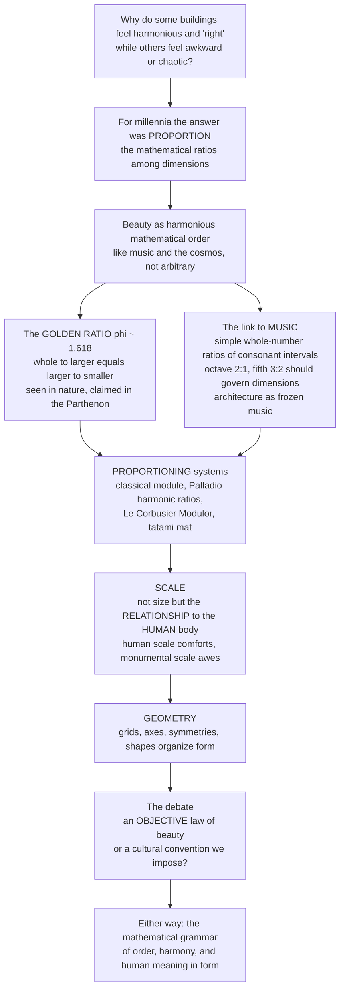

# 📐 Proportion, Scale and Geometry

> [!abstract] TL;DR
> Why do some buildings feel harmonious and "right" while others feel awkward or chaotic? For thousands of years architects answered: **proportion** — the mathematical *relationships* between a building's dimensions — believing beauty is not arbitrary but governed by harmonious mathematical order, the same order underlying **music** and the **cosmos**. The famous **golden ratio** (phi ≈ 1.618) and, more influentially, the **musical ratios** of consonant intervals (octave 2:1, fifth 3:2) drove architects to build systematic proportioning systems — the classical **module**, Palladio's harmonic room ratios, Le Corbusier's **Modulor**, the Japanese tatami. Closely related is **scale** — not absolute size but the *relationship* of a building to the **human body** (human scale to comfort, monumental scale to awe) — and **geometry** — the grids, axes, symmetries, and shapes that organize form. Whether proportional harmony is an *objective law* of beauty or a *cultural convention*, proportion, scale, and geometry are the **mathematical grammar** architects use to bring order and human meaning to form.

---

## Intuition

**Analogy: think of a piano chord.** Strike three keys whose string lengths are in the simple ratios 4:5:6 and you hear a warm, resolved *major triad*; strike three keys a hair off and you hear a sour, restless dissonance. The *notes* are the same kind of thing in both cases — the difference is entirely in the **ratios** between them. The oldest idea in architecture is that a building works exactly the same way: a room whose length, width, and height stand in simple ratios feels "resolved," and one whose dimensions are arbitrary feels vaguely "off," for the very same reason the out-of-tune chord grates. Goethe called architecture **"frozen music"** — and he meant it almost literally, because Renaissance architects took the *same* whole-number ratios that make musical intervals consonant (2:1 octave, 3:2 fifth, 4:3 fourth) and used them to size their rooms.

Translating the analogy into the technical domain: **proportion** is the study of those ratios among a building's parts and between each part and the whole. The claim underneath it — from Pythagoras through Vitruvius, Alberti, and Le Corbusier — is that **beauty is a kind of order**, a harmony that the eye reads the way the ear reads a chord, and that this order can be *engineered* through the right mathematics rather than left to chance. Two ideas ride alongside it: **scale**, which is not size but the *relationship* of size to the human body and its context (a doorway is sized to us, a cathedral is deliberately sized *against* us), and **geometry**, the grids, axes, and pure shapes that generate and discipline the form. Together they are the hidden mathematical structure beneath the feeling that a building is beautiful.

---

## How It Works

### Core mechanics

1. **Proportion is ratio, not dimension.** A proportional system fixes the *relationships* between measurements, so the building's beauty is scale-independent — enlarge everything by the same factor and the harmony survives. This is why architects reason in ratios (2:3, 1:phi) rather than fixed metres.
2. **One generative unit.** Classical practice derives *every* dimension from a single base measure — the **module**, taken as the column's lower diameter. Column height, spacing, and entablature all follow as simple multiples, so an entire façade unfolds from one number, like DNA unfolding a body.
3. **The golden ratio, phi.** Defined by the self-referential relation *a : b = b : (a+b)*, phi ≈ 1.618 has the unique property that removing a **square** from a **golden rectangle** leaves a smaller *similar* golden rectangle — infinite self-similarity, the source of the logarithmic "golden spiral." It appears genuinely in nature (phyllotaxis, nautilus shells) and is *claimed* — often over-claimed — in the Parthenon and Gothic cathedrals.
4. **The musical link.** Pythagoras found that consonant intervals correspond to simple integer string-length ratios. Renaissance theorists (Alberti, Palladio; systematized by Wittkower) concluded that a room proportioned 2:3 should be as pleasing as a musical fifth, tying architectural harmony to cosmic and musical harmony.
5. **Proportioning systems.** Beyond the module and phi come the **root rectangles** (root-2, root-3; Hambidge's "dynamic symmetry"), the **Fibonacci sequence** (whose ratios converge to phi), Le Corbusier's **Modulor** (uniting the human body, phi, and metric/imperial measure), and non-Western systems: the Japanese **tatami** module and **ken** grid, and **Islamic** geometric proportion.
6. **Scale is relational.** *Size* is an absolute dimension; *scale* is size **relative to a reference** — above all the human body. **Human scale** sizes the step, handrail, door, and ceiling to us so space feels comfortable; **monumental scale** deliberately overwhelms the body to awe; **intimate scale** shelters it. The human figure is the built-in yardstick by which we read a building's size.
7. **Geometry organizes form.** Underneath sits the **grid** (structural and planning), **axes and symmetry** (bilateral, radial, rotational), **regulating lines** (Le Corbusier's *tracés régulateurs*, diagonals that verify parts share a ratio), the primary **shapes and solids** (square, circle, golden rectangle, cube, sphere), and **tessellation/pattern**. Geometry is both a *generative* engine of form and a *disciplining* control on composition.

### Flow / architecture



---

## Key Concepts

### Secondary (school level)
- **Proportion means ratio.** It is about how a building's measurements *relate* to each other, not how big they are. Simple relationships (like 1:2 or 2:3) tend to look calm and "right."
- **The golden ratio.** A special number, phi ≈ 1.618. A **golden rectangle** has the neat trick that if you cut off a square, the piece left over is a smaller rectangle of the *same shape* — forever. People find it beautiful and see it in shells and flowers.
- **Frozen music.** The same simple number ratios that make two musical notes sound nice together (like an octave, 2:1) were used by architects to shape rooms — so a building can be "music you can walk through."
- **Human scale.** Doors, steps, and handrails are sized to *your body* so a space feels comfortable. A giant hall that makes you feel tiny uses **monumental scale** on purpose, to impress.
- **Geometry.** The grids, straight lines, squares, and circles that architects use like a hidden skeleton to keep a design orderly.

### Undergraduate (some background)
- **The module and the classical orders.** Every dimension derives from one unit (the column diameter). Doric columns run ~7 diameters tall, Ionic ~9, Corinthian ~10 — the whole order is *generated* from a single base measure (see **Vitruvius and the Principles of Architecture**).
- **phi, formally.** phi solves *x² = x + 1*, so phi = (1 + √5)/2 and 1/phi = phi − 1. Fibonacci ratios (1, 1, 2, 3, 5, 8, 13…) converge to phi; Binet's closed form for the sequence is built directly from phi. The **golden spiral** is a logarithmic spiral growing by a factor of phi every quarter-turn.
- **Harmonic proportion.** Alberti and Palladio prescribed **room ratios** drawn from musical consonance — 1:1, 3:4, 2:3, 1:2, plus geometric and harmonic means between them. Wittkower's *Architectural Principles in the Age of Humanism* showed this was a coherent theory of beauty-as-cosmic-harmony, not decoration.
- **Root rectangles and dynamic symmetry.** The √2 rectangle (the basis of ISO paper sizes) and √3 rectangle are "dynamic" — their subdivisions stay commensurate. Jay Hambidge derived design grids from them.
- **Size vs scale.** Two identical rooms can *read* at different scales depending on the **scale cues** present — a normal door, a chair, a person. Remove the human-scale references and a space becomes ambiguous or overwhelming; this is how designers manipulate perceived size.
- **Regulating lines.** Le Corbusier's *tracés régulateurs*: overlay a few parallel and perpendicular diagonals on a façade; if key features fall on them, the composition shares a consistent ratio — a geometric audit of proportional coherence.

### Graduate (system-level thinking)
- **The Modulor.** Le Corbusier fused **anthropometrics** and phi into a dual scale ("Red" and "Blue" series) keyed to a 1.83 m man with arm raised to 2.26 m, generating dimensions that are simultaneously human-proportioned, golden-sectioned, and reconcilable across metric and imperial. It is the most ambitious modern attempt to make proportion *and* human scale one system — and its critics note the ergonomic reality is messier than the elegant diagram.
- **The objectivity debate.** Is proportional harmony a **perceptual/mathematical universal** (rooted in how vision parses ratio, symmetry, and fractal self-similarity) or an **aesthetic ideology** — a cultural convention dressed as natural law? Claude Perrault questioned it in the 1600s; Modernism largely rejected inherited proportion, yet proportion *persisted* (Le Corbusier, Kahn). The **golden-ratio critique** (Mario Livio, and analyses in the *Nexus Network Journal*) shows many famous "phi sightings" — the Parthenon among them — are retrofits: rectangles drawn generously enough that *some* line lands near 1.618.
- **Non-Western proportional orders.** Japanese architecture is coordinated by the **tatami** mat and **ken** grid — a modular, additive system quite unlike the classical part-to-whole hierarchy. **Islamic** ornament builds beauty from **tessellation and geometric symmetry groups** rather than figural proportion, a distinct mathematics of order. These undercut any claim that one proportional canon is universally "correct."
- **Geometry as generator.** Beyond composition, geometry **form-finds**: catenaries and minimal surfaces derive shape from force; today **parametric and computational design** treats proportion and geometry as *rules* a machine executes across thousands of variations. The ancient dream — mathematical order producing beauty — returns as algorithm.
- **The perception question.** Empirical aesthetics (Fechner onward) has tried and largely *failed* to confirm a special preference for the golden rectangle; preferences are broad and context-dependent. This shifts the interesting claim from "phi is objectively beautiful" to "**ordered, legible ratio and human-scaled reference** reliably read as coherent" — a weaker but more defensible position.

---

## Python Demo

```python
# Proportion, Scale, and Geometry: the mathematics of architectural beauty.
# Four panels:
#   (a) The GOLDEN RECTANGLE -- its self-similar subdivision (remove a square and a
#       similar rectangle remains) with the golden logarithmic spiral overlaid.
#   (b) HARMONIC (musical-ratio) rectangles vs ARBITRARY rectangles: why simple
#       whole-number ratios read as "ordered" and arbitrary ones as "awkward".
#   (c) A FACADE generated by a proportional system, with regulating lines
#       (Le Corbusier's "traces regulateurs").
#   (d) HUMAN SCALE / anthropometrics: elements sized to the body vs a monumental
#       element that dwarfs it (the Modulor idea).
import numpy as np
import matplotlib.pyplot as plt
from matplotlib.patches import Rectangle, Circle

phi = (1 + np.sqrt(5)) / 2                      # the golden ratio, ~1.618
fig, ((axa, axb), (axc, axd)) = plt.subplots(2, 2, figsize=(13, 11))

# ---------- (a) GOLDEN RECTANGLE: self-similar subdivision + golden spiral ----------
X0, Y0, W, H = 0.0, 0.0, phi, 1.0
axa.add_patch(Rectangle((X0, Y0), W, H, fill=False, edgecolor="black", lw=2))
for i in range(11):                            # remove a square, a similar rectangle remains
    s = min(W, H)
    m = i % 4
    if m == 0:      # landscape: remove the LEFT square
        sq = (X0, Y0, s, s); X0 += s; W -= s
    elif m == 1:    # portrait: remove the TOP square
        sq = (X0, Y0 + H - s, s, s); H -= s
    elif m == 2:    # landscape: remove the RIGHT square
        sq = (X0 + W - s, Y0, s, s); W -= s
    else:           # portrait: remove the BOTTOM square
        sq = (X0, Y0, s, s); Y0 += s; H -= s
    axa.add_patch(Rectangle(sq[:2], sq[2], sq[3], fill=False, edgecolor="#4477aa", lw=1))
pole = (X0 + W / 2.0, Y0 + H / 2.0)            # accumulation point of the nested rectangles
b = np.log(phi) / (np.pi / 2.0)               # spiral grows by phi every quarter-turn
theta = np.linspace(0, 5.2 * np.pi, 1200)
r0 = np.hypot(pole[0] - 0.0, 1.0 - pole[1])   # start at the outer top-left corner
phase = np.arctan2(1.0 - pole[1], 0.0 - pole[0])
r = r0 * np.exp(-b * theta)                   # spiral inward toward the pole
axa.plot(pole[0] + r * np.cos(theta + phase),
         pole[1] + r * np.sin(theta + phase), color="#cc3311", lw=2)
axa.set_title(f"Golden rectangle  phi = {phi:.3f}\nremove a square -> a similar rectangle remains")
axa.set_aspect("equal"); axa.set_xlim(-0.1, phi + 0.1); axa.set_ylim(-0.15, 1.15); axa.axis("off")

# ---------- (b) HARMONIC vs ARBITRARY rectangles ----------
harmonic = [(1.0, "1:1 square"), (4/3, "4:3 fourth"), (3/2, "3:2 fifth"), (2.0, "2:1 octave")]
arbitrary = [1.23, 1.71, 0.86, 1.42]
x = 0.0
for ratio, label in harmonic:                 # width 1, height = ratio
    axb.add_patch(Rectangle((x, 0), 1.0, ratio, facecolor="#88ccaa", edgecolor="black"))
    axb.text(x + 0.5, ratio + 0.07, label, ha="center", fontsize=8)
    x += 1.3
x = 0.0
for ratio in arbitrary:
    axb.add_patch(Rectangle((x, -2.6), 1.0, ratio, facecolor="#e5e5e5", edgecolor="gray", ls="--"))
    axb.text(x + 0.5, -2.6 + ratio + 0.07, f"1:{ratio:.2f}", ha="center", fontsize=8, color="gray")
    x += 1.3
axb.text(-0.5, 1.0, "HARMONIC\nconsonant ratios", rotation=90, va="center",
         color="#2a7a55", fontsize=9, weight="bold")
axb.text(-0.5, -1.9, "ARBITRARY\nno simple ratio", rotation=90, va="center",
         color="gray", fontsize=9, weight="bold")
axb.set_title("Musical-ratio rectangles read as 'ordered';\narbitrary ones read as 'awkward'")
axb.set_aspect("equal"); axb.set_xlim(-1.0, 5.4); axb.set_ylim(-2.8, 2.6); axb.axis("off")

# ---------- (c) FACADE from a proportional system + regulating lines ----------
Wf, Hf, bays = phi, 1.0, 3                     # a golden-rectangle facade in 3 bays
axc.add_patch(Rectangle((0, 0), Wf, Hf, fill=False, edgecolor="black", lw=2))
for k in range(1, bays):                        # vertical module lines
    axc.plot([k * Wf / bays] * 2, [0, Hf], color="#bbbbbb", lw=0.8)
axc.plot([0, Wf], [Hf * 2 / 3] * 2, color="#bbbbbb", lw=0.8)   # horizontal datum
for k in range(bays):                           # a window per bay, proportioned to the bay
    bx = k * Wf / bays + Wf / bays * 0.25
    axc.add_patch(Rectangle((bx, Hf * 0.18), Wf / bays * 0.5, Hf * 0.4,
                            facecolor="#a8c6e5", edgecolor="black"))
axc.plot([0, Wf], [0, Hf], color="#cc3311", lw=1.5, label="main diagonal")
axc.plot([Wf / bays, Wf], [0, Hf * (bays - 1) / bays],
         color="#cc3311", lw=1.5, ls="--", label="parallel regulating line")
axc.plot([0, Hf * Hf / Wf], [Hf, 0], color="#ee9944", lw=1.3, label="perpendicular")
axc.legend(loc="upper right", fontsize=7, frameon=False)
axc.set_title("Facade from a proportional system\nregulating lines keep the parts in ratio")
axc.set_aspect("equal"); axc.set_xlim(-0.1, Wf + 0.1); axc.set_ylim(-0.1, Hf + 0.15); axc.axis("off")

# ---------- (d) HUMAN SCALE vs MONUMENTAL SCALE ----------
def human(ax, x, color="#333333"):             # simplified Modulor figure, ~1.83 m tall
    ax.add_patch(Circle((x, 1.63), 0.14, color=color))                       # head
    ax.plot([x, x], [0, 1.49], color=color, lw=3)                            # torso + legs
    ax.plot([x - 0.22, x, x + 0.05], [1.0, 1.3, 2.26], color=color, lw=2)    # raised arm to 2.26 m
    ax.plot([x - 0.18, x, x + 0.18], [0, 0.02, 0], color=color, lw=3)        # feet
axd.axhspan(2.4, 3.0, color="#eef3f8")         # comfortable-ceiling band
human(axd, 0.0)
for h, label in [(0.17, "step riser 0.17 m"), (0.90, "handrail / counter 0.90 m"),
                 (2.03, "door head 2.03 m"), (2.60, "comfortable ceiling 2.6 m")]:
    axd.plot([-0.6, 1.2], [h, h], color="#4477aa", lw=1, ls=":")
    axd.text(1.25, h, label, va="center", fontsize=8, color="#4477aa")
human(axd, 3.4, color="#999999")               # same body against a monumental portal
axd.add_patch(Rectangle((3.0, 0), 1.6, 7.0, fill=False, edgecolor="#aa3377", lw=2))
axd.text(3.8, 7.25, "monumental portal 7 m\ndwarfs the body -> awe", ha="center",
         fontsize=8, color="#aa3377")
axd.set_title("Human scale: elements sized to the body\nvs monumental scale that overwhelms it")
axd.set_aspect("equal"); axd.set_xlim(-0.9, 5.1); axd.set_ylim(0, 7.9); axd.axis("off")

plt.tight_layout()
plt.savefig("proportion_scale_geometry.png", dpi=120)
plt.show()

# Console check: phi's defining self-similar identities, plus the musical room ratios.
print(f"Golden ratio phi                = {phi:.6f}")
print(f"phi^2 = phi + 1                  -> {phi**2:.6f} = {phi + 1:.6f}")
print(f"1/phi = phi - 1                  -> {1/phi:.6f} = {phi - 1:.6f}")
print("Consonant ratios reused as room proportions:")
for ratio, name in [(2/1, "octave 2:1"), (3/2, "fifth 3:2"), (4/3, "fourth 4:3")]:
    print(f"  {name:12s} -> {ratio:.3f}")
```

**Panel (a)** shows phi's defining magic — remove a square from a golden rectangle and a *similar* golden rectangle remains, forever, traced by the golden spiral. **Panel (b)** contrasts rectangles in consonant musical ratios (which read as an ordered family) with arbitrary ones (which read as a random jumble) — the visual core of the "mathematics of beauty" claim. **Panel (c)** generates a façade from a module and audits it with regulating lines: the parallel and perpendicular diagonals confirm the bays and openings share one ratio. **Panel (d)** is scale, not size — the *same* human body makes elements at 0.17–2.6 m feel comfortable and a 7 m portal feel awe-inspiring.

---

## Real-World Applications

> **The Parthenon (Athens, 447–432 BCE) — proportion, and the over-claim.** Its refined ratios (often cited as ~9:4 governing plan and elevation) make it the textbook case of proportional harmony. But the popular claim that a golden rectangle "frames the façade" is a modern retrofit: draw the rectangle generously and *something* lands near 1.618. It is the perfect illustration of both the power of proportion *and* the golden-ratio critique.

> **Palladio's Villa Foscari ("La Malcontenta," 1560) — frozen music.** Palladio specified room dimensions from a small menu of ratios (1:1, 3:4, 2:3, 3:5, 1:2) and stipulated ceiling heights as the geometric/harmonic mean of a room's length and width. Wittkower reconstructed these as a deliberate application of musical consonance — a house you could, in principle, "hear."

> **Le Corbusier's Modulor and the Unité d'Habitation (Marseille, 1952).** Every dimension — ceiling height, corridor width, furniture — was set by the Modulor's body-and-phi scale, so the building is proportioned to the human figure and the golden section at once. It is the modern synthesis of proportion *and* human scale in one operational tool.

> **Gothic cathedrals — geometry as construction method.** Medieval master masons worked *ad quadratum* (from the square) and *ad triangulum* (from the equilateral triangle), generating a cathedral's proportions with compass and straightedge from a single module rather than from arithmetic — geometry as both the design language and the site instruction to illiterate crews.

> **Japanese tatami and the ken grid.** A traditional room is literally counted in mats ("a six-mat room"); the **ken** module coordinates structure, openings, and space additively. A non-Western proportional order that achieves coherence through modular repetition rather than classical part-to-whole hierarchy — and reminds us the canon is plural.

---

## Common Pitfalls

- **Seeing phi everywhere (the retrofit trap).** The most common error, in and out of the field: overlay a golden rectangle on any famous building, draw it loosely, and declare victory. Many "phi in the Parthenon / Notre-Dame / Great Pyramid" claims dissolve under measurement (see Livio). Proportion is real; *this particular* sighting usually is not.
- **Confusing size with scale.** "Scale" in architecture is *relative*, not absolute. Saying a room is "large scale" when you mean "large size" misses the whole point — a huge space can still be at *human* scale if its parts relate to the body, and a small space can feel monumental if it denies human-scale cues.
- **Proportion on paper, not in the eye.** A ratio that is exact in plan can be invisible in the built experience because of perspective, foreshortening, and viewing distance. The Greeks knew this and used **optical corrections** (entasis, curved stylobates) precisely because mathematical proportion and *perceived* proportion diverge.
- **Treating a proportioning system as a guarantee of beauty.** A module or the Modulor disciplines dimensions; it does not by itself produce a good building. Plenty of dull buildings are perfectly proportioned. The system is a scaffold for judgment, not a substitute for it.
- **Assuming one universal canon.** Applying classical part-to-whole proportion as if it were a law of nature ignores the equally coherent logics of Islamic tessellation and Japanese modular coordination. "Correct proportion" is partly cultural.
- **Forgetting the body when you scale up.** Enlarging a well-proportioned detail loses its human-scale cues; a doorknob-shaped building or a giant "human-scaled" bench becomes uncomfortable precisely because scale is anchored to real body dimensions, not to the drawing.

---

## Related Concepts

*This note complements its Architecture siblings — referenced here in prose and cross-linked once written: **Architecture_Overview_and_the_Art_of_Building** (the discipline this grammar serves), **Vitruvius_and_the_Principles_of_Architecture** (the module, symmetria, and beauty-as-proportion this note inherits), **Space_and_Spatial_Experience** (where human scale is felt), **Composition_Order_and_Form** (axes, symmetry, and grids as compositional discipline), **Renaissance_and_Baroque_Architecture** (Alberti and Palladio's harmonic proportion in practice), and **Parametric_and_Computational_Design** (proportion and geometry reborn as algorithm).*

Cross-vault links (verified to exist in the vault):

- [[Euclidean_Geometry]] — the geometry of circle, square, ratio, and the golden section that underlies every proportional construction and regulating line.
- [[Generating_Functions_and_Recurrences]] — the Fibonacci sequence and Binet's closed form, whose ratios converge on phi; the mathematics behind the golden spiral.
- [[Intervals_and_Consonance]] — the small integer ratios (2:1, 3:2, 4:3) that make musical consonance and that Renaissance architects borrowed as the mathematics of "pleasing" dimensions.
- [[Tuning_Systems_and_Temperament]] — the Pythagorean whole-number-ratio worldview from which "architecture as frozen music" descends.
- [[Beauty_and_Taste]] — the philosophical heart of the debate: is proportional harmony an objective law of beauty or a matter of taste and convention?
- [[Composition_and_Design_Principles]] — the Art & Aesthetics companion: balance, rhythm, proportion, and scale as general principles of visual order.
- [[Architecture_and_the_Built_Environment]] — the Art vault's view of architecture, sharing the Vitruvian "permanent brief" from the side of art rather than mathematics.

---

## Review Questions

1. **(Secondary)** Explain in your own words the difference between the *size* of a room and its *scale*. Why can a very large room still feel "human," and how does a giant doorway make a building feel monumental?
2. **(Undergraduate)** State the defining property of the golden ratio phi and show why removing a square from a golden rectangle leaves a similar rectangle. Separately, explain the claim that "architecture is frozen music": which musical ratios did Renaissance architects reuse as room proportions, and why did they believe those specific ratios were beautiful?
3. **(Graduate)** The Modulor unites the human body and the golden ratio in one dimensioning system, and the Parthenon is the classic "golden-ratio building." Yet empirical aesthetics has struggled to confirm any special preference for phi, and many phi-sightings are retrofits. Argue for or against the proposition that proportional harmony is an **objective law of beauty** rather than a **cultural convention** — and if you reject the strong claim, what weaker, defensible principle about ratio and human scale would you keep?

---

## Sources

- Rudolf Wittkower, *Architectural Principles in the Age of Humanism* (Academy Editions / Wiley) — the definitive study of harmonic proportion, Alberti, and Palladio's musical room ratios.
- Le Corbusier, *The Modulor* and *Modulor 2* (Harvard University Press / Birkhäuser) — the body-and-golden-ratio proportioning system, in the architect's own words.
- Francis D. K. Ching, *Architecture: Form, Space, and Order* (Wiley) — the standard reference on proportioning systems, scale, and ordering principles for students.
- György Doczi, *The Power of Limits: Proportional Harmonies in Nature, Art, and Architecture* (Shambhala) — proportion and the golden section across nature and design.
- [Golden ratio — mathematics, appearances, and the over-claiming critique](https://en.wikipedia.org/wiki/Golden_ratio) and Mario Livio, *The Golden Ratio* (Broadway Books) — for the careful, skeptical account of phi in architecture.

---

#architecture #proportion #golden-ratio #human-scale #architectural-geometry
