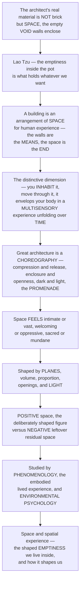

# Space and Spatial Experience

> [!abstract] TL;DR
> **The architect's true material is not brick or stone — it is SPACE itself, the empty void that walls, floors, and roofs shape and enclose.** As Lao Tzu observed 2,500 years ago, we shape clay into a pot, but it is the *emptiness inside* that holds whatever we want; in exactly this sense a building is fundamentally an **arrangement of space for human experience**, in which the walls are merely the *means* and the space is the *end*. This is architecture's deepest and most distinctive dimension: unlike a painting or sculpture you view from outside, architecture is **inhabited** — you move through it, your body is inside it, and it envelops you in a **multisensory, bodily experience that unfolds over time** as you walk. Great architecture is therefore a *choreography* of spatial experiences — **compression and release** (a low, tight passage bursting into a soaring hall), enclosure and openness, darkness and light, the designed **promenade** of unfolding views. Space can feel intimate or vast, welcoming or oppressive, sacred or mundane; architects shape it with **planes, volume, proportion, openings, and light**, distinguishing deliberately-shaped **positive space** from leftover **negative space**. Its felt, embodied quality is the subject of architectural **phenomenology** and **environmental psychology** — making space and spatial experience the true, invisible essence of the art.

---

## Intuition

**Analogy — the useful emptiness of the pot.** Take a clay pot in your hands. What did the potter *make*? Your first answer is "the clay" — the walls, the curved sides, the fired ceramic you can touch. But Lao Tzu, writing in the *Dao De Jing* around 2,500 years ago, saw deeper: *"We shape clay into a pot, but it is the emptiness inside that holds whatever we want."* The clay is only the *means*; the **void** it encloses is the *end*. You do not pour tea into the ceramic — you pour it into the *nothing* the ceramic surrounds. The same parable runs on: cut doors and windows into walls to make a room, and it is the **empty space** that makes the room useful. *"Therefore profit comes from what is there; usefulness from what is not there."*

This is the single most profound shift in how to think about architecture. The architect's real material is **not brick or stone — it is space itself**, the empty void that walls, floors, and roofs shape and enclose. A building is fundamentally an **arrangement of space for human use and experience**; the solid structure is just the means, the *shaped emptiness* is the point. And here is what makes architectural space unlike any other art: a painting or a sculpture you view from *outside*, standing back to look at an object. Architecture you **inhabit** — you walk *into* it, your body is *inside* it, and it wraps around you in a **multisensory, bodily experience that unfolds over time** as you move. So great architecture becomes a *choreography*: **compression and release** — the drama of a low, dark, tight passage suddenly opening into a soaring, light-flooded hall (the Gothic entry, Frank Lloyd Wright's deliberately cramped doorways bursting into open rooms); enclosure and openness; the designed journey Le Corbusier called the *architectural promenade*. Space can feel intimate or vast, welcoming or oppressive, static or dynamic, sacred or mundane — and architects distinguish the deliberately-shaped **positive space** of a room, court, or plaza from the leftover **negative space** between objects. To understand space and spatial experience is to grasp the invisible essence of architecture: the shaped emptiness we live inside, and how it shapes us.

---

## How It Works

### Core mechanics

Reading architecture as *space* rather than as *object* means learning to see the void as the designed thing, and the experience of moving through it as the real subject:

1. **Space is the medium — the figure-ground inversion.** The founding move, made explicit by Bruno Zevi in *Architecture as Space*, is to stop asking "what does this building look like?" and start asking "what spaces does it *create*, and what is it like to be *within* them?" The walls, columns, and slabs are read as the *boundaries that define a void*, exactly as a sculptor's bronze defines the air around it — except here you stand *inside* the void. This flips the usual **figure-ground** relationship: in good design the *space* becomes the positive figure and the built mass recedes to the means.
2. **The inhabited, embodied experience — architecture's uniqueness.** Unlike painting or sculpture, architectural space is experienced from *within* and *in motion*. It is **multisensory** — sight, but also the **acoustics** of a room, the **temperature** and airflow on the skin, the **smell** of stone or timber, the **kinesthetic** feel of your own body climbing a stair or ducking through a low door. Juhani Pallasmaa, in *The Eyes of the Skin*, attacks the modern over-privileging of vision and insists space is felt with the whole body. And it is **temporal**: you cannot take in a building at a glance — it reveals itself as a *sequence* over time, so movement is a fourth dimension of the design. The **body is the measure and the experiencer** of space.
3. **How space is defined and articulated.** Space is created by **planes** — floors, walls, and ceilings or roofs — and by columns that only *imply* enclosure without sealing it. Its character is set by the **degree of enclosure** on a spectrum from fully open to fully closed; by **volume, proportion, and scale**; and by the position of **edges, thresholds, and openings** that let space leak, flow, or be sealed. Francis Ching's *Form, Space, and Order* catalogues the basic **spatial organizations** — centralized, linear, radial, clustered, and grid — by which many rooms are composed into a whole.
4. **Positive versus negative space.** A crucial designer's distinction: **positive space** is *deliberately shaped* — a room, a courtyard, a plaza, an alcove — space treated as a *figure* to be composed. **Negative** or *residual* space is the leftover *ground* between objects, the space that is merely "what is left over." Good urban and architectural design shapes space *positively and intentionally*; bad design leaves buildings as objects marooned in undefined residual space. The **threshold**, the porch, and the arcade are the transitional *in-between* spaces that mediate interior and exterior.
5. **The qualities and the choreography of space.** Space carries **experiential and emotional qualities** — intimate or vast, compressed or expansive, static or dynamic, light or dark, sacred or mundane, liberating or oppressive. Architects *choreograph* these into a **spatial sequence**: the central device is **compression and release** — deliberately squeezing you through a low, tight, dim space so that the next big, bright, high space feels *even bigger* by contrast (Wright's compressed entries, the low Gothic narthex before the soaring nave). Add **enclosure and prospect**, **procession, threshold, and arrival**, and Le Corbusier's **architectural promenade** — the designed path of *unfolding views* — and the building becomes a piece of theatre played out on the moving body.
6. **The study of spatial experience.** Because it is *felt* and *lived*, architectural space is the subject of **phenomenology** — Heidegger's "dwelling," Merleau-Ponty's lived body, and their architectural heirs Norberg-Schulz, Steven Holl, and Peter Zumthor with his theory of *atmospheres* and the *genius loci* or sense of place. **Environmental psychology** studies empirically how enclosure, crowding, prospect, and restorative qualities affect mood, stress, and behaviour; and Bill Hillier's **space syntax** quantifies how the *configuration* of spaces shapes movement and social encounter.

### Flow / Architecture



---

## Key Concepts

**Secondary (can explain to a bright 16-year-old):**
- **The empty part is the point.** A cup is useful because of the *hollow* inside, not the china. In the same way, the important thing about a room is the *space* inside it — the walls are just what shape that space. Architecture is really the art of shaping empty space for people to be in.
- **You go *inside* architecture.** A painting you look at from outside; a building you *walk into* and move around in. You feel it with your whole body — your eyes, your ears, even how warm or cool it is — and it takes *time* to explore, because it unfolds as you walk.
- **Compression and release.** Squeeze someone through a low, tight, dark hallway and then open into a big, bright, tall room, and that room feels *enormous and thrilling* — precisely *because* they just came from the tight space. Architects use this contrast on purpose to create drama and emotion.
- **Shaped space vs. leftover space.** A room or a courtyard is space that was *shaped on purpose*. The awkward, undefined gap between two buildings is *leftover* space nobody designed. Good design shapes space deliberately.

**Undergraduate (needs some background):**
- **Architecture as space, not object.** Bruno Zevi argued that the *history of architecture is the history of space*: to understand a building, read the *voids* it creates and the *experience* of being within them, not just the façade. This is a **figure-ground inversion** — the space becomes the figure, the mass the ground.
- **The elements that define space.** Space is articulated by **planes** (floor, wall, ceiling/roof), by columns that *imply* rather than seal enclosure, by **volume, proportion, and scale**, and above all by **openings** — where you cut a door, window, or skylight determines whether space is sealed, leaks, or flows into the next. Light and material are as much "definers of space" as solid walls.
- **Degrees of enclosure and spatial organization.** Enclosure runs on a spectrum from fully open to fully closed; interior, exterior, and *transitional* in-between spaces (threshold, porch, arcade) mediate between them. Ching's canonical **spatial organizations** — centralized, linear, radial, clustered, grid — describe how individual spaces are composed into a building.
- **The architectural promenade and the spatial sequence.** Le Corbusier's *promenade architecturale* treats a building as a *designed journey* of unfolding views and changing spaces — procession, threshold, arrival, compression and release. The felt experience is *authored* over time, not delivered in a single image; the render can never capture it.

**Graduate (system-level thinking):**
- **Phenomenology of architecture.** Grounded in Heidegger's *"dwelling"* (building as making a place to *be*) and Merleau-Ponty's *lived body*, architectural phenomenology (Norberg-Schulz's *genius loci*, Pallasmaa's multisensory *Eyes of the Skin*, Holl's phenomenal transparency, Zumthor's *atmospheres*) treats meaning as **emergent and relational** — arising from light, threshold, material, proportion, and bodily movement rather than from object-properties. Space is not a neutral container but a *lived, atmospheric field*.
- **Positive space and the figure-ground of the plan.** In urban and architectural composition the deep skill is treating *space* as the positive figure to be shaped — the reason the *poché* of a Baroque church, or the carved public voids of a great city, feel *made* while Modernist "objects in a field" often leave residual, unloved space. The Nolli plan of Rome reads *public space* as continuous positive figure.
- **Space syntax and the configuration of the social.** Bill Hillier's space syntax formalizes the intuition that *spatial configuration shapes movement and encounter*: measures such as **integration** and **visibility graphs** predict where people walk, meet, and where "natural surveillance" arises — turning felt space into a *quantitative, testable* science of the social life of plans.
- **Environmental psychology and evidence-based design.** The felt qualities of space have measurable effects — enclosure and **prospect-refuge** preferences (Appleton: we favour places offering both a *view out* and a *sense of shelter*, the ability to *see without being seen*), crowding and stress, and the *restorative* quality of certain environments. This grounds evidence-based design in healthcare, workplaces, and cities: space demonstrably shapes mood, cognition, and wellbeing.

---

## Python Demo

```python
# Space & spatial experience: quantifying the invisible essence of architecture.
# (a) COMPRESSION-AND-RELEASE along an architectural PROMENADE: the "sense of release"
#     spikes when a tight, dark corridor bursts into a soaring hall -- a tight space
#     makes the next big space feel BIGGER (contrast is the drama).
# (b) ISOVIST: the field of view / area visible from a point in a plan -- how "open"
#     or "enclosed" a spot feels, and how enclosure collapses in a corridor.
# (c) PROSPECT-REFUGE preference landscape (Appleton): we prefer "seeing without being seen".
# Requires: numpy, matplotlib
import numpy as np
import matplotlib.pyplot as plt

fig = plt.figure(figsize=(13, 10))

# ================= (a) COMPRESSION-AND-RELEASE: the spatial sequence =================
# Ceiling height along a walked path: approach -> compressed entry -> low corridor
# -> BURST into a soaring hall -> step into an intimate room.
ctrl_s = [0.0, 2.0, 4.0, 9.0, 10.0, 16.0, 17.0, 22.0]   # distance along path (m)
ctrl_h = [4.0, 2.2, 2.1, 2.1, 12.0, 12.0, 3.0, 3.0]      # ceiling height (m)
s = np.linspace(0, 22, 600)
h = np.interp(s, ctrl_s, ctrl_h)                          # enclosure metric = ceiling height

# "Sense of release" = current openness relative to the recent trailing MINIMUM.
# A tight space you just left makes the next big space feel bigger by contrast.
W = int(len(s) * (3.0 / 22))                              # trailing window ~ 3 m of memory
trailing_min = np.array([h[max(0, i - W):i + 1].min() for i in range(len(s))])
release = h / trailing_min                                # ratio; spikes at the hall entry

ax1 = fig.add_subplot(2, 2, 1)
ax1.plot(s, h, color="#1d3557", lw=2.5, label="ceiling height (enclosure)")
ax1.fill_between(s, h, where=(h < 3.0), color="#e07a5f", alpha=0.35, label="COMPRESSION (low, tight)")
ax1.fill_between(s, h, where=(h >= 6.0), color="#81b29a", alpha=0.40, label="RELEASE (high, open)")
ax1.axvline(10, color="grey", ls="--", lw=1)
ax1.annotate("BURST into the hall", xy=(10, 12), xytext=(11.5, 9.5), fontsize=8,
             arrowprops=dict(arrowstyle="->"))
for xs, lab in [(1, "approach"), (6.5, "compressed\ncorridor"), (13, "soaring\nhall"), (19.5, "intimate\nroom")]:
    ax1.text(xs, 0.6, lab, ha="center", fontsize=7.5)
ax1.set_title("(a) Compression & release along the PROMENADE")
ax1.set_xlabel("distance walked along path  [m]")
ax1.set_ylabel("ceiling height  [m]")
ax1.set_ylim(0, 13.5)
ax1.legend(fontsize=7, loc="upper left")

ax1b = ax1.twinx()
ax1b.plot(s, release, color="#c1121f", lw=1.6, ls=":", label="felt 'sense of release'")
ax1b.set_ylabel("release ratio  (openness / recent min)", color="#c1121f")
ax1b.tick_params(axis="y", labelcolor="#c1121f")
ax1b.set_ylim(0, release.max() * 1.15)

# ================= (b) ISOVIST: the field of view from a point in a plan =================
# A plan = one polygon: a 10x8 hall with a narrow 2-wide corridor projecting upward.
poly = np.array([[0, 0], [10, 0], [10, 8], [6, 8], [6, 14],
                 [4, 14], [4, 8], [0, 8]], dtype=float)

def isovist(P, poly, n_rays=720):
    """Cast rays from P; return the visible radius in each direction + the isovist area."""
    P = np.asarray(P, float)
    ang = np.linspace(0, 2 * np.pi, n_rays, endpoint=False)
    radii = np.full(n_rays, np.inf)
    M = len(poly)
    for k, a in enumerate(ang):
        d = np.array([np.cos(a), np.sin(a)])
        best = np.inf
        for i in range(M):
            A = poly[i]; B = poly[(i + 1) % M]; e = B - A
            det = e[0] * d[1] - d[0] * e[1]        # solve P + t d = A + u e
            if abs(det) < 1e-12:
                continue
            r = A - P
            t = (e[0] * r[1] - e[1] * r[0]) / det  # distance along the ray
            u = (d[0] * r[1] - d[1] * r[0]) / det   # position along the wall segment
            if t > 1e-9 and -1e-9 <= u <= 1 + 1e-9:
                best = min(best, t)
        radii[k] = best
    dtheta = 2 * np.pi / n_rays
    area = 0.5 * np.sum(radii * np.roll(radii, -1) * np.sin(dtheta))
    return ang, radii, area

P_hall, P_corr = np.array([5.0, 4.0]), np.array([5.0, 12.0])
ang_h, r_h, area_h = isovist(P_hall, poly)
ang_c, r_c, area_c = isovist(P_corr, poly)

ax2 = fig.add_subplot(2, 2, 2)
wall = np.vstack([poly, poly[0]])
ax2.plot(wall[:, 0], wall[:, 1], color="k", lw=2)
for P, ang, r, col, lab, area in [
    (P_hall, ang_h, r_h, "#457b9d", "open hall", area_h),
    (P_corr, ang_c, r_c, "#e07a5f", "tight corridor", area_c)]:
    vx = P[0] + r * np.cos(ang); vy = P[1] + r * np.sin(ang)
    ax2.fill(vx, vy, color=col, alpha=0.35)
    ax2.plot(*P, "o", color=col, ms=7)
    ax2.text(P[0] + 0.3, P[1], f"{lab}\nisovist area = {area:4.0f}", fontsize=7.5, va="center")
ax2.set_title("(b) ISOVIST: how OPEN or ENCLOSED a spot feels")
ax2.set_xlabel("plan x  [m]"); ax2.set_ylabel("plan y  [m]")
ax2.set_aspect("equal", adjustable="box")

# ================= (c) PROSPECT-REFUGE: the preference landscape =================
# Appleton: we prefer places offering BOTH prospect (a view out) AND refuge (shelter):
# "to see without being seen." Preference is highest where both are high -> the EDGE.
prospect = np.linspace(0, 1, 200)
refuge = np.linspace(0, 1, 200)
Pr, Rf = np.meshgrid(prospect, refuge)
preference = Pr * Rf                                       # want BOTH: product peaks at the edge

ax3 = fig.add_subplot(2, 2, 3)
cf = ax3.contourf(Pr, Rf, preference, levels=15, cmap="YlGn")
fig.colorbar(cf, ax=ax3, label="preference  (see without being seen)")
pts = {"exposed clearing": (0.9, 0.1), "blind cave": (0.1, 0.9),
       "EDGE — cave mouth\nover a plain": (0.85, 0.85)}
for lab, (x, y) in pts.items():
    ax3.plot(x, y, "ko", ms=6)
    ax3.annotate(lab, (x, y), textcoords="offset points", xytext=(6, 6), fontsize=7.5)
ax3.set_title("(c) PROSPECT-REFUGE preference (Appleton)")
ax3.set_xlabel("PROSPECT  (view out / openness)")
ax3.set_ylabel("REFUGE  (enclosure / shelter)")

# ================= (d) A ledger of the argument =================
ax4 = fig.add_subplot(2, 2, 4); ax4.axis("off")
ax4.text(0.02, 0.98,
    "SPACE is the architect's real material\n"
    "-------------------------------------\n"
    "(a) The promenade is CHOREOGRAPHED: the tight,\n"
    "    dark corridor makes the soaring hall feel\n"
    "    bigger -- the 'release' spikes on entry.\n"
    "    CONTRAST, not size alone, creates the drama.\n\n"
    "(b) The ISOVIST quantifies felt enclosure: the\n"
    f"    open hall sees {area_h:.0f} vs the corridor's {area_c:.0f}\n"
    "    -- the same building, radically different\n"
    "    spatial experience from point to point.\n\n"
    "(c) PROSPECT-REFUGE: we prefer the EDGE, where\n"
    "    we can see out yet feel sheltered -- the\n"
    "    window seat, the cave mouth, the loggia.\n\n"
    "The shaped EMPTINESS we live inside is the\n"
    "invisible essence of architecture.",
    fontsize=9, family="monospace", va="top",
    bbox=dict(boxstyle="round", fc="#f8f9fa", ec="grey"))

plt.tight_layout()
plt.savefig("space_and_spatial_experience.png", dpi=120)
plt.show()

# Takeaways:
#  (a) Architects author EMOTION through the modulation of space over time: a low, tight,
#      dark passage releasing into a high, bright hall reads as thrilling RELEASE precisely
#      because of the CONTRAST with the compression that preceded it.
#  (b) The ISOVIST -- the area visible from a point -- makes "enclosure" measurable: the
#      identical plan offers a vast open field of view in the hall and a claustrophobic
#      sliver in the corridor. Spatial experience is local and changes as you MOVE.
#  (c) PROSPECT-REFUGE explains a deep human preference: we are drawn to the EDGE condition
#      -- the window seat, the loggia, the cave mouth -- where we can see out yet feel safe.
```

Running this produces four panels. The **promenade** panel plots ceiling height along a walked path, shading the compressed (low) and released (high) zones, while a red dotted curve shows the *felt* "sense of release" spiking exactly where the tight corridor bursts into the soaring hall — the quantitative form of *compression and release*. The **isovist** panel casts rays from two points in one plan, showing a vast visible field in the open hall and a claustrophobic sliver in the corridor: the same building, radically different spatial experience. The **prospect-refuge** landscape shows preference peaking at the *edge* condition — high view *and* high shelter, the primal appeal of the window seat or cave mouth. The fourth panel summarizes the argument: the shaped emptiness we live inside is the invisible essence of architecture.

---

## Real-World Applications

> **Frank Lloyd Wright's compression and release (Fallingwater, the Guggenheim).** Wright was the supreme choreographer of the spatial sequence. He habitually forced visitors through **deliberately low, dark, compressed** entry passages — sometimes uncomfortably so — so that the moment of stepping into the main living space, with its far horizon and soaring ceiling, delivered a physical shock of *release*. At the Guggenheim in New York the whole museum is a single continuous spiral **promenade**: you rise through space on a ramp of unfolding views, the space itself as the exhibit.

> **The Gothic cathedral (the sacred as spatial experience).** The medieval cathedral is a masterclass in shaping space to produce *awe*. You pass from the ordinary street through a low, dim **narthex** — compression — and then the space explodes upward into the vast, luminous, vertical **nave**, drawing the eye and the spirit toward heaven. The stone is only the means; the *space and light* are the religious experience. This is why the interior *void* — not the façade — is the true subject.

> **Le Corbusier's architectural promenade (Villa Savoye).** Corbusier designed buildings as *journeys*. At the Villa Savoye a **ramp** leads the body on a slow, unfolding procession from the dark ground floor up through the living level to the roof garden and its framed views of the sky — the *promenade architecturale* made explicit, space experienced cinematically over time.

> **Peter Zumthor and atmospheres (Therme Vals).** Zumthor's thermal baths at Vals are pure phenomenology built: a labyrinth of stone chambers modulating **light, temperature, acoustics, and material** so that the *atmosphere* of each space — hot, cold, dark, resonant — is felt with the whole body. It is architecture designed as *multisensory spatial experience* rather than as a viewable object, the direct heir of Pallasmaa's *Eyes of the Skin*.

> **Space syntax in workplace and museum design.** Bill Hillier's **space syntax** is used by practising firms to *predict and shape movement*: modelling the visibility and integration of a plan reveals where people will naturally walk, gather, and encounter one another. It turns the felt qualities of space into a testable tool for designing offices that foster collaboration, museums that guide flow, and streets with "natural surveillance."

---

## Common Pitfalls

- **Designing the object, forgetting the space.** The most common failure is to obsess over the *façade and silhouette* — the building as sculpture in a render — while the *interior spaces* and the *experience of moving through them* are left as an afterthought. The result "looks great in the photograph" but feels oppressive, confusing, or dead to inhabit. Space, not the object, is the point.
- **Leaving only negative, residual space.** Placing buildings as isolated "objects in a field" produces awkward, undefined **leftover space** between them that nobody designed and nobody loves. Good urban and architectural design shapes space **positively and intentionally** — as courts, streets, and plazas that are *figures*, not gaps.
- **Judging space from a plan or a single image.** A floor plan is a flattened abstraction and a photograph is a frozen instant; neither conveys **enclosure, light, proportion, sound, or the temporal unfolding** of the real spatial experience. Space must be studied in section, in sequence, and ideally in the moving body — which is why architects build models and, now, walk clients through VR.
- **Privileging the eye — the "ocularcentric" trap.** Pallasmaa's critique: modern design over-values the *visual* and neglects the **acoustic, tactile, thermal, and kinesthetic** dimensions that make space feel warm or cold, intimate or hostile. A visually striking space with harsh acoustics and glare is a poor *spatial* experience.
- **Uniform intensity — no compression, no release.** A building that is *all* soaring drama (or all low intimacy) has no **contrast**, and contrast is the source of the emotion. Without a tight, dark space *before* it, the soaring hall does not feel liberating — it just feels big. The choreography needs *both* poles.
- **Confusing bigness with generosity.** Vast space is not automatically good space; scale must be *calibrated to the body and the use*. An overscaled lobby can feel alienating and oppressive rather than grand — the felt quality depends on proportion, enclosure, and light, not raw volume.

---

## Related Concepts

*This is the S04 section-opener for **Space, Form, and Design**, the heart of how architecture is actually composed. Its sibling notes — **Proportion, Scale, and Geometry** (the mathematics of how space is dimensioned to the body), **Light, Color, and Atmosphere** (how light carves and animates space), **Composition, Order, and Form** (the organizing principles of the built figure), **Circulation, Program, and Plan** (the promenade, threshold, and functional arrangement of spaces), and **Genius Loci, Place, and Context** (the phenomenology of place this note opens) — extend the themes introduced here. It builds directly on **Architecture Overview and the Art of Building**, which named the *inhabited, spatial* nature of architecture as its most distinctive feature. Distinct in scope from the sibling notes above, it complements the phenomenology, perception, and aesthetics notes in the Philosophy, Psychology, Cognitive Science, and Art vaults.*

Intra-vault connections (verified to exist):

- [[Architecture_Overview_and_the_Art_of_Building]] — the S01 hub; established that architecture is *inhabited* rather than viewed, the seed this note grows into a full theory of space.
- [[Vitruvius_and_the_Principles_of_Architecture]] — *venustas* and *utilitas* are ultimately about the *quality of space* the building offers to the body.
- [[Form_Function_and_Ornament]] — the "space is the end, structure the means" thesis reframes the whole form-and-function debate around the void.
- [[Medieval_Architecture_Romanesque_and_Gothic]] — the Gothic **narthex-to-nave** sequence is the archetypal compression-and-release, sacred space made from light.
- [[Modern_Architecture_and_the_Modern_Movement]] — Le Corbusier's *architectural promenade*, the free plan, and flowing open space; Wright's compressed-to-open sequences.
- [[Structure_and_Architectural_Form]] — structure is the *means* that shapes the void; the arch, vault, and frame each enclose space differently.
- [[Materials_and_Tectonics_in_Architecture]] — material, texture, and tectonics are among the *definers of space* and the substance of Zumthor's atmospheres and Pallasmaa's multisensory space.

Cross-vault connections (verified to exist):

- [[Analytic_and_Continental_Philosophy]] — Husserl, Heidegger, and Merleau-Ponty: the phenomenology of embodied, lived experience that architectural phenomenology applies to *place* and *dwelling*.
- [[Sensation_and_Perception]] — the psychology of how the body perceives depth, enclosure, and space, the sensory substrate of spatial experience.
- [[Happiness_and_Wellbeing]] — environmental psychology's evidence that spatial qualities (enclosure, prospect, restorative environments) measurably shape mood and wellbeing.
- [[Embodied_and_Extended_Cognition]] — the cognitive-science case that cognition is *bodily and situated*, the theoretical backbone of experiencing space *through* the moving body.
- [[Multisensory_Integration]] — how the brain fuses sight, sound, touch, and proprioception into one felt space — exactly Pallasmaa's multisensory architecture.
- [[Architecture_and_the_Built_Environment]] — the Art & Aesthetics vault's view of architecture as an art form, the aesthetic counterpart to this spatial account.
- [[Space_Perspective_and_Depth]] — how *pictorial* space and depth are constructed in visual art; a revealing contrast to *inhabited* architectural space.
- [[Aesthetic_Experience_and_Perception]] — the general aesthetics of perceptual experience underlying the felt qualities of space.

---

## Review Questions

**Secondary:**
1. Lao Tzu said that when you make a pot, "it is the emptiness inside that holds whatever we want." Explain, in your own words, what this parable teaches about architecture — and why an architect might say their real material is *space* rather than *bricks*. Then describe how walking through a low, dark, narrow hallway *before* entering a huge bright room changes how that room *feels*.

**Undergraduate:**
2. Bruno Zevi argued that we should read a building by its *spaces* rather than its façade. Take a building you know well and describe its **spatial sequence** as a promenade — where is there **compression**, where **release**, where does the space **flow** or **seal**? Explain the difference between the **positive** spaces (deliberately shaped rooms or courts) and any **negative**, leftover space, and say how openings and light define the experience.

**Graduate:**
3. Architectural **phenomenology** (Pallasmaa, Zumthor, Norberg-Schulz) insists that space is a *lived, multisensory, atmospheric* experience irreducible to measurable geometry, while **space syntax** (Hillier) and **environmental psychology** claim that felt spatial experience *can* be quantified — through isovists, integration measures, and prospect-refuge preferences. Are these approaches genuinely opposed, or complementary? Argue whether the felt, first-person essence of architectural space can be captured by measurement without losing what makes it *architecture*, and what each approach contributes to design.

---

## Sources

- Bruno Zevi, *Architecture as Space: How to Look at Architecture* (Horizon Press) — [Internet Archive](https://archive.org/details/architectureassp0000zevi)
- Francis D. K. Ching, *Architecture: Form, Space, and Order*, 4th ed. (Wiley) — [Publisher page](https://www.wiley.com/en-us/Architecture:+Form,+Space,+and+Order,+4th+Edition-p-9781119853374)
- Juhani Pallasmaa, *The Eyes of the Skin: Architecture and the Senses* (Wiley) — [Publisher page](https://www.wiley.com/en-us/The+Eyes+of+the+Skin:+Architecture+and+the+Senses,+3rd+Edition-p-9781119941286)
- Christian Norberg-Schulz, *Genius Loci: Towards a Phenomenology of Architecture* (Rizzoli) — [Internet Archive](https://archive.org/details/geniuslocitoward0000norb)
- Bill Hillier & Julienne Hanson, *The Social Logic of Space* (Cambridge University Press) — [Publisher page](https://www.cambridge.org/core/books/social-logic-of-space/6B0F45D6D8CBF9D1F3C6E6F5C6C5B2A8)

---

#architecture #space #spatial-experience #phenomenology #compression-and-release
