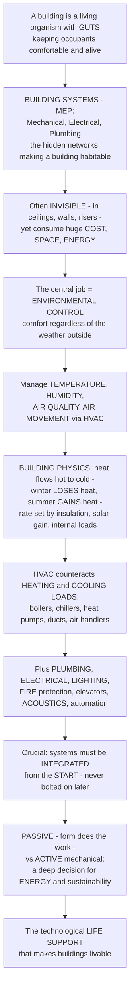

# Building Systems and Environmental Control

> [!abstract] TL;DR
> **A building is not a static shell but a living organism with GUTS — hidden networks that keep its occupants comfortable, healthy, and alive.** Just as a body has circulatory, respiratory, and nervous systems, a building has **BUILDING SYSTEMS** (also called **MEP** — Mechanical, Electrical, Plumbing — or "building services"): the tucked-away equipment and networks in ceilings, walls, risers, and basements that turn a shelter into a functioning environment, and that can eat a huge fraction of a building's cost, space, and energy. Their central job is **ENVIRONMENTAL CONTROL** — keeping the inside comfortable regardless of the weather — by managing the human-comfort variables (**temperature, humidity, air quality, air movement**) through **HVAC** (Heating, Ventilation, and Air Conditioning). This rests on basic **building physics**: heat flows hot to cold, so a building *loses* heat in winter and *gains* it in summer at rates set by its **insulation, solar gain, and internal loads**; HVAC calculates these **heating and cooling loads** and provides the equipment (boilers, chillers, heat pumps, ducts, air handlers) to counteract them — ideally efficiently. Beyond climate come **plumbing, electrical, lighting, fire protection, vertical transport, acoustics, and building automation**. The crucial architectural point: these systems are **not afterthoughts** — they must be **integrated from the start**, and the deep choice between **passive** (let the building's form do the work) and **active** (mechanical) design is one of architecture's biggest levers on energy and sustainability.

---

## Intuition

**Analogy — the body and its organs, hidden under the skin.** Look at a person and you see skin, a face, clothes — the "architecture." What you do *not* see is what keeps them alive: a heart pumping blood, lungs moving air, kidneys managing water, nerves carrying signals, all threaded invisibly through the body. Cut off any one of those systems and the beautiful exterior is just a corpse. **A building is exactly the same.** The walls, windows, and roof are the visible shell; the life-support runs *behind* them — a heating and cooling "circulation," a ventilation "respiration," a plumbing "digestive and urinary" tract, and an electrical/data "nervous system." These are the **building systems**, and they are what make the difference between a cold, dark, airless box and a place a human can actually work, sleep, and thrive in.

Extend the analogy into the discipline and the whole subject appears. The organs' central task is **homeostasis** — holding the body's internal state steady while the outside world swings; the building's version is **environmental control**, holding the inside comfortable regardless of the weather. That means managing four human-comfort variables — **air temperature, humidity, air quality, and air movement** — chiefly through **HVAC**. And it obeys simple physics: heat always flows from hot to cold, so in **winter the building bleeds heat** (it needs heating) and in **summer it soaks up heat** (it needs cooling), with the *rate* set by how well it is insulated, how much sun pours through its glass, and how much heat its people and machines throw off. HVAC's job is to size these **heating and cooling loads** and supply just enough boiler, chiller, or heat-pump capacity to cancel them — the smaller you can make the loads (thick walls, good orientation, less glass), the smaller and cheaper the machinery. Around that core sit **plumbing** (clean water in, waste out), **electrical** (power and data), **lighting** (daylight and lamps), **fire protection** (detection, sprinklers, escape), **vertical transport** (elevators), and **acoustics**. The architectural punchline is that none of these can be bolted on at the end: they need **space, routes, and coordination with the structure from day one**, and the strategic fork between letting the **form** do the environmental work versus leaning on **mechanical systems** is one of the deepest decisions an architect makes.

---

## How It Works

### Core mechanics

Building systems are the technological **life-support** that converts a bare enclosure into a habitable, healthy, serviced environment. The mechanism runs roughly like this:

1. **The building as an organism with systems.** Reyner Banham's *The Architecture of the Well-Tempered Environment* argued that the history of the serviced building is a **co-equal history of architecture** alongside form and structure. A pre-industrial building tempered its climate with mass, fire, and openings; the modern building carries a dense payload of **MEP** — Mechanical (HVAC), Electrical, and Plumbing — plus fire, transport, and data, often hidden in ceiling voids, risers, and plant rooms, consuming a large share of cost, floor area, and energy.
2. **Environmental control and thermal comfort.** The core function is delivering **human comfort** and a **healthy indoor environment** regardless of outdoor climate. Thermal comfort is governed by six variables — **air temperature, mean radiant temperature, humidity, air velocity**, plus **metabolic rate** and **clothing** — combined in Fanger's **PMV/PPD** model into a "comfort zone." **Indoor air quality** adds ventilation, fresh-air supply, and pollutant removal; get it wrong and you get "sick building syndrome."
3. **The building physics — the heat balance.** Heat moves by **conduction** (through the envelope, rate set by **U-value** times area times temperature difference), **convection**, and **radiation** (notably **solar gain** through glass). The building's **heat balance** sums envelope losses/gains, **solar gains**, **internal gains** (people, lights, equipment), and ventilation. The **balance-point temperature** is the outdoor temperature at which gains exactly offset losses — no heating or cooling needed; below it the building needs **heating**, above it **cooling**. Those requirements are the **heating and cooling loads**.
4. **HVAC — counteracting the loads.** Heating, Ventilation, and Air Conditioning supplies the equipment that cancels the loads: **boilers/furnaces**, **chillers**, **heat pumps**, **cooling towers**, **air handlers**, **ductwork**, **radiators**, **fan-coils**, and **VAV** (variable-air-volume) systems, plus **ventilation** (natural, mechanical, or mixed-mode) to bring fresh air in and stale air out. System **types** span all-air, all-water, air-water, **VRF** (variable refrigerant flow), **radiant**, and **geothermal/ground-source**, with **zoning** and controls; the cooling side runs on the **refrigeration/heat-pump cycle** of thermodynamics.
5. **The other building systems.** Around HVAC sit **plumbing and sanitary** (clean-water supply, hot water, drainage/waste, stormwater), **electrical** (power supply, distribution, and increasingly low-voltage **data/IT**), **lighting** (integrated daylight and artificial), **fire protection and life safety** (detection/alarm, sprinklers, smoke control, compartmentation, **egress**), **vertical transportation** (elevators, escalators), **acoustics** (isolation, absorption, room acoustics), and **security/communications** — all needing vertical/horizontal **service distribution** through risers, plenums, and cores.
6. **Integration and the passive/active choice.** Systems need **space** (plant rooms, risers, ceiling voids, cores), **routes**, and coordination with **structure** and plan — the "**servant and served**" spatial logic of Louis Kahn, and clash-checked today in **BIM**. The strategic fork is **passive** (form, orientation, mass, insulation, natural ventilation doing the work) versus **active** (mechanical systems), with a **mixed-mode/hybrid** middle. Since buildings account for roughly **40 percent** of global energy use, this choice drives the push toward low- and **net-zero-energy** buildings, and even the *expression* of services — hidden versus proudly exposed, as in the high-tech Pompidou.

### Flow / Architecture



---

## Key Concepts

**Secondary (can explain to a bright 16-year-old):**
- **A building has hidden "guts."** Behind the walls and above the ceilings run the pipes, wires, and ducts that heat, cool, light, and water the building — its version of a body's heart, lungs, and veins. You never see them, but without them the building is unlivable.
- **Keeping the inside comfy is the whole job.** Outside it might be freezing or boiling; inside we want it just right. That is **environmental control**, done mainly by **HVAC** — heating, ventilation, and air conditioning.
- **Heat always leaks toward cold.** In winter warmth escapes a building (so you heat it); in summer heat pours in (so you cool it). Good **insulation** and less **glass** slow the leak, so you need less machinery and less energy.
- **These systems can't be an afterthought.** They need room to run and must be planned with the building from the start, not squeezed in at the end.

**Undergraduate (needs some background):**
- **The heat balance and the balance point.** A building's heating/cooling need is a **balance** of flows: envelope conduction (**U-value × area × ΔT**), solar gain through glass, internal gains from people/lights/equipment, and ventilation. The **balance-point temperature** is the outdoor temperature where gains cancel losses — no HVAC needed; loads grow as the outdoor temperature deviates from it.
- **The four-plus-two comfort variables.** Comfort is not just air temperature: it also depends on **mean radiant temperature**, **humidity**, and **air velocity**, plus the occupant's **metabolic rate** and **clothing** — combined by Fanger's **PMV** into a comfort zone. This is why a radiant-cold window or stagnant air feels uncomfortable even at 21 degC.
- **HVAC system families.** **All-air** (VAV) systems condition air centrally and duct it; **all-water/air-water** systems (fan-coils, radiant panels) move heat in water and treat air separately; **VRF** and **heat pumps** move heat with refrigerant; **ground-source** taps the stable earth. Each trades duct space, control granularity, and efficiency.
- **Servant and served space.** Louis Kahn's distinction between **served** spaces (the rooms people use) and **servant** spaces (the shafts, plenums, and plant rooms that serve them) captures the architectural reality that systems demand *dedicated volume* and *routes*, not leftover slivers.
- **Passive versus active.** **Passive** design uses form, orientation, thermal mass, insulation, shading, and natural ventilation to do the environmental work "for free"; **active** design relies on mechanical HVAC. **Mixed-mode** blends both. The choice sets the size of the mechanical plant and the building's energy appetite.

**Graduate (system-level thinking):**
- **Banham's second history of architecture.** *The Architecture of the Well-Tempered Environment* reframes buildings as **environmental management systems**, arguing that the story of servicing (fire, glass, steam heat, electric light, air conditioning) is as constitutive of modern architecture as structure and form — and that much celebrated modernism was quietly propped up by concealed mechanical plant.
- **Loads as a coupled thermal-optimization problem.** The heat balance is a dynamic system: envelope conductance and thermal mass, solar and internal gains, ventilation, and setpoint schedules interact over the diurnal and annual cycle. Reducing loads (the "**reduce demand first**" principle) is almost always cheaper and greener than oversizing plant to meet an inflated peak — the logic behind Passivhaus and net-zero design.
- **The integration and coordination problem.** Every system competes for the same section: structure, ducts, pipes, cable trays, and ceiling height must be reconciled in three dimensions. **BIM clash detection** turns this once-destructive on-site discovery into a pre-construction model check, but the deeper move is *architectural* — designing cores, risers, and interstitial service floors (as at the Salk Institute) so the fast-changing services layer can be maintained and replaced without touching the slow structural layer.
- **The passive/active frontier and building performance.** The endgame is the **smart, low-energy building**: **BMS/BAS** (building management/automation systems) with sensors and optimizing controls, high-efficiency **heat pumps** and **heat recovery**, on-site renewables, and **net-zero-energy** targets, increasingly judged not only on energy but on occupant **health and wellness** (WELL, IAQ) and resilience. The controls layer and IoT turn the building from a passive box into a responsive, instrumented organism.

---

## Python Demo

```python
# Building systems and environmental control, quantified:
#   (a) HEATING & COOLING LOAD - the building HEAT BALANCE. Balance the heat flows
#       (envelope conduction U*A*dT, ventilation, internal gains, solar gains) to get
#       the signed HVAC load the mechanical system must supply to hold the setpoint,
#       vs outdoor temperature. Shows the BALANCE-POINT temperature (zero load) and how
#       a better-insulated, less-glazed envelope shrinks both heating and cooling loads.
#   (b) THERMAL COMFORT - a simplified psychrometric COMFORT ZONE in temperature-humidity
#       space, and how air movement extends its warm edge.
#   (c) PASSIVE vs ACTIVE - annual heating+cooling energy for a poorly-designed all-mechanical
#       building vs a well-insulated passive design, integrated over a synthetic weather year.
# Requires: numpy, matplotlib
import numpy as np
import matplotlib.pyplot as plt

# ============================================================
# Shared heat-balance model
#   HVAC load (W, signed): + = heating needed, - = cooling needed
#   load = (UA + Cv)*(T_in - T_out) - Q_internal - Q_solar
# ============================================================
T_in = 21.0  # comfort setpoint, degC

def hvac_load(T_out, UA, Cv, Q_int, Q_sol):
    return (UA + Cv) * (T_in - T_out) - Q_int - Q_sol

def UA_envelope(Uwall, Uroof, Uwin, Ufloor, Awin):
    Awall, Aroof, Afloor = 150.0, 80.0, 80.0          # m^2
    return Uwall*Awall + Uroof*Aroof + Uwin*Awin + Ufloor*Afloor

V = 80.0 * 2.6                                          # conditioned volume, m^3
def Cv_vent(ach):                                       # 0.33 Wh/m^3K = air heat capacity
    return 0.33 * ach * V

# BASE = leaky, poorly insulated, over-glazed, unshaded
UA_base, Cv_base = UA_envelope(0.35, 0.25, 2.8, 0.30, 35.0), Cv_vent(0.8)
Qint_base, Qsol_base = 500.0, 700.0
# GOOD = well insulated, better glazing, less glazing area, tight, shaded
UA_good, Cv_good = UA_envelope(0.15, 0.12, 1.0, 0.15, 20.0), Cv_vent(0.35)
Qint_good, Qsol_good = 500.0, 450.0

# balance-point temperature: T_out where load == 0
Tbal_base = T_in - (Qint_base + Qsol_base) / (UA_base + Cv_base)
Tbal_good = T_in - (Qint_good + Qsol_good) / (UA_good + Cv_good)

Tout = np.linspace(-10, 35, 400)
load_base = hvac_load(Tout, UA_base, Cv_base, Qint_base, Qsol_base) / 1000.0  # kW
load_good = hvac_load(Tout, UA_good, Cv_good, Qint_good, Qsol_good) / 1000.0

print(f"BASE envelope: UA+Cv = {UA_base+Cv_base:6.1f} W/K   balance point = {Tbal_base:5.1f} degC")
print(f"GOOD envelope: UA+Cv = {UA_good+Cv_good:6.1f} W/K   balance point = {Tbal_good:5.1f} degC")

# ============================================================
# (c) annual energy: integrate load over a synthetic weather year
# ============================================================
np.random.seed(0)
hrs = np.arange(8760)
day = hrs / 24.0
T_year = (10 + 12*np.sin(2*np.pi*(day-115)/365)    # seasonal swing, winter minimum
             + 5*np.sin(2*np.pi*day)               # diurnal swing
             + np.random.normal(0, 2, hrs.size))   # weather noise

def annual_energy(UA, Cv, Qint, Qsol):
    L = hvac_load(T_year, UA, Cv, Qint, Qsol)      # W each hour
    heat = np.clip(L, 0, None).sum() / 1000.0       # kWh (1-hour steps)
    cool = np.clip(-L, 0, None).sum() / 1000.0
    return heat, cool

heat_b, cool_b = annual_energy(UA_base, Cv_base, Qint_base, Qsol_base)
heat_g, cool_g = annual_energy(UA_good, Cv_good, Qint_good, Qsol_good)

# ============================================================
# PLOT
# ============================================================
fig = plt.figure(figsize=(14, 10))
gs = fig.add_gridspec(2, 2, height_ratios=[1.05, 1.0], hspace=0.33, wspace=0.26)

# ---- (a) heating/cooling load balance ----
axa = fig.add_subplot(gs[0, :])
axa.axhline(0, color="black", lw=1)
axa.fill_between(Tout, load_base, 0, where=(load_base > 0), color="#d1495b", alpha=0.10)
axa.fill_between(Tout, load_base, 0, where=(load_base < 0), color="#4c72b0", alpha=0.10)
axa.plot(Tout, load_base, color="#d1495b", lw=2.4,
         label=f"BASE envelope  (balance pt {Tbal_base:.0f} degC)")
axa.plot(Tout, load_good, color="#2a9d8f", lw=2.4,
         label=f"GOOD envelope  (balance pt {Tbal_good:.0f} degC)")
axa.axvline(Tbal_base, color="#d1495b", ls=":", lw=1.2)
axa.axvline(Tbal_good, color="#2a9d8f", ls=":", lw=1.2)
axa.text(-8.5, load_base.max()*0.72, "HEATING\nload > 0", fontsize=9, weight="bold", color="#8a2233")
axa.text(33.5, load_base.min()*0.62, "COOLING\nload < 0", fontsize=9, weight="bold",
         color="#274a7a", ha="right")
axa.set_xlabel("outdoor temperature  (degC)")
axa.set_ylabel("HVAC load  (kW)   + heating / - cooling")
axa.set_title("(a) Building heat balance: HVAC load vs outdoor temperature\n"
              "better insulation & less glazing shrink BOTH loads and lower the balance point",
              fontsize=10)
axa.legend(fontsize=8, loc="upper right")
axa.grid(alpha=0.3)

# ---- (b) thermal comfort zone (simplified psychrometric) ----
axb = fig.add_subplot(gs[1, 0])
axb.fill([20, 26, 26, 20], [30, 30, 60, 60], color="#2a9d8f", alpha=0.35,
         label="comfort zone, still air")
axb.fill([26, 29.5, 29.5, 26], [30, 30, 60, 60], color="#e9c46a", alpha=0.45,
         label="extended by air movement")
axb.annotate("air movement\nextends comfort", xy=(28.5, 45), xytext=(21.5, 76),
             fontsize=8, arrowprops=dict(arrowstyle="->", color="#b58a1a"))
axb.plot(34, 70, "o", color="#c1121f")
axb.text(33.6, 78, "hot-humid\noutdoor day", fontsize=7, ha="right", color="#c1121f")
axb.plot(23, 45, "o", color="#1b4332")
axb.text(23.4, 39, "target indoor", fontsize=7, color="#1b4332")
axb.set_xlim(15, 36); axb.set_ylim(10, 90)
axb.set_xlabel("air temperature  (degC)")
axb.set_ylabel("relative humidity  (percent)")
axb.set_title("(b) Thermal comfort zone\ntemperature x humidity, ASHRAE-style", fontsize=10)
axb.legend(fontsize=7, loc="lower left")
axb.grid(alpha=0.3)

# ---- (c) passive vs active annual energy ----
axc = fig.add_subplot(gs[1, 1])
x = np.arange(2)
axc.bar(x, [heat_b, heat_g], width=0.6, color="#d1495b", label="heating")
axc.bar(x, [cool_b, cool_g], width=0.6, bottom=[heat_b, heat_g], color="#4c72b0", label="cooling")
for i, (hh, cc) in enumerate([(heat_b, cool_b), (heat_g, cool_g)]):
    axc.text(i, hh+cc + 200, f"{hh+cc:,.0f}\nkWh/yr", ha="center", fontsize=8, weight="bold")
axc.set_xticks(x)
axc.set_xticklabels(["ACTIVE-only\npoor design", "PASSIVE + efficient\ngood design"], fontsize=8)
axc.set_ylabel("annual thermal energy  (kWh/yr)")
axc.set_title("(c) Passive vs active: annual comfort energy\nform doing the work slashes the HVAC load",
              fontsize=10)
axc.legend(fontsize=8)
axc.grid(axis="y", alpha=0.3)

plt.savefig("building_systems_and_environmental_control.png", dpi=120, bbox_inches="tight")
plt.show()

# Takeaway:
#  (a) The load line crosses zero at the BALANCE-POINT temperature - below it the building
#      needs heating, above it cooling. A tighter, better-insulated, less-glazed envelope
#      flattens the line: the same weather now demands far less heating and cooling.
#  (b) Human comfort is a ZONE in temperature-humidity space, not a single number; raising
#      air movement lets people stay comfortable at higher temperatures - essentially free cooling.
#  (c) A well-oriented, well-insulated PASSIVE design handles most of the comfort load "for
#      free," so its mechanical plant shrinks; the poorly-designed building leans entirely on
#      active HVAC and burns far more energy for the same comfort.
```

Running this prints each envelope's total conductance and **balance-point temperature**, then produces three panels: a **heat-balance chart** of signed HVAC load versus outdoor temperature (crossing zero at the balance point, positive = heating, negative = cooling) for a leaky **base** versus a tight **good** envelope; a simplified **psychrometric comfort zone** in temperature-humidity space and how air movement stretches its warm edge; and a **passive-versus-active** bar chart of annual heating-plus-cooling energy, showing how much a well-designed passive envelope saves.

---

## Real-World Applications

> **Willis Faber & Dumas / Larkin Building — air conditioning as an enabler of form.** Reyner Banham's key example: the deep-plan, sealed, artificially-lit-and-conditioned office (from Frank Lloyd Wright's Larkin Building onward) simply could not exist without mechanical HVAC. The environmental system did not decorate the architecture — it *made the plan possible*, dissolving the old rule that every workspace had to sit within a few metres of an operable window.

> **The Salk Institute — servant floors made architecture.** Louis Kahn gave the laboratories full-height **interstitial service floors** between the working floors, dedicated entirely to the ducts, pipes, and MEP that a biology lab constantly reconfigures. It is the "servant and served" idea built at full scale: the fast-changing services layer can be rebuilt without ever disturbing the slow structural or working layers.

> **The Centre Pompidou — services turned inside out.** Piano and Rogers pulled the structure, ducts, water, and escalators to the *outside* of the building and colour-coded them (blue for air, green for water, yellow for electrical, red for movement). It is the high-tech thesis made literal: the building systems, normally hidden guts, become the building's very face — and the interior is freed into vast column-and-duct-free floors.

> **Passivhaus — reduce the load before you buy the machine.** Certified Passive Houses drive envelope U-values toward 0.15 W/m2K, eliminate thermal bridges, achieve near-airtight construction, and use **heat-recovery ventilation** — so the space-heating demand collapses to roughly a tenth of a conventional building. It is panel (a) of the demo taken to its limit: shrink the loads enough and the mechanical plant almost disappears, heated largely by occupants, appliances, and the sun.

> **Ground-source heat pumps and BMS in modern towers.** Buildings from The Edge in Amsterdam to countless net-zero offices pair **ground-source or air-source heat pumps** with a sensor-rich **building management system** that optimizes HVAC, lighting, and blinds in real time against occupancy and weather. The "smart building" is the instrumented, controlled organism this note describes — squeezing comfort out of the least possible energy.

---

## Common Pitfalls

- **Treating systems as an afterthought.** Designing the architecture first and "finding room" for MEP later guarantees clashes, dropped ceilings, exposed ducts, and lost floor area. Systems need **space, risers, plant rooms, and routes** designed *for* them from the concept stage — the servant-space lesson.
- **Oversizing the plant instead of reducing the load.** The lazy fix for discomfort is a bigger boiler or chiller. But an oversized system is expensive, inefficient at part-load, and short-cycles. The correct first move is to **shrink the heating and cooling loads** (insulation, shading, glazing, airtightness) so the machinery can be smaller — cheaper to buy *and* to run.
- **Chasing air temperature and ignoring the other comfort variables.** People complain of "cold" next to a single-glazed window at 22 degC because of low **mean radiant temperature**, or feel stuffy in humid, still air. Designing to a thermostat number alone misses radiant temperature, humidity, and air movement — the real drivers of comfort.
- **Sealing the box and forgetting fresh air.** Pushing airtightness for energy without adequate ventilation causes CO2 buildup, moisture, mould, and "sick building syndrome." Tight envelopes *require* deliberate (often heat-recovery) ventilation — energy efficiency and indoor air quality must be solved together.
- **Ignoring the passive/active decision until it's too late.** Orientation, form, mass, and shading are nearly free early and nearly impossible to add later. A building locked into a bad orientation or all-glass skin can only be rescued by ever-larger active systems — the most expensive way to buy comfort.
- **Coordinating MEP in 2D, discovering clashes on site.** Ducts, pipes, cable trays, sprinklers, and structure all fight for the same ceiling zone. Without 3D **BIM clash detection**, a duct meets a beam in the field, and the fix is improvised, ugly, and costly.

---

## Related Concepts

*This note sits in the Architecture vault's S05 (Building Types, Systems and Practice) and is the technological "life support" companion to its siblings. **Architecture Overview and the Art of Building** frames the discipline; **Construction and Building Technology** describes assembling the layered systems on site; **Building Typologies** shows how different building types make very different demands on their systems; **Light, Color and Atmosphere** covers the lighting-and-daylight side of environmental control; **Passive Design and Building Physics** is the passive half of the passive/active choice and the physics of the heat balance; and **Sustainable and Green Architecture** carries the energy and net-zero agenda forward. Those siblings are referenced here in prose; the cross-vault links below are Glob-verified to exist and this note deliberately carries a distinct basename so those engineering notes link **to** it.*

- [[Heat_Exchangers_and_HVAC]] — the Mechanical Engineering view of HVAC equipment and air/water heat exchange; the machinery that supplies the loads this note sizes.
- [[Power_and_Refrigeration_Cycles]] — the refrigeration and heat-pump thermodynamic cycle behind chillers, air conditioners, and heat pumps.
- [[Engineering_Thermodynamics]] — the first and second laws that govern all heating, cooling, and efficiency in the building.
- [[Conduction_Heat_Transfer]] — U-values and heat conduction through the envelope, the dominant term in the building's heat balance.
- [[Convection_and_Radiation]] — the other two heat-transfer modes: solar radiation through glass and convective/ventilation heat exchange.
- [[Power_Systems_and_the_Grid]] — the Electrical Engineering side of the building's power supply and distribution "nervous system."
- [[Water_Supply_and_Distribution]] — the Civil Engineering water network behind a building's plumbing supply and sanitary systems.
- [[Energy_Efficiency_and_Demand_Management]] — why buildings, at roughly 40 percent of energy use, are the front line of efficiency and demand reduction.
- [[Geothermal_Energy]] — the ground-source resource tapped by geothermal heat pumps for low-carbon heating and cooling.

---

## Review Questions

**Secondary:**
1. A building is compared to a living body with hidden "organs." Name three building systems and say which body system each is like and what job it does. Then explain, in your own words, why a building needs *heating* in winter but *cooling* in summer.

**Undergraduate:**
2. Using the idea of the **heat balance** and the **balance-point temperature**, explain why a well-insulated, less-glazed building needs a smaller heating *and* a smaller cooling system than a leaky, all-glass one — even in the same climate. Which terms in the balance (envelope conduction, solar gain, internal gains, ventilation) does each design change alter, and in which direction?

**Graduate:**
3. An architect must decide how far to push **passive** design (form, orientation, mass, shading, natural ventilation) before falling back on **active** HVAC, for two projects: a naturally-ventilable office in a temperate climate and a deep-plan hospital in a hot, humid one. Using the concepts of load reduction, comfort variables, indoor air quality, mixed-mode operation, and the servant/served integration of services, argue how the passive/active balance should differ between the two — and what each choice implies for plant size, energy use, and resilience.

---

## Sources

- Reyner Banham, *The Architecture of the Well-Tempered Environment* (University of Chicago Press) — the environmental systems as a co-equal history of architecture — [Publisher page](https://press.uchicago.edu/ucp/books/book/chicago/A/bo3618279.html)
- Walter T. Grondzik, Alison G. Kwok, et al., *Mechanical and Electrical Equipment for Buildings* (Wiley) — the standard comprehensive reference on building systems — [Publisher page](https://www.wiley.com/en-us/Mechanical+and+Electrical+Equipment+for+Buildings%2C+13th+Edition-p-9781119463085)
- ASHRAE, *Handbook — Fundamentals* — the authoritative reference on thermal comfort, psychrometrics, loads, and HVAC — [ASHRAE](https://www.ashrae.org/technical-resources/ashrae-handbook)
- G. Z. Brown & Mark DeKay, *Sun, Wind & Light: Architectural Design Strategies* (Wiley) — passive environmental design strategies and the heat balance for architects — [Publisher page](https://www.wiley.com/en-us/Sun%2C+Wind%2C+and+Light%3A+Architectural+Design+Strategies%2C+3rd+Edition-p-9781118052549)
- P. O. Fanger, *Thermal Comfort: Analysis and Applications in Environmental Engineering* — the PMV/PPD model of human thermal comfort — [WorldCat](https://search.worldcat.org/title/2118403)

---

#architecture #building-systems #hvac #environmental-control #mep
