# Building Typologies

> [!abstract] TL;DR
> **Every building you know — a house, a school, a church, a hospital, a train station, a museum, a factory — is instantly recognizable as a TYPE, with its own characteristic form, organization, and features evolved over centuries to serve one particular purpose.** This is **typology**, one of architecture's most fundamental organizing ideas: buildings can be classified into **types** by their *function*, *form*, and the recurring *patterns* of how they are organized. But a "type" is more than a category — as Quatremère de Quincy, Aldo **Rossi**, and Rafael **Moneo** argued, it is a deep structural pattern, a kind of architectural **DNA** carrying accumulated wisdom about how to solve a particular building problem. The theater type encodes millennia of solutions about *sightlines and acoustics*; the courtyard-house type solves *privacy, climate, and light*; the **basilica** — a long hall with aisles the Romans invented for public assembly — was adapted by Christians for churches. Types matter because they are a design **resource** (architects *adapt* the inherited type, they do not reinvent the hospital from scratch), because they **evolve** with society and technology (the office building emerged with the corporation and the elevator; the airport, the department store, and the data center are wholly modern types), and because each poses its own **design problem** — a hospital demands functional zoning and infection control, a concert hall demands acoustic perfection, a prison demands surveillance. Studying typology reveals how **function shapes form over time** and how buildings embody the institutions and activities of a society.

---

## Intuition

**Analogy — the animal kingdom of buildings.** Walk through any city and play a simple game: name what each building *is* before you read a single sign. That soaring stone hall with the tall windows — a church. That long low block with a play-yard and rows of identical windows — a school. That wide glowing shed with tracks running in — a station. That gridded glass tower — an office. You are almost never wrong, and you have never been taught a rulebook. You recognize buildings the way a biologist recognizes species: each is an instance of a **type** with a characteristic *body plan*. A wing means bird, a fin means fish; a nave means church, a rake of seats means theater. The type is the building's **species** — a form that has been shaped, over long stretches of time, by the "environment" of a particular human purpose.

And like a species, a type is not an arbitrary label pinned on from outside — it is a **deep, evolved pattern**, a kind of architectural **DNA** that carries accumulated solutions to a recurring problem. The theater "type" is millennia of hard-won answers about how a crowd sees a stage, how sound reaches the back row, how thousands enter and leave without crushing. The **courtyard house** solves, all at once, privacy from the street, shade and cross-breeze in a hot climate, and a private pool of sky and light — which is why it appears independently in Rome, Beijing, Damascus, and Marrakesh. Types are also a **living lineage**: the Roman **basilica**, a long aisled hall for law courts and markets, was inherited by early Christians and became the fundamental form of the Western church for a thousand years. New types are still *being born* as society invents new activities — the office tower with the modern corporation and the elevator, the airport in the 20th century, the data center in the 1990s — and old types die or transform when their purpose vanishes. To study **building typologies** is to study the fundamental *kinds* of buildings: the evolved patterns through which architecture serves the entire range of what human beings do together.

---

## How It Works

### Core mechanics

Typology is at once a way of **classifying** buildings, a **theory** of what a "type" is, and a working **method** for design. The chain of ideas runs like this:

1. **Typology = classifying buildings by function, form, and organization.** At its simplest, typology sorts buildings into recognizable kinds — *domestic, religious, civic, educational, health, cultural, commercial, industrial, infrastructural*. But the useful classification is never by function *alone*: a type is the **intersection** of function (what it is for), form (its characteristic shape and massing), structure (how it stands and spans), and organizational pattern (how its parts are arranged in plan and section). A "church," a "theater," and a "market hall" name *bundles* of all four at once.
2. **The deeper notion of "type" — a generative pattern, not a mere category.** The pivotal distinction, first drawn by **Quatremère de Quincy** around 1825 and revived by Aldo **Rossi** and Rafael **Moneo**, is between the **type** and the **model**. A *model* is a specific building to be copied exactly. A *type* is an abstract, generative **idea** — a rule or principle from which countless different buildings can be made, none of them identical. "The word *type*," Quatremère wrote, "presents less the image of a thing to copy than the idea of an element that ought itself to serve as a rule for the model." The type is thus architecture's **DNA**: a pattern that reproduces with variation, carrying forward accumulated solutions while permitting endless individual invention.
3. **Type as a design resource — working *with* precedent.** Because the type stores centuries of tested answers, architects rarely start from a blank page. They **adapt** the inherited type — refining, recombining, and innovating on it — rather than reinventing the hospital or the concert hall from scratch. This is the disciplined use of **precedent**: the study of exemplary buildings of the same type as a knowledge base. Design becomes a dialogue between **type** (the given, the convention, the accumulated intelligence) and **innovation** (the specific site, program, client, and moment). Christopher **Alexander's** *A Pattern Language* generalized this into a catalogue of recurring "patterns" — named, reusable solutions to recurring problems, from "light on two sides of every room" to "the shape of a good gathering place."
4. **Types evolve, emerge, and die with society and technology.** A type is a piece of **material history**: it appears when a society invents a new institution or activity, and it changes as technology allows. The temple, the basilica, and the cathedral answered the sacred; the **office building** emerged with the modern *corporation* and became tall only when the *elevator* and *steel frame* made height habitable; the *factory* was born of industry, the *railway station* and later the *airport* of new mobility, the *department store* of mass retail, the *data center* of the information age. When a purpose disappears, its type can die — or be **transformed** through **adaptive reuse** (the power station become an art gallery, the warehouse become lofts).
5. **Each type poses its own characteristic design problem.** The genius of a type is that it packages a *specific* set of demanding requirements. A **hospital** is defined by complex functional zoning, strict adjacencies, servicing intensity, and infection control; a **concert hall** by acoustic perfection; a **theater** by sightlines; a **prison** by surveillance and security; a **house** by intimacy, privacy, and domesticity; a **factory** by clear span and logistics. The type is, in effect, a *standing solution* to a *standing problem* — which is why its form is so consistent across cultures and centuries.
6. **Typology, meaning, and the contemporary debate.** For the **rationalist / typological** school (Rossi, the Krier brothers), the type is the basis of a *meaningful, city-rooted* architecture — buildings that belong to the collective memory of the city. Critics warn against **typological determinism** (as though function rigidly dictated form) and champion *flexibility*. And the contemporary condition blurs the types: **hybrid** and **mixed-use** buildings, Rem Koolhaas's "generic" building that is deliberately typeless, and brand-new emergent types — co-working spaces, the "third place," the pandemic-reshaped workplace, the vast **logistics shed**, and the **data center**.

### Flow / Architecture

```mermaid
graph TD
    A["A house, a school, a church, a hospital,<br/>a station, a museum -- each instantly<br/>recognizable as a TYPE with its own<br/>characteristic form and organization"] --> B["Building TYPOLOGY equals classifying<br/>buildings by function, form,<br/>and recurring organizational patterns"]
    B --> C["A type equals a deep structural pattern --<br/>architectural DNA carrying accumulated<br/>wisdom -- not a mere category but a<br/>generative idea, the TYPE versus the MODEL"]
    C --> D["The theater type encodes sightlines and<br/>acoustics; the courtyard house solves<br/>privacy and climate; the basilica adapted<br/>from Roman assembly hall to Christian church"]
    D --> E["Types matter as a design RESOURCE --<br/>architects adapt the inherited type<br/>and work with precedent, they do NOT<br/>reinvent the hospital from scratch"]
    E --> F["Types EVOLVE with society and technology --<br/>the office with the corporation and the<br/>elevator, the airport a wholly new type,<br/>the data center born of the information age"]
    F --> G["Each type poses its own DESIGN PROBLEM --<br/>hospital zoning and infection control,<br/>concert hall acoustics, prison surveillance,<br/>house intimacy, factory clear span"]
    G --> H["Reveals how FUNCTION shapes FORM over time<br/>and how buildings embody the institutions<br/>and activities of a society"]
    H --> I["Building typologies -- the evolved KINDS of<br/>buildings through which architecture serves<br/>the full range of human activities"]
```



---

## Key Concepts

**Secondary (can explain to a bright 16-year-old):**
- **A "type" is a kind of building.** A house, a school, a church, a hospital, a shop, a factory — each is a *type*, with a shape and layout you recognize instantly, even without a sign. Buildings come in *kinds*, the way animals come in species.
- **Types are shaped by their job.** A theater is shaped so everyone can *see and hear* the stage; a hospital is laid out so that operating rooms, wards, and emergency can each be where they need to be; a factory is a big clear shed so machines and trucks fit. The *purpose* pushes the *shape* into a recognizable pattern.
- **Types carry accumulated know-how.** Nobody designs the first-ever theater from nothing — they build on thousands of years of theaters, each one having solved a little more of the problem. The type is like a recipe handed down and improved over centuries.
- **New types appear as life changes.** The airport did not exist before airplanes; the office tower needed the elevator; the data center is brand new. When people start doing something new together, a new *kind* of building is invented to hold it.

**Undergraduate (needs some background):**
- **Type versus model (Quatremère de Quincy).** A *model* is a specific building you copy exactly; a *type* is an abstract, generative *idea* from which many different, non-identical buildings can be made. The type is a *rule*, not a picture — "the idea of an element that ought itself to serve as a rule for the model."
- **Type as the intersection of four things.** A building type is not defined by function alone but by the bundling of **function + form + structure + organization**. "Basilica" names a long aisled hall (form) that spans with a nave-and-aisle system (structure), arranges people processionally (organization), for public assembly or worship (function) — all at once.
- **Precedent and pattern language.** Design works *with* the inherited type through the study of **precedent** — exemplary buildings of the same kind. Christopher Alexander's *A Pattern Language* formalized this as a catalogue of named, reusable **patterns** (recurring solutions to recurring spatial problems) that combine like words in a grammar.
- **The evolution and death of types.** Types are material history: the **office** emerged with the corporation and grew tall with the elevator and steel frame; the **railway station**, **department store**, and later the **airport** are products of specific technological and social moments. **Adaptive reuse** transforms a dead type into a living one — the power station becomes a gallery, the church becomes housing.

**Graduate (system-level thinking):**
- **The rationalist / typological school (Rossi, Moneo, the Kriers).** For Aldo Rossi's *The Architecture of the City* (1966), the type is the enduring, quasi-permanent structure of urban form — a *collective artifact* linking building to city and to memory. Rafael Moneo's *On Typology* (Oppositions 13, 1978) rehabilitated type as an active design instrument after modernism had tried to abolish it, arguing that "to raise the question of typology is to raise the question of the nature of the architectural work itself." Type becomes the basis of an architecture rooted in the *permanence* of the city.
- **Typological determinism versus flexibility.** The critique of naive functionalist typology is that it treats form as *rigidly dictated* by function, ignoring that one function admits many forms and that programs change faster than buildings. Against this, the doctrine of **loose fit / long life** and the *generic, flexible floor plate* argue for buildings that *outlive* their initial type — a tension between the type as a meaningful given and the type as a constraint to be dissolved.
- **The dissolution of type — the "generic" and the hybrid.** Rem Koolhaas's *Generic City* and *Bigness* thesis push the opposite pole: at large scale and under market pressure, the distinct type collapses into an indifferent, programmatically-stacked **generic** container. **Hybrid** and **mixed-use** buildings deliberately fuse types (retail + housing + office + transit) into a single organism, and **new emergent types** — co-working, the logistics "big shed," the hyperscale data center — are being codified in real time.
- **Type as social epistemology — buildings as the material form of institutions.** The deepest reading of typology is that the catalogue of building types is a *catalogue of what a society does and values*. The rise of the hospital, the prison, the asylum, and the school as distinct types (Foucault's institutions of discipline) is legible in their *plans*; the panopticon prison literally *builds* a theory of surveillance. To read a civilization's typology is to read its institutions, its power, and its priorities in built form.

---

## Python Demo

```python
# Building Typologies -- three quantitative views of "type."
#   (a) TYPE-REQUIREMENT SIGNATURES: each building TYPE is a distinctive PROFILE across
#       the design drivers (privacy, circulation, acoustics, span, servicing, publicness,
#       adjacency-strictness). A type is a recurring SOLUTION to a recurring problem.
#   (b) A radar view of three contrasting types -- house vs theater vs hospital -- to
#       show each type has its own "fingerprint" of demands that drives its form.
#   (c) TYPE EMERGENCE over history: types appear as society & technology change, sparse
#       in antiquity then EXPLODING in the modern era (office, airport, data center...).
#   (d) A type-specific DESIGN PROBLEM made geometric: THEATER SIGHTLINES -- the raked
#       seating profile (the constant-C / isacoustic curve) so each row sees over the
#       heads in front. This curve literally DEFINES the theater/auditorium type.
# Requires: numpy, matplotlib
import numpy as np
import matplotlib.pyplot as plt

fig = plt.figure(figsize=(14, 11))

# ============ (a) TYPE-REQUIREMENT SIGNATURES: a heatmap of type "fingerprints" ============
types = ["House", "School", "Hospital", "Theater", "Office", "Factory"]
drivers = ["Privacy", "Circulation", "Acoustics", "Structural\nspan",
           "Servicing", "Public\nexposure", "Adjacency\nstrictness"]
#  rows = types, cols = drivers; values 0..1 = intensity of that requirement for that type
S = np.array([
    [0.9, 0.2, 0.3, 0.2, 0.3, 0.1, 0.3],   # House  -> privacy & intimacy dominate
    [0.4, 0.6, 0.5, 0.4, 0.4, 0.5, 0.5],   # School
    [0.6, 0.9, 0.4, 0.5, 1.0, 0.6, 1.0],   # Hospital -> zoning, servicing, adjacency
    [0.2, 0.7, 1.0, 0.9, 0.6, 0.9, 0.7],   # Theater -> acoustics, span, sightlines
    [0.3, 0.5, 0.4, 0.6, 0.6, 0.6, 0.4],   # Office
    [0.1, 0.6, 0.2, 1.0, 0.7, 0.2, 0.6],   # Factory -> clear span & logistics
])
ax1 = fig.add_subplot(2, 2, 1)
im = ax1.imshow(S, cmap="YlOrRd", aspect="auto", vmin=0, vmax=1)
ax1.set_xticks(range(len(drivers))); ax1.set_xticklabels(drivers, fontsize=7.5)
ax1.set_yticks(range(len(types)));   ax1.set_yticklabels(types, fontsize=9)
for i in range(len(types)):
    for j in range(len(drivers)):
        ax1.text(j, i, f"{S[i, j]:.1f}", ha="center", va="center",
                 color="black" if S[i, j] < 0.6 else "white", fontsize=7)
ax1.set_title("(a) Type-requirement SIGNATURES\neach type = a distinctive demand fingerprint")
fig.colorbar(im, ax=ax1, fraction=0.046, pad=0.04, label="requirement intensity")

# ============ (b) RADAR: three contrasting type fingerprints ============
sel = ["House", "Theater", "Hospital"]
colors = {"House": "#2a9d8f", "Theater": "#e76f51", "Hospital": "#264653"}
ang = np.linspace(0, 2 * np.pi, len(drivers), endpoint=False)
ang = np.concatenate([ang, ang[:1]])                       # close the loop
ax2 = fig.add_subplot(2, 2, 2, polar=True)
for name in sel:
    v = S[types.index(name)]
    v = np.concatenate([v, v[:1]])
    ax2.plot(ang, v, lw=2, color=colors[name], label=name)
    ax2.fill(ang, v, color=colors[name], alpha=0.12)
ax2.set_xticks(ang[:-1])
ax2.set_xticklabels([d.replace("\n", " ") for d in drivers], fontsize=6.8)
ax2.set_ylim(0, 1)
ax2.set_title("(b) The FINGERPRINT drives the form", pad=18)
ax2.legend(loc="upper right", bbox_to_anchor=(1.28, 1.12), fontsize=7.5)

# ============ (c) TYPE EMERGENCE over history: the modern explosion ============
# (year of broad emergence, type name); negative years = BCE
emergence = [
    (-3000, "Temple"), (-2000, "Courtyard house"), (-100, "Basilica"),
    (100, "Bath / thermae"), (1150, "Cathedral"), (1450, "Palazzo"),
    (1580, "Theater"), (1770, "Museum"), (1780, "Factory"),
    (1840, "Railway station"), (1860, "Department store"),
    (1885, "Office tower"), (1920, "Airport"), (1955, "Shopping mall"),
    (1995, "Data center"),
]
years = np.array([y for y, _ in emergence])
labels = [n for _, n in emergence]
cum = np.arange(1, len(years) + 1)                          # cumulative count of types

ax3 = fig.add_subplot(2, 2, 3)
ax3.step(years, cum, where="post", color="#1d3557", lw=2)
ax3.scatter(years, cum, color="#e63946", zorder=5, s=28)
for y, c, lab in zip(years, cum, labels):
    ax3.annotate(lab, (y, c), textcoords="offset points",
                 xytext=(-4, 5), fontsize=6.6, rotation=32, ha="right")
ax3.axvspan(1770, 2000, alpha=0.10, color="grey")
ax3.text(1885, 2.2, "the MODERN\nexplosion of types", ha="center", fontsize=8, color="grey")
ax3.set_title("(c) Types EMERGE with society & technology")
ax3.set_xlabel("year  (negative = BCE)"); ax3.set_ylabel("cumulative distinct types")
ax3.grid(alpha=0.3)

# ============ (d) THEATER SIGHTLINES: the curve that DEFINES the type ============
# Constant-C method: each row's eye must clear the eye in front by C (the sightline
# offset). Focus = the design point on the stage at (0, 0) that everyone must see.
# Recurrence:  Y_n = D_n * (Y_{n-1} + C) / D_{n-1}   (tightest sightline, equality)
D0, spacing = 8.0, 0.9        # first-row distance & row-to-row spacing (m)
eye, C = 1.15, 0.12           # seated eye height above floor (m), clearance C (120 mm)
n_rows = 18
D = D0 + spacing * np.arange(n_rows)          # horizontal distance of each row from focus
Y = np.zeros(n_rows)                          # eye height above the focus point
Y[0] = eye                                    # first-row floor level with the design point
for n in range(1, n_rows):
    Y[n] = D[n] * (Y[n - 1] + C) / D[n - 1]
floor = Y - eye                               # required floor (step) height at each row
risers = np.diff(floor)                       # riser between successive rows

ax4 = fig.add_subplot(2, 2, 4)
ax4.plot(D, floor, "o-", color="#6a4c93", lw=2, ms=4, label="raked floor (seating tier)")
ax4.plot(D, Y, "s--", color="#e07a5f", lw=1.4, ms=3, label="eye positions")
# draw a few sightlines converging on the stage focus at (0, 0)
for n in range(0, n_rows, 4):
    ax4.plot([0, D[n]], [0, Y[n]], color="grey", lw=0.7, alpha=0.7)
ax4.plot(0, 0, "*", color="black", ms=14)
ax4.annotate("stage focus\n(design point)", (0, 0), textcoords="offset points",
             xytext=(10, -2), fontsize=7.5)
ax4.set_title("(d) THEATER SIGHTLINES define the type\nconstant-C raked seating (isacoustic curve)")
ax4.set_xlabel("horizontal distance from stage  [m]")
ax4.set_ylabel("height  [m]")
ax4.legend(fontsize=7.5, loc="upper left")
ax4.grid(alpha=0.3)

plt.tight_layout()
plt.savefig("building_typologies.png", dpi=120)
plt.show()

# ---- console summary of the argument ----
print("TYPE = a recurring solution to a recurring functional problem.")
for name, row in zip(types, S):
    top = drivers[int(np.argmax(row))].replace("\n", " ")
    print(f"  {name:9s}: dominant demand -> {top}  (intensity {row.max():.1f})")
print(f"\nType emergence: {len(emergence)} types; "
      f"{sum(y >= 1770 for y in years)} of them appear AFTER 1770 (the modern explosion).")
print(f"Theater rake: back row floor rises to {floor[-1]:.2f} m over {n_rows} rows; "
      f"steepest riser = {risers.max()*1000:.0f} mm -- the geometry that IS the theater type.")
```

Running this produces four panels. The **heatmap** shows each building type as a distinctive *requirement fingerprint* — the hospital lights up on servicing and adjacency, the theater on acoustics and span, the house on privacy — making concrete the claim that a type is a recurring *solution* to a recurring *problem*. The **radar** overlays three contrasting fingerprints so the divergence of their forms becomes visible as a divergence of demands. The **emergence timeline** plots the cumulative count of building types across history: nearly flat for millennia, then exploding after 1770 as industrialization and new institutions invent the factory, station, department store, office tower, airport, and data center. The **theater-sightline** panel computes the constant-C raked-seating curve — the isacoustic geometry that *literally defines* the auditorium type — showing how a single, exacting functional requirement (everyone must see the stage over the head in front) generates a specific, recognizable form.

---

## Real-World Applications

> **The basilica — one type, a thousand years of churches.** The Roman **basilica** was a secular type: a long rectangular hall with side aisles, a raised platform (tribunal), and clerestory windows, used for law courts and commerce. When Christianity needed large assembly buildings in the 4th century, it did not invent a form — it *adapted the basilica*, turning the tribunal into the altar and the long hall into the processional **nave**. Old St. Peter's, and virtually every Western church for a millennium, is a variation on this inherited **type**. It is the textbook case of a type as generative DNA: one pattern, endlessly varied, carrying its solution forward across a complete change of purpose.

> **The skyscraper office — a type born of a corporation and an elevator.** The tall office building did not exist until three things converged in late-19th-century Chicago and New York: the modern **corporation** (which needed to stack many clerical workers), the **safety elevator** (Otis, which made upper floors rentable), and the **steel frame** (which freed height from the limits of masonry). Louis Sullivan theorized the new type in "The Tall Office Building Artistically Considered" (1896). The office is a pure example of a type as *material history* — a wholly new kind of building called into being by a new institution and new technology together.

> **Pevsner's *A History of Building Types* — the type as a discipline of study.** Nikolaus Pevsner's 1976 survey was the first systematic history of building *by type* rather than by style or period, tracing some twenty types — the library, theater, hospital, prison, exchange, factory, railway station, hotel — largely through the 19th century, "the crucial period for diversification." It established typology as a lens for reading the *social* history embedded in architecture: the rise of the public museum, the reform prison, and the department store as buildings *is* the rise of those institutions.

> **Adaptive reuse — Tate Modern (Bankside Power Station).** When a type's purpose dies, the building need not. Herzog & de Meuron's conversion of Giles Gilbert Scott's decommissioned Bankside Power Station into **Tate Modern** (2000) kept the vast Turbine Hall as a monumental public room and inserted a museum into the shell of an industrial type. Adaptive reuse is typology in reverse — reading the *latent* spatial capacities of an obsolete type and transforming it into a new one, now a central strategy for sustainable, low-carbon architecture.

> **The data center — the newest type, and the "generic" turn.** The hyperscale **data center** is a building type barely thirty years old, driven entirely by the information age: a windowless shed whose form is dictated not by human occupation but by *server racks, power density, and cooling*. It is the frontier of typology — a type still being codified — and an emblem of the contemporary blurring Koolhaas named "generic": a building that serves an enormous social function while presenting almost no legible architectural "face."

---

## Common Pitfalls

- **Confusing the *type* with the *model* (or the *style*).** A type is a *generative idea*, not a specific building to be copied, and not a decorative style. "Do a Georgian house" is a *model*; "the courtyard-house type" is a *rule* from which countless dissimilar houses can be made. Collapsing type into model produces sterile pastiche; collapsing type into style confuses *how a building is organized* with *how it is dressed*.
- **Typological determinism — believing function rigidly dictates form.** The naive slogan "form follows function" over-reads the type: one function admits *many* forms, and programs change faster than buildings. Treating the type as a rigid mold ignores the aesthetic, cultural, and site-specific choices always in play, and produces buildings too tightly fitted to *this year's* program to survive its change.
- **Ignoring the type — reinventing the wheel.** The opposite error: designing a hospital, theater, or laboratory as though no one had ever solved it before. Types are *repositories of tested wisdom*; discarding precedent out of a desire for originality reliably reproduces mistakes that the type had already solved (bad sightlines, cross-infection, unworkable adjacencies).
- **Mistaking classification for understanding.** Sorting buildings into neat categorical boxes ("this is a civic building") is not the same as grasping the *design problem* the type encodes. The taxonomy is the beginning, not the end; the point is *why* the type takes its characteristic form.
- **Assuming types are universal and timeless.** Types are historically and culturally specific — they *emerge, evolve, and die*. The "office," the "prison," and the "mall" are not eternal categories but products of particular societies; projecting today's types onto other eras (or assuming ours are permanent) misreads architecture's deep entanglement with changing institutions.
- **Forcing a hybrid program into a single pure type.** Much contemporary work is *mixed-use* and inherently hybrid (transit + retail + housing + workplace). Insisting on a single clean type for such a program either amputates part of the brief or produces awkward, ill-served spaces; the modern challenge is often to *combine and blur* types intelligently rather than to defend a pure one.

---

## Related Concepts

*This is the S05 section-opener for **Building Types, Systems, and Practice** — the turn from architecture's principles to the actual **kinds** of buildings and how they are delivered. Its sibling notes, referenced here in prose, extend the theme: **Circulation, Program, and Plan** (how a type's program and adjacencies are arranged into a working plan — the operational heart of every typology), **Building Systems and Environmental Control** (the servicing, structure, and environmental systems whose intensity distinguishes a hospital from a house), **Urban Design and the City** (how types aggregate into the fabric and public life of the city, Rossi's central concern), **The Architectural Profession and Practice** (who commissions, designs, and regulates each type), and **Architecture, Culture, and Society** (the institutions and values that each type embodies). It builds on **Architecture Overview and the Art of Building**, which framed architecture as the servant of human activity.*

Intra-vault connections (verified to exist):

- [[Form_Function_and_Ornament]] — the type is where the "form follows function" debate lives most concretely: program and requirements shape a type's characteristic form, yet never dictate it uniquely.
- [[Architectural_Theory_and_Criticism]] — the theoretical home of the *type-versus-model* distinction and the rationalist/typological school (Rossi, Moneo, the Kriers).
- [[The_Design_Process_and_Architectural_Representation]] — precedent study and working *with* the inherited type are core moves of the design process this note presupposes.
- [[Ancient_and_Classical_Architecture]] — the temple, the Roman **basilica** as public assembly hall, and the bath: the deep origins of enduring Western types.
- [[Medieval_Architecture_Romanesque_and_Gothic]] — the **cathedral** type and the basilica adapted to the Christian church, the archetypal case of a type transformed.
- [[The_Tall_Building_and_the_Skyscraper]] — the **office tower** as a modern type born of the corporation, the elevator, and the steel frame.
- [[Modern_Architecture_and_the_Modern_Movement]] — the modern explosion and rationalization of types, and the modernist attempt to dissolve inherited type into universal space.
- [[Space_and_Spatial_Experience]] — each type is also a *spatial* problem: the theater's sightlines and the cathedral's awe are typologies of experience, not just of function.

Cross-vault connections (verified to exist):

- [[Architecture_and_the_Built_Environment]] — the Art & Aesthetics vault's overview of architecture as an art form; the aesthetic counterpart to this functional account of building kinds.
- [[Work_Organizations_and_Bureaucracy]] — the office and the factory are the *material form* of the modern organization and bureaucracy; typology reads institutions in built shape.
- [[Urban_Sociology_and_the_City]] — building types aggregate into the city; the church, market, station, and mall are the physical anchors of urban social life.
- [[Religion_Sacred_and_Secular]] — the religious building type (temple, church, mosque) as the built form of the sacred and of collective worship.
- [[The_First_Industrial_Revolution]] — the historical engine of the type explosion: the factory, warehouse, railway station, and mill are its direct architectural offspring.
- [[Urban_and_Infrastructure_Systems]] — buildings as typed nodes within larger urban and infrastructure systems, and Alexander's pattern language as a systems view of recurring solutions.

---

## Review Questions

**Secondary:**
1. Pick three buildings you can picture right now — say a church, a school, and a train station. For each, describe what makes it *instantly recognizable as that kind of building*: its shape, its size, how its rooms are arranged, and one feature that comes directly from its *purpose*. Then explain, in your own words, why an architect would say a building "type" is like a recipe handed down and improved over many centuries.

**Undergraduate:**
2. Explain the distinction between a **type** and a **model** (Quatremère de Quincy). Using the **basilica**, show how a single *type* generated both Roman law courts and Christian churches — many different, non-identical buildings from one generative idea. Then explain why the **office tower** is a good example of a type that *emerged* from a specific combination of institution and technology, and what that tells us about how types evolve.

**Graduate:**
3. Aldo Rossi and Rafael Moneo revived **type** as an active design instrument rooted in the permanence of the city, while critics warn against **typological determinism** and Rem Koolhaas champions the deliberately typeless **generic** building. Stake out a position: is *type* still a productive foundation for architecture, or has the hybrid, mixed-use, market-driven contemporary condition dissolved it? In your answer, use at least one emerging type (co-working, the logistics shed, or the data center) and address whether "buildings as the material form of institutions" survives the blurring of types.

---

## Sources

- Aldo Rossi, *The Architecture of the City* (MIT Press, 1982; orig. 1966) — [MIT Press](https://mitpress.mit.edu/9780262680431/the-architecture-of-the-city/)
- Rafael Moneo, "On Typology," *Oppositions* 13 (Summer 1978), pp. 22–45 — [full issue PDF, USModernist archive](https://www.usmodernist.org/OPP/OPP-1978-13.pdf)
- Nikolaus Pevsner, *A History of Building Types* (Princeton University Press / Bollingen, 1976) — [Internet Archive](https://archive.org/details/historyofbuildin00niko)
- Christopher Alexander, Sara Ishikawa & Murray Silverstein, *A Pattern Language: Towns, Buildings, Construction* (Oxford University Press, 1977) — [Wikipedia](https://en.wikipedia.org/wiki/A_Pattern_Language)
- Antoine Quatremère de Quincy, "Type," from *Encyclopédie Méthodique* (c. 1825), reprinted in *Oppositions* 8 — [architectural typology overview, Wikipedia](https://en.wikipedia.org/wiki/Architectural_typology)

---

#architecture #building-typology #building-types #type-and-precedent #function-and-form
