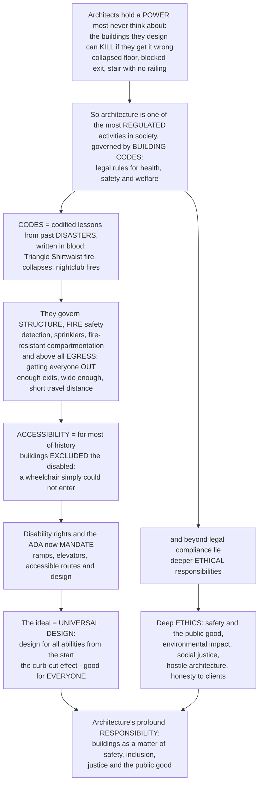

# Codes, Accessibility and the Ethics of Building

> [!abstract] TL;DR
> **Architects hold a power most people never think about: the buildings they design can KILL if they get them wrong — a collapsed floor, a blocked fire exit, a stair with no railing — which makes architecture one of the most REGULATED activities in society and a fundamentally ETHICAL practice.** Because buildings profoundly affect public **health, safety, and welfare**, they are governed by **BUILDING CODES**: detailed, legally enforceable rules for how a building must be designed and constructed. Codes are, almost literally, **codified lessons from past disasters — "written in blood"** — nearly every clause exists because someone died: fire and **egress** rules from catastrophic fires, structural rules from collapses. They govern structure, **FIRE safety** (the biggest — detection, sprinklers, fire-resistant compartmentation, and above all **getting everyone OUT** through enough exits of enough width within a safe travel distance), sanitation, and energy. A morally powerful dimension is **ACCESSIBILITY**: for most of history buildings were designed only for the able-bodied — a wheelchair user simply could not enter — until the **disability rights** movement and laws like the **Americans with Disabilities Act (1990)** mandated ramps, elevators, and accessible design, giving rise to the ideal of **UNIVERSAL DESIGN** (design for the full range of human ability from the start, which — through the **curb-cut effect** — helps everyone). Beyond codes lie deep **ethical** questions: the architect's duty to the public good, buildings' enormous **environmental** impact, **social justice** and displacement, "**hostile architecture**," and honesty to clients — making the design of buildings a matter of safety, inclusion, justice, and the common good.

---

## Intuition

**Analogy — the surgeon and the second brain of rules.** A surgeon's hands can heal or kill, so society does not let just anyone operate, and does not let even a licensed surgeon do whatever they please: there are sterile protocols, checklists, consent forms, and a mountain of regulation, and almost every rule on that list exists because at some point a patient died when it was missing. **An architect is in the same position, only the "patient" is everyone who will ever set foot in the building.** A badly designed building can kill on a scale a surgeon never could — a floor that collapses under a crowd, a nightclub whose one unlocked door cannot empty in time when the fire starts, a stair with no handrail down which an old woman falls. So society does not let buildings be built on private taste alone; it wraps them in a dense second brain of rules — the **building code** — and holds the architect legally and morally accountable for the lives inside.

Extend the analogy and the whole subject appears. The surgeon's checklist is not arbitrary bureaucracy; it is **compressed, remembered catastrophe** — each item a scar. The **building code is exactly that**: a fire that killed 146 garment workers behind locked doors gave us mandatory unlocked, outward-swinging exits and fire escapes; nightclub fires that killed hundreds gave us sprinkler and exit-capacity rules; collapses gave us structural provisions. To read a code is to read an obituary column translated into millimetres and minutes. And just as medicine eventually recognised that a hospital designed only for the average body failed the disabled, the deaf, and the frail, architecture recognised — late, and only after a **disability rights** movement forced it — that a built world of steps and narrow doors *actively excluded* millions. The response, **accessibility law** and then **universal design**, reframed the ramp not as charity for a few but as better design for all. Layer on top the architect's remaining moral choices — the climate cost of what they build, whose neighbourhood they gentrify, whether they design the prison or the hostile bench — and architecture stands revealed as one of the most **consequential ethical practices** there is: the art of shaping the space in which human lives are safe, included, or endangered.

---

## How It Works

### Core mechanics

Codes, accessibility, and ethics form the machinery by which a private act of design is made accountable to the public. The mechanism runs roughly like this:

1. **The public stake in buildings.** A building is not a private object like a painting; it is a place where strangers — the public — gather, sleep, work, and flee. Its failures are *public* failures: structural collapse, fire, falls, disease, exclusion. This public stake in **health, safety, and welfare** is the constitutional basis for regulating architecture (the "police power" of the state) and the reason the architect owes a **duty of care** far beyond the client who pays them.
2. **Building codes as the legal framework.** A **building code** is the detailed, legally enforceable body of rules specifying how a building must be designed and built. In practice most jurisdictions adopt a **model code** (in the US, the **International Building Code / IBC**, plus fire codes like NFPA), amend it locally, and enforce it through **permitting, plan review, and inspection**. Codes cover structure, **fire and life safety**, means of egress, sanitation and plumbing, mechanical and energy, and **accessibility**; alongside them run **zoning and land-use** law (what and how big you may build where) and specialty codes (electrical, plumbing, energy). Codes are increasingly split between **prescriptive** rules ("do exactly this") and **performance-based** rules ("achieve this outcome, by any validated means"), the latter giving designers freedom at the cost of proof.
3. **Codes as codified disaster — "written in blood."** Regulation is a **path-dependent, failure-driven** memory: rules are added *after* people die and are almost never removed. The **Triangle Shirtwaist fire (1911)**, in which 146 workers died behind locked doors with too few exits, drove modern fire-escape, exit, and workplace-safety law; theatre and nightclub fires (Iroquois, Cocoanut Grove, The Station) drove sprinkler, exit-capacity, and outward-swinging-door rules; structural collapses drove structural provisions. The code is the accumulated scar tissue of the built environment.
4. **Fire and life safety — the core.** Fire is the dominant life-safety concern, and the code attacks it in depth: **prevention**, **detection and alarm**, **suppression** (sprinklers), **fire-resistant construction and compartmentation** (walls and floors rated to contain fire and smoke for a set time), and — above all — **means of egress**. Egress is a *mathematical* problem: the **occupant load** (people the space may hold) sets the required **number and width of exits**, the **maximum travel distance** to an exit, and the provision of **protected stairs** and signage, so that everyone can get out before conditions become untenable. The demo below models exactly this.
5. **Accessibility and universal design.** For most of history the built environment was designed for the able-bodied, silently **excluding** wheelchair users, the blind, the deaf, and the frail. The **disability rights** movement reframed this: under the **social model of disability**, it is the *environment* (the step, the narrow door) that disables, not the body. **Accessibility legislation** — the **ADA (1990)** in the US, and equivalents worldwide — now *mandates* accessible routes, ramps within a maximum slope, elevators, door widths and turning clearances, and accessible restrooms and signage. **Ronald Mace's universal design** goes further: design for the full range of ability and age *from the start*, so the same solution serves everyone — the famous **curb-cut effect**, where a ramp cut for wheelchairs also serves strollers, luggage, delivery carts, cyclists, and the elderly.
6. **The ethics beyond the code.** Codes set a legal floor, not a moral ceiling. Above them lie the architect's genuine ethical choices: **environmental** responsibility (buildings drive roughly 40% of global energy-related emissions, making sustainability a moral imperative); **social justice** (who gets good space, housing as a right, **displacement and gentrification**, the ethics of designing prisons, surveillance, or **"hostile architecture"** that spikes benches against the homeless); **labor** ethics (construction-worker safety); heritage and preservation; and **honesty** to clients and public. Professional **codes of conduct** formalise some of this, but much remains the architect's own conscience about *whom* they build for.

### Flow / Architecture



---

## Key Concepts

**Secondary (can explain to a bright 16-year-old):**
- **A bad building can kill people.** If a floor is too weak it can collapse under a crowd; if a fire starts and the doors are locked or too few, people cannot get out in time. Because of this, buildings are not built however the owner likes — there are strict **rules**, called the **building code**, that every building must follow.
- **Most safety rules exist because someone died.** Fire exits that must be unlocked and open outward, sprinklers, handrails on stairs — nearly every rule was added after a real disaster killed real people. The building code is sometimes called "**written in blood**."
- **Getting out matters most.** The single biggest fire-safety idea is **egress** — making sure everyone can escape. That means enough exits, wide enough, close enough, with clear signs, so a crowded room can empty before smoke fills it.
- **Buildings used to shut out disabled people.** Steps, narrow doors, and no elevators meant a person in a wheelchair often literally could not get in. Laws now require **ramps, elevators, and accessible doors** — and it turns out those help lots of other people too: parents with strollers, travellers with suitcases, the elderly.

**Undergraduate (needs some background):**
- **Occupant load and means of egress.** The **occupant load** is the maximum number of people a space is designed to hold (floor area ÷ an occupancy factor). It drives everything in egress: the **minimum number of exits** (typically 2 up to ~500 people, 3 up to ~1000, 4 above), the **required total exit width** (occupant load × a width factor), and the **maximum travel distance** to a protected exit. Get the occupant load wrong and the whole life-safety calculation is wrong.
- **Defence in depth against fire.** Codes stack independent layers: **detection** (alarms) buys time; **suppression** (sprinklers) limits growth; **compartmentation** (fire-rated walls/floors) contains fire and smoke for a rated time; and **egress** removes the occupants. No single layer is trusted alone — which is why removing one (a wedged-open fire door, a disabled sprinkler) is so dangerous.
- **The ADA and the accessible route.** Accessibility law specifies measurable requirements: a **ramp no steeper than 1:12** with level landings, minimum **32-inch clear door widths**, a **60-inch wheelchair turning circle**, accessible restrooms, reach ranges, and tactile/visual signage — all knit into a continuous **accessible route** from the site boundary to the usable spaces.
- **The social model of disability and the curb-cut effect.** The **social model** locates disability in the *environment*, not the person: the step disables, not the legs. **Universal design** (Ronald Mace) responds by designing for the widest range of ability from the outset. The **curb-cut effect** is the empirical payoff: features built for a minority (dropped kerbs, ramps, captions, lever handles) turn out to benefit a large majority.
- **Prescriptive vs performance codes, and design freedom.** A **prescriptive** code dictates the exact solution; a **performance-based** code sets a required outcome (e.g., "occupants can reach safety before untenable conditions") that the designer must *demonstrate*, often by fire-egress modelling. Performance codes unlock innovative or heritage-sensitive designs but shift the burden of proof — and liability — onto the design team.

**Graduate (system-level thinking):**
- **Regulation as evolutionary, failure-driven memory.** Building codes are a **ratchet**: clauses accrete after disasters and rarely retract, so the regulatory envelope is a monotonic accumulation of institutional learning. This has virtues (hard-won safety) and pathologies (regulatory capture, cost inflation, calcified prescriptions that block better performance-based solutions). Understanding codes means reading them as *sedimented history*, not timeless logic — the domain of [[Regulation_and_Regulatory_Economics]] and [[Administrative_Law_and_Regulation]].
- **The economics of life safety and acceptable risk.** Egress and structural provisions implicitly assign a **value to a statistical life** and choose a **target risk** (e.g., an acceptable probability of untenable conditions before evacuation). Codes are, in effect, society's revealed cost–benefit trade-off between construction cost and expected fatalities — a public-policy calculation as much as an engineering one, connected to tort **liability** ([[Tort_Law]]) that prices failure after the fact.
- **Accessibility as distributive justice, not accommodation.** Framing accessibility as a "special accommodation" for a minority is a category error. Under the **social model** and a **justice** lens ([[Distributive_Justice_and_Inequality]], [[Rights_and_Civil_Liberties]]), an inaccessible building is a *structural denial of equal participation* — like a poll tax on the built environment. Universal design internalises this: it treats the full ability distribution as the design population, converting an externality (exclusion) into a baseline requirement.
- **Hostile architecture and the ethics of exclusion by design.** The same spatial power that can include can also **exclude**: anti-homeless spikes, sloped or divided benches, defensive urban design, and surveillance-optimised space encode a politics into form. Here architecture is unavoidably normative — the question is not *whether* a design takes a moral stance but *which*, tying the discipline to political and business ethics ([[Business_Ethics]], [[Environmental_Justice_and_Sustainability]]).
- **The expanding circle of responsibility.** The architect's duty is widening from *occupants* (life safety) to *the excluded* (accessibility) to *the planet and future generations* (embodied and operational carbon, [[Environmental_Ethics]]) to *the surrounding community* (displacement, equity). Each expansion adds a new class of moral patient to whom the design is accountable — the trajectory that makes contemporary practice an ethical, not merely technical, endeavour.

---

## Python Demo

```python
# Codes, accessibility and the ethics of building, quantified:
#   (a) EGRESS / EVACUATION CAPACITY: model the life-safety core of building codes -
#       Required Safe Egress Time (RSET) = travel time + flow time through the exits -
#       and show why a building with too few / blocked exits cannot clear before
#       conditions become untenable (the codified lesson of fire disasters).
#   (b) CODE-REQUIRED EXITS & WIDTH: minimum number of exits and total egress width
#       as a function of occupant load (the arithmetic the code mandates).
#   (c) ACCESSIBILITY - the RAMP SLOPE rule: ramp run needed for a given rise at the
#       ADA 1:12 maximum vs steeper (unusable) and gentler slopes.
#   (d) UNIVERSAL DESIGN - the CURB-CUT EFFECT: step-free access is designed for
#       wheelchair users but benefits a far larger share of the population.
# Requires: numpy, matplotlib
import numpy as np
import matplotlib.pyplot as plt

# ============================================================
# (a) EGRESS / EVACUATION CAPACITY - the mathematics of getting OUT
#     RSET = L/v + N / (Fs * W_total)
#       L  = travel distance to an exit (m)
#       v  = walking speed (m/s)
#       Fs = specific flow through a door (persons per metre-width per second)
#       W_total = total clear exit width (m),  N = occupant load
# ============================================================
v, L, Fs = 1.2, 45.0, 1.3
N = np.arange(0, 1001)

def rset(N, W_total):
    return L / v + N / (Fs * W_total)

W_single, W_code2, W_gen4 = 0.9, 1.8, 3.6      # 1 blocked door / 2 code-min / 4 generous
ASET = 300.0                                    # available safe egress time (~5 min), s

# occupant load at which each configuration first exceeds the tenability limit
def crossing(W):
    return (ASET - L / v) * Fs * W
print("Occupant load at which RSET exceeds the ~5 min tenability limit (ASET):")
for label, W in [("1 usable door (others blocked)", W_single),
                 ("2 code-minimum exits", W_code2),
                 ("4 generous exits", W_gen4)]:
    print(f"  {label:<32} N = {crossing(W):5.0f} people")

# ============================================================
# (b) CODE-REQUIRED MINIMUM EXITS & EGRESS WIDTH vs occupant load (IBC-style)
# ============================================================
def min_exits(N):
    return np.where(N <= 500, 2, np.where(N <= 1000, 3, 4))
width_factor = 0.005                             # ~5 mm clear width per occupant
req_width = np.maximum(min_exits(N) * 0.9, N * width_factor)

# ============================================================
# (c) ACCESSIBILITY - the RAMP SLOPE rule (ADA 1:12 maximum)
#     ramp run = rise / slope ; landings required every 760 mm of rise
# ============================================================
rise = np.linspace(0.0, 1.5, 200)
slopes = {"1:8  too steep - unsafe": 1/8,
          "1:12 ADA maximum":        1/12,
          "1:16 comfortable":        1/16}

# ============================================================
# (d) UNIVERSAL DESIGN - the CURB-CUT EFFECT
#     approx share of the population helped by step-free / ramped access
# ============================================================
groups = ["Wheelchair\nusers", "Other mobility\naids", "Parents with\nstrollers",
          "Wheeled\nluggage", "Temporarily\ninjured", "Elderly\n(65+)", "Delivery\ncarts"]
benefit = np.array([1.5, 5.0, 4.0, 8.0, 2.5, 16.0, 3.0])   # % of population
target_only = benefit[0]
all_benefit = benefit.sum()

# ============================================================
# PLOT
# ============================================================
fig, ax = plt.subplots(2, 2, figsize=(14, 11))
fig.suptitle("Codes, Accessibility and the Ethics of Building", fontsize=15, weight="bold")

# ---- (a) evacuation time vs occupant load ----
a = ax[0, 0]
a.plot(N, rset(N, W_single), color="#d1495b", lw=2, label="1 usable door (others blocked)")
a.plot(N, rset(N, W_code2),  color="#e09f3e", lw=2, label="2 code-minimum exits")
a.plot(N, rset(N, W_gen4),   color="#2a9d8f", lw=2, label="4 generous exits")
a.axhline(ASET, color="black", ls="--", lw=1.4)
a.text(20, ASET + 10, "ASET ~ 5 min: conditions become UNTENABLE", fontsize=8)
a.fill_between(N, ASET, rset(N, W_single), where=(rset(N, W_single) > ASET),
               color="#d1495b", alpha=0.12)
a.set_xlabel("occupant load  N  (people)")
a.set_ylabel("Required Safe Egress Time  RSET  (s)")
a.set_title("(a) EGRESS: too few / blocked exits cannot clear\n"
            "before smoke fills - 'codes written in blood'", fontsize=10)
a.set_ylim(0, 900)
a.legend(fontsize=8, loc="upper left")
a.grid(alpha=0.3)

# ---- (b) code-required exits & egress width ----
b = ax[0, 1]
b.plot(N, req_width, color="#4c72b0", lw=2.2, label="required total egress width")
b.set_xlabel("occupant load  N  (people)")
b.set_ylabel("required total clear egress width (m)", color="#4c72b0")
b.tick_params(axis="y", labelcolor="#4c72b0")
b2 = b.twinx()
b2.step(N, min_exits(N), where="post", color="#c44e52", lw=2, label="min. number of exits")
b2.set_ylabel("minimum number of exits", color="#c44e52")
b2.tick_params(axis="y", labelcolor="#c44e52")
b2.set_ylim(0, 5)
for x in (500, 1000):
    b.axvline(x, color="grey", ls=":", lw=1)
b.set_title("(b) What the code MANDATES: exits & width\n"
            "scale with the occupant load", fontsize=10)
b.grid(alpha=0.3)
b.legend(loc="upper left", fontsize=8)
b2.legend(loc="lower right", fontsize=8)

# ---- (c) ramp slope / accessibility ----
c = ax[1, 0]
colors = {"1:8  too steep - unsafe": "#d1495b",
          "1:12 ADA maximum":        "#2a9d8f",
          "1:16 comfortable":        "#4c72b0"}
for label, s in slopes.items():
    c.plot(rise, rise / s, color=colors[label], lw=2, label=label)
c.axvline(0.76, color="black", ls="--", lw=1.2)
c.text(0.78, 1.0, "ADA: a level LANDING is required\nevery 760 mm of rise", fontsize=8)
c.scatter([0.75], [0.75 / (1/12)], color="#2a9d8f", zorder=5)
c.annotate("0.75 m rise at 1:12\nneeds a 9 m ramp run", (0.75, 9.0),
           xytext=(0.30, 14.0), fontsize=8,
           arrowprops=dict(arrowstyle="->", color="#2a9d8f"))
c.set_xlabel("vertical rise (m)")
c.set_ylabel("ramp run needed (m)")
c.set_title("(c) ACCESSIBILITY: the 1:12 ramp-slope rule\n"
            "steeper ramps are shorter but unusable / unsafe", fontsize=10)
c.legend(fontsize=8, loc="upper left")
c.grid(alpha=0.3)

# ---- (d) curb-cut effect ----
d = ax[1, 1]
order = np.argsort(benefit)
ypos = np.arange(len(groups))
d.barh(ypos, benefit[order], color="#2a9d8f", edgecolor="black")
d.set_yticks(ypos)
d.set_yticklabels([groups[i] for i in order], fontsize=8)
d.set_xlabel("share of population helped by step-free access (%)")
d.set_title(f"(d) UNIVERSAL DESIGN - the curb-cut effect\n"
            f"designed for ~{target_only:.1f}% (wheelchair users), "
            f"helps ~{all_benefit:.0f}%", fontsize=10)
d.axvline(target_only, color="#d1495b", ls="--", lw=1.4)
d.text(target_only + 0.3, 0.2, "intended\nbeneficiaries", color="#d1495b", fontsize=8)
d.grid(axis="x", alpha=0.3)

plt.tight_layout(rect=[0, 0, 1, 0.96])
plt.savefig("codes_accessibility_and_ethics.png", dpi=120, bbox_inches="tight")
plt.show()

# Takeaway:
#  (a) With only one usable door, a room of just ~300 people already cannot evacuate
#      within the tenability limit - the exact failure mode of the Triangle Shirtwaist
#      and nightclub fires, and the reason codes MANDATE enough exits of enough width.
#  (b) The code turns that physics into arithmetic: minimum exit count and total width
#      scale with occupant load, so life safety is designed IN, not hoped for.
#  (c) The 1:12 rule shows why accessibility is geometry: a modest 0.75 m rise demands
#      a 9 m ramp plus landings - steeper ramps are short but unusable and dangerous.
#  (d) The curb-cut effect: a feature built for ~1.5% of people (wheelchair users)
#      ends up helping a large majority - universal design is better design for ALL.
```

Running this prints the occupant load at which each exit configuration exceeds the tenability limit and produces four panels: **(a)** evacuation-time curves crossing the **ASET** "untenable" line — showing a single blocked-down exit failing at only a few hundred people; **(b)** the code-mandated **minimum exit count** (a step function) and **required total egress width** rising with occupant load; **(c)** the **1:12 ramp-slope** rule and the run a given rise demands, with the landing requirement; and **(d)** the **curb-cut effect**, where step-free access designed for wheelchair users benefits a far larger share of the population.

---

## Real-World Applications

> **The Triangle Shirtwaist Factory fire (1911) — why the code is "written in blood."** 146 garment workers, mostly young immigrant women, died in a New York factory fire because doors were locked to prevent breaks, exits were too few and too narrow, and the fire escape collapsed. The public horror drove a wave of legislation — mandatory unlocked, outward-swinging exits, fire escapes, sprinklers, and occupancy limits — that became foundational to modern fire and egress codes. It is the demo's panel (a) turned into history: a building whose egress capacity could not clear its occupants in time.

> **Grenfell Tower (2017) — compartmentation and the failure of the envelope.** A refurbishment wrapped a London tower block in combustible cladding with a ventilated cavity that acted as a chimney; the fire that killed 72 people defeated the building's "**stay put**" compartmentation strategy in minutes. The UK's building-regulation and testing regime was overhauled in its wake — the clearest recent example of codes being rewritten *after* a disaster, and of fire safety living or dying in materials, detailing, and enforcement, not just in the rulebook's words.

> **The Americans with Disabilities Act (1990) — accessibility as civil right.** The ADA transformed the US built environment by making accessibility a matter of *civil rights*, not goodwill: curb cuts, ramps within the 1:12 maximum, accessible routes, elevators, door clearances, and accessible restrooms became legal requirements for public accommodations. Decades on, the **curb-cut effect** of panel (d) is everywhere visible — the dropped kerbs cut for wheelchairs now carry strollers, wheeled luggage, delivery carts, and cyclists.

> **Universal design — Ronald Mace and the OXO Good Grips story.** Architect Ronald Mace, himself a wheelchair user, coined **universal design**: environments and products usable by all people, to the greatest extent possible, without adaptation. Its commercial vindication is the **OXO Good Grips** peeler — designed for arthritic hands, it became a mainstream bestseller because a fat, cushioned, easy-grip handle is simply better for *everyone*. It is the design philosophy behind panel (d): accommodate the full range of ability from the start and the whole population gains.

> **Hostile architecture — designing exclusion into form.** "Anti-homeless" spikes, armrests that divide benches into un-liable segments, sloped ledges, and Camden-style bollards are deliberate design choices that exclude the vulnerable from public space. They are the ethical mirror image of the accessible ramp: the same spatial power used to *shut people out*, and a vivid reminder that a building's form always encodes a moral and political stance about whom it is for.

---

## Common Pitfalls

- **Treating code compliance as the whole of ethics.** A code-compliant building can still be an ugly, exclusionary, carbon-hungry, or unjust one. Codes are a **legal floor**, not a moral ceiling: minimum accessibility is not inclusive design, minimum energy performance is not a responsible carbon footprint, and "we met code" is a defence in court, not an ethical justification. The architect's real ethical work often begins *above* the code line.
- **Getting the occupant load wrong.** Every egress calculation cascades from the **occupant load**. Under-count it and you provide too few or too narrow exits; mis-classify the **occupancy** and you apply the wrong rules entirely. Assembly, residential, and hazardous occupancies carry very different life-safety demands, and errors here are the root of most catastrophic egress failures.
- **Defeating defence-in-depth.** Fire safety works because independent layers back each other up. Wedging open a fire door, disabling a sprinkler head to avoid "nuisance," blocking an exit with storage, or over-secure locking (the Triangle failure mode) removes a layer and can turn a survivable fire into a mass-casualty one. The layers are only protective if they are *maintained and operable*, not just installed.
- **Accessibility as a bolt-on afterthought.** Designing the "real" building and then hunting for a corner to add a ramp yields the ugly, circuitous, side-entrance accessibility that signals disabled users are second-class — and often fails technically (a ramp too steep, a lift that dead-ends). **Universal design** demands accessibility be a *generative constraint from the first sketch*, integrated into the main route, not an apologetic annex.
- **Ignoring the curb-cut effect (and over-narrow cost–benefit).** Dismissing accessibility as expensive provision for a small minority ignores that the same features benefit a large majority (the elderly, the injured, parents, travellers, delivery workers). Costing accessibility against only its nominal target population systematically undervalues it and produces a meaner, less usable building for everyone.
- **Forgetting whom you build for.** Architects can treat commissions as morally neutral technical problems, but the choice to design a prison, a surveillance-optimised space, hostile street furniture, or luxury housing that displaces a community is an **ethical** choice. Pretending the brief absolves the designer ("I just met the client's needs") evades the profession's genuine agency and complicity.

---

## Related Concepts

*This note sits in the Architecture vault's S05 (Building Types, Systems and Practice). Its sibling notes — **Architecture Overview and the Art of Building** (what architecture is and why it carries public responsibility), **Construction and Building Technology** (how codes govern the assembly that gets built, and why "most failures are water"), **The Architectural Profession and Practice** (professional licensure, liability, and codes of conduct that enforce this duty), **Architecture Culture and Society** (the social-justice dimension of who gets good space), **Building Systems and Environmental Control** (the fire-detection, sprinkler, and life-safety systems referenced here), and **Sustainable and Green Architecture** (the environmental ethics and net-zero codes discussed above) — expand these themes and are referenced in prose. The cross-vault links below are Glob-verified to exist.*

- [[Administrative_Law_and_Regulation]] — the legal machinery of rule-making, permitting, and enforcement within which building codes operate as delegated regulation.
- [[Tort_Law]] — the negligence and liability regime that prices building failure *after* the fact, giving codes their teeth and the architect a duty of care.
- [[Rights_and_Civil_Liberties]] — the rights framework that reframed accessibility (the ADA) from accommodation into a matter of equal participation and civil rights.
- [[Regulation_and_Regulatory_Economics]] — why and how governments regulate for health and safety, and the cost–benefit logic behind life-safety and accessibility mandates.
- [[Design_Codes_and_Structural_Safety]] — the engineering side of codes: load factors, safety margins, and structural provisions that keep buildings standing.
- [[Environmental_Ethics]] — the moral basis for the architect's climate and resource responsibility, the ethical core of sustainable building.
- [[Environmental_Justice_and_Sustainability]] — the equity dimension of environmental harm, connecting sustainable building to who bears its burdens and benefits.
- [[Distributive_Justice_and_Inequality]] — the justice lens on unequal access to good space, housing, and the built environment behind accessibility and anti-displacement ethics.
- [[Business_Ethics]] — professional and organisational ethics, informing codes of conduct, honesty to clients, and the question of whom the architect serves.

---

## Review Questions

**Secondary:**
1. People say building codes are "written in blood." Explain what that phrase means, give one example of a rule and the kind of disaster that might have caused it, and describe what "egress" means and why it is the most important idea in fire safety. Then explain, in your own words, why a ramp built for wheelchair users ends up helping many other people too.

**Undergraduate:**
2. A new assembly hall has an occupant load of 900 people. Using the ideas of **occupant load**, **minimum number of exits**, **required egress width**, and **maximum travel distance**, explain how a code determines whether its exits are adequate, and describe what happens to the **Required Safe Egress Time** if half the exits are blocked. Separately, using the **1:12 rule** and the **curb-cut effect**, explain why an accessible ramp is both a geometric constraint and a benefit far beyond its intended users.

**Graduate:**
3. "Code compliance is a legal floor, not a moral ceiling." Defend this claim with reference to three domains: **fire/life safety**, **accessibility/universal design**, and **environmental responsibility**. Then analyse a genuinely contested ethical case — for example, an architect asked to design a prison, a surveillance-heavy "smart" building, or "hostile" street furniture — using the concepts of the **social model of disability**, **distributive justice**, and the architect's **agency and complicity**. How should the profession balance the duty to the client, the public good, and whom a building ultimately serves?

---

## Sources

- Francis D. K. Ching & Steven R. Winkel, *Building Codes Illustrated: A Guide to Understanding the 2021 International Building Code* (Wiley) — the standard illustrated guide to code compliance, egress, and life safety — [Publisher page](https://www.wiley.com/en-us/Building+Codes+Illustrated%3A+A+Guide+to+Understanding+the+2021+International+Building+Code%2C+7th+Edition-p-9781119772408)
- U.S. Department of Justice, *2010 ADA Standards for Accessible Design* — the legally enforceable US accessibility requirements (ramps, routes, clearances) — [ADA.gov](https://www.ada.gov/law-and-regs/design-standards/2010-stds/)
- Ronald L. Mace et al., *The Principles of Universal Design* (Center for Universal Design, NC State) — the founding statement of universal design — [Center for Universal Design](https://design.ncsu.edu/research/center-for-universal-design/)
- Tom Spector, *The Ethical Architect: The Dilemma of Contemporary Practice* (Princeton Architectural Press, 2001) — the moral dimensions of architectural practice beyond the code — [Publisher page](https://papress.com/products/the-ethical-architect)
- National Fire Protection Association, *NFPA 101: Life Safety Code* — the model code governing egress, occupant load, and means-of-escape requirements — [NFPA](https://www.nfpa.org/codes-and-standards/nfpa-101-standard-development/101)

---

#architecture #building-codes #accessibility #universal-design #architecture-ethics
