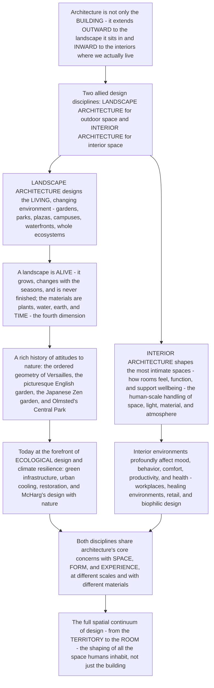

# 🌳 Landscape and Interior Architecture

> [!abstract] TL;DR
> **Architecture is not only about the *building* — it extends OUTWARD to the LANDSCAPE the building sits in, and INWARD to the INTERIOR spaces where we actually spend our lives.** These are two allied design disciplines that share architecture's core concerns with **space, form, and experience**, but work at different scales and with different materials. **Landscape architecture** designs *outdoor and living space* at every scale — gardens, parks, plazas, campuses, waterfronts, greenways, and whole territories — and its material is unlike a building's: a landscape is **alive**. It grows, shifts with the seasons, and evolves over decades; the designer works with **plants, water, earth, topography, climate, and TIME** as media, so a garden is *never "finished"* — time is landscape's fourth dimension. Its history runs from the ordered geometric gardens of **Versailles** (nature dominated), through the English **picturesque** landscape garden and the **Japanese** Zen garden, to Frederick Law **Olmsted's** great urban parks (**Central Park** — nature for the health and democracy of the industrial city). Today landscape architecture stands at the forefront of **ecological design and climate resilience** — Ian McHarg's *Design with Nature*, **green infrastructure** (bioswales, rain gardens, permeable surfaces that manage stormwater), urban cooling against the heat island, ecological restoration, and resilient "living shorelines." **Interior architecture** shapes the spaces we inhabit most intimately — more than surface "decorating," it is the *shaping of the rooms we live in*: the human-scale handling of **space, light, material, color, acoustics, furniture, ergonomics, and atmosphere** that profoundly affects **mood, behavior, comfort, productivity, wellbeing, and health** (workplaces, healing/healthcare environments, retail, hospitality, biophilic interiors). Together with the building itself, landscape and interior form **the full spatial continuum of design — from the territory to the room** — the shaping of *all* the space humans inhabit, not just the building's walls.

---

## Intuition

**Analogy — a play needs more than the theatre building.** Picture a great performance. Your eye goes first to the *building* — the grand auditorium. But the experience is not just the building. It is also the *approach* — the plaza, the trees, the fountain, the walk up under the sky that sets your mood before you enter — and it is also the *inside* — the intimate foyer, the warm light, the plush seat, the acoustics that wrap around you. Take away the outdoor setting and the interior, and you have only a shell. **Architecture is exactly like this: the building is only the middle term of a continuum that reaches OUTWARD into the landscape it sits in, and INWARD into the rooms where life actually happens.** We spend almost all our waking lives *inside* interior spaces or *outside* in designed landscapes — and both are *designed*, by two disciplines allied to architecture: **landscape architecture** shapes the outdoor world, and **interior architecture** shapes the inhabited room. To understand only the building and ignore its landscape and its interior is to understand only the theatre walls and miss the whole show.

Now hold the two disciplines up side by side, because they are strange twins. **Landscape architecture designs the LIVING, changing environment** — gardens, parks, plazas, campuses, streetscapes, waterfronts, greenways, and increasingly *whole ecological systems*. And here is what makes it unlike any other design art: its material is **alive**. A building, once built, is essentially fixed — it decays slowly but it does not *grow*. A landscape **grows**. It changes with the hours and the **seasons** (bare branch to full canopy to autumn blaze to bare branch again), and it **evolves over decades**: the sapling the designer plants becomes a great shade tree only thirty years later, so the design *completes itself over time*, and a garden is famously **never "finished."** The landscape architect therefore works not just with plants, water, earth, topography, and climate, but with **TIME itself** as a material — the "fourth dimension" of the discipline. This is a profoundly different way to design: you are not composing a fixed object, you are *choreographing a living process* that you will not live to see mature. The history of the art is a history of *attitudes to nature*: the **formal** geometric garden that orders and dominates nature (the Islamic paradise garden, the Italian Renaissance garden, and above all Le Nôtre's **Versailles** — nature made to bow to geometry and to the king); the **English picturesque** landscape garden that idealizes "natural" scenery (Capability Brown's rolling parks); the **Japanese** garden of contemplation, symbolism, and miniaturized nature (the Zen dry garden); and the great nineteenth-century **urban park** movement, whose towering figure is Frederick Law **Olmsted**. Olmsted's **Central Park** was not decoration — it was a piece of *social infrastructure*, "the lungs of the city," bringing nature to the crowded industrial metropolis for public **health, democracy, and civic life**. And today the discipline has arrived at its most urgent frontier: **ecological design**. Ian McHarg's *Design with Nature* taught landscape architects to *plan with* natural systems rather than against them; **green infrastructure** uses vegetated, permeable ground — bioswales, rain gardens, wetlands, green roofs — to soak up and clean stormwater the way pavement never can; green cooling fights the **urban heat island**; restoration and rewilding rebuild ecosystems; and "living shorelines" defend coasts against a changing climate. The landscape is now understood as **living ecological and social infrastructure**.

**Interior architecture shapes the other end of the continuum — the spaces we inhabit most intimately.** This is emphatically *not* the same as surface "decorating" — choosing cushions and paint. Interior architecture is the **shaping of interior space itself**: how a room is *organized*, how it *feels*, how it *supports human activity and wellbeing*. It works at the **human scale**, with the elements the body meets directly — the **quality and organization of space**, **light** (a north window versus a warm lamp entirely changes a room), **materials, color, texture, and acoustics**, **furniture and fittings**, and above all **atmosphere**, that immediate emotional "feel" you sense the instant you walk in. It is deeply concerned with **ergonomics and human factors** — the fit between the body and the room, the reach of a counter, the height of a stair — and with the **psychology of interiors**: interior environments demonstrably shape **mood, behavior, comfort, productivity, wellbeing, and even health**. This is why interior architecture is central to **workplace design** (open plan versus focus rooms, daylight and view), **healing environments** (hospitals designed to reduce stress and speed recovery), **retail and hospitality** (spaces engineered for a feeling), and **biophilic design** (bringing nature indoors for its psychological benefit). Both disciplines share architecture's deepest concerns — **space, form, and experience** — but at opposite scales and with opposite materials: the **vast, living, and ecological** on one hand; the **intimate, human, and inhabited** on the other. Grasp them together and you grasp the *whole* subject: the design of **all** the space humans occupy, from the territory to the room.

---

## How It Works

### Core mechanics

1. **The spatial continuum — architecture reaches out and in.** Architecture is one band of a continuous spectrum of spatial design. Reaching **outward** from the building is the **landscape** — its immediate site, its garden or plaza, and the wider outdoor environment out to the scale of the region. Reaching **inward** is the **interior** — the actual inhabited rooms. Landscape architecture and interior architecture are the *allied disciplines* that design these two ends, sharing architecture's grammar of **space, form, and experience** but at different scales and in different media. Great design integrates all three — **building, site, and interior** — into one coherent whole.
2. **Landscape as a LIVING, TEMPORAL medium.** The defining fact of landscape architecture is that its material is *alive and changing*. The designer works with **plants, water, earth (topography/grading), climate, and time**. Unlike a building, a designed landscape **grows and changes**: on the **short cycle** of the seasons (bud, bloom, full canopy, senescence, dormancy) and on the **long cycle** of **growth and ecological succession** over decades (a sapling maturing into a canopy tree; a pioneer community giving way to a climax community). Consequently the landscape is **never "finished"** — it must be designed *for change over time*, and **time is its fourth dimension**.
3. **The elements and principles of landscape design.** Landscape is composed with a palette partly shared with architecture and partly its own: **topography and grading** (shaping the ground), **planting design** (structure, color, texture, and seasonal succession of vegetation), **water** (still and moving), **circulation** (paths and movement), **spatial sequence and enclosure**, **views and framing**, and the classical device of the **"borrowed landscape"** (composing distant scenery into the design). Many of these — sequence, enclosure, framing, composition — are the same spatial principles that govern buildings, applied outdoors.
4. **The great garden and landscape traditions.** History offers distinct *theories of the relationship between design and nature*: the **formal/geometric** garden (nature *ordered and dominated* — the Islamic *chahar bagh* paradise garden, the Italian Renaissance terraced garden, and the French formal garden of Le Nôtre at **Versailles**); the **English landscape / picturesque** garden (nature *idealized* as painterly "natural" scenery — Capability Brown); the **Japanese** garden (nature *contemplated and symbolized*, miniaturized — the Zen dry garden of raked gravel and stone); and the **urban park** movement (nature as *public infrastructure* — **Olmsted's Central Park** for the health and democracy of the industrial city).
5. **The ecological turn — landscape as living infrastructure.** Modern landscape architecture leads the design professions in **ecological and sustainable practice**. Ian McHarg's **Design with Nature** established *ecological planning* and **suitability analysis** (overlaying natural constraints — the intellectual root of GIS and environmental planning). **Green infrastructure** manages stormwater with vegetated, permeable ground — **bioswales, rain gardens, permeable paving, constructed wetlands, green roofs** — which *infiltrate, slow, and clean* runoff that hard pavement would dump fast into drains. Landscape architects also lead **ecological restoration and rewilding**, **urban ecology and biodiversity**, **green cooling** against the **urban heat island**, **resilient/adaptive landscapes** (flood and climate resilience, "living shorelines"), and **landscape urbanism** (landscape as the organizing framework of the city).
6. **Interior architecture — shaping inhabited space.** Interior architecture is the design of **interior space** (distinct from decorative "styling"): the **spatial quality and organization** of rooms; the **human-scale experience**; **light**, **materials, color, texture, acoustics**, and **atmosphere**; **furniture, fittings, and the object**; and **ergonomics/human factors** — the fit of the room to the body. It applies the **psychology of interiors**: how interior environments shape **mood, behavior, comfort, productivity, wellbeing, and health** — the substance of workplace, healthcare (*healing environments*), retail, hospitality, and **biophilic** design. Much interior work is now **adaptive reuse** — inserting new inhabited space inside an existing shell.
7. **The relationship — the total designed environment.** The strongest work dissolves the boundaries: the **continuity of inside and outside** (the threshold, the garden-room, the veranda, the courtyard), the **building sited in its landscape** ("touching the earth" well), and the *Gesamtkunstwerk* ideal of the **total designed environment** — "from the site to the doorknob," the Arts and Crafts and Frank Lloyd Wright aspiration to design *everything* as one coherent whole. Landscape, building, and interior are collaborators in one continuum.

### Flow / architecture



---

## Key Concepts

### 🟢 Secondary — from the garden to the room

- **Architecture is not just the building.** It reaches *outside* to the garden, park, or plaza around the building, and *inside* to the actual rooms we live in. Two design jobs handle these: **landscape architecture** (the outdoor spaces) and **interior architecture** (the inside spaces).
- **A landscape is alive — a building isn't.** Once you build a wall it just sits there. But a garden or park **grows and changes**. It looks different in spring, summer, autumn, and winter, and a tree the designer plants might take *thirty years* to grow big. So a garden is *never really finished* — the designer plans for how it will change over time.
- **Landscape architects design with living things.** Their "materials" are **plants, water, earth, and time** — not just bricks. They shape the ground, plant trees, place water, and lay out paths so people can walk, rest, and enjoy nature.
- **Great parks are for everyone's health.** **Central Park** in New York was designed by Frederick Law Olmsted to bring nature into a crowded, dirty industrial city — a green "lungs" where all people, rich or poor, could get fresh air. Parks are good for our health and our communities.
- **Green ground soaks up rain.** When rain hits **pavement** it rushes off fast and can cause floods. When it hits a **garden, a rain garden, or grass**, it soaks in slowly and gets cleaned. Landscape architects now design with plants to manage rainwater and cool hot cities.
- **Interior architecture is more than decorating.** It is not just picking paint and cushions — it is *shaping the room itself*: how big it feels, how the light falls, what materials you touch, how the furniture is arranged. A good room *feels* right and helps you do what you came to do.
- **Rooms affect how you feel.** A dark, cramped, noisy room can make you tense; a bright, calm, well-arranged room can make you relaxed and focused. That is why the design of hospitals, schools, offices, and homes matters for our mood and health.

### 🟡 Undergraduate — the two disciplines in depth

- **The spatial continuum.** Architecture sits in a continuum: **landscape** (outward, from the site to the region) → **building** → **interior** (inward, the inhabited rooms). Landscape and interior architecture are *allied disciplines* sharing architecture's grammar of **space, form, and experience** at different scales. The best projects integrate **building + site + interior** as one whole.
- **Landscape as a temporal, living medium — the fourth dimension.** The signature of landscape architecture is designing with **time**. Two clocks run: the **seasonal cycle** (canopy, color, and bloom shifting across the year) and the **long-term growth/succession** clock (a planting maturing over 20–40 years; ecological succession shifting the plant community). Design intent may only be *realized decades later* — so plans must anticipate change, maintenance, and mortality. The landscape is "never finished."
- **Elements and principles of landscape design.** The palette: **topography/grading**, **planting design** (structure, texture, seasonal succession), **water**, **circulation**, **spatial sequence and enclosure**, **views/framing**, and the **borrowed landscape**. Many are shared with building composition, applied to a living, outdoor, all-around medium.
- **The garden traditions as theories of nature.** **Formal/geometric** (Islamic paradise garden, Italian Renaissance garden, French **Versailles** — nature *dominated*); **English picturesque** (Capability Brown — nature *idealized* as scenery, tied to the aesthetics of the **picturesque** and the **sublime**); **Japanese** (Zen dry garden — nature *contemplated, symbolized, miniaturized*); **urban park** (**Olmsted** — nature as *public health and democratic infrastructure*).
- **Ecological landscape and green infrastructure.** McHarg's **suitability analysis** (the root of GIS/environmental planning); **green infrastructure** for **stormwater** (bioswales, rain gardens, permeable paving, wetlands, green roofs that *infiltrate and delay* runoff versus impervious pavement's fast, high peak); **urban heat island** mitigation through vegetation and evapotranspiration; **restoration**, **rewilding**, and **living shorelines** for climate resilience.
- **Interior architecture — the concerns.** **Spatial quality and organization** of interior space; the **human-scale experience**; **light, materials, color, texture, acoustics, atmosphere**; **furniture and fittings**; and **ergonomics/human factors** (the body-room fit). The **psychology of interiors** links these to **mood, comfort, productivity, wellbeing, and health** — workplace, **healing/healthcare** environments, retail, hospitality, and **biophilic** design. Much practice is **adaptive reuse**.
- **The continuity of inside and outside.** The **threshold, veranda, courtyard, and garden-room** dissolve the wall between interior and landscape; the building is *sited* in its ground; the *Gesamtkunstwerk* ideal designs everything "from the site to the doorknob."

### 🔴 Graduate — ecology, phenomenology, and the expanded field

- **The landscape as a designed process, not a designed object.** Landscape architecture's deepest conceptual move is to design a **living process over time** rather than a fixed artifact. This demands a *systems* mindset: planting is designed for **succession** and disturbance; performance (shade, habitat, stormwater capacity) *increases* as the design matures; and the designer authors **trajectories and maintenance regimes** rather than final states. The landscape is closer to a garden-as-ecosystem than to a static composition — which is why ecology, not just aesthetics, is now its core science.
- **McHarg and the ecological method.** *Design with Nature* (1969) reframed planning as **overlaying natural systems** — hydrology, soils, slope, vegetation, habitat — to find the *least-cost, least-harm* pattern of development (**suitability analysis**), directly seeding **GIS** and environmental impact assessment. This is the intellectual foundation of **landscape urbanism** (James Corner, Charles Waldheim) — the argument that in the contemporary, dispersed city it is **landscape**, not architecture, that is the medium best able to *organize* urbanism and absorb ecological and temporal change (Corner's Fresh Kills, the High Line).
- **Green infrastructure and performative landscape.** The shift from *decorative* to **performative** landscape: designed ground that *does hydrological work*. A **bioswale/rain garden** replaces the impervious surface's fast, high-peak **hydrograph** with an *attenuated, delayed, reduced-volume* one by **infiltration and detention** — cutting flood risk, combined-sewer overflows, and pollutant loads while providing habitat and cooling. This is **ecosystem services** made into design, and it recasts the landscape as **ecological and social infrastructure** valued in engineering, not just aesthetic, terms.
- **The picturesque, the sublime, and cultural meaning.** The **English landscape garden** is inseparable from eighteenth-century aesthetics: the **picturesque** (composing land like a Claude Lorrain painting) and the **sublime** (the awe of vast, wild, or dangerous nature). These categories still structure how we *value* and *represent* landscape — and connect landscape design to the broader theory of aesthetic emotion.
- **Interior architecture, atmosphere, and evidence-based design.** At the intimate scale, interior architecture converges with **environmental psychology** and **phenomenology**: **atmosphere** (Zumthor) as the emergent emotional presence of a room; **prospect–refuge** and restorative-environment theory; and **evidence-based design** in healthcare (Roger Ulrich's finding that a hospital-room *view of nature* measurably shortened recovery and cut analgesic use) and workplaces (daylight, view, acoustics, and biophilia driving cognition and wellbeing). Interior space is thus a *health and performance intervention*, not styling.
- **Biophilia and the reunion of interior and landscape.** **Biophilic design** (E.O. Wilson's *biophilia* hypothesis, operationalized by Kellert) brings the landscape *indoors* — daylight, view, planting, natural materials, water, and organic form — explicitly to recover the psychological benefits of nature the built interior removed. It is the clearest sign that the two ends of the continuum are one problem.
- **The expanded field and the total environment.** Contemporary practice increasingly **blurs building, landscape, and interior** — green roofs and vertical gardens, buildings that are landform, interiors that are gardens, "landscape as architecture." Rosalind Krauss's "expanded field" and the *Gesamtkunstwerk* tradition (Arts and Crafts, Wright, Aalto — designing site, structure, interior, furniture, and fitting as one) express the same insight: the human environment is a *single continuous design problem* from the territory to the doorknob.

---

## Python Demo

```python
# Landscape & Interior Architecture -- quantifying the two ends of the spatial continuum:
#   (A) SEASONAL CLOCK: a deciduous landscape CHANGES across the YEAR -- canopy cover,
#       autumn color, and spring bloom shift month to month. A building does not do this;
#       the landscape is ALIVE and temporal.
#   (B) THE FOURTH DIMENSION -- LONG-TERM GROWTH / SUCCESSION: the design "completes"
#       itself over DECADES as a sapling matures into a canopy and pioneer species give
#       way to a climax community. The landscape is "never finished."
#   (C) GREEN INFRASTRUCTURE vs PAVEMENT -- the STORMWATER HYDROGRAPH: impervious paving
#       produces a high, fast runoff peak; a bioswale / rain garden INFILTRATES and DELAYS
#       it (lower peak, later, less volume) -- landscape as ecological infrastructure.
# Requires: numpy, matplotlib
import numpy as np
import matplotlib.pyplot as plt

fig, ax = plt.subplots(2, 2, figsize=(14, 11))

# ============ (A) SEASONAL CLOCK: the landscape changes across the year ============
axA = ax[0, 0]
month = np.linspace(0, 12, 400)                      # months, Jan(0) -> Dec(12)
# Deciduous canopy cover: leafs out in spring, full in summer, drops in autumn.
canopy = 0.5 * (1 - np.cos(np.clip((month - 3) / 4.5, 0, 1) * np.pi))     # 0->1 spring rise
canopy *= (month >= 3)                                                    # bare before leaf-out
canopy = np.where(month > 10.5, 0.9 * np.exp(-((month - 10.5) / 0.5)**2), canopy)  # autumn drop
canopy = np.clip(canopy, 0, 1)
canopy_full = np.clip(0.5 * (1 - np.cos(np.clip((month - 3) / 4.5, 0, 1) * np.pi)), 0, 1)
canopy = np.where((month >= 3) & (month <= 10.5), canopy_full, 0.0)       # clean summer plateau
canopy = np.where(month > 10.5, np.clip(1 - (month - 10.5) / 1.3, 0, 1) * 0.9, canopy)
# Spring bloom: a sharp pulse in April/May. Autumn color: a pulse in October/November.
bloom  = np.exp(-((month - 4.3) / 0.7)**2)
color_ = np.exp(-((month - 10.3) / 0.7)**2)
axA.fill_between(month, 0, canopy, color="#2d6a4f", alpha=0.35, label="canopy cover (leaf)")
axA.plot(month, bloom,  color="#e07a9c", lw=2.2, label="spring bloom")
axA.plot(month, color_, color="#e07a1e", lw=2.2, label="autumn color")
axA.set_title("(A) The landscape is ALIVE: the SEASONAL clock\ncanopy, bloom, and color shift across the year")
axA.set_xlabel("month of the year"); axA.set_ylabel("relative intensity  [0-1]")
axA.set_xticks(range(0, 13, 2)); axA.set_xlim(0, 12); axA.set_ylim(0, 1.05)
axA.grid(alpha=0.25); axA.legend(fontsize=8, loc="upper right")

# ============ (B) THE FOURTH DIMENSION: growth & succession over DECADES ============
axB = ax[1, 0]
yr = np.linspace(0, 40, 400)                          # years since planting
# Canopy tree: logistic growth of canopy area -- design "completes" over ~25-30 yrs.
K, r, t0 = 1.0, 0.28, 14.0
tree = K / (1 + np.exp(-r * (yr - t0)))
# Ecological succession: pioneer/shrub community peaks early then yields to canopy.
pioneer = np.exp(-((yr - 6) / 7.0)**2)                # fast up, then shaded out
pioneer = pioneer * (1 - 0.85 * tree)                 # suppressed as canopy closes
axB.plot(yr, tree,    color="#1b4332", lw=2.6, label="canopy tree (maturing)")
axB.fill_between(yr, 0, pioneer, color="#95d5b2", alpha=0.5, label="pioneer / shrub community")
axB.axvline(t0 + 1/r * np.log(9), color="#40916c", ls="--", lw=1.4)     # ~90% of full canopy
t90 = t0 + (1/r) * np.log(9)
axB.annotate(f"design 'completes'\n~year {t90:.0f}", xy=(t90, 0.9),
             xytext=(t90 + 2, 0.55), fontsize=8.5, color="#1b4332",
             arrowprops=dict(arrowstyle="->", color="#1b4332"))
axB.text(1.5, 0.15, "a building is\nfixed the day\nit opens", fontsize=8, color="#7a3b2e",
         bbox=dict(boxstyle="round", fc="#fbeae5", ec="#c99"))
axB.set_title("(B) The FOURTH DIMENSION: growth & succession\nthe landscape is 'never finished'")
axB.set_xlabel("years since planting"); axB.set_ylabel("relative canopy / cover  [0-1]")
axB.set_xlim(0, 40); axB.set_ylim(0, 1.05); axB.grid(alpha=0.25); axB.legend(fontsize=8, loc="center right")

# ============ (C) STORMWATER: green infrastructure vs pavement =====================
axC = ax[0, 1]
t = np.linspace(0, 12, 600)                           # hours after storm onset
dt = t[1] - t[0]
rain = np.where((t >= 1.0) & (t <= 3.0), 20.0, 0.0)   # 20 mm/h storm for 2 hours (hyetograph)

def linear_reservoir_uh(tau, k):
    """Unit hydrograph of a single linear reservoir: (1/k) exp(-tau/k)."""
    uh = np.where(tau >= 0, np.exp(-tau / k) / k, 0.0)
    return uh

def runoff(rain, C, k):
    """Effective rainfall = C * rain, routed through a linear reservoir (convolution)."""
    eff = C * rain
    uh = linear_reservoir_uh(t, k)
    q = np.convolve(eff, uh)[:len(t)] * dt
    return q

# Impervious pavement: nearly all rain runs off, fast (small storage k).
q_pave  = runoff(rain, C=0.90, k=0.35)
# Bioswale / rain garden: much infiltrates (low C) and detention delays & spreads it (large k).
q_swale = runoff(rain, C=0.35, k=1.6)

axC.fill_between(t, 0, rain / rain.max() * q_pave.max(), color="#adb5bd", alpha=0.25,
                 step="mid", label="rainfall (storm)")
axC.plot(t, q_pave,  color="#9d0208", lw=2.6, label="impervious PAVEMENT")
axC.plot(t, q_swale, color="#2d6a4f", lw=2.6, label="bioswale / RAIN GARDEN")
tp_pave,  tp_swale  = t[np.argmax(q_pave)],  t[np.argmax(q_swale)]
axC.scatter([tp_pave, tp_swale], [q_pave.max(), q_swale.max()],
            color=["#9d0208", "#2d6a4f"], s=70, zorder=5, edgecolor="black")
peak_cut = 100 * (1 - q_swale.max() / q_pave.max())
delay = tp_swale - tp_pave
axC.annotate(f"peak cut ~{peak_cut:.0f} percent\ndelayed ~{delay:.1f} h",
             xy=(tp_swale, q_swale.max()), xytext=(tp_swale + 1.2, q_pave.max() * 0.7),
             fontsize=8.5, arrowprops=dict(arrowstyle="->"))
axC.set_title("(C) GREEN INFRASTRUCTURE: the stormwater hydrograph\npavement peaks high & fast; a rain garden infiltrates & delays")
axC.set_xlabel("hours after storm onset"); axC.set_ylabel("runoff rate  [relative]")
axC.set_xlim(0, 12); axC.grid(alpha=0.25); axC.legend(fontsize=8, loc="upper right")

# ============ (D) the ledger of the argument ======================================
axD = ax[1, 1]; axD.axis("off")
vol_pave  = np.trapz(q_pave, t); vol_swale = np.trapz(q_swale, t)
vol_cut = 100 * (1 - vol_swale / vol_pave)
axD.text(0.02, 0.98,
    "THE SPATIAL CONTINUUM -- territory to room\n"
    "--------------------------------------------\n"
    "LANDSCAPE is ALIVE and TEMPORAL:\n"
    "(A) it CHANGES across the year -- canopy,\n"
    "    bloom, and color shift month to month;\n"
    "    a building does none of this.\n"
    "(B) the FOURTH DIMENSION: the design\n"
    f"    'completes' only ~year {t90:.0f}, as the\n"
    "    canopy matures and pioneers are shaded\n"
    "    out -- the landscape is 'never finished'.\n\n"
    "LANDSCAPE as ECOLOGICAL INFRASTRUCTURE:\n"
    f"(C) a rain garden cuts the runoff PEAK by\n"
    f"    ~{peak_cut:.0f} percent, DELAYS it ~{delay:.1f} h, and\n"
    f"    cuts total runoff VOLUME ~{vol_cut:.0f} percent vs\n"
    "    pavement -- green infrastructure at work.\n\n"
    "INTERIOR is the other end: the intimate,\n"
    "human-scale room -- light, material, and\n"
    "atmosphere shaping mood, comfort, & health.",
    fontsize=9, family="monospace", va="top",
    bbox=dict(boxstyle="round", fc="#f1f7f4", ec="#2d6a4f"))

plt.tight_layout()
plt.savefig("landscape_and_interior_architecture.png", dpi=120)
plt.show()

# ---- console summary ----
print("SEASONAL: the same landscape is a different place each month (canopy, bloom, color).")
print(f"GROWTH:   design 'completes' ~year {t90:.0f} -- decades after planting (the 4th dimension).")
print(f"STORMWATER (rain garden vs pavement):")
print(f"  peak runoff reduced ~{peak_cut:.0f} percent, delayed ~{delay:.1f} h, volume reduced ~{vol_cut:.0f} percent")
print("  => the designed LIVING landscape performs hydrological work pavement cannot.")
```

The four panels make the two ends of the continuum concrete. **(A)** The **seasonal clock** shows what no building does: a deciduous landscape is a *different place every month* — bare in winter, bursting into **bloom** in spring, a full green **canopy** in summer, blazing **color** in autumn — so the designer composes a *changing* picture, not a fixed one. **(B)** The **fourth dimension** plots the long clock: a planted canopy tree matures on a logistic curve so the design only "**completes**" itself decades after planting (here ~year 30), while an early **pioneer** community rises and is then *shaded out* by the maturing canopy — ecological succession built into the design. A building is fixed the day it opens; the landscape is *never finished*. **(C)** The **stormwater hydrograph** quantifies landscape as **ecological infrastructure**: impervious **pavement** dumps a high, fast runoff peak, while a **bioswale / rain garden** *infiltrates* much of the rain (lower runoff coefficient) and *detains* the rest (longer storage), producing a peak that is markedly lower, later, and smaller in total volume — exactly the flood-and-pollution benefit of **green infrastructure**. The **ledger** ties it together: landscape architecture designs a living, temporal, ecological medium at the territorial scale, while interior architecture shapes the intimate, human-scale room at the other — one continuous problem from the territory to the room.

---

## Real-World Applications

> **Central Park, New York (Frederick Law Olmsted & Calvert Vaux, 1858) — landscape as democratic public health infrastructure.** Central Park is the founding work of American landscape architecture and the clearest statement of *why* the discipline matters. Olmsted conceived it not as decoration but as **social and public-health infrastructure** — the "lungs of the city" — an artfully *naturalistic* landscape (every hill, lake, and meadow was engineered) offering the crowded, unhealthy industrial metropolis a democratic common ground where all classes could find restorative nature. It is the entire ecological-and-social argument for the designed landscape, made in one park.

- **The Gardens of Versailles (André Le Nôtre, 1660s)** — the supreme **formal/geometric** garden: kilometers of axial vistas, parterres, canals, and clipped bosquets imposing absolute geometric order on nature, an expression of the absolutist power of Louis XIV. Nature *dominated and ordered* — the pole opposite to the picturesque.
- **The High Line, New York (James Corner Field Operations, Diller Scofidio + Renfro, 2009)** — a disused elevated rail viaduct reimagined as a linear park with a self-seeded, succession-inspired planting design. A landmark of **landscape urbanism** and **adaptive reuse**, and of designing *for change over time* — the planting is meant to evolve, not stay fixed.
- **Ryōan-ji dry garden, Kyoto (15th c.)** — the archetypal **Japanese Zen garden**: fifteen stones in raked gravel, an intensely *contemplative, symbolic, miniaturized* landscape designed for meditation rather than strolling. Landscape as philosophy and perception.
- **Green infrastructure at city scale (Philadelphia "Green City, Clean Waters," 2011)** — a billion-dollar program using **bioswales, rain gardens, permeable paving, and green roofs** across the city to keep stormwater out of the combined sewer, cutting overflow pollution far more cheaply than concrete tunnels. Landscape architecture as *civil infrastructure* — the hydrograph of the demo, at municipal scale.
- **Healing environments and evidence-based interiors (Roger Ulrich's hospital studies)** — the interior-architecture side: research showing hospital rooms with a **view of nature** (and better daylight, quiet, and biophilic design) measurably *shortened recovery, reduced pain medication, and lowered stress*. The template for evidence-based **healthcare interior design** and the wider case that interior space shapes health.
- **Biophilic workplace interiors (e.g. Amazon Spheres, Seattle, 2018)** — interiors built *as landscapes*: thousands of plants, daylight, and water brought indoors to improve wellbeing, creativity, and comfort — the clearest sign that interior and landscape are two ends of one continuum.

---

## Common Pitfalls

- **Treating the landscape as a static picture instead of a living process.** The commonest failure is to design a landscape like a building — for how it looks *on opening day* — ignoring that it will **grow, change with the seasons, and mature over decades**. Plantings are then wrong-scaled, high-maintenance, or dead in five years. Landscape must be designed *for its trajectory over time*, with succession, maintenance, and mortality built in.
- **"Green" as decoration, not performance.** Scattering token plants or a thin lawn is not **green infrastructure**. Real ecological landscape *does hydrological and ecological work* — infiltrating stormwater, cooling, supporting habitat — which requires soil volume, permeability, species choice, and grading designed for *performance*, not just appearance.
- **Confusing interior architecture with decorating.** Interior architecture **shapes space** — organization, proportion, light, acoustics, circulation, the body-room fit — before any surface finish. Skipping the spatial work and jumping to paint, furniture, and styling yields rooms that *look* curated but *function and feel* wrong.
- **Ignoring the threshold — divorcing building, landscape, and interior.** Designing the building, its site, and its interior as three separate projects produces a structure marooned in leftover ground with an interior that fights the plan. The strongest work designs the **continuity** — how you move from landscape to threshold to room — as one integrated whole.
- **Overriding the *genius loci* and the ecology of place.** Imposing a generic, imported landscape (thirsty lawns in a desert; the wrong trees for the soil and climate) fights the site's water, soil, and ecology, demanding endless irrigation and maintenance. McHarg's lesson is to **design *with* nature** — read the site's systems and work with them.
- **Forgetting the human and biological stakes of the interior.** Interiors starved of daylight, view, fresh air, acoustic comfort, and nature are not merely unpleasant — they measurably harm **mood, cognition, comfort, and health**. Interior design is a *wellbeing and performance intervention*, and treating it as cosmetic ignores its real consequences.
- **Mistaking bigness or spectacle for quality — at either scale.** A vast plaza baking in the sun with no shade, water, or enclosure is a poor *landscape*; a dramatic but glaring, echoing, badly-scaled lobby is a poor *interior*. Quality at both ends comes from **calibrating space, light, material, and enclosure to the body and the use**, not from raw scale or photogenic effect.

---

## Related Concepts

*This note is the outward-and-inward companion to the core Architecture vault. Its sibling notes, referenced here in prose (they interlink once complete): **Architecture_Overview_and_the_Art_of_Building** — the hub that names architecture's spatial nature, of which landscape and interior are the outer and inner reaches; **Space_and_Spatial_Experience** — the theory of shaped, inhabited space that both disciplines apply outdoors and indoors; **Light_Color_and_Atmosphere** — the light and atmosphere that are the very substance of interior design and of a landscape's seasonal mood; **Urban_Design_and_the_City** — the scale at which landscape becomes public parks, plazas, streetscapes, and green infrastructure; **Genius_Loci_Place_and_Context** — the spirit of place and the ecology of the site that landscape design must read and work with; and **Sustainable_and_Green_Architecture** — the environmental agenda that green infrastructure, urban cooling, and ecological landscape carry outdoors. Distinct in scope from these siblings, this note complements the ecology, aesthetics, and psychology notes below.*

Cross-vault connections (verified to exist):

- [[Architecture_and_the_Built_Environment]] — the Art & Aesthetics view of architecture as an art form; landscape and interior extend that art outward and inward across the spatial continuum.
- [[The_Sublime_and_Aesthetic_Emotion]] — the aesthetics of the **sublime** (and picturesque) that underlie the English landscape garden and our emotional response to designed and wild nature.
- [[Design_and_the_Applied_Arts]] — interior architecture as design of the inhabited object-world (furniture, fittings, atmosphere) and the *Gesamtkunstwerk* ideal of the total designed environment.
- [[Restoration_Ecology]] — the science of rebuilding ecosystems that ecological landscape architecture, rewilding, and "living shorelines" put into design practice.
- [[Ecosystem_Services]] — the framework that values green infrastructure's stormwater, cooling, and habitat benefits — landscape as ecological and social infrastructure.
- [[Ecosystem_Based_Management_and_Rewilding]] — the rewilding and ecosystem-scale management logic behind landscape urbanism and regenerative, performative landscapes.
- [[Urban_Heat_Island_Effect]] — the urban warming that green cooling (vegetation, evapotranspiration, green roofs) is designed to mitigate — a core driver of the ecological landscape agenda.
- [[Happiness_and_Wellbeing]] — the environmental-psychology and biophilia evidence that access to nature, daylight, and well-designed interior space measurably shapes mood, comfort, and wellbeing.
- [[Sensation_and_Perception]] — the perceptual machinery (light, color, spatial depth, multisensory experience) that turns designed landscape and interior space into felt human experience.

---

## Review Questions

**🟢 Secondary**
1. Explain why a landscape architect's work is different from a building architect's, using the idea that "a garden is never finished." What are the landscape designer's "materials," and why does *time* matter so much?
2. When rain falls on **pavement** versus on a **rain garden** or grassy area, what happens differently to the water — and why does that make green landscape useful for a city? Also explain, in your own words, why "interior architecture" is more than "decorating a room."

**🟡 Undergraduate**
3. Compare the **formal garden of Versailles**, the **English picturesque** landscape garden, and Olmsted's **Central Park** as three different *attitudes to nature*. What does each one say about the relationship between design and the natural world, and what was Central Park *for*?
4. Explain how a **bioswale or rain garden** changes the **stormwater hydrograph** compared with impervious pavement (peak, timing, and volume), and name two other ecological jobs a designed landscape can perform in a city. Why is this called landscape as "infrastructure"?

**🔴 Graduate**
5. Ian McHarg argued we should **"design with nature,"** and landscape urbanism claims that in the contemporary city **landscape** — not the building — is the medium best able to organize urbanism. Argue for or against this claim, drawing on green infrastructure, the temporal/living nature of the landscape medium, and a real project (e.g. the High Line or a city-scale green-infrastructure program).
6. Interior architecture and landscape architecture sit at opposite ends of the spatial continuum — the intimate, human-scale room and the vast, living territory — yet **biophilic design** is dissolving the boundary between them. Using evidence-based design (e.g. Ulrich's healing-environment findings) and the biophilia hypothesis, argue how far the psychology of *space, light, material, and nature* makes interior and landscape design a *single* problem rather than two.

---

## Sources

- Ian L. McHarg, [*Design with Nature*](https://www.wiley.com/en-us/Design+with+Nature-p-9780471114604) (Natural History Press, 1969; Wiley reissue) — the founding text of ecological planning, suitability analysis, and green landscape design.
- Witold Rybczynski, [*A Clearing in the Distance: Frederick Law Olmsted and America in the 19th Century*](https://www.simonandschuster.com/books/A-Clearing-in-the-Distance/Witold-Rybczynski/9780684865751) (Scribner, 1999) — the definitive account of Olmsted, Central Park, and the invention of landscape architecture as a public-health and democratic art.
- Catherine Dee, [*Form and Fabric in Landscape Architecture: A Visual Introduction*](https://www.routledge.com/Form-and-Fabric-in-Landscape-Architecture-A-Visual-Introduction/Dee/p/book/9780415246385) (Spon Press / Routledge, 2001) — a lucid visual grammar of landscape design elements, structure, and spatial composition.
- Francis D. K. Ching & Corky Binggeli, [*Interior Design Illustrated*](https://www.wiley.com/en-us/Interior+Design+Illustrated%2C+4th+Edition-p-9781119377207) (Wiley, 4th ed.) — the standard illustrated introduction to interior architecture: space, light, material, furniture, ergonomics, and atmosphere.
- Roger S. Ulrich, ["View through a Window May Influence Recovery from Surgery"](https://www.science.org/doi/10.1126/science.6143402) (*Science*, 1984) — the landmark study founding evidence-based, biophilic healing-environment interior design.

---

#architecture #landscape-architecture #interior-architecture #green-infrastructure #designed-environment
