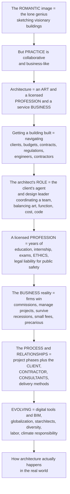

# The Architectural Profession and Practice

> [!abstract] TL;DR
> **The romantic image of the architect is the lone genius sketching visionary buildings — but the REALITY of architectural PRACTICE is far more complex, collaborative, and business-like.** Architecture is simultaneously an **art**, a **licensed profession**, and a **service business**, and getting a building built means navigating clients, budgets, contracts, regulations, engineers, contractors, and years of grinding coordination. Understanding the profession means grasping five things: the architect's unique **ROLE** as the *client's agent* and *design leader* who coordinates a whole team and balances art, function, cost, and code; the high barriers of a **licensed PROFESSION** — accredited education, internship, difficult exams (like law or medicine), a code of ethics, and legal liability for public safety; the **BUSINESS** reality of firms that must win commissions and survive recessions on notoriously *small fees* despite their cultural prestige; the **PROCESS and RELATIONSHIPS** with clients, contractors, and consultants, structured by different project **delivery methods** (design-bid-build, design-build, IPD) that allocate risk; and the profession's **EVOLUTION** under digital tools and BIM, globalization, the "starchitect" system, and pressing questions of diversity, labor, and climate responsibility. In short: how architecture *actually happens* in the real world — the human, business, legal, and collaborative reality behind every building.

---

## Intuition

**Analogy — the film director, not the painter.** The popular image of the architect is a *painter*: a solitary artist alone with a canvas, answerable to no one, producing a masterpiece by pure vision (think Howard Roark in *The Fountainhead*, or the celebrity "starchitect"). But the truer analogy is a **film director**. A director has a vision, yes — but she does not *make* the film alone. She must first *pitch* the project and win the money from producers (the **client**); she works to a *budget* and a *schedule*; she leads a huge crew of specialists — cinematographer, sound engineer, set designer (the **consultants**: structural, mechanical, electrical engineers); she hands detailed instructions to the people who physically shoot it (the **contractor**); she navigates unions, permits, and the studio's legal department (**codes, contracts, liability**); and she is judged, in the end, on whether the whole enterprise came in on time, on budget, and good. The director's *art* is real — but it is exercised through **leadership, coordination, persuasion, and business**, not through a solitary brush. **That is architectural practice.** The building on the magazine cover is the film; the architect is the director; and everything interesting happens in the messy, collaborative, contractual machinery that got it made.

Extend the analogy into the discipline and the whole subject appears. Architecture is **three things at once** — an *art* (the design imagination), a *profession* (a licensed, regulated, ethical practice like medicine or law), and a *business* (a firm that must win work and turn a profit to survive). The architect's role is not to *build* — architects produce drawings and instructions, and others build — but to be the **client's agent** and the **design leader**: to translate a client's needs, brief, and dreams into a *buildable* design, and to lead and coordinate the whole multidisciplinary team through it. To *become* an architect you cross high barriers — an accredited degree and the studio, years of internship, brutal licensing exams, registration, and continuing education — and you accept a **duty of care**: legal responsibility for the public's health and safety, backed by professional-indemnity insurance, because an architect can be **liable** when a building fails. And you do all this inside a **fragile business**: fees are typically a *small percentage* of construction cost, junior pay is low and hours are long, and the whole profession is notoriously exposed to **recessions** — economically precarious relative to its cultural prestige. The design sits inside a **process** (schematic design → construction administration) and a web of **relationships** (client, contractor, consultants) structured by **contracts and delivery methods**, and the whole thing is now being reshaped by BIM, globalization, and urgent questions about who the profession is *for* and its responsibility in the climate crisis.

---

## How It Works

### Core mechanics

Architectural practice is a machine for **turning a client's money and a brief into a built, safe, code-compliant building** — through a licensed professional who leads a team, manages a business, and shepherds a project through legally structured phases. The mechanism runs roughly like this:

1. **The myth versus the reality.** The cultural image — the *lone-genius artist* (Howard Roark, the "starchitect") producing masterpieces by uncompromising individual vision — is largely a **myth**. Real practice is a **collaborative, service, business, and licensed professional activity**. Sociologist **Dana Cuff** (*Architecture: The Story of Practice*) showed that design is *socially produced* — negotiated among architect, client, consultants, and builders — not conjured alone. Demystifying that gap is the whole point of studying the profession.
2. **The architect's ROLE — agent and design leader.** The architect acts as the **client's agent** and the **design leader / orchestrator**. The job is to *translate* the client's needs, brief, and budget into a buildable design; to *lead and coordinate* the design team and consultants; and to *balance* the competing demands of **art, function, cost, program, code, and buildability**. Unlike the specialist engineers, the architect is the **generalist synthesizer** who holds the whole together. Historically the role evolved from the medieval **master mason**, to the Renaissance **gentleman-artist** (Alberti), to the modern **licensed professional** — with a defined, and limited, scope of authority and responsibility.
3. **The PROFESSION — licensure, education, ethics.** Architecture is a **regulated profession**, like law or medicine: an **accredited degree** and the design studio, a period of **internship / practical experience**, difficult **licensing exams**, formal **registration/licensure**, and **continuing education**. Professional bodies — **AIA** (US), **RIBA** (UK), and their equivalents — protect the *title* "architect" (in most jurisdictions you cannot call yourself one without a license) and enforce a **code of ethics**. With the title comes a **duty of care**: legal responsibility for public health and safety, exposure to **negligence** claims, and mandatory **professional-indemnity insurance**. Sociologist **Magali Sarfatti Larson** framed this as a **professional project** — a bid for *monopoly*, *status*, and *jurisdiction* over a body of expert work.
4. **The PRACTICE as BUSINESS.** A firm is a **business** that must *win commissions* (the pitch, the competition, reputation, referrals), *manage projects* to a budget and schedule, *manage staff and cash flow*, and *survive economic cycles* — architecture is famously the **first industry into a recession and the last out**. **Fees** are typically a **percentage of construction cost** (roughly 5–15 percent depending on type and complexity), or lump-sum, or hourly — and are relatively **low** given the skill, education, and liability involved, producing a chronic **economic precarity** relative to the profession's prestige. Firms range from the **sole practitioner** to **global mega-firms**, and the **labor question** — long hours, low junior pay, unpaid internships — is a live and growing critique.
5. **The PROJECT — phases, relationships, delivery.** A commission runs through recognizable **phases of service**: *pre-design / programming* → **schematic design (SD)** → **design development (DD)** → **construction documents (CD)** → *bidding / tender* → **construction administration (CA)** (RIBA's *Plan of Work* names the equivalent stages 0–7). Three **relationships** dominate: the **CLIENT** (holds the money and the brief; private, corporate, public, or developer), the **CONTRACTOR** (physically builds it), and the **CONSULTANTS** (structural, MEP/services, civil, landscape, cost/QS, and other engineers — the multidisciplinary team). **Contracts and delivery methods** — *design-bid-build*, *design-build*, *construction management*, and *Integrated Project Delivery (IPD)* — determine **who is responsible for what** and **how risk, cost, and schedule are allocated**.
6. **The EVOLVING profession.** Practice is being reshaped by **digital tools, BIM, and AI** (changing how buildings are coordinated and who does what), by **globalization** (firms working across borders), by the **"starchitect" star-system** and its critiques, and by pressing questions of **diversity and inclusion** (the profession's historical exclusion of women and minorities), **labor and working conditions**, **social relevance** (public-interest and humanitarian design), and above all the profound **responsibility in the climate crisis** — the architect's role in decarbonizing the built environment.

### Flow / Architecture



---

## Key Concepts

**Secondary (can explain to a bright 16-year-old):**
- **Architects do not build buildings.** They make the *drawings and instructions*, lead a team of engineers, and manage the whole project — other people (builders) actually put it up. The architect is more like a *film director* than a lone painter.
- **You need a licence to be an architect.** Just like a doctor or a lawyer, you must study for years, train on the job, and pass hard exams before you are legally allowed to call yourself an "architect." That is because if a building falls down, someone is responsible.
- **Architecture is a business too.** An architecture firm has to *win* jobs, work to a *budget*, and make enough money to pay its staff. Architects are famous for being paid surprisingly little given how long they train — and they are hit hard whenever the economy dips.
- **A building has many bosses.** The **client** pays for it and says what they need; the **architect** designs and coordinates; the **contractor** builds it; and **consultants** (specialist engineers) work out the structure, wiring, and plumbing. Getting them to work together is most of the job.

**Undergraduate (needs some background):**
- **Art + Profession + Business, simultaneously.** The defining tension of practice: the architect must be a *creative artist*, an *ethical licensed professional* with a duty of care, and a *businessperson* running a firm — all at once, often in conflict.
- **The architect as generalist synthesizer.** Where engineers are *specialists* (structure, MEP, civil), the architect is the **generalist orchestrator** who integrates every discipline into a coherent whole and holds the design vision — the "conductor" of the project.
- **The path to licensure.** Accredited **degree** (with the design *studio* at its core) → **internship / logged experience** → **licensing exams** (e.g., the ARE in the US) → **registration** → **continuing education**. Professional bodies (**AIA, RIBA**) protect the title and enforce a **code of ethics**.
- **Duty of care and liability.** The architect owes a legal **duty of care** to the client and the public; failing it is **negligence** (a matter of *tort law*). This is why **professional-indemnity insurance** is mandatory and why *codes* are treated as non-negotiable.
- **Phases of service.** *Pre-design/programming → schematic design → design development → construction documents → bidding → construction administration.* Each phase produces more resolved, more legally binding documents; the RIBA *Plan of Work* is the UK's standard version.
- **Fees as a percentage of cost.** The classic fee model: the architect earns a **percentage of construction cost** (~5–15 percent). Crucially, this creates an odd incentive — a *more expensive* building earns a *bigger* fee — and it makes the firm's *profit* depend on delivering the design within the **budgeted labor hours**.
- **Project delivery methods.** *Design-bid-build* (traditional, sequential, architect and contractor separate), *design-build* (one entity designs and builds — faster, less architect control), *construction management*, and *Integrated Project Delivery / IPD* (shared risk and reward across a collaborative team) — each allocates **risk, cost-certainty, and responsibility** differently.

**Graduate (system-level thinking):**
- **The social production of design (Cuff).** Dana Cuff's ethnographic finding: design is not the output of a single mind but is **socially and organizationally produced** — negotiated, contingent, and shaped by the whole apparatus of client, office, and consultants. This reframes "genius" as a *managed collective process*.
- **The professional project (Larson).** Larson's *sociology of professions*: professions are collective **market projects** securing **monopoly, jurisdiction, and status** by controlling entry (credentialing) and defining an esoteric body of knowledge — but architecture is a **weak** profession, with contested jurisdiction (it *shares* territory with engineers, contractors, developers, and project managers) and comparatively poor economic returns.
- **The MacLeamy curve.** Patrick MacLeamy's argument for **front-loading design effort**: the *ability* to influence a project's cost and performance is **highest early** (schematic design) and collapses over time, while the *cost of making changes* **rises steeply** toward construction. Therefore, effort should be shifted *earlier* — precisely what **BIM** and integrated delivery enable — instead of peaking late (as it traditionally does) during construction documents.
- **The economics of precarity (Gutman, Deamer).** Robert Gutman's *critical view* and Peggy Deamer's *Architecture and Labor* analyze the structural **economic weakness** of practice: oversupply of labor, competition on fee (a *race to the bottom*), the myth of *art-for-its-own-sake* used to justify unpaid overtime, and the cultural glorification of self-sacrifice — producing a profession that is *prestigious but poorly paid*. This has fueled contemporary **labor organizing** (e.g., The Architecture Lobby).
- **Risk allocation as the deep grammar of delivery.** The choice of contract/delivery method is fundamentally about **who bears which risks** — cost overrun, design error, schedule slip, latent site conditions. *Design-bid-build* pits parties adversarially; *IPD* pools risk to align incentives. Understanding delivery is understanding **incentive design** in a multi-party principal–agent problem.
- **Jurisdiction under threat.** The architect's *scope of authority* has been eroded from all sides — by the rise of the **project manager**, the **developer**, **design-build** contractors, and now **AI/BIM automation** — raising the strategic question of what *irreducible* value the profession offers.
- **Ethics beyond compliance.** Modern professional ethics is expanding from *do-no-harm* (safety, honesty, avoiding conflicts of interest) toward **positive responsibility**: equity and inclusion, humanitarian and public-interest design, and — most urgently — a **climate duty of care** (e.g., Architecture 2030, the AIA 2030 Commitment) as buildings account for a large share of global emissions.

---

## Python Demo

```python
# The economics and process of architectural practice, in two parts:
#   (a) FEE / PROJECT ECONOMICS -- fee as a percentage of construction cost across
#       project types, and how a firm's profit collapses when labour HOURS overrun
#       (scope creep, revisions) even though the fee is fixed -- the precarity of practice.
#   (b) The MacLEAMY CURVE -- the ability to influence cost/performance is highest EARLY
#       while the cost of design changes rises steeply LATE, so effort should be front-loaded
#       (as BIM/IPD enable) rather than peaking late during construction documents.
import numpy as np
import matplotlib.pyplot as plt

# ----- (a) FEE and PROJECT ECONOMICS ---------------------------------------
# Typical architect fee as a percent of construction cost, by project type/complexity.
project_types = ["Warehouse\n(simple)", "Commercial\noffice", "Housing\n(residential)",
                 "Hospital\n(complex)", "Bespoke\ncultural"]
fee_pct = np.array([6.0, 8.0, 10.0, 12.0, 15.0])   # percent of construction cost

# Take one project (a 5,000,000 currency-unit commercial office) and model firm profit.
construction_cost = 5_000_000.0
office_fee_pct    = 8.0
fee = office_fee_pct / 100.0 * construction_cost        # fixed fee = 400,000
blended_rate      = 90.0                                 # cost per staff-hour (salary + overhead)
target_margin     = 0.20                                 # firm aims for 20% profit
budgeted_hours    = fee * (1 - target_margin) / blended_rate   # hours the budget allows

# Simulate hours overrunning the budget from -10% (efficient) to +60% (scope creep spiral).
overrun = np.linspace(-0.10, 0.60, 200)
actual_hours  = budgeted_hours * (1 + overrun)
actual_cost   = actual_hours * blended_rate
profit_margin = (fee - actual_cost) / fee * 100.0       # profit as percent of fee
breakeven     = overrun[np.argmin(np.abs(profit_margin))]  # where profit hits zero

# ----- (b) The MacLEAMY CURVE ----------------------------------------------
x = np.linspace(0, 1, 400)                               # project timeline: 0=start, 1=handover
ability_to_influence = np.exp(-3.2 * x)                  # high early, decays -> normalize
ability_to_influence /= ability_to_influence.max()
cost_of_change       = np.exp(3.2 * x)                   # low early, rises steeply -> normalize
cost_of_change      /= cost_of_change.max()
# Design effort: traditional peaks LATE (at CD); preferred/BIM peaks EARLY (at DD).
traditional_effort = np.exp(-((x - 0.68) ** 2) / (2 * 0.11 ** 2))
preferred_effort   = np.exp(-((x - 0.38) ** 2) / (2 * 0.11 ** 2))
phase_x     = [0.08, 0.30, 0.48, 0.68, 0.85]
phase_names = ["Pre-\ndesign", "SD", "DD", "CD", "CA"]

# ----- PLOT -----------------------------------------------------------------
fig, ax = plt.subplots(1, 3, figsize=(17, 5))

# (a1) Fee percentage by project type
bars = ax[0].bar(project_types, fee_pct, color="#4C72B0", edgecolor="black")
ax[0].set_ylabel("Architect fee (percent of construction cost)")
ax[0].set_title("(a) Fees rise with project complexity")
ax[0].set_ylim(0, 17)
for b, v in zip(bars, fee_pct):
    ax[0].text(b.get_x() + b.get_width()/2, v + 0.3, f"{v:.0f}%", ha="center", fontsize=9)

# (a2) Profit margin vs hours overrun -- the precarity
ax[1].plot(overrun * 100, profit_margin, color="#C44E52", lw=2.5)
ax[1].axhline(0, color="black", lw=1, ls="--")
ax[1].axvline(breakeven * 100, color="gray", lw=1, ls=":")
ax[1].fill_between(overrun * 100, profit_margin, 0, where=(profit_margin >= 0),
                   color="#55A868", alpha=0.25, label="profit")
ax[1].fill_between(overrun * 100, profit_margin, 0, where=(profit_margin < 0),
                   color="#C44E52", alpha=0.25, label="loss")
ax[1].set_xlabel("Labour-hours overrun (percent over budget)")
ax[1].set_ylabel("Firm profit (percent of fee)")
ax[1].set_title(f"(b) Fixed fee: profit vanishes at ~{breakeven*100:.0f}% overrun")
ax[1].legend(loc="upper right")

# (b) MacLeamy curve
ax[2].plot(x, ability_to_influence, color="#4C72B0", lw=2.5, label="Ability to influence cost/perf.")
ax[2].plot(x, cost_of_change,       color="#C44E52", lw=2.5, label="Cost of design changes")
ax[2].plot(x, traditional_effort,   color="gray",    lw=2, ls="--", label="Traditional effort (late)")
ax[2].plot(x, preferred_effort,     color="#55A868", lw=2, ls="-.", label="Preferred/BIM effort (early)")
ax[2].set_xticks(phase_x)
ax[2].set_xticklabels(phase_names)
ax[2].set_xlabel("Project phase (time)")
ax[2].set_ylabel("Relative magnitude")
ax[2].set_title("(c) The MacLeamy curve: front-load the effort")
ax[2].legend(loc="upper center", fontsize=8)

plt.tight_layout()
plt.savefig("architectural_practice_economics.png", dpi=120)
plt.show()

# ----- Console summary ------------------------------------------------------
print(f"Construction cost      : {construction_cost:,.0f}")
print(f"Fee at {office_fee_pct:.0f}%           : {fee:,.0f}")
print(f"Budgeted staff-hours   : {budgeted_hours:,.0f}  (for target {target_margin*100:.0f}% margin)")
print(f"Break-even overrun     : ~{breakeven*100:.0f}%  -- beyond this the project LOSES money")
```

**What it shows.** Panel (a) plots the classic **percentage-of-cost fee** rising with project complexity (a warehouse earns ~6 percent, a bespoke cultural building ~15 percent). Panel (b) is the punchline of practice economics: because the **fee is fixed** but the firm's *cost* is *labor hours*, a project that starts at a comfortable 20 percent margin **slides into loss** after only a modest overrun in hours — which is exactly what scope creep, endless client revisions, and poor scope control produce. This is why *fee structure, efficiency, and scope control* are existential, and why the profession is economically precarious. Panel (c) reproduces the **MacLeamy curve**: your power to shape the building is *greatest at the start* and the *cost of changing it* explodes toward construction — so shifting design effort *earlier* (the green curve, enabled by BIM and integrated delivery) is strictly better than the traditional late peak.

---

## Real-World Applications

> **Standard contracts and the RIBA Plan of Work.** The whole industry runs on standardized documents that encode the profession's structure. The **AIA Contract Documents** (e.g., *A201 General Conditions*, *B101 Owner–Architect Agreement*) and the UK **RIBA Plan of Work 2020** (Stages 0–7, from *Strategic Definition* to *Use*) are the de-facto operating systems of practice — defining phases, deliverables, fee milestones, and each party's responsibilities and liabilities.

> **Project delivery in the wild.** *Design-bid-build* built most of the 20th-century public realm (schools, courthouses) but is notoriously adversarial and prone to change-order disputes. *Design-build* dominates fast commercial and infrastructure work (data centers, warehouses) where speed and cost-certainty beat design control. *Integrated Project Delivery (IPD)* — pioneered on complex healthcare projects like Sutter Health's California hospitals — pools risk and reward across owner, architect, and contractor to kill the adversarial incentives.

> **The starchitect firm as a business.** Global practices like **Foster + Partners**, **Gehry Partners**, **Zaha Hadid Architects**, and **BIG** are simultaneously design brands *and* sophisticated businesses — running global project pipelines, in-house engineering and computation teams, and reputational marketing. Frank Gehry's firm even spun off **Gehry Technologies** (BIM/CATIA tooling) as a product business in its own right.

> **Recession exposure.** The **2008 global financial crisis** is the textbook case of architecture's economic fragility: US architecture-firm billings and employment collapsed as construction froze, wiping out a large share of jobs almost overnight — the "first in, last out" pattern that makes the profession's economics precarious.

> **Labor, diversity, and climate movements.** **The Architecture Lobby** organizes around fair pay and working conditions (challenging unpaid overtime and internships); groups tracking **licensure demographics** document the profession's historic underrepresentation of women and minorities; and **Architecture 2030** plus the **AIA 2030 Commitment** mobilize firms toward net-zero-carbon buildings. Humanitarian and public-interest practices such as **MASS Design Group** demonstrate architecture as social infrastructure rather than luxury object.

---

## Common Pitfalls

- **Believing the lone-genius myth.** Students trained on Howard Roark and starchitect monographs enter practice expecting solitary creative authority — and are blindsided by the reality that design is *socially produced* through clients, consultants, and committees. Mistaking the myth for the job leads to disillusionment and conflict.
- **Underpricing the fee / racing to the bottom.** Competing on fee to win work is the profession's structural trap: because profit lives in the *hours*, an underpriced commission is a *pre-committed loss* the moment scope creeps. Firms that do not price for the real hours (plus a contingency) bleed slowly to death while appearing busy.
- **Losing control of scope.** "Just one more revision" from the client, with no change to the fee, is the single most common way a profitable project becomes a loss (see the demo). Without a written *scope*, a *change-order* mechanism, and the discipline to invoke it, the architect subsidizes the client's indecision with the firm's payroll.
- **Ignoring liability and the duty of care.** Treating codes, documentation, and coordination as bureaucratic annoyance rather than the core of a legally binding *duty of care* invites **negligence** exposure. A single uncoordinated detail that lets water in — or a life-safety error — can end a firm; this is why professional-indemnity insurance is non-negotiable.
- **Treating consultants as an afterthought.** The structural, MEP, and civil engineers are not vendors to be looped in late; poor coordination (or leaving it to construction) is where the MacLeamy curve punishes you hardest — changes cost the most exactly when they are discovered latest.
- **Choosing the wrong delivery method for the risk.** Picking *design-bid-build* for a fast-track, cost-sensitive project (or *design-build* when the client wants tight design control) misallocates risk and sets up adversarial disputes. The delivery method *is* the incentive structure — choosing it carelessly guarantees friction.
- **Normalizing self-exploitation.** The cultural glorification of the all-nighter and the unpaid internship (justified by "art" and "passion") entrenches poor labor conditions, burns out junior staff, and narrows the profession to those who can afford to be underpaid — undermining both wellbeing and diversity.

---

## Related Concepts

*Within the Architecture vault (prose references — siblings):* this note completes the picture drawn by **Architecture_Overview_and_the_Art_of_Building** (architecture as art, science, and profession), **The_Design_Process_and_Architectural_Representation** (the *what* of the phases and drawings this profession structures), **Construction_and_Building_Technology** (the contractor's world the architect coordinates and administers), **Codes_Accessibility_and_the_Ethics_of_Building** (the legal and ethical framework the duty of care rests on), **BIM_Digital_Fabrication_and_Smart_Buildings** (the digital tools reshaping practice and the MacLeamy front-loading argument), and **Sustainable_and_Green_Architecture** (the climate responsibility now central to professional ethics).

*Cross-vault links (Glob-verified):*
- [[Delivery_and_Execution]] — the engineering-leadership discipline of shipping projects on time and budget; the software analogue of construction administration, phasing, and delivery-method choice.
- [[Financial_Management_for_EMs]] — budgets, cost, and profitability from a leadership lens; mirrors the firm-as-business reality of fees, hours, cash flow, and surviving cycles.
- [[Contract_Law]] — the law of agreements that structures the owner–architect and construction contracts and allocates responsibility across the project team.
- [[Tort_Law]] — negligence and the **duty of care**: the legal machinery behind the architect's liability for public health and safety and the need for professional-indemnity insurance.
- [[Legal_Ethics_and_Access_to_Justice]] — a parallel *licensed profession's* code of conduct and professional responsibility, illuminating architecture's own ethics and self-regulation.
- [[Work_Organizations_and_Bureaucracy]] — the sociology of professions, work, and organizations (Larson's professional project, jurisdiction, status) that explains architecture as a *profession* and a *labor* condition.

---

## Review Questions

**Secondary:**
1. Why is it misleading to picture an architect as a lone artist who single-handedly creates a building? Name three other people or groups an architect must work with to get a building built.
2. Architecture is described as "an art, a profession, and a business" at the same time. Give one concrete example of what each of those three roles requires the architect to do.

**Undergraduate:**
3. An architect's fee is a fixed *percentage of construction cost*, but the firm's *profit* depends on labor hours. Using this, explain precisely how a project that starts profitable can end in a loss — and name two practical safeguards a firm can use to prevent it.
4. Compare *design-bid-build*, *design-build*, and *IPD* in terms of who controls the design and how risk is allocated. Given a client who wants maximum cost-certainty and speed but is willing to give up design control, which would you recommend and why?

**Graduate:**
5. Using Larson's concept of the **professional project** (monopoly, jurisdiction, status), argue whether architecture is a *strong* or *weak* profession. What forces — the project manager, developer, design-build, and AI/BIM — threaten its jurisdiction, and what irreducible value can the profession claim?
6. Explain the **MacLeamy curve** and connect it to the economics of the fee model and the case for BIM/IPD. Why does the *traditional* late peak of design effort produce both worse buildings and worse firm economics, and what organizational and contractual changes are required to shift effort earlier?
7. Dana Cuff argues design is *socially produced* while Peggy Deamer argues the profession systematically undervalues its own *labor*. Synthesize these two critiques: how does the myth of the solitary genius-artist simultaneously misrepresent how architecture is made *and* justify its precarious labor conditions?

---

## Sources

- Dana Cuff, *Architecture: The Story of Practice* (MIT Press, 1991).
- The American Institute of Architects, *The Architect's Handbook of Professional Practice* (Wiley, 15th ed.).
- Andrew Saint, *The Image of the Architect* (Yale University Press, 1983).
- Peggy Deamer (ed.), *Architecture and Labor* (Routledge, 2020).
- Robert Gutman, *Architectural Practice: A Critical View* (Princeton Architectural Press, 1988).

---

#architecture #architectural-practice #the-profession #project-delivery #architecture-business
