# 🏙️ Urban Design and the City

> [!abstract] TL;DR
> **Zoom out from the single building and you get the CITY — humanity's greatest and most complex artifact — and the design problem changes completely.** It is no longer *one* building but the **spaces *between* buildings**: the streets, squares, blocks, and neighbourhoods, and how a whole settlement works as a living, breathing system for millions of people. This is **urban design** — the discipline *between* **architecture** (the single building) and **urban planning** (policy, zoning, land use, regional systems) — concerned with the **physical form of the city** and the quality of the **public realm**. Because the city is now where *most* humans live, how we design it profoundly shapes daily life, health, community, and the planet. Urban design grapples with timeless questions. What makes a great **street** or **square** — a place people actually want to be? (**Jan Gehl**: architecture is really about *"life between buildings."*) How do you make **walkable, human-scaled** places rather than dead, **car-dominated sprawl**? **Kevin Lynch** showed a city is *read* through five elements — **paths, edges, districts, nodes, and landmarks** — that make it **legible** and navigable ("the image of the city"). **Jane Jacobs** revealed that vibrant urban life comes from **density, mixed uses, short blocks, "eyes on the street," and diversity** — and demolished the modernist **urban renewal** that bulldozed living neighbourhoods for **towers-in-a-park** (which failed catastrophically). The great debates run through it all: the **traditional dense, mixed, walkable city** vs modernist zoning and **sprawl**; the **car** vs the **pedestrian**; **top-down** master planning vs **bottom-up** organic growth. And the **stakes have never been higher** — with rapid global **urbanisation** and the **climate crisis**, how we design cities (density vs sprawl, transit vs cars, green space, resilience) is one of the most consequential design questions for humanity's future. Movements like **New Urbanism**, **Transit-Oriented Development**, **Landscape Urbanism**, and the **"15-minute city"** offer competing visions. Urban design is architecture at the scale that matters most for how humanity lives — **the design of our shared, collective environment.**

---

## Intuition

**Analogy — the design problem is the space you *leave out*, not the object you put in.** Imagine a sculptor who has spent a lifetime perfecting single figures, then is handed a whole garden and told: arrange a thousand statues so that people love *walking among them*. Suddenly the individual figures matter far less than the **paths between them, the clearings where people gather, the shaded edges, the surprise of turning a corner**. A garden full of masterpieces laid out badly is a miserable place to be; a garden of modest pieces laid out beautifully is a joy. **The city is exactly this.** A city can be full of brilliant *buildings* and still be a dead, hostile, unwalkable place — because a city is not made of buildings, it is made of the **spaces between them**: the streets you walk, the squares you linger in, the blocks you move through, the neighbourhoods you belong to. Urban design is the craft of shaping that in-between — the **public realm** — so that a whole settlement works, at the scale of *millions of people living together*, as a place worth being in.

Extend the analogy and you get the whole discipline. Sit at a great **street café** in Copenhagen or a **piazza** in Italy and ask *why is this place alive* — people lingering, children, old people, strangers at ease — while a windswept plaza at the foot of a glass tower a mile away is empty. **Jan Gehl** spent a career answering that: cities work when they are built for **people at walking pace and eye level** — "life between buildings" — not for cars at 50 km/h. Now try to find your way through an unfamiliar city; **Kevin Lynch** discovered that you carry a *mental map* built from five things — the **paths** you travel, the **edges** that bound areas, the **districts** with their own character, the **nodes** where things converge, and the **landmarks** you steer by — and a city rich in these is **legible**, while repetitive sprawl leaves you lost. Then watch what *kills* a neighbourhood: **Jane Jacobs**, fighting to save Greenwich Village from a highway, showed that urban life is a delicate ecology of **density, mixed uses, short blocks, old and new buildings, and "eyes on the street,"** and that the confident modernist planners who bulldozed it all for **towers-in-a-park** destroyed the very thing that made cities live. Zoom all the way out and the stakes are planetary: the human race has just become **majority-urban**, and whether we build **compact, walkable, transit-served** cities or **sprawling, car-dependent** ones is one of the biggest levers we have on **carbon, land, health, and equity**. To understand urban design is to understand architecture at the scale of our *collective* life.

---

## How It Works

### Core mechanics

Urban design sits at a specific scale — bigger than the building, smaller than the region — and works on the **physical form of the public realm**. It reads the city (morphology and the image), then makes it (streets, blocks, and life between buildings), inside a set of enduring debates and rising stakes.

1. **The scale between architecture and planning.** **Architecture** designs the single *object* — a building. **Urban planning** sets *policy* — zoning, land use, transport policy, regional strategy — largely in words, maps, and rules. **Urban design** is the missing middle: the **three-dimensional physical design of the public realm** — how buildings meet the street, how streets form blocks, how blocks form neighbourhoods, and how the whole becomes a *place*. It is the discipline of the **spaces between buildings**.
2. **Reading the city — morphology and the image.** Before you can *make* good urban form you must *read* it. **Urban morphology** studies the city's DNA — the **street**, the **block**, the **plot/parcel**, the **square**, and whether the layout is a rational **grid** (Manhattan, Barcelona) or **organic** medieval tangle (Fez, Venice). The **figure-ground** or **Nolli map** blackens the buildings and whitens the public void, revealing the city as **solid and void** — and whether the streets are shaped "rooms" or leftover gaps. **Kevin Lynch's** five elements — **paths, edges, districts, nodes, landmarks** — describe how the form becomes a **legible mental image**.
3. **Making the public realm — designing for people.** The point of it all is **urban life**. **Jan Gehl's** *Life Between Buildings* and *Cities for People* put the **pedestrian at eye level** at the centre: human scale, **active frontages** (shops and windows, not blank walls), places to **sit and linger**, slow traffic, mixed uses. **Jane Jacobs** identified the *generators* of urban **vitality** — **density, mixed primary uses, short blocks, a mix of old and new buildings, and "eyes on the street"** (natural surveillance from people who live and work there). **William Whyte** filmed real plazas to learn what actually makes them fill up. Together this is **placemaking** — making streets and squares into "**third places**" and the civic life of the city.
4. **The great debates.** Urban design is contested terrain. The **traditional** dense, mixed, walkable city faces off against the **modernist** city — **Le Corbusier's "Radiant City,"** the **CIAM** doctrine of *functional zoning* (separating living, working, recreation, traffic), the **tower-in-the-park** — whose real-world results (**urban renewal**, freeway-severed neighbourhoods, the failed housing "projects") were disastrous. The **car** fights the **pedestrian** (the automobile reshaped the city into **sprawl**, the strip, the mall — Kunstler's *"geography of nowhere"*). And **top-down** master planning (Brasília) fights **bottom-up**, incremental, **organic** growth (the city as an *emergent*, self-organising system).
5. **The city as a system.** A city is not a static blueprint but a **functioning system** — a **complex adaptive system**. Its **transport and land use are locked together** (density enables transit; sprawl demands cars). It runs on **infrastructure and utilities**, exhibits **emergence, self-organisation, and scaling laws** (bigger cities are super-linearly more productive *and* innovative per capita), and has an **urban metabolism** — flows of energy, water, materials, and waste (urban ecology).
6. **The stakes — urbanisation and climate.** The planet crossed **50 % urban** around 2007 and is heading past **two-thirds**; the growth is overwhelmingly in the **developing world**, much of it **informal settlements**. Cities generate roughly **70 % of CO₂ emissions**, so the **density-vs-sprawl** choice is a **climate** choice. Overlay **equity** — segregation, **gentrification** and displacement, the "**right to the city**," affordable housing — and the **smart/digital** city, and urban design becomes one of the most consequential design challenges of the century.

### Flow / Architecture

```mermaid
flowchart TD
    A["Zoom OUT from the single building and you get the CITY<br/>humanity's greatest and most complex artifact"] --> B["The design challenge equals NOT one building<br/>but the SPACES BETWEEN buildings - streets, squares, blocks<br/>and the whole settlement as a living SYSTEM"]
    B --> C["URBAN DESIGN equals the discipline BETWEEN<br/>architecture - single buildings - and planning - policy and zoning<br/>the physical design of the PUBLIC REALM and the form of the city"]
    C --> D["The city is where most humans now live<br/>its design shapes daily LIFE, HEALTH, COMMUNITY and the PLANET"]
    D --> E["The timeless question equals what makes a great STREET or SQUARE<br/>a place people want to be - Gehl, life between buildings"]
    E --> F["Walkable, lively, HUMAN-SCALED places<br/>versus dead, CAR-DOMINATED sprawl"]
    F --> G["Lynch five elements equal PATHS, EDGES, DISTRICTS, NODES, LANDMARKS<br/>that make a city LEGIBLE and navigable - the image of the city"]
    G --> H["Jacobs equals vibrant life from DENSITY, MIXED USE,<br/>short blocks and eyes on the street"]
    H --> I["Jacobs ATTACKED modernist urban renewal<br/>the towers-in-a-park that bulldozed neighbourhoods and FAILED"]
    I --> J["The great DEBATES equal dense walkable versus SPRAWL,<br/>car versus pedestrian, top-down master plan versus ORGANIC growth"]
    J --> K["The STAKES equal rapid URBANISATION and the CLIMATE crisis<br/>density versus sprawl, transit, green space, RESILIENCE"]
    K --> Z["Urban design equals the design of our shared, collective ENVIRONMENT<br/>architecture at the scale that matters most for how humanity lives"]
    style A fill:#4a9eff,color:#fff
    style C fill:#6c5ce7,color:#fff
    style G fill:#16a085,color:#fff
    style H fill:#e67e22,color:#fff
    style I fill:#c0392b,color:#fff
    style K fill:#e74c3c,color:#fff
    style Z fill:#27ae60,color:#fff
```



---

## Key Concepts

### 🟢 Secondary — the city and the space between buildings

- **A city is made of the spaces *between* buildings.** The most important parts of a city are not the buildings themselves but the **streets, squares, and parks** you move through and gather in — the **public realm**. Urban design is the craft of shaping *that*. A city of beautiful buildings can still be a terrible place to be; a city of ordinary buildings and wonderful streets is a joy.
- **Great streets and squares are places people *want* to be.** Think of a lively café-lined street or a busy town square versus an empty windswept plaza by a motorway. The good ones are built for **people walking** — human-sized, with shops and windows facing the street, places to sit, and slow (or no) traffic. **Jan Gehl** called this *"life between buildings."*
- **You read a city like a map in your head.** **Kevin Lynch** found that people navigate using five things: **paths** (streets you walk), **edges** (rivers, walls, motorways that bound areas), **districts** (neighbourhoods with their own feel), **nodes** (junctions and squares where things happen), and **landmarks** (memorable things you steer by). A city with clear versions of these is **easy to find your way in**; endless identical sprawl leaves you lost.
- **Walkable city vs car city.** You can build a **dense, mixed, walkable** city where shops, homes, schools, and jobs are close together — or a **sprawling, car-dependent** one where everything is far apart and you *have* to drive. These feel completely different to live in, and they have very different effects on health, cost, and the planet.
- **Jane Jacobs and the death of neighbourhoods.** In the mid-1900s, confident planners bulldozed old, "messy" city neighbourhoods and replaced them with **tall towers in empty parkland**. It was supposed to be modern and healthy. Instead it killed community and became notorious for crime and decay. **Jane Jacobs** fought this and showed that lively cities need **busy, mixed, human-scaled streets** — not towers-in-a-park.

### 🟡 Undergraduate — form, life, and the debates

- **Architecture ↔ urban design ↔ planning.** Three nested scales. **Architecture** = the single building/object. **Urban design** = the **physical, 3-D design of the public realm** — streets, blocks, squares, the way buildings shape space. **Planning** = **policy** (zoning, land use, transport strategy, regional systems). Urban design is the *middle* term that turns policy into physical place — and it is fundamentally about **the spaces between buildings**.
- **Urban morphology and figure-ground.** The city has a *form* you can analyse: the **street**, the **block**, the **plot/parcel**, the **square**, the **grid vs organic** layout, the **street wall** and sense of enclosure, and **density / Floor Area Ratio (FAR)**. The **Nolli / figure-ground map** (buildings solid-black, public space white) reveals whether streets are positive shaped "rooms" (traditional **fabric**) or leftover residue around free-standing **object** buildings (modernist).
- **Lynch's imageability.** *The Image of the City* (1960) argued a good city is **legible** — its **paths, edges, districts, nodes, and landmarks** combine into a clear **mental image**, aiding wayfinding, emotional security, and belonging. "**Imageability**" is a design goal: strengthen the five elements and the city becomes readable.
- **Gehl's "cities for people."** Design at the **speed and scale of the pedestrian**. The metrics: **active frontages**, human-scale detail, **places to sit**, protection and comfort, slowed traffic. Gehl's Copenhagen work (pedestrianising **Strøget**, adding public space year by year) proved that *"if you make more road space, you get more cars; if you make more people space, you get more people."*
- **Jacobs's four generators of diversity.** In *The Death and Life of Great American Cities* (1961), urban **vitality** requires: (1) **mixed primary uses** so streets are busy at different hours; (2) **short blocks** so routes multiply; (3) a **mix of old and new buildings** (varied rents → varied uses); and (4) sufficient **density**. Together they produce the "**eyes on the street**" (natural surveillance) and social diversity that make cities safe and alive.
- **The modernist vs traditional battle.** **CIAM** and **Le Corbusier's "Radiant City"** proposed **functional zoning** (separate living, working, recreation, circulation) and **towers-in-the-park** served by highways. Applied as post-war **urban renewal**, it severed and demolished neighbourhoods. Its collapse (see **Pruitt-Igoe**) discredited the model and opened the door to Jacobs, Gehl, and the reformers.
- **The car and sprawl.** The automobile **inverted** the city: **suburbanisation**, the strip mall, the parking lagoon, single-use zoning, and **placeless** sprawl (Kunstler's *Geography of Nowhere*). "**Level of Service**" traffic engineering optimised car throughput at the direct expense of walkability — the discipline urban design now works to reverse.

### 🔴 Graduate — systems, movements, and the stakes

- **Garden City to the movements.** **Ebenezer Howard's Garden City** (1898) — self-contained towns balancing town and country, ringed by greenbelt — seeded a century of planning ideals (New Towns, greenbelts). The contemporary reform movements: **New Urbanism** (Duany, Plater-Zyberk, Calthorpe — return to compact, walkable, mixed, transit-served traditional towns; the **Charter of the New Urbanism**, the **transect**); **Transit-Oriented Development (TOD)** (dense, mixed development around transit stations); **Landscape Urbanism** (landscape, not architecture, as the organising medium of the city); **tactical / everyday urbanism** (cheap, incremental, bottom-up interventions); and the **"15-minute city"** (Moreno / Paris — daily needs within a short walk or cycle).
- **The city as a complex adaptive system.** A city is **not** a machine to be master-planned but an **emergent, self-organising** system of millions of agents — closer to an organism or ecosystem (Jacobs anticipated this in her final chapter, "the kind of problem a city is"). This grounds the **top-down vs bottom-up** debate: master plans like **Brasília** deliver legibility on paper but often kill street life, while organic cities accrete adaptive complexity. **Urban scaling laws** (Bettencourt & West, Santa Fe Institute) find that as a city doubles in size, socio-economic output — wages, patents, GDP, but also crime — grows **super-linearly (~15 % per doubling)** while infrastructure grows **sub-linearly (economies of scale)** — a quantitative law of the city as a network.
- **The transport–land-use feedback loop.** Land use and mobility co-determine each other: **density enables transit** (riders per route), while **sprawl mandates the car** (destinations too far to walk). The choice compounds — highway building induces sprawl which induces more driving (**induced demand**). Breaking the loop (see the Civil-Engineering view of transportation) is central to sustainable urbanism.
- **Urban metabolism and ecology.** Treat the city as a **living system with a metabolism** — inputs of energy, water, food, materials; outputs of waste, sewage, heat, and emissions. **Green infrastructure**, the **urban heat island**, water-sensitive design, and circular-economy thinking reframe urban design as **industrial ecology at settlement scale**.
- **Density, climate, and the compact-city argument.** Cities are ~**70 % of global CO₂**. **Compact, dense, mixed, transit-served** urban form is strongly associated with **lower per-capita transport energy** (the classic **Newman & Kenworthy** density–fuel curve), less land consumed, and cheaper per-capita infrastructure — the core case for **density over sprawl** as a climate strategy. The counter-tensions: overheating, embodied carbon of tall construction, and the risk of density without amenity or equity.
- **Equity, justice, and the informal city.** Urban form **encodes power and inequality** — segregation, redlining's legacy, exclusionary zoning, and the **gentrification–displacement** dilemma (successful placemaking raises rents and pushes out the community it revitalised). **Lefebvre's "right to the city"** frames who gets to shape urban space. And most 21st-century urban growth is **informal** — the **slums and self-built settlements** housing ~1 billion people, where the discipline's Western canon meets its hardest test.
- **The smart / digital city.** Sensors, data, mobility platforms, and digital twins promise responsive, efficient cities — but raise questions of **surveillance, control, and whether the "smart city" serves people or the platforms** (the contested legacy of projects like Sidewalk Toronto). The future of the city is being negotiated between the physical public realm and its digital overlay.

---

## Python Demo

```python
# Urban Design & the City -- two core tradeoffs of urban FORM.
#
#   (a) DENSITY / WALKABILITY vs SPRAWL: the central tradeoff of urban form.
#       As residential DENSITY rises, a COMPACT, mixed-use city puts far more
#       destinations within a 15-minute WALK (accessibility soars), while the
#       PER-CAPITA cost of SPRAWL -- land consumed, km of road & pipe per person,
#       and car-dependent transport EMISSIONS -- all fall sharply. This is the
#       "compact-city" argument (Newman & Kenworthy) for a sustainable city.
#
#   (b) LYNCH LEGIBILITY / IMAGEABILITY: Kevin Lynch showed a city is read through
#       five elements -- PATHS, EDGES, DISTRICTS, NODES, LANDMARKS. Score several
#       city types on the five, combine them into an "imageability" index, and map
#       it to how easily a stranger can navigate (wayfinding success). Legible,
#       landmarked, well-structured cities are easy to read; repetitive sprawl and
#       towers-in-a-park are not.
#
# Requires: numpy, matplotlib
import numpy as np
import matplotlib.pyplot as plt

fig, ax = plt.subplots(1, 2, figsize=(13.5, 5.4))

# ---------------------------------------------------------------------------
# (a) COMPACT vs SPRAWL: one metric rises, three per-capita costs fall with density
# ---------------------------------------------------------------------------
dens = np.linspace(10, 250, 300)           # residents per hectare (sprawl -> compact)
ref  = 60.0                                 # reference "moderately compact" city

# Walkable ACCESS: destinations reachable within a 15-min (~800 m) walk. Mixed-use
# means amenities scale with residents; the count saturates at very high density.
A_max, d_half = 100.0, 40.0
access = A_max * dens / (dens + d_half)

# PER-CAPITA COSTS of spreading out (all fall as density rises):
land  = ref / dens                          # land consumed per person  ~ 1/density
infra = (ref / dens) ** 0.75                # km of road & pipe per person
# Car-dependent transport emissions per person (Newman-Kenworthy style decline):
emis  = 0.3 + 1.4 * np.exp(-dens / ref)

# Normalise to the reference city so the SHAPES compare on one axis.
a0 = A_max * ref / (ref + d_half)
access_n = access / a0
emis_n   = emis / (0.3 + 1.4 * np.exp(-1.0))

ax0 = ax[0]
ax0.plot(dens, access_n, lw=2.6, color="#16a085",
         label="walkable ACCESS  (destinations in a 15-min walk)")
ax0.plot(dens, land,     lw=2.2, color="#e67e22", ls="--", label="LAND per person")
ax0.plot(dens, infra,    lw=2.2, color="#c0392b", ls="--", label="ROAD & PIPE per person")
ax0.plot(dens, emis_n,   lw=2.2, color="#8e44ad", ls="--", label="car EMISSIONS per person")
ax0.set_xscale("log")
ax0.axvspan(10, 30,   color="#c0392b", alpha=0.08)
ax0.axvspan(120, 250, color="#16a085", alpha=0.08)
ax0.text(15, 5.3, "SPRAWL\nlow density\ncar-dependent", fontsize=8, color="#c0392b")
ax0.text(140, 5.3, "COMPACT\nwalkable\nefficient", fontsize=8, color="#16a085")
ax0.axhline(1.0, color="grey", lw=0.8, ls=":")
ax0.set_xlabel("residential DENSITY  [residents per hectare]  (log)")
ax0.set_ylabel("value, relative to a 60 res/ha reference city")
ax0.set_title("Compact vs sprawl:\ndensity lifts walkable access & slashes per-capita cost")
ax0.legend(loc="upper right", fontsize=7.5); ax0.grid(alpha=0.3, which="both")
ax0.set_ylim(0, 6.5)

# ---------------------------------------------------------------------------
# (b) LYNCH IMAGEABILITY -> WAYFINDING SUCCESS
# Score city types on the five elements; composite imageability -> navigability.
#            paths edges districts nodes landmarks
cities = {
    "Historic European core":     [0.70, 0.80, 0.90, 0.85, 0.92],
    "Legible gridded city":       [0.92, 0.65, 0.72, 0.78, 0.75],
    "River / landmark city":      [0.72, 0.85, 0.70, 0.72, 0.88],
    "Modernist towers-in-park":   [0.42, 0.32, 0.35, 0.30, 0.40],
    "Cul-de-sac suburban sprawl": [0.35, 0.25, 0.22, 0.26, 0.16],
}
w = np.array([0.22, 0.18, 0.22, 0.18, 0.20])      # weight the five Lynch elements
names  = list(cities.keys())
scores = np.array(list(cities.values()))
image  = scores @ w                               # composite "imageability" 0..1
# Wayfinding success rises steeply once a city crosses a legibility threshold.
wayfind = 1.0 / (1.0 + np.exp(-9.0 * (image - 0.5)))

ax1 = ax[1]
xx = np.linspace(0, 1, 200)
ax1.plot(xx, 1.0 / (1.0 + np.exp(-9.0 * (xx - 0.5))), "k--", lw=1.3,
         label="wayfinding vs imageability")
colors = ["#16a085", "#2980b9", "#27ae60", "#e67e22", "#c0392b"]
ax1.scatter(image, wayfind, s=130, c=colors, zorder=3, edgecolor="k")
for im, wf, nm in zip(image, wayfind, names):
    ax1.annotate(nm, (im, wf), textcoords="offset points", xytext=(7, -3), fontsize=8)
ax1.axvspan(0.0, 0.45, color="grey", alpha=0.12)
ax1.text(0.22, 0.10, "illegible\nhard to navigate", ha="center", fontsize=8, color="dimgray")
ax1.text(0.80, 0.93, "legible\neasy to read", ha="center", fontsize=8, color="green")
ax1.set_xlim(0, 1); ax1.set_ylim(0, 1.05)
ax1.set_xlabel("Lynch IMAGEABILITY  (paths + edges + districts + nodes + landmarks)")
ax1.set_ylabel("wayfinding success  (a stranger can navigate)")
ax1.set_title("The image of the city:\nfive elements make a city legible")
ax1.legend(loc="lower right", fontsize=8)

plt.tight_layout()
plt.savefig("urban_design_and_the_city.png", dpi=130)

# --- Takeaways -------------------------------------------------------------
lo, hi = dens[0], dens[-1]
print(f"Density {lo:.0f} -> {hi:.0f} res/ha: walkable access x{access[-1]/access[0]:.1f}, "
      f"land/person x{(ref/hi)/(ref/lo):.2f}, car emissions/person x{emis[-1]/emis[0]:.2f}.")
for nm, im, wf in zip(names, image, wayfind):
    print(f"  {nm:28s} imageability={im:.2f}  wayfinding={wf:.2f}")
```

Running it shows urban design's two founding insights. Panel (a) is the **compact-city argument** made quantitative: as density climbs from sprawl (~10 res/ha) to a compact city (~250 res/ha), the number of destinations reachable **on foot** rises roughly **4×**, while the **land, road-and-pipe, and car-emissions** each person requires *plummet* (a sprawling resident consumes on the order of **25×** the land and several times the transport emissions of a compact-city one). This is exactly the **Newman & Kenworthy** density–energy relationship and the core of the sustainability case for density over sprawl. Panel (b) is **Lynch's "image of the city"**: score real city types on the five elements — **paths, edges, districts, nodes, landmarks** — and a **historic core** or **legible grid** lands high on imageability and is easy for a stranger to navigate, while **repetitive sprawl** and **towers-in-a-park** score low and leave people lost. Legibility is not decoration; it is a designed property of urban form.

---

## Real-World Applications

> **Example — Copenhagen and Jan Gehl's "cities for people."** Starting in 1962 with the pedestrianisation of the **Strøget**, Copenhagen incrementally converted car space into people space, tracking public life year after year (Gehl's method). The result is the textbook of **human-scale urbanism**: active frontages, generous cycling, seatable public space, and slowed traffic produced one of the world's most walkable, liveable cities — proof that *"you get the city you design for."*

- **Greenwich Village vs the Lower Manhattan Expressway (Jacobs vs Moses).** **Jane Jacobs** led the fight that killed **Robert Moses's** planned freeway through lower Manhattan in the 1960s — the defining battle of **fine-grained, mixed, walkable urbanism** against the modernist, car-first, bulldozer model. It saved SoHo and the Village and reframed the entire discipline.
- **Pruitt-Igoe, St. Louis (1954–1972).** The award-winning **towers-in-a-park** housing project — pure CIAM/Corbusian doctrine — decayed so badly it was **dynamited**, an event Charles Jencks called "the death of modern architecture." The canonical case study in *why* modernist superblock planning **failed** to make liveable neighbourhoods.
- **Barcelona — Cerdà's grid and the Superblocks.** Ildefons Cerdà's 1859 **Eixample** grid, with its chamfered corners, is a masterpiece of urban **morphology**; today Barcelona's **"superilles" (superblocks)** reclaim interior streets from cars for pedestrians — a modern, tactical answer to reclaiming the public realm from the automobile.
- **Brasília — the master-planned modernist city.** Costa and Niemeyer's from-scratch capital (1960) realised the **Radiant City** vision at national scale: monumental, zoned, and superb from the air — but famously **car-dependent, low on street life, and hard to navigate on foot**, the cautionary tale for **top-down master planning** over organic growth.
- **Paris and the "15-minute city."** Under Anne Hidalgo and Carlos Moreno, Paris pursues the **15-minute city** — reorganising so daily needs sit within a short walk or bike ride — alongside massive cycling infrastructure: a live experiment in **compact, mixed, low-car** urbanism in a major capital.
- **Curitiba, Brazil — Transit-Oriented Development.** Jaime Lerner's **Bus Rapid Transit (BRT)** spine, with dense development channelled along it, is the pioneering real-world model of **TOD** — deliberately coupling **land use to transit** to build a compact, transit-served city on a developing-world budget.

---

## Common Pitfalls

- **Confusing "the city" with "the buildings."** The single most common error is designing objects and forgetting the void. A city is its **public realm** — the streets and squares between buildings. A collection of striking towers with dead, car-choked space between them is a *worse* place than a district of ordinary buildings shaping lively streets. Design the **space between**, not just the object.
- **Believing density means towers-in-a-park.** Jacobs's crucial point: **high density and high livability come from fine-grained, mixed, mid-rise fabric with active streets — not from tall towers in empty parkland.** Paris and Barcelona achieve very high density with almost no skyscrapers. Equating "density" with "high-rise" (and then rejecting density) misreads the whole argument.
- **Optimising for traffic flow (the "Level of Service" trap).** Designing streets to move the maximum number of **cars** at the maximum speed systematically **destroys** walkability, safety, and street life — and, via **induced demand**, does not even cure congestion. Optimising the wrong variable (throughput of vehicles instead of quality of place) is how good cities were unmade in the 20th century.
- **Over-trusting the master plan (top-down blindness).** A city is a **complex adaptive system**, not a machine. Grand, comprehensive, single-vision master plans (Brasília) tend to freeze out the **emergent, incremental, self-organising** diversity that makes cities live. Real cities need room to adapt block by block; the planner sets the frame, not every move.
- **Placemaking that triggers displacement (the gentrification trap).** Successful public-realm improvement **raises land values**, which can push out the very residents and small businesses that made the place vital. Ignoring the **equity/gentrification** feedback loop means "improving" a neighbourhood by replacing its community — the justice question is not optional.
- **Sprawling "sustainably."** A subdivision of solar-panelled, energy-efficient houses that still **mandates a car for every trip** locks in high per-capita transport emissions, land consumption, and infrastructure cost. **Urban form** (density, mix, transit, walkability) usually dominates building-level efficiency for a city's total footprint; you cannot green your way out of car-dependent sprawl one building at a time.
- **Treating the pedestrian as an afterthought.** Wide fast roads, blank ground-floor frontages, over-scaled setbacks, and windswept plazas read fine on a plan but are **hostile at eye level and walking pace**. Gehl's lesson: design first for the person on foot; get the **street level** wrong and no amount of skyline heroics rescues the place.

---

## Related Concepts

*Within this Architecture vault, urban design is the scale **above** the single building. Its sibling notes (referenced in prose; several to be written) carry the themes across scales: **Architecture_Culture_and_Society** (buildings as society made solid — the social and power dimension that urban design scales up to the whole city), **Building_Typologies** (the housing, commercial, and civic building types that aggregate into urban fabric), **Genius_Loci_Place_and_Context** (the "spirit of place" and context that urban design must respond to at settlement scale), **The_Tall_Building_and_the_Skyscraper** (floor-area ratio, land value, density and the vertical city — the building type that most shapes and is shaped by the city), **Sustainable_and_Green_Architecture** (the climate imperative, of which compact urban form is the single biggest lever), and **Landscape_and_Interior_Architecture** (the green-infrastructure and public-space partner disciplines of the public realm).*

Cross-vault connections (Glob-verified to exist):

- [[Urban_Sociology_and_the_City]] — the **sociology** of the city: community, segregation, and urban life; where urban *design* shapes the physical form, urban *sociology* studies the social life within it (its complementary partner note).
- [[Transportation_Engineering_and_Traffic_Flow]] — the **civil-engineering** view of mobility: streets, transit, and traffic flow — the transport half of the transport–land-use loop that urban design ties to form.
- [[Urban_and_Infrastructure_Systems]] — the city as an **infrastructure system** (water, energy, transport, waste) — the systems-thinking companion to urban design's physical form.
- [[Complex_Adaptive_Systems]] — why the city is best understood as an **emergent, self-organising** system rather than a machine to be master-planned (Jacobs's "the kind of problem a city is").
- [[Emergence_and_Self_Organization]] — the mechanism behind **organic, bottom-up** urban growth and the failure of pure top-down master planning.
- [[Network_Science_Fundamentals]] — the **network** view of streets and infrastructure, and the **urban scaling laws** (super-linear productivity, sub-linear infrastructure) that quantify the city.
- [[Sustainability_and_Planetary_Boundaries]] — the **climate stakes**: cities as ~70 % of emissions, and compact form as a primary lever within planetary limits.
- [[Federalism_and_Decentralization]] — the **governance** layer: multi-level government and local/municipal authority that decides how cities are actually planned, funded, and built (the political-science context).

---

## Review Questions

**🟢 Secondary**
1. Using the "garden of statues" idea, explain why a city can be full of impressive **buildings** and still be an unpleasant place to be — and what, then, urban design is actually about.
2. Name **Kevin Lynch's five elements** that people use to find their way around a city, and give a real-world example of each (for instance, what might be a "landmark" or a "path" in a city you know).

**🟡 Undergraduate**
3. Distinguish **architecture**, **urban design**, and **urban planning** by scale and by what each one produces. Why is urban design often called the "missing middle," and why is it best described as the design of *the spaces between buildings*?
4. **Jane Jacobs** listed four conditions for urban vitality — **mixed uses, short blocks, a mix of old and new buildings, and sufficient density**. Pick two and explain the *mechanism* by which each generates street life and "eyes on the street," and how their absence helped **towers-in-a-park** (e.g. Pruitt-Igoe) fail.

**🔴 Graduate**
5. Lay out the case for the **compact city** over **sprawl** on climate grounds, drawing on the density–transport-energy relationship. Then argue the strongest **counter-tensions** (embodied carbon, overheating, gentrification, quality-of-density). On balance, is "density" a sufficient sustainability strategy, or only a necessary one?
6. A mid-size city can pursue its future either through a single comprehensive **master plan** or through **incremental, tactical, bottom-up** interventions. Using the idea of the city as a **complex adaptive system** (emergence, self-organisation, scaling laws), argue which approach better produces a legible, liveable, resilient city — and identify what each approach risks getting wrong (cite Brasília and Jacobs).

---

## Sources

- Jane Jacobs, [*The Death and Life of Great American Cities*](https://en.wikipedia.org/wiki/The_Death_and_Life_of_Great_American_Cities) (Random House, 1961) — the foundational attack on modernist planning and the case for density, mixed use, short blocks, and "eyes on the street."
- Kevin Lynch, [*The Image of the City*](https://mitpress.mit.edu/9780262620017/the-image-of-the-city/) (MIT Press, 1960) — the theory of imageability and the five elements (paths, edges, districts, nodes, landmarks).
- Jan Gehl, [*Cities for People*](https://islandpress.org/books/cities-people) (Island Press, 2010) and *Life Between Buildings* (1971) — human-scale, pedestrian-first urbanism and the study of urban public life.
- Ebenezer Howard, [*Garden Cities of To-morrow*](https://en.wikipedia.org/wiki/Garden_Cities_of_To-morrow) (1902; orig. *To-morrow*, 1898) — the Garden City ideal and the origins of modern town planning.
- Spiro Kostof, [*The City Shaped: Urban Patterns and Meanings Through History*](https://www.hachettebookgroup.com/titles/spiro-kostof/the-city-shaped/9780821220160/) (Little, Brown, 1991) — the comparative morphology and history of urban form worldwide.

---

#architecture #urban-design #the-city #walkability #image-of-the-city
