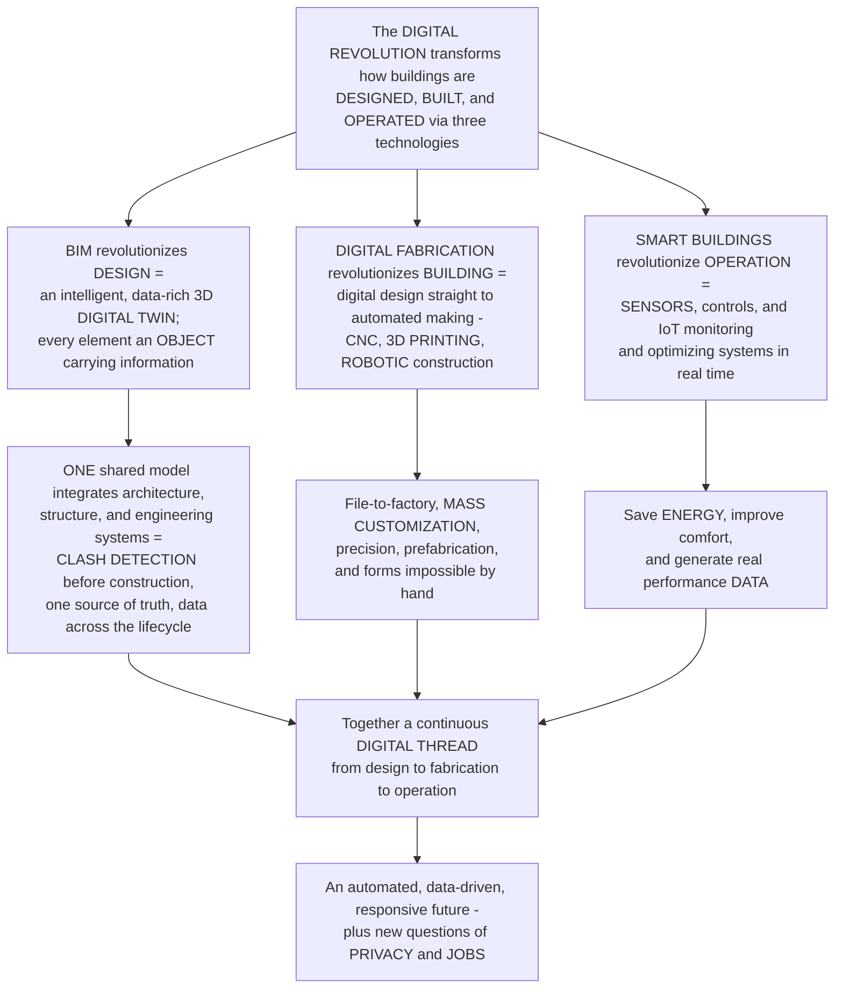

# BIM, Digital Fabrication and Smart Buildings

> [!abstract] TL;DR
> **The digital revolution is transforming architecture at every stage of a building's life — how it is DESIGNED, how it is BUILT, and how it OPERATES — through three connected technologies that together form one continuous DIGITAL THREAD from intent to occupancy.** First, **BIM (Building Information Modeling)** revolutionizes **design and coordination**: where old drawings were "dumb" lines, a BIM model is an intelligent, data-rich 3D **digital twin** in which every element — a wall, a window, a duct — is a real *object* carrying information (geometry, material, cost, performance, manufacturer, schedule). One shared, coordinated model integrates architecture, structure, and all the engineering systems, so **clashes** (a pipe running through a beam) are detected and resolved in the computer *before* construction, everyone works from one source of truth, and data flows through the whole **lifecycle** — design, 4D scheduling, 5D cost, and eventually facility management. Second, **digital fabrication** revolutionizes how buildings are **built** — the direct link from digital design to automated manufacturing: CNC machines, laser cutters, **3D printing** (including whole 3D-printed concrete houses), and **robotic construction** (robots that lay brick, weld, or spray material). This enables "**file-to-factory**" design-for-manufacture, **mass customization** (making thousands of *unique* parts nearly as cheaply as identical ones), precision, off-site prefabrication, and forms impossible by hand. Third, **smart buildings** revolutionize how buildings **operate** — buildings embedded with **sensors**, controls, and connectivity (the **Internet of Things**) that monitor and automatically optimize lighting, HVAC, security, and energy in real time, responding to occupancy, weather, and use — saving energy, improving comfort, and generating data on how buildings actually perform. Together they point toward an automated, data-driven, responsive future — and raise new questions about **privacy, jobs, and the human role**.

---

## Intuition

**Analogy — the same three revolutions that transformed *making a car* are now transforming *making a building*.** Think of how a car goes from idea to driveway. Once, it was drawn on paper, hand-built by craftsmen, and then sold and forgotten. Today it is (1) *designed* as a complete 3D computer model where every bolt, wire, and panel is a smart object that "knows" its size, material, cost, and supplier — so engineers catch a fuel line touching a hot exhaust *on the screen*, months before the first prototype; (2) *built* by robots and CNC machines that read those digital files directly and stamp, weld, and assemble with a precision no hand can match; and (3) *operated* as a rolling computer stuffed with sensors that constantly watch the engine, adjust the fuel mix, and phone home with data. **Architecture is now living through exactly these three revolutions — but for buildings.** BIM is the smart 3D model of the whole building; digital fabrication is the robots and printers that build straight from that model; smart buildings are the sensor-laden, self-adjusting operation.

Extend the analogy into the discipline and the whole subject appears. The old way was **analog**: buildings were represented by flat, disconnected drawings — a "dumb" set of lines that a human had to *interpret*, and that carried no information about material, cost, or performance. If the architect's plan and the engineer's ductwork collided, nobody found out until a worker on site hit a beam with a pipe — an expensive surprise. The digital way replaces that with a single **intelligent model**: change a window's width once and every plan, section, schedule, and cost updates automatically, because they are all *views* of one database. That same model then drives the machines that cut and print and assemble the parts, and finally hands off to the sensors that run the finished building. The thread never breaks — **design intent flows into fabrication flows into operation** — and each stage feeds data back to make the next building better. The promise is a construction industry that finally becomes as precise, productive, and data-rich as manufacturing; the peril is a built environment that watches us, and that automates away craft and jobs. Understanding BIM, digital fabrication, and smart buildings is understanding how the digital revolution is transforming the *entire lifecycle* of the built environment.

---

## How It Works

### Core mechanics

The three technologies are best understood as a relay across the building's life, joined by a continuous **digital thread**:

1. **From analog drawings to the intelligent model — BIM.** A traditional drawing is a set of *lines a human interprets*; a **BIM** model is an **object-oriented, data-rich 3D database** of the building. Every element is a **parametric object** — a wall, window, beam, or duct that carries **information**: geometry, material, thermal and structural performance, cost, manufacturer, and schedule. Because plans, sections, elevations, schedules, and quantities are all *views* of one model, a single edit propagates everywhere — the model is the **single source of truth**.
2. **Coordination and clash detection — the core value of BIM.** The building's architecture, structure, and all **MEP** (mechanical, electrical, plumbing) systems are federated into one coordinated model. Software then runs **clash detection**, finding geometric conflicts — a duct through a beam, a pipe through a stair — so they are resolved *in the model* where change is nearly free, instead of on site where it is catastrophic. This is the logic of the **MacLeamy curve**: **front-load the design effort** to the early phases where the ability to influence cost and performance is high and the cost of change is low.
3. **BIM across the lifecycle.** The model carries data downstream: **design → analysis and simulation** (energy, structure, daylight) → **4D** construction scheduling → **5D** cost → **facility management and operation** (an as-built model handed to the owner). **Interoperability** standards (**IFC / openBIM**) let different disciplines' tools exchange the model, and BIM is now **mandated** on many large public projects — transforming how the industry coordinates.
4. **From file to factory — digital fabrication.** **Digital fabrication** is the direct link from **digital design to automated manufacturing and construction** — "**file-to-factory**," or **DfMA** (design for manufacture and assembly). The technologies span **subtractive** (CNC milling, laser and water-jet cutting) and **additive** (**3D printing / additive manufacturing**, from components to whole **3D-printed concrete buildings**), plus **robotic fabrication and construction** — robots that lay brick, weld, weave, and spray (the work of **Gramazio Kohler** and **ICD Stuttgart**).
5. **What digital fabrication unlocks.** Chief among its capabilities is **mass customization** — because a CNC machine or printer just reads a *different file*, making a thousand **unique** parts costs almost the same as a thousand identical ones, collapsing the old economy of standardization. It adds **precision**, the ability to realize **complex non-standard geometry** (rationalizing parametric forms into buildable parts), off-site **prefabrication and modular** construction, and new material processes — what Mario Carpo calls the "**second digital turn**."
6. **From static shell to responsive organism — smart buildings.** A **smart building** is embedded with **sensors, actuators, controls, and connectivity** (the **Internet of Things**). A **building management/automation system (BMS/BAS)** **monitors and automatically optimizes** HVAC, lighting, security, access, and energy **in real time**, responding to occupancy, weather, use, and demand. The payoff is **energy savings, comfort, efficiency, and predictive maintenance**, plus a stream of **performance data** that closes the loop between how a building was *designed* to perform and how it *actually* does — feeding **digital twins** for operation and even **kinetic** facades that physically respond.
7. **The integrating layer — data, AI, and the digital twin.** BIM + fabrication + sensing converge into an integrated ecosystem sometimes called **Construction 4.0**. A **digital twin** is a live, data-connected virtual model that mirrors the real building through its life; **AI and machine learning** appear in **generative design**, construction robotics and automation, **predictive building operation**, and **computer vision** on site — and raise the stakes on **productivity, sustainability, privacy, jobs, and the human role**.

### Flow / Architecture



---

## Key Concepts

**Secondary (can explain to a bright 16-year-old):**
- **A BIM model is a "smart" 3D building, not a drawing.** Old blueprints were just lines. A BIM model is a computer model where every wall and window is a real object that *knows* what it is made of, what it costs, and who makes it. Change something once and every plan updates by itself.
- **Catch the mistakes on the screen, not on the site.** When you combine everyone's models, the computer spots a pipe crashing into a beam *before* anyone builds it — so you fix it cheaply on the screen instead of expensively with a sledgehammer on site.
- **Robots and printers can build straight from the file.** Machines read the digital design directly — CNC cutters, and even printers that squeeze out whole concrete houses layer by layer, and robots that lay bricks. This lets you make lots of *different* shapes almost as cheaply as identical ones.
- **Smart buildings sense and adjust themselves.** A modern building is full of sensors that notice when a room is empty or the sun comes out, and it automatically turns down the lights and heating to save energy and keep people comfortable.

**Undergraduate (needs some background):**
- **Object-oriented, parametric modeling.** BIM's power comes from **parametric objects** with embedded **attributes** and **relationships**: a door "belongs to" a wall and moves with it; a beam carries its section, material, and load. Because every drawing is a *view* of the same object database, the model is **consistent by construction** — no more coordinating twenty drawings by hand.
- **Clash detection and the MacLeamy curve.** **Hard clashes** (solids overlapping) and **soft clashes** (violated clearances) are found by geometric intersection tests across federated models. The **MacLeamy curve** is the economic argument: shift design effort *earlier*, into the phase where the **ability to impact cost and performance is high** and the **cost of change is low** — BIM makes that front-loading practical.
- **The nD lifecycle: 3D → 4D → 5D → 6D.** Beyond 3D geometry, BIM adds **4D** (linking elements to a construction *schedule*), **5D** (linking to *cost*), and **6D** (handing an as-built model to **facility management**). **Interoperability** via **IFC/openBIM** keeps the model exchangeable across disciplines and tools.
- **File-to-factory and DfMA.** Digital fabrication rests on **design for manufacture and assembly**: authoring geometry that a **CNC** router, laser cutter, or robot can execute directly, and **rationalizing** complex parametric surfaces into flat, foldable, or repeatable buildable pieces. Off-site **prefabrication** moves work into a controlled factory, improving quality and speed.
- **Mass customization economics.** In traditional manufacturing, unique parts are far costlier than identical ones because each design needs its own tooling/mould/setup, amortized over few units. Digital fabrication has **near-zero per-design tooling cost** — the machine just loads a new file — so **cost per part becomes almost independent of variety**, the economic engine behind bespoke, non-standard architecture.
- **Smart buildings and the BMS.** A **building management system** closes control loops with **sensors** (occupancy, CO2, temperature, light) and **actuators** (dampers, valves, dimmers), running **schedules and optimization** that beat static timers — the operational counterpart to the passive/active design choice.

**Graduate (system-level thinking):**
- **BIM as a socio-technical shift, not just software.** As Randy Deutsch argues, BIM's hardest problem is **integrated practice**: reorganizing fragmented design–build workflows, contracts, liability, and data ownership so that early collaboration (integrated project delivery) can actually happen. Adoption cost, workflow disruption, and the "who owns the model" question are as decisive as the tools.
- **The second digital turn and the collapse of standardization.** Mario Carpo frames digital fabrication as reversing the industrial logic of *identical mass production*: when unique and standard cost the same, **variation is free**, and design can pursue non-standard, data-rich, particularized form. This is a genuine break in architecture's political economy of making, not a styling trend.
- **Robotic construction and the reconfiguration of the site.** Gramazio and Kohler's "**robotic touch**" reframes the robot as a *design tool* whose specific capabilities (reach, dexterity, additive layering) generate new **material and tectonic** languages — bespoke brickwork, spatial weaving, in-situ printing. This couples parametric design to physical process and pushes construction toward **automation**, with consequences for labor, safety, and craft.
- **The digital twin and closing the performance loop.** The endgame integrates BIM + IoT + AI into a **digital twin**: a live model that ingests operational sensor data, so **predicted** and **measured** performance can be compared and the building — and the *next* design — continuously improved. This is where **machine learning** enters (generative design, predictive maintenance, computer-vision progress monitoring), and where the deepest tensions live: **surveillance and privacy** in sensor-saturated space, **cybersecurity** of building controls, the **digital divide** in who can afford it, and the risk of **over-automation and the loss of craft** and jobs.

---

## Python Demo

```python
# BIM, digital fabrication and smart buildings, quantified:
#   (a) THE MacLEAMY CURVE - why BIM front-loads design effort. The ability to
#       impact cost/performance is HIGH early and collapses as decisions lock in,
#       while the cost of a change RISES steeply once built. Traditional practice
#       peaks its effort LATE (construction documents); BIM/integrated practice
#       shifts effort EARLY, where changes are cheap and influential.
#   (b) BIM CLASH DETECTION - federate several building systems as 3D boxes and
#       count the geometric CLASHES the coordinated model catches BEFORE construction,
#       plus the cost of fixing an error vs the phase it is discovered in.
#   (c) MASS-CUSTOMIZATION ECONOMICS - the collapse of the cost premium for CUSTOM
#       parts. Traditional cost/part rises with part-variety (tooling per design);
#       digital fabrication makes 1000 DIFFERENT parts nearly as cheap as 1000 identical.
# Requires: numpy, matplotlib
import numpy as np
import matplotlib.pyplot as plt

# ============================================================
# (a) MacLeamy curve over a normalized project timeline
# ============================================================
t = np.linspace(0, 1, 500)                 # 0 = pre-design ... 1 = construction
def bump(x, mu, sig): return np.exp(-0.5*((x-mu)/sig)**2)

impact    = 1 - 1/(1 + np.exp(-11*(t-0.42)))   # ability to impact cost: high early, falls
chg_cost  = 1/(1 + np.exp(-11*(t-0.58)))        # cost of a change: low early, rises steeply
effort_tr = bump(t, 0.63, 0.10)                 # TRADITIONAL effort - peaks late
effort_bm = bump(t, 0.31, 0.11)                 # BIM/INTEGRATED effort - shifted early

# ============================================================
# (b) Clash detection: federate systems as axis-aligned bounding boxes
# ============================================================
rng = np.random.default_rng(7)
def boxes(n, size):                              # -> array of (x0,y0,z0,x1,y1,z1)
    c = rng.uniform(0, 12, (n, 3))
    return np.hstack([c - size/2, c + size/2])
systems = {"structure": boxes(8, 1.4), "ducts": boxes(14, 0.9),
           "pipes": boxes(18, 0.55), "cables": boxes(22, 0.4)}

def overlap(a, b):                               # AABB intersection test
    return np.all(a[:3] < b[3:]) and np.all(a[3:] > b[:3])

names, clash_pts = list(systems), []
for i in range(len(names)):
    for j in range(i + 1, len(names)):           # clashes BETWEEN different systems
        for a in systems[names[i]]:
            for b in systems[names[j]]:
                if overlap(a, b):
                    lo = np.maximum(a[:3], b[:3]); hi = np.minimum(a[3:], b[3:])
                    clash_pts.append((lo + hi) / 2)
clash_pts = np.array(clash_pts) if clash_pts else np.empty((0, 3))
n_clash = len(clash_pts)

# cost of fixing ONE error vs the phase it is caught in (relative units, log-scaled)
phases = ["Design", "Docs", "Bidding", "Construction", "Operation"]
fix_cost = np.array([1, 5, 20, 100, 500], float)
print(f"Clash detection: {n_clash} clashes caught in the coordinated model (pre-construction).")
print(f"If those {n_clash} clashes were instead hit on site, cost multiplier ~"
      f"{fix_cost[3]/fix_cost[0]:.0f}x vs catching them in design.")

# ============================================================
# (c) Mass-customization: cost per part vs part-variety
# ============================================================
N = 1000.0                                       # batch of 1000 parts
V = np.arange(1, 1001)                            # number of DISTINCT part designs
m  = 20.0                                         # material + machine time per part
K  = 2000.0                                       # tooling/mould/setup per design (traditional)
Kd = 6.0                                          # negligible per-file cost (digital)
cost_trad = m + K  * V / N                         # rises: tooling spread over fewer identical parts
cost_dig  = m + Kd * V / N                          # nearly flat: machine just loads a new file

# ============================================================
# PLOT
# ============================================================
fig = plt.figure(figsize=(14, 10))
gs = fig.add_gridspec(2, 2, height_ratios=[1.0, 1.0], hspace=0.34, wspace=0.26)

# ---- (a) MacLeamy curve ----
axa = fig.add_subplot(gs[0, 0])
axa.plot(t, impact,    color="#2a9d8f", lw=2.4, label="ability to impact cost / performance")
axa.plot(t, chg_cost,  color="#d1495b", lw=2.4, label="cost of a design change")
axa.plot(t, effort_tr, color="#8d99ae", lw=2.2, ls="--", label="TRADITIONAL effort (peaks late)")
axa.plot(t, effort_bm, color="#e76f51", lw=2.6, label="BIM / integrated effort (shifted early)")
axa.annotate("front-load effort\nwhere change is cheap\nand influential",
             xy=(0.31, 0.62), xytext=(0.02, 0.90), fontsize=8,
             arrowprops=dict(arrowstyle="->", color="#e76f51"))
axa.set_xlabel("project timeline  (pre-design -> construction)")
axa.set_ylabel("relative magnitude")
axa.set_title("(a) The MacLeamy curve: BIM front-loads design effort", fontsize=10)
axa.legend(fontsize=7, loc="center right"); axa.grid(alpha=0.3)

# ---- (b) clash detection (x-y projection) + fix-cost inset logic ----
axb = fig.add_subplot(gs[0, 1])
palette = {"structure": "#264653", "ducts": "#2a9d8f", "pipes": "#e9c46a", "cables": "#8d99ae"}
for name, bx in systems.items():
    cx, cy = (bx[:, 0] + bx[:, 3]) / 2, (bx[:, 1] + bx[:, 4]) / 2
    axb.scatter(cx, cy, s=45, color=palette[name], label=name, alpha=0.8, edgecolor="white")
if n_clash:
    axb.scatter(clash_pts[:, 0], clash_pts[:, 1], marker="x", s=130, color="#c1121f",
                linewidths=2.6, label=f"CLASH  (n={n_clash})", zorder=5)
axb.set_xlabel("plan x  (m)"); axb.set_ylabel("plan y  (m)")
axb.set_title(f"(b) Clash detection: {n_clash} conflicts caught\nin the model BEFORE construction",
              fontsize=10)
axb.legend(fontsize=7, loc="upper right"); axb.grid(alpha=0.3)

# ---- (c) cost of fixing an error vs project phase (the 'detect early' value) ----
axc = fig.add_subplot(gs[1, 0])
axc.bar(phases, fix_cost, color=["#2a9d8f", "#8ab17d", "#e9c46a", "#e76f51", "#c1121f"])
axc.set_yscale("log")
for p, c in zip(phases, fix_cost):
    axc.text(p, c * 1.15, f"{c:.0f}x", ha="center", fontsize=8, weight="bold")
axc.set_ylabel("relative cost to fix ONE error  (log)")
axc.set_title("(c) Cost of fixing an error vs phase it is caught\ncheap in design, catastrophic on site",
              fontsize=10)
axc.grid(axis="y", alpha=0.3)

# ---- (d) mass-customization economics ----
axd = fig.add_subplot(gs[1, 1])
axd.plot(V, cost_trad, color="#d1495b", lw=2.6, label="TRADITIONAL (tooling per design)")
axd.plot(V, cost_dig,  color="#2a9d8f", lw=2.6, label="DIGITAL fabrication (file-to-factory)")
axd.set_yscale("log")
axd.annotate("custom premium COLLAPSES:\n1000 different parts nearly\nas cheap as 1000 identical",
             xy=(950, cost_dig[-1]), xytext=(120, 300), fontsize=8,
             arrowprops=dict(arrowstyle="->", color="#2a9d8f"))
axd.set_xlabel("part variety  (number of distinct designs in a batch of 1000)")
axd.set_ylabel("cost per part  (log)")
axd.set_title("(d) Mass customization: cost per part vs variety", fontsize=10)
axd.legend(fontsize=8, loc="center right"); axd.grid(alpha=0.3)

plt.savefig("bim_digital_fabrication_and_smart_buildings.png", dpi=120, bbox_inches="tight")
plt.show()

# Takeaway:
#  (a) BIM's payoff is captured by the MacLeamy curve: shift effort EARLY, where the
#      ability to influence cost is high and the cost of change is low.
#  (b) Federating systems into one model lets software catch dozens of CLASHES that would
#      otherwise be discovered - expensively - by a worker on site.
#  (c) The cost of the SAME error explodes by orders of magnitude the later it is caught:
#      the whole economic case for coordinating in the digital model first.
#  (d) Digital fabrication severs cost from variety - unique parts stop being a luxury,
#      which is the economic engine of mass-customized, non-standard architecture.
```

Running this prints the number of clashes the coordinated model catches and the cost multiplier of hitting them on site instead, then produces four panels: the **MacLeamy curve** showing why BIM front-loads design effort; a **clash-detection** plan view where federated systems (structure, ducts, pipes, cables) are checked for geometric conflicts and every clash is flagged; the **escalating cost of fixing one error** by the phase it is caught in (log scale — cheap in design, catastrophic on site); and the **mass-customization** economics where digital fabrication's flat cost-per-part severs the old link between variety and price.

---

## Real-World Applications

> **BIM mandated on national infrastructure — the UK and Singapore.** The UK's Level 2 BIM mandate for centrally-procured public projects (from 2016) and Singapore's BIM submission requirements turned BIM from an option into a baseline for major works. The driver is exactly this note's thesis: a coordinated, data-rich model reduces the cost overruns and rework that plague construction, and hands government owners an as-built asset model for **facility management** across decades of operation.

> **Clash detection on megaprojects — the coordinated model as risk control.** On large, systems-dense buildings (hospitals, airports, stadiums) MEP and structure are federated in tools like Navisworks and clash-checked weekly, resolving thousands of conflicts *in the model*. The value is precisely panel (b)/(c) of the demo: a duct-through-beam caught on a screen costs a coordination note; the same conflict discovered by a fitter on the 30th floor costs a change order, delay, and rework.

> **3D-printed concrete buildings and robotic brickwork.** From ICON's 3D-printed houses in Texas to the world's growing catalogue of printed structures, and Gramazio Kohler's robotically-assembled brick facades (Gantenbein Vineyard) and the ICD/ITKE research pavilions in Stuttgart, **digital fabrication** is building real, occupiable architecture whose forms and per-unit variation would be uneconomic — or impossible — by hand. These are the "file-to-factory" and "mass customization" claims made physical.

> **The Edge, Amsterdam — the smart building as instrumented organism.** Often called the world's smartest office, The Edge runs on tens of thousands of **sensors** feeding a building management system that optimizes lighting, HVAC, and desk allocation against real-time occupancy and weather, cutting energy dramatically. It is the operational layer of this note — sensors, IoT, and control loops closing the gap between design intent and measured performance — and a live example of the **digital twin** for operation.

> **Generative design and computer vision on site — AI enters the workflow.** Tools like Autodesk's generative design explore thousands of structural or spatial options against constraints, while construction sites deploy **computer vision** (drones and cameras comparing site photos to the BIM model) for automated **progress monitoring** and safety. This is the convergence of BIM + fabrication + sensing + machine learning into an integrated **Construction 4.0** ecosystem.

---

## Common Pitfalls

- **"BIM is just 3D CAD."** The whole point is the **I** — *information*. Modeling pretty geometry without embedded, reliable data (materials, cost, performance, classification) produces a nice picture but throws away clash detection, quantities, scheduling, and lifecycle handover — the actual value.
- **Treating BIM as a tool purchase, not a process change.** As Deutsch stresses, BIM's benefits require **integrated, early collaboration** across disciplines, with new contracts, data-ownership rules, and workflows. Bolting the software onto a fragmented, drawing-era process ("lonely BIM") captures almost none of the coordination payoff.
- **Garbage-in models and false confidence.** A federated model is only as trustworthy as its inputs. Out-of-date, mis-modeled, or wrongly-classified elements produce **false clashes** (noise that erodes trust) and **missed clashes** (real conflicts that slip to site). Model quality, level of development (LOD), and disciplined updates are prerequisites.
- **Designing forms that can't be rationalized for fabrication.** Parametric software makes it easy to draw geometry that no machine can economically cut, print, or assemble. Without **design for manufacture and assembly** and early fabrication input, a stunning surface becomes a buildability and cost nightmare — the gap between the file and the factory.
- **Smart-building complexity and cybersecurity blind spots.** Sensor-and-controls-saturated buildings add failure modes: brittle proprietary systems, integration headaches, and a real **cyberattack surface** (building controls are IT systems). "Smart" that nobody can maintain, or that can be hacked, is a liability, not an asset.
- **Ignoring privacy, labor, and the human role.** Occupancy sensors and cameras generate data about *people*, raising **surveillance and privacy** concerns; automation and robotic construction reshape **jobs and craft**. Deploying the technology without addressing consent, data governance, and workforce transition invites backlash and dehumanization — the questions the future of architecture must answer.

---

## Related Concepts

*This note opens the Architecture vault's S06 (Sustainable, Digital and Future Architecture) and is the "digital transformation of the building lifecycle" hub. Its S06 and vault siblings are referenced here in prose: **The Design Process and Architectural Representation** is the analog ancestor BIM digitizes; **Parametric and Computational Design** authors the complex geometry that digital fabrication then rationalizes and builds; **Construction and Building Technology** is the physical assembly that file-to-factory and robotic construction automate; **Building Systems and Environmental Control** supplies the MEP systems that BIM coordinates and the smart building operates; **Sustainable and Green Architecture** carries the energy and decarbonization agenda these tools serve; and **The Reach and Future of Architecture** takes up the automated, data-driven, and ethical questions this note raises. Those siblings are prose-only; the cross-vault links below are Glob-verified to exist, and this note carries a deliberately distinct basename so those engineering, robotics, and AI notes link **to** it.*

- [[Robotics_and_Control_Overview]] — the automation and control discipline underpinning robotic construction and robotic fabrication on the building site.
- [[Robotic_Manipulation_and_Grasping]] — the manipulation and grasping problem behind robots that lay brick, place components, and assemble on site.
- [[Human_Robot_Interaction_and_Safety]] — the safety and collaboration questions when construction robots share the site with human workers — the "jobs and human role" issue made concrete.
- [[Neural_Network_Basics]] — the machine-learning foundation for predictive building operation, generative design, and construction analytics.
- [[GAN]] — a generative model class used in generative and computational design to synthesize form and layout options.
- [[Diffusion_Models]] — the generative-AI approach now driving text-to-image and design-exploration tools entering the architectural workflow.
- [[Object_Detection]] — the computer-vision task behind automated site progress monitoring and safety checks against the BIM model.
- [[Delivery_and_Execution]] — the project-delivery and execution discipline where BIM coordination, scheduling, and integrated project delivery actually live.
- [[Change_Management]] — the organizational change-management lens on the hardest part of BIM adoption: shifting a fragmented, drawing-era industry to integrated digital practice.
- [[3D_Transforms_and_Matrices]] — the 3D geometry and transform math underlying the modeling of a BIM digital twin.

---

## Review Questions

**Secondary:**
1. Explain the difference between an old paper blueprint and a BIM model in your own words, using the idea that in BIM every wall or window is a "smart object." Then describe one way each of the three technologies — BIM, digital fabrication, and smart buildings — changes a building at a different stage of its life (designing it, building it, running it).

**Undergraduate:**
2. Using the **MacLeamy curve** and the idea of **clash detection**, explain *why* catching a duct-through-beam conflict in a coordinated BIM model is so much cheaper than discovering it on site. Which two quantities does the MacLeamy curve say move in opposite directions over the project timeline, and how does BIM exploit that? Then explain, with the **mass-customization** economics, why digital fabrication makes a thousand *unique* parts nearly as cheap as a thousand identical ones.

**Graduate:**
3. A developer wants to deliver a large office building as a fully "digital" project — BIM coordination, off-site robotic/CNC prefabrication, and a sensor-rich smart-building operating layer feeding a digital twin. Argue how the three layers should connect into a continuous **digital thread**, what makes each layer *hard* (adoption and integrated practice for BIM; DfMA and buildability for fabrication; cybersecurity, maintenance, and interoperability for the smart layer), and how you would weigh the productivity and sustainability upside against the **privacy, labor, and human-role** concerns — including who owns the operational data and how the workforce transitions.

---

## Sources

- Chuck Eastman, Paul Teicholz, Rafael Sacks & Kathleen Liston, *BIM Handbook: A Guide to Building Information Modeling* (Wiley) — the standard comprehensive reference on BIM tools, workflows, and lifecycle — [Publisher page](https://www.wiley.com/en-us/BIM+Handbook%3A+A+Guide+to+Building+Information+Modeling+for+Owners%2C+Designers%2C+Engineers%2C+Contractors%2C+and+Facility+Managers%2C+3rd+Edition-p-9781119287537)
- Mario Carpo, *The Second Digital Turn: Design Beyond Intelligence* (MIT Press) — digital fabrication, non-standard form, and the collapse of the standardization economy — [Publisher page](https://mitpress.mit.edu/9780262534024/the-second-digital-turn/)
- Fabio Gramazio & Matthias Kohler, *The Robotic Touch: How Robots Change Architecture* (Park Books) — robotic fabrication and construction as a new architectural design tool — [Publisher page](https://www.park-books.com/index.php?pd=pb&lang=en&page=books&book=978-3-906027-37-1)
- Randy Deutsch, *BIM and Integrated Design: Strategies for Architectural Practice* (Wiley) — the socio-technical, practice-and-process side of adopting BIM — [Publisher page](https://www.wiley.com/en-us/BIM+and+Integrated+Design%3A+Strategies+for+Architectural+Practice-p-9780470572511)
- buildingSMART International, *Industry Foundation Classes (IFC) and openBIM* — the interoperability standard for exchanging BIM models across disciplines — [buildingSMART](https://www.buildingsmart.org/standards/bsi-standards/industry-foundation-classes/)

---

#architecture #bim #digital-fabrication #smart-buildings #digital-twin
